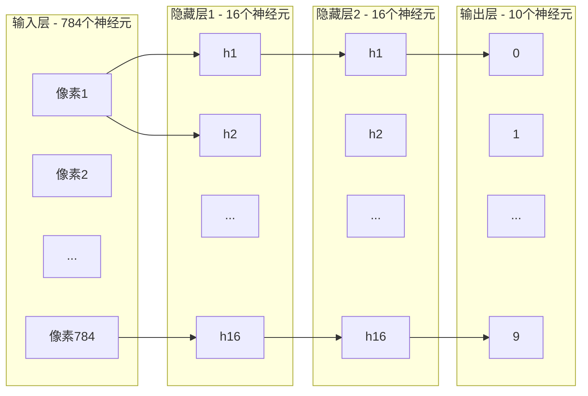
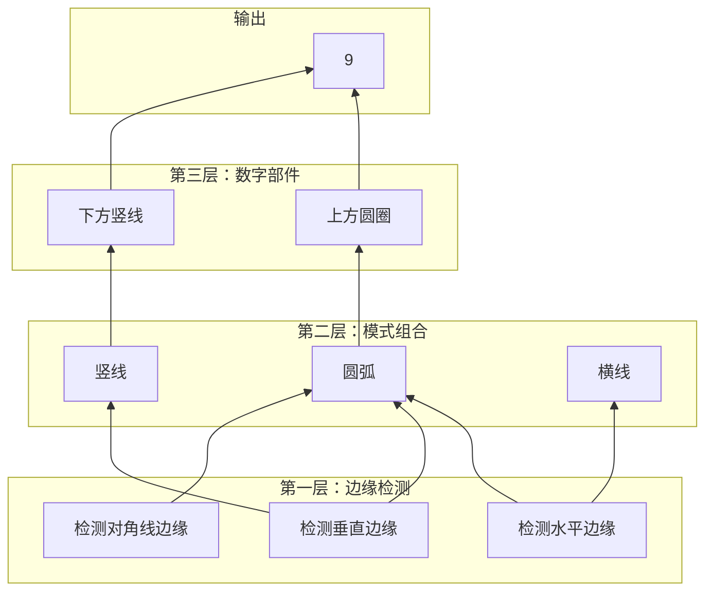
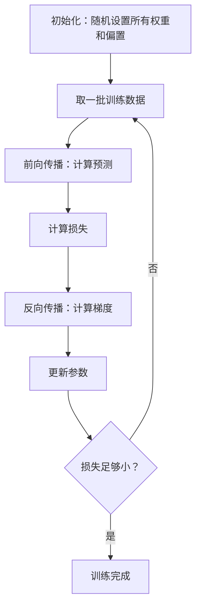

+++
title = "神经网络原理"
date = '2026-05-02T22:32:27+08:00'
draft = false
weight = 13
tags = ["AI", "LLM", "面试"]
categories = ["AI", "面试"]
+++
想象你手写了一个数字"3"，然后拿给计算机看——它是怎么"认出"这是3而不是8的？这个看似简单的问题，背后隐藏着整个深度学习的核心思想。让我们从最直觉的方式开始，一层一层揭开神经网络的面纱。

## 一、从像素到数字：问题的本质

### 1.1 手写数字识别

假设我们有一张28x28像素的灰度手写数字图片。每个像素是一个0到1之间的数字——0代表全黑，1代表全白。这意味着一张图片其实就是一个包含784个数字的列表。

```
图片 → [0.0, 0.0, 0.12, 0.85, 0.93, ..., 0.0]  (784个数字)
```

我们的目标是设计一个函数，输入这784个数字，输出10个数字，分别代表这张图是0~9每个数字的概率：

```
f(784个像素值) → [P(0), P(1), P(2), ..., P(9)]
```

比如输入一张手写的"3"，我们期望输出类似：

```
[0.01, 0.02, 0.05, 0.89, 0.01, 0.01, 0.00, 0.01, 0.00, 0.00]
                    ^^^^
                  "3"的概率最高
```

这就是神经网络要解决的问题。但关键问题是：这个函数 `f` 长什么样？

### 1.2 为什么传统编程行不通

你可能会想：能不能写一堆if-else规则？比如"如果上方有一个圆弧，下方也有一个圆弧，那就是3"。

问题在于：人类写字的方式千变万化。同一个"3"，有人写得圆润，有人写得尖锐，有人偏左，有人偏右。你几乎不可能用明确的规则覆盖所有情况。

我们需要的是一种**从数据中自动学习规则**的方法——这就是神经网络。

## 二、神经网络的结构

### 2.1 神经元：最基本的单元

让我们从最简单的单元开始。一个**神经元**本质上就是一个持有数字的容器。这个数字叫做**激活值（activation）**，取值范围通常在0到1之间。

你可以把它想象成一个灯泡：0表示完全熄灭，1表示完全点亮，中间的值表示不同亮度。

### 2.2 层：神经元的组织方式

神经网络把神经元组织成**层（layer）**：



- **输入层**：784个神经元，每个对应一个像素值
- **隐藏层**：中间的层（这里用2层，每层16个神经元）
- **输出层**：10个神经元，对应数字0~9

为什么叫"隐藏层"？因为在训练数据中，我们只知道输入（像素）和输出（标签），中间层在"学什么"我们并不直接指定——它们是被自动学出来的。

### 2.3 一个美好的希望

在最理想的情况下，我们希望隐藏层中的每个神经元能学会识别某种有意义的"模式"。

比如，识别数字"9"可能可以分解为：
- 上半部分有一个小圆圈
- 右边有一条竖线

而识别"小圆圈"又可以进一步分解为：
- 某些位置有边缘（edge）



这种"边缘 → 模式 → 部件 → 数字"的层次分解正是深度神经网络的核心思想：**每一层在前一层的基础上，学习越来越抽象的特征**。

当然，网络实际上是否真的学到了这种整洁的分层结构？这是后话。现在让我们先搞清楚数学上到底发生了什么。

## 三、从一层到下一层：权重、偏置与激活函数

### 3.1 加权求和

核心问题来了：一个隐藏层神经元的激活值，是如何从上一层所有神经元的激活值计算出来的？

答案是：**加权求和（weighted sum）**。

假设上一层有 $n$ 个神经元，激活值分别是 $a_1, a_2, ..., a_n$。当前神经元会给每个输入分配一个**权重（weight）**：$w_1, w_2, ..., w_n$。然后计算：

$$z = w_1 a_1 + w_2 a_2 + \cdots + w_n a_n$$

**权重的含义是什么？**

- 正的大权重意味着"我很关注这个输入神经元，如果它亮了，我倾向于也亮起来"
- 负的大权重意味着"如果这个输入神经元亮了，我倾向于灭掉"
- 接近0的权重意味着"我不在乎这个输入"

想象你要检测图片某个区域是否有一条水平边缘。你会：
- 对那个区域的像素赋予**正权重**
- 对周围不相关的像素赋予**接近0的权重**
- 对需要是暗色的区域赋予**负权重**

### 3.2 偏置

仅有加权求和还不够。考虑这种情况：你想让一个神经元只有在输入信号足够强的时候才"点亮"。这就需要一个**偏置（bias）**：

$$z = w_1 a_1 + w_2 a_2 + \cdots + w_n a_n + b$$

偏置 $b$ 控制了神经元"多容易被激活"：
- 大的正偏置：即使输入不强，也容易激活
- 大的负偏置：需要非常强的输入信号才能激活

你可以把偏置理解为神经元的"阈值"——它决定了加权求和需要多大才能让神经元有意义地激活。

### 3.3 激活函数：引入非线性

现在 $z$ 可以是任意实数，但我们希望激活值在某个合理的范围内。更重要的是，如果没有非线性变换，无论你堆多少层，整个网络都只等价于一个线性函数——这严重限制了网络的表达能力。

这就是**激活函数**的作用。

#### Sigmoid函数

经典的选择是 Sigmoid 函数：

$$\sigma(z) = \frac{1}{1 + e^{-z}}$$

```
输出
1.0 |                    ___________
    |                 /
    |               /
0.5 |             /
    |           /
    |         /
0.0 |________/
    +---+---+---+---+---+---+---→ z
       -6  -4  -2   0   2   4   6
```

它把任意实数"压缩"到0到1之间：
- 很大的正数 → 接近1
- 很大的负数 → 接近0
- 0附近 → 平滑过渡

Sigmoid的输出可以直觉地理解为"这个神经元被激活的程度"。

#### ReLU函数

现代网络更常用 **ReLU（Rectified Linear Unit）**：

$$\text{ReLU}(z) = \max(0, z)$$

```
输出
    |              /
    |            /
    |          /
    |        /
    |      /
0   |____/
    +---+---+---+---+---→ z
      -2  -1   0   1   2
```

比Sigmoid计算更快，而且缓解了深层网络的梯度消失问题（这个我们在反向传播的文章中会详细讲）。

### 3.4 完整的计算公式

把上述三步组合起来，一个神经元的激活值计算为：

$$a = \sigma\left(\sum_{i=1}^{n} w_i a_i^{(\text{prev})} + b\right)$$

其中 $\sigma$ 是激活函数，$a_i^{(\text{prev})}$ 是上一层第 $i$ 个神经元的激活值。

### 3.5 用矩阵表达

当你有一整层神经元时，所有这些计算可以用矩阵乘法优雅地表达。

假设上一层有 $n$ 个神经元，当前层有 $m$ 个神经元：

$$\begin{bmatrix} a_1 \\ a_2 \\ \vdots \\ a_m \end{bmatrix} = \sigma\left( \begin{bmatrix} w_{11} & w_{12} & \cdots & w_{1n} \\ w_{21} & w_{22} & \cdots & w_{2n} \\ \vdots & \vdots & \ddots & \vdots \\ w_{m1} & w_{m2} & \cdots & w_{mn} \end{bmatrix} \begin{bmatrix} a_1^{(\text{prev})} \\ a_2^{(\text{prev})} \\ \vdots \\ a_n^{(\text{prev})} \end{bmatrix} + \begin{bmatrix} b_1 \\ b_2 \\ \vdots \\ b_m \end{bmatrix} \right)$$

简洁地写成：

$$\mathbf{a} = \sigma(W\mathbf{a}^{(\text{prev})} + \mathbf{b})$$

矩阵 $W$ 的每一行包含了当前层一个神经元对上一层所有神经元的权重。这不仅数学上优雅，还让GPU并行计算变得高效。

## 四、参数的规模

让我们算一算。对于我们识别手写数字的网络（784-16-16-10结构）：

| 连接 | 权重数量 | 偏置数量 |
|------|---------|---------|
| 输入层 → 隐藏层1 | 784 x 16 = 12,544 | 16 |
| 隐藏层1 → 隐藏层2 | 16 x 16 = 256 | 16 |
| 隐藏层2 → 输出层 | 16 x 10 = 160 | 10 |
| **总计** | **12,960** | **42** |

总共 **13,002** 个参数！这些参数的不同取值，决定了网络会表现出什么样的行为。学习的过程，就是找到一组最优参数的过程。

对于GPT-3这样的大语言模型，参数量是1750亿（175 billion）。但核心思想是完全一样的：大量参数，通过数据学习最优值。

## 五、前向传播

数据从输入层经过每一层的计算，最终到达输出层的过程，叫做**前向传播（Forward Propagation）**：


### 5.1 Softmax：让输出变成概率分布

输出层通常使用 **Softmax** 而非 Sigmoid，因为我们希望10个输出之和为1（构成一个合法的概率分布）：

$$\text{softmax}(z_i) = \frac{e^{z_i}}{\sum_{j=0}^{9} e^{z_j}}$$

直觉理解：
- 先对每个原始输出取指数（$e^{z_i}$），确保为正
- 然后除以总和，归一化到0~1之间
- 结果是：原始输出越大，分得的概率越高；差距会被指数函数放大

举例：如果最后一层的原始输出是 $[1.2, 0.3, 0.1, 3.8, ...]$，那么3.8对应的那个（数字"3"）会获得远超其他的概率。

### 5.2 一次完整的前向传播示例

让我们跟踪一张手写数字"3"通过网络的过程：

```
步骤1: 输入层
  784个像素值 → a⁰ = [0.0, 0.0, 0.12, 0.85, 0.93, ...]

步骤2: 隐藏层1
  z¹ = W₁ · a⁰ + b₁
  a¹ = σ(z¹) → [0.72, 0.15, 0.91, ..., 0.03]  (16个值)

步骤3: 隐藏层2
  z² = W₂ · a¹ + b₂
  a² = σ(z²) → [0.44, 0.88, 0.12, ..., 0.67]  (16个值)

步骤4: 输出层
  z³ = W₃ · a² + b₃
  a³ = softmax(z³) → [0.01, 0.02, 0.05, 0.89, 0.01, ...]  (10个值)
                                          ^^^^
                                        "3"的概率最高
```

网络给出了正确的预测。但这里有一个关键前提——W和b的值是"正确的"。那么问题来了：这些参数是怎么确定的？

## 六、学习：损失函数与优化

### 6.1 损失函数

我们需要一种方式来衡量网络"有多差"，这就是**损失函数（Loss Function）**。

对于分类问题，常用**交叉熵损失（Cross-Entropy Loss）**：

$$L = -\sum_{i=0}^{9} y_i \log(\hat{y}_i)$$

其中 $y_i$ 是真实标签（one-hot编码），$\hat{y}_i$ 是网络的预测概率。

如果真实标签是"3"，即 $y = [0,0,0,1,0,0,0,0,0,0]$，那么损失简化为：

$$L = -\log(\hat{y}_3)$$

直觉理解：
- 如果网络对"3"预测了0.99的概率 → $L = -\log(0.99) = 0.01$（很小，很好）
- 如果网络对"3"预测了0.1的概率 → $L = -\log(0.1) = 2.3$（很大，很差）
- 如果网络对"3"预测了0.01 → $L = -\log(0.01) = 4.6$（非常大，非常差）

损失越小，说明网络的预测越接近真实标签。

### 6.2 在所有训练数据上的损失

单个样本的损失只反映一个案例。我们需要在所有训练数据上求平均：

$$\mathcal{L} = \frac{1}{N}\sum_{k=1}^{N} L_k$$

这就是整个网络的总损失。**学习的目标就是找到一组参数（所有的W和b），使这个总损失尽可能小**。

### 6.3 参数空间的直觉

想象损失函数的值取决于13,002个参数。这构成了一个13,002维空间中的"地形"。每一组参数对应地形上的一个点，地形的"高度"就是损失值。

我们要找到这个地形中的"低谷"——损失最小的那组参数。

当然，在13,002维空间中"看"地形是不可能的。但我们可以借助二维的直觉：

```
损失
  ^
  |  \      /\
  |   \    /  \    /\
  |    \  /    \  /  \
  |     \/      \/    \    ← 局部最小值
  |      ← 全局最小值     \
  +------------------------→ 参数
```

**梯度下降（Gradient Descent）**就是在这个地形上"下坡"的方法——但具体怎么做，就是下一篇"反向传播"要讲的核心内容了。

## 七、数据如何驱动学习

### 7.1 训练集、验证集、测试集

神经网络的学习需要大量标注好的数据。以手写数字识别为例，经典的MNIST数据集包含：

| 数据集 | 数量 | 用途 |
|-------|------|------|
| 训练集 | 60,000张 | 用于调整参数 |
| 测试集 | 10,000张 | 用于评估最终性能 |

核心原则：**测试集在训练过程中绝对不能使用**。否则就像考试前偷看了答案，无法评估真实能力。

### 7.2 训练流程概览



1. **随机初始化**：一开始所有参数是随机的，网络的表现和瞎猜差不多
2. **前向传播**：把训练数据喂给网络，得到预测结果
3. **计算损失**：比较预测和真实标签，量化网络有多差
4. **反向传播**：计算每个参数对损失的影响（梯度），这是下一篇文章的重点
5. **更新参数**：朝着让损失减小的方向微调参数
6. **重复**：不断循环，直到损失降到满意的水平

每完成一次上述循环（遍历完所有训练数据），称为一个 **epoch**。通常需要几十到几百个epoch才能训练出不错的效果。

## 八、网络设计的关键选择

### 8.1 网络深度与宽度

| 维度 | 含义 | 影响 |
|-----|------|-----|
| 深度（层数）| 隐藏层的数量 | 越深越能学习复杂的层次化特征，但也更难训练 |
| 宽度（每层神经元数）| 每层的神经元数量 | 越宽每层的表达能力越强，但参数也越多 |

经验法则：先从简单网络开始，逐渐增加复杂度，直到性能不再显著提升。

### 8.2 常见激活函数对比

| 激活函数 | 公式 | 优点 | 缺点 |
|---------|------|------|------|
| Sigmoid | $\frac{1}{1+e^{-z}}$ | 输出在(0,1)，概率解释 | 梯度消失，非零中心 |
| Tanh | $\frac{e^z - e^{-z}}{e^z + e^{-z}}$ | 零中心，比Sigmoid更好 | 仍有梯度消失 |
| ReLU | $\max(0, z)$ | 计算快，缓解梯度消失 | Dead ReLU问题 |
| Leaky ReLU | $\max(0.01z, z)$ | 解决Dead ReLU | 多一个超参数 |
| GELU | $z \cdot \Phi(z)$ | Transformer中常用 | 计算相对复杂 |

### 8.3 过拟合与欠拟合

```
          损失
           ^
           |  训练损失 ↘
           |            \_______________
           |
           |  验证损失 ↘
           |            \___    ↗ 开始上升
           |                \__/
           |
           +——————————————————————————→ 训练轮次
                         ^
                    最佳停止点
```

- **欠拟合（Underfitting）**：模型太简单，训练集上的表现都不好
- **过拟合（Overfitting）**：模型记住了训练数据的噪声，在新数据上表现很差

常见的对抗过拟合的方法：
- **更多训练数据**：最直接有效
- **正则化（Regularization）**：在损失函数中加入参数大小的惩罚项
- **Dropout**：训练时随机"关闭"一部分神经元，强迫网络学到更鲁棒的特征
- **早停（Early Stopping）**：当验证集损失开始上升时停止训练

## 九、不同类型的神经网络

到目前为止，我们介绍的是最基本的**全连接网络（Fully Connected Network / Dense Network）**——每一层的每个神经元与前一层的所有神经元相连。在实际应用中，针对不同类型的数据，人们设计了更高效的网络结构：

| 网络类型 | 核心思想 | 典型应用 |
|---------|---------|---------|
| 全连接网络（FCN） | 每个神经元连接前一层所有神经元 | 表格数据、简单分类 |
| 卷积神经网络（CNN） | 局部连接 + 权重共享，利用空间结构 | 图像识别、目标检测 |
| 循环神经网络（RNN） | 引入时间维度，有"记忆"能力 | 时序数据、早期NLP |
| Transformer | 注意力机制，并行处理序列 | 现代NLP、大语言模型 |
| 图神经网络（GNN） | 在图结构数据上学习 | 社交网络、分子结构 |

其中Transformer架构我们在后续的文章中会单独深入讲解。

## 十、总结：神经网络到底在做什么

让我们退后一步，从更高的视角来看。

一个神经网络本质上是一个**巨大的参数化函数**。它接收输入（如784个像素值），经过一系列矩阵乘法、加偏置、非线性激活的运算，输出一个结果（如10个概率值）。

网络的"智能"不在于其结构，而在于那些通过海量数据学习出来的参数。几万、几百万、甚至几十亿个精心调整的数字，共同编码了数据中的模式和规律。

```
输入 → [线性变换 → 非线性激活] × N层 → 输出
         ↑
    这些线性变换中的参数
    才是真正的"知识"
```

到目前为止我们还没有解决最关键的问题：这些参数是怎么通过训练数据学到的？每个参数应该怎么调整才能让损失降低？

这就是**反向传播算法**要回答的问题——它是神经网络学习的核心引擎，也是下一篇文章的主题。
