+++
title = "background"
date = '2024-10-10T00:00:00+08:00'
lastmod = '2024-11-10T00:00:00+08:00'
draft = true
weight = 6
tags = ["面试", "前端", "CSS", "background", "ecool"]
categories = ["前端开发", "面试"]
source = "https://fe.ecool.fun/knowledge-learn"
+++
## 引言

在日常前端开发中，经常需要进行背景或背景图的处理。但是大多数前端er并未真正清楚背景的正确使用方式。经过本章的学习，相信你一定可以解决99%的背景处理问题。

## 一：简单使用

-  背景颜色和背景图片是可以共同出现的  
```css
  div {
    width: 300px;
    height: 300px;
    background-color: red;
    background-image: url(./imgs/1.jpg);
    background-repeat: no-repeat; 
   }
```

**页面展示**

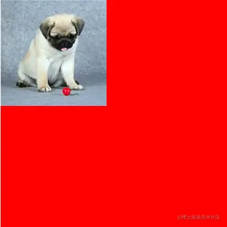

## 一：background-repeat

> background-repeat决定背景图片的平铺方式

**属性值**

```lua
background-repeat:repeat (默认值)
background-repeat:no-repeat (不平铺)
background-repeat:repeat-x （水平方向平铺）
background-repeat:repeat-y （垂直方向平铺）
```

**1. repeat**

默认情况下，如果背景图片不能铺满整个盒子时，系统会在水平和垂直方向同时平铺直到覆盖整个盒子

```css
div {
  width: 300px;
  height: 300px;
  background-color: red;
  background-image: url(./imgs/1.jpg);
  background-repeat: repeat; 
 }
```

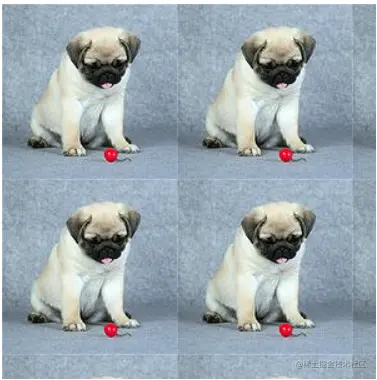

**2.repeat-x**

如果背景图片不能将盒子的水平方向铺满，则在水平方向采取平铺处理直到铺满盒子的水平方向。

```css
div {
  width: 300px;
  height: 300px;
  background-color: red;
  background-image: url(./imgs/1.jpg);
  background-repeat: repeat-x; 
 }
```

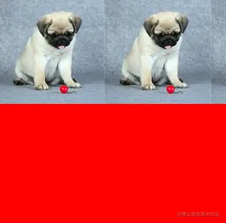

**3.repeat-y**

如果背景图片不能将盒子的垂直方向铺满，则在垂直方向采取平铺处理直到铺满盒子的垂直方向。

```css
div {
  width: 300px;
  height: 300px;
  background-color: red;
  background-image: url(./imgs/1.jpg);
  background-repeat: repeat-y; 
 }
```

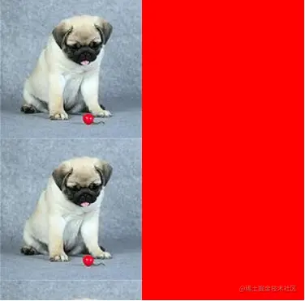

## 二：background-position

> background-positiont决定背景图片在盒子区域的定位位置。其方位由水平和垂直决定

**1.px设置**

px决定了背景图片在盒子水平和垂直方向偏移指定px的距离。

```css
div {
  width: 300px;
  height: 300px;
  background-color: red;
  background-image: url(./imgs/1.jpg);
  background-repeat: no-repeat;
  background-position: 100px 100px; 
 }
```

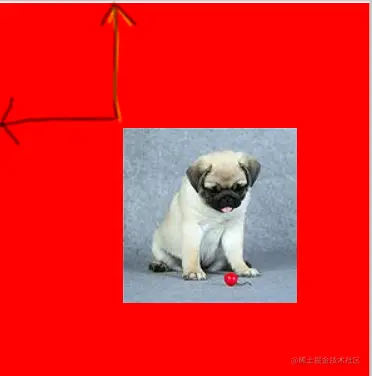

**2.方位词**

水平方向:left,center,right

垂直方向:top,center,bottom

> 背景图居中显示

```css
div {
  width: 300px;
  height: 300px;
  background-color: red;
  background-image: url(./imgs/1.jpg);
  background-repeat: no-repeat;
  background-position: center center; 
 }
 
```


**3.比例**

水平方向= |盒子宽-图片宽| * scale

垂直方向= |盒子高-图片高| * scale

> 水平和垂直方向的比例偏移位置是按照上面公式计算完成。

如下是背景图居中显示的设置方式

```css
div {
  width: 300px;
  height: 300px;
  background-color: red;
  background-image: url(./imgs/1.jpg);
  background-repeat: no-repeat;
  background-position: 50% 50%; 
 }
 
```

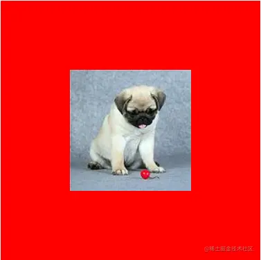

## 三：background缩写方式

background有背景颜色，背景图片，是否平铺等多种样式，为了简化css样式，系统提供了背景的简写方式

```arduino
background:color url repeat postion
```

- 背景的简写可以任意省略其中几个属性

## 三：background-size

> background-size决定背景图在盒子中显示的具体大小，属性值需要同时设置背景图的宽和高。

**1.具体px**

-  直接指定了背景图的宽和高 
-  设置宽高存在背景图变形问题：我们都清楚每张图片都有自己原始的像素，如果我们每次都直接指定其宽和高那么图片的宽和高直接被压缩到指定像素，图片会存在变形的问题，这样十分影响用户体验。  
```css
  div {
    width: 300px;
    height: 300px;
    background-color: red;
    background-image: url(./imgs/1.jpg);
    background-repeat: no-repeat;
    background-size: 200px 50px;
   }
```

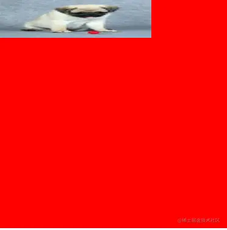

**2. 百分比**

-  百分比是相对于盒子的宽和高决定 
-  百分比也存在背景图变形问题  
```css
  div {
    width: 300px;
    height: 300px;
    background-color: red;
    background-image: url(./imgs/1.jpg);
    background-repeat: no-repeat;
    background-size: 50% 10%;
   }
```

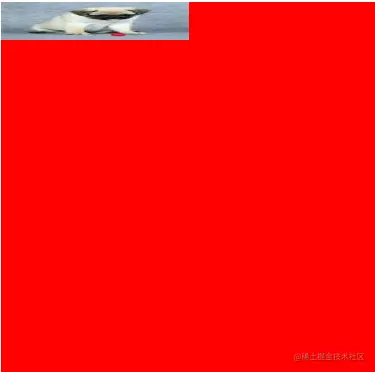

**3.auto**

1. 如果宽度是具体数值，高度设置auto,则背景图片的高会根据宽度数值等比拉伸
2. 如果高度是具体数值，宽度设置auto,则背景图片的宽会根据高度数值等比拉伸
3. 如果宽高都设置auto,直接使用原背景图的宽高

如下图所示，图片的高度随着宽度等比拉伸，并未出现图片变形问题。

```css
    div {
      width: 300px;
      height: 300px;
      background-color: red;
      background-image: url(./imgs/1.jpg);
      background-repeat: no-repeat;
      background-size: 200px auto;
     }

```

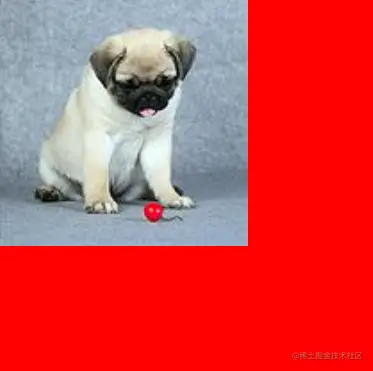

**4.cover**

cover英文意思覆盖，那么其涵义就是要求背景图片覆盖整个盒子。

> 规则

1. 选择背景图片的宽和高较小的一方
2. 选择背景图小的一边作为参考，进行背景图的放大或缩小，直到背景图小的一方刚好填充盒子，此时背景图大的一方也会填充盒子。

> 特点

-  宽和高等比拉伸或缩小填满整个盒子，宽和高必须同时填满盒子 
-  图片不变形  
```css
  div {
    width: 300px;
    height: 300px;
    background-color: red;
    background-image: url(./imgs/1.jpg);
    background-repeat: no-repeat;
    background-size:cover;
   }
```

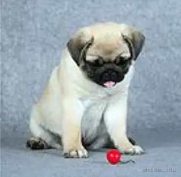

**5.contain**

contain,要求背景图片的宽和高必须满足其中一个覆盖盒子就行，当图片宽和高都小于盒子时图片会被等比拉伸，如果图片宽或高大于等于盒子宽或者高就停止拉伸。

> 规则

1. 选择背景图片的宽和高较大的一方
2. 选择背景图大的一边作为参考，进行背景图的放大或缩小，直到背景图大的一方刚好填充盒子。忽略背景图小的一方是否填充。

> 特点

-  宽和高等比拉伸或缩，宽或者高满足一个和盒子宽高相同就行。 
-  图片不变形  
```css
  div {
    width: 300px;
    height: 300px;
    background-color: red;
    background-image: url(./imgs/1.jpg);
    background-repeat: no-repeat;
    background-size: contain;
   }
   
```

## 四：background-origin

background-origin决定了背景图片从盒子的什么位置开始渲染

**1.background-origin: padding-box(默认值)**

从盒子的padding位置开始

```css
.box{
  margin: 20px auto;
  width: 300px;
  height: 300px;
  padding: 50px;
  border: 50px solid gold;
  background-color: red;
  background-image: url(./imgs/1.jpg);
  background-repeat: no-repeat;
  background-origin: padding-box;
}
```

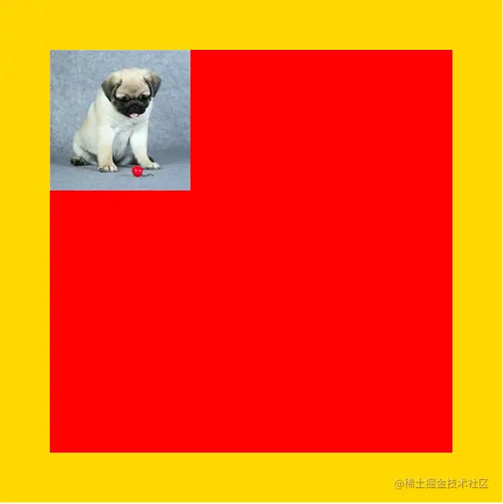

**2.background-origin: content-box**

从盒子的内容区域位置开始

```css
.box{
  margin: 20px auto;
  width: 300px;
  height: 300px;
  padding: 50px;
  border: 50px solid gold;
  background-color: red;
  background-image: url(./imgs/1.jpg);
  background-repeat: no-repeat;
  background-origin: content-box;
}
```

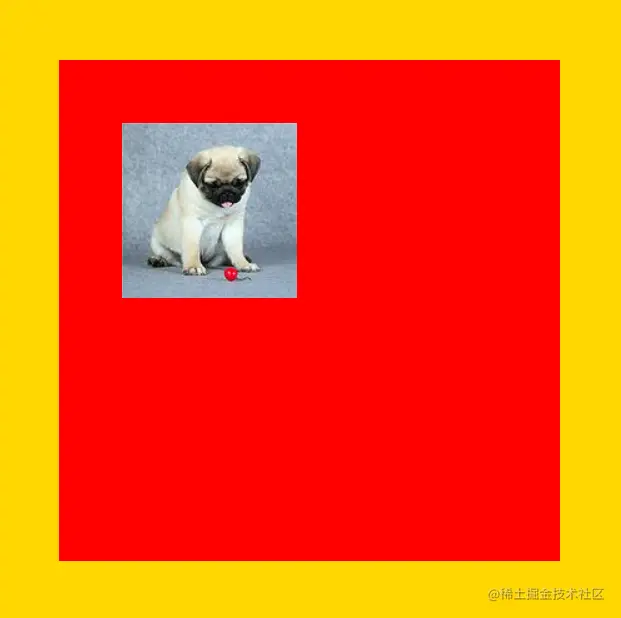

**3.background-origin: border-box**

从盒子的边框区域位置开始

## 五：background-clip

background-clip决定了背景颜色从盒子的什么位置开始渲染

1. background-clip: border-box（从盒子边距开始）
2. background-clip: content-box（从盒子内容开始）
3. background-clip: padding-box（默认值，从盒子padding开始）

## 常见考点

### 1. **基本概念与语法**

- **`background`** 是什么？它如何影响元素的视觉展示？
- **`background`** 是一个复合属性，它包含了哪些子属性？请简述每个子属性的作用。  
  - 例如：`background-color`、`background-image`、`background-repeat`、`background-position`、`background-size` 等。

### 2. **`background-color`**

- **`background-color`** 的作用是什么？它如何影响元素的背景？
- 请解释如何使用不同的颜色值（如 `hex`、`rgb`、`rgba`、`hsl`、`hsla`）来设置背景颜色。
- 解释 `rgba()` 中的透明度值（0-1），如何控制背景的透明度？

### 3. **`background-image`**

- **`background-image`** 的作用是什么？如何将图片设置为背景？
- 如何使用 **`background-image`** 设置多个背景图？请举例说明。
- 如何通过 **`background-image`** 实现渐变背景？请解释 **`linear-gradient`** 和 **`radial-gradient`**。

### 4. **`background-repeat`**

- **`background-repeat`** 的作用是什么？它的常见值有哪些？
- 如何通过 **`background-repeat`** 控制背景图的平铺方式？例如，如何设置背景不重复或者只在水平方向上重复？
- 如果背景图片尺寸较大，如何防止它在页面上重复？

### 5. **`background-position`**

- **`background-position`** 的作用是什么？它如何定位背景图？
- 请解释常见的定位值：`top`、`center`、`bottom`、`left`、`right`，以及百分比值如何影响背景位置。
- 如何通过 `background-position` 将背景图设置为居中显示？

### 6. **`background-size`**

- **`background-size`** 的作用是什么？它如何影响背景图片的显示大小？
- 请解释 `background-size: cover` 和 `background-size: contain` 的作用，它们之间有什么区别？
- 如何设置背景图的尺寸为具体的像素值或者百分比？

### 7. **`background-attachment`**

- **`background-attachment`** 的作用是什么？它的常见取值有哪些？
- 请解释 **`background-attachment: fixed`** 和 **`background-attachment: scroll`** 的区别，以及它们对页面滚动的影响。

### 8. **`background-origin` 和 `background-clip`**

- **`background-origin`** 属性的作用是什么？它定义了背景的定位区域。
- **`background-clip`** 属性的作用是什么？它控制背景绘制的区域。
- 如何通过这两个属性控制背景的显示范围？请举例说明。

### 9. **多个背景图**

- 如何为一个元素设置多个背景图？请简述 `background-image` 属性的多个值的写法。
- 多个背景图如何叠加显示？如何控制它们的顺序和位置？

### 10. **渐变背景**

- 如何使用 **`linear-gradient`** 和 **`radial-gradient`** 来设置渐变背景？
- 请解释如何控制渐变的颜色、方向、角度等参数。
- 如何创建多色渐变背景？

### 11. **性能优化**

- 在使用背景图片时，如何优化加载速度？例如，通过懒加载、图片压缩等手段。
- 背景图对页面性能的影响是什么？如何避免大尺寸背景图带来的性能问题？

### 12. **响应式设计中的背景**

- 在响应式设计中，如何调整背景图以适应不同的屏幕尺寸？
- 如何使用 **媒体查询** 改变背景图或背景颜色？请举例说明。

### 13. **可访问性**

- 在使用背景图时，如何确保文本内容的可读性？
- 背景颜色与文本颜色的对比度如何影响可访问性？如何选择合适的颜色搭配？

### 14. **实际应用**

- 在设计一个按钮时，你如何使用 **`background`** 来实现视觉上的动态效果？例如，设置悬浮时背景色变化，或者背景图的变化。
- 如何使用背景图像和背景色配合，创造出视觉上的深度感或层次感？
