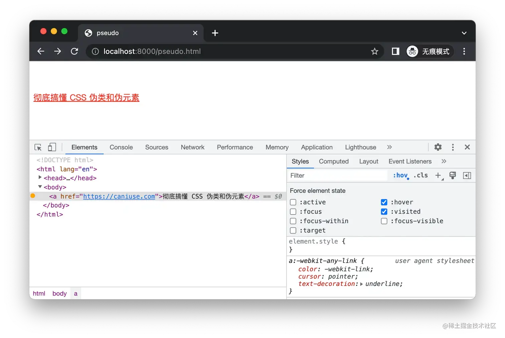
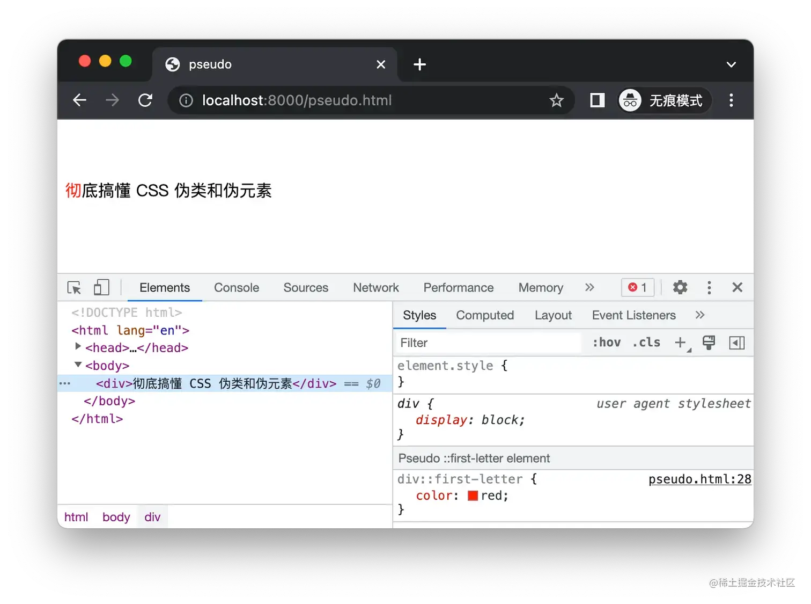
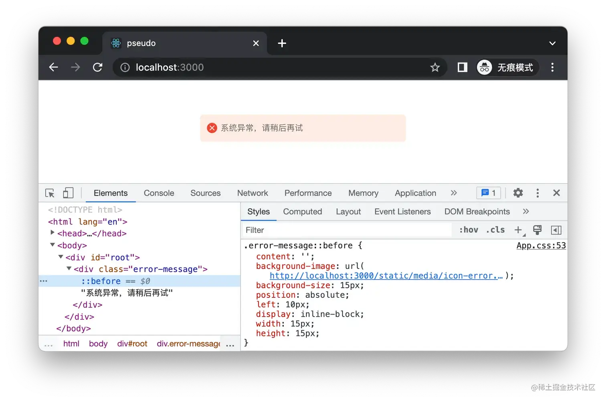
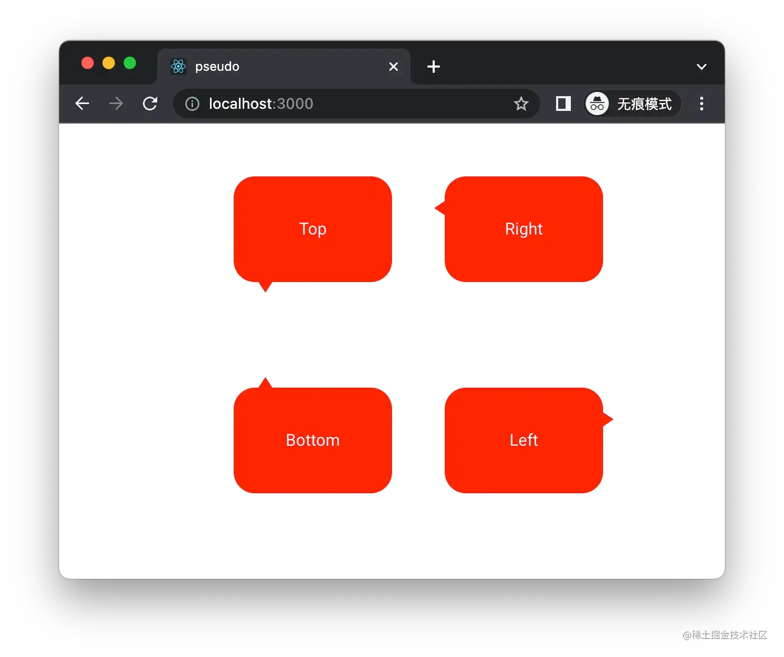
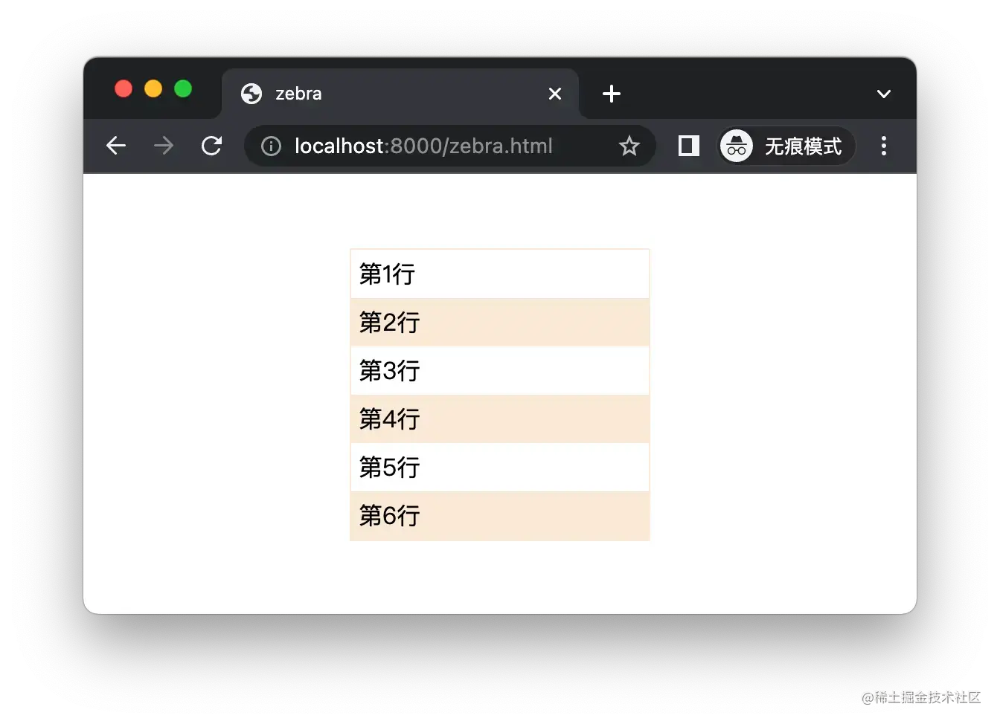
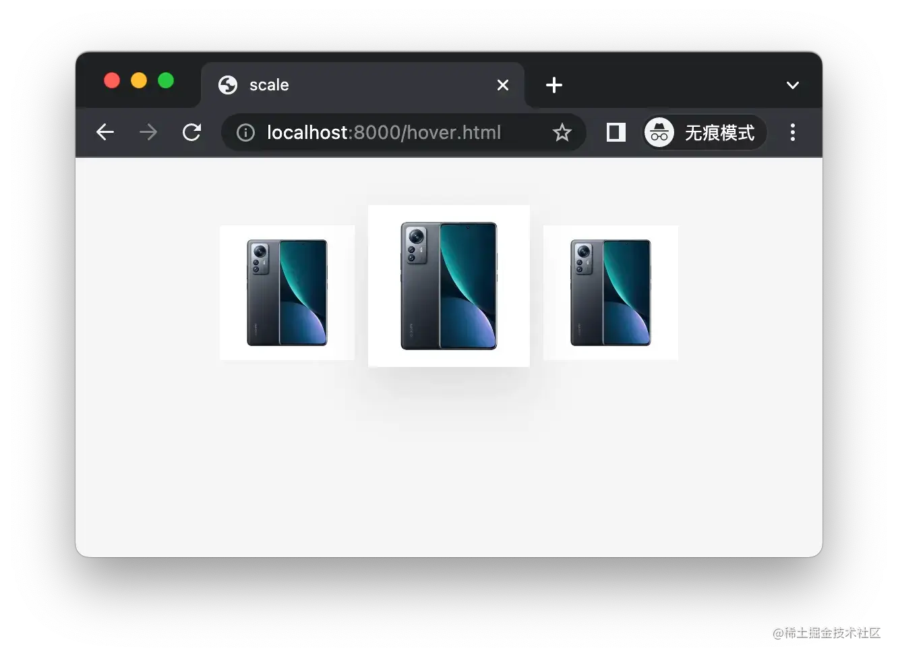
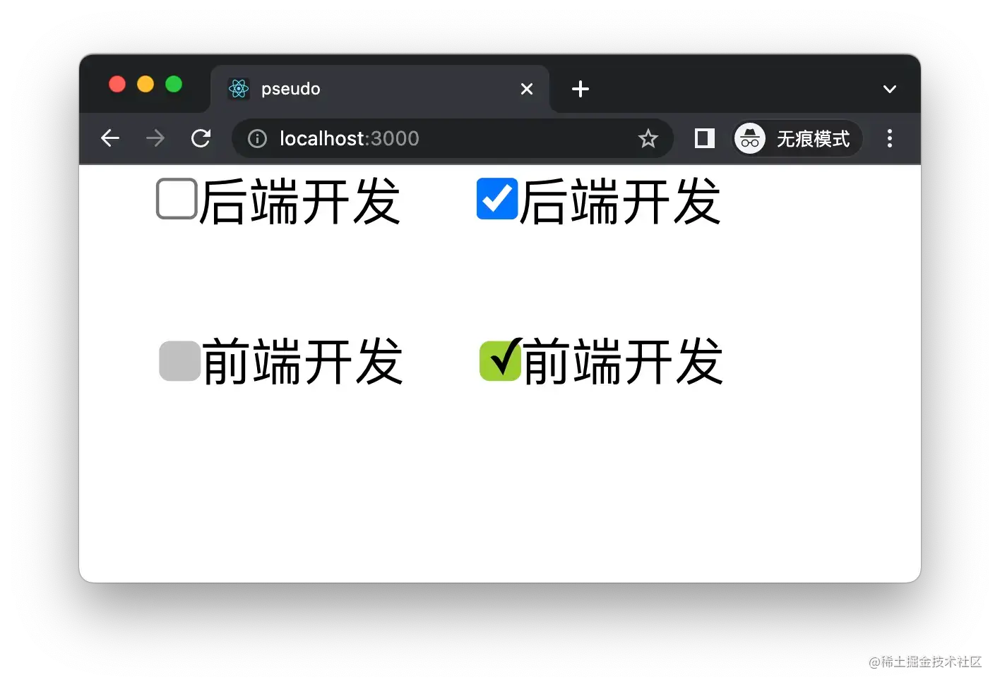
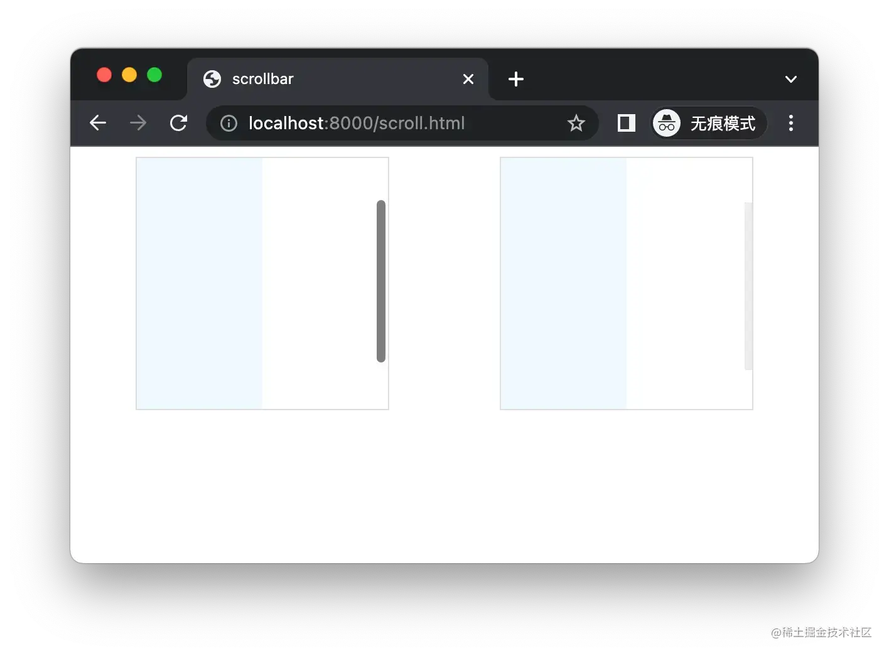

+++
title = "伪类和伪元素"
date = '2024-10-08T00:00:00+08:00'
lastmod = '2024-11-10T00:00:00+08:00'
draft = true
weight = 2
tags = ["面试", "前端", "CSS", "伪类和伪元素", "ecool"]
categories = ["前端开发", "面试"]
source = "https://fe.ecool.fun/knowledge-learn"
+++
## 什么是伪类和伪元素？

- **伪类**：以冒号(:)开头，用于选择处于特定状态的元素。
- **伪元素**：以双冒号(::)开头，用于在文档中插入虚构的元素。

这么说有点抽象，我们来看具体案例。例如下面的伪类语法表达的意思是：**文档里的那些已经被用户访问过的 a 标签，当鼠标悬浮在它上面的时候，颜色为红色。**

```css
a:visited:hover {
  color: red;
}
```

效果如下：



可以看到，无论是 `visited`还是 `hover`，都表示了 a 标签的某种状态，选择器始终选择的是伪类前面的元素，只不过当出现伪类描述的状态时，样式才生效而已。

> 注意，上面使用的是无痕浏览器打开的页面，是不可能出现 visited 状态的，因为无痕不记录访问历史，我们可以点击控制台的 :hov 图标手动勾选 :visited 和 :hover 来模拟 a 标签「已访问」和「悬浮」两种状态。

我们再来看一下伪元素的案例，下面的语法表达的意思是： **div 标签里面首字的颜色为红色。**

```css
div::first-letter {
  color: red;
}
```

效果如下：



与伪类不同的是，首字并不是 div 元素的某种状态，而是浏览器创建出来的一个虚拟的元素，我们可以在上图的右下角看到 `Pseudo ::first-letter element`提示，相当于浏览器自动选中了「彻」字。

> 注意：::first-letter 伪元素只作用于块状元素上面，如果把 div 换成 span，就无法选中首字了，除非手动设置 span 的 display 属性为 block 或 inline-block 等块状值。

从上面的案例当中，我们可以得出两个结论：

- 伪类用于**向某些已经存在的选择器添加特殊效果（当状态改变时）**
- 伪元素用于**将特殊效果添加到不存在的虚拟元素中（浏览器自动创建）**

也就是说伪类的本质还是类（class），作用于标签本身，只不过限定了状态条件；而伪元素的本质是元素（element），作用于该虚拟元素的内容本身。

## 伪类有哪些？

按照功能，可划分为以下几类：

- 动态伪类：`:visited`、`:focus`、`:hover`等
- 状态伪类：`:disabled`、`:empty`、`:required` 等
- 结构伪类：`:first-child`、`:nth-of-type`等
- 其他伪类：`:target`、`:lang`、`:not()`等

下面的表格详细记录了各种伪类及其描述：

| **伪类** | **描述** | **兼容性** |
| --- | --- | --- |
| `:active` | 元素处于活动状态时 | [✅](https://caniuse.com/?search=%3Aactive) |
| `:focus` | 元素已获取焦点时 | [✅](https://caniuse.com/?search=%3Afocus) |
| `:hover` | 元素处于悬浮状态时 | [✅](https://caniuse.com/?search=%3Ahover) |
| `:link` | 链接未访问时 | [✅](https://caniuse.com/?search=%3Alink) |
| `:visited` | 链接已访问时 | [✅](https://caniuse.com/?search=%3Avisited) |
| `:first-child` | 元素是首个子元素时 | [✅](https://caniuse.com/?search=%3Afirst-child) |
| `:last-child` | 元素是最后一个子元素时 | [✅](https://caniuse.com/?search=%3Alast-child) |
| `:nth-child()` | 元素是第 n 个子元素时 | [✅](https://caniuse.com/?search=%3Anth-child) |
| `:nth-last-child()` | 元素是倒数第 n 个子元素时 | [✅](https://caniuse.com/?search=%3Anth-last-child) |
| `:only-child` | 元素是唯一子元素时 | [✅](https://caniuse.com/?search=%3Aonly-child) |
| `:first-of-type` | 元素是首个特定类型的子元素时 | [✅](https://caniuse.com/?search=%3Afirst-of-type) |
| `:last-of-type` | 元素是最后一个特定类型的子元素时 | [✅](https://caniuse.com/?search=%3Alast-of-type) |
| `:nth-of-type()` | 元素是第 n 个特定类型的子元素时 | [✅](https://caniuse.com/?search=%3Anth-of-type) |
| `:nth-last-of-type()` | 元素是倒数第 n 个特定类型的子元素时 | [✅](https://caniuse.com/?search=%3Anth-last-of-type) |
| `:only-of-type` | 元素是唯一的特定类型的子元素时 | [✅](https://caniuse.com/?search=%3Aonly-of-type) |
| `:not` | 不满足指定条件时 | [✅](https://caniuse.com/?search=%3Anot) |
| `:target` | 元素 id 匹配到哈希值时 | [✅](https://caniuse.com/?search=%3Atarget) |
| `:root` | 元素是文档树的根元素时 | [✅](https://caniuse.com/?search=%3Aroot) |
| `:lang()` | 匹配到指定语言时 | [✅](https://caniuse.com/?search=%3Alang) |
| `:empty` | 元素处于没有子元素状态时 | [✅](https://caniuse.com/?search=%3Aempty) |
| `:invalid` 和 `:valid` | 表单项是否有效 | [✅](https://caniuse.com/?search=%3Avalid) |
| `:required` 和 `:optional` | 表单项是否必填 | [✅](https://caniuse.com/?search=%3Arequired) |
| `:in-range`和 `:out-of-range` | 表单项是否超出范围 | [✅](https://caniuse.com/?search=%3Ain-range) |
| `:read-only`和 `:read-write` | 表单项是否只读 | [✅](https://caniuse.com/?search=%3Aread-only) |
| `:enabled`和 `:disabled` | 表单项是否禁用 | [✅](https://caniuse.com/?search=%3Aenabled) |
| `:fullscreen` | 当前处于全屏显示模式时 | [⚠️](https://caniuse.com/?search=%3Afullscreen) |
| `:blank` | 输入框处于输入为空状态时 | ❌ |
| `:dir()` | 匹配到特定文字书写方向时 | [❌](https://caniuse.com/?search=%3Adir) |

上表中的兼容性表示：

- [✅](https://caniuse.com/?search=%3Aactive) 代表主流浏览器都支持（至少 95% 以上）
- [❌](https://caniuse.com/?search=%3Anth-child) 代表大部分主浏览器都不支持（仅 20% 以下浏览器实现该特性）
- ⚠️ 代表部分浏览器支持（可能需要加前缀，例如 `:webkit-`或 `:-moz-`等）

## 伪元素有哪些？

与伪类相比，[伪元素](https://drafts.csswg.org/css-pseudo/)就少很多了，常用的如下：

| **伪元素** | **选中或创建出来的元素** | **兼容性** |
| --- | --- | --- |
| `::first-letter` | 选中块状元素中的首字母 | [✅](https://caniuse.com/?search=%3A%3Afirst-letter) |
| `::first-line` | 选中首行 | [✅](https://caniuse.com/?search=%3A%3Afirst-line) |
| `::before` | 在之前创建一个不在文档树中的元素 | [✅](https://caniuse.com/?search=%3A%3Abefore) |
| `::after` | 在之后创建一个不在文档树中的元素 | [✅](https://caniuse.com/?search=%3A%3Aafter) |
| `::placeholder` | 选中表单元素的占位文本 | [✅](https://caniuse.com/?search=%3A%3Aplaceholder) |
| `::file-selector-button` | 选中类型为 file 的 input 里面的 button | [✅](https://caniuse.com/?search=%3A%3Afile-selector-button) |
| `::selection` | 选中被用户高亮的部分 | [⚠️](https://caniuse.com/?search=%3A%3Aselection) |
| `::backdrop` | 选中视觉聚焦元素后面的背景元素 | [⚠️](https://caniuse.com/?search=%3A%3Abackdrop) |
| `::marker` | 选中 list 的 marker | [⚠️](https://caniuse.com/?search=%3A%3Amarker) |

## 经典案例分析

### 添加前缀/后缀

伪元素最常用的技巧就是利用 `::before` 和 `::after`伪元素给某个元素添加前缀或后缀，例如简单的 DOM 结构：

```html
<div className="error-message">系统异常，请稍后再试</div>
```

应用下面的 CSS 样式之后：

```css
.error-message {
  position: relative;
  color: #666666;
  padding: 12px 30px;
  background-color: #FFECE4;
  border-radius: 5px;
}

.error-message::before {
  content: '';
  background-image: url('/public/icon-error.svg');
  background-size: 15px;
  position: absolute;
  left: 10px;
  display: inline-block;
  width: 15px;
  height: 15px;
}
```

可以得到如下效果：



> 注意：创建 `::before`和 `::after`的元素时，必须要设置 content 属性，否则就不存在了。另外宿主元素的 position 别忘记设置成 relative 或 absolute 了，否则布局可能会乱掉。

虽然使用左右两个元素来布局也能实现上述效果，伪元素的优势是只需要创建一个元素即可。类似的场景还有在 input 输入框前面增加红色 require 星号。

### 消息气泡

我们在聊天时都会遇到带箭头的消息对话框，如下图所示：



实现上面布局也很简单，也是用的 `::before`和 `::after`伪元素，HTML 结构：

```html
<div className="container">
  <div className="box top-arrow">Top </div>
  <div className="box right-arrow">Right</div>
  <div className="box bottom-arrow">Bottom</div>
  <div className="box left-arrow">Left</div>
</div>
```

CSS 代码：

```css
.container {
  display: grid;
  grid-template-columns: 200px 200px;
  grid-template-rows: 200px 200px;
}

.box {
  width: 150px;
  height: 100px;
  background-color: red;
  color: white;
  position: relative;
  border-radius: 20px;
  display: flex;
  justify-content: center;
  align-items: center;
  font-size: 16px;
}

.box::after {
  content: '';
  width: 0;
  height: 0;
  position: absolute;
}

.box.bottom-arrow::after {
  border-left: 8px solid transparent;
  border-right: 8px solid transparent;
  border-bottom: 12px solid red;
  left: 22px;
  top: -10px;
}

.box.right-arrow::after {
  border-top: 8px solid transparent;
  border-bottom: 8px solid transparent;
  border-right: 12px solid red;
  top: 22px;
  left: -10px;
}

.box.left-arrow::after {
  border-top: 8px solid transparent;
  border-bottom: 8px solid transparent;
  border-left: 12px solid red;
  top: 22px;
  right: -10px;
}

.box.top-arrow::after {
  border-left: 8px solid transparent;
  border-right: 8px solid transparent;
  border-top: 12px solid red;
  left: 22px;
  bottom: -10px;
}
```

### 斑马条纹效果

在一个列表中，为奇数行和偶数行显示不同的颜色，效果如下：



HTML 结构：

```html
<div class="container">
  <div>第1行</div>
  <div>第2行</div>
  <div>第3行</div>
  <div>第4行</div>
  <div>第5行</div>
  <div>第6行</div>
</div>
```

CSS 样式：

```css
.container {
  width: 200px;
  margin: 50px auto;
  border: 1px solid antiquewhite;
}

.container div {
  padding: 5px;
}

.container div:nth-child(even) {
  background-color: antiquewhite;
}
```

### 悬浮高亮效果

在电商网站购物时，当用户鼠标悬浮在当前商品上面的时候，通过放大尺寸、增加阴影来突出显示，：



HTML 结构：

```html
<div class="container">
  <div class="product"></div>
  <div class="product"></div>
  <div class="product"></div>
</div>
```

CSS 样式：

```css
body {
  margin: 0;
  background-color: rgb(245, 245, 245);
}

.container {
  height: 200px;
  width: 360px;
  margin: auto;
  display: flex;
  justify-content: space-around;
  align-items: center;
}

.product {
  width: 100px;
  height: 100px;
  background: white;
  background-image: url(//cdn.cnbj1.fds.api.mi-img.com/nr-pub/202207011841_084ed41d67f248677914605b73faf582.png?thumb=1&w=400&h=400&f=webp&q=90);
  background-size: cover;
}

.product:hover {
  box-shadow: 0 15px 30px rgb(0 0 0 / 10%);
  transform: translate3d(0, -5px, 0) scale(1.2);
  cursor: pointer;
}
```

### 自定义复选框样式

默认的复选框比较单调，利用伪类和伪元素配合，可以自定义 checkbox 样式，效果如下：



HTML 结构：

```html
<div className="container">
  <div>
    <input type="checkbox" id="backend" />
    <label htmlFor="backend">后端开发</label>
  </div>

  <div>
    <input type="checkbox" id="backend" />
    <label htmlFor="backend">后端开发</label>
  </div>

  <div>
    <input type="checkbox" id="frontend" />
    <label htmlFor="checkbox">前端开发</label>
  </div>

  <div>
    <input type="checkbox" id="frontend" />
    <label htmlFor="checkbox">前端开发</label>
  </div>
</div>
```

CSS 样式：

```css
input[type="checkbox"] {
  margin: 0;
}

#frontend {
  opacity: 0;
}

#frontend+label {
  margin-left: -12px;
  pointer-events: none;
}

#frontend+label::before {
  content: '\a0';
  display: inline-block;
  vertical-align: 0.1em;
  width: 0.8em;
  height: 0.8em;
  border-radius: 0.2em;
  background-color: silver;
  text-indent: 0.15em;
  line-height: 0.65;
  cursor: pointer;
}

#frontend:checked+label::before {
  content: '\2713';
  background-color: yellowgreen;
}
```

### 自定义滚动条样式

浏览器自带的滚动条样式非常单一，不够美观，我们可以利用伪元素和伪类自定义一个滚动条，将其背景颜色改成淡灰，宽度为 6px，当鼠标悬浮上去之后宽度变为 10px。



HTML 结构：

```html
<div class="container">
  <div class="rect">
    <div class="box"></div>
  </div>
  <div class="rect2">
    <div class="box"></div>
  </div>
</div>
```

CSS 样式：

```css
.container {
  display: flex;
  justify-content: space-around;
}

.rect,
.rect2 {
  width: 200px;
  height: 200px;
  overflow: scroll;
  border: 1px solid gainsboro;
}

.rect2::-webkit-scrollbar {
  width: 10px;
  height: 0;
  background-color: transparent;
}

.rect2::-webkit-scrollbar-thumb {
  background-color: rgba(0, 0, 0, 0.08);
  border-left: 4px solid transparent;
  background-clip: padding-box;
}

.rect2::-webkit-scrollbar-thumb:hover {
  background-color: rgba(0, 0, 0, 0.08);
  border: 0;
}

.box {
  width: 100px;
  height: 300px;
  background-color: aliceblue;
}
```

> 原文：[https://juejin.cn/post/7136087057542086693](https://juejin.cn/post/7136087057542086693)

## 常见考点

### 1. **伪类的基本概念**

- 你能解释什么是伪类吗？它如何在 CSS 中使用？
- 请列举一些常见的伪类并简要说明它们的作用，比如 `:hover`、`:focus`、`:nth-child()` 等。

### 2. **伪类的工作原理**

- 伪类是如何与元素的状态相关联的？比如，`:hover` 伪类是如何工作的？
- 你能举个例子，说明如何使用伪类来控制交互效果，比如鼠标悬停时的样式变化？

### 3. **常见伪类及其用法**

- `:nth-child()` 和 `:nth-of-type()` 的区别是什么？它们分别适用于什么样的场景？
- 如何使用 `:not()` 伪类选择元素，举个实际应用的例子。
- `:first-child` 和 `:last-child` 伪类有何作用？它们通常在哪些场景下使用？

### 4. **伪元素的基本概念**

- 你能解释什么是伪元素吗？它如何与伪类不同？
- 请列举一些常见的伪元素并简要说明它们的作用，比如 `::before`、`::after`。

### 5. **伪元素的应用**

- `::before` 和 `::after` 伪元素通常用于什么样的场景？举个实际的例子说明它们的使用方法。
- 你如何利用伪元素在不修改 HTML 结构的情况下，添加内容或样式？

### 6. **伪类与伪元素的语法区别**

- 请解释伪类和伪元素的语法差异。例如，为什么伪元素使用 `::`（双冒号）而伪类使用 `:`（单冒号）？
- 在早期版本的 CSS 中，伪元素也使用单冒号（`:before`、`:after`）。目前的规范推荐使用双冒号，为什么会有这样的变化？

### 7. **伪类与伪元素的组合使用**

- 你如何结合使用伪类和伪元素来创建复杂的效果？例如，在某个元素的 `hover` 状态下，利用 `::before` 来显示额外的内容。
- 你能举例说明如何使用 `:hover` 伪类与 `::after` 伪元素一起创建动态的交互效果吗？

### 8. **浏览器兼容性与性能**

- 伪类和伪元素的兼容性如何？你在使用这些特性时，是否有遇到过浏览器兼容性问题？
- 你如何优化伪类和伪元素的使用，避免影响性能，特别是在大型项目中？

### 9. **实际项目中的应用**

- 请分享你在实际项目中如何使用伪类和伪元素来改善用户体验或提升界面效果。
- 你是否曾经遇到过伪类或伪元素在复杂布局中引起问题的情况？你是如何解决的？
