+++
title = "动画"
date = '2024-10-08T00:00:00+08:00'
lastmod = '2024-11-18T00:00:00+08:00'
draft = true
weight = 16
tags = ["面试", "前端", "CSS", "动画", "ecool"]
categories = ["前端开发", "面试"]
source = "https://fe.ecool.fun/knowledge-learn"
+++
## 前言

CSS中有几个特别相近的几个属性。他们是`transition`,`transform`,`animation`。可能还有人对`translate`是什么也不清楚，那我们先给个简单的介绍。

| 属性 | 含义 |
| --- | --- |
| transition 过渡 | 用于设置元素的样式过度，和animation有着类似的效果，但细节上有很大的不同 |
| transform 变形 | 用于元素进行旋转、缩放、移动或倾斜，和设置样式的动画并没有什么关系，就相当于color一样用来设置元素的“外表” |
| animation 动画 | css动画属性 |
| translate 移动 | 只是transform的一个属性值，即移动。 |

## transition 过渡

字面意思上来讲，就是元素从这个属性(color)的某个值(red)过渡到这个属性(color)的另外一个值(green)，这是一个状态的转变，需要一种条件来触发这种转变，比如我们平时用到的:hoever、:focus、:checked、媒体查询或者JavaScript。

> 一条transition规则，是可以定义多个属性的变化的，中间用逗号隔开，如果是全部属性变化则用“all”即可。

语法：**`transition: property duration timing-function delay;`**

| 值 | 描述 |
| --- | --- |
| transition-property | 规定设置过渡效果的 CSS 属性的名称 |
| transition-duration | 规定完成过渡效果需要多少秒或毫秒 |
| transition-timing-function | 规定速度效果的速度曲线 |
| transition-delay | 定义过渡效果何时开始 |

我发现简写时候的顺序并不一定就是写死的，经过测试在chrome上只要delay在duration后面即可。当然按照标准写是最好的。

## Demo

```bash
<!DOCTYPE html>
<html lang="en">
<head>
  <title>transition</title>
  <style>
    #box {
      height: 100px;
      width: 100px;
      background: green;
      transition: transform 1s ease-in 1s;
    }

    #box:hover {
      transform: rotate(180deg) scale(.5, .5);
    }
  </style>
</head>
<body>
  <div id="box"></div>
</body>
</html>
```

效果

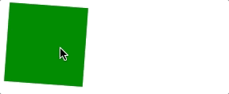

我们来分析这一整个过程，首先transition给元素设置的过渡属性是transform，当鼠标移入元素时，元素的transform发生变化，那么这个时候就触发了transition，产生了动画，当鼠标移出时，transform又发生变化，这个时候还是会触发transition，产生动画，所以transition产生动画的条件是transition设置的property发生变化，这种动画的特点是需要“一个驱动力去触发”，有着以下几个不足：

1. 需要事件触发，所以没法在网页加载时自动发生
2. 是一次性的，不能重复发生，除非一再触发
3. 只能定义开始状态和结束状态，不能定义中间状态，也就是说只有两个状态

## animation 动画

弥补了transition的很多不足，可操作性更强，能够做出复杂酷炫的效果

语法：**`animation: name duration timing-function delay iteration-count direction play-state fill-mode;`**

| 值 | 描述 |
| --- | --- |
| @keyframes | 规定动画 |
| animation | 所有动画属性的简写属性，除了 animation-play-state 属性 |
| animation-name | 用来调用@keyframes定义好的动画，与@keyframes定义的动画名称一致 |
| animation-duration | 规定动画完成一个周期所花费的秒。默认是 0 |
| animation-timing-function | 规定动画的速度曲线。默认是 "ease" |
| animation-delay | 规定动画何时开始。默认是 0 |
| animation-iteration-count | 规定动画被播放的次数。默认是 1 |
| animation-direction | normal(按时间轴顺序),reverse(时间轴反方向运行),alternate(轮流，即来回往复进行),alternate-reverse(动画先反运行再正方向运行，并持续交替运行) |
| animation-play-state | 控制元素动画的播放状态，通过此来控制动画的暂停和继续，两个值：running(继续)，paused(暂停) |
| animation-fill-mode | 控制动画结束后，元素的样式，有四个值：none(回到动画没开始时的状态)，forwards(动画结束后动画停留在结束状态)，backwords(动画回到第一帧的状态)，both(根据animation-direction轮流应用forwards和backwards规则)，注意与iteration-count不要冲突(动画执行无限次) |

比如我们一个 div 旋转一圈，只需要定义开始和结束两帧即可：

```bash
@keyframes rotate{
  from{
    transform: rotate(0deg);
  }
  to{
    transform: rotate(360deg);
  }
}
```

等价于

```bash
@keyframes rotate{
  0%{
    transform: rotate(0deg);
  }
  100%{
    transform: rotate(360deg);
  }
}
```

定义好了关键帧后，下来就可以直接用它了：

```bash
animation: rotate 2s;
```

> Tips: `transition`和`animation`的`timing-function`可以用贝塞尔曲线(`cubic-bezier`)来自定义，[工具网站](https://cubic-bezier.com/)

## transform 变形

transform 属性向元素应用 2D 或 3D 转换。该属性允许我们对元素进行旋转、缩放、移动或倾斜。

语法：**`transform: none|transform-functions;`**

transform 可以设置多个变换，执行顺序是从左到右执行，中间不用逗号隔开。例如：

```bash
transform: translateX(100px) rotate(90deg);
```

**这部分内容分为三个小结：前置属性、2D变换、3D变换**

## 前置属性讲解

| 值 | 描述 |
| --- | --- |
| transform-origin | 用于指定元素变形的中心点 |
| transform-style | 指定舞台为2D或3D |
| perspective | 指定3D的视距 |
| perspective-origin | 视距的基点 |
| backface-visibility | 是否可以看见3D舞台背面 |

### transform-origin

用于指定元素变形的中心点。默认中心点就是元素的正中心，即XYZ轴的50% 50% 0处。可以通过该属性改变元素在XYZ轴的中心点，正值表示正向位移，负值表示负向位移。（XYZ轴的正向分别是往右，往下，靠近用户眼睛。反之为反向）

表示2维的`x-offset/y-offset`可以设`px`值也可以设`%`百分比，也可设`top / right / bottom / left / center`等`keyword`。表示3维的`z-offset`只能设`px`值，不能设`%`百分比，也没有`keyword`。

默认中心点在元素正中心，因此关键字`top`等价于`top center`等价于`50% 0%`（x轴仍旧留在50%处，y轴位移到0%处）。同理各关键字例如`right`等价于`right center`等价于`100% 50%`，不多赘述。

一图胜千言：为图片设置不同的中心点后，看它们旋转，扭曲，缩放的效果。例如图1表头的第一行`center`表示`transform-origin: center`。第二行`rotate(30deg);`表示`transform: rotate(30deg);`。

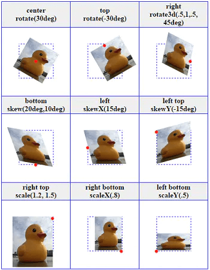

### transform-style

这个属性比较简单只有两个值`flat`和`preserve-3d`。用于指定舞台为2D或3D，默认值flat表示2D舞台，所有子元素2D层面展现。preserve-3d看名字就知道了表示3D舞台，所有子元素在3D层面展现。注意，在变形元素自身上指定该属性是没有用的，它用于指定舞台，所以要在变形元素的父元素上设置该属性。设定后，所有子元素共享该舞台。一图胜千言：

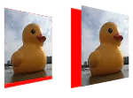

```bash
.div1 {
    float: left;
    background-color: red;
    transform: perspective(200px) rotateY(45deg);
}
.div1 img{
    transform: translateZ(16px);
}
.p3d {
    transform-style: preserve-3d;
}
<div class="div1"></div>
<div class="div1 p3d"></div>
```

### perspective

指定3D的视距。默认值是none表示无3D效果，即2D扁平化。上面例子代码里其实已经用到过该属性了。介绍它之前，先借用rotateX / rotateY / rotateZ来明确一下xyz轴坐标的基本概念。一图胜千言，依次是rotateX轴旋转，rotateY轴旋转，rotateZ轴旋转：

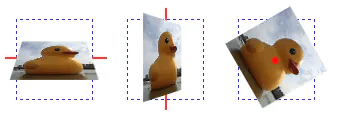

```bash
.x {
    transform: perspective(200px) rotateX(60deg);
}
.y {
    transform: perspective(200px) rotateY(60deg);
}
.z {
    transform: perspective(200px) rotateZ(60deg);
}


```

实现3D的关键就是要有`perspective`视距，如果将上述代码中`perspective(200px)`去掉，效果如下：

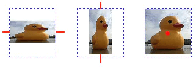

除了z轴旋转不受影响外，xy轴虽然还在旋转，但失去了3D效果，是2D扁平化的旋转。原因就是因为不设`perspective`的话，其默认值为none，没有视距没有3D。

`perspective`只能设`px`值，不能设`%`百分比。值越小表示用户眼睛距离屏幕越近，相当于创建一个较大的3D舞台。反之，值越大表示用户眼睛距离屏幕越远，相当于创建一个较小的3D舞台。这很容易理解，离的越近东西看起来越大，离的越远东西看起来越小。但具体该怎么设呢？借用W3C的图配合translateZ来帮助理解视距。

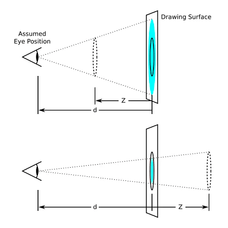

上图中Drawing Surface就是最终会被渲染的大小

图中d就是`perspective`视距，Z就是`translateZ`轴的位移。Z轴正向位移时，3D舞台将放大。反之，Z轴负向位移时，3D舞台将缩小。上图Z是d的一半，因此3D舞台上的元素将是原来的2倍。下图Z同样是d的一半，但由于是负值，所以3D舞台上的元素将缩小三分之一。实际试试：

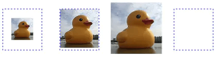

```bash
.divsp {
    display: inline-block;
    border: 1px blue dashed;
    margin-left: 30px;
    perspective: 100px;
}
.z1 {
    transform: translateZ(-75px);
}
.z2 {
    transform: translateZ(0px);
}
.z3 {
    transform: translateZ(25px);
}
.z4 {
    transform: translateZ(101px);
}
<div class="divsp"></div>
<div class="divsp"></div>
<div class="divsp"></div>
<div class="divsp"></div>
```

4张图的视距都是100px，表示4张图的3D舞台距离你的眼睛`100px`。我们从右往左来理解。图4的`translateZ(101px)`看到图片消失了，因为3D舞台距离你眼睛`100px`，而图片从舞台往Z轴正向位移`101px`，图片到了你脑袋后面自然什么都看不见。如果设成`translateZ(100px)`，相当于图片紧贴着你的眼睛，所以全屏都是图片。图3的`translateZ(25px)`，原始图片为`75px`，放大后的图片为`100px`。这是道初中数学题，你可以画一个底边是`75px`（图片原始尺寸），高是`75px`（视距100px-Z轴位移25px=75px）的等腰三角形，然后高扩展到`100px`，底边将等比例扩大3分之1至`100px`。图2的`translateZ(0px)`表示Z轴没有位移，因此仍旧是原始大小。图4的`translateZ(-75px)`，同样是道初中数学题，原始图片为75px，缩小到42.85px，再看看上面W3C的图理解一下，很容易算出来。

仔细看代码的可以看出来，上面介绍XYZ轴旋转时是直接在变形元素`img`上指定的`transform: perspective(200px) rotateX(60deg);`。而上面的代码是给变形元素`img`的父`div`指定`perspective: 100px;`。你可以理解为前一种方式是`perspective()`函数，后一种方式是`perspective`属性。两种指定方式是有区别的：

前者`perspective()`函数指定只针对当前变形元素，需要和`transform`其他函数一起使用，仅表示当前变形元素的视距。 后者`perspective`属性指定用于3D舞台，即3D舞台的视距，里面的子元素共享这个视距

### perspective-origin

设置视距的基点，看W3C的图就能明白

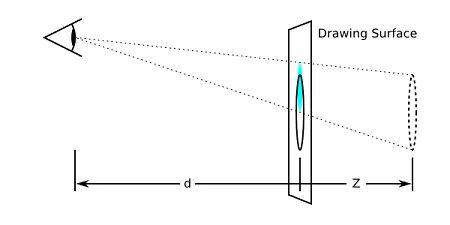

基点默认值是50% 50%即center，表示视距基点在中心点不进行任何位移。你可以让基点在XY轴上进行位移，产生上图那样的效果。注意该属性同样应该定义在父元素上，适用于整个3D舞台。它需要和`perspective`属性结合着一起用。效果如下图：

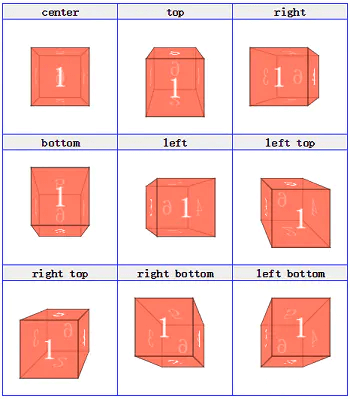

```bash
.td1 {
    transform-style: preserve-3d;
    perspective: 200px;
    perspective-origin: center;
}
```

### backface-visibility

用于是否可以看见3D舞台背面，默认值visible表示背面可见，可以设成hidden让背面不可见。通常当旋转时，如果不希望背面显示出来，该属性就很有用，设成hidden即可。一图胜千言：

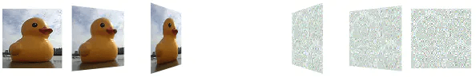

```bash
.stage{
    float: left;
    margin: 5px;
    perspective: 200px;
}
.container {
    transform-style: preserve-3d;
}
.image {
    backface-visibility: hidden;
}
.front {
    position: absolute;
    z-index: 1;
}
.back {
    transform: rotateY(180deg);
}
.stage:nth-child(1) .container{ transform: rotateY(0deg); }
.stage:nth-child(2) .container{ transform: rotateY(30deg); }
.stage:nth-child(3) .container{ transform: rotateY(60deg); }
.stage:nth-child(4) .container{ transform: rotateY(90deg); }
.stage:nth-child(5) .container{ transform: rotateY(120deg); }
.stage:nth-child(6) .container{ transform: rotateY(150deg); }
.stage:nth-child(7) .container{ transform: rotateY(180deg); }

<div class="stage"> //为节约篇幅该DOM请无脑复制7个
    <div class="container">
        
        
    </div>
</div>
```

至此5个前置属性介绍完毕。它们多用于3D场合，因此常见的3D的HTML结构如下：

```bash
<舞台>        //为舞台加上perspective
    <容器>     //为容器加上preserve-3d，使容器内元素共享同一个3D渲染环境
        <元素> //为元素加上transform效果
    </容器>
</舞台>
```

## 2D变形

| 值 | 描述 |
| --- | --- |
| translate | 设置元素在 X轴或者 Y轴上的平移变换 |
| scale | 设置元素在 X轴或者 Y轴上的缩放 |
| rotate | 二维空间中，rotate即围绕屏幕法向量旋转，等同于 rotateZ |
| skew | 设置 X轴和 Y轴的倾斜角度 |
| matrix | 定义 2D 转换，使用六个值的矩阵 |

> `rotate/translate/screw` 等都可以直接通过设置 `Matrix` 来达到同样的效果

### translate位移

translate位移系列中用于2D的有：`translate`，`translateX`，`translateY`<br>
 设单值表示只X轴位移，Y轴坐标不变

#### 示例

`transform: translate(100px);`等价于`transform: translate(100px,0)`<br>
 `transform: translateY(100px);`等价于`transform: translate(0, 100px);`

> 上面说了效果类似于`position:relative`属性，但和`position`语义不同，`position`用于页面布局，而`translate`属于`transform`中的一个系列，用于元素变形。你可能觉得语义不同有什么卵用，效果OK不就行了？就看你用什么标准来衡量效果了。CSS的神奇之处在于你可以将一个属性用在完全违背它原意的场景下，抛开代码可读性不谈，违背原意有时还是会有细微差别的。如结合动画效果时，`translate`能小于`1px`过渡，因此动画效果更为平滑。但`position`最小单位就是`1px`，动画效果肯定打折扣。另外用`translate`实现动画时，可以使用`GPU`，动画的`FPS`更高，而`position`显然无法享受这个优势。其他如回流和重绘也都有差异。因此如果你在该用`translate`的地方用了`position`，今后一些需求变动达不到要求，你也没什么立场可抱怨的了。

### scale缩放

scale缩放系列中用于2D的有：scale，scaleX，scaleY

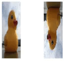

w3cschool上没说的是，scale还能设负数，负数会先将元素反转再缩放，如transform: scale(-.5, -1.5);，效果见上面右图。为何反转能理解吧？XY轴像素矩阵各值取反后，效果等价于反转。当然你同样可以用rotate实现反转。

### rotate旋转

rotate旋转系列中用于2D的有：rotate

rotate旋转，比较简单，只能设单值。正数表示顺时针旋转，负数表示逆时针旋转。如`transform: rotate(30deg);`

### skew扭曲

skew扭曲系列中用于2D的有：skew，skewX，skewY

skew扭曲可以设单值和双值。单值时表示只X轴扭曲，Y轴不变，如`transform: skew(30deg);`等价于`transform: skew(30deg, 0);`。考虑到可读性，不推荐用单值，应该用`transform: skewX(30deg);`。

### matrix矩阵

-  3x3 的变换矩阵 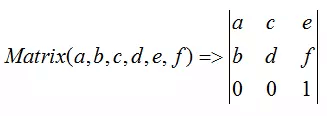
-  对二维向量进行转换 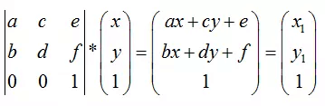 其中 x1、y1 为经过 Matrix 转换后的向量。由公式可知，Matrix 中 `e, f` 主要用于设置元素在 X轴和 Y轴上的平移。`a, d` 主要用于设置元素在 X轴和 Y轴上的缩放。`a,b,c,d` 用于设置元素在 XY 平面上的旋转。`rotate/translate/screw` 等都可以直接通过设置 `Matrix` 来达到同样的效果

## 3D变形

| 值 | 描述 |
| --- | --- |
| translate3d | 3D位移 |
| scale3d | 3D缩放 |
| rotate3d | 3D旋转 |
| matrix3d | 3D矩阵变换 |

### translate3d位移

translate3d位移系列中用于3D的有：`translate3d`，`translateZ`

translate3d(tx,ty,tz)，其中tz的Z轴长度只能为px值，不能为%百分比

### scale3d缩放

scale3d缩放系列中用于3D的有：`scale3d`，`scaleZ`

`scale3d(sx,sy,sz)`，其中sz为Z轴的缩放比例，取值同sx，sy一样，在0.01～0.99时元素缩小，1时大小不变，大于1时元素变大。`scaleZ`等价于`scale(1,1,sz)`。需要注意的是单独使用`scale3d`或`scaleZ`不会有任何效果，需要配合其他属性在3D舞台上才能出现效果，否则Z轴的缩放比例根本无法定义。

### rotate3d旋转

rotate3d旋转系列中用于3D的有：`rotate3d`，`rotateX`，`rotateY`，`rotateZ`

`rotate3d(x,y,z,a)`这里多了一个参数a（读音是阿尔法…）表示3D舞台上旋转的角度，而xyz的取值为0～1为各轴的旋转矢量值。

### matrix3d矩阵

最后`matrix3d`矩阵是所有3D变形的本质，上面所有3D变形效果都可以用`matrix3d`矩阵来实现。

---

> 原文：[https://juejin.cn/post/6844904145544019982](https://juejin.cn/post/6844904145544019982)

## 常见考点

### 1. **CSS 动画基础**

- 你如何使用 CSS 实现一个简单的动画？能简要描述一下使用 `@keyframes` 和 `animation` 属性的基本用法吗？
- `@keyframes` 中如何定义动画的起始状态和结束状态？如何设置动画的中间步骤？

### 2. **动画的属性**

- `animation` 属性有哪些常见的子属性？能举例说明 `animation-name`、`animation-duration`、`animation-timing-function`、`animation-delay` 和 `animation-iteration-count` 的作用和用法吗？
- 如何使用 `animation-timing-function` 设置动画的速度曲线？举例说明常见的值，如 `linear`、`ease`、`ease-in`、`ease-out` 和 `cubic-bezier()`。

### 3. **动画的关键帧**

- 如何通过 `@keyframes` 设置动画的关键帧？能解释一下 `from` 和 `to` 与百分比的区别吗？
- 如何通过关键帧在动画中实现多个步骤的过渡？举例说明如何设置多个关键帧来定义动画的中间状态。
- 在 `keyframes` 中如何使用 `animation-timing-function` 对不同步骤设置不同的缓动效果？

### 4. **动画的重复与循环**

- `animation-iteration-count` 是如何工作的？如何设置动画循环播放一定次数或无限次？
- 如何控制动画的播放方向？可以使用 `animation-direction` 设置哪些值，如何实现动画的反向播放？

### 5. **动画的暂停与恢复**

- 如何暂停 CSS 动画的执行？例如在某个交互事件发生时暂停动画。
- 如何使用 `animation-play-state` 控制动画的暂停与恢复？它和 `pause`、`resume` 之间有什么区别？

### 6. **动画的延迟与开始**

- 如何在 CSS 动画开始之前设置延迟？如何使用 `animation-delay`？
- 如何使动画延迟某一时间开始，但动画本身还是按照正常的时长进行？

### 7. **过渡与动画的区别**

- CSS 动画与 CSS 过渡的区别是什么？何时使用动画，何时使用过渡效果？
- CSS 过渡在某些交互中非常常见，它是如何工作的？比如使用 `:hover` 或 `:focus` 触发过渡效果。

### 8. **动画性能优化**

- 在使用 CSS 动画时，如何避免性能瓶颈？如何优化高频率的动画，如平移动画、旋转动画等？
- 你会如何处理元素的重排（reflow）和重绘（repaint）？有哪些动画操作会触发重排，如何避免？

### 9. **3D 动画与变换**

- 如何使用 CSS 实现 3D 动画？请说明 `perspective`、`transform`、`rotateX`、`rotateY` 等属性在 3D 动画中的应用。
- 如何利用 `transform` 属性实现平移、旋转、缩放等效果？这些变换如何影响元素的布局和渲染？

### 10. **动画事件**

- CSS 动画是否支持事件监听？如 `animationstart`、`animationend` 和 `animationiteration`，它们的作用是什么？能举个例子说明如何使用它们？
- 如何监听动画结束时执行特定的 JavaScript 代码？如何配合动画事件监听来触发回调？

### 11. **CSS 动画的兼容性**

- 在使用 CSS 动画时，你如何确保它能在不同浏览器中兼容？如何处理老旧浏览器的支持问题？
- CSS 动画在某些低版本浏览器中支持差异较大，你会如何使用 `@keyframes` 和 `animation` 来确保跨浏览器的兼容性？

### 12. **复杂动画的实现**

- 如何实现一个元素从屏幕外滑入并淡入的效果？能举个例子说明如何实现多个动画效果的组合？
- 如何使用 `animation` 和 `transition` 实现一个弹跳效果或一个拖拽效果？

### 13. **结合 JavaScript 控制动画**

- 如何使用 JavaScript 控制 CSS 动画的启动、暂停、恢复和停止？如何动态改变动画的参数，如延迟、时长、效果等？
- 你如何通过 JavaScript 来监听和操作 CSS 动画？例如，在动画结束时执行某个动作。

### 14. **常见动画案例**

- 请描述一个你曾经实现过的复杂 CSS 动画效果，涉及到多步骤的动画、延迟、反转、暂停等。你如何控制不同阶段的动画？
- 如何制作一个页面加载时的动画效果，例如淡入、旋转加载器等？

### 15. **动画与可访问性**

- 如何确保动画对视觉障碍人士友好？如何为不喜欢动画的用户提供选项禁用动画？
- 使用 `prefers-reduced-motion` 媒体查询来检测用户的偏好并适配动画，能举个例子吗？
