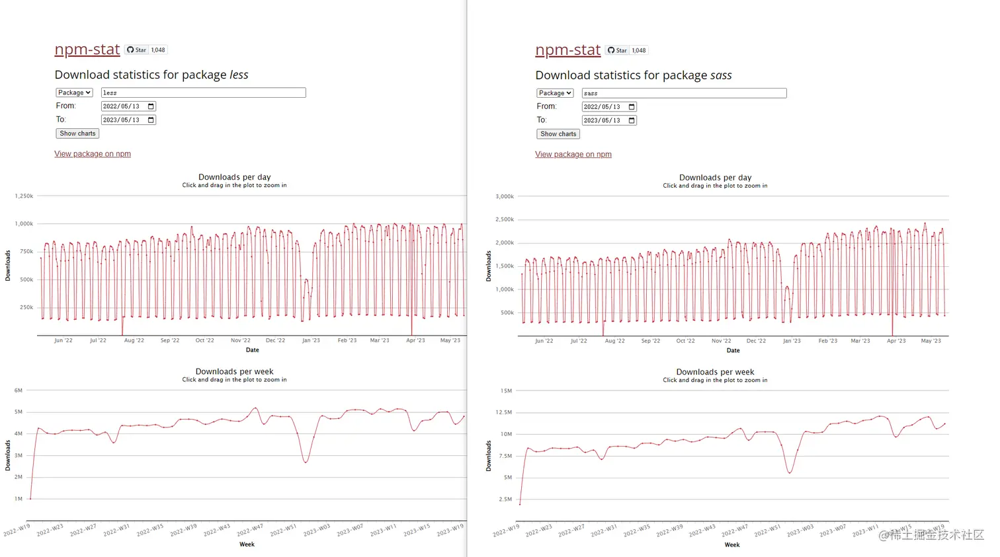
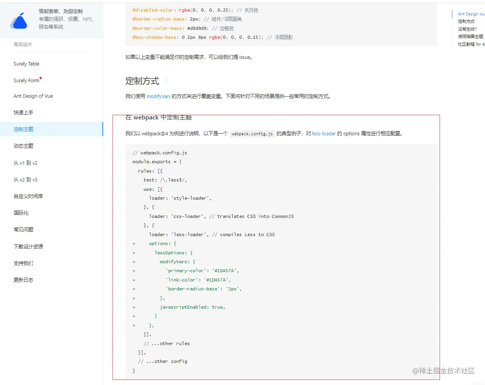
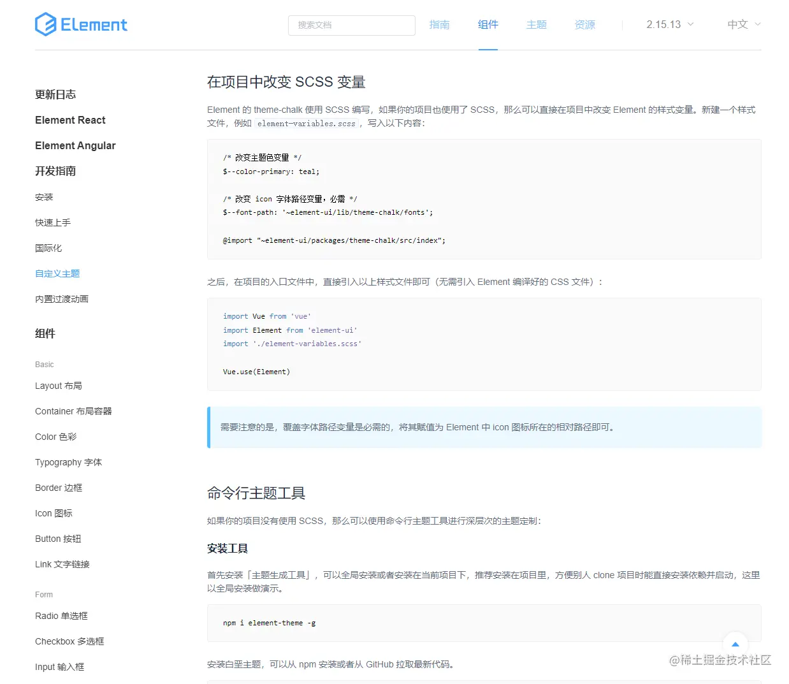
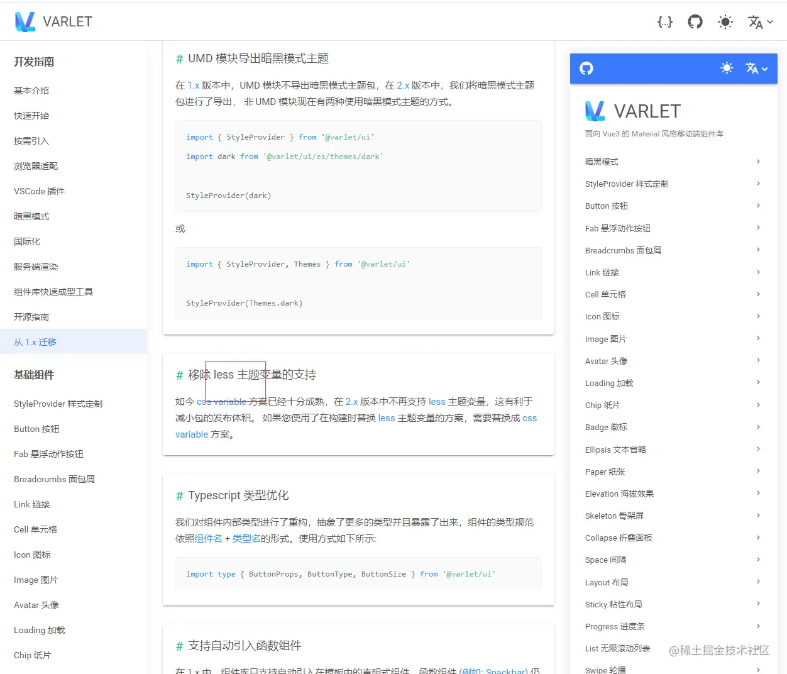
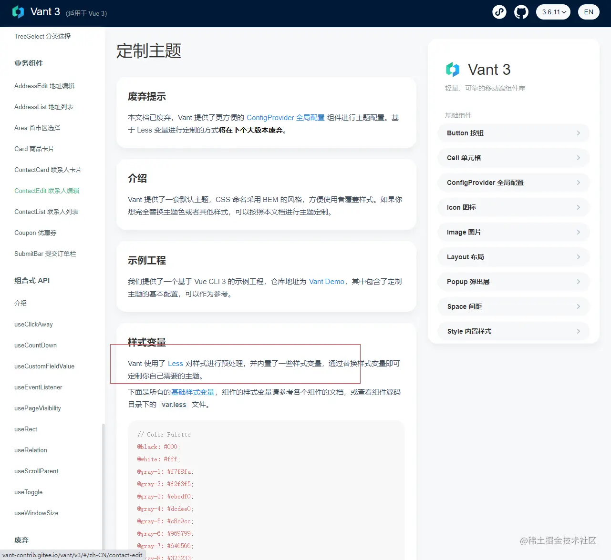

+++
title = "预处理器"
date = '2024-10-10T00:00:00+08:00'
lastmod = '2024-11-18T00:00:00+08:00'
draft = true
weight = 21
tags = ["面试", "前端", "CSS", "预处理器", "ecool"]
categories = ["前端开发", "面试"]
source = "https://fe.ecool.fun/knowledge-learn"
+++
### 前言

花样不断的前端，貌似多技术方案并行，已经成了家常便饭。

从大的框架开始，已经分裂react与vue派系。两者思维上虽然有相互不断的借鉴，但在大的方向思维上却是截然不同。而在react与vue的竞争以及相互较量的过程中，往往把其他的对手都干倒了，现在市场angular，jQuery等都逐步没落。

预编译css也同样，曾经也有多个派系。而后在sass与less的不断竞争中，stylus等其他的编译器也逐步退出市场。本文的重点，对比预编译css，scss与less对比。

### 基本介绍

先一起看看官方是如何定义或者介绍他们。

#### Sass

- 官方定义：

Sass是一种基于Ruby的CSS预处理器，它可以扩展CSS语言，并添加许多其他功能，如变量、嵌套规则、Mixin、函数等。Sass文件以“.scss”扩展名保存，与标准CSS文件兼容，并且可以使用普通CSS代码和语法。Sass也有一个较早的语法格式，以“.sass”扩展名保存，使用缩进的语法来代替括号和分号，但它现在已经不那么流行了。

- 个人理解：

sass是**第一个**流行的CSS预处理器，在2006年产生，这也为后续他用户量第一埋下伏笔。

#### Scss

- 官方定义：

Scss也是一种基于Ruby的CSS预处理器，它与Sass有很多相似之处，但是它的语法更接近标准CSS，使用花括号和分号。它是一种非常流行的CSS预处理器，与Sass相比，它更容易学习和使用，并且与现有的CSS代码更兼容。

- 个人理解：

Scss是Sass的一种语法格式，由2007推出。这还要从sass的规范语法说起，最典型的就是Sass使用缩进来表示代码块。这使部分使用者比较别扭。而产生了Scss，基于花括号和分号的CSS语法格式，使得它更易于阅读和理解。随着时间的推移，Scss逐渐取代了Sass作为Sass的主要语法格式。

#### Less

- 官方定义：

Less是一种基于JavaScript的CSS预处理器，它与Sass和Scss有很多相似之处，但它使用类似CSS的语法，并且更容易学习和使用。Less支持变量、Mixin、嵌套规则等功能，并且可以在客户端和服务器端使用。

- 个人理解：

Less由2009推出，也是提供了一套完整的生态链。它的语法跟sass不同。Less的学习成本更低，更容易理解和编写。此外，Less的编译速度比Sass更快。

#### Stylus

- 官方定义：

Stylus是一种基于JavaScript的CSS预处理器，它与Less、Sass和Scss有很多相似之处，但它的语法非常灵活，可以自由选择使用缩进或花括号来表示嵌套和块。Stylus还支持变量、Mixin、函数等功能，并且具有非常强大的插件系统，可以轻松地扩展其功能。

- 个人理解：

Stylus也是曾经一个比较完善的预编译语言。 但市场份额却原来越少。个人的观点，一是的学习成本高一些，有入门的门槛。而是生态链的问题，sass跟less的有较完善的生态链，而Stylus更像一个独立的东西。

#### PostCSS

- 官方定义：

PostCSS不是一种独立的CSS预处理器，而是一个CSS处理工具集合，可以通过各种插件扩展其功能。PostCSS可以用于转换CSS语法、提供自动前缀、压缩CSS代码、处理嵌套规则、优化图片等。它不像其他预处理器那样提供自己的语言，而是基于现有的CSS语法。使用PostCSS可以通过插件来实现更多的自定义和灵活性，使其成为一个强大的CSS处理工具。

- 个人理解：

跟上述的其他的处理器不同，PostCSS不应该算是一个预处理器，但却是我们做适配，压缩等处理时的一个选择。

### 数据分析

#### 市场占有率分析

我们借助npm官网统计工具对比，查看less与scss的数据量对比：

链接： [npm-stat.com/charts.html…](https://npm-stat.com/charts.html?package=less) [npm-stat.com/charts.html…](https://npm-stat.com/charts.html?package=sass)

如上图，左侧为less的数据，右侧为scss的数据。

我们可以通过统计清晰的看到。单单一个sass的下载量，基本达到less的两倍以上。此处还不包含sass阵营的其他工具，包括node-scss，dart-scss的下载量。

可以得出结论：**sass的使用量约为less的几倍**。（但此处有个值得一提的地方：统计为全球的用户量的统计，并非针对国内）

#### 组件库选择分析

从上述的数据中，我们了解到sass的使用量较多，但是国内出名的组件库，却是less居多。毕竟组件库，也代表我们的使用习惯之一。我们一起看看组件库的选择。

- ant design

选择了Less，地址：[www.antdv.com/docs/vue/cu…](https://www.antdv.com/docs/vue/customize-theme-cn)

- element

选择了scss，地址：[element.eleme.io/#/zh-CN/com…](https://element.eleme.io/#/zh-CN/component/custom-theme)

- varlet

选择了Less，地址：[varlet.gitee.io/varlet-ui/#…](https://varlet.gitee.io/varlet-ui/#/zh-CN/migrationGuide)

- vant

选择了Less，地址：[vant-contrib.gitee.io/vant/v3/#/z…](http://vant-contrib.gitee.io/vant/v3/#/zh-CN/theme)

结论：关于组件库的选择，Less还是占大多数，当然Scss也是部分组件库的选择。

### 个人分析

#### 相同点

- 都属于css语法编译的工具。
- 工具提供的方法也很多雷同。如都支持嵌套，都支持混合器（Mixin），都支持扩展（Extend），都支持颜色函数，都支持变量等等。
- 生态链都一致丰富，常用构建工具都基本支持，如webpack，vite, rollup等。
- 社区支持都强，提供了大量的插件、工具和资源，可以帮助开发者更好地使用Sass。
- 目的性也一致，都提高了CSS编写的效率和可维护性而产生。

#### 不同点

- 部分语法不同，如Sass 和 SCSS 中的变量使用 `$` 符号进行定义和引用，而不是 Less 中使用的 `@` 符号
- Sass 和 Scss 还提供了一些 Less 没有的特性，例如控制流语句和继承等。
- Sass 和 Scss 是基于Ruby或者Dart，Node的预处理器，他需要借助机器安装这些环境来支持。而Less, 是基于JavaScript的CSS预处理器，引入一段JS即可编译，有浏览器还是服务端，他都能编译。
- 虽然都有强大的社区，生态链。但总体还是Scss更丰富一些。

#### 特性分析

- Node-Sass 在国内有一定的兼容性问题，但是基于Dart 语言编写的 Dart Sass以及解决了这个问题。还在使用Node-Sass的建议切换Dart Sass。
- Less 的语法相对于 Sass 更加简洁，易于学习和理解。这使得 Less 在国内开发者中更受欢迎，尤其是对于那些不太熟悉预处理器语言的开发者来说。
- Sass的阵营更丰富，使用量更高一些，市场份额也更加稳定。除了发家早，这也得益于生态圈，例如 Bootstrap、Foundation、Bulma、Vue.js 等，都在曾经的版本自带了Sass。
- 国内组件库，还是Less居多，很多"高级前端"， 都觉得less 一直都比 sass 要稳定。至少不会出现Node版本，Python版本不一致等问题。

### 结语

所以Sass与Less谁更强？估计短期还是分不出成败。

个人的观点，Sass类似足球，Less类似篮球。两者都是人们喜欢的运动之一。

全球范围内，足球（Sass）受众更广泛，但在一些国家和地区（如中国），篮球（Less）可能更受欢迎。

## 常见考点

### 1. **预处理器的基本概念**

- **什么是 CSS 预处理器？**：让候选人简要解释 CSS 预处理器的概念，并说明其作用。
- **优缺点**：使用预处理器与原生 CSS 相比有哪些优势和缺点？在什么情况下会选择使用预处理器？

### 2. **变量和嵌套**

- **变量的使用**：如何在预处理器中定义和使用变量？使用变量可以带来哪些好处？
- **嵌套规则**：如何使用嵌套简化代码？在 Sass 或 LESS 中，嵌套深度的最佳实践是什么？嵌套过深会导致哪些问题？

### 3. **Mixin（混合）**

- **Mixin 的概念**：什么是 Mixin？如何使用 Mixin 来实现代码复用？
- **参数化 Mixin**：如何定义带参数的 Mixin？请举例说明如何在不同场景下复用带参数的 Mixin。
- **与变量的区别**：Mixin 与变量相比有哪些优缺点？在什么情况下适合使用 Mixin？

### 4. **继承（Extend）**

- **继承的作用**：预处理器中如何使用 `@extend` 实现继承？这种继承方式与 Mixin 的区别是什么？
- **优缺点**：`@extend` 的优缺点是什么？什么时候更适合使用 `@extend` 而不是 Mixin？

### 5. **条件与循环**

- **条件语句**：如何使用 `@if`、`@else` 在预处理中实现条件判断？在哪些场景下条件语句很有用？
- **循环语句**：如何使用 `@for`、`@each`、`@while` 等循环语句？循环可以在哪些场景下提高代码的简洁性和复用性？
- **动态生成样式**：通过循环生成大量样式规则时，如何控制生成的选择器，避免影响性能？

### 6. **模块化与分片管理**

- **文件分片**：在预处理器中如何使用 `@import` 将样式拆分为多个文件？模块化的样式结构有哪些好处？
- **依赖管理**：在大型项目中如何管理和组织多个模块？是否有 `@import` 的替代方案（如 Sass 中的 `@use`）？
- **命名空间**：如何利用命名空间避免样式冲突？在使用 `@use` 和 `@forward` 时，命名空间的管理方式是什么？

### 7. **函数（Function）**

- **自定义函数**：如何在预处理器中定义和使用函数？与 Mixin 有何不同？
- **内置函数**：Sass 或 LESS 中有哪些常用的内置函数？请举例说明常用函数如颜色操作（如 `lighten`、`darken`）、数学计算函数的应用场景。

### 8. **颜色和单位的操作**

- **颜色函数**：如何使用 `darken`、`lighten`、`adjust-hue` 等颜色函数动态调整颜色？这些颜色操作在设计系统中如何帮助实现主题切换？
- **单位转换**：如何通过 `px` 到 `rem` 的单位转换，使样式在不同设备上更具响应性？

### 9. **响应式设计**

- **媒体查询的简化**：在预处理器中如何通过变量或 Mixin 简化媒体查询的书写？如何为不同屏幕尺寸定义响应式 Mixin？
- **栅格系统实现**：是否可以在 Sass 或 LESS 中构建简单的栅格系统？如何通过 Mixin 生成栅格布局，简化响应式设计？

### 10. **预处理器中的最佳实践**

- **控制嵌套层级**：在 Sass 或 LESS 中，如何控制嵌套层级来防止代码冗长？推荐的嵌套深度是多少？
- **模块化与复用**：在大型项目中，如何通过变量、Mixin 和函数等实现复用和模块化？
- **编码规范**：如何保证使用预处理器的代码具有良好的可维护性？是否有推荐的代码规范？

### 11. **编译与构建**

- **预处理器的编译**：如何编译 Sass 或 LESS 文件？在构建工具中（如 Webpack）集成预处理器时，有哪些插件可用？
- **编译效率优化**：在使用预处理器的大型项目中，如何加快编译速度？使用部分编译（如 Dart Sass 中的即时编译模式）有何优势？

### 12. **预处理器的替代方案**

- **原生 CSS 功能的提升**：随着 CSS 变量、`@custom-media`、`@property` 等原生功能的发展，哪些预处理器的功能可以直接通过原生 CSS 实现？
- **CSS-in-JS 的对比**：相较于 Sass 或 LESS 等传统预处理器，CSS-in-JS 方案的优势是什么？什么时候适合选择 CSS-in-JS 而非传统预处理器？
