+++
title = "视觉格式化模型"
date = '2024-10-10T00:00:00+08:00'
lastmod = '2024-11-10T00:00:00+08:00'
draft = true
weight = 23
tags = ["面试", "前端", "CSS", "视觉格式化模型", "ecool"]
categories = ["前端开发", "面试"]
source = "https://fe.ecool.fun/knowledge-learn"
+++
大部分 Web 开发者都知道 CSS 中有一个盒模型，但很少有人知道在 CSS 的世界中还有另一个模型，他就是 CSS 的视觉格式化模型。

CSS 视觉格式化模型（英文称之**Visual Formatting Model**）。该模型主要是用来处理在视觉媒体上显示文档时使用的计算规则。仅从这一句话来描述，估计很多同学都会感到困惑，视觉格式化模型到底是什么鬼？大家先不用急着知道视觉格式化模型是什么，只需要知道它是 CSS 中很重要的一部分，如果理解了该部分所涉及到的知识点，将有助于你更好的理解和学习 CSS，特别是 Web 布局

## **什么是视觉格式化模型**

在盒模型中我们了解到，在 CSS 的世界中，任何一个元素都是一个盒子，它具有一个专业术语，即**盒模型**。而视觉格式化模型会根据 CSS 盒模型将文档中的元素转换为一个个盒子。看到这里，很多同学可能更会感到困惑，“**任何元素都是一个盒子，视觉格式化模型将元素转换为盒子，那这盒子是不是都是一样的盒子呢**”？

> 首先要声明一点：**视觉格式化模型和CSS盒模型不是同一个东西**！

简单点说呢。Web 页面（文档树）是由很一个个盒子组成（因为任何元素都可以被视为是一个盒子），而**视觉格式化模型**却是一套规则，用来计算**元素转换为盒子**的规则。而页面的布局都由这些盒子的所处的各处位置组合而成。那么理解了元素怎么转成盒子的规则，就理解了 Web 页面是怎么布局。而每个盒子的布局主要由以下几个因素决定：

-  **盒子的尺寸**：精确指定、由约束条件指定或没有指定 
-  **盒子的类型**：行内盒子（inline）、行内级盒子（inline-level）、原子行内级盒子（atomic inline-level）和块盒子（block） 
-  **定位方案**：普通流定位、浮动定位或绝对定位 
-  **文档树中的其它元素**：即当前盒子的子元素或兄弟元素 
-  **视窗尺寸与位置** 
-  **所包含的图片的尺寸** 
-  **其他的某些外部因素** 

先来看一张图，这个图是由下面的 HTML 结构构造出来的：

```HTML
<body>
    <header>
        <nav></nav>
    </header>
    <article>
        <p></p>
        <figure></figure>
        <p></p>
    </article>
    <aside></aside>
    <footer></footer>
</body>
```

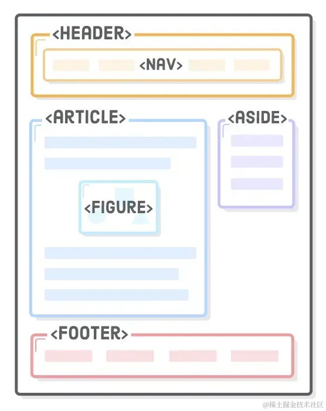

每个元素都是一个盒子，盒子中可以包含另一个或多个盒子。也正如上图所示，CSS 的视觉格式化模型会根据盒子的**包含块**（Containing Block，即**包含其他盒子的块**）的边界来渲染盒子。通常，盒子会创建一个包含其后代元素的包含块，但是盒子并不会被包含块限制住，盒子的布局会撑破包含块（即跑出包含块的边界），对于这种现象，在 CSS 中常被称为溢出。

溢出是一个很有意思的东东，在 Web 布局中时常会碰到，但在这一章中不做方面的阐述。

回到前面所提到的问题，视觉格式化模型中的盒子和 CSS 中盒模型指的盒子是不是同一个盒子？用一名话来概括：

> **盒子是同一个盒子，但两个模型做着不同的事情。CSS 的盒模型是计算盒子尺寸（** **`width`** **、** **`height`** **、** **`padding`** **、** **`border`** **和** **`margin`** **来决定）；视觉格式化模型是用来计算盒子位置（由前面提到的七个因素来决定）** ！

## **术语的简介**

在接下来的内容中会涉及到很多个有关于 CSS 理论方面的术语，而且这些术语会令人难于理解。可能一时无法很好的理解透彻，但之并不要紧，随着你对 CSS 的深入，这些术语你会越来越清楚。到目前为止，你只需要知道有这些术语以及其概念。

### **块**

块（Block），一个抽象的概念，一个块在文档流上占据一个独立的区域，块与块之间在垂直方向按照顺序依次堆叠（默认情况之下）。

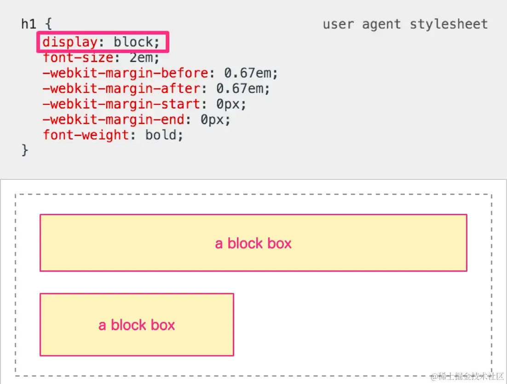

### **包含块**

包含块（Containing Block），指的是包含其他盒子的块。


> The position and size of an element's box(es) are sometimes calculated relative to a certain rectangle, called the containing block of the element.

大至意思是，盒子的定位和大小都是参考一个矩形边缘来计算的，而这个矩形就是元素的容器块。一个元素的容器块大概定义如下：

-  首先根元素就是一个初始容器块（Initial Containing Block） 
-  其次，如果元素的 `position` 是 `relative` 或`static`，其容器块就是由离它最近的块容器父元素或创建了一个格式化上下文的父级元素生成 
-  如果元素设置了`position:fixed`，它的容器块一般由视窗生成 
-  如果元素设置了`position:absolute`，它的容器块就由设置了`position`值为`relative`、`absolute`或`fixed`的最近父元素生成，如果父级元素都没有设置，则由根元素生成 
-  `transform`属性值为非`none`的元素会生成一个容器块，其`fixed`的子元素会以此定位 

那么如何来判断包含块呢？我们用 w3chelp 的一张图来向大家展示：

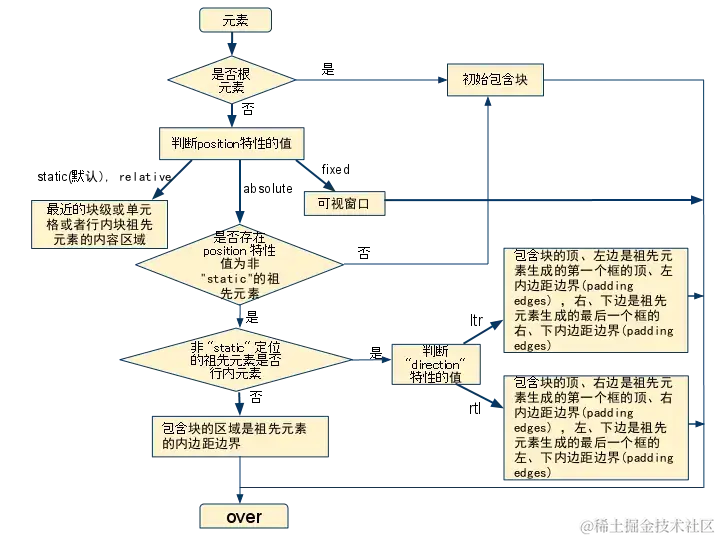

### **盒子**

盒子（Box），一个抽象的概念，由 CSS 引擎根据文档中的内容所创建，主要用于文档元素的定位、布局和格式化等用途。盒子与元素并不是一一对应的，有时多个元素会合并一个盒子，有时一个元素会生成多个盒子（比如匿名盒子）。

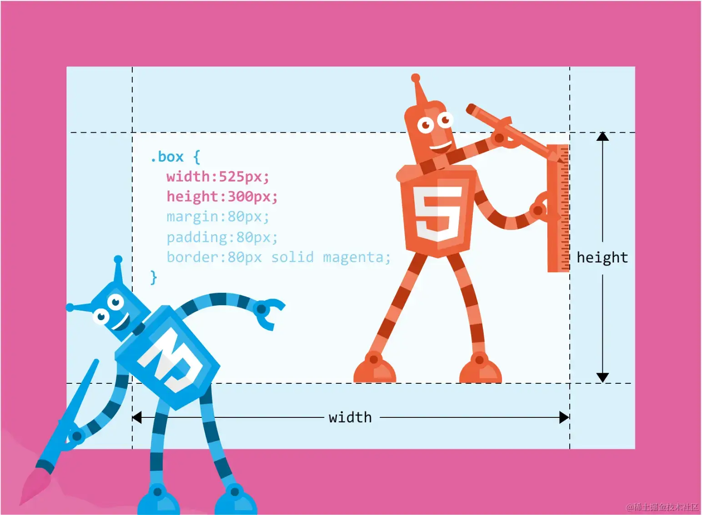

众所周知，大家都知道一个 HTML 的文档会生成一个DOM树：

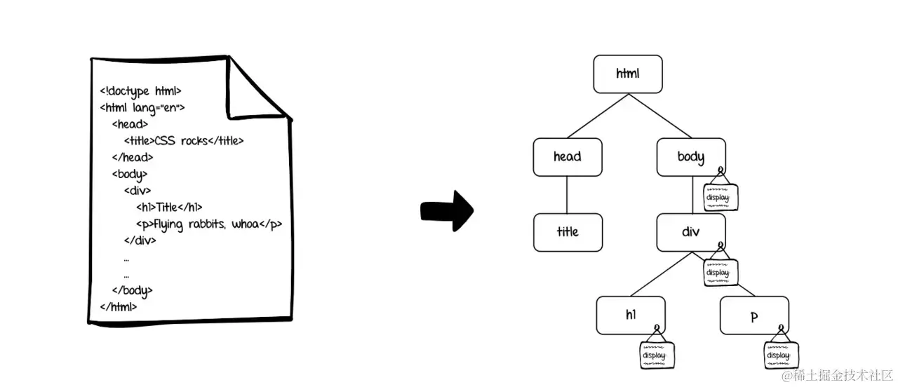

同样的，CSS 中也会根据文档结构构建一个盒子树：

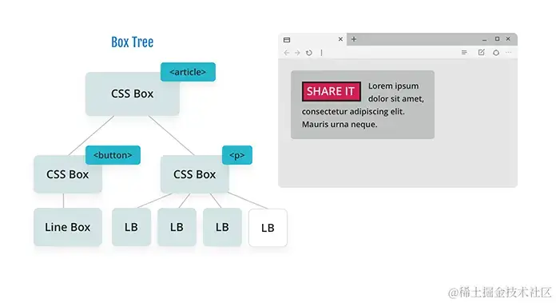

更多的人可能更易于接受 CSSOM 的概念。这里额外提一下，正是 DOM 树和 CSSOM 树才构建成了一颗渲染树：

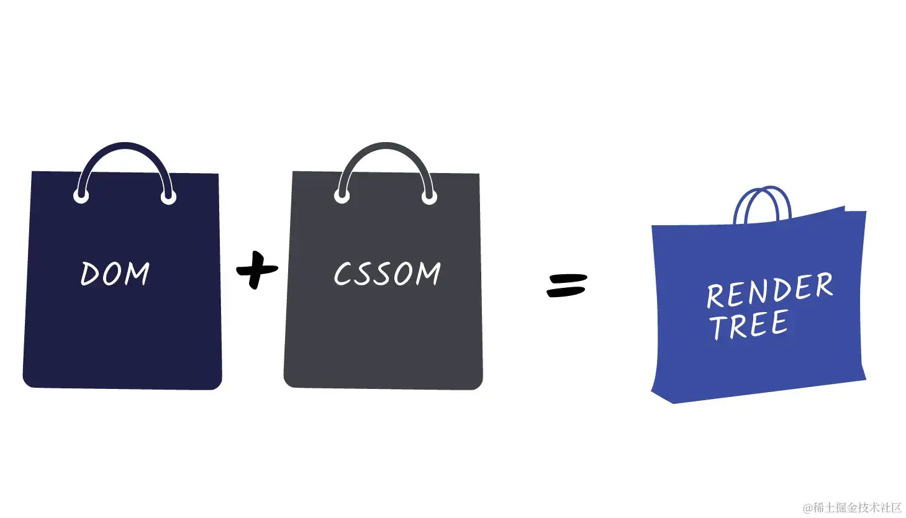

其实这涉及到浏览器渲染方面的原理了，类似下图，布局仅是整个过程中的一部分：

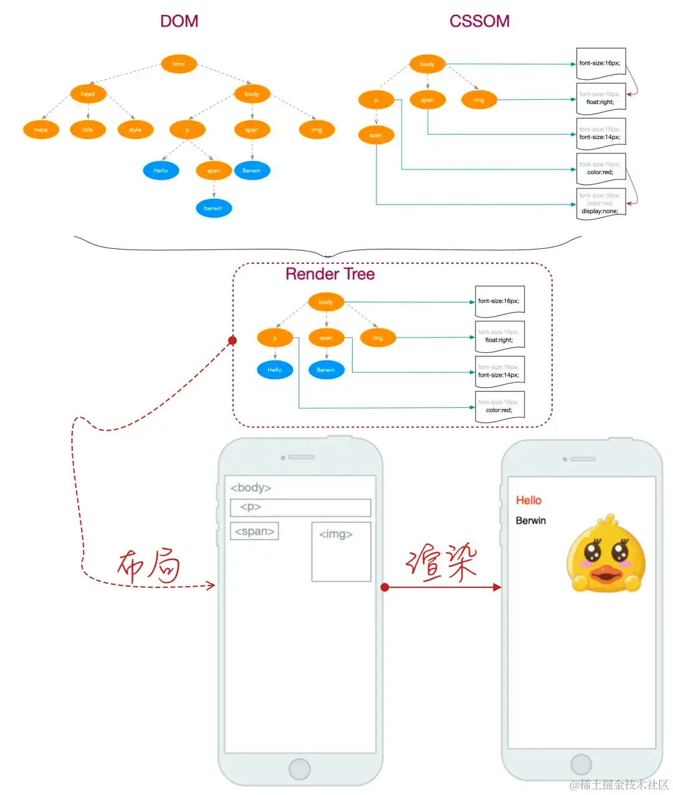

> 扯得有点远，还是回到主题中来，如果大家对这方面知识感兴趣的话，可以查阅读一些浏览器渲染或CSS引擎方面的话题。

### **块级盒子和行内级盒子**

块级盒子（Block-level Box），由块级元素生成。一个块级元素至少会生成一个块级盒子，但也有可能生成多个（例如列表项元素）。

行内级盒子（Inline-level Box），由行内级元素生成。同样的，一个行内元素至少会生成一个行内级盒子。行内级盒子包括行内盒子和原子行内级盒子两种，区别在于该盒子是否参与行内格式化上下文的创建。

> 简单地说，块元素生成块组盒子，行内元素或行内级元素生成行内级盒子。两种盒子可以通过`display`来进行切换。

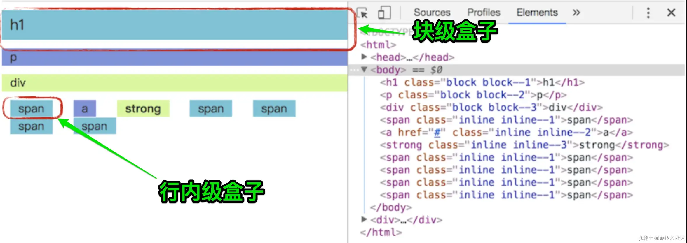

### **块盒子和行内盒子**

块盒子（Block Box），如果一个块级盒子同时也是一个块容器盒子，则称其为块盒子。除具名块盒子之外，还有一类块盒子是匿名的，称为匿名块盒子（Anonymous Block Box），匿名盒子无法被 CSS 选择器选中。

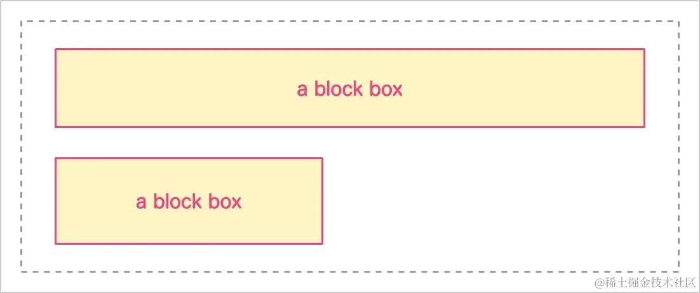

行内盒子（Inline Box）由非替换元素（Non-replaced Element）生成，属于行内级盒中的一种。除了行内盒子之外，其他的行内级盒子都是原子行内级盒（Atomic Inline-level Box），它的典型特征就是作为一个整体，不能拆分换行。同样的，行内盒子也有匿名行内盒（Anonymous Inline Box）。对于没有任何元素包裹的直接文本，CSS引擎会为其创建匿名行内盒。

> 简单地说，参与行内格式化上下文创建的行内盒子称为行内盒子。

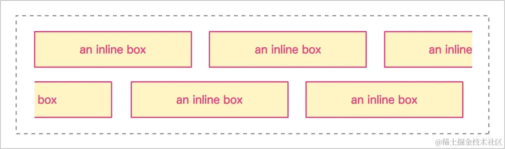

### **原子行内级盒子**

原子行内级盒子（Atomic Inline-level Box），不参与行内格式化上下文创建的行内级盒子。原子行内级盒子一开始叫做原子行内盒子（Atomic Inline Box），后被修正。原子内级盒子的内容不会拆分成多行显示。

### **行盒**

行盒（Line Box）和行内盒是不一样的。行盒是由行内格式化上下文（Inline Formatting Context）产生的盒子，用于表示一行。行盒从包含块的一边排版到另一边。一般情况下，浏览器为会每行创建一个看不见的行盒。

行盒的内部构造也是较为复杂的，也是 CSS 中较为复杂而且难于理解的一部分。下图就是一个行盒的构造：

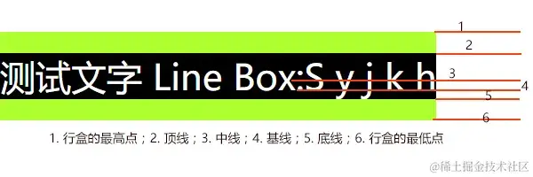

### **块容器盒子**

块容器盒子（Block Container Box 或 Block Containning Box），块容器盒子侧重于当前盒子作为容器角色，它不参与当前块的布局和定位，它所描述的仅仅是当前盒子与其后代之间的关系。换句话说，块容器盒子主要用于确定其子元素的之一位、布局等。

### **块级元素和行内级元素**

> CSS中的盒子非常复杂，有**块盒子**和**块级盒子**（**行内盒子**和**行内级盒子**）之分。各种盒子让初学者甚为头疼。不过元素相对于盒子而言，要简单地多，它只有**块级元素**和**行内级元素**之分。

块级元素（Block-level Element）是指元素的`display` 值为`block`、`list-item`、`table`、`flex` 和 `grid` 等，该元素将成为块级元素。元素是否是块级元素仅是元素本身的属性，并不直接用于格式化上下文的创建或布局。

行内级元素（Inline-level Element）是指元素的 `display` 值为 `inline`、`inline-block`、`inline-table`、`inline-flex` 和 `inline-grid` 等，该元素将成为行内级元素。与块元素一样，元素是否是行内级元素仅是元素本身的属性，并不直接用于格式化上下文的创建或布局。

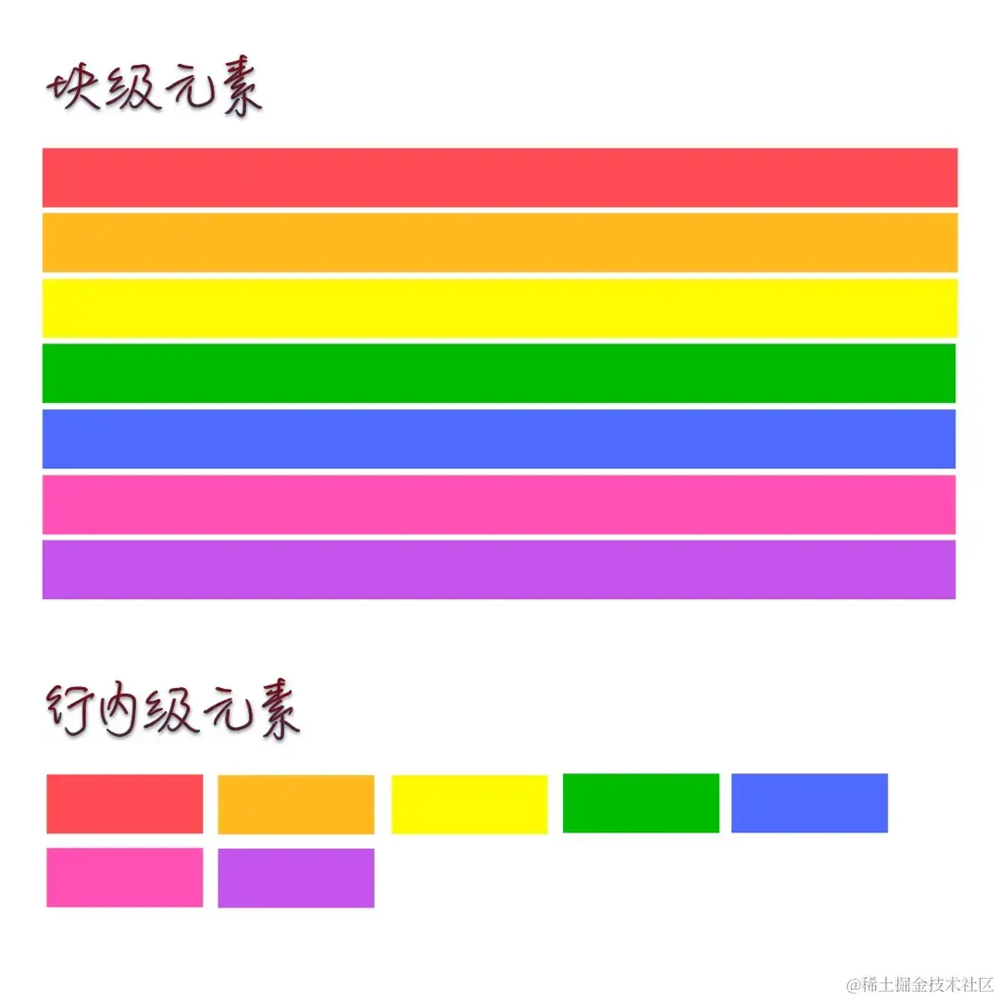

### **视窗（Viewport）**

简单地说，视窗就是浏览器中可视区域。视窗大小指的就是浏览器可视区域的大小：

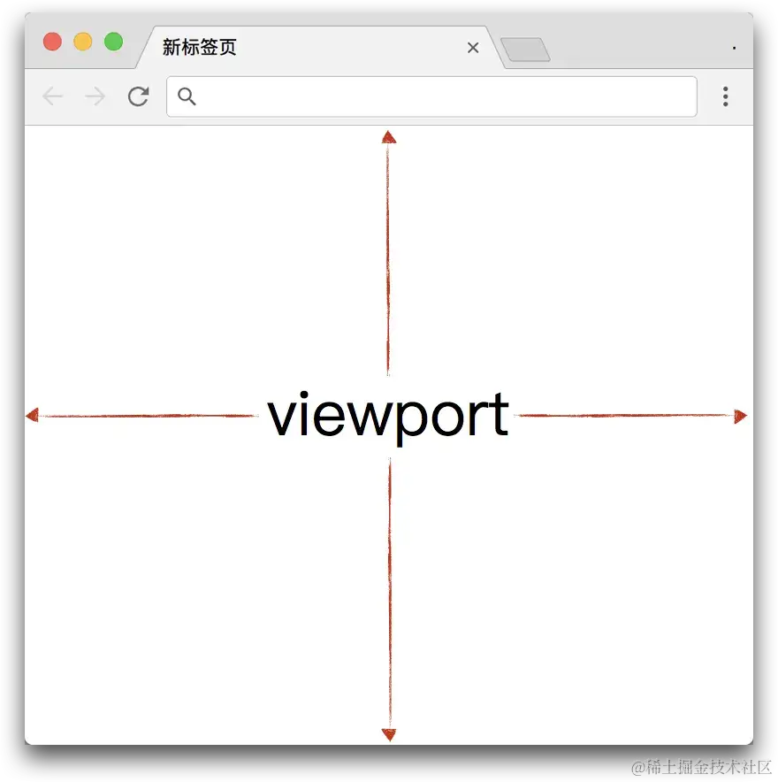

时至今日，面对不同的终端屏幕，视窗大小也有所不一样：

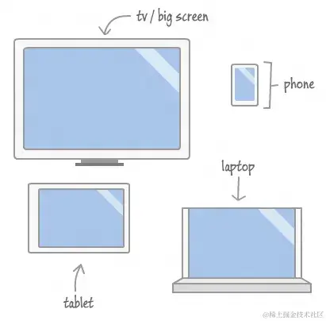

特别是在移动设备上，视窗又分为 **Layout viewport** 、 **Visual viewport** 和 **Ideal viewport** 三类：

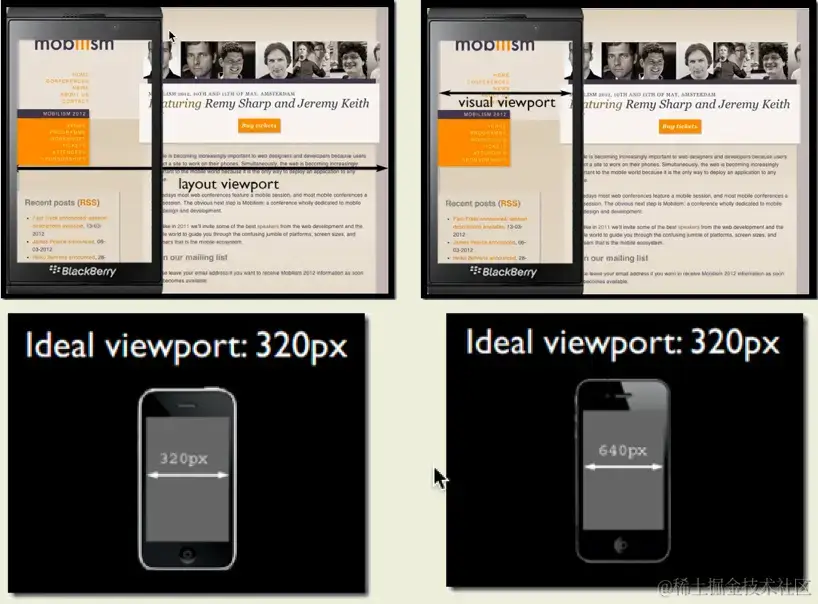

其中的 Ideal viewport 是最适合移动设备的 viewport，Ideal viewport 的宽度等于移动设备的屏幕宽度，只要在 CSS 中把某一元素的宽度设为 Ideal viewport 的宽度(单位用`px`)，那么这个元素的宽度就是设备屏幕的宽度了，也就是宽度为`100%` 的效果。Ideal viewport 的意义在于，Ideal viewport 并没有一个固定的尺寸，不同的设备拥有有不同的 Ideal viewport。无论在何种分辨率的屏幕下，那些针对 Ideal viewport 而设计的网站，不需要用户手动缩放，也不需要出现横向滚动条，都可以完美的呈现给用户。

### **格式化上下文**

默认情况下，盒子按照元素**在 HTML 中的先后位置从左至右自上而下依次堆叠**：

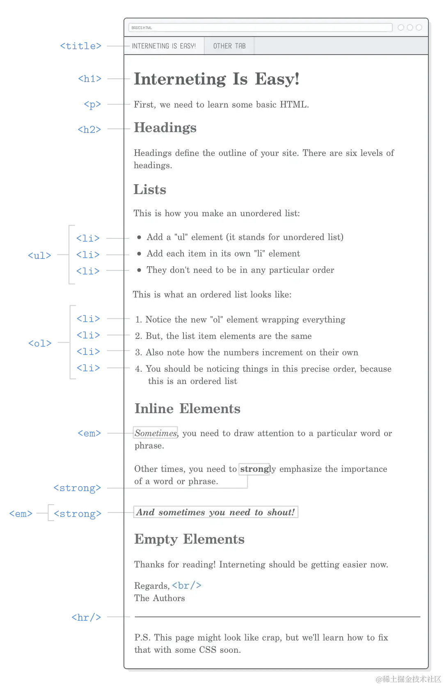

从图中可以看出来，有些元素的盒子被渲染为完整的一行，比如 `h1`、`li` 等元素；有些元素的盒子则被渲染为水平排列的，直到该行被占满然后换行，比如 `em`、`strong` 等元素。

这是因为不同的盒子使用的是不同的格式化上下文（Formatting Context）来布局，每个格式化上下文都拥有自己不同的渲染规则，而这些规则是用来决定其子元素如何定位，以及和其他元素的关系。好比水倒进不同的器皿中，会有不同的形态：


在CSS中格式化上下文有很多种，比如**IFC（Inline Formatting Context）** 、**BFC（Block Formatting Context）** 、**FFC（Flexbox Formatting Context）** 和**GFC（Grid Formatting Contexgt）** 等。而这些格式化上下文的集合可以称作**视觉格式化模型**。

> 格式化上下文是CSS中非常重要的一部分，稍后会花一定的篇幅来阐述CSS中的 **`*FC`**。

## **盒子的生成**

盒子的生成是 CSS 视觉格式化模型的一部分，用于从文档元素生成盒子。盒子有不同的类型，不同类型的盒子的格式方法也有所不同，不同的盒子也会影响元素或其后代元素的行为。在 CSS 中，通常使用 `display` 属性来明确盒子的类型。

CSS 的 `display` 属性的值，将导致文档里的元素生成一个主盒（Principal Box）以包含后代盒子和内容，同时其自身也是参与到定位方案中的盒子。而有些元素除了会生成主盒之外，还可能会生成额外的盒子。比如设置了 `display` 值为 `list-item` 元素。这些额外的盒子的放置位置与主盒有关。

> CSS的 `display` 切换不同的值时，会产生生成不同的盒子；同时客户端渲染HTML文档时都会为每个元素自带一个盒子。

### **一切都是盒子**

在 CSS 中，一切都会生成盒子。Web 页面本质上是一组块级盒子和内联级盒子。你可以在浏览器的开发者工具中选择页面上的元素，就可以很好的理解这些盒子。可以看到构成布局的盒以及盒子的各种属性（外边距 `margin`、内距`padding`、边框`border`和内容`content`等），还能看到这些盒子属性的应用方式：

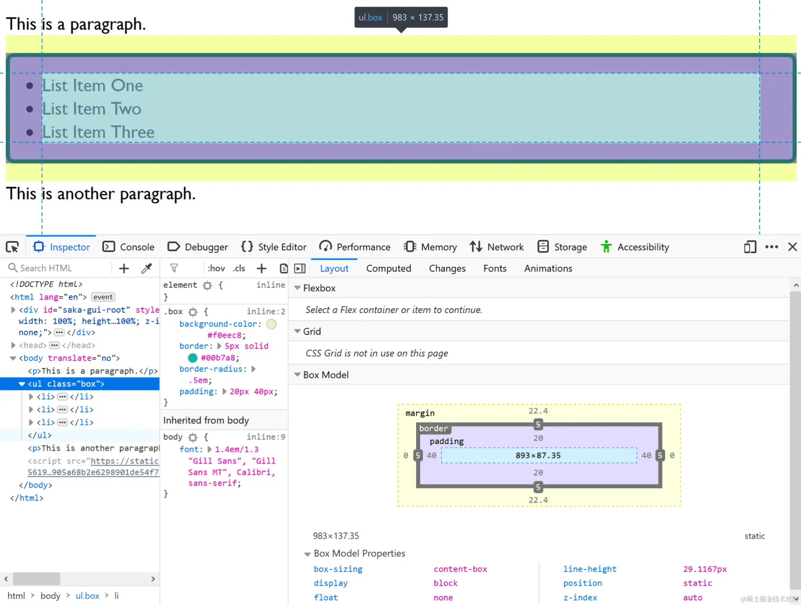

### **控制盒子生成**

前面提到过，在 CSS 中任何东西都是一个盒子，盒子之间的类型还可以使用 `display` 的不同值来进行切换。在 `display` 中还有两个不同的值 `none` 和 `contents` ，**可以用来控制盒子是否应该显式**。如果你希望 HTML 中的元素不想在 CSS 中生成盒子，就需要以某种方式来抑制盒子的生成。你可能想做两件事：

-  防止元素及其后代元素生成一个盒子 
-  防止元素自身生成一个盒子，但其后代元素仍然会生成一个盒子 

在 CSS 中的 `display` 属性的 `none` 和 `contents` 即可帮助我们做到这两点：

-  如果元素的 `display` 取值为 `none` 时，元素和其后代元素都将不可见，也不会生成任何盒子 
-  如果元素的 `display` 取值为 `contents` 时，元素自身的盒子属性（`margin`、`padding` 和 `border` 等）都将丢失，但其后代元素不受任何影响。也就是说，元素自身不再是一个盒子，但其后代元素依旧是一个盒子 

也就是说，CSS 的 `display` 属性控制盒子生成：

-  元素的 `display` 值不是 `none` 或 `contents` 时，元素即可生成一个盒子，盒子的类型由其值的类型来决定 
-  元素的 `display` 值是 `none` 时，元素及其后代元素都不会生成盒子 
-  元素的 `display` 值是 `contents` 时，元素自身不会生成盒子，但其后代元素依旧会根据 `display` 生成相应的盒子 

接下来，我们来看看各种盒子的生成。

### **块级元素与块盒子**

当元素的 `display` 为`block`、`list-item`、`table`、`flex` 或 `grid` 时，该元素将成为块级元素。一个块级元素会被格式化成一个块，比如我们熟悉的 `div`、`p`、`li` 等元素。这些块级元素默认按照从左到右自上而下依次堆叠。

而每个块级盒子都会参与块格式化上下文（Block Formatting Context，俗称**BFC**）的创建，每个块级元素都会至少生成一个块级盒子，即主块级盒子（Principal Block-level Box）。有一些元素除了会生成主块级盒子之外，还会生成额外的盒子。比如 `display` 取值为 `list-item` 的元素，除了生成主块级盒子之外，还会生成一个Marker标记盒子（Marker标记是指类似项目符号的标记），而那些生成列表项的元素可能会生成更多的盒子。

> 大多数元素只生成一个主块级盒子。

主块级盒子包含由后代元素生成的盒子以及内容，同时也会参与定位方案。一个块级盒子可能也是一个块容器盒子。块容器盒子（Block Container Box）要么只包含其他块级盒子，要么只包含行内盒子并同时创建一个行内格式化上下文（Inline Formatting Context，俗称**IFC**）。

注意，**块级盒子与块容器盒子是不同的**，这一点很重要。块级盒子描述了元素与其父元素和兄弟元素之间的行为；块容器盒子描述了元素跟其后代之间的行为。这些块级盒子并不是块容器盒子，比如`table`；而有些块容器盒子也不是块级盒子，比如非替换行内块和非替换表格单元格。

如果一个盒子同时**既是块容器盒子又是块级盒子**的话，该盒子被称为**块盒子（Block Box）** 。

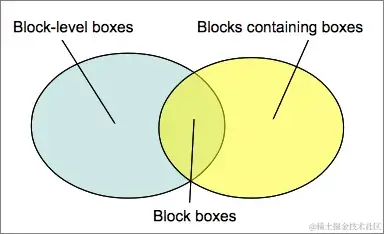

前面我们提到过各种块、盒子和元素这样的术语。那么这里我们简单的理一理**块（Block）** 、**包含块（Containing Block）** 、**盒子（Box）** 、**块级盒子（Block-level Box）** 、**块盒子（Block Box）** 、**块容器盒子（Block Containning Box）** 和**块级元素（Block-level Element）** 之间的关系：

-  元素`display`的值为`block`、`list-item`、`table`、`flex`和`grid`时，该元素会生成一个**块级元素（Block-level Element）** 
-  块级元素（Block-level Element）会生成一个**块级盒子（Block-level Box）** 
-  块级盒子会参与**块格式化上下文（BFC）** 的创建 
-  块级盒子（Block-level Element）描述了元素与其父元素和兄弟元素之间的行为 
-  **块容器盒子（Block Containning Box）** 描述了元素跟其后代之间的行为。要么只包含**块级盒子（Block-level Box）** ，要么只包含**行内级盒子（Inline-level Box）** 。有的块容器盒子不是**块级盒子**，同样块级盒子有时也不是块容器盒子 
-  同时是**块级盒子（Block-level Box）** 和**块容器盒子（Block Containning Box）** 的盒子被称作是**块盒子（Block Box）** 
-  除此之外，还有**匿名块盒子（Anonymous Block Box）** （稍后介绍） 

比如下面这样的一个示例：

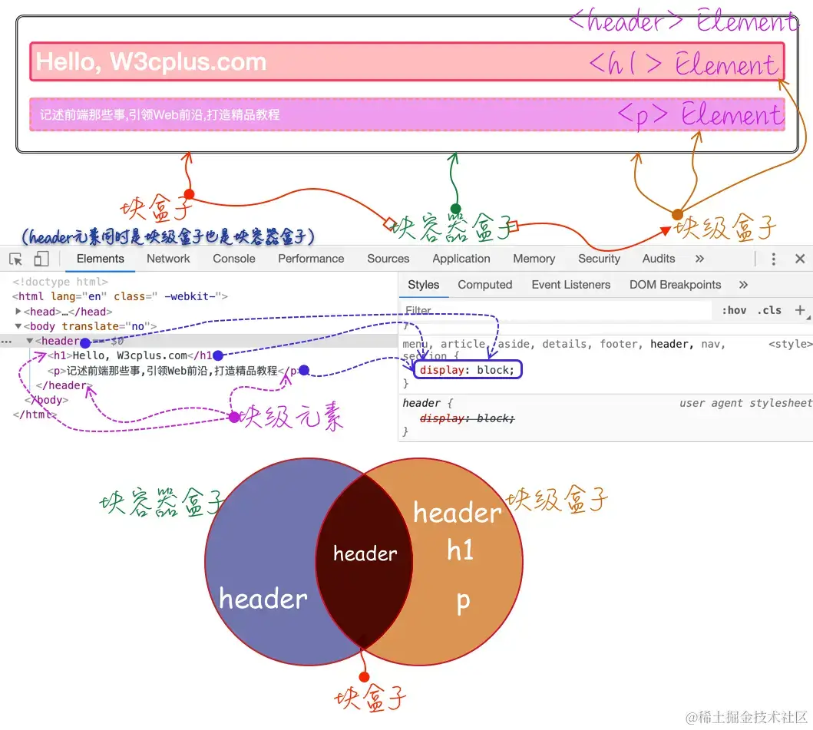

### **行内级元素和行内盒子**

CSS的`display`有很多个属性值，当元素的`display`属性的值为`inline`、`inline-block`、`inline-table`、`inline-flex`或`inline-grid`时，该元素被称为行内级元素。显示时，它不会生成内容块，但是可以与其他行内级内容一起显示为多行。比如，包含多种格式内容（比如`strong`、`img`等）的段落`p`，就可以由行内级元素组成。

行内级元素会生成行内级盒子，该盒子同时会参与行内格式化上下文（Inline Formatting Context）的创建。行内盒子既是行内级盒子，也是一个其内容参与创建其容器的行内格式化上下文的盒子，比如所有具有`display: inline`样式的非替换盒子。如果一个行内级盒子的内容不参与行内格式化下下文的创建，则称其为原子行内级盒子。而通过替换行内级元素或`display`值为`inline-block`、`inline-table`、`inline-flex`或`inline-grid`的元素创建的盒子不会像行内盒子一样可以被拆分为多个盒子。

简单归纳一下：

-  元素`display`的值为`inline`、`inline-block`、`inline-table`、`inline-flex`或`inline-grid`时，元素则为行内级元素（Inline-level Element） 
-  行内级元素会生成行内级盒子（Inline-level Box），会参与IFC的创建 
-  同样的，也会创建一个匿名行内盒子 

### **匿名盒子**

匿名盒子分为**块匿名盒子**和**行内匿名盒子**。在某些情况下进行视觉格式化时，需要添加一些增补性的盒子，这些盒子无法被CSS的选择器选中，而这种盒子被称为**匿名盒子（Anonymous Box）** 。

CSS选择器不能作用于匿名盒子（Anonymous Box），所以无法设置样式。也就是说，此时所有可继承的CSS属性值都为`inherit`，而所有不可继承的CSS属性值都为`initial`。

比如下面的示例，在`div`元素中包含了一个`p`元素，而且`p`元素前后直接有一段文本：

```HTML
<div>
    我是直接文本
    <p>我是块级元素，但是我的前后都不是</p>
    我也是直接文本
</div>
```

这个示例中的，`div`元素中的文本内容（`p`元素前后的**文本内容**）创建匿名块盒子，渲染出来的效果如下所示：

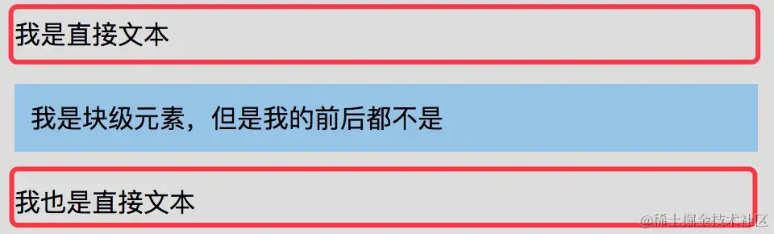

上图中，红色框中的就是匿名块盒子。

另一种会创建匿名块盒子的情况是一个行内盒子中包含一或多个块盒子。此时，包含块盒子的盒子会拆分为两个行内盒子，分别位于块盒子的前面和后面。块盒子前面的所有行内盒子会被一个匿名块盒子包裹，块盒子后面的行内盒子也是一样。因此，块盒子将成为这两个匿名块盒子的兄弟盒子。

如果有多个块盒子，而它们中间又没有行内元素，则会在这些盒子的前面和后面创建两个匿名块盒子。

比如下面这样的示例：

```HTML
<p>Some <em>inline</em> text <span>followed by a paragraph</span> followed by more inline text.</p>
```

所设`p`元素设置了`display: inline`，`span`的`display`为`block`。此时也会创建两个匿名块盒子：一个是`span`元素前面的文本，另一个是其之后的文本。

类似于块盒子，CSS引擎有时候也会自动创建一些行内匿名盒子。常见的情况是CSS引擎会自动为直接包含在块盒子中的文本创建一个行内格式化上下文，在这种情况下，这些文本会被一个足够大的匿名行内盒子所包含。但是如果仅包含空格则有可能不会生成匿名行内盒子，因为空格有可能会由于 `white-space` 的设置而被移除，从而导致最终的实际内容为空。

比如下面这个示例：

```HTML
<p><span>Hellow</span> W3cplus.com!</p>
```

在`<p>`元素中无任何块级元素，也没有元素显式设置`displa`为`block`、`table`、`flex`或`grid`，并且直接包含了文本内容，比如上例中的“**`W3cplus.com`**”文本。属于`p`元素的直接本文，这个时候CSS引擎会为其创建一个匿名行内盒。

### **其他类型的盒子**

除了上述说到的盒子，在CSS中还定义了几种内容模型，这些模型同样可以应用于元素。这些模型一般用来描述布局，它们可能会定义一些额外的盒子类型：

-  **表格内容模型**：可能会创建一个表格包装器盒子和一个表格盒子，以及多个其他盒子如表格标题盒子等 
-  **多列内容模型**：可能会在容器盒子和内容之间创建多个列盒子 
-  **Flexbox内容模型**：可能会创建一个弹性盒子 
-  **Grid内容模型**：可能会创建一个网格盒子 

## **格式化上下文**

CSS中的格式化上下文有很多种，除了大家熟悉的BFC、IFC之外还有由Flexbox布局创建的FFC和Grid布局创建GFC等。这些统称为CSS格式化上下文，也被称作**视觉格式化模型**。而CSS视觉格式化模型是用来处理文档并将它显示在视觉媒体上的机制。简单地说，就是用来**控制盒子的位置，即实现页面的布局**。

格式化上下文也可以说是CSS视觉渲染中的一部分，其主要作用是**决定盒子模型的布局，其子元素将如何定位以及和其他元素的关系和相互作用**。那么理解CSS格式化上下文有助于我们掌握各类CSS布局的关键。

### **行内格式化上下文**

行内格式化上下文（Inline Formatting Context），简称**IFC**。主要用来规则行内级盒子的格式化规则。

IFC的行盒的高度是根据包含行内元素中最高的实际高度计算而来。主要会涉及到CSS中的`font-size`、`line-height`、`vertical-align`和`text-align`等属性。

行内元素从包含块顶端水平方向上逐一排列，水平方向上的 `margin`、`border`、`padding` 生效。行内元素在垂直方向上可按照顶部、底部或基线对其。

当几个行内元素不能在一个单独的行盒中水平放置时，他们会被分配给两个或更多的(Vertically-stacked Line Box)垂直栈上的行盒，因此，一个段落是很多行盒的垂直栈。这些行盒不会在垂直方向上被分离（除非在其他地方有特殊规定），并且他们也不重叠。

-  垂直方向上，当行内元素的高度比行盒要低，那么 `vertical-align` 属性决定垂直方向上的对齐方式。 
-  水平方向上，当行内元素的总宽度比行盒要小，那么行内元素在水平方向上的分部由 `text-align` 决定。 
-  水平方向上，当行内元素的总宽度超过了行盒，那么行内元素会被分配到多个行盒中去，如果设置了不可折行等属性，那么行内元素会溢出行盒。 
-  行盒的左右两边都会触碰到包含块，而 `float` 元素则会被放置在行盒和包含快边缘的中间位置。 

下面这些规则都会创建一个行内格式化上下文：

-  IFC只有在一个**块级元素**中仅包含**行内级元素**时才会生成 
-  内部的盒子会在不平方向，一个接一个的放置 
-  这些盒子垂直方向的起点从包含块盒子的顶部开始 
-  摆放这些盒子的时候，它们在水平方向上的`padding`、`border`和`margin`所占用的空间都会被考虑在内 
-  在垂直方向上，这些盒子可能会以不同形式来对齐（`vertical-align`） 
-  能把在一行上的盒子都完全包含在一行行盒（Line Box），行盒的宽度是由包含块和存在的浮动来决定 
-  IFC中的行盒一般左右边都紧贴其包含块，但是会因浮动元素的存在发生变化。浮动元素会位于IFC与行盒之间，使得行盒宽度缩短 
-  当行内级盒的总宽度小于包含它们的行盒时，其水平渲染规则则由`text-align`来确定 
-  当行内盒超过行盒的宽度时，它会被分割成多个盒子，这些盒子被分布在多个行盒里。如果一个行内盒不能被分割，则会溢出行盒 

IFC主要用于：

-  行内元素按照 `text-align` 进行水平居中 
-  行内元素撑开父元素高度，通过 `vertical-align` 属性进行垂直居中 

### **块格式化上下文**

块格式化上下文（Block Formatting Context，BFC） 是Web页面的可视化CSS渲染的一部分，是块盒子的布局过程发生的区域，也是浮动元素与其他元素交互的区域。

BFC实际上就是页面中一块渲染区域，该区域与其他区域隔离开来。容器里面子元素不会影响到外部，外部的元素也不会影响到容器里的子元素。

BFC 内部的盒子会从上至下一个接着一个顺序排列。BFC 内的垂直方向的盒子距离以 `margin` 属性为准，上下 `margin` 会叠加。每个元素的左侧最外层边界与包含块 BFC 的左边相接触(对于从左往右的格式化，否则相反)。即使存在浮动也是如此。BFC 的区域不会与浮动元素的盒子折叠。BFC 的高度也会受到浮动元素的影响，浮动元素参与计算。

下面这些规则可以创建一个BFC：

-  根元素或包含根元素的元素 
-  浮动元素（元素的 `float` 不是 `none`） 
-  绝对定位元素（元素的 `position` 为 `absolute` 或 `fixed`） 
-  行内块元素（元素的 `display` 为 `inline-block`） 
-  表格单元格（元素的 `display`为 `table-cell`，HTML表格单元格默认为该值） 
-  表格标题（元素的 `display` 为 `table-caption`，HTML表格标题默认为该值） 
-  匿名表格单元格元素（元素的 `display`为 `table`、`table-row`、 `table-row-group`、`table-header-group`、`table-footer-group`（分别是HTML `table`、`row`、`tbody`、`thead`、`tfoot`的默认属性）或 `inline-table`） 
-  `overflow` 值不为 `visible` 的块元素 
-  `display` 值为 `flow-root` 的元素 
-  `contain` 值为 `layout`、`content`或 `strict` 的元素 
-  弹性元素（`display`为 `flex` 或 `inline-flex`元素的直接子元素） 
-  网格元素（`display`为 `grid` 或 `inline-grid` 元素的直接子元素） 
-  多列容器（元素的 `column-count` 或 `column-width` 不为 `auto`，包括 `column-count` 为 `1`） 
-  `column-span` 为 `all` 的元素始终会创建一个新的BFC，即使该元素没有包裹在一个多列容器中 

块格式化上下文包含创建它的元素内部的所有内容。其主要使用：

-  创建独立的渲染环境 
-  防止因浮动导致的高度塌陷 
-  防止上下相邻的外边距折叠 

### **Flex格式化上下文**

Flex格式化上下文（Flexbox Formatting Context）俗称**FFC**。当`display`取值为`flex`或`inline-flex`，将会创建一个Flexbox容器。该容器为其内容创建一个新的格式化上下文，即**Flex格式化上下文**。

不过要注意的是，Flexbox容器不是块容器（块级盒子），下列适用于块布局的属性并不适用于Flexbox布局：

-  多列中的`column-*`属性不适用于Flexbox容器 
-  `float`和`clear`属性作用于Flex项目上将无效，也不会把让Flex项目脱离文档流 
-  `vertical-algin`属性作用于Flex项目上将无效 
-  `::first-line`和`::first-letter`伪元素不适用于Flexbox容器，而且Flexbox容器不为他们的祖先提供第一个格式化的行或第一个字母 

### **Grid格式化上下文**

Grid格式化上下文（Grid Formaatting Context），俗称**GFC**。和FFC有点类似，元素的`display`值为`grid`或`inline-grid`时，将会创建一个Grid容器。该完完全全器为其内容创建一个新的格式化上下文，即**Grid格式化上下文**。这和创建BFC是一样的，只是使用了网格布局而不是块布局。

网格容器不是块容器，因此一些假定为块布局设计的属性并不适用于网格格式化上下文中。特别是：

-  `float`和`clear`运用于网格项目将不会生效。但是`float`属性仍然影响网格完完全全器子元素上`display`的计算值，因为这发生在确定网格项目之前 
-  `vertical-align`运用于网格项目也将不会生效 
-  `::first-line`和`::first-letter`伪元素不适用于网格容器，而且网格容器不向它们社先提供第一个格式化行或第一个格式化字母 

## **小结**

这一章节中聊到的了CSS中各种术语，特别是各种盒子，足以让大家感到困惑，甚至是痛苦。希望这篇文章有关于这些术语的阐述能帮助大家减少一些许痛苦。另外，文章中除了介绍CSS中的各种术语之外，还给大家阐述了CSS的格式化模型。初学者对该概念都不以为然，而实际上，如果对CSS格式化模型了解不清楚的话，对于CSS布局就会碰到很多头痛的事情，甚至无法让你快速解决碰到布局的问题。

如果你仔细阅读完了上面的内容，你可能会知道，CSS视觉格式化模型是各种格式化上下文的集合。不同的格式化上下文又决定了每个盒子的类型，以及盒子布局。虽然说CSS的视觉格式化模型和CSS的盒模型都是用来处理盒子的，但他们之间有本质性的区别：

- **CSS的盒模型是用来计算盒子大小尺寸**
- **CSS的格式化模型是用来决定盒子类型和用来计算盒子的位置**

---

> 原文： [https://juejin.cn/post/7327835500013682751](https://juejin.cn/post/7327835500013682751)

## 常见考点

### 1. **视觉格式化模型的基本概念**

- **定义**：什么是视觉格式化模型？它如何影响元素的渲染和排列？
- **盒模型**：如何理解盒模型？如何描述内容区（content）、内边距（padding）、边框（border）和外边距（margin）的关系？

### 2. **格式化上下文**

- **定义**：什么是格式化上下文（formatting context）？有哪些类型的格式化上下文？
- **常见格式化上下文**：  
  - **块级格式化上下文**（BFC）：如何触发 BFC？BFC 对浮动和清除浮动有何作用？
  - **内联格式化上下文**（IFC）：内联元素是如何排列的？如何计算内联框的高度？
- **使用场景**：BFC 和 IFC 在解决布局问题时的应用场景有哪些？

### 3. **块级和内联格式化**

- **块级格式化**：块级元素如何渲染？如何理解其占据一整行的特性？
- **内联格式化**：内联元素如何渲染？多个内联元素之间的间距如何计算？
- **内联块元素**：什么是内联块元素？它和块级元素、内联元素的区别是什么？

### 4. **流体文档流**

- **文档流**：什么是标准文档流？元素的默认排列顺序是怎样的？
- **脱离文档流**：脱离文档流的元素（如 `position: absolute` 和 `float`）如何影响布局？
- **回流和重绘**：如何理解回流（reflow）和重绘（repaint）？如何减少不必要的回流和重绘？

### 5. **浮动（Float）**

- **浮动的作用**：什么是浮动？如何使用 `float` 实现基本布局？
- **清除浮动**：浮动如何影响后续元素的布局？如何通过 `clear` 或 BFC 清除浮动带来的影响？
- **浮动的应用与问题**：在何种情况下使用浮动实现布局？浮动布局的局限性有哪些？

### 6. **定位（Positioning）**

- **定位模式**：`static`、`relative`、`absolute`、`fixed` 和 `sticky` 的区别是什么？
- **脱离文档流的影响**：`absolute` 和 `fixed` 定位如何脱离文档流？如何控制它们的参照元素？
- **使用场景**：在什么情况下适合使用 `position: sticky` 实现固定效果？

### 7. **层叠上下文（Stacking Context）**

- **定义**：什么是层叠上下文（stacking context）？如何理解层叠顺序？
- **创建层叠上下文**：哪些 CSS 属性会创建新的层叠上下文？例如 `position`、`z-index`、`opacity`。
- **层叠顺序**：多个元素的 `z-index` 如何决定它们的层叠顺序？如何解决层叠问题？

### 8. **外边距合并（Margin Collapsing）**

- **定义**：什么是外边距合并？哪些情况下会发生合并？
- **应用场景**：在垂直布局中，如何避免或利用外边距合并？
- **避免外边距合并的方法**：如何通过触发 BFC、内嵌元素等方法防止外边距合并？

### 9. **display 属性的影响**

- **不同 display 值的渲染效果**：`block`、`inline`、`inline-block`、`flex`、`grid` 等对元素的渲染和布局有何影响？
- **display: contents**：如何理解 `display: contents`？它的实际应用场景有哪些？
- **display: none**：`display: none` 与 `visibility: hidden` 的区别是什么？在实际应用中应该如何选择？

### 10. **CSS 渲染流程**

- **渲染树的生成**：如何生成渲染树？CSS 的哪些属性会影响渲染树？
- **回流与重绘**：哪些操作会触发回流（layout）？如何减少回流和重绘，提升页面性能？
- **优化技巧**：如何利用 CSS 视觉格式化模型中的规则优化页面渲染性能？
