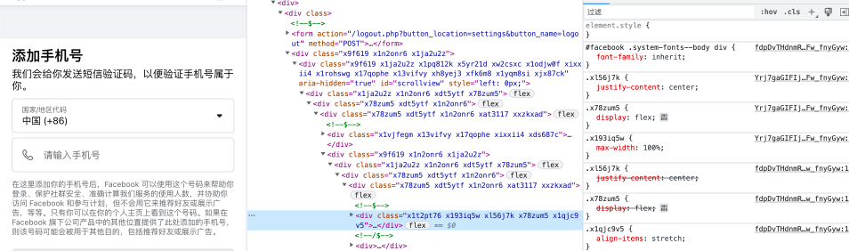
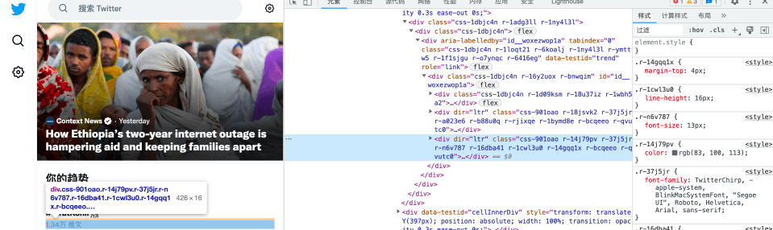
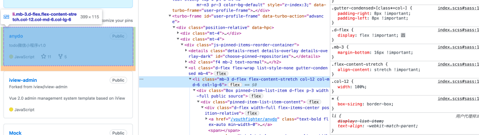
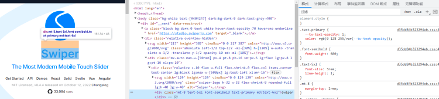

+++
title = "原子化CSS"
date = '2024-11-09T00:00:00+08:00'
lastmod = '2024-11-10T00:00:00+08:00'
draft = true
weight = 24
tags = ["面试", "前端", "CSS", "原子化CSS", "ecool"]
categories = ["前端开发", "面试"]
source = "https://fe.ecool.fun/knowledge-learn"
+++
## 1. 什么是原子化CSS

### 1.1 基本概念

原子化CSS(Atomic CSS) 近年来热度逐渐增加，与原子化CSS相关的库在Github上也收获上万的Star。那么什么是原子化CSS呢，引用文章 [Let's Define Exactly What Atomic CSS is](https://css-tricks.com/lets-define-exactly-atomic-css/) 中定义："原子化CSS是一种CSS架构方式，其支持小型、单一用途的类，其名称基于视觉功能。"

更加通俗的来讲，原子化CSS是一种新的CSS编程思路，它倾向于创建小巧且单一用途的class，并且以视觉效果进行命名。举个简单的例子：

```html
<!-- 原子化类定义 -->

<style>

  .text-white { color: white; }

  .bg-black { background-color: black; }

  .text-center { text-align: center; }

</style>

<!-- 原子化类使用 -->

<div class="text-white bg-black text-center">hello Atomic CSS</div>
```

### 1.2 VS 行内样式

看到以上的示例，你可能很快就想到，直接使用行内样式不是更好吗，还省去了原子类的定义。这个问题可以从样式编写、一致性、功能、和缓存四个方面来回答。

在样式编写层面，CSS预处理和后处理器很大程度上依赖单独的样式表，原子化CSS可以充分利用Sass、Less等CSS预处理器功能进行样式的编写，同时可以借助`PostCSS`进一步增强CSS的功能。而对于行内样式，虽然在技术上支持使用预处理和后处理器对其进行处理，但很少有成熟的工具对此提供支持和维护。

在一致性层面，原子化CSS框架一般有预定义的设计系统，开发者仅能在设计系统中选择要设置的值。而对于行内样式或者传统CSS类定义来说，可设置的值是没有任何限制的。对于行内样式或者传统的CSS类设置来说，一个标签的字体大小可能是`14px`或`0.875rem`，当产品（or 客户）说需要调小一点时，开发者A可能调整为`13px`，开发者B可能调整为`12px`。但对于原子化CSS框架来说，调小一点意味着设置的类从`text-sm`变为`text-xs`。

> 以下为部分采用传统CSS类编写的网站样式统计数据（[统计来源](https://cssstats.com/stats/)）：
>
> - [掘金官网](https://juejin.cn/)：283种背景颜色 471种字体颜色 264种字体大小
> - [GitLab](https://gitlab.com/gitlab-org/gitlab)：1199种背景颜色 1351种字体颜色 450种字体大小
> - [CSDN](https://www.csdn.net/)：585种背景颜色 1190种字体颜色 504种字体大小

在功能方面，原子化CSS本质上还是CSS类，因此支持媒体查询功能，也支持对元素的悬停、聚焦等状态进行处理，而内联样式缺少这部分的能力。

在打包方面，内联样式包含在JS文件中，样式的修改会导致整个bundle的改变，原子化CSS样式定义和JS逻辑分离，修改元素的class属性可能并不影响（在没有新CSS类的情况下）最终打包输出样式文件。

## 2. 谁在使用原子化CSS

截至目前已经有部分网站借鉴或者使用原子化CSS的思想重构了自己的web网站，比较知名的网站有`Facebook`、`Twitter`、`Github`、`swipperjs`等。根据网上公开的信息，`Facebook`在使用原子化CSS思想重构之后，仅登录页面的`413KB`样式文件，减少为整个站点的`74KB`。

- [Facebook](https://www.facebook.com/)



- [Twitter](https://twitter.com/)



- [Github](https://github.com/)



- [swiperjs](https://swiperjs.com/)



## 3. 流行的原子化CSS框架

### 3.1 Tailwind CSS

#### 3.1.1 简介

[Tailwind CSS](https://tailwindcss.com/) 是一个功能优先的CSS框架，它继承了诸如flex、pt-4、text-center和rotate-90这样的类，它们能直接在脚本标记语言中组合起来，构建任何的设计。截止到目前该框架在[Github](https://github.com/tailwindlabs/tailwindcss)上拥有62.1k的Star，在[2021年最受欢迎的项目](https://risingstars.js.org/2021/zh)中位列第六。上文中提到的 [swipperjs](https://swiperjs.com/) 网站就是使用了该框架。

#### 3.1.2 安装

本文以`Create React App`创建的应用结合`Tailwind CSS`为例，更多安装可以查看[此链接](https://tailwindcss.com/docs/installation)。

1. 创建项目

```JavaScript
npx create-react-app tailwind-demo

cd tailwind-demo
```

2. 安装`tailwindcss`相关依赖并初始化

```JavaScript
npm install -D tailwindcss postcss autoprefixer

npx tailwindcss init -p
```

3. 在根目录新建`tailwind.config.js`文件，并添加以下配置

```JavaScript
module.exports = {
  content: [
    "./src/**/*.{js,jsx,ts,tsx}",
  ],
  theme: {
    extend: {},
  },
  plugins: [],
}
```

4. 在 `./src/index.css` 文件顶部添加如下代码

```CSS
@tailwind base;
@tailwind components;
@tailwind utilities;
```

5. 现在可以在组件中使用原子类

```JavaScript
// app.js
function App() {
  return (
  <div className="w-screen h-screen flex items-center justify-center">
    <span className="text-3xl">hello tailwindcss</span>
  </div>
  );
}

export default App;
```

6. 建议安装`VS Code`插件`Tailwind CSS IntelliSense`，从而在编写代码时获得语法提示。

#### 3.1.3 功能

`Tailwind CSS`已经内置了较为完善的原子类和设计系统，可以直接在HTML中使用，这也是原子化CSS的核心功能。以下介绍该CSS框架的其它常见功能：

- **悬停、焦点或者其他状态的处理。**`Tailwind CSS`包含几乎所有的伪类和伪元素修饰符，可以与工具类随意组合使用。

```HTML
<!--
  1. 输入框不可用时会显示浅灰的背景颜色
  2. "用户名称"后会显示红色*号
  3. 输入框聚焦时会显示不同颜色的边框
  4. 可以修改placeholder的样式
  5. 按钮悬浮时颜色变化 激活时透明度变化
-->
<form class="...">
  <div>
    <label class="...">用户编号</label>
    <input
      class="disabled:bg-gray-100 ..."
      disabled
      value="1234"
    />
  </div>
  <div class="mt-4">
    <label class="block mb-2 after:content-['*'] after:text-red-600">用户名称</label
    >
    <input
      class="border-gray-300 focus:border-blue-300 placeholder:text-gray-300 ..."
      placeholder="请输入用户名称"
    />
  </div>

  <button class="bg-gray-100 hover:bg-blue-200 active:opacity-70 ...">
    点击保存
  </button>
</form>

<!-- 6. 偶数行背景使用浅灰色，第一行使用蓝色字体，最后一行使用红色字体 -->
<ul class="...">
  <li class="even:bg-gray-50 first:text-blue-600 last:text-red-600 ...">
    111111
  </li>
  <li class="even:bg-gray-50 first:text-blue-600 last:text-red-600 ...">
    222222
  </li>
  <li class="even:bg-gray-50 first:text-blue-600 last:text-red-600 ...">
    333333
  </li>
  <li class="even:bg-gray-50 first:text-blue-600 last:text-red-600 ...">
    444444
  </li>
</ul>

<!-- 7. 首字母变大，首行加粗 -->
<p class="first-letter:text-4xl first-line:font-bold ...">
  Hello Tailwind Hello Tailwind Hello Tailwind Hello Tailwind Hello
  Tailwind Hello Tailwind Hello Tailwind Hello Tailwind
</p>
```

- **响应式设计。** `Tailwind CSS`按照屏幕的宽度默认提供了5个断点：`sm(<=640px)`、`md(<=768px)`、`lg(<=1024px)`、`xl(<=1280px)`、`2xl(1536px)`。`Tailwind CSS`中的每个原子类都可以有条件的应用于不同的断点，从而快速的构建复杂的响应式界面。

```HTML
<!-- 在小屏设备使用大圆角，在大屏设备使用小圆角 -->
<div class="rounded-2xl lg:rounded-md ..."></div>
```

- **深色模式。**

```HTML
<!-- 正常模式下背景白色，深色模式下，背景黑色 -->
<div class="bg-white dark:bg-black ..."></div>
```

- **自定义主题。** `Tailwind CSS`内置了默认主题来帮助开发者快速的入门，但该框架支持并鼓励开发者自定义主题来构建自己的设计系统。通过修改根目录下的`tailwind.config.js`文件，开发者可以自定义项目的屏幕断点、调色板、间距、边框圆角等属性。

```JavaScript
module.exports = {
  content: [
    "./src/**/*.{js,jsx,ts,tsx}",
  ],
  theme: {
    // 自定义屏幕断点
    screens: {
      'sm': '480px',
      'md': '768px',
      'lg': '976px',
      'xl': '1440px',
      '2xl': '1860px'
    },
    // 自定义调色板，设置之后覆盖默认调色板，可以在背景、字体、边框颜色设置中使用。
    // 原有如bg-blue-50、text-gray-50等值不可用
    colors: {
      'transparent': 'transparent',
      'black': '#000',
      'white': '#fff',
      'gray': {
        100: '#f7fafc',
        900: '#1a202c',
      },
    },
    // 自定义边界圆弧，设置之后覆盖默认边界圆弧。
    borderRadius: {
      DEFAULT: '12px', // 默认值，使用rounded即可
      'none': '0',
      'sm': '4px',
    },
    // 扩展Tailwind CSS内置主题
    extend: {
      // 扩展屏幕断点的值，增加3xl大小屏幕，可以使用3xl:xxx的写法。
      screens: {
        '3xl': '2560px'
      },
      // 扩展间距的值，增加128和144的大小，可以使用p-128、m-128的写法。
      // 默认情况下，该设置将影响padding、margin、width、height、maxHeight、flex-basis等值的设置。
      spacing: {
        '128': '32rem',
        '144': '36rem',
      },
    }
  },
  plugins: [],
}
```

- **其它。**

```HTML
<!-- 使用任意值 -->
<div class="pt-[26px] lg:pt-[36px] color-[#eee]"></div>
<div class="bg-[url('/assets/mi.svg')]"></div>

<!-- !前缀提高属性优先级  -->
<div class="!pt-1"></div>
<button class="btn-primary">
  Save changes
</button>

/* @apply 抽取公共样式，应尽量避免使用，需要起类名并且会导致CSS生产包变大 */
.btn-primary {
    @apply py-2 px-4 bg-blue-500;
}
```

### 3.2 Windi CSS

#### 3.2.1 简介

[Windi](https://windicss.org/) 号称下一代功能优先的CSS框架。可以把`Windi CSS`看作是按需供应的`Tailwind`替代方案，它的出现是为了解决`Tailwind v2.0`随着项目变大初始化编译和热更新慢的问题。

`Windi CSS`完美兼容`Tailwind v2.0`并且拥有很多额外的炫酷功能。

该框架在[Github](https://github.com/windicss/windicss)上拥有5.8k的Star。

但需要注意的是，`Tailwind v3` 版本默认开启了即时引擎（JIT），实现了和Windi类似的按需加载的功能，构建速度得到了极大的提升。可能也是因为这个原因，截止目前Windi的Github仓库已经半年没有提交过代码。

#### 3.2.2 安装

本文以`Create React App`创建的应用集成`Windi CSS`为例，更多安装可以查看[此链接](https://cn.windicss.org/guide/installation.html)。

1. 创建项目

```Bash
npx create-react-app windi-demo
cd windi-demo
```

2. 安装webpack扩展工具和插件

```Bash
npm i react-app-rewired windicss-webpack-plugin
```

3. 在根目录新建`config-overrides.js`，引用`windi`插件。该步骤本质是配置`windicss-webpack-plugin`插件，其它方式扩展`cra`的`webpack`配置也可以。

```JavaScript
const WindiCSSWebpackPlugin = require("windicss-webpack-plugin");

module.exports = function override(config) {
  config.plugins.push(new WindiCSSWebpackPlugin({ virtualModulePath: "src" }));
  return config;
};
```

4. 修改`package.json`中的`scripts`命令

```JSON
"scripts": {
  "start": "react-app-rewired start",
  "build": "react-app-rewired build",
  "test": "react-app-rewired test",
  "eject": "react-app-rewired eject"
}
```

5. 在根目录新建`windi.config.js`文件，添加如下配置

```JavaScript
import { defineConfig } from 'windicss/helpers'

export default defineConfig({
  extract: {
    include: ['**/*.{jsx,js,css,html}'],
    exclude: ['node_modules', '.git'],
  },
})
```

6. 在`index.js`中引入`windi.css`

```JavaScript
import './windi.css' // 如果报错可以尝试 import './virtual:windi.css'
```

7. 现在可以在组件中使用原子类

```JavaScript
// app.js
function App() {
  return (
  <div className="w-screen h-screen flex items-center justify-center">
    <span className="text-3xl">hello windicss</span>
  </div>
  );
}
export default App;
```

### 3.2.3 功能

`Windi CSS`完美兼容`Tailwind v2.0`，包含了其所有的工具类和几乎所有的功能。同时还新增了许多额外的特性。

- **自动值推导。** 和`Tailwind`的任意值功能类似，不过其书写更加的方便。

```HTML
<!-- 可以不用加中括号 -->
<div class="text-20px text-hex-1e1e1e">自动值推导</div>
```

- **修饰组。**

```HTML
<!-- hover之后，字体颜色加深并且字体加粗 -->
<div className="text-blue-700 hover:(text-blue-900 font-bold)">修饰组</div>
```

- **属性化模式。** 基于这个特性，可以像在`html`属性中编写`windi`类。

```HTML
<!-- 修改windi.config.js文件，添加attributify: true配置 -->
<button
  bg="blue-400 hover:blue-500 dark:blue-500 dark:hover:blue-600"
  text="sm white"
  font="light"
  p="y-2 x-4"
  border="2 rounded blue-200"
  >
  Button
</button>

<!-- 为了避免属性冲突，也可以自定义前缀，修改attributify属性值为{ prefix: 'mi-' } -->
<button
  mi-bg="blue-400 hover:blue-500 dark:blue-500 dark:hover:blue-600"
  mi-text="sm white"
  mi-font="light"
  mi-p="y-2 x-4"
  mi-border="2 rounded blue-200"
>
  Button
</button>
```

- **可视化分析器。** 在项目根目录下执行npx windicss-analysis可以生成项目的分析报告。

### 3.3 UnoCSS

#### 3.3.1 简介

[UnoCSS](https://uno.antfu.me/) 是具有高性能且极具灵活性的即时原子化CSS引擎。它是一个引擎而非框架，因为它并没有提供核心工具类，所有功能可以通过预设和内联配置提供。`UnoCSS`的主要目标是直观性和可定制性，它可以开发者在极短时间内定义自己的CSS工具类。尽管`UnoCSS`目前还处于beta阶段，但其在 [Github](https://github.com/unocss/unocss) 上的 `Star`数已经达到 **7.5k**。

3.3.2 安装

由于UnoCSS对于Vite有更好的支持，本文将以Vite初始化React项目并集成UnoCSS为例，更多安装可以查看[此链接](https://github.com/unocss/unocss)。

1. 创建项目

```Bash
npm create vite@latest unocss-demo -- --template react
cd unocss-demo
npm i
```

2. 安装UnoCSS插件

```Bash
npm i unocss
```

3. 在`vite.config.js`中引用插件

```Bash
import { defineConfig } from "vite";
import react from "@vitejs/plugin-react";
import Unocss from "unocss/vite";

export default defineConfig({
  plugins: [
    react(),
    Unocss({
      plugins: [],
    }),
  ],
});
```

4. 在`src/main.jsx`中添加如下引用

```Bash
import 'uno.css'
```

5. 现在可以在组件中使用原子类

```Bash
// app.js
function App() {
  return (
  <div className="w-screen h-screen flex items-center justify-center">
    <span className="text-3xl">hello tailwindcss</span>
  </div>
  );
}

export default App;
```

#### 3.3.3 功能

在了解该框架功能之前，建议读者先阅读文章[重新构想原子化 CSS](https://antfu.me/posts/reimagine-atomic-css-zh)，了解作者对原子化CSS的认识和编写该框架的心路历程。

`UnoCSS`本身不具有原子类和设计系统，所有的功能都是通过预设来实现。其默认的预设包含了上述两种框架的原子类和设计系统，因此在使用方面的功能与上述两种框架类似。其主要特点是可以快速的构建自己的原子类和设计系统。由于笔者没有深入的体验该框架，因此仅作简单介绍，更多的规则预设可以查看[官方文档](https://github.com/unocss/unocss)。

```JavaScript
// vite.config.js
export default defineConfig({
  plugins: [
    react(),
    Unocss({
      rules: [
        // m-1 => margin: 1px; m-100 => margin: 100px
        [/^m-(\d+)$/, ([, d]) => ({ margin: `${d}px` })],
        // p-1 => padding: 1px; m-100 => padding: 100px
        [/^p-(\d+)$/, match => ({ padding: `${match[1]}px` })],
      ],
    }),
  ],
});
```

## 总结

### 4.1 问题及思考

如何实现按页面分包？在使用原子化CSS框架之后，整个项目的CSS并不会很大，即便是Facebook重构完成后，也只需要70kb，因此分包意义不大。

JSX中大量的类名增加了JS文件的体积？相比于自定义CSS类名，使用原子化CSS类名确实会让class字符串变长，但由于都是重复的字符串，在经过GZip后影响微乎其微。

多主题切换是否支持？借助CSS变量和CSS原子化框架提供的主题配置，可以实现多主题的切换。详细实现思路可以参考文章[使用 Tailwind 实现网页多主题](https://juejin.cn/post/7053802767348924430)。

浏览器兼容性？以上三种框架中的大部分功能都适用于所有现代浏览器，仅有部分未被所有浏览器支持的前沿功能的API存在兼容性问题，例如:`focus-visible`伪类和`backdrop-filter`。

自定义样式破坏约束？以上三种框架都支持自定义样式，这一定程度上破坏了约束，但确极大的提高了框架的实用性，因此得到了各个框架的支持。

### 4.2 使用感受

为了深度的体验原子化CSS框架，我使用windi框架重构了个人的博客项目，包括展示页面（Next.js）和后台管理系统（vue3），整体的开发体验十分的良好。对于不需要再起类名这一点真的很香。而且由于基本不需要自己写CSS类，几乎所有的样式文件都可以删除，项目干净了很多。

另外也有两点不太习惯，一是windi的设计系统的字体大小、行高、边距都是以rem为单位，而原项目中一般都是以px为单位。二是定位问题时，即便在网页上找到了问题节点，也无法通过类名直接在项目中全局搜索。

### 4.3 优缺点及适用场景

深度体验之后，个人觉得原子化CSS主要优势有：

- 不用浪费精力起类名；
- CSS文件将不会无限增长，相比于以往的方式CSS打包结果更小；
- 可以很好的避免历史样式的堆积，不存在历史样式类不敢删除的问题；
- 天然的支持组件间的样式隔离，没有自定义的class也就无需担心组件之间样式的影响。

其主要缺点有：

- 前期有一定的学习成本，需要不断的翻看样式对应的类名；
- 无法通过类名在项目中直接定位源码位置；
- 类名横向平铺无法快速定位要修改的内容。

基于以上原子化CSS的优缺点，个人觉得原子化CSS的适用场景有：

-  个人项目，对样式没有太高的要求，借助设计系统，可以提升页面显示效果，毕竟不用起类名真的很香。
-  大型项目，有较为完整且稳定的视觉规范，能够很好的搭建设计系统。可以很好的解决历史样式的堆积问题并且有效的减少CSS的体积。

## 常见考点

### 1. **原子化 CSS 的基本概念**

- 什么是原子化 CSS？如何理解“原子”类？
- 与传统 CSS 编写方式（例如 BEM、OOCSS）相比，原子化 CSS 有哪些不同之处？

### 2. **原子化 CSS 的优点**

- **高复用性**：为什么说原子化 CSS 提高了样式的复用性？如何通过多个原子类组合来实现复杂样式？
- **样式冲突减少**：为什么原子化 CSS 能减少或避免样式冲突？（例如：避免全局样式覆盖的问题）
- **降低 CSS 文件体积**：在生产环境中，原子化 CSS 框架如何通过“按需生成”减少 CSS 文件体积？

### 3. **原子化 CSS 的缺点和挑战**

- **可读性问题**：原子化 CSS 的类名较多，如何解决冗长的类名带来的代码可读性问题？
- **维护成本**：在大型项目中如何使用原子化 CSS，保证样式一致性和可维护性？
- **语义化**：原子化 CSS 如何处理样式的语义性问题？类名如 `p-4` 或 `text-center` 缺少描述性，如何解决？

### 4. **Tailwind CSS 的用法**

- **核心概念**：如何使用 Tailwind CSS 定义间距、颜色、字体等？例如，`p-4` 代表什么？
- **实用工具类**：举例说明如何用 Tailwind CSS 快速实现响应式布局？
- **扩展与定制**：如何在 Tailwind CSS 中自定义配色、间距等，使其符合项目设计需求？
- **JIT 模式**：什么是 Tailwind CSS 的即时模式（JIT），它如何优化原子化 CSS 的性能？

### 5. **UnoCSS 与按需生成**

- **按需生成**：UnoCSS 是如何通过按需生成的方式只生成页面需要的类？
- **自定义规则**：在 UnoCSS 中如何创建自定义原子类？例如实现一个特定的边距或字体样式。
- **性能优化**：UnoCSS 如何避免多余 CSS 的加载？它与 Tailwind 的 JIT 模式有何异同？

### 6. **设计系统与原子化 CSS 的结合**

- **统一样式规范**：在使用原子化 CSS 时，如何定义设计系统中的配色、字体和间距？
- **响应式设计**：如何用原子化 CSS 类快速实现响应式设计？
- **组件化**：原子化 CSS 如何和 React/Vue 等前端框架结合？如何在组件中封装原子化 CSS 类？

### 7. **实用场景与代码示例**

- **常见布局**：如何用原子化 CSS 快速实现常见布局，如两栏布局、网格布局等？
- **状态管理**：如何在 Tailwind CSS 中处理不同的状态？例如 `hover:`、`focus:`、`active:` 等。
- **实战**：给出一段 HTML，要求面试者使用原子化 CSS 框架的类名实现设计效果。

### 8. **CSS 变量与原子化 CSS**

- **自定义属性**：如何在原子化 CSS 中使用 CSS 变量？如何在 Tailwind 或 UnoCSS 中实现主题切换？
- **混合使用**：在复杂项目中如何将原子化 CSS 与自定义 CSS 样式结合，保证灵活性和可维护性？

### 9. **原子化 CSS 的性能优化**

- **打包优化**：如何配置原子化 CSS 框架，避免打包生成大量无用样式？
- **动态样式加载**：在单页应用中，如何确保只加载当前页面所需的样式？

### 10. **适用场景与限制**

- **适用项目类型**：原子化 CSS 更适合哪些类型的项目？例如快速开发、小型项目等。
- **局限性**：在极其复杂的项目中，原子化 CSS 是否有局限？需要注意哪些维护问题？
