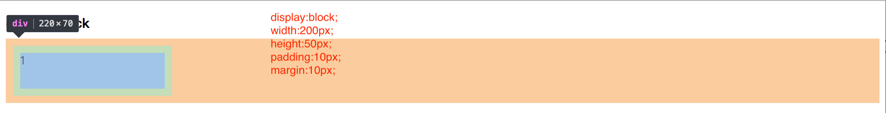
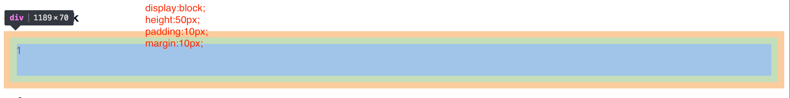
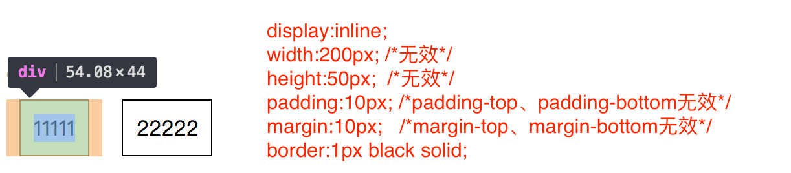
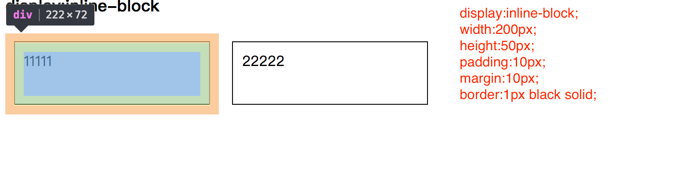

+++
title = "display"
date = '2024-10-10T00:00:00+08:00'
lastmod = '2024-11-18T00:00:00+08:00'
draft = true
weight = 20
tags = ["面试", "前端", "CSS", "display", "ecool"]
categories = ["前端开发", "面试"]
source = "https://fe.ecool.fun/knowledge-learn"
+++
#### 一、display属性介绍

display 属性规定元素应该生成的框的类型。

以下是一些关于display比较常用的属性值：

| 值 | 描述 |
| --- | --- |
| none | 元素不会显示 |
| block | 此元素将显示为块级元素，此元素前后会带有换行符。 |
| inline | 默认。此元素会被显示为内联元素，元素前后没有换行符。 |
| line-block | 行内块元素。（CSS2.1 新增的值）[IE6/7不支持] |
| list-item | 此元素会作为列表显示。 |
| inline-table | 此元素会作为内联表格来显示（类似 table），表格前后没有换行符。 |
| table | 此元素会作为块级表格来显示（类似 table），表格前后带有换行符。 |
| table-row | 此元素会作为一个表格行显示（类似 tr）。 |
| table-cell | 此元素会作为一个表格单元格显示（类似 td 和 th）. |
| inherit | 规定应该从父元素继承 display 属性的值。 |

其中我们在前端开发中比较常用的属性值一般是none、block、inline、inline-block。我将按顺序为这些属性值一一讲解。

#### 二、display:none

1. 将元素与其子元素从普通文档流中移除。这时文档的渲染就像元素从来没有存在过一样，也就是说它所占据的空间消失了。元素的内容也会消失。

#### 三、display:block

1. block元素会独占一行，多个block元素会各自新起一行。默认情况下，block元素宽度自动填满其父元素宽度；
2. block元素可以设置margin和padding属性；
3. block元素可以设置width、height属性。
4. 块级元素即使设置了宽度，仍然是独占一行。块级元素在设置宽度的情况下，是通过自定义margin-right来自动填满一行，这个时候你设置margin-right是无效的；块级元素在没有设置宽度的时候，margin-right会生效，块级元素的width通过自定义在自动填满一行。

块级元素在设置宽度的情况下，是通过自定义margin-right来自动填满一行，这个时候你设置margin-right是无效的，如下图所示：

---

块级元素在没有设置宽度的时候，margin-right会生效，块级元素的width通过自定义在自动填满一行，如下图所示：

---

#### 四、display:inline

1. inline元素不会独占一行，多个相邻的行内元素会排列在同一行里，直到一行排列不下，才会新换一行，其宽度随元素的内容而变化；
2. inline元素设置width、height属性无效；
3. inline元素的margin和padding属性，水平方向的padding-left、padding-right、margin-left、margin-right都产生边距效果；但竖直方向的padding-top、padding-bottom、margin-top、margin-bottom不会产生边距效果。

如下图所示：

---

#### 五、display:inline-block

1. 将对象呈现为inline对象，但是对象的内容作为block对象呈现，之后的内联对象会被排列在同一行内。就是集合了block和inline的全部优点。width、height、margin、padding设置都会生效。

如下图所示：

---

> 原文：[https://juejin.cn/post/6844903781566513160](https://juejin.cn/post/6844903781566513160)

## 常见考点

### 1. **基本概念**

- 请简述 CSS 中的 **`display`** 属性及其作用。
- **`display`** 属性的常见值有哪些？请列举并解释其含义。  
  - 例如：`block`、`inline`、`inline-block`、`flex`、`grid`、`none` 等。

### 2. **`display: block`**

- 什么是 **`display: block`**？它会给元素带来哪些表现？
- 一个块级元素通常具有哪些特点？例如：它的宽度会如何变化？它是否会换行？

### 3. **`display: inline`**

- 什么是 **`display: inline`**？它与 **`display: block`** 有什么不同？
- 内联元素如何处理宽度和高度？它们是否会占据整个可用宽度？
- 如何让一个内联元素变得像块级元素一样换行？

### 4. **`display: inline-block`**

- 什么是 **`display: inline-block`**？它结合了 `inline` 和 `block` 的哪些特点？
- 使用 **`inline-block`** 时，元素的宽高如何影响布局？
- `inline-block` 元素如何与其他元素对齐？

### 5. **`display: none`**

- 请解释 **`display: none`** 的作用与 **`visibility: hidden`** 的区别。
- 使用 **`display: none`** 会有什么样的表现？例如，它对页面布局有何影响？
- 当你将一个元素的 **`display`** 设置为 **`none`** 时，它会消失，但仍然存在于 DOM 中。如何通过 JavaScript 使其重新显示？

### 6. **`display: flex`**

- **`display: flex`** 是什么？它通常用来实现什么样的布局效果？
- 在使用 `flex` 布局时，如何控制子元素的排列方向、对齐方式等？
- **`justify-content`**、**`align-items`**、**`flex-direction`** 等 Flexbox 属性的作用是什么？

### 7. **`display: grid`**

- 什么是 **`display: grid`** 布局？它与 **`flex`** 布局有何区别？
- 在 **`grid`** 布局中，如何设置行和列的大小？如何控制子元素的位置？
- 请举例说明 **`grid-template-columns`**、**`grid-template-rows`**、**`grid-gap`** 等属性的使用方法。

### 8. **`display: table`**

- 什么是 **`display: table`**，它如何模仿传统的 HTML `<table>` 元素？
- 使用 **`display: table`** 时，如何控制表格的行和列布局？
- **`display: table-row`**、**`display: table-cell`** 和 **`display: table-caption`** 的作用是什么？

### 9. **布局模型对比：`block` vs `inline` vs `flex` vs `grid`**

- 你如何选择使用 **`block`**、**`inline`**、**`flex`** 或 **`grid`** 布局？
- 在实际项目中，什么时候使用 `flex` 布局，什么时候使用 `grid` 布局？
- 请比较 `flex` 和 `grid` 布局的优缺点及应用场景。

### 10. **`display` 与其他布局属性**

- 在使用 **`display: flex`** 或 **`display: grid`** 布局时，如何与其他布局属性（如 `position`、`float` 等）配合使用？
- 如何解决使用 **`display: flex`** 或 **`display: grid`** 布局时遇到的常见布局问题，例如元素溢出、对齐等？

### 11. **`display: none` 与性能**

- **`display: none`** 对页面性能有何影响？如何通过 JavaScript 动态控制显示/隐藏元素以提高性能？

### 12. **`display: contents`**

- 什么是 **`display: contents`**？它是如何工作的？它与其他 **`display`** 值有什么区别？
- 请举例说明 **`display: contents`** 的应用场景及可能的问题。

### 13. **`display` 的继承性**

- **`display`** 属性是否继承？如果没有，如何通过样式继承的方式控制多个元素的 **`display`** 属性？
- 你如何在多个嵌套元素中保持一致的布局设置？

### 14. **`display` 的可见性与布局**

- `display` 属性会影响元素的布局、渲染和可见性。请简要解释 **`display: none`** 和 **`visibility: hidden`** 的区别，它们对页面的影响不同吗？

### 15. **实际应用**

- 请描述一个你在实际开发中使用 **`display`** 属性解决布局问题的案例。
- 如果需要在一个响应式设计中调整元素的布局，如何根据屏幕尺寸调整 `display` 属性？
