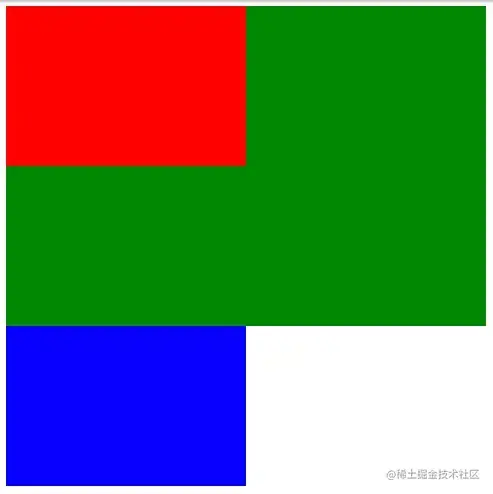
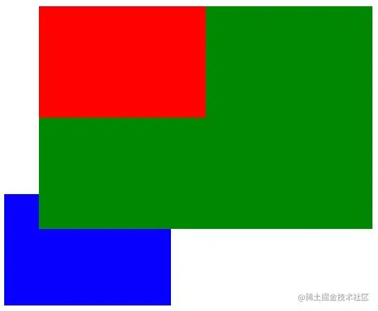
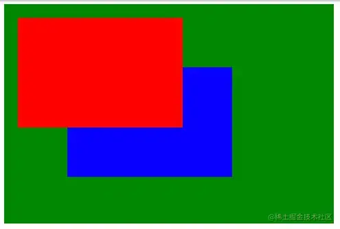
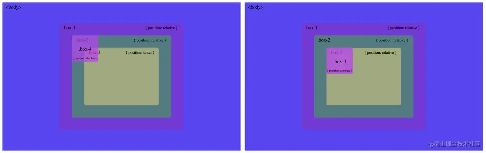
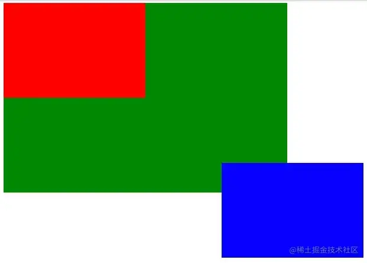

+++
title = "position"
date = '2024-10-08T00:00:00+08:00'
lastmod = '2024-11-10T00:00:00+08:00'
draft = true
weight = 7
tags = ["面试", "前端", "CSS", "position", "ecool"]
categories = ["前端开发", "面试"]
source = "https://fe.ecool.fun/knowledge-learn"
+++
> CSS 中 `position` 属性用于指定元素的定位方法的类型（`static`、`relative`、`absolute`、`fixed`、`sticky`）。

### 静态定位 position: static

此属性未 HTML 元素默认定位，一个元素没有以任何特殊的方式定位，它总是按照页面的正常流程定位。

在此属性下，属性值 `top`、`left`、`right`、`bottom` 和 `z-index` 对HTML元素没有影响。

```xml
<div class="parent">
    <div class="child"></div>
</div>
<div class="sibling"></div>
<style type="text/css">
    .parent {
        width: 480px;
        height: 320px;
        background-color: #008800;
    }
    .child {
        width: 240px;
        height: 160px;
        background-color: #ff0000;
    }
    .sibling {
        width: 240px;
        height: 160px;
        background-color: #0000ff;
    }
</style>
```

效果如图：



> 为什么使用它呢？将元素设置为 `position: static` 的唯一原因是强制删除应用于无法控制的元素上的某些定位。

### 相对定位 position: relative

此属性相对于其正常位置的，在不改变布局的情况下根据元素的当前位置定位元素。

`position: relative` 相对于它的当前位置放置一个元素而不改变它周围的布局。

在此属性下，设置相对定位元素的 `top`、`right`、`bottom` 和 `left` 属性会导致它被调整到远离其正常位置。

```xml
<div class="parent">
    <div class="child"></div>
</div>
<div class="sibling"></div>
<style type="text/css">
    .parent {
        position: relative;
        width: 480px;
        height: 320px;
        background-color: #008800;
        z-index: 5;
        left: 50px;
        top: 50px;
    }
    .child {
        width: 240px;
        height: 160px;
        background-color: #ff0000;
    }
    .sibling {
        width: 240px;
        height: 160px;
        background-color: #0000ff;
    }
</style>
```

效果如图：



> 为什么要使用它？此属性下引入了在该元素上使用 `z-index` 的能力，这对于静态定位 `position: static` 的元素并不真正起作用。

### 绝对定位 position: absolute

此属性是相对于最近父级元素的位置，如果绝对定位元素没有定位的父级元素，它将使用文档 `body` 并随着页面滚动而移动。`position: absolute` 相对于其父元素的位置放置一个元素并改变它周围的布局。

> 关于绝对定位的权衡是，这些元素将从页面的元素流中删除，具有这种定位类型的元素不受其它元素的影响，也不影响其它元素。

```xml
<div class="parent">
    <div class="child"></div>
</div>
<div class="sibling"></div>
<style type="text/css">
    .parent {
        position: relative;
        width: 480px;
        height: 320px;
        background-color: #008800;
    }
    .child {
        position: absolute;
        width: 240px;
        height: 160px;
        background-color: #ff0000;
        left: 20px;
        top: 20px;
        z-index: 2;
    }
    .sibling {
        position: absolute;
        width: 240px;
        height: 160px;
        left: 100px;
        top: 100px;
        background-color: #0000ff;
        z-index: 1;
    }
</style>
```

效果如图：



在此属性下，同一父级元素中，`z-index` 值大的在最上层。

> 绝对定位元素是相对于最近定位的祖先来定位自身。一旦它找到一个已定位的祖先，该祖先之上的元素的位置就不再相关。



> 相对定位和绝对定位的主要区别在于，`position: absolute` 会将子元素完全脱离文档的正常流程，并且该子元素将相对于具有自己的位置集的第一个父元素进行定位。

### 固定定位 position: fixed

相对于视窗定位，即使页面滚动，也始终停留在同一位置上。固定定位元素不会在其所在的页面中留下间隙，其他元素会填补缺失的地方。

```xml
<div class="parent">
    <div class="child"></div>
</div>
<div class="sibling"></div>
<style type="text/css">
    .parent {
        position: relative;
        width: 480px;
        height: 320px;
        background-color: #008800;
    }
    .child {
        width: 240px;
        height: 160px;
        background-color: #ff0000;
        left: 20px;
        top: 20px;
        z-index: 2;
    }
    .sibling {
        position: fixed;
        width: 240px;
        height: 160px;
        right: 50px;
        bottom: 50px;
        background-color: #0000ff;
        z-index: 1;
    }
</style>
```

效果如图：



### 粘性定位 position: sticky

`position: sticky` 是 CSS 中的一种布局方式，通常用于实现“粘性定位”。当元素在页面滚动时，它会保持在视口的某个位置，直到其父元素的边界被滚动到并覆盖该元素，之后元素就会“脱离”视口。

#### **工作原理**

1. **初始状态**：`position: sticky` 元素是相对于其正常文档流位置定位的，并且它会根据滚动位置“粘”在指定位置。
2. **滚动时行为**：当页面滚动到该元素所在的位置时，元素会变为固定定位 (`position: fixed`)，并粘附在其父元素的边界内，通常是视口顶部或底部，直到滚动到其父元素的边界时，元素会随父元素一起滚动。
3. **恢复状态**：当父元素的边界被滚动到时，`sticky` 元素会恢复为正常的文档流定位。

#### **语法**

```css
position: sticky;
top: 0; /* 或者 bottom: 0, left: 0, right: 0 等 */
```

- `top`, `bottom`, `left`, `right`：控制元素在其父元素中的粘性位置。例如，`top: 0` 会使元素在滚动时粘在视口的顶部。

#### **应用场景**

- **表头粘性定位**：在长列表中，表头会随着滚动保持可见。
- **侧边栏**：当用户滚动页面时，侧边栏可以保持在屏幕的一侧，而不是跟随页面滚动。
- **导航条**：让导航栏保持在视口顶部，直到滚动到页面的某个特定部分时它才会消失。

#### **启用条件**

- 必须指定 `top`, `bottom`, `left`, `right` 中的一个或多个属性，决定了元素粘性定位的起始点。
- 元素的祖先容器不能有 `overflow: hidden` 或 `overflow: auto` 等样式，否则 `sticky` 会失效。
- `sticky` 元素的父元素需要有足够的空间，否则无法触发粘性效果。

## 常见考点

### 1. **CSS 定位基础**

- 请简述 CSS 定位的概念以及常见的定位类型。
- 什么是相对定位、绝对定位、固定定位、粘性定位？它们的主要区别是什么？

### 2. **`position` 属性**

- `position` 属性的值有哪些？解释每种定位方式的行为和应用场景。<br>
  - `static`：默认定位，元素按文档流排列。
  - `relative`：相对定位，相对于元素原本的位置进行偏移。
  - `absolute`：绝对定位，相对于最近的已定位父元素（即父元素有 `position` 属性且不是 `static`）定位。
  - `fixed`：固定定位，相对于浏览器窗口定位。
  - `sticky`：粘性定位，结合了相对定位和固定定位的特性。

### 3. **`top`, `right`, `bottom`, `left` 属性**

- 当元素使用了相对定位时，`top`、`right`、`bottom` 和 `left` 的作用是什么？它们如何影响元素的位置？
- 当元素使用了绝对定位或固定定位时，`top`、`right`、`bottom` 和 `left` 如何影响元素的位置？它们是相对于哪个参考点定位的？
- 如何使用这些属性来实现元素的精确定位？

### 4. **定位的参考点**

- 绝对定位和固定定位是相对于哪些参考点进行定位的？如何理解“最近的已定位父元素”？
- `relative` 定位元素的定位参考点是什么？它和绝对定位的参考点有什么区别？

### 5. **`z-index` 属性**

- `z-index` 的作用是什么？它如何影响元素的层级关系？
- `z-index` 只能应用于定位元素（`position` 不为 `static` 的元素），解释这一点，并举例说明如何使用 `z-index` 来控制多个元素的层叠顺序。
- 在相同的 `z-index` 值下，如何判断元素的层级关系？

### 6. **浮动与定位**

- 浮动元素和定位元素的行为有什么区别？
- 如何解决浮动元素对文档流的影响？可以用哪些方法使浮动元素脱离文档流或重新回到文档流？
- 你是否了解 CSS 定位与浮动结合的情况，如何处理浮动元素与定位元素的关系？

### 7. **`position: relative` 与布局**

- `position: relative` 如何影响元素在布局中的位置？请解释它与普通文档流中的元素区别。
- 如何利用 `relative` 定位来创建自定义的排列、移动布局？

### 8. **`position: absolute` 与 `position: fixed`**

- `position: absolute` 定位元素如何相对于其父元素进行定位？如果没有已定位的父元素，它会相对于哪里定位？
- `position: fixed` 元素如何相对于视口定位？如何处理视口大小变化对固定定位元素的影响？

### 9. **`position: sticky` 的应用**

- `position: sticky` 定位是什么？它如何结合 `top`, `bottom`, `left`, `right` 属性工作？
- 请解释 `position: sticky` 在实际开发中的使用场景，并举例说明如何使用它创建一个粘性导航条。
- `position: sticky` 在不同浏览器中的支持情况如何？

### 10. **多重定位**

- 当一个元素同时设置了多种定位方式（例如：`position: relative` 和 `position: absolute`）时，如何理解它们之间的关系？
- 如何通过嵌套定位元素创建复杂的布局结构？

### 11. **定位与流动布局**

- 在使用 `absolute` 或 `fixed` 定位的元素时，如何保证其他元素在文档流中的位置不受影响？如何处理定位元素与其他元素的重叠问题？
- 如何使用 `absolute` 定位来实现精确的布局，避免因内容变化导致布局错乱？

### 12. **响应式布局中的定位**

- 在响应式设计中，如何通过定位来实现自适应布局？可以结合哪些其他 CSS 属性来更灵活地控制布局？
- 如何利用 `position: absolute` 和 `position: relative` 创建响应式网格布局？

### 13. **定位与 `flex` 布局结合**

- 在 `flexbox` 布局中，如何使用定位（如 `absolute` 或 `relative`）来控制子元素的位置？
- 如何结合 `flexbox` 和定位属性来解决一些布局问题？

### 14. **定位的性能优化**

- 在页面中大量使用定位（尤其是绝对定位和固定定位）时，如何确保页面性能的最佳状态？会有哪些潜在的性能问题？

### 15. **实际案例**

- 请描述一个实际的项目中你如何使用 CSS 定位来实现一个复杂布局。涉及到哪些定位技术？如何解决了定位中的问题？
- 如何使用定位来创建一个响应式、固定顶部的导航栏？
