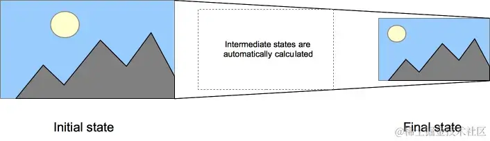

+++
title = "transition"
date = '2024-10-08T00:00:00+08:00'
lastmod = '2024-11-18T00:00:00+08:00'
draft = true
weight = 17
tags = ["面试", "前端", "CSS", "transition", "ecool"]
categories = ["前端开发", "面试"]
source = "https://fe.ecool.fun/knowledge-learn"
+++
CSS `transition` 提供了一种在更改 CSS 属性时控制动画速度的方法。其可以让属性变化成为一个持续一段时间的，而不是立即生效的过程。

比如，将一个元素的颜色从白色改为黑色，通常这个改变是立即生效的，使用 CSS 过渡后该元素的颜色将按照一定的曲线速率从白色变化为黑色。这个过程可以自定义。

通常将两个状态之间的过渡称为**隐式过渡**，因为开始与结束之间的状态由浏览器决定。



CSS 过渡可以决定哪些属性发生动画效果（通过明确地列出这些属性），何时开始（通过设置延时），持续多久（通过设置时长）以及如何动画（通过定义缓动函数，如线性或先快后慢）。比如在不同的伪元素之间切换，像是 `:hover`，`:active` 或者通过 JavaScript 实现的状态变化。

开发者可以定义哪一属性需以何种方式用于动画，由此允许创造复杂的过渡。然而因为为某些属性赋予动画无意义，所以这些属性无动画性。

> 备注： auto 值常常较复杂，规范指出不要在它上动画。一些用户代理，比如基于 Gecko 的，实现了这个需求；然而另外一些用户代理，比如基于 WebKit 的，没有这么严格限制。在 auto 上使用动画，取决于浏览器及其版本，可能会导致非预期结果，应当避免使用。

## 属性

以下 `transition` 属性，若有多个属性值，则以`,`（逗号）衔接。

### transition-property

指定哪个或哪些 CSS 属性名称用于过渡。只有指定的属性才会在过渡中发生动画，其他属性仍如通常那样瞬间变化。如果指定简写属性（比如 `background`），那么其完整版中所有可以动画的属性都会被应用过渡。

取值如下：

- `none`：没有过渡动画。
- `all`（**初始值**）：所有可被动画的属性都表现出过渡动画。
- `<custom-ident>`：属性名称。由小写字母 a 到 z，数字 0 到 9，下划线（_）和破折号（-）。第一个不能为非破折号字符或数字。同时，不能以两个破折号开头。通俗来说就是可以是自定义名称也可以是css规范中的属性名。

### transition-duration

表示过渡属性从旧的值转变到新的值所需要的时间。你可以为所有属性指定一个值，或者指定多个值，或者为每个属性指定不同的时长。

该属性值以秒（s）或毫秒（ms）为单位指定过渡动画所需的时间。默认值为 **0s**，表示不会呈现过渡动画，属性会瞬间完成转变。不接受负值。

可以指定多个时长，每个时长会被应用到由 `transition-property` 指定的对应属性上。

如果某个属性的值列表小于 `transition-property` 的属性值数量，那么时长列表会重复，重复规则是按照现有值进行重复。例如：

如3s，则重复多个3s

```css
div {
  transition-property: opacity, left, top, height;
  transition-duration: 3s;
}
```

将视为：

```css
div {
  transition-property: opacity, left, top, height;
  transition-duration: 3s, 3s, 3s, 3s;
}
```

如果是3s，5s，则会重复多个3s，5s。

```css
div {
  transition-property: opacity, left, top, height;
  transition-duration: 3s, 5s;
}
```

将视为：

```css
div {
  transition-property: opacity, left, top, height;
  transition-duration: 3s, 5s, 3s, 5s;
}
```

类似地，如果某个属性的值列表长于 `transition-property` 的属性值数量，将被截短。例如：

```css
div {
  transition-property: opacity, left;
  transition-duration: 3s, 5s, 2s, 1s;
}
```

将按下面这样处理：

```css
div {
  transition-property: opacity, left;
  transition-duration: 3s, 5s;
}
```

### transition-timing-function

CSS 属性受到过渡效应(transition effect)的影响，会产生不断变化的中间值，而 CSS `transition-timing-function` 属性用来描述这个中间值是怎样计算的。初始值是`ease`。

缓动函数定义属性如何计算。大多数缓动函数由四点定义一个立方贝塞尔曲线。也可以从 [Easing Functions Cheat Sheet](https://easings.net/) 选择缓动效果。

实质上，通过这个函数会建立一条加速度曲线，因此在整个 transition 变化过程中，变化速度可以不断改变。这条加速度曲线被<timing-function>所定义，之后作用到每个 CSS 属性的过渡。

通过`transition-property`中定义的过渡属性，每个<timing-function> 的值与这个过渡属性相对应.

你可以指定 <timing-function> 个数少于或者多于属性个数。重复或者裁剪规则与`transition-duration`一致。

形式语法如下：

```txt
transition-timing-function = 
  <easing-function>#  

<easing-function> = 
  linear                          |
  <linear-easing-function>        |
  <cubic-bezier-easing-function>  |
  <step-easing-function>          

<linear-easing-function> = 
  linear( <linear-stop-list> )  

<cubic-bezier-easing-function> = 
  ease                                                |
  ease-in                                             |
  ease-out                                            |
  ease-in-out                                         |
  cubic-bezier( <number [0,1]> , <number> , <number [0,1]> , <number> )  

<step-easing-function> = 
  step-start                             |
  step-end                               |
  steps( <integer> , <step-position>? )  

<linear-stop-list> = 
  [ <linear-stop> ]#  

<step-position> = 
  jump-start  |
  jump-end    |
  jump-none   |
  jump-both   |
  start       |
  end         

<linear-stop> = 
  <number>               &&
  <linear-stop-length>?  

<linear-stop-length> = 
  <percentage>{1,2}  
```

语法书写示例如下：

```css
/* Keyword values */
transition-timing-function: ease;
transition-timing-function: ease-in;
transition-timing-function: ease-out;
transition-timing-function: ease-in-out;
transition-timing-function: linear;
transition-timing-function: step-start;
transition-timing-function: step-end;

/* Function values */
transition-timing-function: steps(4, jump-end);
transition-timing-function: cubic-bezier(0.1, 0.7, 1, 0.1);

/* Steps Function keywords */
transition-timing-function: steps(4, jump-start);
transition-timing-function: steps(10, jump-end);
transition-timing-function: steps(20, jump-none);
transition-timing-function: steps(5, jump-both);
transition-timing-function: steps(6, start);
transition-timing-function: steps(8, end);

/* Multiple timing functions */
transition-timing-function: ease, step-start, cubic-bezier(0.1, 0.7, 1, 0.1);

/* Global values */
transition-timing-function: inherit;
transition-timing-function: initial;
transition-timing-function: revert;
transition-timing-function: revert-layer;
transition-timing-function: unset;
```

### transition-delay

表明动画效果属性生效之前需要等待的时间。

值以秒（s）或毫秒（ms）为单位，初始值为**0s**。取值为正时会延迟一段时间来响应过渡效果；取值为负时会导致过渡从值的绝对值时刻开始。

你可以指定多个延迟时间，每个延迟将会分别作用于你所指定的相符合的 css 属性（`transition-property`）。延迟时间个数少于或者多于属性个数。重复或者裁剪规则与`transition-duration`一致。

### transition 简写属性

`transition` CSS 属性是 `transition-property`、`transition-duration`、`transition-timing-function` 和 `transition-delay` 的一个简写属性。

简写属性 CSS 语法如下：

`transition: <property> <duration> <timing-function> <delay>;`

CSS 过渡通常使用简写属性 `transition` 控制。这是最好的方式，可以避免属性值列表长度不一，节省在 CSS 代码上调试的时间。

`transition`属性可以被指定为一个或多个 CSS 属性的过渡效果，多个属性之间用逗号进行分隔。

每个单属性转换都描述了应该应用于单个属性的转换（或特殊值`all`和`none`）。这包括：

- 零或一个值，表示转换应适用的属性。这可能是以下任何一种：  
  - 关键字`none`
  - 关键字`all`
  - 命名 CSS 属性的 <custom-ident> 。
- 零或一个 <single-transition-timing-function> 值表示要使用的过渡函数
- 零，一或两个 值。可以解析为时间的第一个值被分配给 `transition-duration`，并且可以解析为时间的第二个值被分配给`transition-delay`。

当`transition`属性的值个数超过可以接收的值的个数时该如何处理。简而言之，当`transition`属性的值个数超过可以接收的值的个数时，多余的值都会被忽略掉，不再进行解析。

标准语法

```txt
transition = 
  <single-transition>#  

<single-transition> = 
  [ none | <single-transition-property> ]  ||
  <time>                                   ||
  <easing-function>                        ||
  <time>                                   

<single-transition-property> = 
  all             |
  <custom-ident> 
```

语法使用示例

```css
/* Apply to 1 property */
/* property name | duration */
transition: margin-right 4s;

/* property name | duration | delay */
transition: margin-right 4s 1s;

/* property name | duration | timing function */
transition: margin-right 4s ease-in-out;

/* property name | duration | timing function | delay */
transition: margin-right 4s ease-in-out 1s;

/* Apply to 2 properties */
transition:
  margin-right 4s,
  color 1s;

/* Apply to all changed properties */
transition: all 0.5s ease-out;

/* Global values */
transition: unset;
```

## 方法

### Element：transitionrun 事件

当CSS `transition` 首次创建时，将触发 `transitionrun` 事件，即在任何 `transition-delay` 已经开始之前。此事件不可取消。

在`addEventListener()`方法中使用事件名称，或设置事件处理程序。

```js
element.addEventListener("transitionrun", (event) => {});

element.ontransitionrun = (event) => {};
```

从其父接口 `Event` 继承属性，事件属性如下。

-  `TransitionEvent.propertyName` 一个包含与`transition`相关联的CSS属性名称的字符串。 
-  `TransitionEvent.elapsedTime` 一个浮点数，给出此事件触发时`transition`运行的时间，单位为秒。此值不受过渡延迟特性的影响。对于 `transitionstart` 事件，elapsedTime 的值为 0.0（除非将 `transition-delay` 设置成了一个负值，在这种情况下，`elapsedTime` 为 (-1 * `transition-delay`)）。 
-  `TransitionEvent.pseudoElement` 一个字符串，以 `::` 开头，包含了`transition` 运行时所在的伪元素的名称。如果`transition`不是在伪元素而是在元素上运行，则为空字符串：''。 

下面几种`transition`事件方法，与此一致。

### Element：transitionstart 事件

`transitionstart` 事件会在 CSS `transition` 实际开始的时候触发，或者说在某个 `transition-delay` 已经结束之后触发。

下列代码对 `transitionstart` 事件添加了一个监听器：

```js
element.addEventListener("transitionstart", () => {
  console.log("transition 开始");
});
```

一样的代码，但是使用 `ontransitionstart` 属性来替代 `addEventListener()`：

```js
element.ontransitionstart = () => {
  console.log("transition 开始");
};
```

### Element：transitionend 事件

当CSS `transition` 完成时，将触发 `transitionend` 事件。此事件不可取消。

以下情况将不会触发`transitionend`事件

1. 如果在完成之前删除了 `transition`，例如删除了 `transition-property` 或将 `display` 设置为 `none` ，则将不会触发该事件。
2. 如果 `transition-delay` 或 `transition-duration`都是0s或两者都没有声明，则没有转换，也不会触发任何`transition`事件。
3. 如果触发了 `transitioncancel` 事件，则 `transitionend` 事件将不会触发。

在`addEventListener()`方法中使用事件名称，或设置事件处理程序。

```js
addEventListener("transitionend", (event) => {});

ontransitionend = (event) => {};
```

### Element：transitioncancel 事件

`transitioncancel` 事件在 CSS 转换被取消时触发。

当以下情况时，过渡被取消：

- 应用于目标的`transition-property`属性的值被更改
- `display`属性被设置为"none"。
- 转换在运行到完成之前就停止了，例如通过将鼠标移出悬浮过渡元素。

在`addEventListener()`方法中使用事件名称，或设置事件处理程序。

```js
addEventListener("transitioncancel", (event) => {});

ontransitioncancel = (event) => {};
```

## 示例

### 方块旋转

```html
<div class="box duration-1">0.5 秒</div>

<div class="box duration-2">2 秒</div>

<div class="box duration-3">4 秒</div>

<button id="change">变换</button>
```

```css
.box {
  margin: 20px;
  padding: 10px;
  display: inline-block;
  width: 100px;
  height: 100px;
  background-color: red;
  font-size: 18px;
  transition-property: background-color, font-size, transform, color;
  transition-timing-function: ease-in-out;
}

.transformed-state {
  transform: rotate(270deg);
  background-color: blue;
  color: yellow;
  font-size: 12px;
}

.duration-1 {
  transition-duration: 0.5s;
}

.duration-2 {
  transition-duration: 2s;
}

.duration-3 {
  transition-duration: 4s;
}
```

```js
function change() {
  const elements = document.querySelectorAll("div.box");
  for (const element of elements) {
    element.classList.toggle("transformed-state");
  }
}

const changeButton = document.querySelector("#change");
changeButton.addEventListener("click", change);
```

### 事件监听

在下面的例子中，我们有一个简单的div元素，并设置了一个包含 delay 的 transition 样式。

```html
<div class="transition">Hover over me</div>
<div class="message"></div>
```

```css
.transition {
  width: 100px;
  height: 100px;
  background: red;
  transition-property: transform, background;
  transition-duration: 5s;
  transition-delay: 2s;
}

.transition:hover {
  transform: rotate(90deg);
  background: silver;
}
```

对此，我们再添加一些 JavaScript 代码来指出 `transitionstart` 和 `transitionrun` 事件在哪里触发。

```js
const domTransition = document.querySelector(".transition");
const domMessage = document.querySelector(".message");

// 触发transitioncancel事件
domTransition.onclick = function () {
  // 点击元素使display属性被设置为"none"
  domTransition.style.display = "none";
  timeout = window.setTimeout(appear, 2000);
  function appear() {
    domTransition.style.display = "block";
  }
  
  // 或点击元素使应用于目标的transition-property属性的值被更改
  // domTransition.style.transitionProperty = 'width'
};

domTransition.addEventListener("transitionrun", function (e) {
  domMessage.textContent = "transitionrun 触发了"
  console.log(e.propertyName+'触发了transitionrun') // 重复两次, e.propertyName不同
});

domTransition.addEventListener("transitionstart", function (e) {
  domMessage.textContent = "transitionstart 触发了"
  console.log(e.propertyName+'触发了transitionstart') // 重复两次, e.propertyName不同
});

// 鼠标移出悬浮过渡元素或点击使元素消失会触发
domTransition.addEventListener("transitioncancel", function (e) {
  domMessage.textContent = "transitioncancel 触发了"
  console.log(e.propertyName+'触发了transitioncancel') // 重复两次, e.propertyName不同
});

domTransition.addEventListener("transitionend", function (e) {
  domMessage.textContent = "transitionend 触发了"
  console.log(e.propertyName+'触发了transitionend') // 重复两次, e.propertyName不同
});
```

不同的地方是：

- `transitionrun` 在 `transition` 创建的时候被触发。（或者说在某个 `delay` 开始的时候）
- `transitionstart` 在动画实际开始的时候被触发。 (或者说在某个 `delay` 结束的时候)

### 小球移动

过渡可以使事情看起来更顺畅，而不需要对你的 JavaScript 功能做任何处理。

```html
<p>随便点击某处来移动球</p>
<div class="ball"></div>
```

使用 JavaScript 将球移动到一个位置：

```js
const el = document.querySelector('.ball');
document.addEventListener(
  "click",
  (ev) => {
    el.style.transform = `translateY(${ev.clientY - 25}px)`;
    el.style.transform += `translateX(${ev.clientX - 25}px)`;
  },
  false,
);
```

使用 CSS 来平滑移动，只需简单地添加一个过渡效果：

```css
.ball {
  border-radius: 25px;
  width: 50px;
  height: 50px;
  background: #c00;
  position: absolute;
  top: 0;
  left: 0;
  transition: transform 1s;
}
```

## 注意

在以下场景之后，应注意`transition`的使用：

- 使用 `.appendChild()` 向 DOM 中添加元素
- 移除元素的 `display: none` 属性

这就好像初始状态从未发生过，元素一直处于最终状态一样。

克服这个限制的简单方法是在修改过渡的CSS属性之前应用若干毫秒的 `setTimeout()` 函数。

-  如下演示，如何规避使用 `.appendChild()` 向 DOM 中添加元素，动效不生效问题。 还是用上面小球移动的示例，复用css。 修改js如下：  
```js
const domDiv = document.createElement('div');
domDiv.className = 'ball';
document.body.appendChild(domDiv);

setTimeout(() => {
  domDiv.style.transform = 'translate(100px, 100px)';
}, 20)
```
-  如下演示，如何规避移除元素的 `display: none` 属性，动效不生效问题。 还是用上面小球移动的示例，复用css，在这基础上添加 `display: none;` 修改js如下：  
```js
const domBall = document.querySelector('.ball');
domBall.style.display = 'block';

setTimeout(() => {
  domBall.style.transform = 'translate(100px, 100px)';
}, 20)
```

> 原文：[https://juejin.cn/post/7320052254374232073](https://juejin.cn/post/7320052254374232073)

## 常见考点

### 1. **过渡动画的基础**

- 请简述什么是 CSS 过渡动画？它如何工作？
- 过渡动画与传统的动画（如 `@keyframes` 动画）有何区别？何时使用过渡动画更合适？
- 如何使用 `transition` 属性来实现过渡效果？请举例说明基本语法。

### 2. **过渡的四个关键属性**

- 过渡动画的四个关键属性是什么？请简述它们的作用：  
  - `transition-property`：控制哪个 CSS 属性发生过渡。
  - `transition-duration`：控制过渡持续时间。
  - `transition-timing-function`：控制过渡效果的速度曲线。
  - `transition-delay`：设置过渡延迟时间。
- 如何结合这四个属性来定义一个完整的过渡效果？请举个例子。

### 3. **常见的过渡效果**

- 如何用过渡动画实现元素的颜色变化、尺寸变化、透明度变化等效果？
- 请描述一下如何利用 `transition` 属性来实现鼠标悬停时的平滑过渡效果？
- 如何通过过渡实现元素的旋转、位移和缩放效果？

### 4. **过渡时长与速率**

- 如何控制过渡的时长？例如，如何设置过渡持续时间为 2 秒？
- 过渡的 `timing-function` 属性中常用的几个值是什么？请解释它们的作用，并举例：  
  - `linear`, `ease`, `ease-in`, `ease-out`, `ease-in-out`。
- 如何创建自定义的速率曲线？例如，使用 `cubic-bezier` 创建复杂的过渡效果。

### 5. **过渡与动画的结合**

- 你如何使用 CSS 过渡和 `@keyframes` 动画一起实现复合动画效果？
- 过渡动画和关键帧动画有什么优缺点？在性能上有何不同？
- 你如何在过渡动画中使用 `@keyframes` 来实现更复杂的动画效果？

### 6. **过渡的延迟与循环**

- `transition-delay` 的作用是什么？如何利用它控制过渡的开始时间？
- 过渡动画能否循环播放？如果不行，如何通过 JavaScript 来实现？

### 7. **过渡动画的性能优化**

- 在使用过渡动画时，如何优化性能，确保动画的流畅度？
- 为什么避免对 `width`、`height` 和 `top` 等属性进行过渡？你会如何替代它们来实现动画效果？
- 如何通过 CSS3 GPU 加速提升过渡动画的性能？例如，使用 `transform` 和 `opacity` 属性。

### 8. **过渡与响应式设计**

- 在响应式设计中，如何利用过渡动画实现元素在不同屏幕尺寸下的过渡效果？
- 你如何确保过渡动画在各种设备（如手机、平板、桌面）上都能流畅运行？

### 9. **多重过渡**

- CSS 允许在一个元素上设置多个过渡效果。如何在一个元素上同时应用多个过渡？
- 请举例说明如何为一个按钮同时设置颜色变化、背景颜色变化和字体大小变化的过渡效果。

### 10. **鼠标事件与过渡动画**

- 如何利用 CSS 过渡动画来实现鼠标悬停时元素的动态效果？
- 在 `:hover` 伪类中使用过渡时，有哪些常见的设计模式？例如：按钮、卡片、菜单的悬停效果。

### 11. **过渡动画中的 Easing 函数**

- 什么是 easing 函数，它在过渡动画中起到什么作用？你如何选择合适的 easing 函数？
- 请举例说明如何使用 `cubic-bezier()` 来定义自定义的缓动效果，并描述其常见应用场景。

### 12. **过渡与 JavaScript 的结合**

- 如何在 JavaScript 中动态修改过渡属性？请举例说明如何通过 JS 改变过渡的持续时间或延迟。
- 你如何使用 JavaScript 动态控制过渡的开始和结束？如何监听过渡的结束事件？

### 13. **过渡动画的可访问性与用户体验**

- 在设计过渡动画时，如何考虑用户体验，避免过渡效果对用户造成干扰？
- 如何为有视觉障碍的用户提供无动画的选项？例如，在响应式设计中关闭过渡动画。

### 14. **实际应用**

- 请描述一个你曾在项目中实现过的过渡动画效果，并解释如何优化该动画效果的性能。
- 在某个项目中，你是如何处理多个元素之间的过渡关系？例如，菜单项的显示与隐藏。

### 15. **过渡动画与 CSS 变量**

- 如何结合 CSS 变量来控制过渡动画的动态效果？请举例说明如何通过修改 CSS 变量来调整动画效果。
