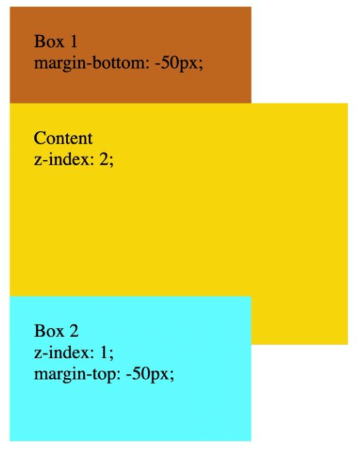
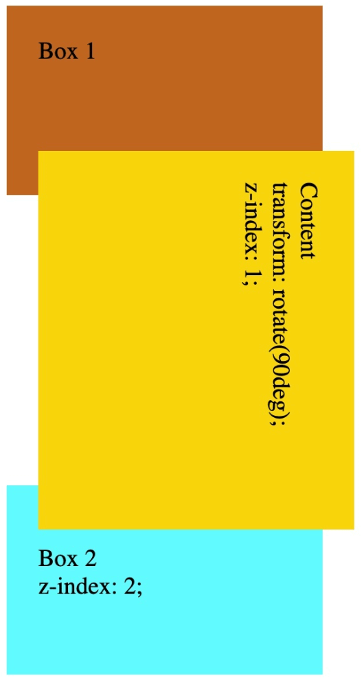
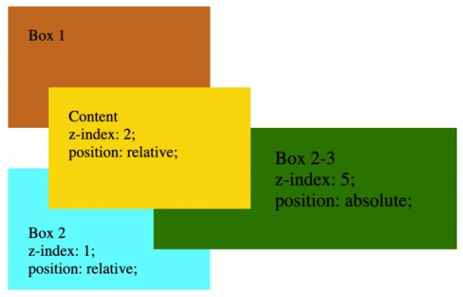
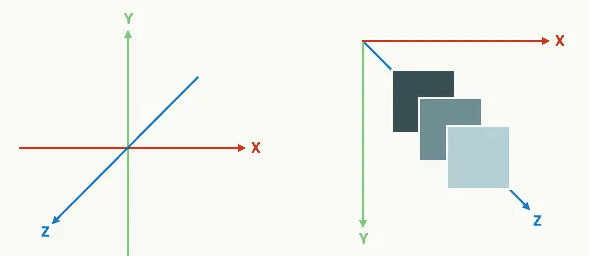

+++
title = "z-index"
date = '2024-11-09T00:00:00+08:00'
lastmod = '2024-11-10T00:00:00+08:00'
draft = true
weight = 10
tags = ["面试", "前端", "CSS", "z-index", "ecool"]
categories = ["前端开发", "面试"]
source = "https://fe.ecool.fun/knowledge-learn"
+++
大家可能觉得，`z-index` 是一个很简单的属性，你给它设置哪个值，元素就会位于 `y` 轴的哪个位置。但它实际上并没有我们想象的这么简单，这个属性背后是一系列决定元素所在层级的规则。

在进行今天的介绍前，我们先列出三个问题，如果你能一眼看出它们的解决方案，那么恭喜你掌握了`z-index`，也就不需要阅读本文了；如果不行，那么耐心看完本文，相信能找到答案。

## 三个自测问题

- 问题一：为什么`z-index` 数值更大，但 `Content` 没有在 `Box 2` 之上？

```html
<div id="box1">
    Box 1
</div>

<div id="content">
    Content <br/>
    z-index: 2;
</div>

<div id="box2">
    Box 2 <br/>
    z-index: 1;
</div>
```

```css
div {
    padding: 25px;
    font-size: larger;
}

#box1 {
    background-color: chocolate;
    width: 200px;
    height: 100px;
    margin-bottom: -50px;
}

#content {
    background-color: gold;
    width: 300px;
    height: 200px;
    z-index: 2;
}

#box2 {
    background-color: cyan;
    width: 200px;
    height: 100px;
    margin-top: -50px;
    z-index: 1;
}
```



- 问题二：明明 `z-index` 数值更小，为什么 `Content` 这次反而在`Box 2` 之上了？

```html
<div id="box1">
    Box 1
</div>

<div id="content">
    Content <br/>
    transform: rotate(90deg); <br/>
    z-index: 1;
</div>

<div id="box2">
    <br/>
    Box 2 <br/>
    z-index: 2;
</div>
```

```css
div {
    padding: 25px;
    font-size: larger;
}

#box1 {
    background-color: chocolate;
    width: 200px;
    height: 100px;
    margin-bottom: -10px;
}

#content {
    background-color: gold;
    width: 250px;
    height: 200px;
    z-index: 1;
    transform: rotate(90deg);
}

#box2 {
    background-color: cyan;
    width: 200px;
    height: 100px;
    margin-top: -10px;
    z-index: 2;
}
```



- 问题三：为什么明明 `z-index` 是最大的，但`Box 2-3` 在 `Content` 之下？

```html
<div id="box1">
    Box 1
</div>

<div id="content">
    Content <br/>
    z-index: 2; <br/>
    position: relative;
</div>

<div id="box2">
    <br/><br/>
    Box 2 <br/>
    z-index: 1; <br/>
    position: relative;
    <div id="box2-3">
        Box 2-3 <br/>
        z-index: 5;  <br/>
        position: absolute;
    </div>
</div>
```

```css
div {
    padding: 25px;
    font-size: larger;
}

#box1 {
    background-color: chocolate;
    width: 200px;
    height: 100px;
    margin-bottom: -50px;
}

#content {
    background-color: gold;
    width: 200px;
    height: 100px;
    margin-left: 50px;
    z-index: 2;
    position: relative;
}

#box2 {
    background-color: cyan;
    width: 200px;
    height: 100px;
    margin-top: -50px;
    z-index: 1;
    position: relative;
}

#box2-3 {
    background-color: green;
    width: 200px;
    height: 100px;
    padding-left: 150px;
    left: 180px;
    top: -50px;
    z-index: 5;
    position: absolute;
}
```



## z-index 简介

没有使用 `z-index` 的时候，元素的层叠关系由2个因素决定：

- 该元素的`position`是否是`static`，如果是`static`，那么这个元素就称为 `non-positioned` ；反之，如果 `position` 值是 `relative`, `absolute`, `fixed`, 或 `sticky` 则称 `positioned`。`positioned` 元素享受特权，会覆盖 `non-positioned` 元素。而 `non-positioned` 元素中，有 `float`样式的元素覆盖没有 `float` 的。
- 元素的“出场”顺序 —— 即在html中的顺序，同类型元素遵循后来者居上的原则。

`z-index` 属性设定了一个定位元素及其后代元素或 `flex` 项目的 `z-order`。当元素之间重叠的时候，`z-index` 较大的元素会覆盖较小的元素在上层进行显示。

所谓 `z-index`，只有在以下场景适用。分别为：

- 首先，`z-index`这个属性并不是在所有的元素上都有效果。它仅仅只在 `positioned` 元素上有效果。
- 要判断元素在 `z轴` 上的堆叠顺序，并不仅仅是直接比较两个元素的 z-index 值的大小，同时，这个堆叠顺序还由元素的层叠上下文和层叠等级共同决定。

## 层叠上下文

`z-index` 存在的一个背景是 `Stacking Context` ，中文常译作层叠上下文（其实数据结构中的栈的单词也是 stack，所以层叠上下文中已经蕴含了后来者居上的意思）。

层叠上下文，是HTML中一个三维的概念。在 `CSS2.1` 规范中，每个盒模型的位置是三维的，分别是平面画布上的`X轴`，`Y轴`以及表示层叠的`Z轴`。

一般情况下，元素在页面上沿 `X轴` 和 `Y轴` 平铺，我们是察觉不到它们在`Z轴`上的层叠关系。而一旦元素发生堆叠，这时就能发现某个元素可能覆盖了另一个元素或者被另一个元素覆盖。

如果一个元素含有层叠上下文，(也就是说它是层叠上下文元素)，我们可以理解为这个元素在Z轴上就“高人一等”，最终表现就是它离屏幕观察者更近。



构建层叠上下文和**盖楼**比较类似：

首先， `<html>` 元素是地平线或地基 —— 所有楼都是从地基开始盖的

接下来，每产生一个层叠上下文，相当于盖一座楼， z-index 的值相当于楼的高度

以下几种元素可以产生层叠上下文：

- 元素的 `position` 值为 `absolute` 或 `relative`， 且 `z-index` 值不为 `auto` （默认值）.
- 元素的 `position` 值为 `fixed` 或 `sticky`
- 元素是 `flexbox` 容器的子元素， 且 `z-index` 值不为 `auto` （默认值）
- 元素是 `grid` 容器的子元素, 且 `z-index` 值不为 `auto` （默认值）
- 元素有 `opacity` 值且值小于 1.
- 元素有以下任意一项的值，且值不为 `none` :<br>
  - `transform`
  - `filter`
  - `perspective`
  - `clip-path`
  - `mask / mask-image / mask-border`
- 元素有 `isolation` 值且值为 `isolate`.
- 元素有 `mix-blend-mode` 值且值不为 `normal`.
- 元素有 `-webkit-overflow-scrolling` 值且值为 `touch`.
- 其他几种冷门的情况

第三，层叠上下文是**可以嵌套**的 —— 这是最容易让人误解的一块。

嵌套，顾名思义就是在一个 `层叠上下文` 中能创建 `另一个层叠上下文`。

假如在地基上盖一座50米高的楼（即 `z-index: 50`), 是否可以在楼里再盖一栋 100米高的楼中楼呢？

当然不可能！但是你可以在这座楼里建一座 `100` 级阶梯高的大堂。

换句话说，在嵌套的层叠上下文中，子层叠上下文被限制在了父层叠上下文中，它们的 `z-index` “单位”已经不一样了（`z-index` 没有单位，这边只是用于理解），无论子层叠上下文的 `z-index` 值有多大都无法突破父层叠上下文的高度。

层叠上下文小结：

-  <html> 元素的第一级层叠上下文
- 特定样式的元素可以产生新的层叠上下文，且z-index的值在这些元素中才有效
- 子层叠上下文的“高度”被限制在了父层叠上下文中
- 在同级层叠上下文中，没有（有效） z-index 的元素依然遵循上一小节的规律；z-index 值相同的元素遵循后来者居上原则。

需要注意：`层叠上下文嵌套` 与 `元素嵌套` 不是一一对应的关系，一个元素所处的父层叠上下文是由内向外找到的第一个能产生层叠上下文的元素所产生的层叠上下文。

看个例子便于理解：

```css
<div id="div1" style="position: relative; z-index: 1">
  <div id="div2" style="position: relative; z-index: 1">
      所处的父层叠上下文是 div1 产生的层叠上下文
  </div>

  <div id="div3">
      <div id="div4" style="position: relative; z-index: 2">
          所处的父层叠上下文也是 div1 产生的层叠上下文
      </div>
  </div>
</div>
```

虽然 `div4` 外面还有层 `div3`，但是由于 `div3` 不能产生层叠上下文，所以 `div4` 所处的父层叠上下文也是 `div1` （产生的层叠上下文） —— 虽然在`html`元素层级中 `div4` 比 `div2` 更深了一级，但是 `div4` 与 `div2` 在层叠上下文层面上是同级的，因此它们可以相互比较 `z-index` 值来决定谁在上面。

## 三个问题的解答

学习完上面的 `z-index` 相关知识点，我们来回答开头提出的三个问题。

-  第一个问题中 `z-index` 不生效的原因在于这三个元素都不能产生层叠上下文，因此`z-index`值对它们不生效 —— 根据出场顺序决定了 `Content` 处在 `Box 2` 之下。
-  第二个问题的 `Box 2`不能产生层叠上下文，因此`z-index`同样是无效的；`Content` 因为使用了 `transform` 属性，产生了层叠上下文，相当于盖了一座 1 米高的楼（ `z-index: 1` )
-  `Box 2` 与 `Content` 在同一级层叠上下文中，且`Box 2` 的 `z-index` 比较小, 因此 `Box 2` 在 `Content` 之下；且 `Box 2-3` 在 `Box 2`的层叠上下文下新建了个子层叠上下文，因此`Box 2-3`的高度被限制在了 `Box 2` 之内，因此 `Box 2-3` 的 `z-index` 再高也没用。

## 常见考点

### 1. **`z-index` 的基本概念**

- `z-index` 是什么？它的作用是什么？
- `z-index` 值越大，元素的显示层次越高。如何解释这一特性？

### 2. **`z-index` 的工作原理**

- `z-index` 对哪些定位的元素生效？默认情况下，哪些元素可以使用 `z-index`？<br>
  - 必须是非静态定位的元素，例如 `position: relative`、`absolute`、`fixed`、`sticky`。
- `z-index` 的默认值是多少？如果不设置 `z-index`，元素的默认层级关系如何确定？

### 3. **堆叠上下文（Stacking Context）**

- 什么是堆叠上下文？如何理解堆叠上下文对 `z-index` 的影响？
- 创建新的堆叠上下文的条件有哪些？<br>
  - 例如 `position: relative` 或 `absolute` 的元素设置 `z-index` 值；
  - `opacity` 值小于 1；
  - `transform` 属性不为 `none`；
  - CSS 属性 `filter`、`perspective`、`clip-path`、`mask` 等等。
- 嵌套的堆叠上下文如何影响 `z-index`？如何解决层级问题？

### 4. **`z-index` 的值**

- `z-index` 的数值单位？`z-index` 是否可以为负值？如果设置负值，会带来哪些效果？
- 如果两个元素的 `z-index` 值相同，它们的层级顺序如何决定？（按 HTML 中的顺序，后出现的覆盖先出现的）

### 5. **实际应用与问题解决**

- **悬浮菜单**：如何用 `z-index` 让悬浮菜单或模态框始终显示在页面最上层？
- **层级问题**：当 `z-index` 值设置后仍然无法生效，可能的原因是什么？如何定位和解决这些问题？<br>
  - 举例：如果父元素创建了新的堆叠上下文，而子元素 `z-index` 值再高也无法超出该父元素的层级限制。
- **层级调试**：在复杂页面中，如何利用浏览器的开发者工具调试 `z-index` 带来的层级问题？

### 6. **代码示例**

- 给出代码示例，让面试者分析 `z-index` 层级显示效果。
- 示例代码：<br>
```html
<div class="parent1">
  <div class="child">Child 1</div>
</div>
<div class="parent2">
  <div class="child">Child 2</div>
</div>
```
```css
.parent1 {
  position: relative;
  z-index: 1;
}
.parent2 {
  position: relative;
  z-index: 2;
}
.child {
  position: absolute;
  z-index: 10;
}
```
- 问题：`child` 元素的 `z-index` 为什么在页面中仍然显示在 `parent1` 的后面？

### 7. **`z-index` 的应用场景**

- **模态框**：如何确保模态框在页面中的最顶层，且不会被其他元素遮挡？
- **下拉菜单与悬停效果**：在下拉菜单、悬停效果中使用 `z-index` 处理重叠问题。
- **响应式布局中的 `z-index`**：在小屏幕上如何使用 `z-index` 优化视觉层级效果？

### 8. **`z-index` 与 JavaScript 的结合**

- 如何利用 JavaScript 动态修改元素的 `z-index`，实现切换、拖拽等交互效果？
- 当用户点击某个元素时，使其“置顶”，如何在 JavaScript 中实现？

### 9. **`z-index` 的性能与兼容性**

- `z-index` 的使用会不会影响页面渲染性能？在大量元素的页面中如何优化？
- 兼容性问题：是否有一些低版本的浏览器对堆叠上下文的支持不佳？如何解决？

### 10. **常见的 `z-index` 错误**

- 元素的 `z-index` 设置无效的常见原因有哪些？（例如，未触发堆叠上下文）
- 如何使用 `z-index` 实现具有透明度的重叠效果，而不影响内容可见性？
