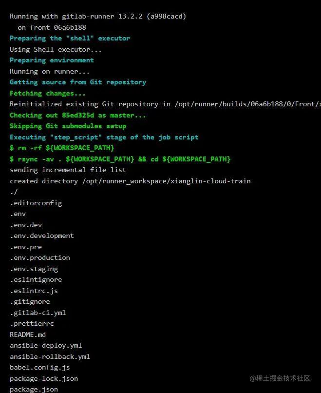

+++
title = "持续集成/持续部署（CI/CD）"
date = '2025-08-07T00:00:00+08:00'
lastmod = '2025-10-23T00:00:00+08:00'
draft = true
weight = 9
tags = ["面试", "前端", "工程化", "持续集成/持续部署（CI/CD）", "ecool"]
categories = ["前端开发", "面试"]
source = "https://fe.ecool.fun/knowledge-learn"
+++
## 传统应用发布模式

**开发人员**：在开发环境完成代码编写，单元测试，测试通过后提交到代码仓库

**运维人员**：把项目部署到测试环境，供QA团队测试，测试通过后，部署生成环境

**测试人员**：进行测试，测试完成后通知运维部署生产环境

### 缺点

1. 项目在早期就存在错误，但到最后集成的时候才发现
2. 需要手动操作，易错率高
3. 开发与运维需要及时沟通 有了以上缺点，那么就有了CI/CD

## CI/CD

*持续集成*(CI):

1. 合并开发人员正在编写的所有代码
2. 一天内进行多次合并和提交代码
3. 从存储库或生产环境中进行构建和自动化测试，确保没有集成问题并及早发现任何问题

*持续交付*(CD):

1. 可以通过将更改自动推送到发布系统来随时将软件发布到生产环境中
2. 持续部署，并自动将更改推送到生产中

## GitLab内置CI/CD

### 运行流水线任务

Job

在文件中可以定义一个或多个作业，每个作业具有唯一的名称，每个作业是独立执行的，*每个作业至少包含一个script*

stages：

用于定义作业可以使用的阶段，并且是全局定义，同一个阶段的作业并行运行，不同阶段按顺序运行

only：

用分支策略来限制jobs构建

script:

项目中package中的脚本

environment：

定义此作业完成部署的环境名称

下面是每个jobs的详细变量名

| Keyword | Required | Description |
| --- | --- | --- |
| script | yes | Runner执行的命令或脚本 |
| image | no | 所使用的docker镜像，查阅[使用docker镜像](https://docs.gitlab.com/ce/ci/docker/using_docker_images.html#define-image-and-services-from-gitlab-ciyml) |
| services | no | 所使用的docker服务，查阅[使用docker镜像](https://docs.gitlab.com/ce/ci/docker/using_docker_images.html#define-image-and-services-from-gitlab-ciyml) |
| stage | no | 定义job stage（默认：`test`） |
| type | no | `stage`的别名（已弃用） |
| variables | no | 定义job级别的变量 |
| only | no | 定义一列git分支，并为其创建job |
| except | no | 定义一列git分支，不创建job |
| tags | no | 定义一列tags，用来指定选择哪个Runner（同时Runner也要设置tags） |
| allow_failure | no | 允许job失败。失败的job不影响commit状态 |
| when | no | 定义何时开始job。可以是`on_success`，`on_failure`，`always`或者`manual` |
| dependencies | no | 定义job依赖关系，这样他们就可以互相传递artifacts |
| cache | no | 定义应在后续运行之间缓存的文件列表 |
| before_script | no | 重写一组在作业前执行的命令 |
| after_script | no | 重写一组在作业后执行的命令 |
| environment | no | 定义此作业完成部署的环境名称 |
| coverage | no | 定义给定作业的代码覆盖率设置 |

### 配置.gitlab-ci.yml

```
stages:
  - deploy_dev
  - deploy_test
  - deploy_production

deploy_dev:
  stage: deploy_dev
  environment:
    name: dev
  only:
    - dev
  script:
    - rsync -av . ${WORKSPACE_PATH} && cd ${WORKSPACE_PATH}
    - npm run build:dev
    - ansible-playbook ansible-deploy.yml --extra-vars "hosts=cloud_ui_test projectDir=${WORKSPACE_DIST_PATH} projectName=${PROJECT_NAME} webRootPath=/opt/devroot/"

deploy_test:
  stage: deploy_test
  environment:
    name: test
  only:
    - master
  script:
    - rsync -av . ${WORKSPACE_PATH} && cd ${WORKSPACE_PATH}
    - npm run build:stage
    - ansible-playbook ansible-deploy.yml --extra-vars "hosts=cloud_ui_test projectDir=${WORKSPACE_DIST_PATH} projectName=${PROJECT_NAME} webRootPath=${WEB_ROOT_PATH}"

deploy_production:
  stage: deploy_production
  only:
    - production
  when: manual
  script:
    - npm install
    - npm run build:prod
    - ansible-playbook ansible-deploy.yml --extra-vars "hosts=dvs-front-prod projectDir=${PROJECT_PATH} projectName=xianglin-cloud-ui/${PROJECT_NAME} webRootPath=/opt/"
```

上面这个.yml文件,我们首先定义了三个阶段，deploy_dev部署到dev环境，并且拉去的是dev分支代码; deploy_test部署到test环境，拉去的是master分支代码，deploy_production拉取production分支代码，执行完后需要手动操作


### 构建流程

 执行成功后部署到服务器

## 常见考点

1. 触发：push / PR → GitHub Actions / GitLab CI / Jenkins 自动拉起流水线。
2. 流程：安装依赖 → lint → test → build → 上传产物 → 部署。
3. 产物：dist 包打 zip / Docker 镜像，版本号由 changesets 自动生成。
4. 部署：  
  - 静态：CI 里 `rsync` / `aws s3 sync` 到 CDN；
  - 容器：`docker build` → 推送仓库 → K8s 滚动更新。
5. 回滚：保留最近 N 个版本，一键 revert；监控告警异常自动触发回滚脚本。
