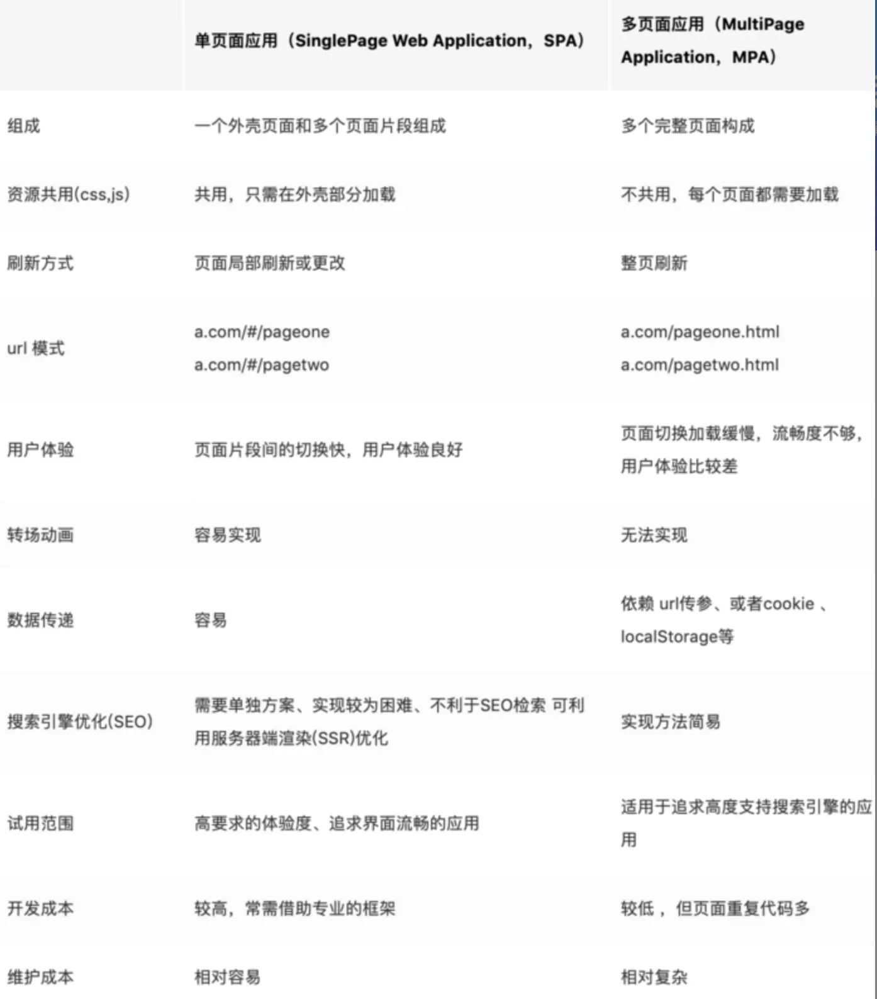
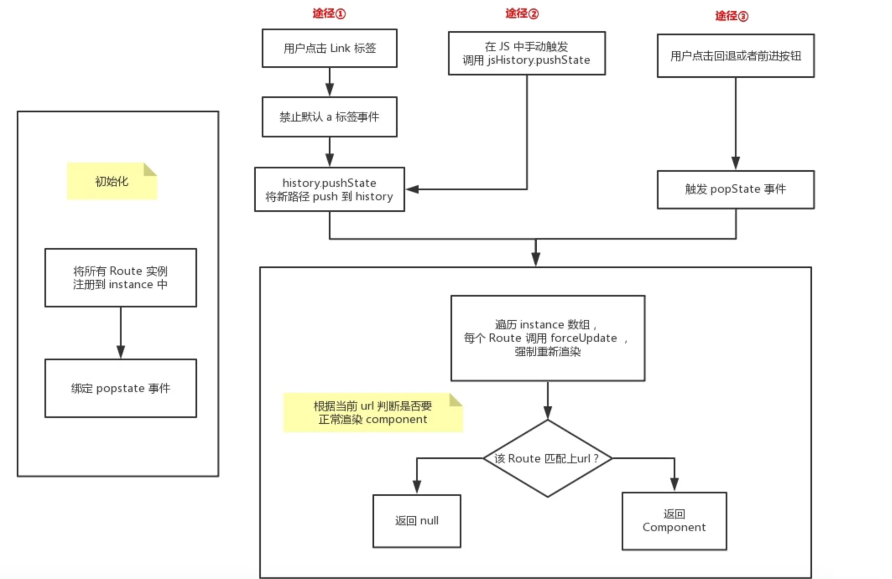

+++
title = "单页面架构"
date = '2025-08-07T00:00:00+08:00'
lastmod = '2025-10-23T00:00:00+08:00'
draft = true
weight = 13
tags = ["面试", "前端", "工程化", "单页面架构", "ecool"]
categories = ["前端开发", "面试"]
source = "https://fe.ecool.fun/knowledge-learn"
+++
### 传统的多页面应用构建方式：

- 纯服务端渲染，前后端不分离，使用`jsp`,`jade`,'ejs','tempalte'等技术在后台先拼接成对应的`HTML`结构，然后转换成字符串，在每个对应的路由返回对应的数据（文件）即可

> `Jade`模版服务端渲染，代码实现：

```
const express= require('express')
const app =express()
const jade = require('jade')
const result = ***
const url path = ***
const html = jade.renderFile(url, { data: result, urlPath })//传入数据给模板引擎
app.get('/',(req,res)=>{
    res.send(html)//直接吐渲染好的`html`文件拼接成字符串返回给客户端
}) //RestFul接口

app.listen(3000,err=>{
    //do something
})
```

- 使用`jQuery`等传统库绘制的前端页面

### 传统前后端不分离，服务端渲染的优缺点：

#### 优点：

- `SEO`友好，因为返回给前端的是渲染好的`HTML`结构，里面的内容都可以被爬虫抓取到。
- 对于一些应用性能等要求不高的项目，比如某个公司的静态网页，内容很少的情况下，直接一把梭就好，不用再搭建工程化的环境等
- 对于后端程序员（全干工程师）来说，不用去特意学习前端框架，公司也不用特意去招聘前端
- 兼容性好，传统服务端渲染多页面应用吐出来的都是字符串，`HTML`结构

#### 缺点：

- 如果项目很大，不利于维护，据我所知，目前很多云计算公司，还有不少都是使用非单页面应用，例如一个几十万行的项目是用`jQuery`写的，如果注释和文档不是非常齐全，那么真的会无从下手
- 性能和用户体验，不能跟单页面应用相比
- 后期迭代，升级空间不大，目前大部分写得比较好的库，都建立`vue,react`等框架基础上，他们都有一套自己的运行机制，有自己的生命周期，并且不像传统的应用，还加上了一层虚拟`DOM`以及`diff`算法
- 现在类似`Ant-Design-pro`这样的开箱即用的库已经很多，单页面应用的学习和开发成本已经很低很低，如果还在使用传统的技术去开发新的应用，对于开发人员多内心来说也是一种折磨。

> 这里并不是说多页面应用不好，只能说各有各自的好，单页面应用如果通过大量的极致优化手段，是可以从不少方面跟原生一拼。



## 目前的单页面应用：

- 只有一张Web页面的应用，是一种从Web服务器加载的富客户端，单页面跳转仅刷新局部资源 ，公共资源(js、css等)仅需加载一次，常用于PC端官网、购物等网站
- 其实只有一个空的`DIV`标签，其他都是`js`动态生态的内容

### 单页面应用实现步骤：

#### 代码实现：

- 首先是一个静态模板文件 `index.html`

```
<!DOCTYPE html>
<html lang="en">

<head>
    <meta charset="UTF-8">
    <meta name="viewport" content="width=device-width, initial-scale=1.0">
    <meta http-equiv="X-UA-Compatible" content="ie=edge">
    <title>Document</title>
</head>

<body>
    <div id="root"></div>
</body>
<script>

</script>

</html>
```

- 在`vue react`框架的入口文件中指定对应的渲染元素：

```
import React from 'react;
import ReactDOM from 'react-dom';

ReactDOM.render(
<App/>,
document.querySelector("#root")
)
```

- 引入`react-router或者 react-router-dom，dva`等路由跳转的库
- 配置路由跳转

```
<HashRouter>//这里使用HashRouter
      <ErrorBoundary>//React错误边界
        <Switch>
          <Route path="/login" component={Login} />
          <Route path="/home" component={Home} />
          <Route path="/" component={NotFound} />//404路由或者重定向都可以
        </Switch>
      </ErrorBoundary>
</HashRouter>
```

### 单页面应用所谓路由跳转，其实最终结果就是：

- 浏览器的`url`地址发生变化，但是其实并没有发送请求，也没有刷新整个页面
- 根据我们配置的路由信息，每次点击切换路由，会切换到不同的组件显示，类似于选项卡功能的实现,但是同时`url`地址栏会变化
- 分为`HashRouter`和`BrowserRouter`两种模式

## 自己实现一个粗略的路由跳转：

### 自己实现传统的`Hash`模式跳转：

> hash 就是指 url 后的 # 号以及后面的字符。例如`www.baidu.com/#segmentfault`,那么`#segmentfault`就是`hash`值

- 需要用到的几个知识点：
- `window.location.hash` = '****'; // 设置当前的hash值
- `const hash = window.location.hash` 获取当前的hash值
- `hash`改变会触发`window`的`hashchange`事件

```
window.onhashchange=function(e){
    let newURL = e.newURL; // 改变后的新 url地址
    let oldURL = e.oldURL; // 改变前的旧 url地址
}
```

> 这里特别注意，`hash`改变并不会发送请求

### 开始实现`Hash`模式跳转：

#### 使用类似发布订阅模式的方式，使用`ES6`的class实现：

- 初始订阅，每个不同的`hash`值，对应不同的函数调用处理。

```
class Router {
  constructor() {
    this.routes = {};
    this.currentUrl = '';
  }
  route(path, callback) {
    this.routes[path] = callback || function() {};
  }
  updateView() {
    this.currentUrl = location.hash.slice(1) || '/';
    this.routes[this.currentUrl] && this.routes[this.currentUrl]();
  }
  init() {
    window.addEventListener('load', this.updateView.bind(this), false);
    window.addEventListener('hashchange', this.updateView.bind(this), false);
  }
}
```

- routes 用来存放不同路由对应的回调函数
- init 用来初始化路由，在 load 事件发生后刷新页面，并且绑定 hashchange 事件，当 hash 值改变时触发对应回调函数

#### 开始使用：

```
<div id="app">
  <ul>
    <li>
      <a href="#/">home</a>
    </li>
    <li>
      <a href="#/about">about</a>
    </li>
    <li>
      <a href="#/topics">topics</a>
    </li>
  </ul>
  <div id="content"></div>
</div>
<script src="js/router.js"></script>
<script>
  const router = new Router();
  router.init();
  router.route('/', function () {
    document.getElementById('content').innerHTML = 'Home';
  });
  router.route('/about', function () {
    document.getElementById('content').innerHTML = 'About';
  });
  router.route('/topics', function () {
    document.getElementById('content').innerHTML = 'Topics';
  });
</script>
```

> 这样一个简单的`hash`模式路由就做好了，剩下的就是路由嵌套，以及错误边界的处理

### `History`模式实现：

- `History`来自`Html5`的规范
- `History`模式，`url`地址栏的改变并不会触发任何事件
- `History`模式，可以使用`history.pushState`,`history.replaceState`来控制`url`地址,history.pushState() 和 history.replaceState() 的区别在于：
- `history.pushState()` 在保留现有历史记录的同时，将 url 加入到历史记录中。
- `history.replaceState()` 会将历史记录中的当前页面历史替换为 url。
- `History`模式下，刷新页面会404，需要后端配合匹配一个任意路由，重定向到首页，特别是加上`Nginx`反向代理服务器的时候

> 我们需要换个思路，我们可以罗列出所有可能触发 history 改变的情况，并且将这些方式一一进行拦截，变相地监听 history 的改变。

### 对于一个应用而言，url 的改变(不包括 hash 值得改变)只能由下面三种情况引起：

- 点击浏览器的前进或后退按钮
- 点击 a 标签
- 在 JS 代码中触发 history.push(replace)State 函数

> 只要对上述三种情况进行拦截，就可以变相监听到 history 的改变而做出调整。针对情况 1，HTML5 规范中有相应的 onpopstate 事件，通过它可以监听到前进或者后退按钮的点击，值得注意的是，调用 history.push(replace)State 并不会触发 onpopstate 事件。

### 开始实现：

```
class Router {
  constructor() {
    this.routes = {};
    this.currentUrl = '';
  }
  route(path, callback) {
    this.routes[path] = callback || function() {};
  }
  updateView(url) {
    this.currentUrl = url;
    this.routes[this.currentUrl] && this.routes[this.currentUrl]();
  }
  bindLink() {
    const allLink = document.querySelectorAll('a[data-href]');
    for (let i = 0, len = allLink.length; i < len; i++) {
      const current = allLink[i];
      current.addEventListener(
        'click',
        e => {
          e.preventDefault();
          const url = current.getAttribute('data-href');
          history.pushState({}, null, url);
          this.updateView(url);
        },
        false
      );
    }
  }
  init() {
    this.bindLink();
    window.addEventListener('popstate', e => {
      this.updateView(window.location.pathname);
    });
    window.addEventListener('load', () => this.updateView('/'), false);
  }
}
```

### Router 跟之前 Hash 路由很像，不同的地方在于：

- init 初始化函数，首先需要获取所有特殊的链接标签，然后监听点击事件，并阻止其默认事件，触发 history.pushState 以及更新相应的视图。
- 另外绑定 popstate 事件，当用户点击前进或者后退的按钮时候，能够及时更新视图，另外当刚进去页面时也要触发一次视图更新。

### 实际使用：

```
<div id="app">
  <ul>
    <li><a data-href="/" href="#">home</a></li>
    <li><a data-href="/about" href="#">about</a></li>
    <li><a data-href="/topics" href="#">topics</a></li>
  </ul>
  <div id="content"></div>
</div>
<script src="js/router.js"></script>
<script>
  const router = new Router();
  router.init();
  router.route('/', function() {
    document.getElementById('content').innerHTML = 'Home';
  });
  router.route('/about', function() {
    document.getElementById('content').innerHTML = 'About';
  });
  router.route('/topics', function() {
    document.getElementById('content').innerHTML = 'Topics';
  });
</script>
```

- 跟之前的 html 基本一致，区别在于用 data-href 来表示要实现软路由的链接标签。
- 当然上面还有情况 3，就是你在 JS 直接触发 pushState 函数，那么这时候你必须要调用视图更新函数，否则就是出现视图内容和 url 不一致的情况。

```
setTimeout(() => {
  history.pushState({}, null, '/about');
  router.updateView('/about');
}, 2000);
```

### `React-router-dom`源码：

#### `Router`组件：

```
export class Route extends Component {
  componentWillMount() {
    window.addEventListener('hashchange', this.updateView, false);
  }
  componentWillUnmount() {
    window.removeEventListener('hashchange', this.updateView, false);
  }
  updateView = () => {
    this.forceUpdate();
  }
  render() {
    const { path, exact, component } = this.props;
    const match = matchPath(window.location.hash, { exact, path });
    if (!match) {
      return null;
    }
    if (component) {
      return React.createElement(component, { match });
    }
    return null;
  }
}
```

- 组件挂载监听`hash change`原生事件，将要卸载时候移除事件监听防止内存泄漏
- 每次`hash`改变，就触发所有对应`hash`的回掉，所有的`Router`都去更新视图
- 每个`Router`组件中，都去对比当前的`hash`值和这个组件的`path`属性，如果不一样，那么就返回`null`,·否则就渲染这个组件对应的视图

### `History`模式的实现：



[实现History](https://link.juejin.cn/?target=https%3A%2F%2Fzhuanlan.zhihu.com%2Fp%2F31874420)

> 这里想多留些时间写其他源码，这篇文章写得非常好，大家也可以去看看，本文很多借鉴他的。

### `withRouter`高阶函数的源码：

```
var withRouter = function withRouter(Component) {
  var C = function C(props) {
    var wrappedComponentRef = props.wrappedComponentRef,
        remainingProps = _objectWithoutProperties(props, ["wrappedComponentRef"]);

    return _react2.default.createElement(_Route2.default, {
      children: function children(routeComponentProps) {
        return _react2.default.createElement(Component, _extends({}, remainingProps, routeComponentProps, {
          ref: wrappedComponentRef
        }));
      }
    });
  };

  C.displayName = "withRouter(" + (Component.displayName || Component.name) + ")";
  C.WrappedComponent = Component;
  C.propTypes = {
    wrappedComponentRef: _propTypes2.default.func
  };

  return (0, _hoistNonReactStatics2.default)(C, Component);
};
```

- 传入一个组件，返回一个新的组件，并且给这个组件赋予全局属性，拥有路由组件的三大属性

### `Switch`组件：

```
Switch.prototype.render = function render() {
    var route = this.context.router.route;
    var children = this.props.children;

    var location = this.props.location || route.location;

    var match = void 0,
        child = void 0;
    _react2.default.Children.forEach(children, function (element) {
      if (match == null && _react2.default.isValidElement(element)) {
        var _element$props = element.props,
            pathProp = _element$props.path,
            exact = _element$props.exact,
            strict = _element$props.strict,
            sensitive = _element$props.sensitive,
            from = _element$props.from;

        var path = pathProp || from;

        child = element;
        match = (0, _matchPath2.default)(location.pathname, { path: path, exact: exact, strict: strict, sensitive: sensitive }, route.match);
      }
    });

    return match ? _react2.default.cloneElement(child, { location: location, computedMatch: match }) : null;
  };
```

- 遍历所以传入的子元素
- 如果有符合的路由对应的元素，那么就返回，而且只匹配这一个路由。不再继续往下匹配
- 如果第二条没有找到符合的元素，那么抛出错误

## 常见考点

## 一、SPA 的核心概念与原理

**考察重点：**

-  SPA 与 MPA 的区别（单页应用 vs 多页应用）
-  SPA 的本质：**前端接管路由 + 局部刷新渲染 + 状态持久**
-  单页架构的优缺点：<br>
  - 优点：用户体验流畅、前后端分离、开发效率高
  - 缺点：首屏加载慢、SEO 不友好、复杂状态管理

**典型问题：**

- 请解释一下什么是单页面应用？它和多页面应用有何区别？
- 为什么现代前端框架普遍采用 SPA 架构？
- SPA 的缺点有哪些？你在项目中如何应对？

---

## 二、前端路由机制（核心考点）

**考察重点：**

-  前端路由的两种实现方式：<br>
  1. **Hash 模式**（依赖 `window.onhashchange`）
  2. **History 模式**（依赖 HTML5 History API，如 `pushState`/`replaceState`）
-  路由与组件渲染的映射机制
-  浏览器刷新时的 404 问题与 Nginx 配置重定向
-  动态路由与懒加载机制
-  嵌套路由、路由守卫、导航守卫（beforeEach、onEnter）

**典型问题：**

- 你能解释一下前端路由是如何实现的吗？
- 为什么 History 模式在刷新时会 404？如何解决？
- 在 React 或 Vue 中如何实现路由懒加载？
- 路由跳转时如何做权限校验？

---

## 三、首屏加载与性能优化

**考察重点：**

-  SPA 首屏性能瓶颈：**JS 体积大、阻塞渲染、数据依赖多**
-  优化手段：<br>
  - 代码分割、懒加载（`dynamic import`）
  - 资源预加载（`<link rel="preload">`）
  - 骨架屏 / loading 占位
  - SSR / SSG / Prerender
  - 缓存策略（localStorage、indexedDB、Service Worker）
-  打包优化：Tree-shaking、动态 Polyfill、CDN 分发

**典型问题：**

- 为什么 SPA 首屏加载慢？如何优化？
- 你在项目中如何衡量并优化首屏渲染时间？
- 是否用过骨架屏？如何实现？
- SSR 与 CSR 的区别？哪种更适合你的业务？

---

## 四、状态管理与页面间数据共享

**考察重点：**

- 全局状态管理工具的选择与设计（Redux、Zustand、MobX、Pinia、Vuex）
- 单页多模块间数据同步
- 状态持久化（localStorage + redux-persist）
- 页面切换时的状态保留策略（keep-alive、缓存路由组件）

**典型问题：**

- SPA 中多个页面之间如何共享数据？
- 你如何在 React/Vue 中实现页面状态缓存？
- Redux / Vuex 为什么适合单页应用？

---

## 五、SEO 与可访问性问题

**考察重点：**

-  SPA 对 SEO 的影响（内容渲染在客户端）
-  解决方案：<br>
  - **SSR（服务端渲染）**
  - **静态化预渲染（Prerender）**
  - **动态渲染（Dynamic Rendering）**
-  是否理解 SSR 的原理与前后端同构机制

**典型问题：**

- 为什么单页面应用不利于 SEO？
- 你知道哪些改善 SEO 的方案？
- SSR、SSG、Prerender 各有什么适用场景？

---

## 六、页面切换与体验优化

**考察重点：**

- 路由切换动画实现方式（Transition / Framer Motion）
- 滚动位置还原、懒加载与预加载
- SPA 下的浏览器前进/后退行为管理
- 缓存页面状态与回退体验（如 keep-alive、React Router `useNavigate(-1)`）

**典型问题：**

- 单页应用如何实现页面切换动画？
- 如何在页面回退时保持滚动位置？
- React Router 中如何实现页面缓存？

---

## 七、工程架构与部署策略

**考察重点：**

- 前后端分离架构下的 SPA 部署流程
- 静态资源路径管理、Nginx 配置、路由重写
- 灰度发布、版本缓存控制
- 与后端接口的协作（API Gateway / BFF）

**典型问题：**

- SPA 应用如何配置 Nginx？
- 当路径直接访问子页面时如何避免 404？
- 如何在单页架构中支持国际化、多主题？

---

## 八、安全与容错

**考察重点：**

- 路由权限控制（前端路由守卫 + token 校验）
- 登录态维护与刷新机制（cookie / token / refresh token）
- 错误边界处理与白屏监控
- 版本更新提示与缓存失效策略（Service Worker + manifest 版本对比）

**典型问题：**

- SPA 如何实现路由级别的权限校验？
- 用户 token 过期时如何优雅地处理？
- 如何避免单页应用白屏问题？

---

## 九、进阶与扩展方向

**考察重点：**

- **微前端（Micro-Frontend）**：将多个 SPA 组合成一个系统
- **多实例 SPA 与路由隔离**
- **同构渲染与前后端协作模式（Next.js、Nuxt.js）**

**典型问题：**

- 你对微前端架构的理解？
- 微前端与传统 SPA 的关系是什么？
- SSR 是如何解决 SPA 的首屏性能和 SEO 问题的？
