+++
title = "解构赋值"
date = '2024-10-02T00:00:00+08:00'
lastmod = '2024-12-17T00:00:00+08:00'
draft = true
weight = 5
tags = ["面试", "前端", "ES6", "JavaScript", "解构赋值", "ecool"]
categories = ["前端开发", "面试"]
source = "https://fe.ecool.fun/knowledge-learn"
+++
## 解构赋值概念

**解构赋值**语法是一种 Javascript 表达式。

- 通过解构赋值，可以将属性/值从对象/数组中取出,赋值给其他变量。
- 解构赋值是通过将结构中的各元素复制到变量中来达到“解构”的目的。但对象/数组本身不会被修改。

## 数组解构

### 基本使用

📖 可以在定义变量的同时，使用解构进行赋值

```
let [one, two, three] = foo;

//等同于

let one = foo[0];
let two = foo[1];
let three = foo[2];
```

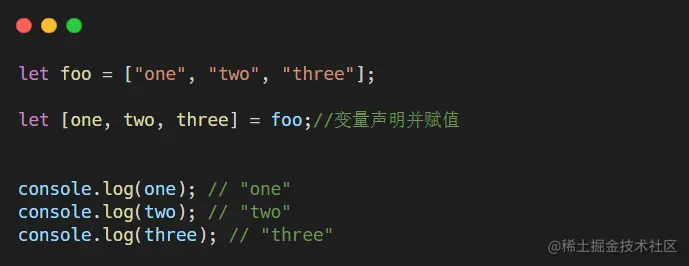

📖 也可以先声明变量，在进行解构赋值

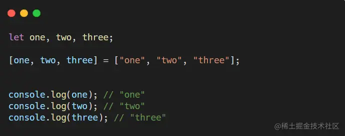

### 设置默认值

当【左边≠右边】时，可以先设置一个默认值，否则取不到值的变量会变成undefined

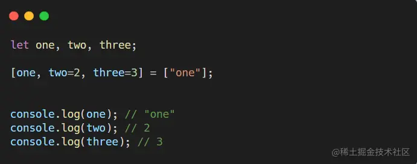

### 剩余值处理

可以使用三个点 `"..."`+ 参数来接收剩余的所有元素，变量名称随意，必须在最后一个参数的位置上

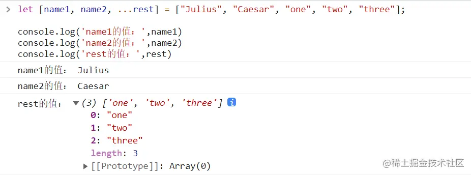

### 进阶用法

🎨 可以和`split` 函数结合使用，比如

```
let [Mother,Father] = "judy,pete".split(',');

console.log(Mother)   //judy
console.log(Father)   //pete
```

🎨 可以使用逗号忽略元素，比如

```
let [name1,,name3] = ["Julius01", "Caesar02", "Consul03"]
```

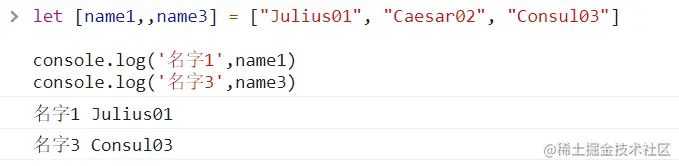

🎨 可以直接赋值给对象的属性，比如

```
let user = {};
[user.name, user.surname] = ["Ilya","Kantor"]
```

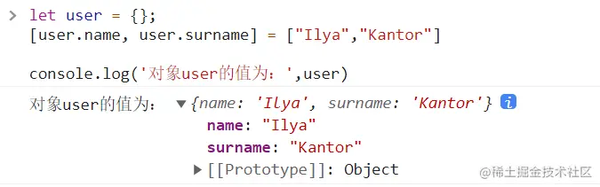

🎨 可以结合.entries() 方法来遍历对象的“键—值”对，比如

```
for (let [key, value] of Object.entries(fruit)) {...}
```

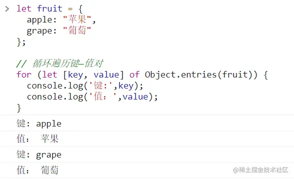

🎨 可以利用解构来进行变量交换，比如

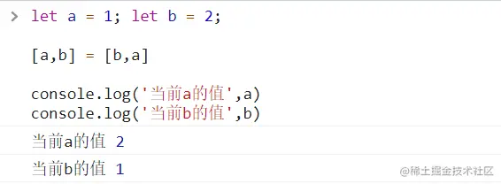

## 对象解构

### 基本使用

注意变量名称保持一致

```
let {a, b} = {a:"Julius01", b:"Caesar02"}
```

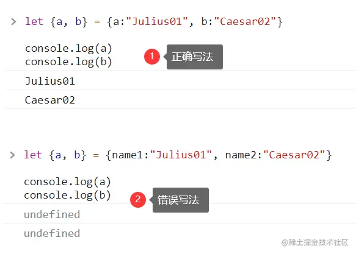

📖 **新的变量名称**

如果想要从一个对象中提取变量并赋值给和对象属性名不同的新的变量名。应该这样写：

```
let {name1: a,name2: b} = {name1:"Julius01", name2:"Caesar02"}
```

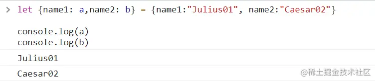

> 冒号表示“什么值：赋值给谁”，如以上示例表示，把name1赋值给变量a，把name2赋值给变量b

### 设置默认值

对象的解构同样可以设置默认值

```
let { a, b = 2} = {a:"Julius01"}
```

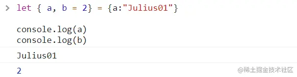

📖 **命名并且设置默认值**

一个属性可以同时

- 1）从一个对象解构，并分配给一个不同名称的变量
- 2）分配一个默认值，以防未解构的值是 `undefined`。

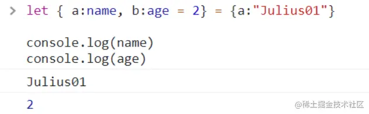

### 剩余值的处理

当对象拥有的属性数量比我们提供的变量数量还多时，可以只取其中部分属性，然后用1个变量来存剩余的值，比如

```
let  fruit = {
   apple:'苹果',
   banana:'香蕉',
   grape:'葡萄'
}

let {grape, ...restFruit} = fruit;
```

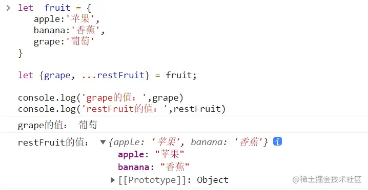

### 注意！！！

🎨 对象解构赋值，变量的顺序不重要，比如：

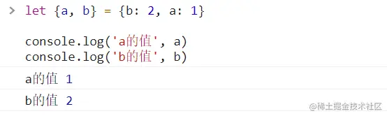

🎨 不支持直接先声明变量，后解构赋值

可以看到，数组的解构先声明后赋值是正确的，但是对象的会报错。

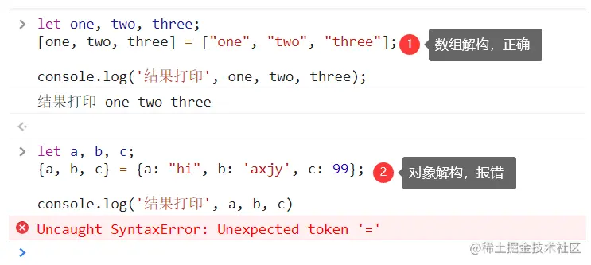

这是因为在 JavaScript 中会把{...}当做一个代码块。所以这样的代码`{a, b, c} = {a: "hi", b: 'axjy', c: 99};`是无效的。如果想要使它有效，则需要把整个赋值表达式用括号 `(...)` 包起来，以此来告诉JavaScript 这不是一个代码块。

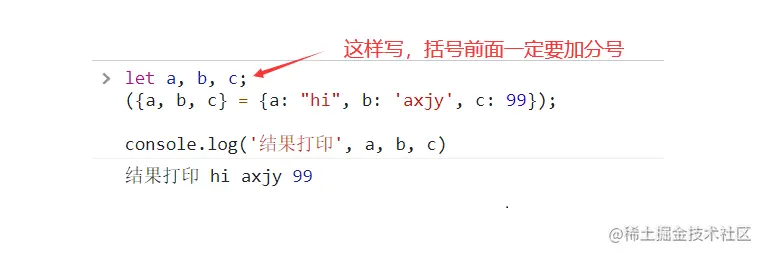

> `( ... )` 表达式之前一定要有一个分号，否则它可能会被当成上一行中的函数执行。

## 总结

- 解构数组的完整语法`let [item1 = default, item2, ...rest] = array`
- 解构对象的完整语法`let {prop : varName = default, ...rest} = object`

## 常见考点

### 一、基础概念

- **定义**：解构赋值是一种JavaScript表达式，允许从数组或对象中提取数据，然后将其赋值给变量。
- **用途**：简化代码，提高可读性，方便从复杂数据结构中提取所需信息。

### 二、数组解构赋值

- **基本用法**：如何从数组中提取元素并赋值给变量。
- **不完全解构**：当数组元素数量少于变量数量时，未赋值的变量将默认为`undefined`。
- **剩余参数**：使用剩余参数（`...`）收集数组中的剩余元素。
- **默认值**：为变量提供默认值，以防数组元素为`undefined`。
- **跳过元素**：在解构过程中跳过不需要的元素。

### 三、对象解构赋值

- **基本用法**：如何从对象中提取属性并赋值给变量。
- **重命名**：在解构过程中为变量提供新的名称。
- **嵌套解构**：处理嵌套对象结构，连续进行解构赋值。
- **默认值**：为对象属性提供默认值。

### 四、高级技巧

- **函数参数解构**：在函数定义时使用解构赋值来简化参数提取。
- **结合剩余参数和默认值**：在处理不完全的数据结构时，同时使用剩余参数和默认值。

### 五、实际应用场景

- **API响应数据处理**：从API返回的响应数据中提取所需信息。
- **UI组件渲染**：从组件的props中提取数据并赋值给组件的状态或属性。
- **应用状态管理**：在Redux、Vuex等状态管理库中，使用解构赋值来简化状态提取和更新。

### 六、注意事项

- **解构赋值的目标**：必须是可遍历对象，如数组、字符串、实现Iterator接口的数据结构等。
- **变量声明**：在使用解构赋值时，通常需要提前声明变量（除非在函数参数中直接使用）。
- **默认值触发条件**：当解构模式有匹配结果，且匹配结果是`undefined`时，会触发默认值作为返回结果。
