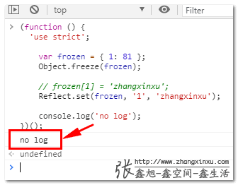

+++
title = "Reflect"
date = '2024-10-02T00:00:00+08:00'
lastmod = '2025-07-17T00:00:00+08:00'
draft = true
weight = 15
tags = ["面试", "前端", "ES6", "JavaScript", "Reflect", "ecool"]
categories = ["前端开发", "面试"]
source = "https://fe.ecool.fun/knowledge-learn"
+++
### 一、Reflect有什么用？

一句话，Reflect没什么用，除了装装逼，让人看起来高大上以外，并不具有什么牛逼之处。

准确讲应该是这样的，Reflect更像是一种语法变体，其挂在的所有方法都能找到对应的原始语法，也就是Reflect的替代性非常强。

其实从Reflect这个单词本身字面意思就能体会出Reflect的神韵，Reflect的中文意思是“反射”，阳光照在镜子上反射，其实光子还是那些光子，只是变化了方向。

举例说明：

Reflect对象挂载了很多静态方法，所谓静态方法，就是和`Math.round()`这样，不需要new就可以直接使用的方法。

比较常用的两个方法就是`get()`和`set()`方法：

```js
Reflect.get(target, propertyKey\[, receiver\])
Reflect.set(target, propertyKey, value\[, receiver\])
```

就作用而言，等同于：

```js
target[propertyKey]
target[propertyKey] = value;
```

比方说页面上有个输入框，其DOM对象变量是`input`，平时我们对整个输入框赋值使用的语句多半是：

```js
input.value = 'zhangxinxu';
```

就可以直接使用`Reflect.set()`方法代替：

```js
Reflect.set(input, 'value', 'zhangxinxu')
```

效果是一模一样的。

又例如，我们希望对`input`的`value`属性重新定义，使该输入框`value`属性发生变化的时候可以同时触发`'change'`事件，下面是使用大家普遍比较熟悉的`Object.defineProperty()`方法实现的示意：

```js
const props = Object.getOwnPropertyDescriptor(input, 'value');
Object.defineProperty(input, 'value', {
    ...props,
    set (v) {
        let oldv = this.value;
        props.set.call(this, v);
        // 手动触发change事件
        if (oldv !== v) {
            this.dispatchEvent(new CustomEvent('change'));
        }
    }
});
```

上述代码我们完全可以使用Reflect对象实现，具体的JavaScript代码如下所示。

```js
const props = Reflect.getOwnPropertyDescriptor(HTMLInputElement.prototype, 'value');
Reflect.defineProperty(input, 'value', {
    ...props,
    set (v) {
        let oldv = this.value;
        props.set.call(this, v);
        // 手动触发change事件
        if (oldv !== v) {
            this.dispatchEvent(new CustomEvent('change'));
        }
    }
});
```

我们可以测试下，假设页面HTML如下：

```html
<input id="input">
```

测试代码为：

```js
input.addEventListener('change', () => {
  document.body.append('变化啦~');
});

input.value = 'zhangxinxu';
```

此时，就可以看到页面上出现了“变化啦~”文字

### 二、细微差异-返回值

事物存在必有道理，如果Reflect仅仅是换了种语法，存在的意义并不大，很显然，Reflect对象的出现必然有其他的考量。

我认为其中有意义的一点就是返回值。

对于某个对象，赋值并不总是成功的。

例如，我们把 `input` 的`type`属性设置为只读，如下：

```js
Object.defineProperty(input, 'type', {
    get () {
       return this.getAttribute('type') || 'text';
    }
});
```

传统的使用等于号进行的属性赋值并不能知道最后是否执行成功，需要开发者自己进行进一步的检测。

例如：

```js
console.log(input.type = 'number');

// 输出 false
console.log(Reflect.set(input, 'type', 'number'));
```

上面一行赋值返回值是`'number'`，至于改变输入框的`type`属性值是否成功，不得而知。

但是下面一行语句使用的`Reflect.set()`方法，就可以知道是否设置成功，因为`Reflect.set()`的返回值是`true`或者`false`（只要参数类型准确）。

除了知道执行结果外，Reflect方法还有个好处，不会因为报错而中断正常的代码逻辑执行。

例如下面的代码：

```js
(function () {
    'use strict';

    var frozen = { 1: 81 };
    Object.freeze(frozen);

    frozen\[1\] = 'zhangxinxu';

    console.log('no log');
})();
```

会出现下面的TypeError错误：

> Uncaught TypeError: Cannot assign to read only property ‘1’ of object ‘#`<Object>`’

后面的语句`console.log('no log')`就没有被执行。

但是如果使用Reflect方法，则console语句是可以执行的，例如：

```js
(function () {
    'use strict';

    var frozen = { 1: 81 };
    Object.freeze(frozen);

    Reflect.set(frozen, '1', 'zhangxinxu');

    console.log('no log');
})();
```

控制台运行后的log输出值如下图所示：



### 三、set、get方法中的receiver参数

就功能而言，`Reflect.get()`和`Reflect.set()`方法和直接对象赋值没有区别，都是可以互相替代的，例如，下面两段JS效果都是一样的。

还是使用`input`这个DOM元素示意。

有人可能会疑问，为什么不用纯对象示意呢？

因为我发现大多数前端都对DOM不怎么感兴趣，那我就反其道行之，故意膈应人。另外一个原因就是DOM对象更具象，所见即所得，适合偏感性的同学的学习。

```js
const xyInput = new Proxy(input, {
    set (target, prop, value) {
        if (prop == 'value') {
            target.dispatchEvent(new CustomEvent('change'));
        }
        target\[prop\] = value;

        return true;
    },
    get (target, prop) {
        return target[prop];
    }
});

input.addEventListener('change', () => {
  document.body.append('变化啦~');
});
xyInput.value = 'zhangxinxu';
```

和下面的JS代码效果类似的。

```js
const xyInput = new Proxy(input, {
    set (target, prop, value) {
        if (prop == 'value') {
            target.dispatchEvent(new CustomEvent('change'));
        }
        return Reflect.set(target, prop, value);
    },
    get (target, prop) {
        return Reflect.get(target, prop);
    }
});

input.addEventListener('change', () => {
  document.body.append('变化啦~');
});
xyInput.value = 'zhangxinxu';
```

均有如下图所示的效果：


但是，当需要使用可选参数receiver参数的时候，直接对象赋值和使用Reflect赋值就会出现差异。

首先，对于DOM元素，应用receiver参数会报错。

例如下面的JS就会报错：

```
Reflect.set(input, 'value', 'xxx', new Proxy({}, {}));
```

> Uncaught TypeError: Illegal invocation

但是把input换成普通的纯对象，则不会有问题，例如：

```
// 可以正常执行
Reflect.set({}, 'value', 'xxx', new Proxy({}, {}));
```

#### 关于receiver参数

说了这么多，`receiver`参数到底是干嘛用的呢？

receiver是接受者的意思，表示调用对应属性或方法的主体对象，通常情况下，receiver参数是无需使用的，但是如果发生了继承，为了明确调用主体，receiver参数就需要出马了。

比方说下面这个例子：

```
let miaoMiao = {
  _name: '疫苗',
  get name () {
    return this._name;
  }
}
let miaoXy = new Proxy(miaoMiao, {
  get (target, prop, receiver) {
    return target\[prop\];
  }
});

let kexingMiao = {
  __proto__: miaoXy,
  _name: '科兴疫苗'
};

// 结果是疫苗
console.log(kexingMiao.name);
```

实际上，这里预期显示应该是“科兴疫苗”，而不是“疫苗”。

这个时候，就需要使用`receiver`参数了，代码变化部分参见下面标红的那一行：

```
let miaoMiao = {
  _name: '疫苗',
  get name () {
    return this.\_name;
  }
}
let miaoXy = new Proxy(miaoMiao, {
  get (target, prop, receiver) {
    return Reflect.get(target, prop, receiver);
    // 也可以简写为 Reflect.get(...arguments)
  }
});

let kexingMiao = {
  __proto__: miaoXy,
  _name: '科兴疫苗'
};

// 结果是科兴疫苗
console.log(kexingMiao.name);
```

这就是receiver参数的作用，可以把调用对象当作target参数，而不是原始Proxy构造的对象。

### 四、其他以及结束语

Reflect对象经常和Proxy代理一起使用，原因有三点：

1. Reflect提供的所有静态方法和Proxy第2个handle参数方法是一模一样的。具体见后面的对比描述。
2. Proxy get/set()方法需要的返回值正是Reflect的get/set方法的返回值，可以天然配合使用，比直接对象赋值/获取值要更方便和准确。
3. receiver参数具有不可替代性。

下表是自己整理的Reflect静态方法和对应的其他函数或功能符。

| Reflect方法 | 类似于 |
| --- | --- |
| Reflect.apply(target, thisArgument, argumentsList) | Function.prototype.apply() |
| Reflect.construct(target, argumentsList[, newTarget]) | new target(…args) |
| Reflect.defineProperty(target, prop, attributes) | Object.defineProperty() |
| Reflect.deleteProperty(target, prop) | delete target[name] |
| Reflect.get(target, prop[, receiver]) | target[name] |
| Reflect.getOwnPropertyDescriptor(target, prop) | Object.getOwnPropertyDescriptor() |
| Reflect.getPrototypeOf(target) | Object.getPrototypeOf() |
| Reflect.has(target, prop) | in 运算符 |
| Reflect.isExtensible(target) | Object.isExtensible() |
| Reflect.ownKeys(target) | Object.keys() |
| Reflect.preventExtensions(target) | Object.preventExtensions() |
| Reflect.set(target, prop, value[, receiver]) | target[prop] = value |
| Reflect.setPrototypeOf(target, prototype) | Object.setPrototypeOf() |

正是人如其名，Reflect就是其他方法、操作符的“反射”。

## 常见考点

在 ES6 中，`Reflect` 是一个内置对象，提供了用于操作对象的**低级 API**，它和 `Proxy` 密切相关。可以把 `Reflect` 理解为“更规范、更一致的对象操作工具集合”，本质上是对 JS 原有的底层操作（如 `delete`、`Object.defineProperty`）的一种函数化封装。

## 一、`Reflect` 的核心作用

| 功能 | 说明 |
| --- | --- |
| 函数化的对象操作 | 将原本非函数形式的操作（如 `delete obj.key`）封装为函数调用 |
| 与 `Proxy` 配合使用 | Proxy handler 中经常使用 Reflect 来执行默认行为 |
| 统一错误处理 | `Reflect` 方法失败时返回 `false`，而不是抛出异常 |
| 更语义化 | 代码更直观易懂，行为更一致 |

## 二、常用 API（共 13 个）

```js
const obj = { a: 1 };

// 获取属性
Reflect.get(obj, 'a');                 // 1

// 设置属性
Reflect.set(obj, 'b', 2);              // true

// 判断属性是否存在
Reflect.has(obj, 'a');                 // true（等价于 'a' in obj）

// 删除属性
Reflect.deleteProperty(obj, 'a');      // true

// 获取属性描述符
Reflect.getOwnPropertyDescriptor(obj, 'b');

// 定义属性（类似 Object.defineProperty）
Reflect.defineProperty(obj, 'c', {
  value: 3,
  writable: true,
  configurable: true,
  enumerable: true,
});

// 获取所有自有属性键
Reflect.ownKeys(obj);                  // 包括 symbol 键

// 获取原型
Reflect.getPrototypeOf(obj);

// 设置原型
Reflect.setPrototypeOf(obj, Array.prototype);

// 阻止扩展
Reflect.preventExtensions(obj);

// 判断是否可扩展
Reflect.isExtensible(obj);

// 构造对象（类似 new）
Reflect.construct(Date, []);

// 函数调用（类似 Function.prototype.apply）
Reflect.apply(Math.max, null, [1, 5, 3]); // 5
```

## 三、与 `Object` 的对比考点

| 操作 | Object 风格 | Reflect 风格 |
| --- | --- | --- |
| 获取原型 | `Object.getPrototypeOf(obj)` | `Reflect.getPrototypeOf(obj)` |
| 设置属性 | `obj[prop] = val` | `Reflect.set(obj, prop, val)` |
| 删除属性 | `delete obj[prop]` | `Reflect.deleteProperty(obj, prop)` |
| 定义属性 | `Object.defineProperty(...)` | `Reflect.defineProperty(...)` |
| 调用构造函数 | `new Foo(...args)` | `Reflect.construct(Foo, args)` |

Reflect 的方法返回值更一致，错误处理更温和（通常返回 `false` 而不是抛出异常），利于流程控制。

## 四、与 Proxy 的结合

在 `Proxy` handler 中使用 `Reflect` 是**最佳实践**：

```js
const target = { name: 'Tom' };
const proxy = new Proxy(target, {
  get(target, key, receiver) {
    console.log('get:', key);
    return Reflect.get(target, key, receiver);
  },
  set(target, key, value, receiver) {
    console.log('set:', key, value);
    return Reflect.set(target, key, value, receiver);
  },
});
```

- 使用 Reflect 确保操作行为与原生保持一致（如返回值、原型链处理等）。
- 避免意外行为或性能问题。

## 五、实际开发中的使用场景

- **代理数据拦截时实现默认行为（与 Proxy 搭配）**
- **函数调用封装（如 Reflect.apply）**
- **实现类的继承时通过 Reflect.construct 构造子类实例**
- **精确控制对象属性定义和拦截**
