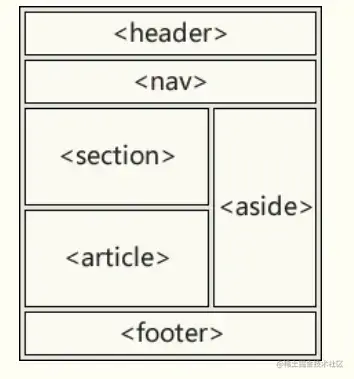

+++
title = "HTML 5 新特性"
date = '2024-09-24T00:00:00+08:00'
lastmod = '2024-11-06T00:00:00+08:00'
draft = true
weight = 1
tags = ["面试", "前端", "HTML", "HTML 5 新特性", "ecool"]
categories = ["前端开发", "面试"]
source = "https://fe.ecool.fun/knowledge-learn"
+++
## HTML5 新特性

1. 语义标签
2. 增强型表单
3. 视频和音频
4. Canvas绘图
5. SVG绘图
6. 地理定位
7. 拖拽API
8. WebWorker
9. WebStorage
10. WebSocket

## 语义标签

语义化标签使得页面的内容结构化，可以使开发者更方便清晰地构建页面的布局

| 标签 | 描述 |
| --- | --- |
| `<header>` | 定义了文档的头部区域 |
| `<footer>` | 定义了文档的尾部区域 |
| `<nav>` | 定义文档的导航 |
| `<section>` | 定义文档中的书 |
| `<acticle>` | 定义页面独立的内容区域 |
| `<aside>` | 定义页面侧边栏内容 |
| `<details>` | 定义用户可以看到或隐藏的额外细节 |
| `<summary>` | 标签包含details元素的标题 |
| `<dialog>` | 定义对话框 |
| `<figure>` | 定义自包含内容，如图表 |
| `<main>` | 定义文档主内容 |



## 增强型表单

HTML5新增input输入特性，改善更好的输入控制和验证

| 输入类型 | 描述 |
| --- | --- |
| color | 主要用于选取颜色 |
| date | 选取日期 |
| datetime | 选取日期（UTC时间） |
| datetime-local | 选取日期（无时区） |
| month | 选择一个月份 |
| week | 选择周和年 |
| time | 选择一个时间 |
| email | 包含email地址的输入域 |
| number | 数值的输入域 |
| url | url地址的输入域 |
| tel | 定义输入电话号码的字段 |
| search | 用于搜索域 |
| range | 一个范围内数字值的输入域 |

HTML5也新增了五个表单元素

| 标签 | 描述 |
| --- | --- |
| `<details>` | 用户会在他们输入数据时看到域定义选项的下拉列表 |
| `<progress>` | 进度条，展示连接/下载进度 |
| `<meter>` | 刻度值，用于某些计量，例如温度、重量等 |
| `<keygen>` | 提供一种验证用户的可靠方法，生成一个公钥和私钥 |
| `<output>` | 用于不同类型的输出，比如计算或脚本输出 |

HTML5新增表单属性

| 属性 | 描述 |
| --- | --- |
| placehoder | 输入框默认提示文字 |
| required | 要求输入的内容是否可为空 |
| pattern | 描述一个正则表达式验证输入的值 |
| min/max | 设置元素最小/最大值 |
| step | 为输入域规定合法的数字间隔 |
| height/wdith | 用于image类型标签图像高度/宽度 |
| autofocus | 规定在页面加载时，域自动获得焦点 |
| multiple | 规定元素中可选择多个值 |

## 视频和音频

- **音频文件标准**，`<audio>`

```html
<audio controls>
  <source src="horse.ogg" type="audio/ogg">
  <source src="horse.mp3" type="audio/mpeg">
您的浏览器不支持 audio 元素。
</audio>
```

 `control` 属性供添加播放、暂停和音量控件。

 在`<audio>` 与 `</audio>` 之间你需要插入浏览器不支持的`<audio>`元素的提示文本 。

 `<audio>` 元素允许使用多个 `<source>` 元素. `<source>` 元素可以链接不同的音频文件，浏览器将使用第一个支持的音频文件

 目前, 元素支持三种音频格式文件: MP3, Wav, 和 Ogg

- **视频文件标准** `<vedio>`

```html
<video width="320" height="240" controls>
  <source src="movie.mp4" type="video/mp4">
  <source src="movie.ogg" type="video/ogg">
您的浏览器不支持Video标签。
</video>
```

`control` 提供了 播放、暂停和音量控件来控制视频。也可以使用dom操作来控制视频的播放暂停，如 K 方法。

同时 `video` 元素也提供了 `width` 和 `height` 属性控制视频的尺寸.如果设置的高度和宽度，所需的视频空间会在页面加载时保留。如果没有设置这些属性，浏览器不知道大小的视频，浏览器就不能再加载时保留特定的空间，页面就会根据原始视频的大小而改变。

与 标签之间插入的内容是提供给不支持 `video` 元素的浏览器显示的。

`video` 元素支持多个`source` 元素. 元素可以链接不同的视频文件。浏览器将使用第一个可识别的格式（ MP4, WebM, 和 Ogg）

## Canvas绘图

Canvas 是 HTML5 提供的一个用于绘制图形的元素，使用 `<canvas>` 标签创建。通过 JavaScript，你可以在这个画布上进行像素级的绘图，支持2D和3D图形。常见应用包括游戏、动画、图表等。Canvas API 提供了一系列方法，如 `fillRect()`、`drawImage()` 和 `arc()`，使得绘图变得灵活和强大。

## SVG绘图

什么是SVG：

-  SVG指可伸缩矢量图形
-  SVG用于定义用于网络的基于矢量的图形
-  SVG使用XML格式定义图形
-  SVG图像在放大或改变尺寸的情况下其图形质量不会有损失
-  SVG是万维网联盟的标准

SVG的优势：

-  SVG图像可通过文本编译器来创建和修改
-  SVG图像可被搜索、索引、脚本化或压缩
-  SVG是可伸缩的
-  SVG图像可在任何的分辨率下被高质量的打印
-  SVG可在图像质量不下降的情况下被放大

SVG与Canvas的区别：

-  SVG适用于描述XML中的2D图形的语言
-  Canvas随时随地绘制2D图形（使用javaScript）
-  SVG是基于XML的，意味这可以操作DOM，渲染速度较慢
-  在SVG中每个形状都被当做是一个对象，如果SVG发生改变，页面就会发生重绘
-  Canvas是一像素一像素地渲染，如果改变某一个位置，整个画布会重绘。

| Canvas | SVG |
| --- | --- |
| 依赖分辨率 | 不依赖分辨率 |
| 不支持事件处理器 | 支持事件处理器 |
| 能够以.png或.jpg格式保存结果图像 | 复杂度会减慢搞渲染速度 |
| 文字呈现功能比较简单 | 适合大型渲染区域的应用程序 |
| 最合适图像密集的游戏 | 不适合游戏应用 |

## 地理定位 Geolocation

HTML5新增了Geolocation 用于定位用户的位置

```javascript
window.navigator.geolocation {
    getCurrentPosition:  fn   用于获取当前的位置数据
    watchPosition: fn  监视用户位置的改变
    clearWatch: fn   清除定位监视
}　
```

获取用户定位信息

```javascript
navigator.geolocation.getCurrentPosition(
    function(pos){
　　　　console.log('用户定位数据获取成功')
　　　　//console.log(arguments);
　　　　console.log('定位时间：',pos.timestamp)
　　　　console.log('经度：',pos.coords.longitude)
　　　　console.log('纬度：',pos.coords.latitude)
　　　　console.log('海拔：',pos.coords.altitude)
　　　　console.log('速度：',pos.coords.speed)

},    //定位成功的回调

function(err){
　　　　console.log('用户定位数据获取失败')
　　　　//console.log(arguments);

}        //定位失败的回调
)
```

## 拖放API

拖放是一种常见的特性，即捉取对象后拖到另一个位置

```html
<div draggable="true"></div>
```

当元素拖动时，我们可以检查其拖动的数据。

```html
<div draggable="true" ondragstart="drag(event)"></div>
<script>
function drag(ev){
    console.log(ev);
}
</script>
```

| 拖动生命周期 | 属性名 | 描述 |
| --- | --- | --- |
| 拖动开始 | ondragstart | 在拖动操作开始时执行脚本 |
| 拖动过程中 | ondrag | 只要脚本在被拖动就运行脚本 |
| 拖动过程中 | ondragenter | 当元素被拖动到一个合法的防止目标时，执行脚本 |
| 拖动过程中 | ondragover | 只要元素正在合法的防止目标上拖动时，就执行脚本 |
| 拖动过程中 | ondragleave | 当元素离开合法的防止目标时 |
| 拖动结束 | ondrop | 将被拖动元素放在目标元素内时运行脚本 |
| 拖动结束 | ondragend | 在拖动操作结束时运行脚本 |

## WebWorker

Web Worker可以通过加载一个脚本文件，进而创建一个独立工作的线程，在主线程之外运行。

Web Worker的基本原理就是在当前javascript的主线程中，使用Worker类加载一个javascript文件来开辟一个新的线程，

起到互不阻塞执行的效果，并且提供主线程和新县城之间数据交换的接口：postMessage、onmessage。

JS

```javascript
//worker.js
onmessage =function (evt){
  var d = evt.data;//通过evt.data获得发送来的数据
  postMessage( d );//将获取到的数据发送会主线程
}
```

html

```javascript
<!DOCTYPE HTML>
<html>
<head>
<meta http-equiv="Content-Type" content="text/html; charset=utf-8"/>
<script type="text/javascript">
//WEB页主线程
var worker =new Worker("worker.js"); //创建一个Worker对象并向它传递将在新线程中执行的脚本的URL
worker.postMessage("hello world");     //向worker发送数据
worker.onmessage =function(evt){     //接收worker传过来的数据函数
   console.log(evt.data);              //输出worker发送来的数据
}
</script>
</head>
<body></body>
</html>
```

## WebStorage

使用HTML5可以在本地存储用户的浏览数据。早些时候,本地存储使用的是cookies。但是Web 存储需要更加的安全与快速. 这些数据不会被保存在服务器上，但是这些数据只用于用户请求网站数据上.它也可以存储大量的数据，而不影响网站的性能。数据以 键/值 对存在, web网页的数据只允许该网页访问使用。

**websorage拥有5M的存储容量，而cookie却只有4K**，这是完全不能比的。

客户端存储数据的两个对象为：

- localStorage - 没有时间限制的数据存储
- sessionStorage - 针对一个 session 的数据存储, 当用户关闭浏览器窗口后，数据会被删除。

API(以localStorage为例)：

- 保存数据：localStorage.setItem(key,value);
- 读取数据：localStorage.getItem(key);
- 删除单个数据：localStorage.removeItem(key);
- 删除所有数据：localStorage.clear();
- 得到某个索引的key：localStorage.key(index);

## WebSocket

WebSocket协议为web应用程序客户端和服务端之间提供了一种全双工通信机制。

特点：

-  握手阶段采用HTTP协议，默认端口是80和443
-  建立在TCP协议基础之上，和http协议同属于应用层
-  可以发送文本，也可以发送二进制数据。
-  没有同源限制，客户端可以与任意服务器通信。
-  协议标识符是ws（如果加密，为wss），如ws://localhost:8023

## 常见考点

1.  **新语义化元素**：<br>
  - 了解新引入的语义化标签，如 `<article>`、`<section>`、`<header>`、`<footer>`、`<nav>` 等。
2.  **多媒体支持**：<br>
  - 讨论 `<audio>` 和 `<video>` 标签的使用及其属性，如何在页面中嵌入音频和视频。
3.  **表单控件**：<br>
  - 了解新表单元素和属性，如 `<input>` 类型（如 date、email、range）以及新特性（如 placeholder、required、autofocus）。
4.  **Canvas 和 SVG**：<br>
  - 掌握 `<canvas>` 元素的基本用法，以及如何使用它绘制图形和动画。
5.  **Web Storage**：<br>
  - 理解 LocalStorage 和 SessionStorage 的概念及其用法，如何在客户端存储数据。
6.  **离线存储**：<br>
  - 讨论应用缓存（AppCache）和离线网页的实现，以及其优势。
7.  **WebSockets**：<br>
  - 了解 WebSockets 的概念及其在实时通信中的应用。
8.  **新API**：<br>
  - 熟悉新引入的 API，如 Geolocation API、Drag and Drop API、Web Workers 等。
