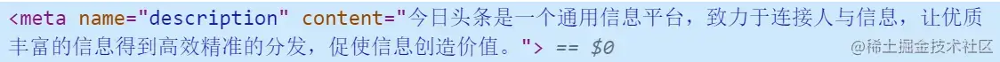
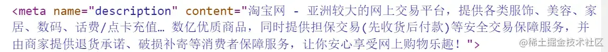
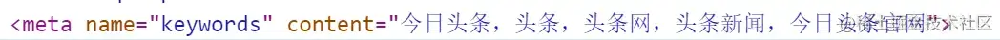
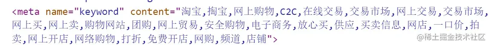
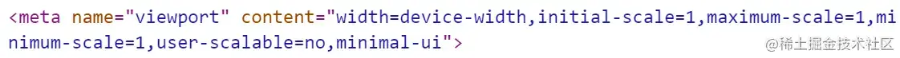
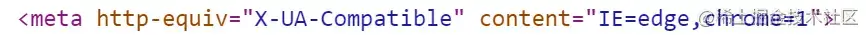
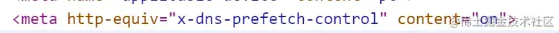

+++
title = "meta 标签"
date = '2024-11-05T00:00:00+08:00'
lastmod = '2024-11-06T00:00:00+08:00'
draft = true
weight = 7
tags = ["面试", "前端", "HTML", "meta 标签", "ecool"]
categories = ["前端开发", "面试"]
source = "https://fe.ecool.fun/knowledge-learn"
+++
## 概览

meta标签一般放在整个`html`页面的`head`部分，在`MDN`中对他这样定义：

> meta是**文档级元数据元素**，用来表示那些不能由其它 HTML 元相关元素（`<base>`、`<link>`, `<script>`、`<style>`或 `<title>`）之一表示的任何元数据。

是不是感觉看起来很抽象？说白了就是为了传达信息。

先看看`meta` 元素定义的元数据的类型：

- 如果设置了 `name`属性，`meta` 元素提供的是文档级别的元数据，应用于整个页面。
- 如果设置了 `http-equiv`属性，`meta` 元素则是编译指令，提供的信息与类似命名的 HTTP 头部相同。
- 如果设置了 `charset`属性，`meta` 元素是一个字符集声明，告诉文档使用哪种字符编码。
- 如果设置了 `itemprop` 属性，`meta` 元素提供用户定义的元数据。

## name属性

`name`和`content`一起使用，前者表示要表示的元数据的`名称`，后者是元数据的`值`。

### author

用来表示网页的作者的名字，例如某个组织或者机构。

```html
<meta name="author" content="aaa@mail.abc.com">
```

### description

是一段简短而精确的、对页面内容的描述。以头条和taobao的`description`标签为例：





### keywords

与页面内容相关的关键词，使用逗号分隔。某些搜索引擎在遇到这些关键字时，会用这些关键字对文档进行分类。 还是以头条和taobao为例





### viewpoint

为 viewport（视口）的初始大小提供指示。目前仅用于移动设备。

可能你也发现了，我们在`vscode`中自动生成`html`的代码片段时，会自动生成：

```html
<meta name="viewport" content="width=device-width, initial-scale=1.0">
```

`width`用来设置 viewport 的宽度为设备宽度;

`initial-scale`为设备宽度与 viewport 大小之间的缩放比例。



### robots

表示爬虫对此页面的处理行为，或者说，应当遵守的规则，是用来做搜索引擎抓取的。

它的`content`可以为：

1. `all`:搜索引擎将索引此网页，并继续通过此网页的链接索引文件将被检索
2. `none`:搜索引擎讲忽略此网页
3. `index`:搜索引擎索引此网页
4. `follow`:搜索引擎继续通过此网页的链接索引搜索其它的网页

### renderer

用来指定双核浏览器的渲染方式，比如360浏览器，我们可以通过这个设置来指定360浏览器的渲染方式

```html
<meta name="renderer" content="webkit"> //默认webkit内核
<meta name="renderer" content="ie-comp"> //默认IE兼容模式
<meta name="renderer" content="ie-stand"> //默认IE标准模式
```

## http-equiv

`http-equiv`也是和`content`一起使用，前者表示要表示的元数据的`名称`，后者是元数据的`值`。

`http-equiv` 所有允许的值都是特定 HTTP 头部的名称，

### X-UA-Compatible

我们最常见的`http-equiv`值可能就是`X-UA-Compatible`了，它常常长这个样子：



它是用来是做IE浏览器适配的。

`IE=edge`告诉浏览器，以当前浏览器支持的最新版本来渲染，IE9就以IE9版本来渲染。

`chrome=1`告诉浏览器，如果当前IE浏览器安装了`Google Chrome Frame`插件，就以chrome内核来渲染页面。

像上图这种两者都存在的情况：如果有chrome插件，就以chrome内核渲染，如果没有，就以当前浏览器支持的最高版本渲染。

另外，这个属性支持的范围是`IE8-IE11`

你可能注意到了，如果在我们的`http`头部中也设置了这个属性，并且和`meta`中设置的有冲突，那么哪一个优先呢？ 答案是：开发者偏好（`meta`元素）优先于Web服务器设置（HTTP头）。

### content-type

用来声明文档类型和字符集


### x-dns-prefetch-control

一般来说，HTML页面中的a标签会自动启用DNS提前解析来提升网站性能，但是在使用https协议的网站中失效了，我们可以设置：



来打开dns对a标签的提前解析

### cache-control、Pragma、Expires

和缓存相关的设置，但是遗憾的是这些往往不生效，我们一般都通过`http headers`来设置缓存策略

## 常见考点

### 1. **基本用法**

- **结构**：`<meta>` 标签没有闭合标签，通常包含 `name`、`http-equiv` 或 `charset` 属性来定义元数据。
- **示例**：<br>
```html
<meta charset="UTF-8">
<meta name="author" content="John Doe">
<meta name="description" content="This is a sample page.">
```

### 2. **`charset` 属性**

- **定义**：指定文档的字符编码。常用于指定 HTML 文档所使用的字符集，确保页面能够正确显示非 ASCII 字符。
- **常见值**：`UTF-8` 是最常用的字符编码。
- **示例**：<br>
```html
<meta charset="UTF-8">
```

### 3. **`name` 属性**

- **定义**：指定元数据的名称，通常用来描述页面的作者、描述、关键字等信息。
- **常见的 `name` 属性值**：<br>
  - `description`：页面描述。
  - `keywords`：页面关键词。
  - `author`：页面作者。
  - `viewport`：用于响应式设计，控制页面的缩放和布局。
- **示例**：<br>
```html
<meta name="description" content="This is a sample page for learning HTML.">
<meta name="keywords" content="HTML, CSS, JavaScript, Web Development">
<meta name="author" content="John Doe">
```

### 4. **`http-equiv` 属性**

- **定义**：模拟 HTTP 响应头，提供与 HTTP 标头类似的元数据。常用于设置页面的缓存策略、内容类型等。
- **常见的 `http-equiv` 属性值**：<br>
  - `Content-Type`：指定文档的 MIME 类型和字符集。
  - `refresh`：用于刷新页面或重定向页面。
  - `X-UA-Compatible`：指定浏览器的渲染模式。
- **示例**：<br>
```html
<meta http-equiv="Content-Type" content="text/html; charset=UTF-8">
<meta http-equiv="refresh" content="5;url=https://www.example.com">
<meta http-equiv="X-UA-Compatible" content="IE=edge">
```

### 5. **`viewport` 元标签**

- **定义**：用于响应式设计，指定视口的大小和缩放行为。通过设置视口宽度和缩放比例来优化移动设备上的显示效果。
- **常见属性**：<br>
  - `width`：设置视口的宽度。常用的值是 `device-width`，即设备屏幕的宽度。
  - `initial-scale`：设置页面初始的缩放比例。
  - `maximum-scale`：限制页面的最大缩放比例。
- **示例**：<br>
```html
<meta name="viewport" content="width=device-width, initial-scale=1">
```

### 6. **`robots` 元标签**

- **定义**：控制搜索引擎如何爬取和索引网页。通常用于指定搜索引擎是否能够索引页面内容、是否跟踪页面中的链接。
- **常见属性值**：<br>
  - `index, follow`：允许页面被索引，并允许爬虫跟踪页面中的链接。
  - `noindex, nofollow`：禁止页面被索引，并禁止跟踪链接。
  - `noarchive`：防止搜索引擎缓存页面。
- **示例**：<br>
```html
<meta name="robots" content="noindex, nofollow">
```

### 7. **`refresh` 属性**

- **定义**：设置页面自动刷新或重定向的时间间隔。通常用于需要定时更新页面内容或跳转到其他页面的场景。
- **示例**：<br>
```html
<meta http-equiv="refresh" content="10;url=https://www.example.com">
```

### 8. **`og` 和 `twitter` 元标签**

- **定义**：这些标签用于社交媒体平台，如 Facebook、Twitter 等，来控制页面的预览和分享内容。也称为 Open Graph 标签。
- **常见标签**：<br>
  - `og:title`：页面的标题。
  - `og:description`：页面的描述。
  - `og:image`：分享时显示的图像。
  - `twitter:card`：Twitter 卡片类型（如总结卡、图片卡等）。
- **示例**：<br>
```html
<meta property="og:title" content="Web Development">
<meta property="og:description" content="Learn web development using HTML, CSS, and JavaScript">
<meta property="og:image" content="image_url.jpg">
<meta name="twitter:card" content="summary_large_image">
```

### 9. **`apple-mobile-web-app-capable`**

- **定义**：控制 Web 应用是否在 iOS 设备上作为独立应用启动，消除浏览器界面元素（如地址栏）。
- **常见值**：<br>
  - `yes`：支持全屏显示，像本地应用一样运行。
  - `no`：显示浏览器界面元素。
- **示例**：<br>
```html
<meta name="apple-mobile-web-app-capable" content="yes">
```

### 10. **`theme-color`**

- **定义**：设置浏览器地址栏的颜色。用于优化移动端的用户体验，尤其是在 Android 和 Chrome 浏览器中。
- **示例**：<br>
```html
<meta name="theme-color" content="#4CAF50">
```

### 11. **`charset` 与 `UTF-8`**

- **重要性**：使用 UTF-8 编码，确保页面可以正确显示各种语言的字符。
- **最佳实践**：`<meta charset="UTF-8">` 应该是页面 `<head>` 部分的第一行，以确保字符编码的正确性。

### 12. **`icon` 和 `favicon`**

- **定义**：通过 `<meta>` 标签定义网站的图标，通常在浏览器标签栏显示，也可以作为移动设备上的快捷方式图标。
- **示例**：<br>
```html
<meta rel="icon" href="favicon.ico">
```

### 13. **`http-equiv="X-UA-Compatible"`**

- **定义**：告诉 Internet Explorer 使用最新的渲染引擎来呈现页面，避免使用较旧的兼容模式。
- **示例**：<br>
```html
<meta http-equiv="X-UA-Compatible" content="IE=edge">
```

### 14. **`Content-Security-Policy (CSP)`**

- **定义**：CSP 用于防止跨站脚本攻击（XSS）等安全问题。它通过指定允许加载资源的源来增加页面的安全性。
- **示例**：<br>
```html
<meta http-equiv="Content-Security-Policy" content="default-src 'self'">
```

### 15. **多语言网站的 `<meta>` 标签**

- **定义**：设置页面的语言，帮助搜索引擎和浏览器了解页面的语言类型，优化本地化内容。
- **示例**：<br>
```html
<meta http-equiv="Content-Language" content="en-US">
```
