+++
title = "输入 URL 到页面渲染完成"
date = '2024-11-05T00:00:00+08:00'
lastmod = '2024-11-06T00:00:00+08:00'
draft = true
weight = 24
tags = ["面试", "前端", "HTML", "输入 URL 到页面渲染完成", "ecool"]
categories = ["前端开发", "面试"]
source = "https://fe.ecool.fun/knowledge-learn"
+++
## 一、网站加载概述

面试过程中，常常遇到这样一道面试题，输入URL到页面加载完毕，浏览器做了哪些工作？

> 首先输入一个URL，你会看到浏览器上面的标签页出现了一个loading图标，开始时是逆时针旋转，接着顺时针旋转，当前页面消失，显示我们常说的空白页面，接着出现显示我们请求的新页面。此时如果网络很差，你有可能看到短暂的DOM页面，然后再看到渲染后的正常页面，这是从表面看到的加载过程，实际浏览器做的要多得多。

为什么浏览器这么多戏呢？直接显示不好吗，当然不行，就像喝粥，能直接吃米、喝水吗？

在用户输入URL到页面展示，浏览器要先向服务器获取前端资源，然后再将服务器返回的字节流转化成对应的页面，每一阶段都需要浏览器对应的能力进行处理的。

> 作为前端开发，了解整个过程其实很重要，只有知道了浏览器加载页面的整个过程，才能在开发中避免可能跳的坑，才能在发现问题后迅速定位问题，才能在性能优化时提出更多的解决方案。

比如下面问题，看了文章相信你就知道了为什么了

- 为什么会存在空白页面？(为了解决这个问题，各大厂都在实践各种方案）
- 为什么js要在Dom后面引入
- 为什么有个页面崩溃会导致多个页面崩溃
- 浏览器的缓存策略是怎样的？
- 为什么我们常常修改host就可以访问对应的域名
- 等等

## 二、浏览器的多进程架构

为了看懂下面的内容，这里必须要了解下现代浏览器的`多进程架构`，`进程`和`线程`的关系等知识点。

> 浏览器也是从单个进程架构一步步迭代到现代的多进程架构。

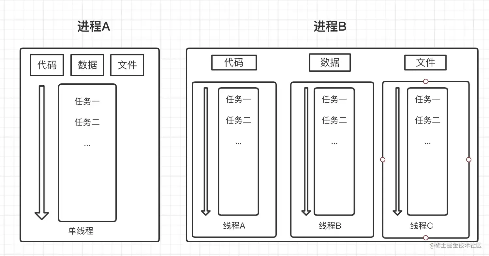

如上图，我们可以看到`线程`和`进程`的关系

- 通常一个程序实例就是一个进程，浏览器会为他分配内存空间。
- 一个进程间的数据是共享的，单线程就是一个进程包含一个线程，一个线程处理所有的任务
- 多线程就是，一个进程中包含多个线程可以同时执行任务，共享数据和内存
- 线程不能单独存在，必须依附于进程，一个线程失败，会导致进程执行失败，进程销毁，内存会被立即回收。

### 1、进程

下图是我们打开一个掘金首页后，再打开任务管理器，观察发现，此时浏览器包括的进程有很多，浏览器主进程，GPU进程，网络进程，存储进程，音频进程，渲染进程，多个插件进程。

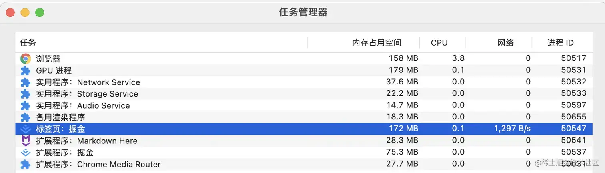

这些进程负责的功能如下：

| 进程 | 说明 |
| --- | --- |
| 浏览器进程 | 负责浏览器各个子进程的通信，处理浏览器界面，包括地址栏等 |
| 渲染进程 | 也就是我们看到的图中的标签页进程，也就是我们常说的浏览器内核，v8就在这个进程。主要负责解析html、js、css渲染页面等 |
| 网络进程 | 负责发起网络请求，解析返回头信息 |
| GUI进程 | 负责将渲染进程生成的图块转化成位图 |

渲染进程是运行在沙箱之中的，可以执行js，但是不能获取系统权限，和浏览器进程通过IPC通讯。这是为了保证浏览器进程的安全，锁进沙箱，即使有恶意代码，也不能突破沙箱读取或写入系统信息。

### 2、线程

通过上图，我们已经知道线程是不能独立存在的，必须依附于进程。这里我们主要关注下渲染进程，因为他的主要工作就是：完成页面的渲染和展示。

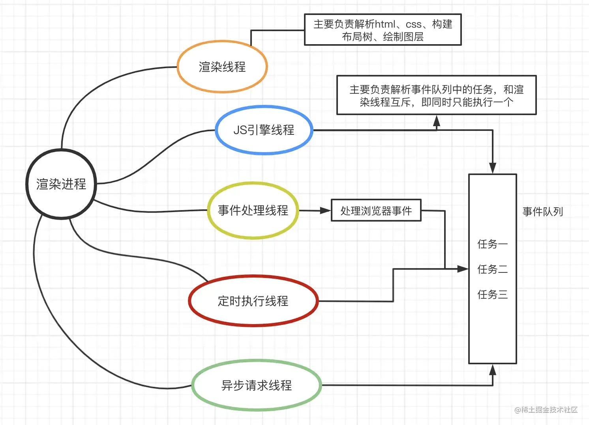

如图，我们可以看到渲染进程包括很多线程，除了图上展示的，还有合成线程等，各有各的作用，具体内容，我们将会在后面一章节，浏览器渲染原理分析中在来讨论。

## 三、浏览器请求的具体流程

从用户输入域名到浏览器渲染页面完成的过程，可以分为以下几个部分：

- 1、输入信息处理
- 2、网络请求
- 3、服务器返回请求资源
- 4、浏览器渲染

这里每一步涉及到的知识都非常多，其中缓存也在每个阶段占了很大比重，接着展开描述前三个阶段：

### 1、地址栏输入信息处理

当输入一个URL，浏览器会判断输入信息是检索信息还是请求URL

- 如果是检索的信息，就构建请求搜索的URL，调用浏览器默认的搜索引擎进行检索。
- 如果符合URL格式，浏览器主进程就通过IPC通信机制将URL发送给网络进程。

### 2、网络进程发起网络请求

1）网络进程首先会查找浏览器缓存，判断缓存是否存在，是否过期

- 如果存在且不过期，就直接返回缓存信息。具体的缓存策略可以接着看下面的[浏览器缓存策略](https://fe.ecool.fun/knowledge-learn#cache)

2）如果没有缓存或过期，就开始进行DNS解析

- DNS解析的过程也很复杂，最终目的就是拿到目标主机的IP地址，具体的解析过程可以看下面的域名解析

3）建立http连接或https连接

- http通过三次握手建立连接
- https需要建立TLS连接，浏览器会验证网站的数字证书是否合法，是否到期，是否安全等，这里https有自己的一套认证逻辑，我们重点不在这一块。
- 这里两个问题常被问到，不了解可以学习一下  
  - http和https的区别？
  - 简述三次握手、四次挥手？

4）发送请求

- 网络进程会构建http请求头，向服务器发送实际请求

5）网络传输，服务器处理，返回对应的资源

- 请求从应用层发出，经过运输层、网络层、物理层、数据链路层找到服务器，服务器拿到请求信息，返回对应的资源
- 这里的服务器可能是代理服务器，也可能是CDN节点，会判断当前数据是否存在缓存，如果有缓存且有效，直接返回（具体看配置的缓存策略），否则才会从服务器获取。
- 网络传输数据也是很复杂的过程，具体可以看下面简单的介绍[计算机网络体系模型](https://fe.ecool.fun/knowledge-learn#net)

### 3、服务器返回对应资源

1）处理返回信息

- 浏览器接收到服务器返回的资源信息，网络进程首先会解析返回的头信息，查看是否有Location字段，如果有的话，再次发起请求，很常见的就是请求http的站点，然后重定向到https。
- 如下图我们输入的是`http://www.taobao.com/`，接口返回307内部重定向，然后浏览器再次进行了请求`https//www.taobao.com/`

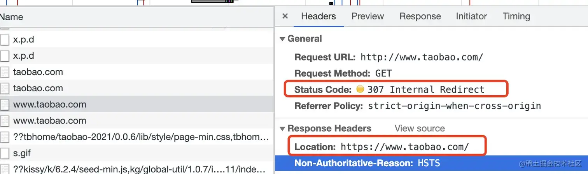

- 通过返回头字段`Content-Type`判断文件类型，如果其他类型，就调用不同的进程处理，如果是html类型，继续处理。

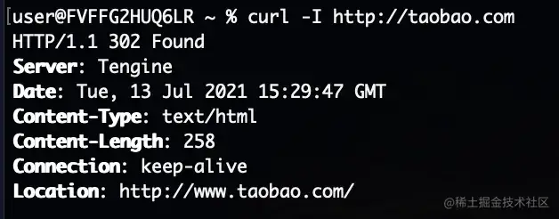

-  网络进程拿到返回的资源信息，会发送消息“提交导航”到浏览器主进程，浏览器主进程发送信息“提交文档”，提醒渲染进程准备接收返回的资源信息 
-  渲染进程和网络进程构建通道，接收资源信息，并发送消息“提交文档”给浏览器主进程，告诉浏览器主进程我准备好了，浏览器主进程开始刷新页面，url、安全等信息。 
-  此时页面将会触发`beforeunload`事件，在页面退出之前允许用户选择终止该流程（常应用于表单提交页面）。如果不监控该方法，浏览器就直接替换当前页面。 
-  然后在渲染线程绘制出页面的之前，页面将存在空白时间，这就是各个技术团队在攻克的技术点，怎样让空白时间最短，这个时间取决于当前页面渲染的时长，那么我们还是要了解下浏览器是如何渲染服务器返回的资源。 

8）四次挥手

资源传输完毕，断开连接

## 四、多个Tab页共用渲染进程

我们打开任务管理器，看到如下图所示

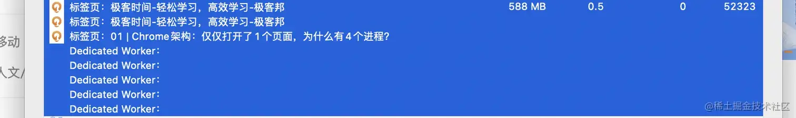

我们发现很多标签页都是单独的一个进程，但是其中一些标签页确是共用一个渲染进程，为什么会这样？

其实浏览器对于在当前站点打开的新Tab页面会做一些优化，如果他们同源，且执行环境相同，会直接复用当前站点的渲染进程。

这样就可以提高渲染的性能，也能让父窗口和子窗口建立关联，但这样也造成了一定的隐患

- 公用一个进程，如果当前进程中的一个线程出现问题，当前进程就会崩溃，公用同一个进程的页面也会崩溃。
- 如果有恶意脚本就可以攻击新打开的页面，在新打开的页面中我们可以通过`window.opener`获取父页面的操作权限

**如果没有关联**

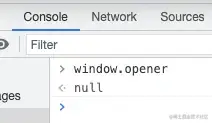

**如果有关联**

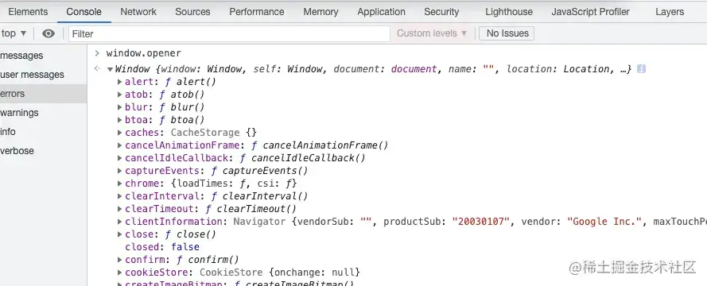

这就是我们现实中可能会遇到的一个页面奔溃，其他同源站点全部退出的现象。

那么这种共同使用一个渲染进程是如果出现的呢？在日常编码中我们常常有这三种方式：

### 1、a标签

一般情况下，项目中我们跳转采用a标签，如果调整的是同源页面，会出现

```ini
<a href="http://www.baidu.com"></a>
```

该方法使用最新版的谷歌测试发现，在当前页面内打开一个同源的站点，使用的是独立的进程，这和预期的不符合，后面会继续测试看看。

但是一般情况下，我们可以给a标签加上属性`rel="noopener norefferrer"`来保证不同页面使用不同的进程。

### 2、window.open

```javascript
window.open("http://www.baidu.com")
```

使用`window.open`打开相同站点，肯定会出现使用同一个渲染进程，如果要规避，就要增加如下代码，去除两者的关联

```ini
let newWin = window.open("http://my.dome.com")
newWin.opener = null
```

### 3、Iframe

页面中采用iframe框架引入其他页面，则iframe会独立成辅助框架，有自己的渲染进程，如果同源会采用同一个渲染进程。

## 五、网络请求

### 1、浏览器缓存策略

- 存储策略
- 强缓存
- 协商缓存

浏览器的缓存策略，有助于提高网页加载速度，减轻服务器压力。

具体缓存的过程如图：

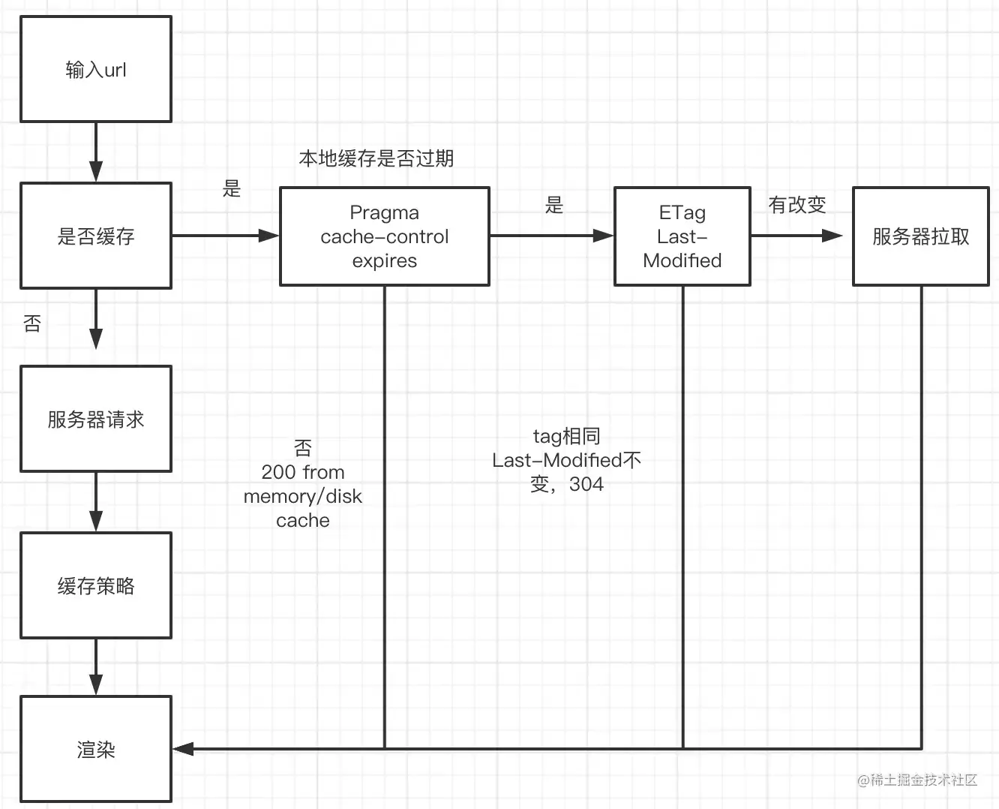

详细说明：

1、当我们输入url，浏览器会去查看自身是否有缓存，如果没有缓存会直接请求服务器获取资源，并缓存到浏览器一份，返回数据会携带`ETag`字段和`Last-Modified`字段，状态码200 OK（from memory cache）,

其中`ETag`是文件计算的hash值，如果文件不发生改变，这个值不会变。`Last-Modified`是文件最后的修改时间，如果文件更新或者覆盖就会显示最新的时间

2、如果浏览器有缓存，此时检查http的请求头，看cache-control、expires字段，判断是否过了缓存的有效期，如果没有过有效期，则返回200状态码和对应的缓存数据。

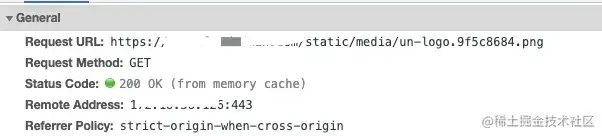

此时是强缓存

-  expires是http1.0的定义，返回一个绝对的时间GMT，为过期时间。这就导致如果服务器时间和浏览器时间不一致，可能会使缓存失效。 
-  cache-control是http1.1的定义，可以定义的值有  
  - max-age=600 表示最长有效期为600s
  - no-cache 不走浏览器缓存，每次都去浏览器协商缓存
  - no-store 每次都请求最新的资源
  - private 私有，只能在用户终端缓存，不能在cdn或代理服务器缓存
  - public 公有，可以在所有节点缓存
-  两者同时存在，cache-control优先级高 

3、如果浏览器缓存已过期，就携带请求头字段`If-None-Match`和`If-Modified-Since`去服务器拉取资源，服务器看到这两个字段，发现和当前服务器资源一致，就直接返回缓存和状态码304。服务器一般会先验证`If-None-Match/ETag`，如果不变，再去验证`If-Modified-Since/Last-Modified`

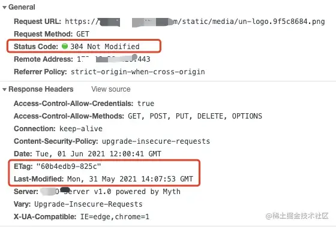

其中`If-Modified-Since`就是之前返回的`Last-Modified`，`If-None-Match`就是之前返回的`ETag`

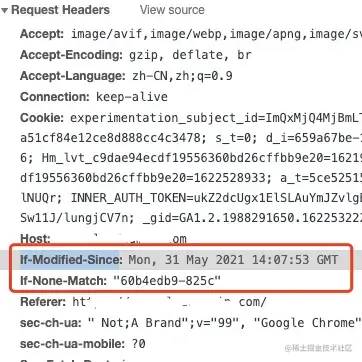

如果第一次请求，默认没有缓存，浏览器将会进行缓存，浏览器缓存的都是派生文件， 比如css、js、img等不常变动的文件，内存缓存肯定比较小，所以会缓存一下js，页面关闭就清空了，disk memory 会在的时间会久一点。

### 2、域名解析

DNS就是域名系统，作用是将域名解析成对应的IP地址。具体的解析过程

- 1、输入一个url，首先浏览器会对url进行解析，取出主机名
- 2、接着查找浏览器自身的DNS缓存，查到返回对应IP
- 3、没有找到，在本机找Host文件是否有对应的IP（host文件就是域名和ip的映射关系表），查到就返回IP
- 3、没有的话，本地DNS服务器开始查找，向各级的DNS服务器发送查询报文，获取对应的IP地址

在每次查找的过程中，浏览器，应用程序，DNS服务器都会对域名进行缓存，如果命中缓存，DNS会直接返回对应的IP，没有命中则继续查找相关的域名服务器，定位IP

客户端

客户端缓存

本机Host文件

本地DNS服务器

管理方DNS服务器

其他DNS服务器

顶层DNS服务器

根DNS服务器

分析可知这个阶段，我们能优化的方法有限，常见的做法有：

- 1、在html文件增加DNS缓存标签
- 2、通过将域名解析到多个IP，做DNS的负载均衡

```html
<link rel="dns-prefetch" href="//g.alicdn.com" />
```

上面代码，会预取`g.test.com`解析

```ini
<meta http-equiv="x-dns-prefetch-control" content="on">
```

上面代码，设置自动开启DNS解析功能

### 3、http请求过程

这里的网络请求，我们默认为http请求。

- 1、首先如果是第一次请求，域名经过DNS解析拿到映射的IP
- 2、这里客户端发送http报文给对应的服务器，这个过程中要经过应用层、运输层、网络层、数据链路层和物理层对数据报的层层处理
- 3、经过上一步的三次确认，也就是客户端和服务器（或代理服务器）进行三次握手建立TCP连接
- 4、然后服务器返回对应的资源给客户端
- 5、如果是第二次及以上的请求，浏览器或服务器会通过http的header参数，判断资源是否过期，如果没有过期，则使用缓存，如果过期，就去服务器拿新的资源

### 4、五层计算机体系模型

第二步，这里客户端发送http报文给对应的服务器，具体的过程为：

- 1、首先应用层提供了很多协议，包括：http、ftp、POP3、IMAP，这里浏览器使用的是http协议，首先浏览器会在应用层，把请求的数据报按照http协议要求的格式，定义一系列请求的字段，推进TCP套接字，等待运输层接收。
- 2、运输层主要的协议有：TCP和UDP，运输层拿到数据报以后，会先看是否和目的主机建立连接，如果没有，则进行三次握手，建立TCP连接。如果连接成功，会对数据报进一步封装，增加源主机端口号和目的主机端口号，进行差错检测，然后传递到网络层。
- 3、网络层主要协议有：IP协议，接收运输层的数据报，然后增加目的主机IP，封装成一段段符合IP协议的IP数据报，经过若干个路由到达数据链路层
- 4、数据链路层有ARP协议，可以通过IP地址解析目标地址的mac地址，通过物理层转发出去，到达目的局域网后，通过广播，被目的主机接收

## 六、服务器处理阶段

服务器获取请求，协商缓存查看资源是否有变化，如果没有变化返回缓存资源。

- CDN缓存

这里如果存在代理服务器或者CDN节点，那么相当于增加了一个缓存节点，首先请求会转发到最新的CDN节点，CDN节点收到请求后会判断当前资源是否过期`cache-control`，如果过期就回源请求最新的资源，如果没有过期就返回缓存资源。

CDN的存在解决了跨地域请求的时延问题；对服务器压力进行了分流。

四次挥手：如果请求结束，服务器和客户端进行四次握手，断开连接。

## 七、页面渲染阶段

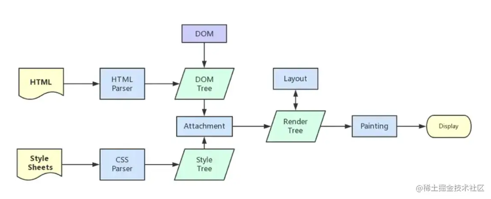

## 常见考点

- 浏览器为什么要进行url解析，编码规则是什么，如何解析
- 域名解析的过程，递归查询，迭代查询
- 网络请求三次握手、四次挥手原理，为什么要三次握手，两次不行吗
- 网络请求的过程，计算机网络体系
- ping的原理是什么
- http缓存的分类，强缓存和协商缓存、启发式缓存
- 如何设置http缓存
- http和https区别，不同版本的区别
- 浏览器的渲染原理、渲染顺序
- 页面渲染优化
- 什么是重绘和回流
- 三次握手、四次挥手
