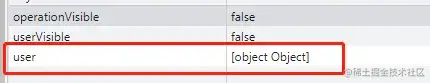
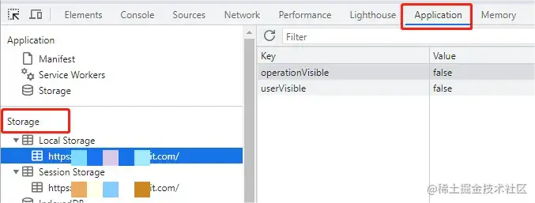
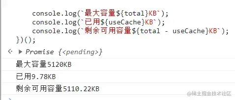
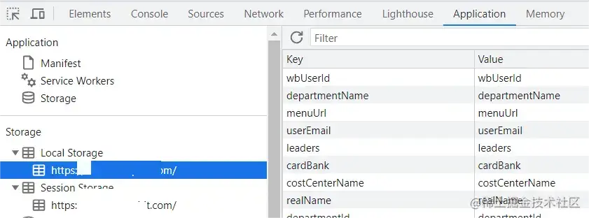
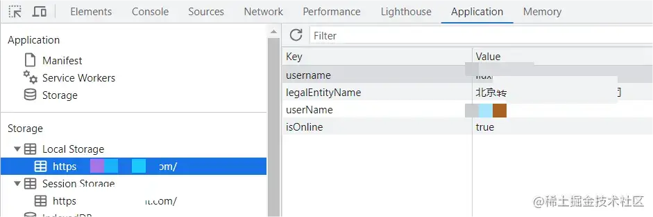
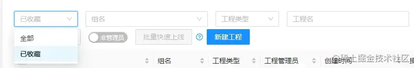
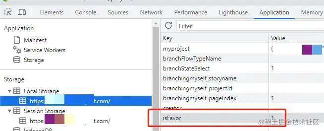
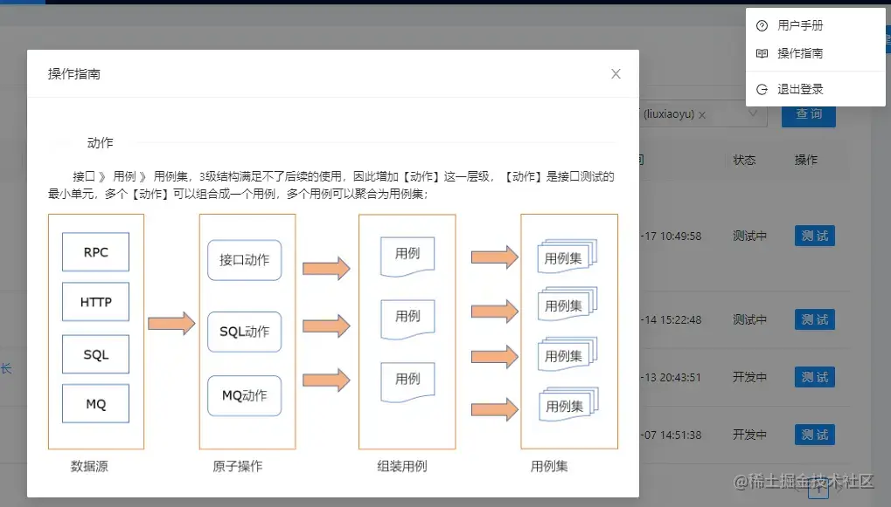

+++
title = "Web Storage"
date = '2024-10-09T00:00:00+08:00'
lastmod = '2024-11-06T00:00:00+08:00'
draft = true
weight = 11
tags = ["面试", "前端", "HTML", "Web Storage", "ecool"]
categories = ["前端开发", "面试"]
source = "https://fe.ecool.fun/knowledge-learn"
+++
## 一、 简介

浏览器本地存储是指浏览器提供的一种机制，允许 Web 应用程序在浏览器端存储数据，以便在用户下次访问时可以快速获取和使用这些数据。一共两种存储方式：localStorage 和 sessionStorage。下面介绍下两种缓存的特性和在内部平台的一些应用。

## 二、localStorage 和 sessionStorage

### 2.1、区别

localStorage 和 sessionStorage 的主要区别是生命周期，具体区别如下：

|  | localStorage | sessionStorage |
| --- | --- | --- |
| 生命周期 | 持久化存储：除非自行删除或清除缓存，否则一直存在 | 会话级别的存储：浏览器标签页或窗口关闭 |
| 作用域 | 相同浏览器，同域名，不同标签，不同窗口 | 相同浏览器，同域名，同源窗口 |
| 获取方式 | window.localStorage | window.sessionStorage |
| 存储容量 | 5M | 5M |

容量限制的目的是防止滥用本地存储空间，导致用户浏览器变慢。

### 2.2、浏览器兼容性

1）现在的浏览器基本上都是支持这两种 Storage 特性的。各浏览器支持版本如下：

|  | Chrome | Firefox | IE | Opera | Safari | Android | Opera Mobile | Safari Mobile |
| --- | --- | --- | --- | --- | --- | --- | --- | --- |
| localStorage | 4 | 3.5 | 8 | 10.5 | 4 | 2.1 | 11 | iOS 3.2 |
| sessionStorage | 5 | 2 | 8 | 10.5 | 4 | 2.1 | 11 | iOS 3.2 |

2）如果使用的是老式浏览器，比如Internet Explorer 6、7 或者其他，就需要在使用前检测浏览器是否支持本地存储或者是否被禁用。以 localStorage 为例：

```scss
if(window.localStorage){
  alert("浏览器支持 localStorage");
} else {
  alert("浏览器不支持 localStorage");
}
```

3）某些浏览器版本使用过程中，会出现 Storage 不能正常使用的情况，记得添加 try/catch。以 localStorage 为例：

```erlang
if(window.localStorage){
  try {
    localStorage.setItem("username", "name");
    alert("浏览器支持 localStorage");
  } catch (e) {
    alert("浏览器支持 localStorage 后不可使用");
  }
} else {
  alert("浏览器不支持 localStorage");
}
```

## 三、使用说明

### 3.1、API介绍

localStorage 和 sessionStorage 提供了相同的方法进行存储、检索和删除。常用的方法如下：

1. 设置数据：setItem(key, value)

存储的值可以是字符串、数字、布尔、数组和对象。对象和数组必须转换为 string 进行存储。JSON.parse() 和 JSON.stringify() 方法可以将数组、对象等值类型转换为字符串类型，从而存储到 Storage 中；

```javascript
localStorage.setItem("username", "name"); // "name"
localStorage.setItem("count", 1); // "1"
localStorage.setItem("isOnline", true); // "true"
sessionStorage.setItem("username", "name");
// user 存储时，先使用 JSON 序列化，否则保存的是[object Object]
const user = { "username": "name" };
localStorage.setItem("user", JSON.stringify(user));
sessionStorage.setItem("user", JSON.stringify(user));
```

eg：数据没有序列化，导致保存的数据异常

2. 获取数据：getItem(key)

如果 key 对应的 value 获取不到，则返回值是 null；

```ini
const usernameLocal = localStorage.getItem("username");
const usernameSession = sessionStorage.getItem("username");
// 获取到的数据为string，使用时反序列化数据
const userLocal = JSON.parse(localStorage.getItem("user"));
const userSession = JSON.parse(sessionStorage.getItem("user"));
```

3. 删除数据：removeItem(key)；

```javascript
localStorage.removeItem("username");
sessionStorage.removeItem("username");
```

4. 清空数据：clear()；

```ini
localStorage.clear();
sessionStorage.clear();
```

5. 在不确定是否存在 key 的情况下，可以使用 hasOwnProperty() 进行检查;

```ruby
localStorage.hasOwnProperty("userName"); // true
sessionStorage.hasOwnProperty("userName"); // false
```

6. 当然，也可以使用 Object.keys() 查看所有存储数据的键;

```css
Object.keys(localStorage); // ['username']
Object.keys(sessionStorage);
```

### 3.2、浏览器查看

本地存储的内容可以在浏览器中直接查看，以 Chrome 为例，按住键盘 F12 进入开发者工具后，选择 Application，然后就能在左边 Storage 列表中找到 localStorage 和 sessionStorgae。

### 3.3、监听

当存储的数据发生变化时，其他页面通过监听 storage 事件，来获取变更前后的值，以及根据值的变化来处理页面的展示逻辑。

JS 原生监听事件，只能够监听同源非同一个页面中的 storage 事件，如果想监听同一个页面的，需要改写原生方法，抛出自定义事件来监听。具体如下：

1. 监听同源非同一个页面

直接在其他页面添加监听事件即可。

eg：同域下的 A、B 两个页面，A 修改了 localStorage，B 页面可以监听到 storage 事件。

```javascript
window.addEventListener("storage", () => {
  // 监听 username 值变化
  if (e.key === "username") {
    console.log("username 旧值：" + e.oldValue + "，新值：" + e.newValue);
  }
})
```

注：

- 当两次 setItem 更新的值一样时，监听方法是不会触发的；
- storage 事件只能监听到 localStorage 的变化。

2. 监听同一个页面

重写 Storage 的 setItem 事件，同理，也可以监听删除事件 removeItem 和获取事件 getItem。

```ini
(() => {
  const originalSetItem = localStorage.setItem;
  // 重写 setItem 函数
  localStorage.setItem = function (key, val) {
    let event = new Event("setItemEvent");
    event.key = key;
    event.newValue = val;
    window.dispatchEvent(event);
    originalSetItem.apply(this, arguments);
  };
})();

window.addEventListener("setItemEvent", function (e) {
  // 监听 username 值变化
  if (e.key === "username") {
    const oldValue = localStorage.getItem(e.key);
    console.log("username 旧值：" + oldValue + "，新值：" + e.newValue);
  }
});
```

## 四、存储

浏览器默认能够存储 5M 的数据，但实际上，浏览器并不会为其分配特定的存储空间，而是根据当前浏览器的空闲空间来判断能够分配多少存储空间。

### 4.1、存储容量

可以使用 Storage 的 length 属性，对存储容量进行测算，以 localStorage 为例：

```javascript
let str = "0123456789";
let temp = "";
// 先生成一个 10KB 的字符串
while (str.length !== 10240) {
  str = str + "0123456789";
}
// 清空
localStorage.clear();
// 计算总量
const computedTotal = () => {
  return new Promise((resolve) => {
    // 往 localStorage 中累积存储 10KB
    const timer = setInterval(() => {
      try {
        localStorage.setItem("temp", temp);
      } catch (e) {
        // 报错说明超出最大存储
        resolve(temp.length / 1024);
        clearInterval(timer);
        // 统计完记得清空
        localStorage.clear();
      }
      temp += str;
    }, 0);
  });
};
// 计算使用量
const computedUse = () => {
  let cache = 0;
  for (let key in localStorage) {
    if (localStorage.hasOwnProperty(key)) {
      cache += localStorage.getItem(key).length;
    }
  }
  return (cache / 1024).toFixed(2);
};

(async () => {
  const total = await computedTotal();
  let use = "0123456789";
  for (let i = 0; i < 1000; i++) {
    use += "0123456789";
  }
  localStorage.setItem("use", use);
  const useCache = computedUse();

  console.log(`最大容量${total}KB`);
  console.log(`已用${useCache}KB`);
  console.log(`剩余可用容量${total - useCache}KB`);
})();
```

可见在 Chrome 浏览器下，localStorage 有 5M 容量。

### 4.2、存储性能

在某些特殊场景下，需要存储大数据，为了更好的利用 Storage 的存储空间，可以采取以下解决方案，但不应该过于频繁地将大量数据存储在 Storage 中，因为在写入数据时，会对整个页面进行阻塞（不推荐这种方式）。

1. 压缩数据

可以使用数据压缩库对 Storage 中的数据进行压缩，从而减小数据占用的存储空间。

eg：使用 lz-string 库的 compress() 函数将数据进行压缩，并将压缩后的数据存储到 localStorage 中。

```ini
const LZString = require("lz-string");
const data = "This is a test message";
// 压缩
const compressedData = LZString.compress(data);
localStorage.setItem("test", compressedData);
// 解压
const decompressedData = LZString.decompress(localStorage.getItem("test"));
```

2. 分割数据

将大的数据分割成多个小的片段存储到 Storage 中，从而减小单个数据占用的存储空间。

eg：将用户数据分割为单项存储到 localStorage 中。

```vbnet
for (const key in userInfo) {
  localStorage.setItem(key, userInfo[key]);
}
```



3. 取消不必要的数据存储

可以在代码中取消一些不必要的数据存储，从而减小占用空间。

eg：只存储用到的用户名、公司主体和后端所在环境字段信息。

```vbnet
for (const key in userInfo) {
  if (["userName", "legalEntityName", "isOnline"].includes(key)) {
    localStorage.setItem(key, userInfo[key]);
  }
}
```



4. 设置过期时间

localStorage 是不支持过期时间的，在存储信息过多后，会拖慢浏览器速度，也会因为浏览器存储容量不够而报错，可以封装一层逻辑来实现设置过期时间，以达到清理的目的。

```javascript
// 设置
function set(key, value){
  const time = new Date().getTime(); //获取当前时间
  localStorage.setItem(key, JSON.stringify({value, time})); //转换成json字符串
}
// 获取
function get(key, exp){
  // exp 过期时间
  const value = localStorage.getItem(key); 
  const valueJson = JSON.parse(value); 
  //当前时间 - 存储的创建时间 > 过期时间
  if(new Date().getTime() - valueJson.time > exp){
    console.log("expires"); //提示过期
  } else {
    console.log("value:" + valueJson.value);
  }
}
```

## 五、应用

### 5.1、使用习惯记录

用来缓存一些筛选项数据，保存用户习惯信息，起到避免多次重复操作的作用。

eg：在 beetle 工程列表中，展示了自已权限下所有 beetle 的项目，对于参与项目多和参与项目少的人，操作习惯是不同的，由此，记录收藏功能状态解决了这一问题，让筛选项记住用户选择，方便下次使用。



在开发使用中，直接获取 localStorage.getItem('isFavor') 作为默认值展示，切换后使用 localStorage.setItem() 方法更新保存内容。

```javascript
// 获取
const isFavor = localStorage.getItem('isFavor');
this.state = {
  isFavor: isFavor !== null ? Number(isFavor) : EngineeringTypeEnum.FAVOR,
};
// 展示默认值
<Form.Item name='isFavor' initialValue={this.state.isFavor}>
  <Select
    placeholder='筛选收藏的工程'
    onChange={(e) => this.changeFavor(e)}
    {...searchSmallFormProps}
  >
      {EngineeringTypeEnum.property.map(e => (<Option key={e.id} value={e.id}>{e.name}</Option>))}
  </Select>
</Form.Item>
// 变更
changeFavor = (e) => {
  localStorage.setItem('isFavor', e);
  this.setState({ isFavor: e });
};
```

### 5.2、首次打开提示

用来缓存用户导览，尤其是只需要出现一次的操作说明弹窗等。

eg：当第一次或者清空缓存后登录，页面需要出现操作指南和用户手册的弹窗说明。

在开发使用中，注意存储的数据类型为 string，转成布尔值是为了在插件中方便控制弹窗的显示隐藏。

```ini
// 获取
const operationVisible = localStorage.getItem('operationVisible');
this.state = {
  operationVisible: operationVisible === null || operationVisible === 'true' ? true : false,
};
// 控制展示
<Modal
  title='操作指南'
  open={this.state.operationVisible}
  onCancel={() => { 
    this.setState({ operationVisible: false }); 
    localStorage.setItem('operationVisible', false); 
  }}
  footer={null}
  destroyOnClose={true}
>
  <Divider orientation='left'>动作</Divider>
  <p>接口 》 用例 》 用例集，3级结构满足不了后续的使用，因此增加【动作】这一层级，【动作】是接口测试的最小单元，多个【动作】可以组合成一个用例，多个用例可以聚合为用例集；</p>
  <Image src={OperationGuidePng} preview={false} />
</Modal>
```

### 5.3、减少重复访问接口

在浏览页面时，会遇到一些经常访问但返回数据不更新的接口，这种特别适合用做页面缓存，只在页面打开的时候访问一次，其他时间获取缓存数据即可。

eg：在我们的一些内部系统中，用户信息是每个页面都要用到的，尤其是 userId 字段，会与每个获取数据接口挂钩，但这个数据是不会变的，一直请求是没有意义的，为减少接口的访问次数，可以将主要数据缓存在 localStorage 内，方便其他接口获取。

## 常见考点

面试中关于 **Web Storage** 的问题通常会从基础概念、API 使用、实际应用场景和安全性等多个角度考察。理解如何选择合适的存储机制、如何安全地存储数据，以及在不同的使用场景中应用 Web Storage，都是常见的考点。

考察点通常围绕以下几个方面展开：

### 1. **localStorage 与 sessionStorage 的区别**

- **localStorage**：数据没有过期时间，保存在用户关闭浏览器之后依然存在，除非用户手动清除。
- **sessionStorage**：数据仅在当前会话中有效，一旦关闭浏览器或页面，数据就会被清除。

**考点**：解释 localStorage 和 sessionStorage 的主要区别，以及如何选择它们。

### 2. **API 使用**

- **存储数据**：`localStorage.setItem(key, value)` 和 `sessionStorage.setItem(key, value)`
- **读取数据**：`localStorage.getItem(key)` 和 `sessionStorage.getItem(key)`
- **删除数据**：`localStorage.removeItem(key)` 和 `sessionStorage.removeItem(key)`
- **清空所有数据**：`localStorage.clear()` 和 `sessionStorage.clear()`

**考点**：编写代码片段演示如何使用 Web Storage API 存取、删除和清空数据。

### 3. **数据存储类型**

- **localStorage** 和 **sessionStorage** 只能存储字符串类型数据。
- 如果要存储复杂数据类型（如对象或数组），需要使用 `JSON.stringify()` 转换为字符串，取出时用 `JSON.parse()` 解析。

**考点**：如何处理非字符串类型的数据（如对象或数组）进行存储。

**示例**：

```javascript
const user = { name: "John", age: 30 };
localStorage.setItem("user", JSON.stringify(user));
const storedUser = JSON.parse(localStorage.getItem("user"));
```

### 4. **存储大小限制**

- **localStorage** 和 **sessionStorage** 每个域名的存储大小通常为 **5MB**，具体数值可能因浏览器而异。

**考点**：了解 Web Storage 的大小限制，以及如何处理超出存储空间的情况。

### 5. **浏览器兼容性**

- **localStorage** 和 **sessionStorage** 被现代主流浏览器广泛支持，但在早期浏览器（如 IE8 及之前）中可能不完全支持。

**考点**：了解 Web Storage 的浏览器兼容性问题，以及如何在不支持的浏览器中实现兼容性。

### 6. **与 Cookies 的比较**

- **Web Storage**：主要用于客户端存储，不会自动随着 HTTP 请求发送到服务器。
- **Cookies**：用于在客户端和服务器之间传递数据，会随着每次请求自动发送。
- **大小限制**：Cookies 通常限制为 4KB，而 Web Storage 的限制较大（通常为 5MB）。

**考点**：解释 Web Storage 和 Cookies 的区别，以及在什么场景下选择使用它们。

### 7. **安全性**

- **Web Storage** 没有跨域共享机制，数据只在同一域名下可用。
- 但是 Web Storage 仍然容易被 JavaScript 劫持或篡改，因此要确保使用 HTTPS，并妥善处理敏感信息。

**考点**：如何确保存储的数据安全，是否可以将敏感数据存储在 localStorage 中，以及有哪些潜在的安全风险（如 XSS 攻击）。

### 8. **事件监听**

- 使用 `storage` 事件监听 Web Storage 数据的变化。此事件在同一域的多个窗口或标签页之间共享数据时特别有用。

**考点**：如何使用 `window.addEventListener('storage', callback)` 监听 localStorage 的变化，并如何在跨标签页共享数据时处理。

**示例**：

```javascript
window.addEventListener('storage', (event) => {
    console.log('Storage key changed:', event.key);
});
```

### 9. **使用场景**

- **localStorage** 常用于长期保存用户偏好设置、主题颜色等持久化信息。
- **sessionStorage** 用于保存一次性数据或会话相关的状态，例如表单数据的临时保存。

**考点**：如何根据使用场景选择 localStorage 或 sessionStorage，并解释具体的使用场景。

### 10. **性能影响**

- 存储过大数据时，可能会导致页面性能下降，尤其是在大规模频繁访问数据的情况下。

**考点**：讨论 Web Storage 的性能影响，特别是在大量数据存储和读取时，如何优化性能。
