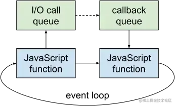
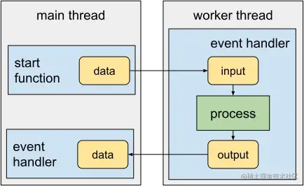
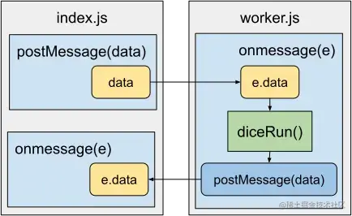

+++
title = "Web Workers"
date = '2024-10-16T00:00:00+08:00'
lastmod = '2024-11-06T00:00:00+08:00'
draft = true
weight = 16
tags = ["面试", "前端", "HTML", "Web Workers", "ecool"]
categories = ["前端开发", "面试"]
source = "https://fe.ecool.fun/knowledge-learn"
+++
在浏览器和服务器上，JavaScript程序在单个处理线程上运行。这意味着程序一次只能做一件事。简单来说，你的新电脑可能有32核的CPU，但当JavaScript应用程序运行时，其中31个核心都处于空闲状态。

JavaScript的单线程避免了复杂的并发情况。如果两个线程同时尝试进行不兼容的更改会发生什么？例如，一个浏览器可能在另一个线程重定向到新的URL并从内存中清除该文档时正在更新DOM。Node.js、Deno和Bun都继承了浏览器的单线程引擎。

这不是JavaScript特定的限制。大多数语言都是单线程的，但像PHP和Python这样的Web选项通常在Web服务器上运行，为每个用户请求启动解释器的新线程的不同实例。这会消耗资源，因此Node.js应用程序通常定义自己的Web服务器，该服务器在单个线程上运行，并异步处理每个传入的请求。

Node.js的方法在处理高流量负载时可能更高效，但长时间运行的JavaScript函数会消耗效率收益。

在我们演示如何使用Web Workers解决执行速度问题之前，我们首先要了解JavaScript的运行方式以及为什么长时间运行的函数会引发问题。

## JavaScript非阻塞I/O事件循环

你可能会认为一次只做一件事会导致性能瓶颈，但JavaScript是异步的，这就避免了大部分单线程处理问题，因为：

- 不需要等待用户在网页上点击按钮。 浏览器触发一个事件，当点击发生时调用JavaScript函数。
- 不需要等待Ajax请求的响应。 浏览器触发一个事件，在服务器返回数据时调用JavaScript函数。
- Node.js应用程序不需要等待数据库查询的结果。 运行时在数据可用时调用JavaScript函数。

JavaScript引擎运行一个事件循环。一旦代码的最后一条语句执行完毕，运行时会循环回来，检查是否有未完成的定时器、待处理的回调函数和数据连接，然后根据需要执行回调函数。 其他操作系统处理线程负责调用诸如HTTP请求、文件处理和数据库连接等输入/输出系统。它们不会阻塞事件循环。事件循环可以继续执行下一个在队列中等待的JavaScript函数。



实质上，JavaScript引擎的主要责任是运行JavaScript代码。操作系统处理所有其他可能导致引擎调用JavaScript函数的I/O操作。

## 长时间运行的JavaScript函数

JavaScript函数通常由事件触发。它们会进行一些处理，输出一些数据，并且大部分情况下会在毫秒级别内完成，以便事件循环可以继续运行。

不幸的是，一些长时间运行的函数可能会阻塞事件循环。想象一下，你正在开发自己的图像处理函数（如锐化、模糊、灰度化等）。异步代码可以从文件中读取（或写入）数百万字节的像素数据，这对JavaScript引擎影响很小。然而，处理图像的JavaScript代码可能需要几秒钟来计算每个像素。该函数会阻塞事件循环，直到它完成，其他JavaScript代码无法运行。

-  在浏览器中，用户将无法与页面进行交互。他们无法点击、滚动或输入，并且可能会看到一个“脚本无响应”的错误，其中有停止处理的选项。
-  对于Node.js服务器应用程序而言，情况更糟糕。在函数执行时，它无法响应其他请求。如果函数需要花费10秒钟来完成，那么在那个时间点访问的每个用户都必须等待最多10秒钟，即使他们没有处理图像。

你可以通过将计算拆分为较小的子任务来解决这个问题。下面的代码使用传递的imageFn函数，最多处理1,000个像素（从一个数组中）。然后，它使用1毫秒的setTimeout延迟调用自身。事件循环的阻塞时间较短，这样JavaScript引擎可以在迭代之间处理其他传入的事件：

```js
// pass callback function, image processing function, and input image
// return an output image to a callback function
function processImage( callback, imageFn = i => {}, imageIn = [] ) {

  const chunkSize = 1000; // pixels to process per iteration

  // process first chunk
  let
    imageOut = [],
    pointer = 0;

  processChunk();

  // process a chunk of data
  function processChunk() {

    const pointerEnd = pointer + chunkSize;

    // pass chunk to image processing function
    imageOut = imageOut.concat(
      imageFn( imageIn.slice( pointer, pointerEnd ) )
    );

    if (pointerEnd < imageIn.length) {

      // process next chunk after a short delay
      pointer = pointerEnd;
      setTimeout(processChunk, 1);

    }
    else if (callback) {

      // complete - return output image to callback function
      callback( null, imageOut );

    }

  }

}
```

这种方法可以防止脚本无响应，但不总是切实可行的。单个执行线程仍然会执行所有的工作，即使CPU可能有更多的处理能力。为了解决这个问题，我们可以使用Web Workers。

## Web Workers

Web Workers允许脚本在后台线程中运行。Worker在自己的引擎实例和事件循环中运行，与主执行线程分开。它可以并行执行，而不会阻塞主事件循环和其他任务。

使用Worker脚本的步骤如下：

1. 主线程通过消息将所有必要的数据发送出去。
2. Worker中的事件处理程序执行，并开始计算。
3. 完成后，Worker通过消息将返回的数据发送回主线程。
4. 主线程中的事件处理程序执行，解析传入的数据，并采取必要的操作。



主线程或任何Worker都可以创建任意数量的Worker。多个线程可以并行处理不同的数据块，以比单个后台线程更快地确定结果。然而，每个新线程都有启动开销，因此确定最佳平衡可能需要一些实验。

所有浏览器、Node.js 10+、Deno和Bun都支持类似的Worker语法，尽管服务器运行时可以提供更高级的选项。

## 专用Worker vs 共享Worker

专用Worker（Dedicated Worker）和共享Worker（Shared Worker）是Web Worker API中的两种不同类型的工作线程。它们在如何被创建、使用和共享资源方面有所不同。

专用Worker是只能被单个文档使用的工作线程。它们由特定的脚本文件创建，只能被创建它们的文档访问。专用Worker在创建之后，将与创建它的文档独立运行，可以在后台进行复杂的计算和处理，而不会阻塞主线程的运行。专用Worker之间是相互独立的，彼此不能共享数据或通信。

共享Worker是可以被多个文档共享使用的工作线程。它们由一个脚本文件创建，并可以被多个文档同时连接和使用。共享Worker可以与多个文档进行通信和共享数据，使得多个文档可以协同工作和共享计算资源。共享Worker可以用于创建集中式的消息传递系统，以便多个文档之间进行数据交换和通信。

总的来说，专用Worker适用于需要为单个文档创建独立计算线程的场景，而共享Worker适用于需要在多个文档之间共享计算资源和进行协同工作的场景。选择使用哪种类型的工作线程取决于具体的应用需求和设计架构。

## Client-side Worker限制

客户端工作线程（Client-side Worker）是在浏览器中运行的JavaScript线程，用于在后台执行计算密集型任务，以避免阻塞主线程。然而，客户端工作线程也有一些限制，包括以下几点：

1. 同源策略：客户端工作线程受到同源策略的限制，即只能与同源的脚本进行通信。这意味着客户端工作线程只能与与其来源相同的脚本进行交互，无法直接与其他域的脚本进行通信。
2. 无法访问DOM：客户端工作线程不能直接访问或操作浏览器的DOM（文档对象模型）。这是为了避免多线程操作DOM引发的潜在竞态条件和不确定性。如果需要操作DOM，可以通过与主线程进行通信来委托主线程执行相关操作。
3. 无法访问某些API：客户端工作线程无法直接访问一些浏览器API，如`window`对象、`document`对象、`alert()`函数等。这些功能只能通过与主线程进行通信来间接访问。
4. 不是所有浏览器都支持：尽管现代浏览器普遍支持客户端工作线程，但并不是所有浏览器都支持该功能。一些旧版本的浏览器可能不支持或提供有限支持。

需要注意的是，虽然客户端工作线程有一些限制，但它们仍然是在浏览器中进行并行计算的有用工具。合理使用客户端工作线程，可以提高Web应用程序的性能和响应能力，特别是在处理大量数据或复杂计算时。

## 如何使用 client-side web worker

以下演示将src/index.js定义为主要脚本，当用户点击开始按钮时，它会启动时钟并启动Web Worker。它通过定义一个Worker对象，使用src/worker.js的脚本名称（相对于HTML文件）来指定工作线程脚本：

```js
// run on worker thread
const worker = new Worker("./src/worker.js");
```

接下来是一个onmessage事件处理程序。当工作线程向主脚本发送数据时（通常是计算完成时），此处理程序将运行。数据可以在事件对象的data属性中获得，并将其传递给endDiceRun()函数：

```js
worker.onmessage = function(e) {
  endDiceRun(e.data);
};
```

主要脚本使用`postMessage()`方法启动工作线程，并发送数据（一个名为`cfg`的对象）：

```js
worker.postMessage(cfg);
```

在`src/worker.js`中定义了工作线程的代码。它使用`importScripts()`方法导入了`src/dice.js`脚本，`importScripts()`是一个全局的工作线程方法，用于同步地将一个或多个脚本导入到工作线程中。文件引用是相对于工作线程所在位置的：

```js
importScripts('./dice.js');
```

`src/dice.js`定义了一个`diceRun()`函数来计算骰子投掷的统计数据：

```js
function diceRun(runs = 1, dice = 2, sides = 6) {
  const stat = [];

  while (runs > 0) {
    let sum = 0;

    for (let d = dice; d > 0; d--) {
      sum += Math.floor(Math.random() * sides) + 1;
    }
    stat[sum] = (stat[sum] || 0) + 1;
    runs--;
  }

  return stat;
}
```

> 请注意这不是ES模块

在`src/worker.js`中，定义了一个`onmessage()`事件处理程序。当主调脚本（`src/index.js`）向工作线程发送数据时，此处理程序将运行。事件对象具有一个`data`属性，该属性提供对消息数据的访问。在这种情况下，它是一个包含`.throws`、`.dice`和`.sides`属性的`cfg`对象，这些属性将作为参数传递给`diceRun()`函数：

```js
onmessage = function(e) {

  // start calculation
  const cfg = e.data;
  const stat = diceRun(cfg.throws, cfg.dice, cfg.sides);

  // return to main thread
  postMessage(stat);

};
```

多线程处理发生在主脚本和工作线程之间通过消息传递的过程中：

1. 主脚本定义了一个Worker对象并调用`postMessage()`方法发送数据。
2. 工作线程执行了一个`onmessage`事件处理程序，该处理程序开始进行计算。
3. 工作线程调用`postMessage()`方法将数据发送回主脚本。
4. 主脚本执行一个`onmessage`事件处理程序来接收结果。

通过这种方式，主脚本和工作线程之间可以进行数据交换和通信，主脚本可以将任务委托给工作线程来并行执行计算密集型的操作。工作线程在完成计算后，将结果发送回主脚本，主脚本可以继续处理返回的结果。

这种消息传递机制使得在Web应用程序中可以实现多线程处理，提高了性能和响应能力，同时避免了阻塞主线程的情况。



## Web worker错误处理

现代浏览器的开发者工具支持对Web Worker进行调试和控制台日志输出，就像对任何标准脚本一样。这使得我们可以更方便地调试和监控Web Worker的执行。

此外，主脚本可以随时调用`terminate()`方法来结束工作线程。如果工作线程在特定时间内未响应，这样做可能是必要的。例如，以下代码在工作线程未在十秒内收到响应时终止活动的工作线程：

```js
// main script
const worker = new Worker('./src/worker.js');

// terminate worker after 10 seconds
const workerTimer = setTimeout(() => worker.terminate(), 10000);

// worker complete
worker.onmessage = function(e) {

  // cancel termination
  clearTimeout(workerTimer);

};

// start worker
worker.postMessage({ somedata: 1 });
```

工作线程脚本可以使用标准的错误处理技术，例如验证传入的数据、try-catch-finally块和throw语句，以优雅地处理问题，并在必要时向主脚本报告。

你可以使用以下方式在主脚本中检测未处理的工作线程错误：

- `onmessageerror`：当工作线程接收到无法反序列化的数据时触发。
- `onerror`：当工作线程脚本发生JavaScript错误时触发。

返回的事件对象提供了错误的详细信息，包括`.filename`、`.lineno`和`.message`属性：

```js
worker.onerror = function(err) {
  console.log(`${ err.filename }, line ${ err.lineno }: ${ err.message }`);
}
```

## 客户端 Web Worker 和 ES 模块

浏览器的 Web Worker 默认不支持 ES 模块（使用 export 和 import 语法的模块）。

在 `src/dice.js` 文件中，定义了一个需要在工作线程中导入的单个函数。由于浏览器的 Web Worker 不支持 ES 模块，因此你不能直接使用 export 和 import 语法将该函数导入到工作线程中。

取而代之的是，你需要使用 `importScripts()` 函数将整个脚本导入到工作线程中：

```js
importScripts('./dice.js');
```

如果你将 `src/dice.js` 的代码包含在 `src/index.js` 脚本中，并且想要在工作线程和非工作线程处理中都使用它，确实可以将其作为 HTML 的 `<script>` 元素加载。

下面是一个示例，展示了如何在 `src/index.js` 模块中将 `src/dice.js` 代码作为 HTML 的 `<script>` 元素加载：

```js
const diceScript = document.createElement('script');
diceScript.src = './src/dice.js';
document.head.appendChild(diceScript);
```

在大多数应用程序中，除非需要在主脚本和工作线程脚本之间共享代码库，否则不太可能出现这种情况。

如果你想在工作线程中支持 ES6 模块，确实可以在 worker 构造函数中添加 `{ type: "module" }` 参数。以下是一个示例：

```js
const worker = new Worker('./src/worker.js', { type: 'module' });
```

通过使用 `export` 关键字，你可以将 `diceRun()` 函数导出为一个模块，使得其他脚本可以导入并使用它。

```js
export function diceRun(runs = 1, dice = 2, sides = 6) {
  //...
}
```

然后，在需要使用 `diceRun()` 函数的地方，可以使用 `import` 语句来导入它。例如，在 `src/worker.js` 中：

```js
import { diceRun } from './dice.js';
```

理论上，ES6 模块是一个很好的选择，但不幸的是，它们只在基于 Chromium 的浏览器中从版本 80 开始（于 2020 年发布）得到支持。你无法在 Firefox 或 Safari 中使用它们，这使得它们对于这里所展示的示例代码来说并不实用。

更好的选择是使用像 esbuild 或 Rollup.js 这样的打包工具。这些工具可以解析 ES 模块的引用，并将它们打包成一个单独的工作线程（和主脚本）JavaScript 文件。这简化了编码过程，并具有让工作线程明显更快的好处，因为它们在执行之前不需要解析导入。

以下是如何使用打包工具来打包工作线程代码的大致概述：

1. 使用你选择的打包工具（如 esbuild 或 Rollup.js）设置项目。
2. 配置打包工具以处理工作线程代码中的 ES 模块导入。
3. 使用打包工具构建项目，它会生成一个打包后的 JavaScript 文件。
4. 在主脚本或 HTML 文件中引用打包后的 JavaScript 文件。

通过打包工作线程代码，你可以克服浏览器环境中 ES6 模块的限制，并确保在不同浏览器中具有更广泛的兼容性。

请参考你选择的特定打包工具的文档，了解如何设置和配置它以打包工作线程代码的更详细说明。

## Client-side service workers

客户端服务工作线程（Client-side service workers）是一种在浏览器中运行的脚本，用于提供离线缓存、推送通知等功能。它们是在 Web Worker 的基础上构建的，主要用于在后台处理一些与用户界面无关的任务。

客户端服务工作线程可以通过拦截网络请求，并缓存和返回响应，来实现离线缓存。这意味着即使用户处于离线状态，他们仍然可以访问之前缓存的资源。此外，客户端服务工作线程还可以用于实现推送通知功能，向用户发送推送消息。

使用客户端服务工作线程的好处包括：

- 离线访问：用户可以在离线状态下访问之前缓存的内容。
- 快速加载：由于缓存的存在，页面可以更快地加载和呈现。
- 推送通知：可以向用户发送推送通知，即使用户不在当前打开的网页上。

需要注意的是，客户端服务工作线程仅在支持的浏览器中可用，并且需要使用 HTTPS 协议才能正常工作。此外，使用客户端服务工作线程需要一定的学习和开发成本，因为它们涉及到注册、安装和管理服务工作线程等概念。

总结起来，客户端服务工作线程是一种强大的浏览器功能，可以提供离线访问和推送通知等功能，但使用它们需要考虑浏览器兼容性和一些技术细节。

## 服务端 Web Worker 演示

Node.js 是最常用的服务器端 JavaScript 运行时，自版本 10 起就提供了工作线程（workers）。 然而，Node.js 并不是唯一的服务器端运行时：

- Deno 复制了 Web Worker API，因此其语法与浏览器代码完全相同。它还提供了兼容模式，可以模拟 Node.js API，如果你想使用该运行时的工作线程语法。
- Bun 目前处于测试阶段，虽然打算支持浏览器和 Node.js 的工作线程 API。

此外，你可能会使用像 AWS Lambda、Azure Functions、Google Cloud Functions、Cloudflare Workers、Netlify Edge Functions 等 JavaScript 无服务器服务。这些服务可能提供类似于 Web Worker 的 API，尽管好处较少，因为每个用户请求都会启动一个独立的隔离实例。

以下演示展示了一个 Node.js 进程，每秒将当前时间输出到控制台：

```bash
timer process 12:33:18 PM
timer process 12:33:19 PM
timer process 12:33:20 PM
NO THREAD CALCULATION STARTED...
┌─────────┬──────────┐
│ (index) │  Values  │
├─────────┼──────────┤
│    2    │ 2776134  │
│    3    │ 5556674  │
│    4    │ 8335819  │
│    5    │ 11110893 │
│    6    │ 13887045 │
│    7    │ 16669114 │
│    8    │ 13885068 │
│    9    │ 11112704 │
│   10    │ 8332503  │
│   11    │ 5556106  │
│   12    │ 2777940  │
└─────────┴──────────┘
processing time: 2961ms
NO THREAD CALCULATION COMPLETE

timer process 12:33:24 PM
```

完成后，相同的计算将在工作线程上启动。在这种情况下，时钟继续运行，同时进行骰子处理：

```bash
WORKER CALCULATION STARTED...
timer process 12:33:27 PM
timer process 12:33:28 PM
timer process 12:33:29 PM
┌─────────┬──────────┐
│ (index) │  Values  │
├─────────┼──────────┤
│    2    │ 2778246  │
│    3    │ 5556129  │
│    4    │ 8335780  │
│    5    │ 11114930 │
│    6    │ 13889458 │
│    7    │ 16659456 │
│    8    │ 13889139 │
│    9    │ 11111219 │
│   10    │ 8331738  │
│   11    │ 5556788  │
│   12    │ 2777117  │
└─────────┴──────────┘
processing time: 2643ms
WORKER CALCULATION COMPLETE

timer process 12:33:30 PM
timer process 12:33:31 PM
timer process 12:33:32 PM
```

工作进程通常比主线程快一点。

## 如何使用server-side web worker

这个演示定义了 `src/index.js` 作为主要脚本，当服务器接收到新的 HTTP 请求时，它会启动一个计时器进程（如果它尚未运行）。

```js
// timer
timer = setInterval(() => {
  console.log(`  timer process ${ intlTime.format(new Date()) }`);
}, 1000);
```

`runWorker()` 函数定义了一个 `Worker` 对象，它使用位于 `src/worker.js` 的工作线程脚本的名称（相对于项目根目录）。它将 `workerData` 变量作为一个单一的值传递，该值在这种情况下是一个具有三个属性的对象。

在这个示例中，`workerData` 对象的三个属性是：

- `start`: 计时器的起始时间，用于计算经过的时间。
- `duration`: 计时器的持续时间，即需要计时的时长。
- `message`: 在计时完成后发送给主线程的消息。

这些属性可以在 `src/worker.js` 脚本中使用，用于执行计时任务并将结果发送回主线程。

你可以根据自己的需求修改和扩展 `workerData` 对象的属性，以适应更复杂的计时任务或其他工作线程任务。

```js
const worker = new Worker("./src/worker.js", {
  workerData: { throws, dice, sides }
});
```

与浏览器的 Web Worker 不同，这里直接启动了脚本，而不需要运行 `worker.postMessage()`。不过你可以使用该方法来运行工作线程中定义的 `parentPort.on("message")` 事件处理程序。

`src/worker.js` 中的代码使用 `workerData` 的值调用 `diceRun()`，并通过 `parentPort.postMessage()` 将结果传递回主线程：

```js
// worker thread
import { workerData, parentPort } from "node:worker_threads";
import { diceRun } from "./dice.js";

// start calculation
const stat = diceRun(workerData.throws, workerData.dice, workerData.sides);

// post message to parent script
parentPort.postMessage(stat);
```

这将在主要的 `src/index.js` 脚本中触发一个 "message" 事件，用于接收结果。

```js
worker.on("message", result => {
  console.table(result);
});
```

在上述示例中，我们通过 `parentPort.postMessage()` 向主线程发送一个消息，然后调用 `parentPort.close()` 来终止工作线程。这将触发 "exit" 事件。

```js
worker.on("exit", code => {
  //... clean up
});
```

你可以根据需要定义其他错误处理程序和事件处理程序：

- `messageerror`：当工作线程接收到无法反序列化的数据时触发。
- `online`：当工作线程开始执行时触发。
- `error`：当工作线程脚本中发生 JavaScript 错误时触发。

## Inline worker scripts

一个脚本文件可以同时包含主线程和工作线程的代码。代码可以使用 `isMainThread` 来检查是否在主线程上运行，然后将自身作为工作线程进行调用（使用 `import.meta.url` 作为 ES 模块中的文件引用，或者使用 CommonJS 中的 `__filename`）。

```js
import { Worker, isMainThread, workerData, parentPort } from "node:worker_threads";

if (isMainThread) {

  // main thread
  // create a worker from this script
  const worker = new Worker(import.meta.url, {
    workerData: { throws, dice, sides }
  });

  worker.on("message", msg => {});
  worker.on("exit", code => {});

}
else {

  // worker thread
  const stat = diceRun(workerData.throws, workerData.dice, workerData.sides);
  parentPort.postMessage(stat);

}
```

个人而言，我更倾向于将主线程和工作线程的代码分开放置在不同的文件中，因为它们可能需要不同的模块。内联工作线程可能适用于简单的、只有一个脚本的项目。

将主线程和工作线程的代码分开放置在不同的文件中有助于保持代码的组织和模块化。这样做可以提高代码的可读性、可维护性，并且使不同部分的代码更易于独立开发和测试。

然而，在某些简单的项目中，如果代码库较小且不涉及复杂的模块依赖关系，使用内联工作线程也是一种选择。这可以减少文件数量并简化项目的结构。

总之，个人偏好可以根据项目的特点和需求来决定如何组织主线程和工作线程的代码，无论是将它们分开放在不同文件中，还是使用内联工作线程。

## 服务器端工作线程的限制

服务器端工作线程是一种在服务器端环境中运行的并行执行的 JavaScript 线程。尽管服务器端工作线程提供了并行处理任务的能力，但仍然存在一些限制需要注意。

1. 资源限制：服务器端工作线程在执行期间消耗 CPU、内存和其他系统资源。如果同时执行的工作线程过多或任务过于密集，可能会导致服务器资源不足，影响整体性能。
2. 安全性限制：由于服务器端工作线程可以执行任意 JavaScript 代码，需要谨慎处理输入数据以防止安全漏洞。特别是当工作线程处理来自不可信源的数据时，必须进行严格的输入验证和过滤，以防止代码注入等攻击。
3. 文件系统限制：服务器端工作线程可以访问文件系统，但需要小心处理文件操作。在并行执行的环境中，多个工作线程同时访问和修改文件可能导致竞态条件和数据损坏。必要时，应使用同步或异步的文件访问方式，并采取适当的锁定机制来保护共享资源。
4. 定时器限制：服务器端工作线程可以使用定时器函数（如 `setTimeout` 或 `setInterval`）来执行定时任务。然而，需要注意定时器的资源消耗和精度问题。过多的定时器或过短的时间间隔可能会导致性能问题或不准确的定时器触发。
5. 线程间通信限制：在服务器端工作线程之间进行通信时，需要小心处理数据传递和同步问题。工作线程之间的消息传递可能会有一定的开销，并且需要注意避免竞态条件和数据不一致性。

## 线程间的数据共享

在线程之间共享数据是多线程编程中的一个常见需求。在服务器端工作线程中，也可以使用一些机制来实现线程间的数据共享。

以下是一些在线程之间共享数据的常见机制：

1. 共享内存：可以使用共享内存来在多个线程之间共享数据。在 Node.js 中，可以使用 SharedArrayBuffer 和 Atomics API 来实现共享内存。通过这种方式，多个线程可以访问和修改同一块内存区域，但需要小心处理并发访问和同步问题，以避免竞态条件和数据不一致性。
2. 消息传递：另一种常见的方式是使用消息传递来在线程之间传递数据。可以使用 postMessage 方法在主线程和工作线程之间发送消息，并通过监听 message 事件来接收消息。这种方式可以确保数据的安全性，因为每个消息都是独立的，不会存在并发访问的问题。
3. 共享对象：可以创建一个包含共享数据的对象，并将其传递给不同的线程。不同的线程可以通过引用共享对象来访问和修改数据。然而，需要注意避免并发修改同一共享对象的问题，可以使用互斥锁（例如 Mutex）或其他同步机制来保护共享对象的访问。

在选择合适的数据共享机制时，需要考虑线程安全性、性能、复杂性等因素。根据具体的场景和需求，选择适合的数据共享方式，并确保正确处理并发访问和同步问题，以确保数据的一致性和可靠性。

上面显示的主线程和工作线程之间的通信会导致数据在两个线程之间进行克隆。可以使用表示固定长度原始二进制数据的 SharedArrayBuffer 对象在线程之间共享数据。以下是一个示例代码，主线程定义了从 0 到 99 的 100 个数字元素，并将其发送给工作线程：

```js
import { Worker } from "node:worker_threads";

const
  buffer = new SharedArrayBuffer(100 * Int32Array.BYTES_PER_ELEMENT),
  value = new Int32Array(buffer);

value.forEach((v,i) => value[i] = i);

const worker = new Worker("./worker.js");

worker.postMessage({ value });
```

Worker可以接收值对象。

```ini
import { parentPort } from 'node:worker_threads';

parentPort.on("message", value => {
  value[0] = 100;
});
```

在这种情况下，无论是主线程还是工作线程都可以更改值数组中的元素，并且在两个线程之间都会发生变化。

这种技术的效率提升有一些好处，因为在任何一个线程中都不需要对数据进行序列化。但也存在一些缺点：

1. 只能共享整数类型的数据，无法直接共享其他类型的数据。
2. 仍然需要发送消息来指示数据已更改，以便通知其他线程。
3. 存在两个线程同时更改同一值且失去同步的风险。需要注意并发访问和同步的问题，以避免数据不一致性。

尽管存在这些缺点，但对于需要处理大量图像或其他数据的高性能游戏等场景，这种技术仍然可能带来一些好处。

需要根据具体的应用场景和需求来权衡使用这种技术的利弊，确保在多线程环境下处理数据时保持数据的一致性和正确性。

## Node.js Worker 的替代方案

并非每个 Node.js 应用程序都需要或可以使用工作线程。一个简单的 Web 服务器应用程序可能没有复杂的计算需求。它仍然在单个处理线程上运行，并且随着活跃用户数量的增加，响应性可能会降低。设备可能有更多的处理能力，拥有多个未使用的 CPU 核心。

以下部分描述了一些通用的多线程选项：

1. Worker Threads（工作线程）：Node.js 提供了 Worker Threads 模块，允许在应用程序中创建额外的工作线程。工作线程可以执行计算密集型任务，或者用于并行处理 I/O 操作。这对于需要处理复杂计算或 I/O 密集型任务的应用程序非常有用。
2. Cluster 模块：Cluster 模块是 Node.js 内置的模块，用于创建多个工作进程（而不是线程）以利用多核处理器的能力。每个工作进程都可以独立处理请求，并通过共享端口实现负载均衡。这对于需要处理大量并发请求的 Web 服务器等应用程序非常有用。
3. Child Processes（子进程）：Node.js 提供了 Child Processes 模块，允许在应用程序中创建子进程来执行独立的任务。子进程可以与主进程进行通信，并在需要时将结果返回给主进程。这对于需要执行独立任务的应用程序非常有用，例如执行外部命令或运行其他应用程序。

需要根据具体的应用需求和场景选择合适的多线程选项。每种选项都有其适用的场景和优势。使用工作线程、Cluster 模块或子进程，可以充分利用多核处理器的能力，提高应用程序的性能和响应能力。

## Node.js子进程

在 Node.js 中，子进程在工作线程之前得到支持，而且 Deno 和 Bun 都具有类似的功能。实质上，它们可以启动另一个应用程序（不一定是 JavaScript），传递数据并接收结果。它们的操作方式与工作线程类似，但通常效率较低，资源消耗较高。

当你需要运行复杂的 JavaScript 函数时，最好使用工作线程 - 这通常在同一个项目中。而当你需要启动另一个应用程序时，比如 Linux 命令或 Python 脚本，子进程则是必要的。

工作线程适用于在 Node.js 环境中运行的 JavaScript 代码，允许并行执行计算密集型任务或处理 I/O 操作。与主线程共享内存，效率高，适合处理复杂计算或 I/O 密集型任务。

而子进程适用于与其他应用程序进行交互，它们在外部启动并与主进程进行通信。子进程可以启动其他编程语言编写的应用程序或执行系统命令。这对于需要调用其他语言或执行外部命令的情况非常有用。

## Node.js clustering

Node.js 的集群模块允许您派生任意数量的相同进程，以更高效地处理负载。初始主进程可以派生自身 - 可能是根据 os.cpus() 返回的每个 CPU 派生一次。它还可以处理实例失败时的重启，并在派生的进程之间进行通信。

集群标准库提供了一些属性和方法，包括：

- .isPrimary：对于主要的主进程返回 true（也支持旧的 .isMaster）
- .fork()：派生子工作进程
- .isWorker：对于工作进程返回 true

以下示例为设备上每个可用的 CPU/核心启动一个 Web 服务器工作进程。一个 4 核的机器将派生四个 Web 服务器实例，以处理多达四倍的处理负载。它还会重新启动任何失败的进程，使应用程序更加健壮：

```js
// app.js
import cluster from 'node:cluster';
import process from 'node:process';
import { cpus } from 'node:os';
import http from 'node:http';

const cpus = cpus().length;

if (cluster.isPrimary) {

  console.log(`Started primary process: ${ process.pid }`);

  // fork workers
  for (let i = 0; i < cpus; i++) {
    cluster.fork();
  }

  // worker failure event
  cluster.on('exit', (worker, code, signal) => {
    console.log(`worker ${ worker.process.pid } failed`);
    cluster.fork();
  });

}
else {

  // start HTTP server on worker
  http.createServer((req, res) => {

    res.writeHead(200);
    res.end('Hello!');

  }).listen(8080);

  console.log(`Started worker process:  ${ process.pid }`);

}
```

所有进程共享端口 8080，并且任何进程都可以处理传入的 HTTP 请求。运行应用程序时的日志显示如下：

```bash
$ node app.js
Started primary process: 1001
Started worker process:  1002
Started worker process:  1003
Started worker process:  1004
Started worker process:  1005

...etc...

worker 1002 failed
Started worker process:  1006
```

很少有 Node.js 开发人员尝试集群。上面的示例很简单并且运行良好，但是当您尝试处理消息、故障和重新启动时，代码可能会变得越来越复杂。

## Process managers

一个 Node.js 进程管理器可以帮助运行多个 Node.js 应用程序实例，而无需手动编写集群代码。其中最著名的是 PM2。以下命令会为每个 CPU/核心启动一个应用程序实例，并在它们失败时进行重启：

```bash
pm2 start ./app.js -i max
```

应用程序实例在后台启动，因此非常适合在实时服务器上使用。可以通过输入 `pm2 status` 检查哪些进程正在运行（显示了简短的输出）：

```bash
$ pm2 status

┌────┬──────┬───────────┬─────────┬─────────┬──────┬────────┐
│ id │ name │ namespace │ version │ mode    │ pid  │ uptime │
├────┼──────┼───────────┼─────────┼─────────┼──────┼────────┤
│ 1  │ app  │ default   │ 1.0.0   │ cluster │ 1001 │ 4D     │
│ 2  │ app  │ default   │ 1.0.0   │ cluster │ 1002 │ 4D     │
└────┴──────┴───────────┴─────────┴─────────┴──────┴────────┘
```

PM2 还可以运行用 Deno、Bun、Python 或任何其他语言编写的非 Node.js 应用程序。

## Container Managers

容器管理器（Container Managers）是用于管理和编排容器化应用程序的工具。它们负责在容器集群中部署、扩展和监控容器。

以下是一些常见的容器管理器：

1. Docker Swarm：Docker Swarm 是 Docker 的原生容器编排和管理工具。它允许您将多个 Docker 主机组成一个集群，并使用 Swarm 调度器在集群中部署和管理容器。
2. Kubernetes（K8s）：Kubernetes 是一个开源的容器编排平台，用于自动化部署、扩展和管理容器化应用程序。它提供了强大的容器调度、服务发现、自动伸缩和故障恢复功能。
3. Apache Mesos：Apache Mesos 是一个通用的集群管理器，可以有效地共享计算资源并在大规模集群中运行各种工作负载，包括容器化应用程序。Mesos 提供了高度灵活的资源分配和调度机制。

这些容器管理器提供了丰富的功能，如容器调度、自动扩展、服务发现、负载均衡、故障恢复和监控。它们使得在分布式环境中部署和管理容器化应用程序更加简单和可靠。

需要根据具体的需求和场景选择适合的容器管理器，并利用其功能来简化容器化应用程序的管理和运维工作。

## 小结

JavaScript 工作线程可以通过在并行线程中运行 CPU 密集型计算来改善客户端和服务器上的应用程序性能。服务器端的工作线程还可以通过在单独的线程中运行更危险的函数，并在处理时间超过一定限制时终止它们来使应用程序更加健壮。

在 JavaScript 中使用工作线程相对简单，但有一些注意事项：

- 工作线程无法访问所有的 API，例如浏览器的 DOM。它们最适合用于长时间运行的计算任务。
- 对于密集但异步的 I/O 任务，例如 HTTP 请求和数据库查询，工作线程的必要性较低。
- 启动一个工作线程会有一定的开销，因此可能需要一些实验来确保它们能改善性能。
- 与服务器端多线程相比，一些选项如进程和容器管理可能是更好的选择。

尽管如此，当遇到性能问题时，工作线程是一个值得考虑的有用工具。

## 常见考点

### 1. **Web Workers 的基本概念**

- **定义**：Web Workers 是运行在后台的独立线程，允许在不阻塞主线程的情况下执行脚本代码。
- **类型**：常见的有 **Dedicated Workers**（专用 Workers，单页面使用）和 **Shared Workers**（共享 Workers，多个页面或同源脚本共享）。

### 2. **如何创建和使用 Web Worker**

- **Worker 创建**：<br>
  - 通过 `new Worker()` 创建 Worker 线程，传入一个 JavaScript 文件的路径作为参数。
```javascript
const worker = new Worker('worker.js');
```
- **消息通信**：<br>
  - 主线程通过 `postMessage()` 向 Worker 发送消息，Worker 通过 `onmessage` 事件处理消息并返回处理结果：
```javascript
// 主线程
worker.postMessage('Hello Worker!');
worker.onmessage = function(event) {
    console.log('Received from worker:', event.data);
};

// worker.js
self.onmessage = function(event) {
    console.log('Received from main thread:', event.data);
    self.postMessage('Message received');
};
```

### 3. **Web Workers 的特性**

- **异步执行**：Web Workers 运行在独立线程中，与主线程并行，不会阻塞主线程的 UI 渲染或事件处理。
- **不共享上下文**：Worker 没有访问 DOM、window、document 等浏览器对象的权限，运行在独立的全局作用域中（`self` 对象）。
- **通信机制**：主线程与 Worker 通过 `postMessage()` 传递消息，消息是通过串行化传递的，数据不会共享，而是复制。
- **支持的 API**：Worker 支持的 API 有 `XMLHttpRequest`、`fetch`、`setTimeout`、`setInterval`、`WebSockets`、`importScripts()`，但不支持 DOM 操作。

### 4. **Web Workers 的使用场景**

- **CPU 密集型任务**：如复杂的数学计算、大量数据处理、图片和视频处理等，可以放到 Worker 中执行，避免主线程被阻塞。
- **异步数据处理**：如后台处理 API 响应、大型 JSON 解析、加密解密等任务，保证 UI 的流畅性。
- **离线应用中的数据同步**：通过 Web Workers 处理离线数据的同步与缓存，保证数据一致性。

### 5. **Web Workers 与多线程的区别**

- **Worker 是单线程的**：每个 Web Worker 是独立的单线程，多个 Worker 可以并行执行任务，但 Worker 本身并没有真正的多线程能力（不会共享状态）。
- **多 Worker 协作**：可以通过创建多个 Worker 实现伪多线程，通过消息传递共享数据。

### 6. **Shared Worker 的特点**

- **共享 Worker 线程**：不同的浏览器窗口、iframe 等在同一页面中可以共享一个 Worker 线程，适用于跨多个页面协作的场景。
- **通信方式**：与专用 Worker 类似，但不同页面之间可以通过 `MessagePort` 进行通信。

### 7. **Worker 中的错误处理**

- **主线程错误处理**：主线程可以通过 `onerror` 事件捕获 Worker 中的错误。

```javascript
worker.onerror = function(error) {
    console.log('Error in worker:', error.message);
};
```

- **Worker 内的错误捕获**：Worker 内部可以使用 try-catch 捕获代码执行中的错误。

### 8. **Web Workers 的生命周期管理**

- **终止 Worker**：可以通过 `terminate()` 方法在主线程中手动终止 Worker。

```javascript
worker.terminate();
```

- **自动销毁**：Worker 执行完成后不会自动销毁，仍然可以保持活跃等待进一步的消息，因此需要手动管理 Worker 的生命周期以释放资源。

### 9. **Web Workers 的性能优化**

- **线程开销**：创建 Worker 线程有一定的开销，过多的 Worker 可能会增加性能负担，尤其是在短时间内频繁创建和销毁 Worker 的场景。
- **消息传递的成本**：由于消息是通过拷贝传递的，大量数据传递会带来性能开销。可以通过使用 **Transferable Objects** 来优化数据传输。

### 10. **Transferable Objects**

- **特点**：Transferable Objects 允许直接将数据的所有权转移给 Worker，而不是复制数据。常用于 ArrayBuffer 等大数据传输的场景，提升性能。

```javascript
let buffer = new ArrayBuffer(1024);
worker.postMessage(buffer, [buffer]);
```

### 11. **Service Workers 与 Web Workers 的区别**

- **作用不同**：Web Workers 用于在后台执行计算密集型任务，主要是数据处理；Service Workers 则用于控制网络请求、缓存管理、离线支持等。
- **生命周期不同**：Service Workers 在用户首次访问页面时注册后一直存在，即使关闭页面也能继续运行；而 Web Workers 只在页面活跃时存在。

### 12. **Web Workers 的兼容性**

- 需要了解 Web Workers 在不同浏览器中的兼容性，尤其是在移动端或旧版本浏览器中的支持情况。

### 13. **Worker 线程中的模块化脚本加载**

- **importScripts()**：Web Workers 支持使用 `importScripts()` 同步加载外部脚本，考察点可能包括如何使用该方法来分割代码或动态加载代码。

```javascript
importScripts('script1.js', 'script2.js');
```

### 14. **Worker 内的 API 支持**

- **支持的 API**：如 Web Workers 支持的部分 API（如 `fetch`、`WebSockets`、`setTimeout`、`XMLHttpRequest`），如何在 Worker 内使用这些 API。
- **不支持的 API**：如 DOM 操作、`alert()` 等不支持的操作，考察点可能包括 Worker 的使用限制。
