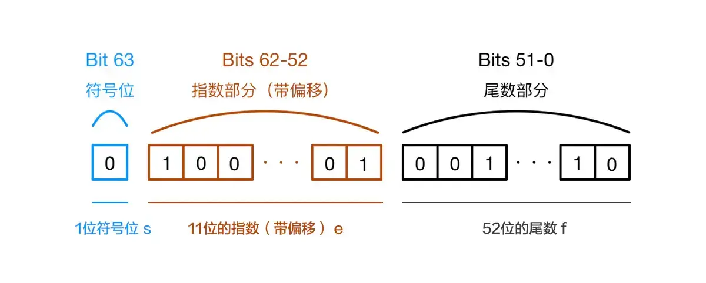
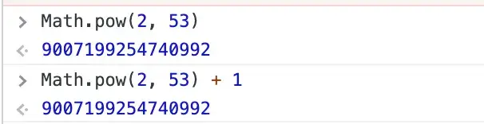
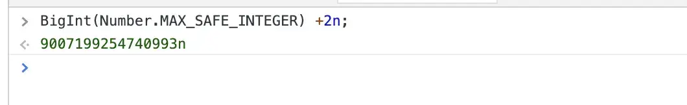

+++
title = "数据类型"
date = '2024-10-01T00:00:00+08:00'
lastmod = '2025-07-16T00:00:00+08:00'
draft = true
weight = 1
tags = ["面试", "前端", "JavaScript", "数据类型", "ecool"]
categories = ["前端开发", "面试"]
source = "https://fe.ecool.fun/knowledge-learn"
+++
## 前言

> 请讲下 `JavaScript` 中的数据类型？

前端面试中，估计大家都被这么问过。

答：`Javascript` 中的数据类型包括原始类型和引用类型。其中原始类型包括 `Null`、`Undefined`、`Boolean`、`String`、`Symbol`、`BigInt`。引用类型指的是 `Object`。

没错，我也是这么回答的，只是这通常是第一个问题，由这个问题可以引出很多很多的问题，比如

- `Null` 和 `Undefined` 有什么区别？前端的判空有哪些需要注意的？
- `typeof null` 为什么是 `object`?
- 为什么 `ES6` 要提出 `Symbol`？
- `BigInt` 解决了什么问题？
- 为什么 `0.1 + 0.2 !== 0.3?` 你如何解决这个问题？
- 如何判断一个值是数组？
- ...

## 弱类型语言

因为 `JavaScript` 是弱类型语言或者说是动态语言。这意味着你不需要提前声明变量的类型，在程序运行的过程中，类型会被自动确定，也就是说你可以使用同一个变量保存不同类型的值

```javascript
var foo = 42;  // foo is a Number now
foo = "bar";  // foo is a String now
foo = true;   // foo is a Boolean now
```

这一特性给我们带来便利的同时，也给我们带来了很多的类型错误。试想一下，假如 `JS` 说是强类型语言，那么各个类型之间没法转换，也就有了一层隔阂或者说一层保护，会不会更加好维护呢？——这或许就是 `TypeScript` 诞生的原因。

对 `JavaScript` 的数据类型掌握，是一个前端最基本的知识点

## null 还是 undefined

### 定义

`undefined` 表示未定义的变量。`null` 值表示一个空对象指针。

> 追本溯源: 一开始的时候，`JavaScript` 设计者 `Brendan Eich` 其实只是定义了 `null`，`null` 像在 `Java` 里一样，被当成一个对象。但是因为 `JavaScript` 中有两种数据类型：原始数据类型和引用数据类型。`Brendan Eich` 觉得表示"无"的值最好不是对象。

所以 `Javascript` 的设计是 **null是一个表示"无"的对象，转为数值时为0；undefined是一个表示"无"的原始值，转为数值时为NaN。**

```javascript
Number(null)
// 0

5 + null
// 5

Number(undefined)
// NaN

5 + undefined
// NaN
```

### Null 和 Undefined 的区别和应用

**null表示"没有对象"，即该处不应该有值。**，典型的用法如下

1. 作为函数的参数，表示该函数的参数不是对象。
2. 作为对象原型链的终点。

```javascript
Object.getPrototypeOf(Object.prototype)
// null
```

**undefined表示"缺少值"，就是此处应该有一个值，但是还没有定义**。典型用法是：

1. 变量被声明了，但没有赋值时，就等于 `undefined`。
2. 调用函数时，应该提供的参数没有提供，该参数等于`undefined`。
3. 对象没有赋值的属性，该属性的值为 `undefined`。
4. 函数没有返回值时，默认返回 `undefined`。

```javascript
var i;
i // undefined

function f(x){console.log(x)}
f() // undefined

var  o = new Object();
o.p // undefined

var x = f();
x // undefined
```

### 判空应该注意什么？

`javaScript` 五种空值和假值，分别为 undefined，null，false，""，0

这有时候很容易导致一些问题，比如

```javascript
let a = 0;
console.log(a || '/'); // 本意是只要 a 为 null 或者 Undefined 的时候，输出 '/'，但实际上只要是我们以上的五种之一就输出 '/'
```

当然我们可以写成

```javascript
let a = 0;
if (a === null || a === undefined) {
  console.log('/');
} else {
  console.log(a);
}
```

始终不是很优雅，所以 ES规范 提出了空值合并操作符（??）

> 空值合并操作符（??）是一个逻辑操作符，当左侧的操作数为 null 或者 undefined 时，返回其右侧操作数，否则返回左侧操作数。

上面的例子可以写成：

```javascript
let a = 0;
console.log(a??'/'); // 0
```

## typeof null——JS 犯的错

```javascript
typeof null // "object"
```

`JavaScript` 中的值是由一个表示类型的标签和实际数据值表示的。第一版的 `JavaScript` 是用 32 位比特来存储值的，且是通过值的低 1 位或 3 位来识别类型的，对象的类型标签是 000。如下

- 1：整型（int）
- 000：引用类型（object）
- 010：双精度浮点型（double）
- 100：字符串（string）
- 110：布尔型（boolean）

但有两个特殊值：

- undefined，用整数−2^30（负2的30次方，不在整型的范围内）
- null，机器码空指针（C/C++ 宏定义），低三位也是000

由于 `null` 代表的是空指针（低三位也是 `000` `），因此，null` 的类型标签是 `000`，`typeof null` 也因此返回 "object"。

这个算是 `JavaScript` 设计的一个错误，但是也没法修改，毕竟修改的话，会影响目前现有的代码

## Number——0.1+0.2 !== 0.3

### 现象

在 `JavaScript` 会存在类似如下的现象

```javascript
0.1 + 0.2
0.30000000000000004
```

### 原因

我们在对浮点数进行运算的过程中，需要将十进制转换成二进制。十进制小数转为二进制的规则如下：

> 对小数点以后的数乘以2，取结果的整数部分（不是1就是0），然后再用小数部分再乘以2，再取结果的整数部分……以此类推，直到小数部分为0或者位数已经够了就OK了。然后把取的整数部分按先后次序排列

根据上面的规则，最后 0.1 的表示如下：

> 0.000110011001100110011（0011无限循环）……

所以说，精度丢失并不是语言的问题，而是浮点数存储本身固有的缺陷。

`JavaScript` 是以 `64` 位双精度浮点数存储所有 `Number` 类型值，按照 `IEEE754` 规范，0.1 的二进制数只保留 52 位有效数字，即

> 1.100110011001100110011001100110011001100110011001101 * 2^(-4)

同理，0.2的二进制数为

> 1.100110011001100110011001100110011001100110011001101 * 2^(-3)

这样在进制之间的转换中精度已经损失。运算的时候如下

```javascript
0.00011001100110011001100110011001100110011001100110011010
+0.00110011001100110011001100110011001100110011001100110100
=0.01001100110011001100110011001100110011001100110011001110
```

所以导致了最后的计算结果中 0.1 + 0.2 !== 0.3

### 如何解决

- 将数字转成整数

```javascript
function add(num1, num2) {
  const num1Digits = (num1.toString().split('.')[1] || '').length;
  const num2Digits = (num2.toString().split('.')[1] || '').length;
  const baseNum = Math.pow(10, Math.max(num1Digits, num2Digits));
  return (num1 * baseNum + num2 * baseNum) / baseNum;
}
```

- 类库

`NPM` 上有许多支持 `JavaScript` 和 `Node.js` 的数学库，比如 `math.js`，`decimal.js`,`D.js` 等等

- ES6

`ES6` 在 `Number` 对象上新增了一个极小的常量——`Number.EPSILON`

```javascript
Number.EPSILON
// 2.220446049250313e-16
Number.EPSILON.toFixed(20)
// "0.00000000000000022204"
```

引入一个这么小的量，目的在于为浮点数计算设置一个误差范围，如果误差能够小于 `Number.EPSILON`，我们就可以认为结果是可靠的。

```javascript
function withinErrorMargin (left, right) {
  return Math.abs(left - right) < Number.EPSILON
}
withinErrorMargin(0.1+0.2, 0.3)
```

### 未来的解决方案——[TC39 Decimal proposal](https://link.segmentfault.com/?enc=3bFjkwlQjsVHUQTVZ2R96w%3D%3D.BI2C%2FsW0zAzKRid7UPhHSMdHmcMgTmtZgsKi7T%2FCoQuFkkFiln92%2BtpJ%2F9LDBUljTRE1sSyaH6F64GxUoTd7kF75iQyU2NZD8Xi%2BNjIGDFs%3D)

目前处于 `Stage 1` 的提案。后文提到的 `BigInt` 扩展的是 `JS` 的正数边界，超过 2^53 安全整数问题。`Decimal` 则是解决JS的小数问题-2^53。这个议案在JS中引入新的原生类型：`decimal`(后缀m)，声明这个数字是十进制运算。

```javascript
let zero_point_three = 0.1m + 0.2m;
assert(zero_point_three === 0.3m);
// 提案中的例子
function calculateBill(items, tax) {
  let total = 0m;
  for (let {price, count} of items) {
    total += price * BigDecimal(count);
  }
  return BigDecimal.round(total * (1m + tax), {maximumFractionDigits: 2, round: "up"});
}

let items = [{price: 1.25m, count: 5}, {price: 5m, count: 1}];
let tax = .0735m;
console.log(calculateBill(items, tax));
```

### 拓展——浮点数在内存中的存储

所以最终浮点数在内存中的存储是什么样的呢？`EEE754` 对于浮点数表示方式给出了一种定义

> (-1)^S *M* 2^E
>
> 各符号的意思如下：S，是符号位，决定正负，0时为正数，1时为负数。M，是指有效位数，大于1小于2。E，是指数位。



Javascript 是 64 位的双精度浮点数，最高的 1 位是符号位S，接着的 11 位是指数E，剩下的 52 位为有效数字M。

## BigInt——突破最大的限制

`JavaScript` 的 `Number` 类型为 [双精度IEEE 754 64位浮点](https://en.wikipedia.org/wiki/Floating-point_arithmetic)类型。  
 在 JavaScript 中最大的值为 `2^53`。



`[BigInt](https://link.segmentfault.com/?enc=AHcJ3RFIuOe9hpnBrVz%2Bsg%3D%3D.4YPpYPK76xX%2BYyrmbyiMuwPt%2BT%2BOIxdUDaWznETB%2BJ5GdyvU6p2DnCb8nHwn%2F9r6BzyxpEdhFGaiyTM4VZQgM5HxblzptkE%2FANLs%2BDm3%2FvzKWUqIgpY44pN9aRxar%2F8v)` 任意精度数字类型，已经进入stage3规范。`BigInt` 可以表示任意大的整数。要创建一个 `BigInt` ，我们只需要在任意整型的字面量上加上一个 n 后缀即可。例如，把123 写成 123n。这个全局的 BigInt(number) 可以用来将一个 Number 转换为一个 BigInt，言外之意就是说，BigInt(123) === 123n。现在让我来利用这两点来解决前面我们提到问题：



## Symbol——我是独一无二最靓的仔

### 定义

ES6 引入了一种新的原始数据类型 `Symbol`，表示独一无二的值

```javascript
let s = Symbol();

typeof s
// "symbol"
```

### 应用场景

- 定义一组常量，保证这组常量都是不相等的。消除魔法字符串
- 对象中保证不同的属性名

```javascript
let mySymbol = Symbol();

// 第一种写法
let a = {};
a[mySymbol] = 'Hello!';

// 第二种写法
let a = {
[mySymbol]: 'Hello!'
};

// 第三种写法
let a = {};
Object.defineProperty(a, mySymbol, { value: 'Hello!' });

// 以上写法都得到同样结果
a[mySymbol] // "Hello!"
```

- `Vue` 中的 `provide` 和 `inject`。`provide` 和 `inject` 可以允许一个祖先组件向其所有子孙后代注入一个依赖，不论组件层次有多深，并在起上下游关系成立的时间里始终生效。但这个侵入性也是非常强的，使用 `Symbols` 作为 `key` 可以避免对减少对组件代码干扰，不会有相同命名等问题

## 数组——对象中一个特殊的存在

> 请说下判断 Array 的方法？

### 为什么会问这个问题？

因为数组是一个特殊的存在，是我们平时接触得最多的数据结构之一，它是一个特殊的对象，它的索引就是“普通对象”的 `key` 值。但它又拥有一些“普通对象”没有的方法，比如 `map` 等

`typeof` 是 `javascript` 原生提供的判断数据类型的运算符，它会返回一个表示参数的数据类型的字符串。但我们不能通过 `typeof` 判断是否为数组。因为 `typeof` 数组和普通对象以及 `null`，都是返回 "object"

```javascript
const a = null;
const b = {};
const c= [];
console.log(typeof(a)); //Object
console.log(typeof(b)); //Object
console.log(typeof(c)); //Object
```

### 判断数组的方法

- `Object.prototype.toString.call()`。

每一个继承 `Object` 的对象都有 `toString` 方法，如果 `toString` 方法没有重写的话，会返回 `[Object type]`，其中 `type` 为对象的类型

```javascript
const a = ['Hello','Howard'];
const b = {0:'Hello',1:'Howard'};
const c = 'Hello Howard';
Object.prototype.toString.call(a);//"[object Array]"
Object.prototype.toString.call(b);//"[object Object]"
Object.prototype.toString.call(c);//"[object String]"
```

- Array.isArray()

```javascript
const a = [];
const b = {};
Array.isArray(a);//true
Array.isArray(b);//false
```

`Array.isArray()` 是 `ES5` 新增的方法，当不存在 `Array.isArray()` ，可以用 `Object.prototype.toString.call()` 实现

```javascript
if (!Array.isArray) {
  Array.isArray = function(arg) {
    return Object.prototype.toString.call(arg) === '[object Array]';
  };
}
```

- `instanceof`。`instanceof` 运算符可以用来判断某个构造函数的 `prototype` 属性所指向的對象是否存在于另外一个要检测对象的原型链上。因为数组的构造函数是 `Array`，所以可以通过以下判断。**注意：因为数组也是对象，所以 **`**a instanceof Object**`** 也为 **`**true**`

```javascript
const a = [];
const b = {};
console.log(a instanceof Array);//true
console.log(a instanceof Object);//true,在数组的原型链上也能找到Object构造函数
console.log(b instanceof Array);//false
```

- `constructor`。通过构造函数实例化的实例，拥有一个 `constructor` 属性。

```javascript
function B() {};
let b = new B();
console.log(b.constructor === B) // true
```

而数组是由一个叫 `Array` 的函数实例化的。所以可以

```javascript
let c = [];
console.log(c.constructor === Array) // true
```

> **注意：constructor 是会被改变的。所以不推荐这样判断**

```javascript
let c = [];
c.constructor = Object;
console.log(c.constructor === Array); // false
```

## 常见考点

### 1. **基本数据类型**

- **Primitive Types**：JavaScript 有七种基本数据类型：  
  - **Number**：表示数字，包括整数和浮点数。
  - **String**：表示字符串，文本数据。
  - **Boolean**：表示布尔值，只有 `true` 和 `false`。
  - **Undefined**：表示未定义的值，通常是变量声明但未赋值时的状态。
  - **Null**：表示空值，表示“无”或“缺失”。
  - **Symbol**（ES6 引入）：表示唯一的标识符，用于对象属性的键。
  - **BigInt**：用于表示任意精度的整数。它允许开发者处理超过 `Number.MAX_SAFE_INTEGER` 的整数。

### 2. **引用数据类型**

- **Object**：引用类型的集合，包括数组、函数、日期、正则表达式等。
- **Array**：特殊的对象，表示有序的数据集合，考察点可能包括数组的方法（如 `push`、`pop`、`map`、`filter`）。
- **Function**：函数也是对象，可以作为一等公民，考察点可能包括函数的属性和方法（如 `call`、`apply`、`bind`）。

### 3. **数据类型检查**

- **typeof 操作符**：用于检测数据类型，常见考点包括如何使用 `typeof` 来判断基本类型和引用类型。

```javascript
typeof 'hello'; // "string"
typeof 42;      // "number"
typeof {};      // "object"
typeof null;    // "object" (这是一个历史遗留问题)
```

- **instanceof 操作符**：用于检查对象的类型，考察如何使用 `instanceof` 判断对象是否为特定构造函数的实例。

```javascript
[] instanceof Array; // true
```

### 4. **类型转换**

- **隐式转换**：考察 JavaScript 如何在不同上下文中自动进行类型转换，例如在运算时（如字符串和数字相加）。
- **显式转换**：如何使用 `String()`、`Number()`、`Boolean()` 函数进行显式类型转换，以及使用 `parseInt()` 和 `parseFloat()` 转换字符串为数字。

### 5. **NaN 和 Infinity**

- **NaN**：表示不是一个数字，考察点包括如何判断一个值是否为 NaN（通常使用 `Number.isNaN()`）。
- **Infinity**：表示正无穷大或负无穷大，考察如何处理计算中的无穷大值。

### 6. **值传递与引用传递**

- **基本数据类型的值传递**：当将基本类型赋值给变量时，传递的是值的副本。
- **引用数据类型的引用传递**：当将引用类型赋值给变量时，传递的是对原始对象的引用，考察点包括如何修改对象属性对原对象的影响。

### 7. **空值的区别**

- **null vs. undefined**：考察如何区分这两种类型的不同含义和使用场景，以及如何在代码中处理它们。

### 8. **对象的可变性**

- **对象的属性动态添加和删除**：考察如何动态地添加、修改和删除对象属性，及其对对象的影响。

```javascript
const obj = {};
obj.name = 'Alice'; // 动态添加属性
delete obj.name;    // 删除属性
```

### 9. **特殊对象**

- **Array 和 Object 的不同**：考察数组和对象在性能、用途、方法上的差异。
- **日期和正则表达式**：如何创建和使用 `Date` 和 `RegExp` 对象，常见方法和应用场景。

### 10. **数据结构的应用**

- **Map 和 Set**：ES6 引入的新的数据结构，考察如何使用它们，以及它们与对象和数组的区别。

```javascript
const myMap = new Map();
myMap.set('key', 'value');
```

### 11. **数据类型的边界情况**

- **比较操作中的奇特行为**：如使用 `==` 和 `===` 进行比较时的不同，以及如何避免常见的比较陷阱。

```javascript
null == undefined; // true
null === undefined; // false
```

### 12. **内存管理**

- **垃圾回收**：JavaScript 的内存管理和垃圾回收机制，考察点可能包括内存泄漏的常见原因及如何避免。

### 13. **性能考虑**

- **数据类型对性能的影响**：如何选择合适的数据类型以优化代码性能。

### 14. **类型安全**

- **TypeScript 和类型检查**：对于使用 TypeScript 的考察点，可能涉及类型安全、接口和类型注解等内容。
