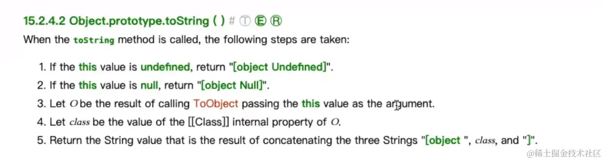
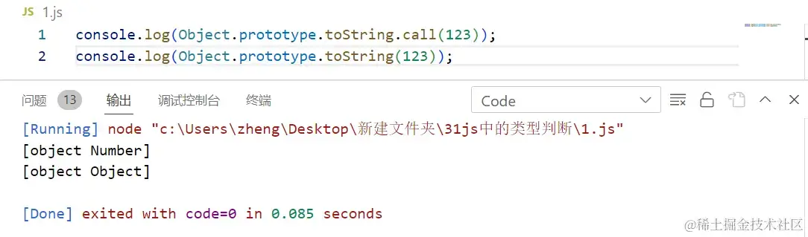

+++
title = "类型判断"
date = '2024-11-04T00:00:00+08:00'
lastmod = '2024-11-14T00:00:00+08:00'
draft = true
weight = 2
tags = ["面试", "前端", "JavaScript", "类型判断", "ecool"]
categories = ["前端开发", "面试"]
source = "https://fe.ecool.fun/knowledge-learn"
+++
JS中的类型判断也是咱的老朋友了，如果要你说两句，那便是啥玩意`typeof`、`instanceof`的，张口就来，但你真的掌握了每一种类型判断，并熟知其原理吗？就比如说`Object.prototype.toString.call()`，当面试官问其中的 `call`有什么作用时，咱们又该如何游说呢。

## typeof原理

所有的类型判断里当属`typeof`最为经典，其最为出名之处就是这玩意不顶用，`typeof`居然会将`null`判定为`object`，但这到底是什么原因？实际上，这就是JS这门编程语言的官方团队造出来的一个bug。

```javascript
let s = '123'
let n = 123
let f = true
let u = undefined
let nu = null
let sy = Symbol(123)
let big = 1234n
let obj = {}
let arr = []
let fn = function(){}
let date = new Date();

console.log(typeof(s));  // string
console.log(typeof(n));  // number
console.log(typeof(f))   // boolean
console.log(typeof(u))   // undifined
console.log(typeof(sy))  // symbol
console.log(typeof(big)) // bigint

console.log(typeof(nu));  //将null判断为object

//以下为引用类型，除了function，一律被判断为object
console.log(typeof(obj))  //object
console.log(typeof(arr))  //object
console.log(typeof(date)) //object

// 所有引用类型只能判断function
console.log(typeof(fn))   //function

//
```

原因就是：`typeof`会把所有传进去的值都转成二进制，而当年JS制定的规则便是：原始类型的被转为二进制的前面三个值绝对不为零，而`typeof`会把前三位为零的类型全部认定为对象，`null`这个类型又是JS语言后来引入的。遵循其他语言的原则，JS语言将`null`的二进制值定为一长串的0，因此`typeof`在判断时会将其认定为`object`。

因此，面试官一般不会询问判断方法 `typeof` 的原理。

## 手写一个instanceof

相较于`typeof`，`instanceof`有其优越之处，也有其不足之处，比如，`instanceof`只能判断引用类型，并且是通过原型链查找来判断类型。

```javascript
let s = '123'
let n = 123
let f = true
let u = undefined
let nu = null
let sy = Symbol(123)
let big = 1234n
let obj = {}
let arr = []
let fn = function(){}
let date = new Date();

console.log(s instanceof String);     // false instanceof 不能判断原始类型

// 以下为引用类型

console.log(obj instanceof Object) ;  // true
console.log(arr instanceof Object);   // true
console.log(fn instanceof Function);  // true
console.log(date instanceof Date);    // true
```

首先要知道每个类型的原型都不相同。

`instanceof`的原理具体来说就是`instanceof`会顺着原型链查找出其继承的原型，看这个原型到底是属于`String`、`Number`、`Boolean`等具体类型的哪一种，如果被判断的类型与我们期望的类型的原型相同，输出true，否则输出false。

以下则为手写`myinstanceof`代码：

```javascript
function myinstanceof(L, R){
    while(L !== null){
        if(L.__proto__ === R.prototype){
            return true;
        }
        L = L.__proto__
    }
    return false
}
console.log(myinstanceof([], Array))  // true
```

令人奇怪的是，为什么原型的判断中牵扯到`while`？熟知原型链的友友应该不难理解，正如之前所说，`instanceof` 是通过原型链查找来判断类型，那岂不知显示原型生隐式原型，如此往复，子子孙孙无穷尽也，正如下代码，如果用舍弃 `while` 转而用`if`进行进行判断，仅仅是三代原型的传递，就要用到三次`if`判断，可想而知原型链一长，代码都打不过来的光景。

以下为不正确的`myinstanceof`手写代码：

```javascript
function B(){}
let b = new B();

A.prototype = b;
function A(){}
let a = new A();

function myinstanceof(L,R){
    if(L.__proto__ === R.prototype){
        return true;
    } else {
        if(L.__proto__.__proto__ === R.prototype) {
            return true
        } else {
            if(L.__proto__.__proto__.__proto__ === R.prototype)
            return true
        }

    }
}

console.log(myinstanceof(a, Object))    // true
```

## 最完美的判断方式：Object.prototype.toString.call()

类型判断中最为完美的毋庸置疑，当属 `Object.prototype.toString.call()`，这是一种属于`object`原型上的方法。它能做到正确的判断出每一种类型。

```javascript
let s = '123'
let n = 123
let f = true
let u = undefined
let nu = null
let sy = Symbol(123)
let big = 1234n
let obj = {}
let arr = []
let fn = function(){}
let date = new Date();

console.log(Object.prototype.toString.call(s));   //  [object String]
console.log(Object.prototype.toString.call(n));   //  [object Number]
console.log(Object.prototype.toString.call(f));   //  [object Boolean]
console.log(Object.prototype.toString.call(u));   //  [object Undefined]
console.log(Object.prototype.toString.call(nu));  //  [object Null]

console.log(Object.prototype.toString.call(obj));  // [object Object]
console.log(Object.prototype.toString.call(arr));  // [object Array]
console.log(Object.prototype.toString.call(fn));   // [object Function]
console.log(Object.prototype.toString.call(date)); // [object Date]
```

这种判断方法的完整代码为 `Object.prototype.toString.call()`，关于它的原理，我们来看看官网是怎么对`Object.prototype.toString()` 进行解释的:



翻译成人话就是：

1.  如果你传进来的值为`undefined`的话，直接返回一个[object Undefined]。
2.  如果你传进来的值为`null`的话，直接返回一个[object Null]。
3.  如果你既不是`undefined`又不是`null`的话，JS将调用`ToObject`方法，将`O`作为 `ToObject(this)`的执行结果。

`ToObject`的执行机理简单来说就是，传进来一个`boolean`类型会创建一个`boolean`包装类对象，传进来`Number`会创建一个`Number`字面量，传进来一个`String`会创建一个字符串字面量，传进来一个对象就会创建这个对象。总而言之，任何传进去的任何值都会转换为对象。

4.  定义一个`class`作为内部属性`[[class]]`的值，用于承接传进来的值。
5.  返回由 `"["` `object` 和 `class` 和 `"]"` 组成的字符串。

现在我们知道 `Object.prototype.toString()`的原理了，但是 `Object.prototype.toString.call()`后面加的这个`call`又有什么作用呢？让我们先试着输出一下:



可以看到令人啼笑皆非的一幕发生了，`Object.prototype.toString()`将 123 判断为`object`，而`Object.prototype.toString.call()`则输出了正确的判断，这又是什么原理？

这正是`Object.prototype.toString()`执行过程中调用`ToObject()`的结果，上文提到，`ToObject()`会把你传进来的值都创建为相应的类型，123 传进来被创建为`String`，而字符串类型在V8眼里可不就是对象嘛。

现在我们来说明 `call` 在此的作用，我们都知道`.call(obj)`的作用是将 `.call` 之前的函数中的 `this` 指向 obj，但也可以说是把 `.call` 之前的函数方法借给 obj 去使用，因此在`Object.prototype.toString.call()`中，`toString()`是这样被调用的：

```vbscript
Object.prototype.toString.call(obj)

obj.toString()
```

就像上文对123的判断，当没有`call`时`toString`是在被123实例对象调用，而当添加上`call` 后，`toString`就变成是被123的原型所调用。因此，`call`确保了类型判断是被原型在调用，从而能输出正确的值。

## Array.isArray()

最后一个要讲的就是`Array.isArray()`，这是一个隶属于 `Array` 构造函数的静态方法，遗憾的是，它只能判断数组。

```javascript
let arr = []
let s = '123'

console.log(Array.isArray(arr));  // true
console.log(Array.isArray(s));    // false
```

## 总结：

**typeof**

- 可以判断除 `null` 之外的所有原始类型。
- 除了`function`其他所有的引用类型都会被判断成object。
- `typeof`是通过将值转换为二进制后判断其二进制前三位是否为0，是则为`object`。

**instanceof**

- 只能判断引用类型。
- 通过原型链查找来判断类型。

**Object.prototype.toString()**

- 一种Object原型上的方法。

**Array.isArray()**

- 一个隶属于 `Array` 构造函数的静态方法。

以上便是 **typeof**、**instanceof**、**Object.prototype.toString.call()**、**Array.isArray()** 这四种类型判断。虽然我说其中`Object.prototype.toString()`的判断最为完美全面，但在实际应用之中它们各有优劣之处，应用场景也各有不同。

## 常见考点

### 1. **基本数据类型与引用数据类型**

- **理解基本数据类型**：如 `undefined`、`null`、`boolean`、`number`、`string` 和 `symbol`（ES6），以及引用类型（如 `Object`、`Array`、`Function` 等）。
- **类型的特点**：基本数据类型是不可变的，而引用数据类型是可变的。

### 2. **typeof 操作符**

- **用法**：了解如何使用 `typeof` 判断数据类型，以及它返回的不同字符串值。

```javascript
console.log(typeof 42); // "number"
console.log(typeof 'hello'); // "string"
console.log(typeof true); // "boolean"
console.log(typeof null); // "object"（这是一个历史遗留问题）
console.log(typeof undefined); // "undefined"
console.log(typeof {}); // "object"
console.log(typeof []); // "object"
console.log(typeof function(){}); // "function"
```

- **注意事项**：`typeof` 对于一些特殊类型（如 `null` 和数组）返回的结果可能不符合直觉。

### 3. **instanceof 操作符**

- **用法**：用于判断一个对象是否是某个构造函数的实例。

```javascript
console.log([] instanceof Array); // true
console.log({} instanceof Object); // true
console.log(function(){} instanceof Function); // true
```

- **原型链**：了解 `instanceof` 是通过检查原型链来判断的。

### 4. **Object.prototype.toString 方法**

- **用法**：可以更准确地判断数据类型，尤其是引用类型。

```javascript
console.log(Object.prototype.toString.call([])); // "[object Array]"
console.log(Object.prototype.toString.call({})); // "[object Object]"
console.log(Object.prototype.toString.call(new Date())); // "[object Date]"
```

- **用途**：通常用于处理较复杂的类型判断。

### 5. **自定义类型判断**

- **封装类型判断函数**：如何封装自定义函数来判断特定的数据类型。

```javascript
function isArray(value) {
    return Object.prototype.toString.call(value) === '[object Array]';
}
```

### 6. **类型转换**

- **隐式转换**：JavaScript 在某些操作中会自动进行类型转换，考察点包括如何理解这些隐式转换（例如，在比较时）。
- **显式转换**：如何使用 `String()`、`Number()`、`Boolean()` 等函数进行显式类型转换。

### 7. **null 和 undefined 的区别**

- **判断**：了解如何判断一个变量是 `null` 还是 `undefined`，以及它们的使用场景。

```javascript
console.log(value === null); // true
console.log(value === undefined); // true
```

### 8. **安全类型判断**

- **防止错误**：在进行类型判断时，如何处理一些边界情况（如类型不一致、空值等）。

### 9. **类型安全与 TypeScript**

- **TypeScript 中的类型判断**：在 TypeScript 中，如何使用类型系统进行更安全的类型判断和约束。
