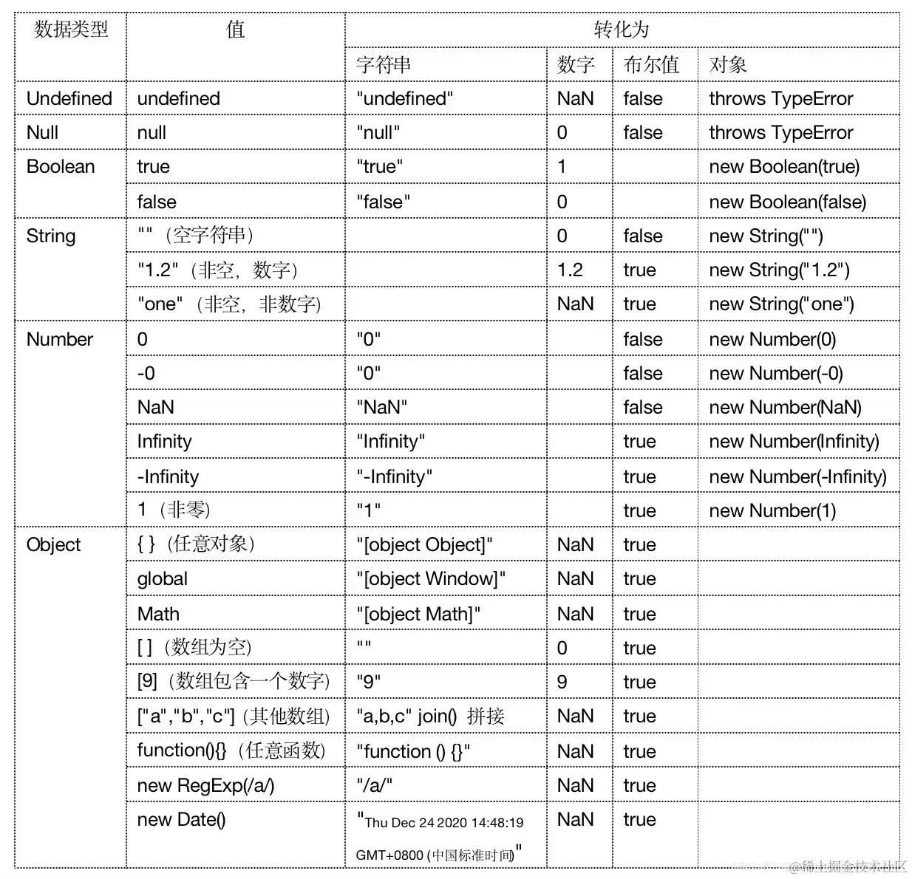

+++
title = "数据类型转换"
date = '2024-11-04T00:00:00+08:00'
lastmod = '2024-11-08T00:00:00+08:00'
draft = true
weight = 3
tags = ["面试", "前端", "JavaScript", "数据类型转换", "ecool"]
categories = ["前端开发", "面试"]
source = "https://fe.ecool.fun/knowledge-learn"
+++
## 前言

JavaScript 是一种非常灵活的编程语言，它允许开发者在代码中进行各种类型的操作和转换。其中，显式和隐式类型转换是 JavaScript 中一个重要而又常见的概念。你是否曾经遇到过 JavaScript 中奇怪的类型转换行为？当你使用加号连接两个不同类型的值时，为什么有时候会得到意料之外的结果？为了更好地理解 JavaScript 中的这些行为，我本篇文章将带大家深入探讨显式和隐式类型转换。

## 数据类型

首先简单了解下有哪些数据类型。

> 原始数据类型：String、Number、Boolean、Symbol、Undefined、Null、BigInt（本文不讨论BigInt、Symbol）
>
> 引用数据类型: Object（引用类型指向一个对象，不是原始值，指向对象的变量是引用变量）

## 类型转换

数据类型之间的转换可以分为下面三种：

1. 原始数据类型之间的转换。
2. 原始数据类型转换为对象。
3. 对象转换为原始数据类型。

## 1.1 原始数据类型转Number

```javascript
console.log(Number('123')); // 123
console.log(Number(true)); // 1
console.log(Number(undefined)); // NaN
console.log(Number(null)); // 0
```

我们可以直接调用`Number()`函数来进行转换。该函数会把`undefined`转换为`NaN`，将`null`转换为`0`。

而对于字符串，如果字符串中仅仅包含数字，则将转换为数字，若包含非数字字符，则返回`NaN`。我们也可以使用`parseInt()`来转换字符串。

```javascript
console.log(parseInt('123')); // 123
console.log(parseInt('12.3')); // 12
console.log(parseInt('12ds8'));// 12
console.log(parseInt('ads25')); // NaN
```

`parseInt()`只解析整数部分，忽略小数部分。`parseFloat()`可以将字符串转换为浮点数的函数。

## 1.2 原始数据类型转String

```javascript
console.log(String());//''
console.log(String(123));//'123'
console.log(String(NaN));//NaN
console.log(String(undefined));//undefined
console.log(String(null));//null
console.log(String(true));//true
```

我们可以使用`String()` 构造函数将任何类型的数据转换为字符串类型。它将接收到的参数转换为对应的字符串表示形式。

## 1.3 原始数据类型转Boolean

```javascript
console.log(Boolean());// false
console.log(Boolean('Ywis'));// tru
console.log(Boolean(123));// true
console.log(Boolean(NaN));// false
console.log(Boolean(undefined));// false
console.log(Boolean(null));// false
console.log(Boolean(true));// true
```

调用`Boolean()`函数进行转换。在将非布尔值类型转换为布尔值类型时，有一个总结：

1. `false`：布尔值 false
2. `undefined`：未定义的值
3. `null`：空值
4. `0`：数字 0
5. `-0`：负零
6. `NaN`：非数字值
7. `''`：空字符串

除了以上七个值外，其他值（包括对象、数组、函数等）在转换为布尔值时都会返回 `true`。这种规则使得 JS 中的大多数值被视为真值（truthy）。

## 2. 原始数据类型转换为对象

```javascript
console.log(Object());//{}
console.log(Object('Ywis'));//[String: 'Ywis']
console.log(Object(123));//[Number: 123]
console.log(Object(true));//[Boolean: true]
console.log(Object(undefined));//{}
console.log(Object(null));//{}
```

一样直接使用`Object()`构造函数，其中除了将`undefined`和`null`转换为空对象，其他都会转换为对象。同样我们可以使用对象的包装器（Object Wrappers）将原始数据类型转换为对象类型。

```javascript
let str = 'Ywis'
let x = new String (str)
console.log(x); //[String: 'Ywis']
```

需要注意的是：

- 使用对象包装器将原始数据类型转换为对象类型时，创建的是一个新的对象，而不是对原始值的引用。
- 尽管可以将原始数据类型转换为对象类型，但并不推荐这样做，因为会增加额外的内存开销。

## 3.1 对象转换为原始数据类型（ToPrimitive 底层原理来了，敲黑板🔥🔥）

在 JavaScript 中，`ToPrimitive` 是一个抽象操作，用于将值转换为原始数据类型。它是在一些内部操作中使用的概念，例如在进行算术运算、比较操作、或将对象转换为原始值时。

`ToPrimitive` 操作涉及到以下步骤：

1. 如果值已经是原始数据类型，则直接返回该值。
2. 否则，调用对象的 `valueOf()` 方法。如果返回的是原始数据类型，则将其作为结果返回。
3. 否则，调用对象的 `toString()` 方法。如果返回的是原始数据类型，则将其作为结果返回。
4. 如果上述步骤都无法得到原始数据类型的值，则抛出类型错误（TypeError）。

这是官方文档对于`ToPrimitive`的介绍([es5.github.io/#x9.1](https://es5.github.io/#x9.1))

## 3.2 valueOf

`valueOf()` 是 JavaScript 对象的一个方法，如果对象具有原始数据类型的值，则直接返回该值；否则返回对象本身。

- 基本包装类型直接返回原始值
- Date 类型返回毫秒数
- 其他都返回对象本身

```javascript
// 1. 基本包装类
let num = new Number('123')
console.log(num.valueOf()); // 123

let str = 'Ywis'
console.log(str.valueOf()); // Ywis

// 2. Date 类型返回一个内部表示：1970年1月1日以来的毫秒数
let date = new Date();
console.log(date.valueOf()); // 1710155613356

// 3.返回对象本身
let obj = new Array()
console.log(obj.valueOf()); // []
```

## toString

`toString()` 方法是 JavaScript 中所有对象继承自 `Object.prototype` 的方法，用于返回对象的字符串表示形式。

- 基本包装类型直接返回原始值
- 很多类都有实现各自版本的 toString()，例如日期、数组、函数。  
  - 对象调用:{}.toSring 返回由"[Object" 和 类型名 和"]"组成的字符串
  - 数组调用:[].toString 返回由数组内部元素以逗号拼接的字符串
  - Date类型转换为可读的日期和时间字符串
  - 函数调用：返回这个函数定义的 JS 源代码字符串

```javascript
// 1. 基本包装类
let num = new Number('123abc')
console.log(num.toString()); // NaN

let str = 'Ywis'
console.log(str.toString()); // Ywis

// 2.1 对象调用
let obj = new Object({});
console.log(obj.toString()); // [object Object]

// 2.2 数组调用
let arr = new Array(1, 2, 3);
console.log(arr.toString()); // 1,2,3

// 2.3  Date类型转换为可读的日期和时间字符串
let date = new Date();
console.log(date.toString()); // Mon Mar 11 2024 19:30:58 GMT+0800 (中国标准时间)

// 2.4 函数调用
let fun = function(){console.log('Ywis');}
console.log(fun.toString()); // function(){console.log('Ywis');}
```

## 类型转换表（来自《JavaScript权威指南》）



## 显式转换

显式转换（Explicit Conversion）是指在代码中明确地使用转换函数或操作符来将一个数据类型转换为另一个数据类型。这种转换是人为明确指定的，以确保代码的行为符合预期，比如下面场景：

```javascript
console.log(Boolean('Ywis')); // true
console.log(parseInt('10')); // 10

console.log(new Number('10')); // [Number: 10]
```

1. **转换函数**：JS 提供了一些内置的转换函数，如 `parseInt()`, `parseFloat()`, `String()`, `Number()`, `Boolean()` 等
2. **构造函数**：某些数据类型具有对应的构造函数，可以用于显式地创建该数据类型的实例。

## 隐式转换

隐式转换（Implicit Conversion）是指在 JS 中，在某些运算或操作中，当涉及到不同类型的数据时，JavaScript 引擎会自动进行类型转换，以便完成该运算或操作。这种转换是由 JavaScript 引擎隐式地执行的，而不需要人们明确指定。

**常见的隐式转换**：

- 逻辑表达式：逻辑运算符（如逻辑非 `！`逻辑与 `&&`、逻辑或 `||`）中，非布尔类型的值会被隐式转换为布尔类型。

```sql
console.log(![]); //false 
//[]先被转换成boolean，值为true，再取反为false。
```

- 逻辑语句的类型转换：当使用if、while、for 时，隐式转换为布尔值；

```lua
if ('Ywis') {
    console.log("Ywis is truthy"); // "Ywis is truthy"，Ywis 被隐式转换为 true
}
```

- 算术表达式：当使用算术运算符（如加号 `+`、减号 `-`、乘号 `*` 等）进行运算时，如果操作数的类型不同，JavaScript 会尝试将它们转换为相同的类型，然后进行运算。

```javascript
let str1 = 'Ywis'
let str2 = '123'
console.log(str1 + '666'); // Ywis666
console.log(+str2); // 123
```

- 比较操作：当使用比较运算符（如等号 `==`、不等号 `!=`、大于号 `>` 等）进行比较时。

```lua
console.log("10" == 10); // true，字符串 "10" 隐式转换为数字 10，然后比较
```

## 常见考点

### 1. **隐式类型转换**

- **自动转换**：JavaScript 在某些操作中会自动进行类型转换。例如，在运算、比较或逻辑运算中，常常会发生隐式转换。
- **示例**：  
```javascript
console.log(1 + '2'); // "12"（数字转换为字符串）
console.log(1 - '2'); // -1（字符串转换为数字）
console.log(true + 1); // 2（布尔值转换为数字）
```

### 2. **显式类型转换**

- **使用构造函数**：可以使用内置构造函数显式地转换数据类型。
- **示例**：  
  - **String 转换**：`String(value)`  
```javascript
console.log(String(123)); // "123"
```
  - **Number 转换**：`Number(value)`  
```javascript
console.log(Number('123')); // 123
console.log(Number('')); // 0
console.log(Number(null)); // 0
console.log(Number(undefined)); // NaN
```
  - **Boolean 转换**：`Boolean(value)`  
```javascript
console.log(Boolean(0)); // false
console.log(Boolean(1)); // true
console.log(Boolean('')); // false
```

### 3. **特殊情况**

- **NaN 的处理**：了解 `NaN` 是如何产生的，如何判断一个值是否为 `NaN`（使用 `Number.isNaN()`）。
- **字符串与数字的转换**：当一个字符串被转换为数字时，如果字符串不能被解析为有效数字，结果将是 `NaN`。  
```javascript
console.log(Number('abc')); // NaN
```

### 4. **数组和对象的转换**

- **数组转字符串**：数组在隐式转换为字符串时，元素会被逗号分隔。  
```javascript
console.log([1, 2, 3]); // "1,2,3"
```
- **对象转字符串**：对象在隐式转换时会调用 `toString()` 方法，通常返回 `[object Object]`，需要使用 `JSON.stringify()` 来获取对象的 JSON 表示。  
```javascript
console.log({ a: 1 }); // "[object Object]"
console.log(JSON.stringify({ a: 1 })); // "{"a":1}"
```

### 5. **使用 `parseInt` 和 `parseFloat`**

- **解析字符串**：`parseInt` 和 `parseFloat` 用于将字符串解析为整数或浮点数。
- **示例**：  
```javascript
console.log(parseInt('123')); // 123
console.log(parseFloat('123.45')); // 123.45
console.log(parseInt('abc')); // NaN
```

### 6. **基础类型与引用类型的转换**

- **基本类型**：基本类型在赋值时是值传递。
- **引用类型**：引用类型在赋值时是引用传递，改变引用类型的内容会影响原始对象。

### 7. **对象与基本类型之间的转换**

- **对象包装类型**：当访问基本数据类型的方法时，JavaScript 会自动将其转换为对应的对象类型（如 `String`、`Number`、`Boolean`）。
- **示例**：  
```javascript
let str = 'hello';
console.log(str.toUpperCase()); // "HELLO"（隐式转换为 String 对象）
```

### 8. **安全的转换方法**

- **防止类型错误**：如何在转换时处理可能出现的错误或异常，确保代码的健壮性。
- **使用 `try...catch`**：在进行复杂的转换操作时，使用错误捕获来处理潜在的异常。

### 9. **性能考虑**

- **转换方法的选择**：了解不同转换方法的性能差异，在需要高效处理大量数据时进行合理选择。

### 10. **TypeScript 的类型安全**

- **类型注解**：在 TypeScript 中如何使用类型注解和类型推断，确保数据类型的正确性和转换的安全性。
