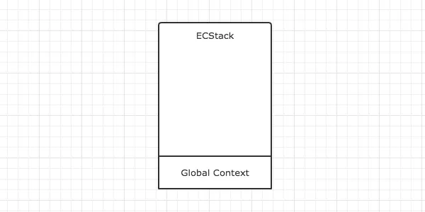
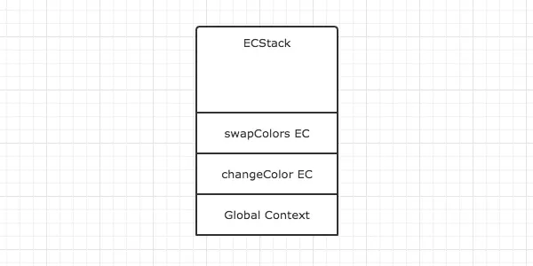
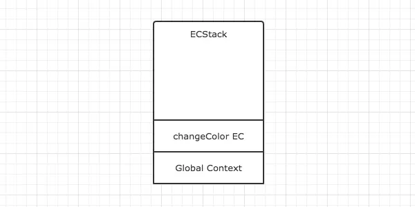
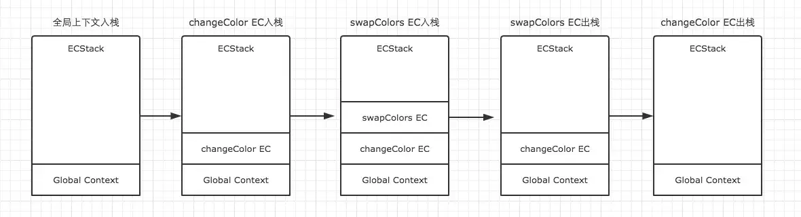
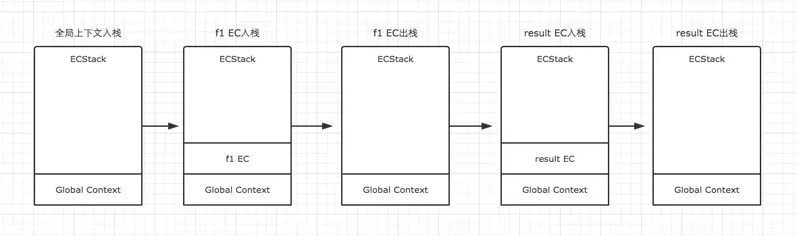

+++
title = "执行上下文"
date = '2024-11-06T00:00:00+08:00'
lastmod = '2024-11-08T00:00:00+08:00'
draft = true
weight = 5
tags = ["面试", "前端", "JavaScript", "执行上下文", "ecool"]
categories = ["前端开发", "面试"]
source = "https://fe.ecool.fun/knowledge-learn"
+++
  
 我们在JS学习初期或者面试的时候常常会遇到考核变量提升的思考题。比如先来一个简单一点的。

```javascript
console.log(a);   // 这里会打印出什么？
var a = 20;
```

暂时先不管这个例子，我们先引入一个JavaScript中最基础，但同时也是最重要的一个概念**执行上下文（Execution Context）**。

每次当控制器转到可执行代码的时候，就会进入一个执行上下文。执行上下文可以理解为当前代码的执行环境，它会形成一个作用域。JavaScript中的运行环境大概包括三种情况。

- 全局环境：JavaScript代码运行起来会首先进入该环境
- 函数环境：当函数被调用执行时，会进入当前函数中执行代码
- eval（不建议使用，可忽略）

因此在一个JavaScript程序中，必定会产生多个执行上下文，在我的上一篇文章中也有提到，JavaScript引擎会以栈的方式来处理它们，这个栈，我们称其为函数调用栈(call stack)。栈底永远都是全局上下文，而栈顶就是当前正在执行的上下文。

当代码在执行过程中，遇到以上三种情况，都会生成一个执行上下文，放入栈中，而处于栈顶的上下文执行完毕之后，就会自动出栈。为了更加清晰的理解这个过程，根据下面的例子，结合图示给大家展示。

> 执行上下文可以理解为函数执行的环境，每一个函数执行时，都会给对应的函数创建这样一个执行环境。

```javascript
var color = 'blue';

function changeColor() {
    var anotherColor = 'red';

    function swapColors() {
        var tempColor = anotherColor;
        anotherColor = color;
        color = tempColor;
    }

    swapColors();
}

changeColor();
```

我们用ECStack来表示处理执行上下文组的堆栈。我们很容易知道，第一步，首先是全局上下文入栈。



全局上下文入栈之后，其中的可执行代码开始执行，直到遇到了`changeColor()` ，这一句激活函数`changeColor`创建它自己的执行上下文，因此第二步就是changeColor的执行上下文入栈。


changeColor的上下文入栈之后，控制器开始执行其中的可执行代码，遇到`swapColors()`之后又激活了一个执行上下文。因此第三步是swapColors的执行上下文入栈。



在swapColors的可执行代码中，再没有遇到其他能生成执行上下文的情况，因此这段代码顺利执行完毕，swapColors的上下文从栈中弹出。



swapColors的执行上下文弹出之后，继续执行changeColor的可执行代码，也没有再遇到其他执行上下文，顺利执行完毕之后弹出。这样，ECStack中就只身下全局上下文了。


全局上下文在浏览器窗口关闭后出栈。

> 注意：函数中，遇到return能直接终止可执行代码的执行，因此会直接将当前上下文弹出栈。



详细了解了这个过程之后，我们就可以对执行上下文总结一些结论了。

- 单线程
- 同步执行，只有栈顶的上下文处于执行中，其他上下文需要等待
- 全局上下文只有唯一的一个，它在浏览器关闭时出栈
- 函数的执行上下文的个数没有限制
- 每次某个函数被调用，就会有个新的执行上下文为其创建，即使是调用的自身函数，也是如此。

为了巩固一下执行上下文的理解，我们再来绘制一个例子的演变过程，这是一个简单的闭包例子。

```javascript
function f1(){
    var n=999;
    function f2(){
        alert(n);
    }
    return f2;
}
var result=f1();
result(); // 999
```

因为f1中的函数f2在f1的可执行代码中，并没有被调用执行，因此执行f1时，f2不会创建新的上下文，而直到result执行时，才创建了一个新的。具体演变过程如下。



最后留一个简单的例子，大家可以自己脑补一下这个例子在执行过程中执行上下文的变化情况。

```javascript
var name = "window";

var p = {
  name: 'Perter',
  getName: function() {

    // 利用变量保存的方式保证其访问的是p对象
    var self = this;
    return function() {
      return self.name;
    }
  }
}

var getName = p.getName();
var _name = getName();
console.log(_name);
```

## 常见考点

1.  **执行上下文的定义**  
  - 什么是执行上下文？它在 JavaScript 中有哪些类型？
  - 执行上下文在代码执行时是如何被创建和销毁的？
2.  **执行上下文的生命周期**  
  - 执行上下文的创建和执行过程有哪些阶段？（例如，创建阶段和执行阶段）
  - 请描述执行上下文在创建阶段进行的三个步骤：变量对象的创建、作用域链的建立、`this` 的绑定。
3.  **变量对象（Variable Object）**  
  - 什么是变量对象？它在执行上下文中的作用是什么？
  - 变量提升是如何与变量对象关联的？在函数声明和变量声明时有何不同？
4.  **作用域链**  
  - 执行上下文是如何通过作用域链来访问变量的？
  - 请解释在嵌套函数的情况下，作用域链是如何建立的？
5.  **`this` 绑定**  
  - 在不同的执行上下文中，`this` 的值是如何确定的？（例如，全局上下文、函数上下文、箭头函数）
  - 如何解释在不同函数调用方式下 `this` 的指向差异？
6.  **执行上下文栈**  
  - 什么是执行上下文栈？它如何管理代码执行的顺序？
  - JavaScript 引擎如何利用执行上下文栈来实现函数的嵌套调用和返回？
7.  **块级作用域的影响**  
  - ES6 中引入的 `let` 和 `const` 是如何影响执行上下文的？
  - 如何解释块级作用域在执行上下文中的特殊处理？
8.  **常见问题与调试**  
  - 如何通过理解执行上下文来排查变量未定义、`this` 指向错误等常见问题？
  - 请解释某个你遇到的实际问题，以及如何通过分析执行上下文来解决它的。
