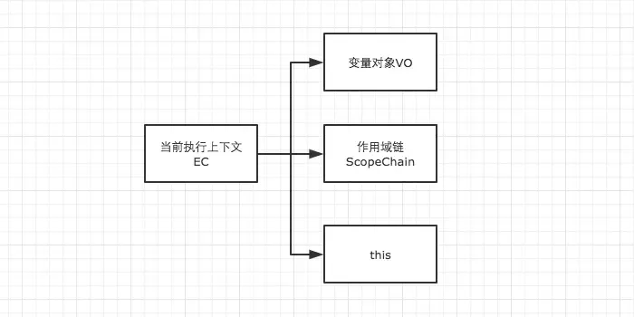
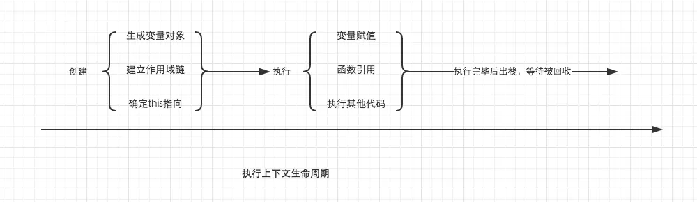
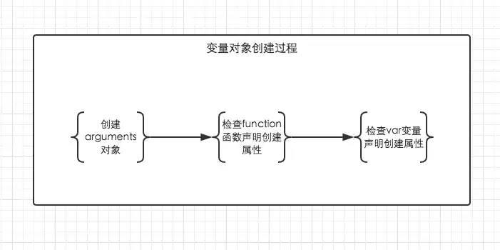

+++
title = "变量对象"
date = '2024-11-06T00:00:00+08:00'
lastmod = '2024-11-08T00:00:00+08:00'
draft = true
weight = 6
tags = ["面试", "前端", "JavaScript", "变量对象", "ecool"]
categories = ["前端开发", "面试"]
source = "https://fe.ecool.fun/knowledge-learn"
+++


这篇文章要给大家介绍的是变量对象。

在JavaScript中，我们肯定不可避免的需要声明变量和函数，可是JS解析器是如何找到这些变量的呢？我们还得对执行上下文有一个进一步的了解。

在知识点《执行上下文》中，我们已经知道，当调用一个函数时（激活），一个新的执行上下文就会被创建。而一个执行上下文的生命周期可以分为两个阶段。

- **创建阶段**

在这个阶段中，执行上下文会分别创建变量对象，建立作用域链，以及确定this的指向。

- **代码执行阶段**

创建完成之后，就会开始执行代码，这个时候，会完成变量赋值，函数引用，以及执行其他代码。



从这里我们就可以看出详细了解执行上下文极为重要，因为其中涉及到了变量对象，作用域链，this等很多人没有怎么弄明白，但是却极为重要的概念，它关系到我们能不能真正理解JavaScript。在后面的文章中我们会一一详细总结，这里我们先重点了解变量对象。

##### 变量对象（Variable Object）

变量对象的创建，依次经历了以下几个过程。

1. 建立arguments对象。检查当前上下文中的参数，建立该对象下的属性与属性值。
2. 检查当前上下文的函数声明，也就是使用function关键字声明的函数。在变量对象中以函数名建立一个属性，属性值为指向该函数所在内存地址的引用。如果函数名的属性已经存在，那么该属性将会被新的引用所覆盖。
3. 检查当前上下文中的变量声明，每找到一个变量声明，就在变量对象中以变量名建立一个属性，属性值为undefined。如果该变量名的属性已经存在，为了防止同名的函数被修改为undefined，则会直接跳过，原属性值不会被修改。

许多读者在阅读到这的时候会因为下面的这样场景对于“跳过”一词产生疑问。既然变量声明的foo遇到函数声明的foo会跳过，可是为什么最后foo的输出结果仍然是被覆盖了？

```javascript
function foo() { console.log('function foo') }
var foo = 20;

console.log(foo); // 20
```

其实只是大家在阅读的时候不够仔细，因为上面的三条规则仅仅适用于变量对象的创建过程。也就是执行上下文的创建过程。而`foo = 20`是在执行上下文的执行过程中运行的，输出结果自然会是20。对比下例。

```javascript
console.log(foo); // function foo
function foo() { console.log('function foo') }
var foo = 20;
```

```javascript
// 上栗的执行顺序为

// 首先将所有函数声明放入变量对象中
function foo() { console.log('function foo') }

// 其次将所有变量声明放入变量对象中，但是因为foo已经存在同名函数，因此此时会跳过undefined的赋值
// var foo = undefined;

// 然后开始执行阶段代码的执行
console.log(foo); // function foo
foo = 20;
```



根据这个规则，理解变量提升就变得十分简单了。在很多文章中虽然提到了变量提升，但是具体是怎么回事还真的很多人都说不出来，以后在面试中用变量对象的创建过程跟面试官解释变量提升，保证瞬间提升逼格。

在上面的规则中我们看出，function声明会比var声明优先级更高一点。为了帮助大家更好的理解变量对象，我们结合一些简单的例子来进行探讨。

```javascript
// demo01
function test() {
    console.log(a);
    console.log(foo());

    var a = 1;
    function foo() {
        return 2;
    }
}

test();
```

在上例中，我们直接从test()的执行上下文开始理解。全局作用域中运行`test()`时，test()的执行上下文开始创建。为了便于理解，我们用如下的形式来表示

```javascript
// 创建过程
testEC = {
    // 变量对象
    VO: {},
    scopeChain: {}
}

// 因为本文暂时不详细解释作用域链，所以把变量对象专门提出来说明

// VO 为 Variable Object的缩写，即变量对象
VO = {
    arguments: {...},  //注：在浏览器的展示中，函数的参数可能并不是放在arguments对象中，这里为了方便理解，我做了这样的处理
    foo: <foo reference>  // 表示foo的地址引用
    a: undefined
}
```

未进入执行阶段之前，变量对象中的属性都不能访问！但是进入执行阶段之后，变量对象转变为了活动对象，里面的属性都能被访问了，然后开始进行执行阶段的操作。

> 这样，如果再面试的时候被问到变量对象和活动对象有什么区别，就又可以自如的应答了，他们其实都是同一个对象，只是处于执行上下文的不同生命周期。不过只有处于函数调用栈栈顶的执行上下文中的变量对象，才会变成活动对象。

```javascript
// 执行阶段
VO ->  AO   // Active Object
AO = {
    arguments: {...},
    foo: <foo reference>,
    a: 1,
    this: Window
}
```

因此，上面的例子demo1，执行顺序就变成了这样

```javascript
function test() {
    function foo() {
        return 2;
    }
    var a;
    console.log(a);
    console.log(foo());
    a = 1;
}

test();
```

再来一个例子，巩固一下我们的理解。

```javascript
// demo2
function test() {
    console.log(foo);
    console.log(bar);

    var foo = 'Hello';
    console.log(foo);
    var bar = function () {
        return 'world';
    }

    function foo() {
        return 'hello';
    }
}

test();
```

```javascript
// 创建阶段
VO = {
    arguments: {...},
    foo: <foo reference>,
    bar: undefined
}
// 这里有一个需要注意的地方，因为var声明的变量当遇到同名的属性时，会跳过而不会覆盖
```

```javascript
// 执行阶段
VO -> AO
VO = {
    arguments: {...},
    foo: 'Hello',
    bar: <bar reference>,
    this: Window
}
```

需要结合上面的知识，仔细对比这个例子中变量对象从创建阶段到执行阶段的变化，如果你已经理解了，说明变量对象相关的东西都已经难不倒你了。

##### 全局上下文的变量对象

以浏览器中为例，全局对象为window。  
 全局上下文有一个特殊的地方，它的变量对象，就是window对象。而这个特殊，在this指向上也同样适用，this也是指向window。

```javascript
// 以浏览器中为例，全局对象为window
// 全局上下文
windowEC = {
    VO: Window,
    scopeChain: {},
    this: Window
}
```

除此之外，全局上下文的生命周期，与程序的生命周期一致，只要程序运行不结束，比如关掉浏览器窗口，全局上下文就会一直存在。其他所有的上下文环境，都能直接访问全局上下文的属性。

## 常见考点

1.  **变量对象的定义**  
  - 你能解释什么是变量对象吗？它在 JavaScript 中的执行上下文中扮演什么角色？
  - 变量对象的内容包括哪些类型的变量和函数？
2.  **变量对象的创建过程**  
  - 在执行上下文的创建阶段，变量对象是如何初始化的？它是如何通过变量提升来处理变量和函数声明的？
  - 在函数上下文中，变量对象是否包含函数参数？如果是，它是如何处理的？
3.  **活动对象（Activation Object）**  
  - 在函数执行上下文中，变量对象会被激活为活动对象。你能解释活动对象是什么吗？它与变量对象有何不同？
  - 为什么在代码执行时只能通过活动对象访问变量对象中的内容？
4.  **变量提升**  
  - 变量提升是如何在变量对象中实现的？函数声明和变量声明在提升时有何区别？
  - 解释一个带有变量提升的代码示例，以及在执行上下文中变量对象的创建过程。
5.  **全局对象与变量对象的关系**  
  - 在全局执行上下文中，变量对象和全局对象有何关系？为什么可以将全局变量当作全局对象的属性访问？
  - `window` 对象和全局变量对象的关系是什么？
6.  **变量对象中的属性**  
  - 在执行上下文中，`var` 声明、`let` 和 `const` 声明的变量在变量对象中的处理方式有何不同？
  - 在严格模式下（`strict mode`），变量对象的行为有何不同？
7.  **变量对象的应用场景**  
  - 在 JavaScript 代码调试中，如何利用对变量对象的理解来解决变量未定义或意外覆盖等问题？
  - 能否描述一个你遇到的实际问题，并说明变量对象的知识如何帮助你定位和解决该问题？
