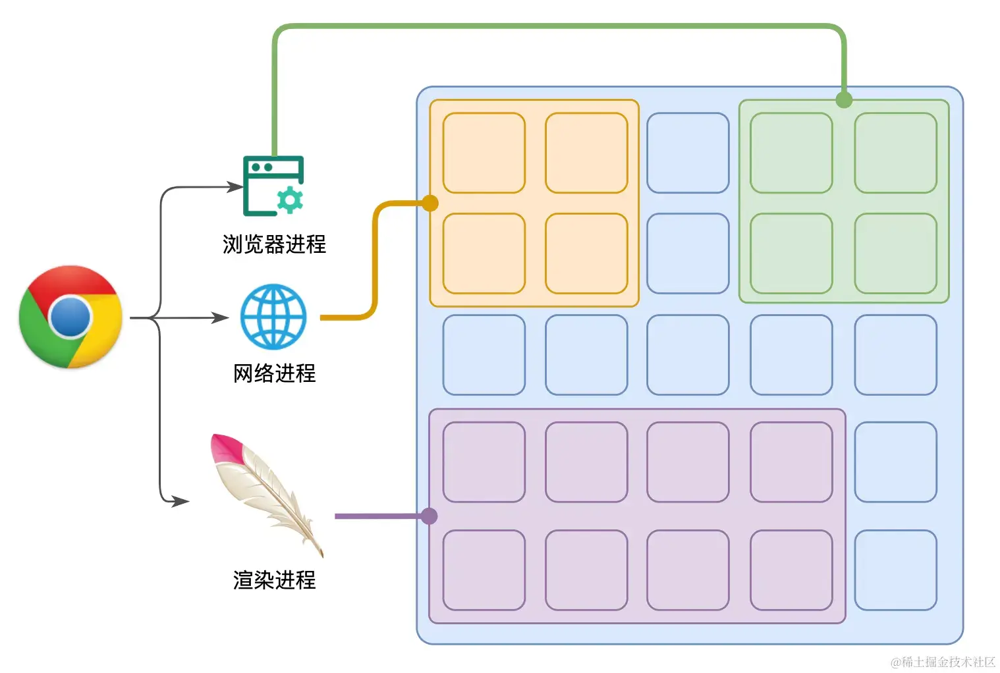
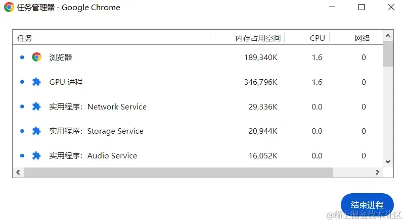
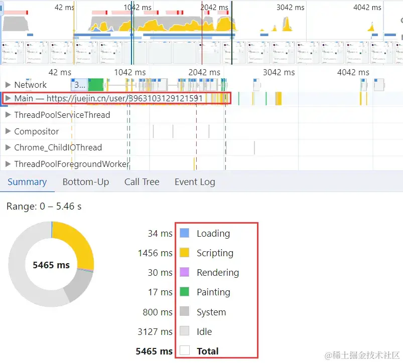
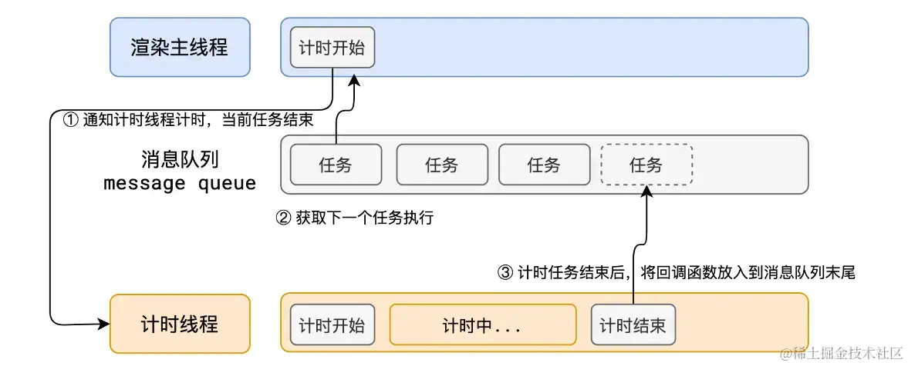
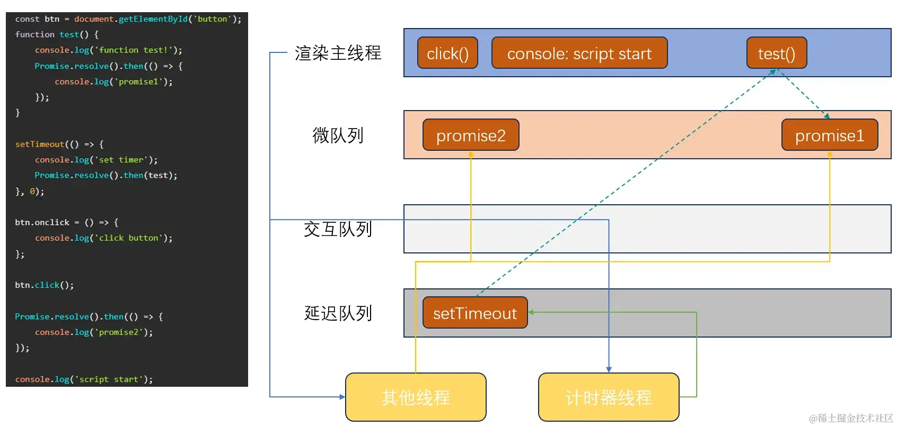
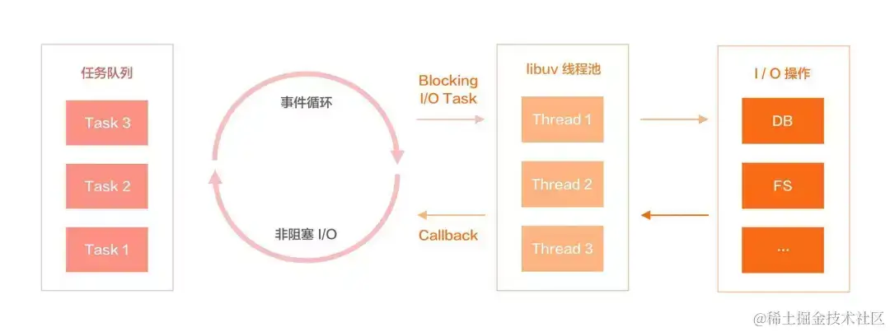
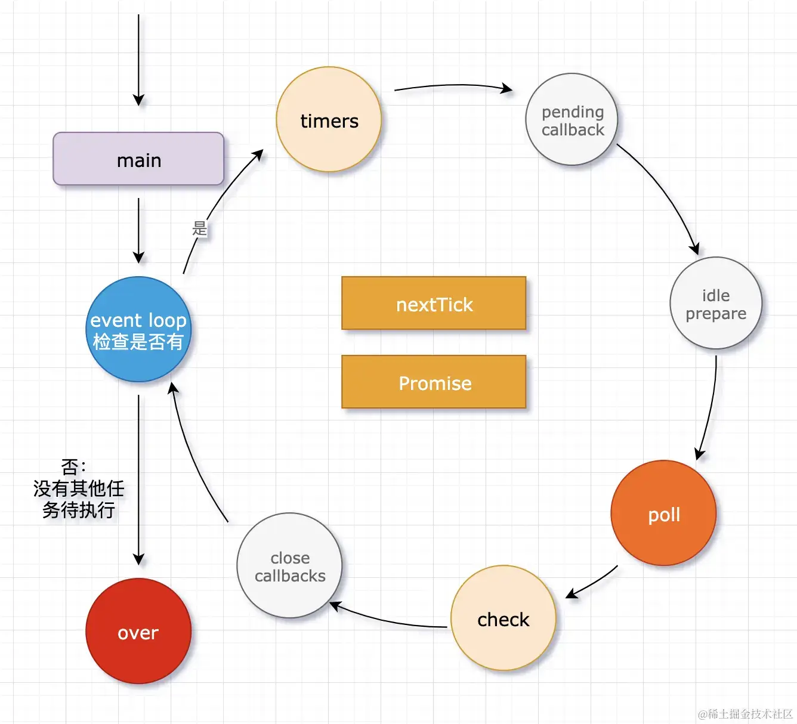

+++
title = "事件循环"
date = '2024-10-01T00:00:00+08:00'
lastmod = '2024-11-08T00:00:00+08:00'
draft = true
weight = 14
tags = ["面试", "前端", "JavaScript", "事件循环", "ecool"]
categories = ["前端开发", "面试"]
source = "https://fe.ecool.fun/knowledge-learn"
+++
## 单线程的 JavaScript

### 同步与异步

JavaScript 在设计之初是作为**浏览器脚本语言**，主要用于与用户进行**页面交互**和**操纵 DOM**。因此，为避免由不可预测的用户操作可能带来的复杂的并发问题，JavaScript 只能设计成**单线程**的，这也是这门语言的核心特征之一。

> JS 的宿主环境通过仅提供一个线程运行 JS 来保证 JS 代码的单线程运行。

单线程意味着 JS 引擎在同一时间只能做一件事情，即**同步**地执行代码。但在代码执行过程中不可避免地会遇到一些**无法立即执行**的任务，例如：

- 计时器到达时间后要执行的任务 --- `setInterval`、`setTimeout`
- 网络请求完成后要执行的任务 --- `XMLHttpRequest`、`Fetch`
- 监听到用户操作后要执行的任务 --- `addEventListener`
- ... ... ...

如果让执行 JS 的线程去处理这些任务，就会导致该线程处于**长期阻塞**的状态，而宿主环境中的 JS 执行线程往往还承担着极其重要的工作。例如，在浏览器中，如果执行 JS 的线程长期阻塞，就会导致浏览器卡死！

为避免上述情况发生，JS 的宿主环境使用了**异步**的方式来处理这种无法立即执行的任务。

当遇到异步任务时，宿主环境会将其交给**其他线程**处理，执行 JS 的线程则会立即结束当前任务转而去执行后续代码。

### 事件循环

事件循环是宿主环境处理 JS 异步操作，让其能够**非阻塞式运行**的机制。

不同宿主环境对事件循环的实现方式有所不同，不过在核心机制上大同小异。

接下来，本文将详细描述 JavaScript 在**浏览器**和 **Node.js** 这两个宿主环境中的事件循环机制。

## 浏览器事件循环

### 浅谈浏览器

聊浏览器的事件循环之前，我们先说说浏览器本身。

现代浏览器是一个**多进程多线程**的应用程序，内部工作极其复杂，其程度直逼操作系统。它拥有数个功能模块，为避免单个模块崩溃牵连其他模块，导致连锁反应，使浏览器彻底崩溃。浏览器在启动时，会开启多个进程，把不同的功能模块放在**不同的进程**里。



浏览器进程众多，其中比较**重要**的有：

📚 浏览器进程

浏览器进程是浏览器的**主进程**，无论打开多少浏览器窗口，它仅有**一个**。

它主要负责浏览器**界面显示**、**用户交互**和**进程管理**。

> 这里说的界面和交互，不是视窗内的网站界面。而是指浏览器本身自带的部分，如导航栏、书签栏、刷新按钮等。

刚打开浏览器的时候只有一个浏览器进程，其他进程都是它创建的。

📚 网络进程

网络进程主要负责处理网站的**数据请求和响应**，通常情况下，它与**渲染进程**的交互最为密切。每当网站需要进行资源请求，渲染进程就会将任务交给网络进程处理，网络进程取得响应结果后再返回给渲染进程。

网络进程内部会开启多个线程，以实现**多网络请求**的**异步化处理**。

📚 渲染进程

渲染进程负责控制和显示**视窗**部分（网站页面）的所有内容，主要是解析 HTML、CSS、JS 和其他资源，并生成渲染树、执行布局和绘制等操作。

在现代浏览器中，默认会为**每个标签页**创建一个渲染进程。<br>
 出于安全考虑，渲染进程运行在**沙箱模式**下，无法访问系统资源。

> 通常可以通过浏览器的 *更多工具* -> *任务管理器* 查看当前浏览器开启的所有进程及资源消耗情况。



### 浏览器中的 Event Loop

渲染进程启动后，会开启一个**渲染主线程**，它是浏览器中**最繁忙**的线程，需要它处理的任务包括但不限于：

- 解析 HTML、CSS
- 计算样式、布局
- 处理图层、绘制页面
- 执行 JS、执行各种回调函数
- ... ... ...



渲染主线程一个线程要处理好这么多任务，那如何进行**任务调度**便成了重点，而浏览器采用的则是**排队**机制。

浏览器会提供一个**先进先出**的**消息队列**（也称任务队列），用于存储待执行的任务。渲染主线程不断依次从消息队列中拿出任务执行，遇到异步操作则扔给**其他线程**处理，响应结果**再次加入**消息队列等待渲染主线程拿取。如此，所有的任务都能有条不紊地进行，而这个过程便是**事件循环**（也称消息循环）。

💎 事件循环具体过程如下：

1. 从谷歌浏览器源码来看，渲染进程进入渲染流程，渲染主线程便会开启一个**无限循环**。
2. 每次循环都会检查消息队列中是否有任务。<br>
  - *如果有*，就拿出队列中的**第一个**任务执行，执行过程中若遇到**异步操作**，渲染主线程会将其加入其他线程的任务队列进行处理，它自己则不会等待，转而去执行后续代码
  - *如果没有*，则进入**休眠状态**
3. 当其他线程把异步任务处理完成，就会**将后续的回调操作包装成新任务**，加入消息队列末尾，等待渲染主线程拿取执行。
4. 其他所有线程，包括**其他进程**的线程，都可以往消息队列末尾添加任务。当新任务添加时如果主线程处于休眠状态，则会将其**唤醒**以继续循环拿取任务执行。



任务在消息队列里先进先出并没有优先级，而浏览器中消息队列**不止一条**，它们是有优先级的，过去我们把消息队列分为**宏队列**和**微队列**。

宏队列排队**宏任务**（DOM 操作回调、定时器回调、UI 绘制等），微队列排队**微任务**（Promise 回调、...）。渲染主线程的每次循环会**优先**执行并清空微队列任务，再执行宏队列。

不过随着时间推移，浏览器复杂度急剧提升，仅两个队列已经不能满足现代浏览器的需求了。于是，W3C 在制定 [HTML 规范](https://html.spec.whatwg.org/multipage/webappapis.html#event-loops)的时候已抛弃宏队列的说法。

各浏览器厂商在实现事件循环的时候会根据最新的解释：*每个任务都有其任务类型，同一个类型的任务必须在同一个队列里排队。在一次事件循环中，浏览器可根据实际情况从不同的队列中取出任务执行。并且浏览器必须准备好一个微队列，其中的任务优先于所有其他队列的任务执行*。

不同浏览器，除微队列外，队列的种类和数量均可能不同，这取决于浏览器厂商。<br>
 在目前的 Chrome 的实现中，至少包含了下面几个队列：

- 微队列：用于存放需要最快执行的任务，优先级极高，将任务加入微队列的方式有 `promise.then()` 、`MutationObserver`
- 交互队列：用于存放用户操作后产生的事件处理任务，优先级次于微队列
- 延迟队列：用于存放定时器到达后的回调任务，优先级次于交互队列

> 需要特别值得注意的是，人工合成的事件派发，即直接写在代码里的 `dom.click()` 或 `dispatchEvent()`，相对于浏览器而言并不是真正的用户交互，会被当作同步任务执行。
>
> 只有用户动作触发的事件，才会作为异步任务，在事件循环中等待执行。
>
> [MDN 参考](https://developer.mozilla.org/zh-CN/docs/Web/API/EventTarget/dispatchEvent)

下面我们通过一个具体案例，说明浏览器事件循环的过程：

```js
    // 写出下述程序的输出结果
    const btn = document.getElementById('button');
    function test() {
        console.log('function test!');
        Promise.resolve().then(() => {
            console.log('promise1');
        });
    }

    setTimeout(() => {
        console.log('set timer');
        Promise.resolve().then(test);
    }, 0);

    btn.onclick = () => {
        console.log('click button');
    };

    btn.click();

    Promise.resolve().then(() => {
        console.log('promise2');
    });

    console.log('script start');

    // 输出结果依次为：
    // click button
    // script start
    // promise2
    // set timer
    // function test!
    // promise1
```

🔨 结果分析：



1. 执行全局代码，到达 `setTimeout` 交给计时器线程处理，由于等待 0 ms 故立刻加入延迟队列。
2. 到达 `btn.click()`，由于是人工合成的点击事件，直接当同步任务执行，输出 `click button`。
3. 到达 `Promise.resolve().then()`，交给其他线程处理，立即完成并加入微队列。
4. 输出 `script start`，至此同步任务完成，各消息队列的情况为：微队列有 1 个排队任务，延迟队列有 1 个排位任务。
5. 事件循环开始，根据队列优先级，首先渲染主线程拿取并清空微队列任务，输出 `promise2`。
6. 渲染主线程拿取并清空延迟队列任务，输出 `set timer`，遇到第二个 `Promise.resolve().then()`，交给其他线程处理，完成后加入微队列。
7. 渲染主线程无任务可做，进入休眠。
8. 其他线程会立刻完成对第二个 `Promise.resolve().then()` 的处理，并将回调函数 `test` 加入微队列。
9. 微队列出现任务，渲染主线程被唤醒，拿取并清空微队列任务。
10. 执行 `test` 函数，输出 `function test!`，遇到第三个 `Promise.resolve().then()`，交给其他线程处理，完成后加入微队列。
11. 渲染主线程无任务可做，进入休眠。
12. 其他线程会立刻完成对第三个 `Promise.resolve().then()` 的处理，并将回调函数操作 `console.log` 加入微队列。
13. 微队列出现任务，渲染主线程被唤醒，拿取并清空微队列任务。
14. 执行 `console.log` 操作，输出 `promise1`。

## Node.js 事件循环

### Libuv

在 JavaScript 的所有宿主环境中，无论是浏览器还是 Node.js，事件循环机制都不是 **ECMAScript** 的语言规范定义的。浏览器中的事件循环是根据 **HTML 标准**实现的，而 Node.js 中的事件循环则是基于 `libuv` 实现的。

`libuv` 是一个用 C 语言实现的高性能解决单线程非阻塞异步 I/O 的开源库，本质上它是对常见**操作系统底层异步 I/O 操作**的封装。在 nodejs 底层，Node API 的实现其实就是调用的它。

我们知道浏览器事件循环中执行异步任务的其他线程是由浏览器本身提供的，多线程调度是由渲染主线程完成的。而在 nodejs 中，这都是 `libuv` 完成的。

几乎每个 Node API 都有**异步执行版本**，`libuv` 直接负责它们的执行，`libuv` 会开启一个线程池，主线程执行到异步操作后，`libuv` 就会在**线程池**中调度空闲线程去执行，可以说 `libuv` 为 nodejs 提供了整个事件循环功能。



### Node.js 中的 Event Loop

与在浏览器中一样，在 nodejs 中 JS 最开始在**主线程**上执行，执行同步任务、发出异步请求、规划定时器生效时间、执行 process.nextTick 等，这时事件循环还没开始。

在上述过程中，如果没有异步操作，代码在执行完成后便**直接退出**。如果有，`libuv` 会把不同的异步任务分配给**不同的线程**，形成事件循环。在同步代码执行完后，nodejs 便会进入事件循环，依次执行不同队列中的任务。`libuv` 会以异步的方式将任务的执行结果返回给 **V8 引擎**，V8 引擎再返回给用户。



Nodejs 事件循环中的消息队列共有 **8** 个，若引用之前宏队列、微队列的说法，具体可划分为：

- 宏队列<br>
  - timers (重要)
  - pending callback<br>
    - 调用上一次事件循环没在 `poll` 阶段立刻执行，而延迟的 I/O 回调函数
  - idle prepare<br>
    - 仅供 nodejs 内部使用
  - poll (重要)
  - check (重要)
  - close callbacks<br>
    - 执行所有注册 `close` 事件的回调函数
- 微队列<br>
  - nextTick
  - Promise

我们先来说说宏队列中比较重要的 3 个：

📚 timers

`timers`，也就是**计时器队列**，负责处理 `setTimeout` 和 `setInterval` 定义的回调函数。

值得注意的是，不管在浏览器中还是 nodejs 中，所有的定时器回调函数都**不能保证**到达时间后立即执行。一是因为从计算机硬件和底层操作系统来看，计时器的实现本身就是不精准的，二是因为 `poll` 阶段对 `timers` 阶段的深刻影响。因为在没有满足 `poll` 阶段的结束条件前，就无法进入下一次事件循环的 `timers` 阶段，即使 `timers` 队列中已经有计时器到期的回调函数。

📚 poll

`poll` 称为**轮询队列**，该阶段会处理除 `timers` 和 `check` 队列外的绝大多数 I/O 回调任务，如文件读取、监听用户请求等。

事件循环到达该阶段时，它的运行方式为：

- 如果 `poll` 队列中有回调任务，则依次执行回调直到清空队列。
- 如果 `poll` 队列中没有回调任务<br>
  - 若其他队列中后续可能会出现回调任务，则一直等待，等其他队列中后续的回调任务来临时，结束该阶段，开启下一次事件循环
  - 若等待时间超过预设的时间限制，也会自动进入下一次事件循环
  - 若其他队列中后续不可能再出现回调任务了，则立即结束该阶段，并在本轮事件循环完成后，退出 node 程序

> `poll` 阶段的超时时间在进入 `poll` 阶段之前计算。

💎 案例 1：不精准的计时器

```js
    const fs = require('fs');
    const start = Date.now();

    setTimeout(() => {
        console.log('setTimeout exec', Date.now() - start);
    }, 200)

    fs.readFile('./index.js', 'utf-8', (err, data) => {
        console.log('file read');
        const start = Date.now();
        while(Date.now() - start < 300) {};
    })

    // 输出结果：
    // file read
    // setTimeout exec 313ms
```

🔨 分析 1：

1. 进入事件循环后，定时器还没到时间，`timers` 队列空，来到 `poll` 阶段
2. 读取文件需要一定时间，`poll` 队列空，等待
3. 文件读取完成，回调函数加入 `poll` 队列，执行输出 `file read`，开启循环，阻塞 300ms
4. 定时器到时间，回调函数加入 `timers` 队列，由于 `poll` 阶段未结束，被阻塞，等待
5. `poll` 中的循环结束，检测到 `timers` 中有任务，结束 `poll` 阶段，开始下一次事件循环
6. 执行 `timers` 中的回调函数，输出 `setTimeout exec 313ms`，计时器回调函数并没有在计时器到达时立即执行

📚 check

`check` 称为**检查队列**，负责处理 `setImmediate` 定义的回调函数。

`setTimeout` 和 `setImmediate` 的不同之处在于，每次执行到 `timers` 队列时，定时器观察者内部会去**检查**代码中的定时器是否超过定时时间，而 `setImmediate` 则是**直接**将回调任务**加入**到 `check` 队列。

所以总的来说，`setImmediate` 的执行效率要远高于 `setTimeout`，于是也就出现了下面**无法预测**输出结果的情况：

```js
    setTimeout(() => {
        console.log('setTimeout');
    }, 0)

    setImmediate(() => {
        console.log('setImmediate');
    })

    // 上述代码是无法预测先输出那个的
    // 因为即使 setTimeout(xxx, 0)，在计算机运算慢的情况下也不能立刻加入 timers 队列
```

对于微队列的 `nextTick` 和 `Promise`，严格意义上讲也不属于事件循环。在事件循环中，每次打算进入下个阶段之前，必须要先依次反复清空 `nextTick` 和 `promise` 队列，直到两个队列完全没有即将要到来的任务的时候再进入下个阶段。

我们可以通过 `process.nextTick()` 将回调函数加入 `nextTick` 队列，和通过 `Promise.resolve().then()` 将回调函数加入 `Promise` 队列，且 `nextTick` 队列的优先级还要**高于** `Promise` 队列，所以 `process.nextTick` 是 nodejs 中执行**最快**的异步操作。

💎 案例 2

```js
    async function async1() {
      console.log("async1 start");
      await async2();
      console.log("async1 end");
    }

    async function async2() {
      console.log("async2");
    }

    console.log("script start");

    setTimeout(function () {
      console.log("setTimeout0");
    }, 0);

    setTimeout(function () {
      console.log("setTimeout3");
    }, 3);

    setImmediate(() => console.log("setImmediate"));

    process.nextTick(() => console.log("nextTick"));

    async1();

    new Promise(function (resolve) {
      console.log("promise1");
      resolve();
      console.log("promise2");
    }).then(function () {
      console.log("promise3");
    });

    console.log("script end");

    // 输出结果依次为：
    // script start
    // async1 start
    // async2
    // promise1
    // promise2
    // script end
    // nextTick
    // async1 end
    // promise3
    // 剩下的 setTimeout0、setTimeout3、setImmediate 顺序不定
    // 唯一能确定的是 setTimeout0 在 setTimeout3 前输出
    // 而 setImmediate 可能在 setTimeout0 前也可能在 setTimeout3 之后，也可能在两者中间
```

🔨 分析 2：

1. 执行全局代码，输出 `script start`。
2. 到达 `setTimeout(0)` 和 `setTimeout(3)`，交给计时器线程开始计时，注意在线程计时完成前，两个回调任务 `console.log` 还未加入 `timers` 队列。
3. 到达 `setImmediate`，立刻将 `console.log` 任务加入 `check` 队列。
4. 到达 `process.nextTick`，立刻将 `console.log` 任务加入 `nextTick` 队列。
5. 执行 `async1`，输出 `async1 start`。`await async2()` 立刻执行 `async2()`，输出 `async2` 将后续 `console.log` 任务包装成 `Promise.then()` 加入 `Promise` 队列。
6. 执行 `new Promise()`，输出 `promise1`、`promise2`，这两步是同步代码。然后将 `.then()` 里的 `console.log` 任务扔进 `Promise` 队列。
7. 执行最后的 `console.log`，输出 `script end`。
8. 至此同步代码全部执行完毕，消息队列中仍有任务，进入事件循环。

> 梳理一下此时各消息队列的状态：
>
> 已有的输出：`script start`、`async1 start`、`async2`、`promise1`、`promise2`、`script end`<br>
>  `nextTick` 队列：`console.log("nextTick")`<br>
>  `Promise` 队列：`console.log("async1 end")`、`console.log("promise3")`<br>
>  `timers` 队列：`console.log("setTimeout0")`、`console.log("setTimeout3")`<br>
>  `check` 队列：`console.log("setImmediate")`

9. 在进入 `timers` 阶段前先清空微队列，先执行 `nextTick` 队列，输出 `nextTick`。
10. 执行 `Promise` 队列，依次输出 `async1 end`、`promise3`。
11. 进入 `timers` 阶段，由于不确定在到达这个阶段前，计时器线程有没有把完成对 `setTimeout(0)` 和 `setTimeout(3)` 中的一者或两者的时间检查，并将回调函数推入 `timers` 队列，故无法预测它们与 `check` 队列中的 `setImmediate` 谁先输出。

## 常见考点

### 1. **事件循环的基本概念**

- **定义**：事件循环是一种运行时机制，它允许 JavaScript 在单线程环境中处理异步任务。它通过不断检查任务队列来确保代码的顺序执行。

### 2. **执行栈（Call Stack）**

- **定义**：执行栈是一个后进先出（LIFO）的数据结构，用于存储当前正在执行的函数。每当一个函数被调用时，它会被压入栈中；当函数执行完毕后，它会被弹出栈。
- **示例**：<br>
```javascript
function first() {
    console.log('First');
}

function second() {
    console.log('Second');
}

first(); // 执行
second(); // 执行
```

### 3. **任务队列（Task Queue）**

- **定义**：任务队列是存放待执行任务的地方，包括异步操作（如回调函数、事件处理程序等）。当执行栈为空时，事件循环会从任务队列中取出任务并执行。
- **示例**：<br>
```javascript
setTimeout(() => {
    console.log('Timeout callback');
}, 0);
console.log('Synchronous code');
```

### 4. **微任务队列（Microtask Queue）**

- **定义**：微任务队列存放优先级高的任务，如 Promise 的 `.then()` 回调和 `MutationObserver`。微任务会在当前执行栈为空后立即执行，而不是等到下一个事件循环。
- **示例**：<br>
```javascript
Promise.resolve().then(() => {
    console.log('Promise resolved');
});
console.log('Synchronous code');
```

### 5. **事件循环的执行顺序**

- **顺序执行**：事件循环的基本执行顺序为：<br>
  1. 执行栈中的所有同步代码。
  2. 执行微任务队列中的所有任务（直到队列为空）。
  3. 从任务队列中取出一个任务执行。
  4. 重复步骤 2 和 3，直到没有任务。

### 6. **异步操作的处理**

- **异步任务的入队**：当异步操作（如网络请求、定时器等）完成时，其回调函数会被添加到任务队列或微任务队列中，等待执行。
- **示例**：<br>
```javascript
console.log('Start');
setTimeout(() => {
    console.log('Timeout');
}, 0);
Promise.resolve().then(() => {
    console.log('Promise');
});
console.log('End');
```

### 7. **宏任务与微任务**

- **宏任务**：包含 `setTimeout`、`setInterval` 和 I/O 操作等。
- **微任务**：包括 Promise 的回调、`process.nextTick()` 等。微任务的优先级高于宏任务。

### 8. **实践中的应用**

- **UI 更新**：了解事件循环如何影响 UI 更新和用户交互，确保良好的用户体验。
- **性能优化**：避免阻塞事件循环，减少长时间运行的同步代码。

### 9. **性能陷阱**

- **长时间运行的任务**：长时间执行的同步任务会阻塞事件循环，导致界面无响应。
- **避免回调地狱**：使用 Promise 或 async/await 来管理异步操作，避免过深的回调嵌套。

### 10. **调试技巧**

- **使用 Chrome DevTools**：了解如何使用浏览器的开发者工具来监控事件循环、异步操作和性能瓶颈。
