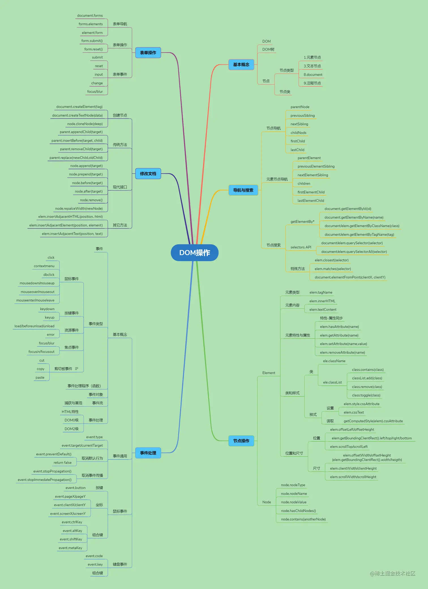
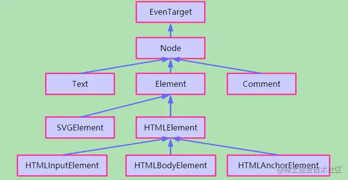
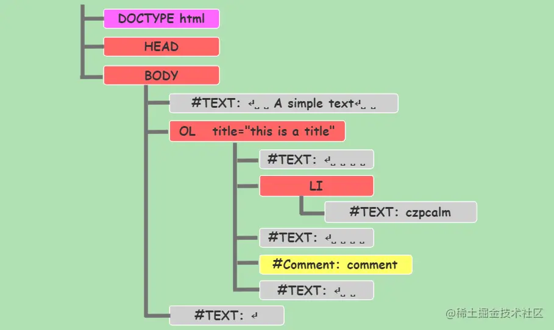
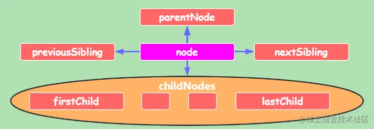
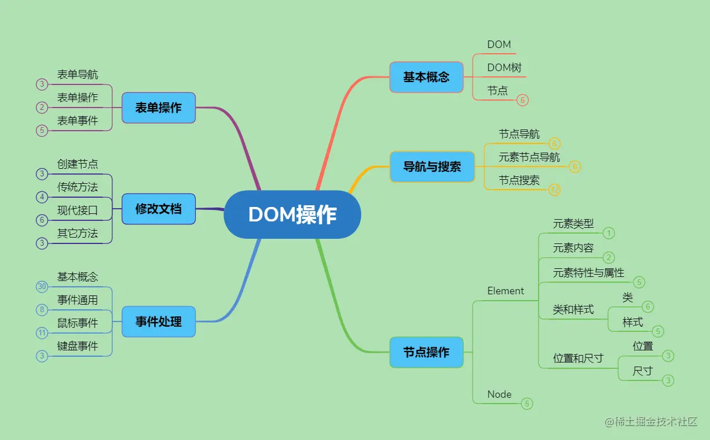

+++
title = "DOM操作"
date = '2024-10-01T00:00:00+08:00'
lastmod = '2024-11-08T00:00:00+08:00'
draft = true
weight = 17
tags = ["面试", "前端", "JavaScript", "DOM操作", "ecool"]
categories = ["前端开发", "面试"]
source = "https://fe.ecool.fun/knowledge-learn"
+++


## 1、DOM基本概念

### 1.1、DOM、DOM节点与DOM树

- **[DOM](https://developer.mozilla.org/zh-CN/docs/Glossary/DOM)**：(**D**ocument **O**bject **M**odel, 文档对象模型)是文档内容（HTML或XML）在编程语言上的抽象模型，它建模了文档的内容和结构，并提供给编程语言一套完整的操纵文档的API。

> 本文面向HTML，不讨论XML等文档，下文中“文档===HTML”。

- **DOM节点**：简称节点（Node），是DOM模型的组成单元。HTML的基本单元是标签，节点**常常**与标签对应，但连续的文本内容也是一个**文本标签**。
- **DOM树**：DOM树是DOM结构的表示形式，DOM把文档的每个节点根据父子关系连接，形成DOM树。

### 1.2、节点、节点类型和节点类

-  **节点**：前面提过，节点是DOM树的组成单元。在JS看来，一个节点就是JS对象。下面用`node`表示任意的节点。 
-  **[节点类型](https://developer.mozilla.org/zh-CN/docs/Web/API/Node/nodeType)**：并非所有的节点都是一样的，DOM规定文档中有12种节点类型，分别用常量`1 ~ 12`（有与之对应的常量名称`Node.XXX_NODE`）表示，可以通过`node.nodeType`属性获取节点的类型常量。 现在，有些类型的节点已经弃用了，常见到的只有几种类型的节点，包括：  
  -  **元素节点**: 类型常量为`Node.ELEMENT_NODE`或`1`。最常见的一类节点，对应文档中的元素。大部分DOM操作都是在元素节点层次的。 
  -  **文本节点**：类型常量为`Node.TEXT_NODE`或`2`。对应文档中的文本，**任何文档内容都有对应的文本节点，即使空格和换行符**。  
> 空格和换行不会对页面内容产生影响，但它们确实以文本节点的形式存在于DOM树中。
  -  **Document节点**：类型常量为`Node.DOCUMENT_NODE`或`9`。它不对应文档的内容，而是作为文档的入口节点，每个文档都有且仅有一个入口，因为这种独特性，赋予一个特殊的变量名称`document`。 
  -  **注释节点**：类型常量为`Node.COMMENT_NODE`或`8`。它对应文档中的注释标签，文档的注释内容也是可读取和修改的。 
-  **节点类**：DOM内置许多节点类，类之间存在继承关系，形成一套节点类框架。每个节点对象都属于节点类，拥有该类和其父类的方法与属性，这使得操作节点十分简单。节点类框架的一部分大概如图：  这些节点上有丰富的属性和方法，是继承的结果，可以看到，一个HTML标签元素至少有四层的继承关系。 以`<a>`标签为例，它属于`HTMLAnchorElement`类，获得了`a.target`，`a.download`等属性，接着继承了`HTMLElement`类上的`title`, `hidden`等属性和`click()`等方法，又从`Element`类继承了`tagName`, `className`等属性和`getAttribute()`, `setAttribute()`等方法，再从`Node`类继承了`nodeType`(前面说过的节点类型), `appenChild()`, `removeChild()`等方法，最后从`EventTarget`类中继承了事件相关的属性和方法。 

> **不要混淆节点类型和节点类这两个概念**。前者是一个生活中的**类别**，后者是编程意义上的**类**。节点对象的`nodeType`属性表示了它的类型，而节点类是该节点的从属的类。因为`Dode`是一个抽象类，所以，如果知道了某个节点从属的类，我们就知道它的节点类型。

> **区分节点与元素节点**。我们经常关心元素节点（简称元素），因为这是一类最常使用的节点，但是并非所有节点都是元素。

### 1.3、探索DOM结构

前面的说法太抽象了，让我们用实际的例子看看文档、DOM树与节点的关系。

[Live DOM Viewer](http://software.hixie.ch/utilities/js/live-dom-viewer/?%3C!DOCTYPE%20html%3E%0A...#)是一个可以根据HTML文档实时查看DOM树的网站。你把下面的例子复制过去，或者自己去探索。

一个简单的HTML文档：

```html
<!DOCTYPE HTML>
<html>
<body>
  A simple text.
  <ol title="this is a title">
    <li>czpcalm</li>
    <!-- comment -->
  </ol>
</body>
</html>
```

它对应的DOM图（颜色区分了节点类型）：



留意这个图，你要注意几点：

-  总共有4种类型的节点，分别是`标签节点`（红色）,`文本节点`（灰色），`注释节点`(黄色)和`DOCTYPE节点`（紫色）。 
-  文档没有`<head>`标签却出现了`HEAD`节点。这是因为HTML必然存在`<html>`，`<head>`，`<body>`标签，不存在时会自动补上。顺便一提，当出现`<table>`标签时，也一定会有`<tbody>`标签。 
-  文档中的文本都会形成文本节点的内容，包括`空格␣`和`换行↵`。第一,`单独的空格和换行都会形成对应的文本节点`；第二，有内容的文本节点的值包含前导和后继的空白。  
> 不是说HTML中的空白字符都被忽略吗？怎么这里又说全都是有效的字符？
>
> 在从文档解析生成DOM树的过程中，HTML中的任何字符都是有效的；不过，在接下去的页面渲染的过程中，空白内容被忽略。所以从文档到页面的整过过程中，空白确实被忽略了。
-  理解DOM树中的父子关系对应文档中的包含（嵌套）关系。一个极佳的类比是文件树，把元素看做文件夹，文本看做文件，文件夹中可以存放文件和新的文件夹，然后一层层深入下去，DOM树也是如此。 

几个原则可以帮我们快速理解这个DOM树的构建：

- `自动补全`, 上面提到的自动添加必要元素，另外，还会自动补齐缺少的关闭标签。
- 文档有的DOM树都有。这个原则要求空白也会有。不过，作为补充的，`<head>`前面的空白会被忽略（历史原因）。
- `<body>`后如果有内容，会被移到`<body>`里面。

## 2、导航与搜索

操作节点前，先要找到节点。导航是从一个节点到另一个节点；搜索是从一个范围中选出满足条件的节点。

### 2.1、节点导航

`Node`的类规定了节点具有的许多属性，方便我们从某个节点中找到跟它相关的另外节点。

顶级节点一般直接获取：

- `document` -- 入口节点。
- `document.documentElement` -- HTML节点。
- `document.head` -- head节点。
- `document.body` -- body节点。

对`node`节点，有以下属性：

-  `node.parentNode` -- 获取节点的父节点。 
-  `node.previousSibling` -- 获取节点的上一个兄弟节点。 
-  `node.nextSibling` -- 获取节点的下一个兄弟节点。 
-  `node.childNodes` -- 获取节点的孩子节点`列表`。没有子节点返回空列表。 
-  `node.firstChild`和`node.lastChild` -- 获取第一个和最后一个孩子节点，同`node.childNodes[0]`和`node.childNodes[node.childNodes.length-1]`。 

> 助记：都是两个单词拼写的。



**这些是属性，不是方法**。不要错误使用bode.childNodes()之类的。

**以上导航是基于节点的**，包括元素节点、文本节点、注释等。如1.3中的例子，`document.body.firstChild`得到的是`A simple text`所在的文本节点。

因为我们经常只关心元素节点，DOM也提供了一组纯元素的导航属性, 对元素`elem`或者节点`node`, 有：

- `node.parentElement` -- 父元素节点，该属性来自`Node`类。
- `elem.previousElementSibling` -- 上一个兄弟元素
- `elem.nextElementSibling` -- 下一个兄弟元素
- `elem.children` -- 孩子元素列表
- `elem.firstElementChild`和`elem.lastElementChild`，第一个和最后一个孩子元素节点

> 助记：children特殊，其它都有Element，没有Node。

> 解惑：`node.parentNode`与`node.parentElement`有区别吗？父节点不应该都是元素节点吗？一般情况下，二者等效，但`html.parentNode === document`, document不是元素节点。

> 提醒：上面的导航属性都是只读属性。`elem.parentElement = anotherElem; 是错误的`。

### 2.2、搜索节点（重点）

经常地，我们总是直接从文档中找出满足某些条件的元素，从而获取到目标元素。

#### 2.2.1、`document/element.getElementBy*()`系列

`getElementBy*`系列方法你们肯定不陌生，但我想要提醒的是，注意我的写法`document/element.getElementBy*()`，表示这是两个不同的类上的方法（参看上面节点类）。

首先，是两个来自`Document`类的方法：

- `document.getElementById(id)` : 根据id获取文档中的元素。
- `document.getElementsByName(name)`: 根据name获取文档中的元素。很少使用。

其次，是`Document`类和`Element`类都具有的方法：

- `document/element.getElementsByTagName(tagName)`: 根据标签名称获取文档或某个元素内的元素。
- `document/element.getElementByClassName(className)`：根据类名获取文档或某个元素内的元素。

> 注意：`没有element.getElementById(id)`。

> 注意：不要忘记或多加了`s`。除了`document.getElementById()`，其它方法的返回结果都是一个集合，没有满足条件的元素则是空集合。

#### 2.2.2、`document/element.querySelectorAll/querySelector()`

现在，推荐使用一组更强大的搜索新方法, 它们支持CSS选择器：

- `document/element.querySelectorAll(CSSSelector)`：返回满足选择器的一组节点列表。
- `document/element.querySelector(CSSSelector)`: 返回第一个满足选择器的元素。

> 补充：`elem.matches(selector)`可以检查某个元素是否与选择器匹配。

#### 2.2.3、两组搜索方法的对比

`querySelector*`源自Selectors API 规范，与CSS选择器结合，更加灵活，强大，[已被所有现代浏览器支持](https://caniuse.com/?search=querySelector)。是现在比较推荐的做法。

`getElementBy*()`源自DOM2标准，被认为是传统接口，老项目中广泛使用。或者需要兼容IE8之前使用。但是有较好的性能，现在仍然有人在用。

> 补充：作为结果的集合。在以集合返回结果的时候，或者返回一个[`NodeList`](https://developer.mozilla.org/en-US/docs/Web/API/NodeList)对象，或者返回一个[`HTMLCollection`](https://developer.mozilla.org/zh-CN/docs/Web/API/HTMLCollection)对象，一般来说，二者都是可迭代的类数组对象，可以通过下标范围或`for...of`遍历。
>
> 注意：大部分结果集，包括`getElementBy*`和`node.childNode`等，都是动态的，即使查询并保存，之后如果修改文档，该结果集也会随之变化。但`querySelectorAll()`返回的结果是静态的。

### 2.2.4、特殊的搜索方法

有一些特殊的元素搜索方法，就我所知有：

- `elem.closest(selector)` -- 在`elemd`的父元素上查找最近一个满足选择器的元素。
- `document.elementFromPoint(clientX,clientY)` -- 返回相对当前视口坐标嵌套最深的（最上方）的元素。

## 3、节点操作

这一节涉及对某个节点的操作，一般不会引起文档内容（DOM树）的变化。

### 3.1、通用节点操作

这些操作基于**[Node](https://developer.mozilla.org/zh-CN/docs/Web/API/Node)**接口，对所有节点都是通用的。

-  **判断节点类型**：`node.nodeType`或`node instanceof <NodeClass>`。两者都可以用于判断节点类型，当需要明确的节点类的时候，只能通过后者。  
```js
node.nodeType === Node.ELEMENT_NODE; //或node.nodeType === 1;
node instanceof Element;       //与上面等效
node instanceof HTMLInputElement;   //判断是否是输入元素
```
-  获取节点名称：`node.nodeName`，对于元素节点，返回对应的标签名称，如`audio`。对其它类型节点，返回#与节点类型字符串，如`#text`, `#comment`,`#document`。也能通过节点名称判断节点类型，但基本不用。 
-  **获取或设置节点值**：`node.nodeValue`，**文本节点或注释节点返回文本内容，元素节点与document节点返回null**。读写属性，支持`node.nodeValue = "A simple text"`。同样的，空白文本也被包含在内容里。  
> 提醒：文本节点和注释节点有一个`data`属性，使用与`nodeValue`相同，但它不是在Node接口上的。
-  判断节点是否拥有子节点：`node.hasChildNodes()`，返回true当节点有子节点时。 
-  判断节点是否拥有特定子节点：`node.contains(childNode)`，返回true当childNode是node的子节点。 

### 3.2、元素节点操作（重点）

大部分情况下我们都是在元素节点上操作它的文本子节点，所以元素是我们最关心的节点，**[Element](https://developer.mozilla.org/zh-CN/docs/Web/API/Element)**接口提供了更多的属性和方法。这里只考虑HTML元素。

> 解惑：那什么时候需要操作文本节点？会看1.3节的例子，`A simple text`的父节点是`body`，但body有其它元素节点。假如没有文本这种类型的节点，很难在body节点上只修改`A simple text`的内容。

-  判断元素类型：`elem.tagName`或`elem.nodeName`，效果一样，返回标签的字符串，如`audio`。另外，使用`instanceof`可以实现不同级别的类型判断。 
-  元素内容：有几个属性和元素内容相关：  使用区别请参看[实验探究innerHTML，innerText，textContent的使用区别](https://juejin.cn/post/6874822868304134158)。 
  -  `elem.innerHTML` -- 获取或设置元素内的HTML片段。**设置的内容会被当成HTML片段解析，可能会引起文档结构的变化。**  
> 注意：HTML片段内的脚本不会执行。
  -  `elem.textContent` -- 获取或设置元素的文本内容（标签被忽略）。设置的文本以安全模式（不会被解析）写入。 

#### 3.2.1、元素的特性和属性

**特性**（attribute）是指html中写在标签内的特性，而**属性**（property）是只元素节点作为编程对象具有的属性。

-  `特性 -- 属性同步机制`：对标准规定的特性，元素对象具有响应的读写属性, 如`a.href`。这种机制极大的方便了在JS中获取或修改元素的特性。  
> 提醒：对不同HTML元素，规定的特性不同，属性也就不同，如: 存在`a.href`但不存在`div.href`。
-  通用的特性操作接口：  
  - `elem.hasAttribute(name)` -- 检查是否存在某个特性。
  - `elem.getAttribute(name)` -- 获取某一特性的值。
  - `elem.setAttribute(name, value)` -- 设置某一特性。
  - `elem.removeAttribute(name)` -- 删除某一特性。
  - `elem.attributes()` -- 获取所有的特性对，每个特性对具有`name`,`value`属性。
-  特殊的`data-*`：[data-*](https://developer.mozilla.org/zh-CN/docs/Web/HTML/Global_attributes/data-*)特性是一种合法且安全的传递自定义数据的方式。可通过`elem.dataset.name`读取或修改data特性的值。属性名称采用驼峰写法，如elem上的`data-apple-price`对应`elem.dataset.applePrice`。 

#### 3.2.2、元素的类和样式

修改样式有两种方式，一是把样式写到某个类里，然后在代码中修改元素的类，一是直接修改`elem.style.*`。前者适用于随状态改变样式的情况，在代码可维护性上更加，用得较多。后者适用于频繁计算或切换的样式。

- `elem.classList`: 一个包含elem所有类的可迭代的类数组对象。这个对象有几个方法，方便我们改变元素的类。  
  - `elem.classList.contains(class)` -- 检查是否有某个类。
  - `elem.classList.add(class)` -- 添加某个类。
  - `elem.classList.remove(class)` -- 移除某个类。
  - `elem.classList.toggle(class)` -- 切换某个类，如果有就删除，没有就添加。
- `elem.className`: 一个读写属性，把元素的class特性当成一个整体看待。如HTML中某个元素elem存在特性`class="first red"`，那么`elem.className`的值为`first red`。

> 区分：通过`elem.classList`或`elem.className`都可以对元素的类进行改动，前者更加灵活，且具有相应的方法，后者是一个整体的字符串属性，适合删除所有的类重新设置。

如果需要直接设定元素的样式，可以设置`elem.style.*`。

```js
elem.style.width = "20px";     //设置元素宽度
elem.style.backgroundColor = "red";     //设置颜色
```

> 提醒：多词CSS属性的转化方式也是驼峰写法，如`padding-left`对应`elem.style.paddingLeft`，`-webkit-border-radius`对应`elem.style.WebkitBorderRadius`，`-`意味着大写。

> 补充：经常使用`node.hidden = true`实现节点隐藏，也能用于隐藏文本，在元素上，它的效果与`elem.style.display:none`一致。

这种方式实际上是通过元素上的`style`特性实现的，它的优先级高于一般的CSS，所以都是有效的，除非你在其它地方用了`!important`。`elem.style.*`也是可读取的，**但是它们只会读取元素中`style`特性存在的属性，**对其它CSS是无效的。但我们往往需要的是最终应用在元素的样式数值。这种时候，需要使用

- `getComputedStyle(elem)` ：获取元素最终应用的样式，它返回一个样式对象，比如，可通过`getComputedStyle(elem).backgroundColor`获取颜色值。

> 注意：`getComputedStyle`不支持简写属性，如getComputedStyle(elem).padding是无效的。

```html
<style>
    div {
        font-size: 20px;
    }
</style>
<div id="div" style="padding:20px;">
    czpcalm
</div>
<script>
    console.log(div.style.fontSize);   //""    style特性上没有该CSS属性，所以为空
    console.log(div.style.padding);     //20px
    console.log(getComputedStyle(div).fontSize);   //20px
</script>
```

如果需要`清除代码设定的样式`, 可以把`elem.style.cssAttr`设为`""`(空字符串)，副作用是原来html中的特性样式也会被清除。

还有一种基本不会使用的重写整个元素style特性的方式`elem.cssText = csstext`，csstext不包含选择器和花括号。

#### 3.2.3、元素的位置和尺寸

当设计元素的大小变化或位置移动时，我们需要获取元素的位置或尺寸。设置则用CSS方式设置。

位置是相对于参照物的，一个元素，有`相对于定位父元素`，`相对于视口`，`相对于文档`三种关系位置。

> 提醒：定位父元素是指CSS定位元素（position为relative，absolute，fixed）或td，th，table元素，或者是body元素。

-  相对于定位父元素：`elem.offsetLeft/offsetTop` ，相对于参照父节点的左/上边距。`elem.offsetParent`获取元素的定位父元素。 
-  相对于视口：**[elem.getBoundingClientRect()](https://developer.mozilla.org/zh-CN/docs/Web/API/Element/getBoundingClientRect)**获取元素的定位矩形`elemRect`。  
  - `elem.getBoundingClientRect().left/top/right/bottom`分别表示元素盒子（含边框）四角到视口左或上边的距离。
  - `elem.getBoundingClientRect().width/height`, 与`elem.offsetWidth/offsetHeight`等效，盒子的宽高。
  - `elem.getBoundingClientRect().x/y` ，一般情况下，与`elem.getBoundingClientRect().left/top`等效，且不兼容IE，不推荐使用。
-  相对于文档：没有直接获取的方式，但可以通过`相对于视口+滚动距离`简单计算。  
  - 盒子上方相对于到文档的距离：`elem.scrollTop + elem.getBoundingClientRect().top`。
  - 盒子左边到文档的距离：`elem.scrollLeft + elem.getBoundingClientRect().left`。

元素盒子的尺寸也有多种情况，需要考虑边框、内边距、是否为标准盒子模型、甚至是否有滚动条。

-  含边框的盒子尺寸：`elem.offsetWidth/offsetHeight`或者`elem.getBoundingClientRect().width/height`都可以获取含边框的宽高。 
-  边框宽度：`elem.clientLeft/clientTop` -- 元素左上角边框的宽度。可以理解为左边框宽度和上边框的宽度，如果存在滚动条，也包含滚动条的宽度。  
> 补充：一般来说，上边框和左边框是常用的。如果四条边框宽度不一，可以通过`getComputedStyle(elem).borderRight`获取，注意这是含单位的字符串。
-  `elem.clientWidth/clientHeight` -- 内容宽度高度，包含padding，不包含滚动条。 
-  不含边框：`elem.clientWidth/clientHeight`，获取元素盒子内容宽高，不含边框和滚动条，含padding。 
-  内边距问题与盒子类型：在涉及内边距的时候，需要`getComputedStyle(elem)`方法获取，并且需要考虑是否为标准盒子。 

如果元素的内容存在滚动时，我们可能需要知道与滚动相关的尺寸：

-  `elem.scrollLeft/scrollTop` -- 水平和垂直方向上滚动的长度。可写属性，通过设置该值改变控制内容滚动。 
-  `elem.scrollWidth/scrollHeight` -- 元素内容的长度和宽度，包括滚动的内容。  
> 区分：在没有内容溢出发生滚动时，`clientWidth/Height`与`scrollWidth/Height`等效；存在滚动时，前者是盒子的可视内容大小，后者是内容的大小，包括需要滚动查看的部分。

关于位置和尺寸，没有图片难以说清，不理解请参看：

- [现代Javascript教程：元素大小与滚动](https://zh.javascript.info/size-and-scroll)
- [现代Javascript教程：坐标](https://zh.javascript.info/coordinates)
- [位置与尺寸探究](https://codepen.io/czpcalm/pen/yLOQroM)

## 4、修改文档（重点）

DOM操作中，经常需要修改文档结果或内容。这类操作涉及节点的插入、移除、替换等。

文档的操作有一套广泛使用的传统方法。也有一套新推出的API方法，它们更加灵活易用，但IE不兼容。

### 4.1、插入节点

插入节点可以分三步走：

1.  创建一个节点：  
  - 创建一个元素节点: `let elem = document.createElement(tagName)`。
  - 创建一个文本节点：·`let text = document.createTextNode(data)`。
  - 从已有节点克隆：`let dupNode = node.cloneNode(deep)`, deep为true表示深拷贝，常用。默认为false。
2.  编辑节点的属性和内容 
3.  把节点插入文档树中  
  -  传统方式：传统方式需要在父节点上执行对节点的插入  
    - `parentNode.appendChild(node)` -- 把node作为最后一个子节点插入。
    - `parentNode.insertBefore(node, nextSibling)` -- 在nextSibling之前插入node。
  -  现代方式：可以实现多位置插入，你可以在父节点上执行插入或在兄弟节点上执行插入。   
    -  `parentNode.prepend(...nodes or strings)`。在第一个子节点之前插入。 
    -  `parentNode.append(...nodes or strings)`。在最后一个子节点之后插入。 
    -  `nextSibling.before(...nodes or strings)`。在本节点之前同级插入。 
    -  `previousSibling.after(...nodes or strings)`。在本节点之后同级插入。 
> 提醒：参数的形式说明它们支持一次插入多个，并且字符串会作为文本节点插入。

有一种情况，我们希望直接描述节点的插入HTML代码段，这种时候，可以使用之前的`elem.innerHTML`属性, 或者使用**[elem.insertAdjacentHTML(position, html)](https://developer.mozilla.org/zh-CN/docs/Web/API/Element/insertAdjacentHTML)**进行插入。其中，`position`的可选值有：`"beforebegin"`, `"afterbegin"`, `"beforeend"`, `afterend`.

> 区分：**节点对象存在不同于节点在文档树中**。前者只是在代码中可以通过node等变量名称引用节点，但创建一个节点，并不会对文档树结构有影响，只有插入文档树后，节点才成为文档的一部分。反之，从文档中移除节点，并不会导致节点变量实效，它还是存在，可以继续被修改，并在某个时间点重新插入文档中。

### 4.2、移除节点

从文档树中移除更加简单。

1. 找到需要移除的节点。参考节点导航与搜索小节。
2. 移除节点：`node.remove()`，移除节点。但IE不兼容，需要使用传统方式，获取其父节点，在父节点上移除子节点：`node.parentNode.removeChild(node)`。

### 4.3、替换节点

与移除类似，使用`node.repalceWith(...nodes or strings)`，同样IE使用`parentNode.replaceChild(newNode, node)`。

## 5、事件处理

### 5.1、基本概念

- `事件`是某事发生的信号, 所有的DOM对象都具有这些信号。
- `事件处理程序`是当一个事件信号发生时运行的函数，用于对事件作出响应。
- `事件处理`就是为事件分配正确的处理函数，在事件发生时作出正确处理。
- `事件类型` 是事件的分类，[常见的事件类型有](https://developer.mozilla.org/zh-CN/docs/Web/Events#%E6%9C%80%E5%B8%B8%E8%A7%81%E7%9A%84%E7%B1%BB%E5%88%AB)  
  - 鼠标事件：`click`, `contextmenu`, `dbclick`, `mousedown`, `mouseup`,`mouseover`, `mouseout`等。
  - 键盘类型：`keydown`, `keyup`
  - 焦点事件：`focus`, `blur`, `focusin`, `focusout`,
  - 表单事件: `submit`, `reset`
  - 剪切板事件: `cut`, `copy`, `paste`
  - 资源事件：`load`, `unload`, `error`, `abort`
- `事件对象`是事件在编程上的对象，具有很多和事件相关的属性。常常在处理函数调用时自动作为参数传入。

### 5.2、事件流

**假设一个div元素中放了一个button元素，如果点击了button，算不算点击了div？如果算，是先点击了button还是先点击了div？**因为元素的嵌套关系，使得事件的产生对象往往是嵌套的，而不是独立的，在上面的中，还有body元素，html元素，甚至整个文档document。

第一个问题，对大多数的事件来说，应该是肯定的，一个在子元素上发生的事件，也看做在该元素上发生了。

第二个问题，也被看成`事件流`问题，即如何确定事件在节点中的传播顺序。巧的是，当年IE和Netscape分别提出了`事件冒泡`和`事件捕获`这两个几乎完全相反的概念。

- 事件冒泡：事件从最小的发生对象开始依次往外围对象冒泡。即`button->div->body->html->document`。
- 事件捕获：事件从整个文档开始依次向最小目标捕获。即`document->html->body->div->button`。

为了统一这两种观点，DOM事件规范提出了3阶段的事件流：`事件捕获阶段->目标阶段->事件冒泡阶段`。

然而，事件捕获阶段很少被使用，下面的讨论会忽略事件捕获，默认事件从目标上开始冒泡。

> 注意：并非所有事件都会冒泡。

### 5.3、事件处理函数

#### 5.3.1、3种事件处理方式

有3种为设置事件处理函数的方式：

1. HTML特性处理：在HTML元素标签中使用`on<event>`特性。
2. DOM0级事件处理：把处理函数赋给节点的对象的`on<event>`属性。
3. DOM2级事件处理：使用`node.addEventListener(event, handler, capture)`和`removeEventListener(event, handler)`。`capture`是一个布尔值，表示是否在捕获阶段响应。

> 对比：HTML特性的方式具有很大的局限性，代码量限制，维护性差，某些事件不支持等。DOM0级事件也对某些事件不支持，关键在于无法为一个事件类型分配多个处理函数。DOM2解决了这些问题，是最通用的方式，推荐使用。

```html
<div id="div1" onclick="alert(event.type+': div1')">div1</div>
<div id="div2" onclick="handler('div2',event)">div2</div>
<div id="div3">div3</div>
<div id="div4">div4</div>
<script>
    function handler(message, event) {
        alert(event.type + ": " + message);
    }

    div3.onclick = e => handler("div3", e);  //处理函数具有多参数，需要嵌套调用。

    div4.addEventListener("click", e => handler("div4", e), false);
</script>
```

上面的例子中, div1和div2使用了HTML特性添加事件处理，div3使用DOM0级事件处理，div4使用DOM2级事件处理。

**HTML特性的内容会成为事件处理函数的内容，DOM事件处理赋值的是函数对象**。比如对一个处理函数`func`，特性上的写法是`onclick="func()"`，而DOM0级事件处理的写法是`node.onclick=func`。区分它们的主要点在于理解特性的内容会被套上一个函数外壳，然后成为处理函数。`onclick="func()"`最后的效果是：

```js
node.onclick = function(event){   //传递的事件参数名为event
    func();         //这一行是来自特性
}
```

这样，你应该能明白为什么特性上是函数调用，而DOM上是函数对象赋值了。

因为这种设定，还产生两个要注意的点。

第一是事件对象参数`event`，如果你习惯了在DOM事件处理中使用变量名称`e`而不是`event`，那么在特性内容上可能写出类似`e.type`的表达，这是错误的，因为特性传入的事件变量名是`event`。

第二，在试图阻止事件的默认响应的时候，可能会写出这样的代码：

```html
<a href="www.baidu.com" onclick="handler()">百度</a>
<script>
	function handler(){
        /*....处理点击事件*/
        return false;   //返回false阻止跳转
    }
</script>
```

然而点击之后还是发生跳转了，问题出在哪里？让我们看一下最后生成的处理函数：

```js
a.onclick = function(event){
    handler();
}
```

事件处理函数只是调用了`handler`，`handler`返回了false，而事件处理函数并没有理会，所以，外部看来，事件处理函数没有返回值。正确的写法应该是`onclick="return handler()"`或者`onclick="handler();return false;"`。

DOM2级事件处理之前，一个事件只能对应一个事件处理函数。如果你想解除事件处理函数，可以简单的采用`node.on<event>=null`的方式。

DOM2`node.addEventListener()`支持添加多个处理函数，这些处理函数的**执行顺序与添加顺序一致**，可以使用`node.removeEventListener(event, handler)`解除处理函数。

> 注意：`removeEventListener(handler)`必须使用添加时的**同一个函数**，而不是具有相同执行体的函数。
>
> ```js
> node.addEventListener("click", ()=>alert("直接添加函数表达式将无法别移除！"), false);
> let handler = ()=>alert("something")
> node.addEventListener("click", handler, false);
> node.removeEventListerner("click", ()=>alert("somthing"));    //无效，传入的是不同的函数对象
> node.removeEventListener("click", handler);         //成功移除
> ```

#### 5.3.2、事件处理函数的参数

让我们看另一个问题，事件处理函数的参数问题。

我们只编写事件处理函数，函数在事件发生时自动被调用，它的调用语句类似这样

```js
node.handler(event);   //event在这里是实参，这句语句是函数调用
```

我们要根据调用规范自己的`handler`函数。

调用时传入了一个参数，根据JS函数参数的特点，如果在事件处理函数中没有使用到`event`，那处理函数可以不声明这个参数。其次，形参可以使用任何合法变量名，我们可以不函数定义写成`handler(e)`，然后在函数内使用`e`而不是`event`。

它的调用方式决定了`handler`最多只能有一个参数。但在事件处理时确实有需要多个参数的时候，这种时候要使用嵌套的函数调用，如上面的例子。

最后，注意这种调用方式使得函数内部`this === node`。这很有用，方便我们在事件处理的时候获取到事件发生对象的信息。

### 5.4、事件对象

事件对象`event`在调用事件处理函数时自动传入，它具有很多属性和方法，在事件处理的时候大有用处。

-  **`event.preventDefault()`** -- 取消事件的默认行为，只有`event.cancelable`为true时才有效。  
> 补充：如果使用`on<event>`方式添加处理函数，在函数返回false也可以取消默认事件。
-  **`event.stopPropagation()`** -- 停止事件的继续冒泡，上层的事件响应不会再发生。 
-  `event.stopImmediatePropagation()` -- 停止事件继续响应。包括事件冒泡和当前目标的其它处理函数也不会发生。 
-  **`event.type`** -- 事件类型字符串，在使用一个处理函数处理多类事件时，可以判断当前发生的事件类型。 
-  **`event.target`与`event.currentTarget` **-- 事件的最小目标和事件的当前目标。  
> 区分：事件在最小目标上发生，然后往上冒泡的过程中，`event.target`始终不变，指向最小目标，但`event.currentTarget === this`，会随着冒泡过程指向当前正在处理的节点。
-  `event.phase` -- 事件流阶段，整数，1代表捕获，2代表目标阶段，3代表冒泡阶段。 
-  `event.bubbles` -- 布尔值，事件是否冒泡。 
-  `event.cancelable` -- 布尔值，事件是否可取消默认行为。 
-  `event.trusted` -- 布尔值，如果事件是浏览器发生的，为true，如果事件是js代码发生的，为false。 

上面的属性都是**只读**的。

这些属性和方法是通用的，对具体的事件类型，有更多的事件属性和方法，将在每种事件中详细说明。

### 5.5、鼠标事件

鼠标事件是最常见的一类事件，有：

-  `click` -- 鼠标左键**点击**触发，或触摸屏的点击。  
> 提醒：**点击**一次的含义是鼠标**在目标上**按下并松起，如果鼠标按下后滑动到元素外部松起，或者元素位置变化导致鼠标松起时不再元素上方，不能形成有效点击。
-  `contextmenu` -- 鼠标右键点击事件，该事件浏览器一般有默认的菜单，如果需要实现自定义菜单，需要阻止默认行为。 
-  `dbclick` -- 双击鼠标左键。双击具有选择文本的默认行为。 
-  `mousedown/mouseup` -- 鼠标**任意键**按下/松起。 
-  `mouseenter/mouseleave` -- 鼠标进入/离开元素，不会冒泡。 
-  `mouseover/mouseout` -- 鼠标进入/离开元素，会冒泡，进入/离开子元素时也会触发。  
> 区分：`mouseenter/mouseleave`与`mouseover/mouseout`事件类似，但是后者会冒泡，且在进入子元素会触发`mouseout`。
-  `mousemove` -- 鼠标按下后松起前发送移动。 

鼠标点击时，会发生一系列事件，它们具有特定的顺序，以某次双击为例，依次触发事件`mousedown->mouseup->click->mousedown->mouseup->click->dbclick`。

鼠标事件有一些适合获取事件相关信息的属性：

-  鼠标按键：按键属性只对`mousedown/mouseup`有意义，`event.button`，数字`1~5`，代表鼠标上的按键，依次是：鼠标左键，中键，右键，前进，后退。 
-  坐标：它们是事件发生时刻（定点类）的坐标，或者实时的（`mousemove`）坐标。  
  - `event.pageX/pageY` -- 相对于文档的坐标。
  - `event.clientX/clientY` -- 相对于窗口的坐标。
  - `event.screenX/screenY` -- 相对于屏幕的坐标，较少使用。
-  组合键：在鼠标事件发生时，如果下列按键被按下，对应的属性为true。用于在一个事件类型上绑定多种任务。   
  -  `event.shiftKey` -- `shift键`是否被按下。 
  -  `event.ctrlKey` -- `ctrl键`是否被按下。 
  -  `event.altKey` -- `alt键`是否被按下。 
  -  `event.mateKey` -- `cmd键`(Mac专用)是否被按下。 
> 提醒：如果想处理`ctrl键`，应该注意在Mac下使用`cmd键`，所以应该判断`if(event.ctrlKey||event.cmdKey)`。
-  相关目标：`event.relatedTarget`。`mouseenter/mouseleave`和`mouseover/mouseout`事件的属性。如果鼠标从`divA->divB`，在divA上发生mouseout（mouseleave），`event.target === divA`并且`event.relatedTarget === divB`。相反，在divB上发生mouseover（mouseenter），`event.target ===divB`且`event.relatedTarget === divA`。 

这是[一篇鼠标拖放事件的文章](https://zh.javascript.info/mouse-drag-and-drop)，应该能对鼠标事件的使用有所帮助。

### 5.6、键盘事件

键盘事件常常被用于创建各种热键。现在广泛使用的有两类键盘事件：

- `keydown` -- 按下任意键盘触发。持续按住按键会持续触发该事件。
- `keyup` -- 松开任意按键。

> 补充：不要试图监听`Fn键`，它是在比OS更低的级别上实现的，没有键盘事件。
>
> 补充：有一个被取消的`keypress`事件，这里不讨论。

键盘事件最重要的属性是键码，我们常常需要获取键盘的键码，根据按下的键盘做出响应。

-  `event.code` -- 键码。**键码是唯一的**。在按键判断时，经常使用的属性。键码是字符串，常见规则：   
  -  数字键码为`Digit<num>`或`Numpad<num>`(小键盘)。如`Digit2`, `Numpad2` 
  -  字符按键`Key<letter>`, 如`KeyZ`, `KeyA` 
  -  功能键一般为按键名称，如`F4`, `Tab`,`Enter` 
  -  使用`Left/Right`区分左右，左shift的键码为`ShiftLeft`, 右shift的键码为`ShiftRight`。 
> 补充：一个被废弃的`event.keyCode`与`event.code`有同样的功能，但键码是基于数字的。可能在兼容IE时需要用到。
-  `event.key` -- 键。表征按键的**含义**而不是位置。跟是否按下`shift`、键盘语言有关。如按下`z键`时表示字符`z`，而`shift+z`表示字符`Z`。左右shift的`key`也一样。只在使用基于意义的时候才使用`event.key`判断。 

键盘事件也同样支持组合键，可以使用`event.ctrlKey`, `event.shiftKey`, `event.altKey`, `event.metaKey`获取其它按键是否被按下，而不用单独监听它们。

### 5.7、资源事件

有一类与资源相关的事件，认识它们的最好方式是通过页面生命周期：

- `DOMContentLoaded` -- 文档被加载并且DOM树构建完成后（图片、样式可能还未加载）。
- `load` -- 页面内容加载完毕，所有图片、样式资源都已应用。此时进行的操作都是安全的。
- `beforeunload` -- 用户正打算离开，可以在此时讯问用户是否离开，或者保存一些数据。
- `unload` -- 用户已经离开，但仍可以进行少量操作，如释放资源，发送数据。

`load`事件是这里最重要的一个事件。它不仅可以用于确保页面加载完成后执行任务，还可以添加到`img`, `script`, `style`这些节点中，在它们完成资源加载时候进行事件处理。

## 6、番外篇：表单操作

### 6.1、表单导航

表单是一类特殊的元素，需要频繁的获取或修改，所以，通用的节点获取方式上，增加了额外的属性，方便表单操作。

-  `document.forms` -- 获取文档中的表单元素集合。这是一个`命名集合`。命名意味着可以通过表单名称方式`document.forms.formName`获取表单，而集合本身又支持下标方式`document.form[0]`。 
-  `form.elements` -- 获取表单form的输入元素集合，同样，这是一个`动态的`命名集合。可以通过`form.elements.inputName`或者`form.elements[index/inputName]`获取。 
-  `form.inputName`或`form[index/inputName]` -- 获取表单form的输入元素。`form.elements.inputName`的简写。  
> 注意：
>
> （1）radio、checkbox等多个输入共享一个name时，`form.elements.inputName`或`form.inputName`返回一个集合。
>
> （2）无法获取到type为image的输入组件。
>
> （3）如果表单中有`<fieldset>`(输入组)，它会成为一个`form.elements`的一个元素，可进一步通过`fieldset.elements`获取表单组中的输入控件集合。
-  `input.formName` -- 获取输入元素所在的表单。`form.inputName`的反向引用。 

```html
  <form name="myForm">
  	<input type="text" name="user"/>
      <input type="radio" name="sex" value="male"/>
      <input type="radio" name="sex" value="female"/>
  </form>
  <script>
      let form = document.forms.myForm;   //或者document.forms[0]
      let userInput = form.user;          //或者form.elements.user
      let sexInput = form.sex;
      sexInput[0].checked = true;           //选择第一个radio
      console.log(sexInput.value);       //male
  </script>
```

### 6.2、表单基础

根据属性--特性同步，表单对象有以下属性，它们与对应的特性意义相同。

- `form.action`
- `form.method`
- `form.name`
- `form.target`

另外，表单有两个常用的方法：

- `form.submit()` -- 手动提交表单
- `form.reset()` -- 初始化表单内容

一个表单含有多个输入字段，它们可以是`各类型的input标签`，`select标签`，`textarea标签`，`button标签`。每这些表单字段有一些通用的属性（当然还有其它的同步属性）：

- **`input.value`** -- 字段的值。对`type="file"`的input，它是只读的，表示计算机上的文件地址。
- `input.name` -- 字段名称。
- `input.type` -- 字段类型，对`textarea`是`"textarea"`。对`select`是`"select-one"`或`"select-multiple"`。
- `input.tabindex` -- 字段的tab索引。
- **`input.disabled`** -- 字段是否被禁用。
- `input.readOnly` -- 字段是否只可读。

这些属性都是可写的，大大便利了我们对表单元素的操作。

最关键，要数`input.value`，对不同字段，它有不同的用法：

- `button`, `reset`, `submit`类型：表示用于显示的字符串。
- `radio`, `select(单选)`类型：一个与被选中字段value相同的值。
- `textbox`，`select(多选)`类型：一个数组，对应被勾选的选线的值。
- 其它类型：与填写的值一致。

### 6.3、表单事件

有些事件是表单特有的：

- ·`submit` -- 表单提交**前**发生的事件。
- `reset` -- 点击reset按钮时。
- `input` -- 在字段输入任意内容后。
- `change` -- 字段失去焦点后，与之前输入发生变化时。

此外，也有一些事件在表单上发挥了主要作用：

-  `pressdown` 
-  `focus/blur` -- 获得或焦点时，不会冒泡。 
-  `focusin/focusout` -- 获得或失去焦点时，与上类似，但是会冒泡。 
-  `cut/copy/paste` -- 剪切板事件  
> 补充：可以通过`e.preventDefault()`(或返回false)取消剪切板事件默认行为，来禁用页面/输入的剪切板功能。`event.clipboardData`可用于读写剪切板内容。
>
> ```js
> input.addEventListener("past", (event)=>{
>     let data = e.clipboardData;
>     alert("Data in clipboard: " + data+". But you can't paste!");
>     return false;
> })
> ```

### 6.4、表单验证与表单提交

表单客户端验证几乎成为表单最重要的一个功能，这可是JS诞生的缘由呀！

html5提供了一套[表单的验证API](https://developer.mozilla.org/en-US/docs/Learn/Forms/Form_validation)，但个人认为难用且界面依赖浏览器，使用不多，更多是自定义表单的验证方式。

表单验证主要有两种思路，一是在客户完成每个字段输入时，独立验证，每个字段，所有字段都通过后才允许提交操作。这种方式主要利用`change`, `input`等事件。

一是在用户发起提交操作时，对整个表单进行验证，如果不通过则提醒用户更正，阻止表单提交，直到所有字段正确。这种方式主要使用`submit`事件。

## 7、总结



## 常见考点

### 1. **DOM 的基本概念**

- 什么是 DOM？为什么前端开发中需要操作 DOM？
- DOM 树是什么？你能简单描述一下 HTML 如何被解析成 DOM 树吗？

### 2. **DOM 查询与选择**

- 你常用的 DOM 查询方法有哪些？请简要说明 `getElementById`、`getElementsByClassName`、`querySelector`、`querySelectorAll` 的区别。
- 在选择多个相同元素时，如何在 `querySelectorAll` 返回的 `NodeList` 上进行遍历？常用的方式有哪些？

### 3. **DOM 的创建与插入**

- 如何使用 JavaScript 动态创建元素？请描述 `document.createElement` 的用法。
- 你通常如何将新创建的 DOM 元素插入到已有的页面结构中？请举例说明 `appendChild`、`insertBefore` 的使用方法。

### 4. **DOM 的修改与删除**

- 如果你想修改一个元素的内容或属性，通常会使用哪些方法？例如 `textContent` 和 `innerHTML` 的区别是什么？
- 你如何删除一个 DOM 元素？`removeChild` 和 `remove` 方法有什么区别？

### 5. **操作 DOM 样式**

- 如何通过 JavaScript 设置或获取元素的样式？请解释 `style` 属性的使用。
- `classList` 是如何帮助你操作元素的样式类名的？请说明 `classList.add`、`classList.remove`、`classList.toggle` 等方法的作用。

### 6. **事件处理**

- 如何给 DOM 元素绑定事件？请比较 `addEventListener` 与 `onclick` 的不同之处。
- 事件委托是什么？你如何在大型项目中使用事件委托来提升性能？

### 7. **DOM 性能优化**

- 在处理大量 DOM 更新时，如何避免频繁的重绘和重排？有哪些优化技巧？
- 你知道什么是文档片段（`DocumentFragment`）吗？它在批量添加 DOM 元素时有什么作用？

### 8. **虚拟 DOM 与真实 DOM 的对比**

- 什么是虚拟 DOM？你认为它是如何提高性能的？
- 使用真实 DOM 操作和使用虚拟 DOM 操作的区别是什么？为什么现代前端框架（如 React、Vue）更偏向于使用虚拟 DOM？

### 9. **DOM 的实际应用场景**

- 请举例说明你在实际项目中遇到的 DOM 操作需求，以及你是如何实现的。
- 如何在表单验证、弹窗、懒加载等场景中使用 DOM 操作？

### 10. **跨浏览器兼容性**

- 在 DOM 操作中，你遇到过哪些兼容性问题？如何解决这些问题？
- 你对老旧浏览器（如 IE）和现代浏览器在 DOM 操作方面的支持有何了解？
