+++
title = "事件冒泡、事件捕获、事件委托"
date = '2024-10-01T00:00:00+08:00'
lastmod = '2024-11-08T00:00:00+08:00'
draft = true
weight = 18
tags = ["面试", "前端", "JavaScript", "事件冒泡、事件捕获、事件委托", "ecool"]
categories = ["前端开发", "面试"]
source = "https://fe.ecool.fun/knowledge-learn"
+++
`DOM`事件流（`event flow` ）存在三个阶段：事件捕获阶段、处于目标阶段、事件冒泡阶段。

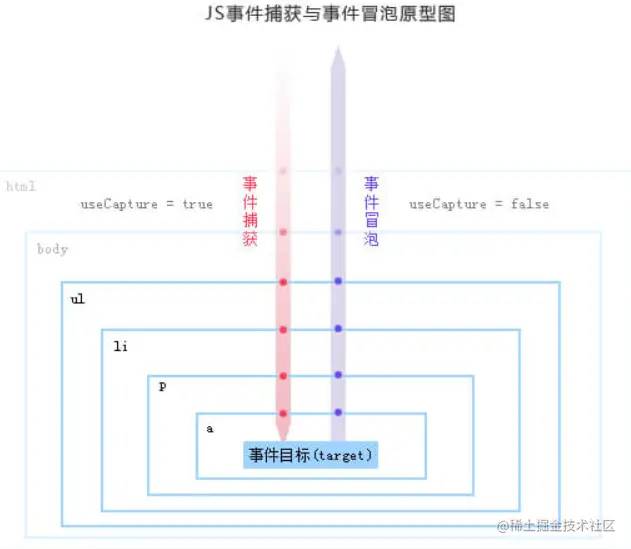

`Dom`标准事件流的触发的先后顺序为：先捕获再冒泡。即当触发`dom`事件时，会先进行事件捕获，捕获到事件源之后通过事件传播进行事件冒泡。

**addEventListener的第三个参数**<br>
 在我们平常用的`addEventListener`方法中，一般只会用到两个参数，一个是需要绑定的事件，另一个是触发事件后要执行的函数，然而`addEventListener`还可以传入第三个参数：

```js
element.addEventListener(event, function, useCapture);
```

第三个参数默认值是`false`，表示在事件冒泡阶段调用事件处理函数;如果参数为`true`，则表示在事件捕获阶段调用处理函数。如果不写第三个参数则默认在事件冒泡阶段调用事件处理函数。

下面先介绍事件冒泡：

## 1. 事件冒泡

`事件冒泡（dubbed bubbling）`：当一个元素接收到事件的时候，会把他接收到的事件传给自己的父级，一直到 `window` （注意这里传递的仅仅是事件，例如`click、focus`等等这些事件， 并不传递所绑定的事件函数。）

事件源 =>根节点（由内到外）进行事件传播。

举例说明：

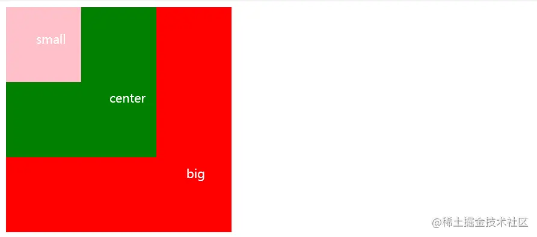

给三个盒子依次绑定点击事件，当点击盒子的时候，会依次触发父级元素的点击事件。 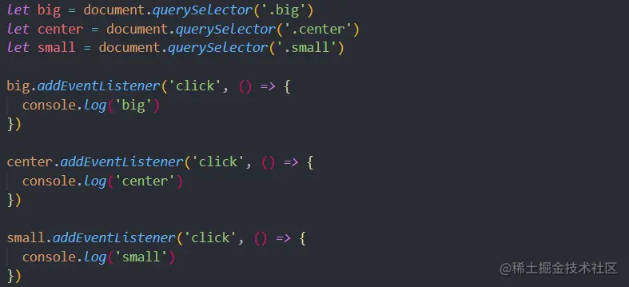

`click small box` 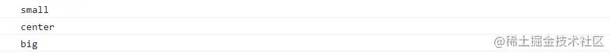

`click center box` 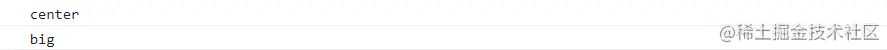

`click big box` 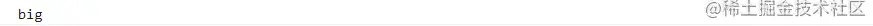

如果父元素没有绑定点击事件则只会触发点击盒子的事件。 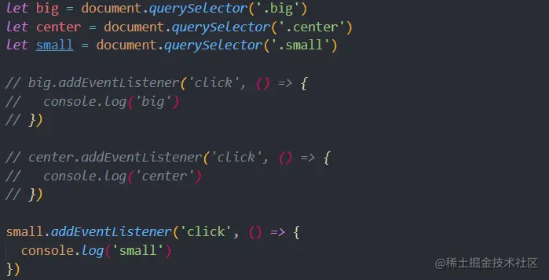

`click small box` 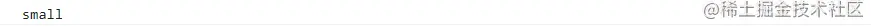

如果子元素（`small`）的点击事件去掉，当我们点击`small`的时候会把当前操作的点击事件传递给父元素（因为父元素绑定了点击函数） 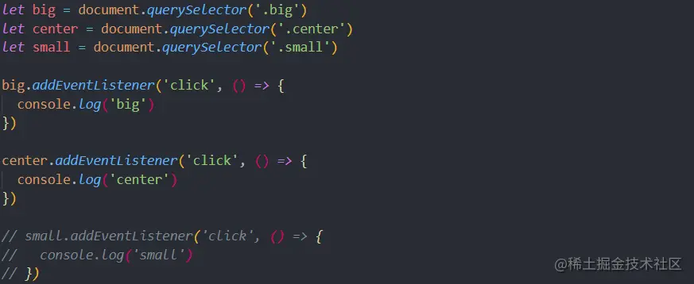

`click small box` 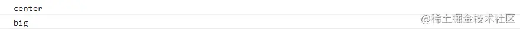

有些时候我们不希望产生事件冒泡，所以可以 **在子事件中加入e.stopPropagation()** 取消冒泡 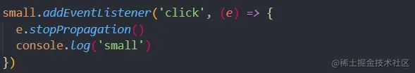

`click small box` 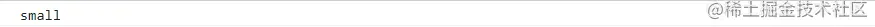

## 2. 事件捕获

`事件捕获（event capturing）`： 当鼠标点击或者触发`dom`事件时（被触发`dom`事件的这个元素被叫作事件源），浏览器会从根节点 =>事件源（由外到内）进行事件传播。

事件捕获与事件冒泡是比较类似的，最大的不同在于事件传播的方向。

还是举上面的例子： 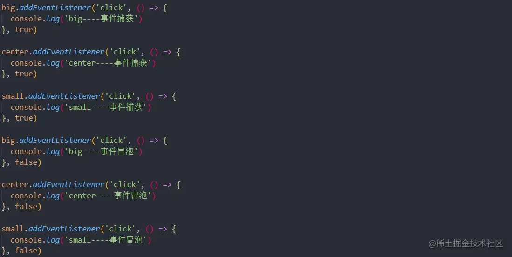

`click small box` 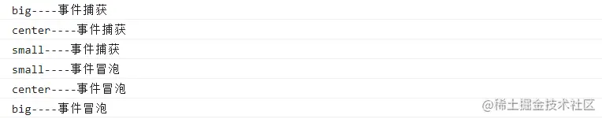

## 3. 事件委托

`事件委托`也称为`事件代理`。就是利用`事件冒泡`，把子元素的事件都绑定到父元素上。如果子元素阻止了事件冒泡，那么委托就无法实现。

原理实现：

```js
不是每个子节点单独设置事件监听器，而是事件监听器设置在其父节点上，然后利用冒泡原理影响设置每个子节点。
```

应用场景：`1000`个`button`需要注册点击事件

如果循环给每个按钮添加点击事件，那么会增加内存损耗，影响性能 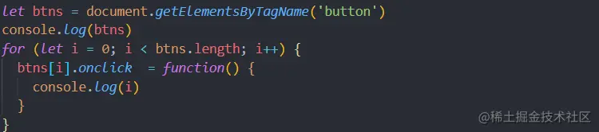

此时可以给`button`的父元素添加点击事件 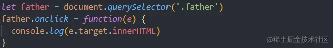

这时相当于每个按钮都绑定了点击事件

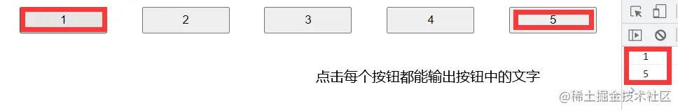

优点：

1.  替代循环绑定事件的操作，减少内存消耗，提高性能。比如：<br>
  - 在`table`上代理所有`td`的`click`事件。
  - 在`ul`上代理所有`li`的`click`事件。
2.  简化了`dom`节点更新时，相应事件的更新。比如：<br>
  - 不用在新添加的`li`上绑定`click`事件。
  - 当删除某个`li`时，不用移解绑上面的`click`事件。

缺点：

1. 事件委托基于冒泡，对于不冒泡的事件不支持。
2. 层级过多，冒泡过程中，可能会被某层阻止掉。
3. 理论上委托会导致浏览器频繁调用处理函数，虽然很可能不需要处理。所以建议就近委托，比如在`table`上代理`td`，而不是在`document`上代理`td`。

## 常见考点

### 1. **事件流的基本概念**

- 什么是事件流？在 JavaScript 中，事件流包含了哪些阶段？
- 请简要说明 **事件捕获** 和 **事件冒泡** 的区别。

### 2. **事件捕获**

- 事件捕获阶段是什么？事件在捕获阶段是如何传播的？
- 如何在捕获阶段监听事件？在 `addEventListener` 方法中，捕获阶段的第三个参数应如何设置？

### 3. **事件冒泡**

- 事件冒泡是什么？它是如何影响事件传播的？
- 在什么情况下你可能希望阻止事件冒泡？如何实现？

### 4. **`stopPropagation` 与 `stopImmediatePropagation`**

- `stopPropagation` 方法有什么作用？请举例说明使用场景。
- `stopImmediatePropagation` 和 `stopPropagation` 有什么不同？它在什么场景下适用？

### 5. **事件委托的概念与应用**

- 什么是事件委托？事件委托是如何利用事件冒泡机制实现的？
- 事件委托的优势是什么？在什么情况下会使用事件委托？

### 6. **事件委托的实现**

- 假设有一个长列表的动态元素（如一个动态添加的 todo 列表），你如何通过事件委托为每个列表项添加点击事件？
- 如何通过 `event.target` 获取具体被点击的子元素？在实际实现中应注意哪些事项？

### 7. **`currentTarget` 与 `target` 的区别**

- 请解释 `target` 和 `currentTarget` 的区别。事件委托中如何使用这两个属性？
- 如何利用 `event.target` 来确定具体触发事件的元素？

### 8. **事件捕获和冒泡的顺序**

- 如果一个元素既在捕获阶段被监听，又在冒泡阶段被监听，事件触发的顺序是什么？
- 在 `addEventListener` 中同时设置 `capture` 为 `true` 和 `false`，如何确保事件的处理顺序？

### 9. **实际开发中的应用场景**

- 在什么场景下，使用事件捕获比事件冒泡更合适？请举例说明。
- 你在项目中使用事件委托优化过哪些复杂的事件处理场景？请描述一个实例并说明效果。

### 10. **事件委托的局限性**

- 事件委托有哪些局限性或可能出现的问题？例如在处理特定事件（如 `focus`、`blur`）时的困难。
- 在事件委托中，如果列表中的某些子元素不希望触发委托事件，你会如何处理？
