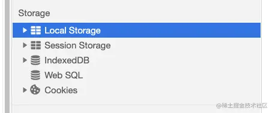
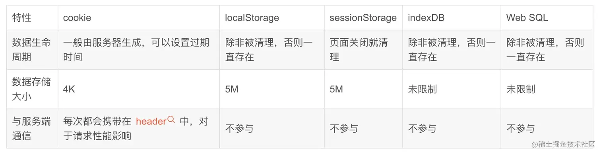
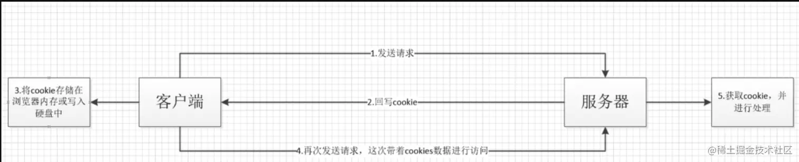
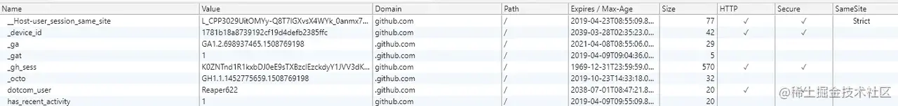
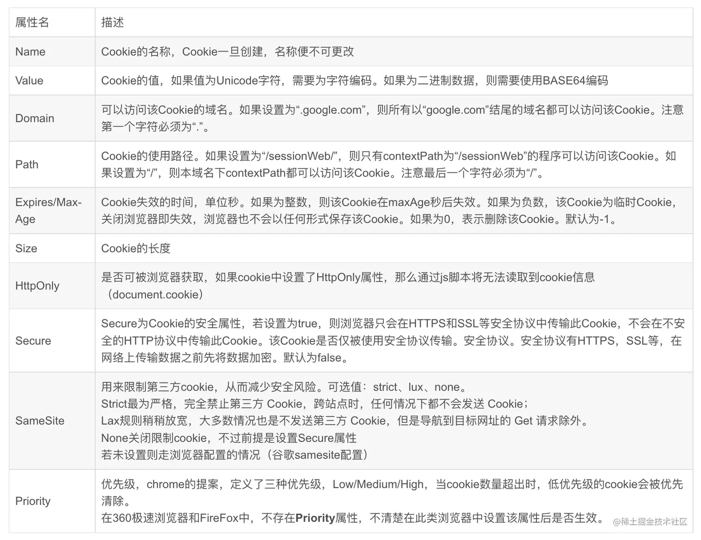
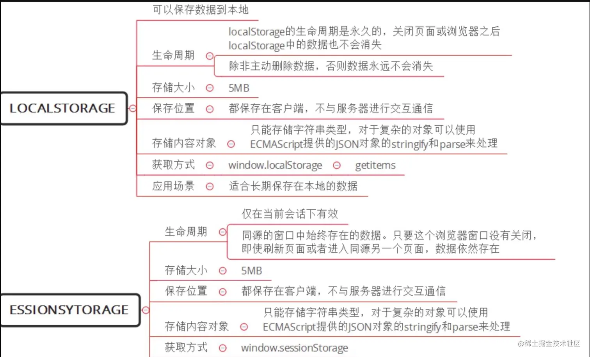
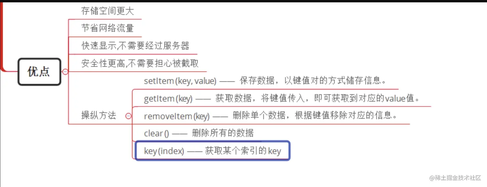

+++
title = "前端存储"
date = '2024-10-01T00:00:00+08:00'
lastmod = '2024-11-08T00:00:00+08:00'
draft = true
weight = 25
tags = ["面试", "前端", "JavaScript", "前端存储", "ecool"]
categories = ["前端开发", "面试"]
source = "https://fe.ecool.fun/knowledge-learn"
+++
## 什么是前端存储

开门见山。前端存储就是通过前端技术来存储一段信息，然后在同源下的不同页面中都可以获取到已存储信息的一种策略。

## 前端存储的作用

- 方便网页的加载，避免了在发送请求收到响应前页面的空白期
- 可以在非强制性要求实时更新时减少向服务端的请求，加快渲染速度
- 在网络不佳或无网时仍有离线数据可以查看

## 有哪些前端存储方案



如图，一共有5种前端存储方案。大致可以分为3类：

- Cookie
- WebStorage：LocalStorage、SessionStorage
- 数据库存储：IndexedDB、WebSQL

先做一个简单对比：



下面我们详细介绍。

## Cookie

Cookie 的工作流程：



Cookie 的构成：





域、路径、失效时间和安全性都是服务器给浏览器的指示，它们不会随着请求发送给服务器，**发送给服务器的只有名称与值的键值对**。

Cookie 的生命周期：

- 如果设定了 Cookie 的过期时间，那么 Cookie 会在到期时自动失效
- 如果没有设定过期时间，那么 Cookie 就是 session 级别的，即浏览器关闭时 Cookie 自动消失

Cookie 的优缺点：

优点：

- 可以控制过期时间，不会永久有效，有一定的安全保障
- 可进行扩展，可跨域共享
- 通过加密与安全传输技术，可以减少 Cookie 被破解的可能性
- 有较高的兼容性

缺点：

- 存储大小最多4KB
- 存储数量根据浏览器或浏览器版本的不同而不同，并且每个域最多20条
- 请求头上的数据容易被拦截攻击
- 存储的数据只能是字符串类型

操作 Cookie：

```javascript
// 设置 Cookie
// Cookie 值必须是字符串类型，并且不支持分号、逗号以及空格，
// 所以有时需要先使用 encodeURIComponent() 进行编码，或者使用 JSON.stringify() 进行序列化
document.cookie = '键1=值1;键2=值2;键n=值n';

// 读取 Cookie
// 有时需要使用 decodeURIComponent() 或者 JSON.parse()
document.cookie

// 修改 Cookie
// 如果键不存在，就新增；否则就修改
document.cookie = '已经存储过的键=新值';

// 删除 Cookie
document.cookie = '要删除的键=任意值;max-age=0';
```

## WebStorage

WebStorage 是 HTML5 新加的，WebStorage（Web 存储） 分为 LocalStorage（本地存储） 和 SessionStorage（会话存储）。

WebStorage 的优势：

- 解决了 Cookie 的一些限制，同时存储一些需要严格控制在客户端且不需要发送给服务器的数据
- 提供了除 Cookie 之外的另一种存储会话的途径
- 提供了一种大容量存储空间来跨会话存储数据的途径

比较一下 LocalStorage 和 SessionStorage 的区别：



WebStorage 跟 Cookie 相比：



## IndexedDB

IndexedDB 是浏览器提供的本地数据库，是 HTML5 新加的，允许存储大量数据，提供查找接口，还能建立索引。这些都是 WebStorage 不具备的。就数据库而言，IndexedDB 不属于关系型数据库（不支持 SQL 查询语句），接近于 NoSQL 数据库，以键值对的形式进行存储，可以快速进行读取操作，非常适合 Web 场景，同时使用 JS 进行操作会很方便。

## WebSQL

WebSQL 是在浏览器端运行的轻量级数据库，WebSQL 类似于 SQLite，更像是关系型数据库，使用 SQL 查询数据。注意，这种本地数据存储方案已经被废弃。

## 常见考点

### 1. **前端存储的基本概念**

- 在前端开发中，为什么需要使用本地存储？本地存储的常见应用场景有哪些？
- 请简要说明常见的前端存储方式有哪些？例如 **LocalStorage**、**SessionStorage**、**Cookies**、**IndexedDB** 等。

### 2. **LocalStorage 和 SessionStorage**

- **LocalStorage** 和 **SessionStorage** 有哪些相同点和不同点？它们各自的适用场景是什么？
- LocalStorage 的存储限制是什么？在不同浏览器中大约能存储多大容量的数据？
- 请解释如何使用 LocalStorage 和 SessionStorage 存储和读取数据。

### 3. **Cookies**

- 什么是 **Cookie**？Cookie 与 LocalStorage、SessionStorage 的区别是什么？
- 请解释 Cookie 中的常见属性（如 `expires`、`max-age`、`domain`、`path`、`secure` 和 `HttpOnly`），这些属性的作用是什么？
- 在前端开发中，什么时候适合使用 Cookie？它主要用于哪些场景？

### 4. **IndexedDB**

- **IndexedDB** 是什么？它适用于哪些场景？
- 请简要说明如何使用 IndexedDB 存储数据？比如数据库的创建、对象存储的创建以及数据的增删改查操作。
- 在需要存储大量结构化数据时，为什么 IndexedDB 比 LocalStorage 更合适？

### 5. **Web SQL（已废弃）**

- 你是否了解 **Web SQL**？它与 IndexedDB 的区别是什么？
- 虽然 Web SQL 已被废弃，你能描述它的工作原理吗？例如它如何使用 SQL 语句操作数据。

### 6. **存储的安全性**

- 如何保障前端存储的安全性？在存储敏感数据时，应该注意哪些问题？
- 为什么不推荐在 LocalStorage 中存储敏感信息（如 JWT）？如何避免 CSRF 和 XSS 攻击导致的安全隐患？
- 在存储敏感信息时，你是否使用过加密？如何通过加密增强存储的安全性？

### 7. **存储的同步与跨页面共享**

- 在单页面应用中，如何实现 LocalStorage 的跨页面共享？LocalStorage 是否会在多个浏览器标签页间自动同步？
- 如果需要在多个标签页间共享数据，你如何通过 LocalStorage 实现监听和更新？（例如 `storage` 事件）

### 8. **前端存储的容量与性能**

- LocalStorage、SessionStorage、Cookie 和 IndexedDB 的容量各是多少？在不同浏览器中有何差异？
- 如果需要存储大量数据，如何在性能和容量上平衡？IndexedDB 与 LocalStorage 在性能上的差异是什么？

### 9. **持久性和过期策略**

- LocalStorage、SessionStorage 和 Cookie 的持久性如何？在什么条件下它们会被清除？
- 如果需要给 LocalStorage 中的数据设置过期时间，如何实现自动清理？

### 10. **使用前端存储的实际案例**

- 在项目中，你是如何选择前端存储的方式？是否考虑过存储的安全性、容量和性能？
- 你遇到过前端存储导致的 bug 或数据同步问题吗？请描述问题以及如何解决的。

### 11. **组合应用与最佳实践**

- 在实际应用中，你是否将不同的存储方式组合使用过？比如将 Cookie 和 LocalStorage 配合使用来优化用户体验和安全性。
- 在大型项目中，如何合理规划前端存储方案？例如数据的层次结构、过期策略以及对不同模块的存储隔离。

### 12. **Service Worker 和 Cache API**

- Service Worker 和 Cache API 可以用于前端存储吗？它们适合存储哪些类型的数据？
- 在实现 PWA（渐进式 Web 应用）时，如何使用 Cache API 缓存资源以实现离线访问？
