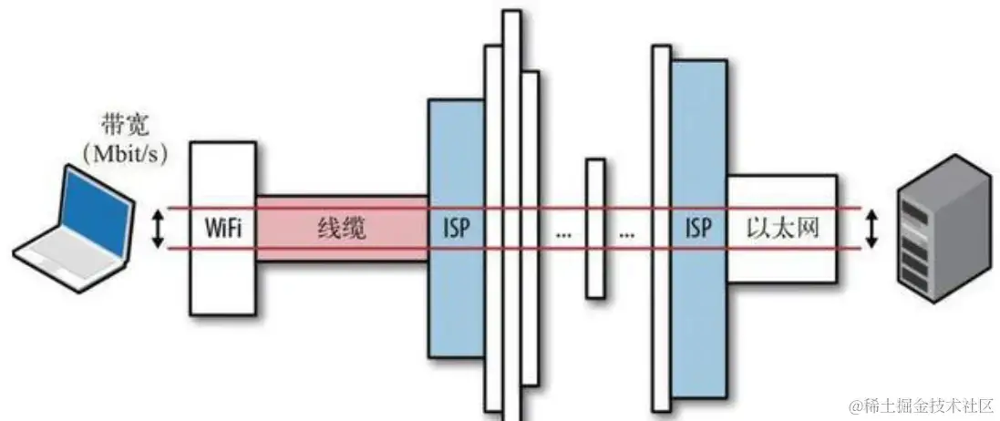
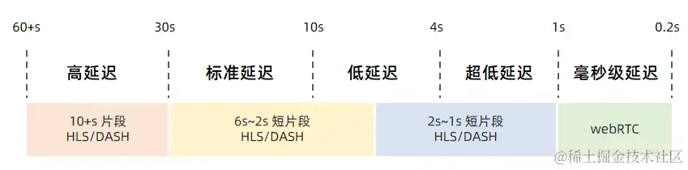
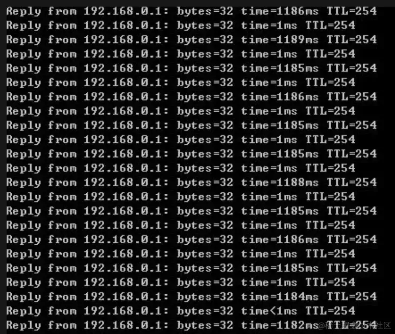

+++
title = "网络延迟和丢包"
date = '2025-07-28T00:00:00+08:00'
lastmod = '2025-08-06T00:00:00+08:00'
draft = true
weight = 14
tags = ["面试", "前端", "计算机网络", "网络延迟和丢包", "ecool"]
categories = ["计算机基础", "面试"]
source = "https://fe.ecool.fun/knowledge-learn"
+++
### 1、什么是延迟呢？

延迟其实就是我们在网页浏览或者使用应用时，从我们点击请求到服务器返回结果给我们之间的时间差。就像你在跟朋友打电话，你说完话后，朋友听到并回应你所说话的时间差一样。

我们的最终目标是创建一个系统，让这个时间差变得尽可能短，也就是实现零延迟。但现实世界中，有各种各样的问题会导致系统出现延迟。如果系统的延迟很低，那么我们请求得到响应的时间就会很短。每次你在浏览器中输入网址或者点击一个链接，浏览器都会向服务器发出一个请求信号，然后服务器需要处理这个请求，获取需要的信息，最后把这些信息返回给你的浏览器。整个过程中就会有一些时间差，这就是延迟。所以，我们要不断努力降低延迟，提高系统的响应速度。

### 2、延迟是怎么回事呢？

延迟其实就是你在请求后需要等待的时间，就像等待快递送到家门一样。来看个例子，更容易理解它是怎么运作的。

想象你正在和一个电子商务网站（比如淘宝）互动，你喜欢一个商品，然后把它加入购物车。现在，当你点击“添加到购物车”按钮时，下面的事情会依次发生：

1. 你点击了“添加到购物车”按钮，这时就像你启动了一个计时器，浏览器开始向服务器发请求。
2. 服务器收到请求，然后开始处理它，就像你的快递订单到了快递中心一样。
3. 服务器处理完后，回应你的请求，信息到达你的浏览器，商品成功添加到购物车中，就像你的包裹送到了家门口一样。

你可以想象在第一步按下了计时器的启动按钮，然后在最后一步停下，这段时间就是延迟。希望这个例子能让你更容易理解延迟是如何运作的。

### 3、延迟都是怎么来的呢？

现在，你应该已经理解了要点，但是你知道是什么造成了延迟吗？网络中的延迟受多种因素影响，它们在确定延迟的具体数值时扮演着关键角色。其中一个主要因素是出站呼叫。回到之前添加购物车的例子，当你点击浏览器上的按钮时，请求会发送到后端的某个服务器，这个服务器可能会在内部调用多个服务来进行计算（可能是同时或者按顺序），然后等待它们的响应或将它们汇总。所有这些因素都会增加呼叫的延迟。但总结起来，主要由以下几个因素引起：

1. **传输介质：** 传输介质指的是信息在起点和终点之间的物理路径。系统的延迟会取决于用于传输请求的介质类型。广域网、光纤电缆等传输介质都广泛应用，但每种介质都有自己的限制，这会影响延迟。
2. **传播延迟：** 这指的是数据包从一个源传播到另一个源所需的时间。系统的延迟很大程度上取决于通信节点之间的距离。节点距离越远，系统的延迟就会越高。
3. **路由器：** 路由器在通信中扮演着重要的角色，它们需要一些时间来分析数据包的标头信息。延迟取决于路由器处理请求的效率。每一次路由器到路由器的跳跃都会增加系统的延迟。
4. **存储延迟：** 系统的延迟还受到所使用的存储系统类型的影响，因为处理和返回数据可能需要一些时间。因此，访问存储中的数据会增加系统的延迟。

### 4、如何测量延迟？

要量化延迟其实很简单，我们有几种常用的方法，让我们来看看最常见的三种：

1. **Ping（网络探测）：** Ping是测量延迟最常用的工具之一。它的原理是向目标地址发送一个小数据包，然后查看接收到响应所需的时间。更快的Ping意味着连接更敏捷，响应更迅速。

1. **Traceroute（路径跟踪）：** Traceroute是另一个用于测试延迟的工具。它也使用数据包，但不止如此，它还会逐一记录数据包从源到目的地经过的每个中间节点所需的时间。这有助于识别网络中的延迟点。
2. **MTR（网络诊断工具）：** MTR是Ping和Traceroute的超级组合。MTR提供了详尽的报告，列出了从一个端点到另一个端点所需的每个网络节点的信息。这份报告通常包括了各种细节，比如丢包率、平均延迟等，非常有助于分析网络性能。

### 5、延迟优化

延迟是系统性能的绊脚石，所以我们需要采取一些措施来进行优化。下面是一些简单又实用的方法，可以帮助我们减少延迟：

1. **采用HTTP/2：** 使用HTTP/2协议可以显著减少延迟。它支持并行传输，最大程度地减少了数据从发送方到接收方的往返次数，这对于降低延迟非常有效。
2. **减少外部HTTP请求：** 第三方服务会增加延迟。通过减少外部HTTP请求的数量，我们可以提高系统的响应速度和质量。
3. **使用CDN：** 内容分发网络（CDN）被证明能够减少延迟。CDN会在全球多个位置缓存资源，从而减少请求和响应的传输时间。这意味着可以从更接近客户端的缓存位置获取请求，而不必每次都回到原始服务器。

1. **浏览器缓存：** 利用浏览器缓存，可以减少向服务器发送的请求次数，从而降低延迟。浏览器会在本地缓存特定资源，这对于提高页面加载速度很有帮助。
2. **优化磁盘I/O：** 为了减小磁盘I/O的影响，我们需要优化算法，尽量减少频繁的磁盘写入操作。可以考虑使用直写式缓存、内存数据库，或者在适当的情况下进行写入合并，还可以考虑使用快速存储系统，比如SSD。

作为开发人员，我们还可以在应用程序级别采取一些方法来优化延迟：

- **避免低效算法：** 高效的算法是代码中延迟的主要来源之一。要尽量避免不必要的循环或昂贵的嵌套操作。
- **避免锁定的设计模式：** 锁定会引入延迟，因此我们应该采用避免锁定的设计模式，特别是在多线程环境中。
- **采用异步编程模型：** 异步编程可以更好地利用硬件资源，因为它避免了阻塞操作，从而减少等待时间。
- **限制无界队列深度：** 限制无界队列深度并提供反压通常可以减少代码中的等待时间，从而产生更可预测的延迟。

这些方法可以帮助我们优化延迟，提高系统性能，让用户获得更好的体验。

## 常见考点

在前端面试中，**网络延迟和丢包**是评估你对网络传输、性能瓶颈及应对策略理解的重要考点。面试官会通过这些话题判断能否从**网络层面**分析问题、优化用户体验，特别是在弱网环境、移动端场景下。

## 一、网络延迟的考点

### 1. 网络延迟的构成

面试官可能会问：“用户输入 URL 后，请求延迟可能发生在哪些阶段？”

| 阶段 | 含义 |
| --- | --- |
| DNS 解析 | 域名 → IP 地址 |
| TCP 建立连接 | 三次握手耗时 |
| TLS 握手 | HTTPS 建立安全连接耗时 |
| 请求发送 | 客户端发送数据 |
| 首字节返回 TTFB | 服务端处理 + 网络传输 |
| 内容下载 | 响应内容下载耗时 |
| 渲染耗时 | 浏览器解析和绘制页面 |

### 2. 常见影响网络延迟的因素

- 地域距离：客户端与服务端物理距离大（如中国访问美国服务器）
- DNS 缓存未命中或 DNS 配置不合理
- TLS 握手过长（HTTPS 开销）
- 带宽瓶颈：文件过大、网络拥堵
- 长连接未复用（未启用 HTTP/2）
- 移动网络抖动高（4G/5G 网络波动）
- 首包延迟（TTFB 过高）

### 3. 如何优化延迟？

- 启用 CDN，部署全球节点，减少 RTT
- 启用 DNS 预解析：`<link rel="dns-prefetch">`
- 启用 HTTP/2 或 HTTP/3，减少连接耗时
- 减少重定向跳转、合并请求
- 使用 `preconnect`、`prefetch` 提前连接目标源
- SSR 提前输出首屏 HTML，减少白屏
- 缓存优化（减少服务端响应压力）

## 二、丢包的考点

### 1. 丢包的本质

网络传输中，部分数据包因**链路拥堵、信号弱、硬件丢包率高**等原因，未能到达目的地。

**TCP**：自动重传（影响性能） **UDP**：直接丢弃（不保证可靠）

### 2. 丢包导致的问题

- **加载失败**：资源文件加载中断（如 JS/CSS/图片）
- **响应延迟**：TCP 重传机制 → 等待时间增加
- **交互卡顿**：重要请求（如接口）多次丢失
- **视频/音频卡顿**：UDP 传输音视频，丢包率影响体验

### 3. 如何应对丢包？

- **使用 HTTP/3（QUIC）**：基于 UDP，内建重传 + 多路复用，丢包影响小
- **合理设置超时重试机制**：接口请求失败时自动重试
- **请求兜底策略**：核心数据失败后提示用户或降级
- **断点续传/Range 请求**：大文件支持分段传输
- **服务端压缩**：减少包体积，降低丢包概率
- **尽量使用 CDN**：就近分发，避免跨境链路

## 三、典型面试问题示例

| 问题 | 涉及知识点 |
| --- | --- |
| TTFB 高可能有哪些原因？ | DNS 慢、服务器响应慢、TLS 握手慢 |
| 如何应对弱网环境下的资源丢包？ | 重试机制、HTTP/3、断点续传 |
| TCP 丢包和 UDP 丢包的区别？ | TCP 重传保证可靠性，UDP 丢就丢了 |
| 为什么 HTTP/3 更适合移动端？ | 快速建连、UDP、丢包影响小 |
| 如果某请求丢包导致加载卡顿，怎么定位？ | DevTools 网络请求状态、失败重试、ping/traceroute |

## 四、总结表格

| 项目 | 网络延迟 | 丢包 |
| --- | --- | --- |
| 本质 | 请求往返耗时（RTT） | 网络数据包未能到达 |
| 表现 | 页面加载慢、白屏、交互延迟 | 请求失败、加载中断、视频卡顿 |
| 影响范围 | 所有请求均可能影响 | 重要资源或关键请求影响更明显 |
| 优化方式 | CDN、预连接、HTTP/2、请求合并等 | QUIC 协议、请求重试、兜底机制 |
| 与协议关系 | TCP/UDP 均有延迟 | TCP 可重传，UDP 丢包不可恢复 |
| 工具定位 | Chrome DevTools、ping、traceroute | DevTools 网络失败、Wireshark |
