+++
title = "高阶组件"
date = '2024-12-17T00:00:00+08:00'
lastmod = '2025-03-14T00:00:00+08:00'
draft = true
weight = 11
tags = ["面试", "前端", "React", "高阶组件", "ecool"]
categories = ["前端开发", "面试"]
source = "https://fe.ecool.fun/knowledge-learn"
+++
## 一 前言

`React`高阶组件(`HOC`)，对于很多`react`开发者来说并不陌生，它是灵活使用`react`组件的一种技巧，高阶组件本身不是组件，它是一个参数为组件，返回值也是一个组件的函数。

高阶作用用于**强化组件，复用逻辑，提升渲染性能等**作用。高阶组件也并不是很难理解，其实接触过后还是蛮简单的，接下来将按照，**高阶组件理解？**，**高阶组件具体怎么使用？应用场景**， **高阶组件实践(源码级别)** 为突破口，带大家详细了解一下高阶组件。

我们带着问题去开始今天的讨论：

- 1 什么是高阶组件，它解决了什么问题？
- 2 有几种高阶组件，它们优缺点是什么？
- 3 如何写一个优秀高阶组件？
- 4 `hoc`怎么处理静态属性，跨层级`ref`等问题？
- 5 高阶组件怎么控制渲染，隔离渲染？
- 6 高阶组件怎么监控原始组件的状态？
- ...

> 高阶组件（HOC）是 React 中用于复用组件逻辑的一种高级技巧。HOC 自身不是 React API 的一部分，它是一种基于 React 的组合特性而形成的设计模式。

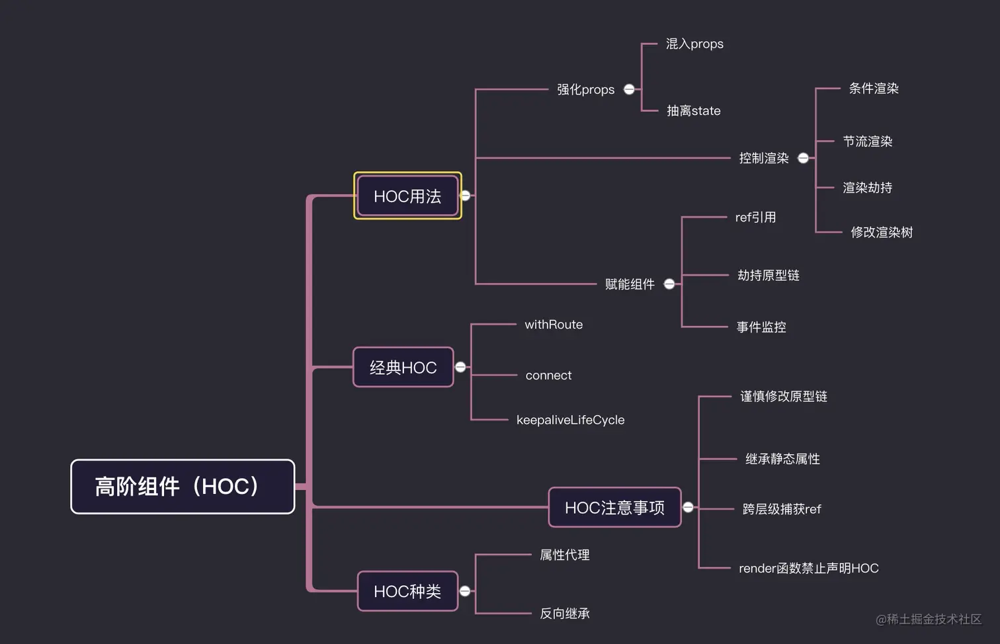

## 二 全方位看高阶组件

## 1 几种包装强化组件的方式

### ① mixin模式

**原型图**

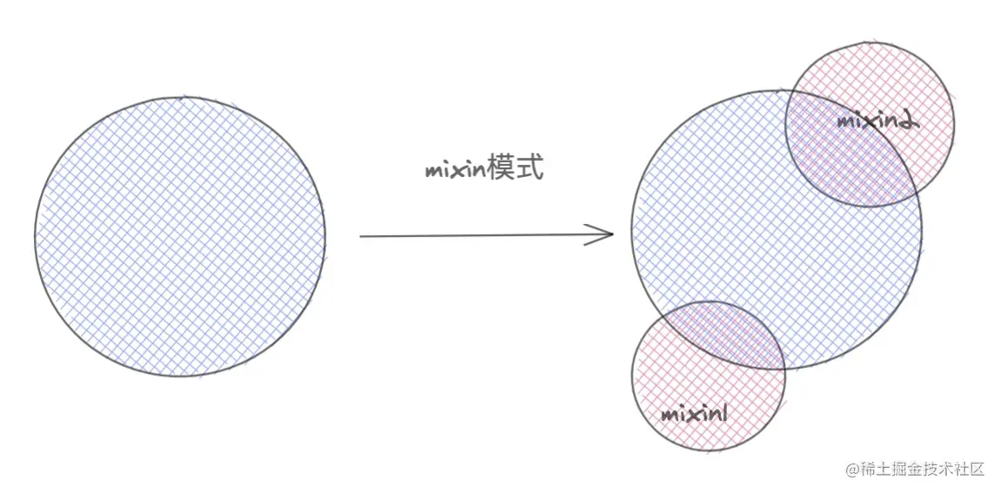

#### 老版本的`react-mixins`

在`react`初期提供一种组合方法。通过`React.createClass`,加入`mixins`属性，具体用法和`vue` 中`mixins`相似。具体实现如下。

```js
const customMixin = {
  componentDidMount(){
    console.log( '------componentDidMount------' )
  },
  say(){
    console.log(this.state.name)
  }
}

const APP = React.createClass({
  mixins: [ customMixin ],
  getInitialState(){
    return {
      name:'alien'
    }
  },
  render(){
    const { name  } = this.state
    return <div> hello ,world , my name is { name } </div>
  }
})
```

这种`mixins`只能存在`createClass`中，后来`React.createClass`连同`mixins`这种模式被废弃了。`mixins`会带来一些负面的影响。

- 1 mixin引入了隐式依赖关系。
- 2 不同mixins之间可能会有先后顺序甚至代码冲突覆盖的问题
- 3 mixin代码会导致滚雪球式的复杂性

#### 衍生方式

`createClass`的废弃，不代表`mixin`模式退出`react`舞台，在有状态组件`class`，我们可以通过**原型链继承**来实现`mixins`。

```js
const customMixin = {  /* 自定义 mixins */
  componentDidMount(){
    console.log( '------componentDidMount------' )
  },
  say(){
    console.log(this.state.name)
  }
}

function componentClassMixins(Component,mixin){ /* 继承 */
  for(let key in mixin){
    Component.prototype[key] = mixin[key]
  }
}

class Index extends React.Component{
  constructor(){
    super()
    this.state={  name:'alien' }
  }
  render(){
    return <div> hello,world
      <button onClick={ this.say.bind(this) } > to say </button>
    </div>
  }
}
componentClassMixins(Index,customMixin)
```

### ②extends继承模式

**原型图**

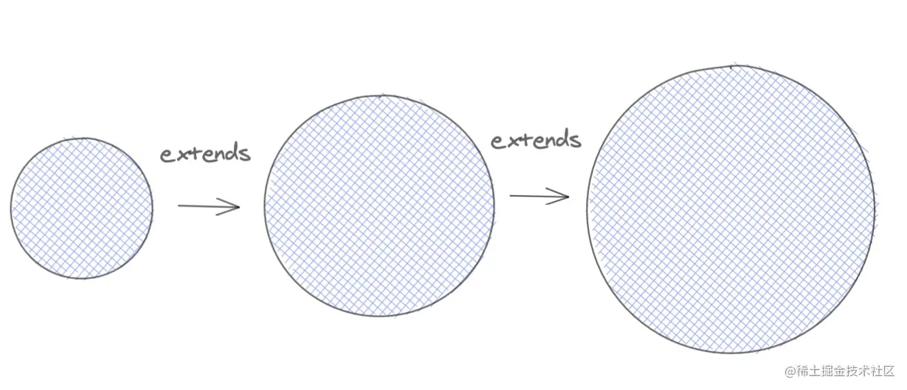

在`class`组件盛行之后，我们可以通过继承的方式进一步的强化我们的组件。这种模式的好处在于，可以封装基础功能组件，然后根据需要去`extends`我们的基础组件，按需强化组件，但是值得注意的是，必须要对基础组件有足够的掌握，否则会造成一些列意想不到的情况发生。

```js
class Base extends React.Component{
  constructor(){
    super()
    this.state={
      name:'alien'
    }
  }
  say(){
    console.log('base components')
  }
  render(){
    return <div> hello,world <button onClick={ this.say.bind(this) } >点击</button>  </div>
  }
}
class Index extends Base{
  componentDidMount(){
    console.log( this.state.name )
  }
  say(){ /* 会覆盖基类中的 say  */
    console.log('extends components')
  }
}
export default Index
```

### ③HOC模式

**原型图**

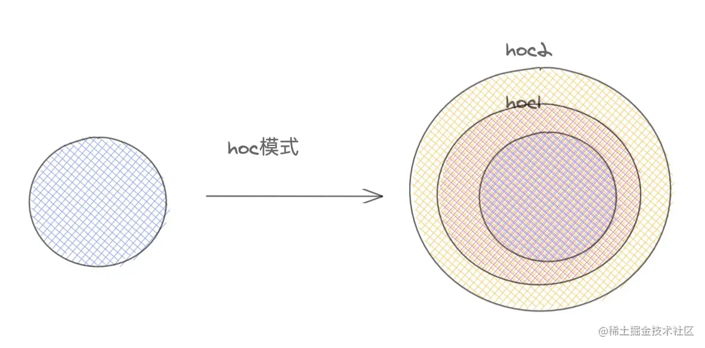

`HOC`是我们本章主要的讲的内容，具体用法，我们接下来会慢慢道来，我们先简单尝试一个`HOC`。

```js
function HOC(Component) {
  return class wrapComponent extends React.Component{
     constructor(){
       super()
       this.state={
         name:'alien'
       }
     }
     render=()=><Component { ...this.props } { ...this.state } />
  }
}

@HOC
class Index extends React.Component{
  say(){
    const { name } = this.props
    console.log(name)
  }
  render(){
    return <div> hello,world <button onClick={ this.say.bind(this) } >点击</button>  </div>
  }
}
```

### ④自定义hooks模式

**原型图**

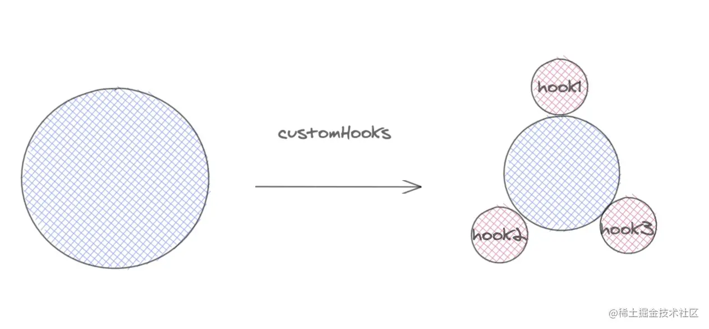

`hooks`的诞生，一大部分原因是解决**无状态组件没有`state`**和**逻辑难以复用**问题。`hooks`可以将一段逻辑封装起来，做到开箱即用，我这里就不多讲了，接下来会出`react-hooks`原理的文章，完成`react-hooks`三部曲。感兴趣的同学可以看笔者的另外二篇文章，里面详细介绍了`react-hooks`复用代码逻辑的原则和方案。

传送门：

[玩转react-hooks,自定义hooks设计模式及其实战](https://juejin.cn/post/6890738145671938062)

[react-hooks如何使用？](https://juejin.cn/post/6864438643727433741)

## 2 高阶组件产生初衷

组件是把`prop`渲染成`UI`,而高阶组件是将组件转换成另外一个组件，我们更应该注意的是，经过包装后的组件，获得了那些强化,节省多少逻辑，或是解决了原有组件的那些缺陷，这就是高阶组件的意义。我们先来思考一下高阶组件究竟解决了什么问题🤔🤔🤔？

**① 复用逻辑**：高阶组件更像是一个加工`react`组件的工厂，批量对原有组件进行**加工**，**包装**处理。我们可以根据业务需求定制化专属的`HOC`,这样可以解决复用逻辑。

**② 强化props**：这个是`HOC`最常用的用法之一，高阶组件返回的组件，可以劫持上一层传过来的`props`,然后混入新的`props`,来增强组件的功能。代表作`react-router`中的`withRouter`。

**③ 赋能组件**：`HOC`有一项独特的特性，就是可以给被`HOC`包裹的业务组件，提供一些拓展功能，比如说**额外的生命周期，额外的事件**，但是这种`HOC`，可能需要和业务组件紧密结合。典型案例`react-keepalive-router`中的 `keepaliveLifeCycle`就是通过`HOC`方式，给业务组件增加了额外的生命周期。

**④ 控制渲染**：劫持渲染是`hoc`一个特性，在`wrapComponent`包装组件中，可以对原来的组件，进行`条件渲染`，`节流渲染`，`懒加载`等功能，后面会详细讲解，典型代表做`react-redux`中`connect`和 `dva`中 `dynamic` 组件懒加载。

我会针对高阶组件的初衷展开，详细介绍其原理已经用法。跟上我的思路，我们先来看一下，高阶组件**如何在我们的业务组件中使用的**。

## 3 高阶组件使用和编写结构

`HOC`使用指南是非常简单的，只需要将我们的组件进行包裹就可以了。

### 使用：装饰器模式和函数包裹模式

对于`class`声明的有状态组件，我们可以用装饰器模式，对类组件进行包装：

```js
@withStyles(styles)
@withRouter
@keepaliveLifeCycle
class Index extends React.Componen{
    /* ... */
}
```

**我们要注意一下包装顺序，越靠近`Index`组件的，就是越内层的`HOC`,离组件`Index`也就越近。**

对于无状态组件(函数声明）我们可以这么写：

```js
function Index(){
    /* .... */
}
export default withStyles(styles)(withRouter( keepaliveLifeCycle(Index) ))
```

### 模型：嵌套HOC

对于不需要传递参数的`HOC`，我们编写模型我们只需要嵌套一层就可以，比如`withRouter`,

```js
function withRouter(){
    return class wrapComponent extends React.Component{
        /* 编写逻辑 */
    }
}
```

对于需要参数的`HOC`，我们需要一层代理，如下：

```js
function connect (mapStateToProps){
    /* 接受第一个参数 */
    return function connectAdvance(wrapCompoent){
        /* 接受组件 */
        return class WrapComponent extends React.Component{  }
    }
}
```

我们看出两种`hoc`模型很简单，对于代理函数，可能有一层，可能有很多层，不过不要怕，无论多少层本质上都是一样的，我们只需要一层一层剥离开，分析结构，整个`hoc`结构和脉络就会清晰可见。吃透`hoc`也就易如反掌。

## 4 两种不同的高阶组件

常用的高阶组件有两种方式**正向的属性代理**和**反向的组件继承**，两者之前有一些共性和区别。接下具体介绍两者区别，在第三部分会详细介绍具体实现。

### 正向属性代理

所谓正向属性代理，就是用组件包裹一层代理组件，在代理组件上，我们可以做一些，对源组件的代理操作。在`fiber tree` 上，先`mounted`代理组件，然后才是我们的业务组件。我们可以理解为父子组件关系，父组件对子组件进行一系列强化操作。

```js
function HOC(WrapComponent){
    return class Advance extends React.Component{
       state={
           name:'alien'
       }
       render(){
           return <WrapComponent  { ...this.props } { ...this.state }  />
       }
    }
}
```

#### 优点

- ① 正常属性代理可以和业务组件低耦合，零耦合，对于`条件渲染`和`props属性增强`,只负责控制子组件渲染和传递额外的`props`就可以，所以无须知道，业务组件做了些什么。所以正向属性代理，更适合做一些开源项目的`hoc`，目前开源的`HOC`基本都是通过这个模式实现的。
- ② 同样适用于`class`声明组件，和`function`声明的组件。
- ③ 可以完全隔离业务组件的渲染,相比反向继承，属性代理这种模式。可以完全控制业务组件渲染与否，可以避免`反向继承`带来一些副作用，比如生命周期的执行。
- ④ 可以嵌套使用，多个`hoc`是可以嵌套使用的，而且一般不会限制包装`HOC`的先后顺序。

#### 缺点

-  ① 一般无法直接获取业务组件的状态，如果想要获取，需要`ref`获取组件实例。
-  ② 无法直接继承静态属性。如果需要继承需要手动处理，或者引入第三方库。

**例子：**

```js
class Index extends React.Component{
  render(){
    return <div> hello,world  </div>
  }
}
Index.say = function(){
  console.log('my name is alien')
}
function HOC(Component) {
  return class wrapComponent extends React.Component{
     render(){
       return <Component { ...this.props } { ...this.state } />
     }
  }
}
const newIndex =  HOC(Index)
console.log(newIndex.say)
```

**打印结果**

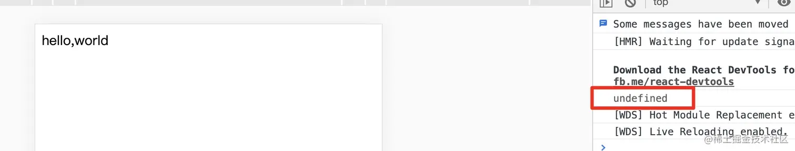

### 反向继承

反向继承和属性代理有一定的区别，在于包装后的组件继承了业务组件本身，所以我们我无须在去实例化我们的业务组件。当前高阶组件就是继承后，加强型的业务组件。这种方式类似于组件的强化，所以你必要要知道当前

```js
class Index extends React.Component{
  render(){
    return <div> hello,world  </div>
  }
}
function HOC(Component){
    return class wrapComponent extends Component{ /* 直接继承需要包装的组件 */

    }
}
export default HOC(Index)
```

#### 优点

- ① 方便获取组件内部状态，比如`state`，`props` ,生命周期,绑定的事件函数等
- ② `es6`继承可以良好继承静态属性。我们无须对静态属性和方法进行额外的处理。

```js
class Index extends React.Component{
  render(){
    return <div> hello,world  </div>
  }
}
Index.say = function(){
  console.log('my name is alien')
}
function HOC(Component) {
  return class wrapComponent extends Component{
  }
}
const newIndex =  HOC(Index)
console.log(newIndex.say)
```

**打印结果**


#### 缺点

- ① 无状态组件无法使用。
- ② 和被包装的组件强耦合，需要知道被包装的组件的内部状态，具体是做什么？
- ③ 如果多个反向继承`hoc`嵌套在一起，当前状态会覆盖上一个状态。这样带来的隐患是非常大的，比如说有多个`componentDidMount`，当前`componentDidMount`会覆盖上一个`componentDidMount`。这样副作用串联起来，影响很大。

## 三 如何编写高阶组件

接下来我们来看看，如何编写一个高阶组件，你可以参考如下的情景，去编写属于自己的`HOC`。

## 1 强化props

### ① 混入props

这个是高阶组件最常用的功能，承接上层的`props`,在混入自己的`props`，来强化组件。

**有状态组件(属性代理)**

```js
function classHOC(WrapComponent){
    return class  Idex extends React.Component{
        state={
            name:'alien'
        }
        componentDidMount(){
           console.log('HOC')
        }
        render(){
            return <WrapComponent { ...this.props }  { ...this.state }   />
        }
    }
}
function Index(props){
  const { name } = props
  useEffect(()=>{
     console.log( 'index' )
  },[])
  return <div>
    hello,world , my name is { name }
  </div>
}

export default classHOC(Index)
```

**有状态组件(属性代理)**

同样也适用与无状态组件。

```js
function functionHoc(WrapComponent){
    return function Index(props){
        const [ state , setState ] = useState({ name :'alien'  })
        return  <WrapComponent { ...props }  { ...state }   />
    }
}
```

**效果**

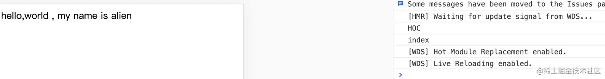

### ② 抽离state控制更新

高阶组件可以将`HOC`的`state`的配合起来，控制业务组件的更新。这种用法在`react-redux`中`connect`高阶组件中用到过，用于处理来自`redux`中`state`更改，带来的订阅更新作用。

我们将上述代码进行改造。

```js
function classHOC(WrapComponent){
  return class  Idex extends React.Component{
      constructor(){
        super()
        this.state={
          name:'alien'
        }
      }
      changeName(name){
        this.setState({ name })
      }
      render(){
          return <WrapComponent { ...this.props }  { ...this.state } changeName={this.changeName.bind(this)  }  />
      }
  }
}
function Index(props){
  const [ value ,setValue ] = useState(null)
  const { name ,changeName } = props
  return <div>
    <div>   hello,world , my name is { name }</div>
    改变name <input onChange={ (e)=> setValue(e.target.value)  }  />
    <button onClick={ ()=>  changeName(value) }  >确定</button>
  </div>
}

export default classHOC(Index)
```

**效果**


## 2 控制渲染

控制渲染是高阶组件的一个很重要的特性，上边说到的两种高阶组件，都能完成对组件渲染的控制。具体实现还是有区别的，我们一起来探索一下。

### 2.1 条件渲染

#### ① 基础 ：动态渲染

对于属性代理的高阶组件，虽然不能在内部操控渲染状态，但是可以在外层控制当前组件是否渲染，这种情况应用于，**权限隔离**，**懒加载** ，**延时加载**等场景。

**实现一个动态挂载组件的HOC**

```js
function renderHOC(WrapComponent){
  return class Index  extends React.Component{
      constructor(props){
        super(props)
        this.state={ visible:true }
      }
      setVisible(){
         this.setState({ visible:!this.state.visible })
      }
      render(){
         const {  visible } = this.state
         return <div className="box"  >
           <button onClick={ this.setVisible.bind(this) } > 挂载组件 </button>
           { visible ? <WrapComponent { ...this.props } setVisible={ this.setVisible.bind(this) }   />  : <div className="icon" ><SyncOutlined spin  className="theicon"  /></div> }
         </div>
      }
  }
}

class Index extends React.Component{
  render(){
    const { setVisible } = this.props
    return <div className="box" >
        <p>hello,my name is alien</p>
        
        <button onClick={() => setVisible()}  > 卸载当前组件 </button>
    </div>
  }
}
export default renderHOC(Index)
```

效果：


#### ② 进阶 ：分片渲染

是不是感觉不是很过瘾，为了让大家加强对`HOC`条件渲染的理解，我再做一个**分片渲染+懒加载**功能。为了让大家明白，我也是绞尽脑汁啊😂😂😂。

**进阶：实现一个懒加载功能的HOC，可以实现组件的分片渲染,用于分片渲染页面，不至于一次渲染大量组件造成白屏效果**

```js
const renderQueue = []
let isFirstrender = false

const tryRender = ()=>{
  const render = renderQueue.shift()
  if(!render) return
  setTimeout(()=>{
    render() /* 执行下一段渲染 */
  },300)
}
/* HOC */
function renderHOC(WrapComponent){
    return function Index(props){
      const [ isRender , setRender ] = useState(false)
      useEffect(()=>{
        renderQueue.push(()=>{  /* 放入待渲染队列中 */
          setRender(true)
        })
        if(!isFirstrender) {
          tryRender() /**/
          isFirstrender = true
        }
      },[])
      return isRender ? <WrapComponent tryRender={tryRender}  { ...props }  /> : <div className='box' ><div className="icon" ><SyncOutlined   spin /></div></div>
    }
}
/* 业务组件 */
class Index extends React.Component{
  componentDidMount(){
    const { name , tryRender} = this.props
    /* 上一部分渲染完毕，进行下一部分渲染 */
    tryRender()
    console.log( name+'渲染')
  }
  render(){
    return <div>
        
    </div>
  }
}
/* 高阶组件包裹 */
const Item = renderHOC(Index)

export default () => {
  return <React.Fragment>
      <Item name="组件一" />
      <Item name="组件二" />
      <Item name="组件三" />
  </React.Fragment>
}
```

**效果**


大致流程，初始化的时候，`HOC`中将渲染真正组件的渲染函数，放入`renderQueue`队列中，然后初始化渲染一次，接下来，每一个项目组件，完成 `didMounted` 状态后，会从队列中取出下一个渲染函数，渲染下一个组件, 一直到所有的渲染任务全部执行完毕，渲染队列清空，有效的进行分片的渲染，这种方式对海量数据展示，很奏效。

用`HOC`实现了条件渲染-分片渲染的功能，实际条件渲染理解起来很容易，就是通过变量，控制是否挂载组件，从而满足项目本身需求，条件渲染可以演变成很多模式，我这里介绍了条件渲染的二种方式，希望大家能够理解精髓所在。

#### ③ 进阶：异步组件(懒加载)

不知道大家有没有用过`dva`,里面的`dynamic`就是应用`HOC`模式实现的组件异步加载，我这里简化了一下，提炼核心代码，如下：

```js
/* 路由懒加载HOC */
export default function AsyncRouter(loadRouter) {
  return class Content extends React.Component {
    state = {Component: null}
    componentDidMount() {
      if (this.state.Component) return
      loadRouter()
        .then(module => module.default)
        .then(Component => this.setState({Component},
         ))
    }
    render() {
      const {Component} = this.state
      return Component ? <Component {
      ...this.props
      }
      /> : null
    }
  }
}
```

使用

```js
const Index = AsyncRouter(()=>import('../pages/index'))
```

`hoc`还可以配合其他`API`，做一下衍生的功能。如上配合`import`实现异步加载功能。`HOC`用起来非常灵活，

#### ④ 反向继承 ： 渲染劫持

**HOC反向继承模式，可以实现颗粒化的渲染劫持，也就是可以控制基类组件的`render`函数，还可以篡改props，或者是`children`，我们接下来看看，这种状态下，怎么使用高阶组件。**

```js
const HOC = (WrapComponent) =>
  class Index  extends WrapComponent {
    render() {
      if (this.props.visible) {
        return super.render()
      } else {
        return <div>暂无数据</div>
      }
    }
  }
```

#### ⑤ 反向继承：修改渲染树

**修改渲染状态(劫持render替换子节点)**

```js
class Index extends React.Component{
  render(){
    return <div>
       <ul>
         <li>react</li>
         <li>vue</li>
         <li>Angular</li>
       </ul>
    </div>
  }
}

function HOC (Component){
  return class Advance extends Component {
    render() {
      const element = super.render()
      const otherProps = {
        name:'alien'
      }
      /* 替换 Angular 元素节点 */
      const appendElement = React.createElement('li' ,{} , `hello ,world , my name  is ${ otherProps.name }` )
      const newchild =  React.Children.map(element.props.children.props.children,(child,index)=>{
           if(index === 2) return appendElement
           return  child
      })
      return  React.cloneElement(element, element.props, newchild)
    }
  }
}
export  default HOC(Index)
```

**效果**

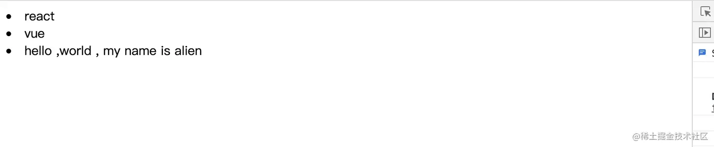

我们用劫持渲染的方式，来操纵`super.render()`后的`React.element`元素，然后配合 `createElement` , `cloneElement` , `React.Children` 等 `api`,可以灵活操纵，真正的渲染`react.element`，可以说是偷天换日，不亦乐乎。

### 2.2节流渲染

`hoc`除了可以进行**条件渲染**，**渲染劫持**功能外，还可以进行节流渲染，也就是可以优化性能，具体怎么做，请跟上我的节奏往下看。

#### ① 基础: 节流原理

`hoc`可以配合`hooks`的`useMemo`等`API`配合使用，可以实现对业务组件的渲染控制，减少渲染次数，从而达到优化性能的效果。如下案例，我们期望当且仅当`num`改变的时候，渲染组件，但是不影响接收的`props`。我们应该这样写我们的`HOC`。

```js
function HOC (Component){
     return function renderWrapComponent(props){
       const { num } = props
       const RenderElement = useMemo(() =>  <Component {...props}  /> ,[ num ])
       return RenderElement
     }
}
class Index extends React.Component{
  render(){
     console.log(`当前组件是否渲染`,this.props)
     return <div>hello,world, my name is alien </div>
  }
}
const IndexHoc = HOC(Index)

export default ()=> {
    const [ num ,setNumber ] = useState(0)
    const [ num1 ,setNumber1 ] = useState(0)
    const [ num2 ,setNumber2 ] = useState(0)
    return <div>
        <IndexHoc  num={ num } num1={num1} num2={ num2 }  />
        <button onClick={() => setNumber(num + 1) } >num++</button>
        <button onClick={() => setNumber1(num1 + 1) } >num1++</button>
        <button onClick={() => setNumber2(num2 + 1) } >num2++</button>
    </div>
}
```

**效果：**

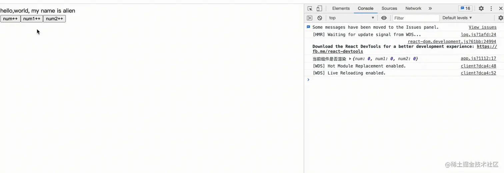

如图所示,当我们只有点击 `num++`时候，才重新渲染子组件，点击其他按钮，只是负责传递了`props`,达到了期望的效果。

#### ② 进阶：定制化渲染流

思考：🤔上述的案例只是介绍了原理，在实际项目中，是量化生产不了的，原因是，我们需要针对不同`props`变化，写不同的`HOC`组件，这样根本起不了`Hoc`真正的用途，也就是`HOC`产生的初衷。所以我们需要对上述`hoc`进行改造升级，是组件可以根据定制化方向，去渲染组件。也就是`Hoc`生成的时候，已经按照某种契约去执行渲染。

```js
function HOC (rule){
     return function (Component){
        return function renderWrapComponent(props){
          const dep = rule(props)
          const RenderElement = useMemo(() =>  <Component {...props}  /> ,[ dep ])
          return RenderElement
        }
     }
}
/* 只有 props 中 num 变化 ，渲染组件  */
@HOC( (props)=> props['num'])
class IndexHoc extends React.Component{
  render(){
     console.log(`组件一渲染`,this.props)
     return <div> 组件一 ： hello,world </div>
  }
}

/* 只有 props 中 num1 变化 ，渲染组件  */
@HOC((props)=> props['num1'])
class IndexHoc1 extends React.Component{
  render(){
     console.log(`组件二渲染`,this.props)
     return <div> 组件二 ： my name is alien </div>
  }
}
export default ()=> {
    const [ num ,setNumber ] = useState(0)
    const [ num1 ,setNumber1 ] = useState(0)
    const [ num2 ,setNumber2 ] = useState(0)
    return <div>
        <IndexHoc  num={ num } num1={num1} num2={ num2 }  />
        <IndexHoc1  num={ num } num1={num1} num2={ num2 }  />
        <button onClick={() => setNumber(num + 1) } >num++</button>
        <button onClick={() => setNumber1(num1 + 1) } >num1++</button>
        <button onClick={() => setNumber2(num2 + 1) } >num2++</button>
    </div>
}
```

**效果**

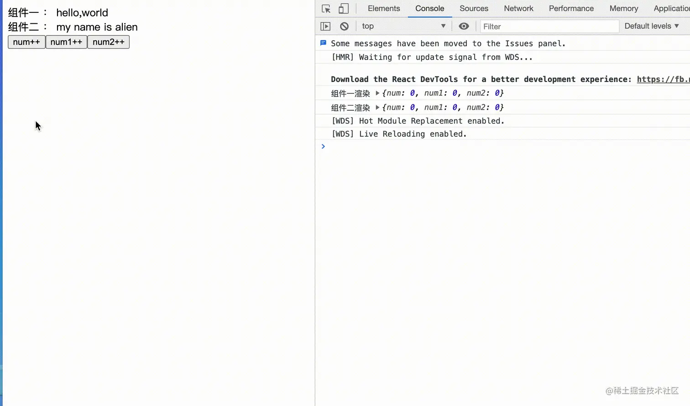

完美实现了效果。这用高阶组件模式，可以灵活控制`React`组件层面上的，**`props`数据流**和**更新流**，优秀的高阶组件有 `mobx` 中`observer` ,`inject` , `react-redux`中的`connect`,感兴趣的同学，可以抽时间研究一下。

## 3 赋能组件

高阶组件除了上述两种功能之外，还可以赋能组件，比如加一些**额外`生命周期`**，**劫持事件**，**监控日志**等等。

### 3.1 劫持原型链-劫持生命周期，事件函数

#### ① 属性代理实现

```js
function HOC (Component){
  const proDidMount = Component.prototype.componentDidMount
  Component.prototype.componentDidMount = function(){
     console.log('劫持生命周期：componentDidMount')
     proDidMount.call(this)
  }
  return class wrapComponent extends React.Component{
      render(){
        return <Component {...this.props}  />
      }
  }
}
@HOC
class Index extends React.Component{
   componentDidMount(){
     console.log('———didMounted———')
   }
   render(){
     return <div>hello,world</div>
   }
}
```

**效果**

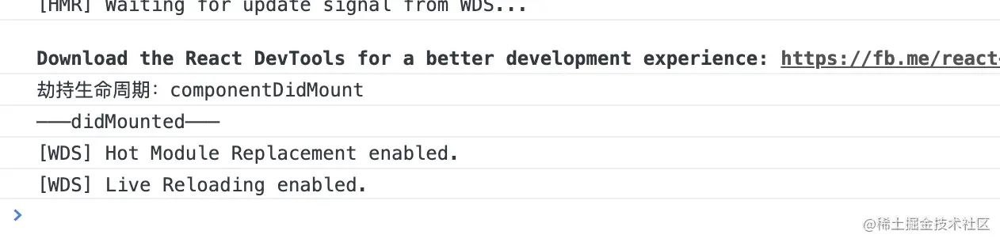

#### ② 反向继承实现

反向继承，因为在继承原有组件的基础上，可以对原有组件的**生命周期**或**事件**进行劫持，甚至是替换。

```js
function HOC (Component){
  const didMount = Component.prototype.componentDidMount
  return class wrapComponent extends Component{
      componentDidMount(){
        console.log('------劫持生命周期------')
        if (didMount) {
           didMount.apply(this) /* 注意 `this` 指向问题。 */
        }
      }
      render(){
        return super.render()
      }
  }
}

@HOC
class Index extends React.Component{
   componentDidMount(){
     console.log('———didMounted———')
   }
   render(){
     return <div>hello,world</div>
   }
}
```

### 3.2 事件监控

`HOC`还可以对原有组件进行监控。比如对一些`事件监控`，`错误监控`，`事件监听`等一系列操作。

#### ① 组件内的事件监听

接下来，我们做一个`HOC`,只对组件内的点击事件做一个监听效果。

```js
function ClickHoc (Component){
  return  function Wrap(props){
    const dom = useRef(null)
    useEffect(()=>{
     const handerClick = () => console.log('发生点击事件')
     dom.current.addEventListener('click',handerClick)
     return () => dom.current.removeEventListener('click',handerClick)
    },[])
    return  <div ref={dom}  ><Component  {...props} /></div>
  }
}

@ClickHoc
class Index extends React.Component{
   render(){
     return <div  className='index'  >
       <p>hello，world</p>
       <button>组件内部点击</button>
    </div>
   }
}
export default ()=>{
  return <div className='box'  >
     <Index />
     <button>组件外部点击</button>
  </div>
}
```

**效果**

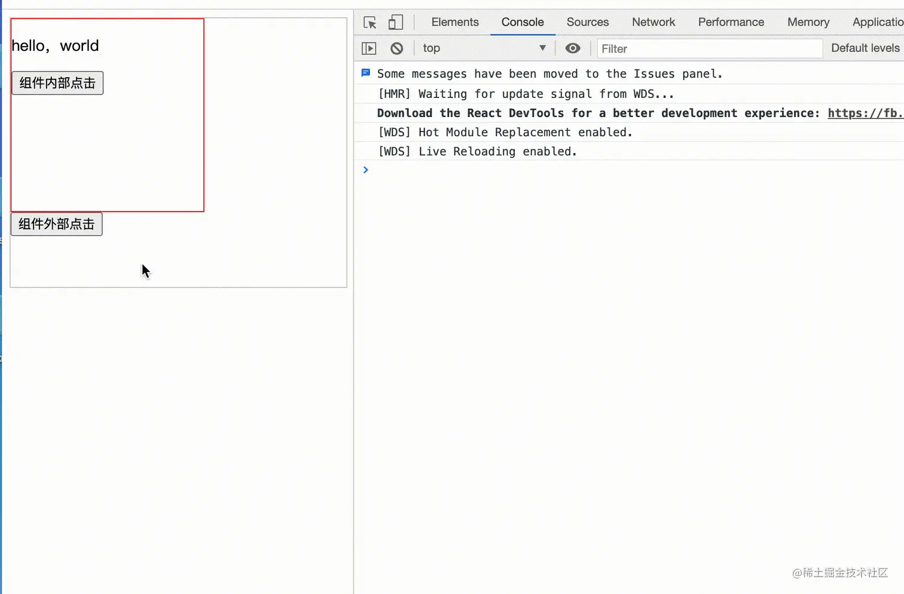

### 3 ref助力操控组件实例

对于属性代理我们虽然不能直接获取组件内的状态，但是我们可以通过`ref`获取组件实例,获取到组件实例，就可以获取组件的一些状态，或是手动触发一些事件，进一步强化组件，但是注意的是：`class`声明的有状态组件才有实例，`function`声明的无状态组件不存在实例。

#### ① 属性代理-添加额外生命周期

我们可以针对某一种情况, 给组件增加额外的生命周期，我做了一个简单的`demo`，监听`number`改变，如果`number`改变，就自动触发组件的监听函数`handerNumberChange`。 具体写法如下

```js
function Hoc(Component){
  return class WrapComponent extends React.Component{
      constructor(){
        super()
        this.node = null
      }
      UNSAFE_componentWillReceiveProps(nextprops){
          if(nextprops.number !== this.props.number ){
            this.node.handerNumberChange  &&  this.node.handerNumberChange.call(this.node)
          }
      }
      render(){
        return <Component {...this.props} ref={(node) => this.node = node }  />
      }
  }
}
@Hoc
class Index extends React.Component{
  handerNumberChange(){
      /* 监听 number 改变 */
  }
  render(){
    return <div>hello,world</div>
  }
}
```

这种写法有点不尽人意，大家不要着急，在第四部分，源码实战中，我会介绍一种更好的场景。方便大家理解`Hoc`对原有组件的赋能。

## 4 总结

上面我分别按照`hoc`主要功能，**强化props** ， **控制渲染** ，**赋能组件** 三个方向对`HOC`编写做了一个详细介绍，和应用场景的介绍，目的**让大家在理解高阶组件的时候，更明白什么时候会用到？,怎么样去写？`** 里面涵盖的知识点我总一个总结。

对于属性代理HOC，我们可以：

- 强化props & 抽离state。
- 条件渲染，控制渲染，分片渲染，懒加载。
- 劫持事件和生命周期
- ref控制组件实例
- 添加事件监听器，日志

对于反向代理的HOC,我们可以：

- 劫持渲染，操纵渲染树
- 控制/替换生命周期，直接获取组件状态，绑定事件。

每个应用场景，我都举了例子🌰🌰，大家可以结合例子深入了解一下其原理和用途。

## 四 高阶组件源码级实践

`hoc`的应用场景有很多，也有很多好的开源项目，供我们学习和参考，接下来我真对三个方向上的功能用途，分别从源码角度解析`HOC`的用途。

## 1 强化prop- withRoute

用过`withRoute`的同学，都明白其用途，`withRoute`用途就是，对于没有被`Route`包裹的组件，给添加`history`对象等和路由相关的状态，方便我们在任意组件中，都能够获取路由状态，进行路由跳转，这个`HOC`目的很清楚，就是强化`props`,把`Router`相关的状态都混入到`props`中，我们看看具体怎么实现的。

```js
function withRouter(Component) {
  const displayName = `withRouter(${Component.displayName || Component.name})`;
  const C = props => {
      /*  获取 */
    const { wrappedComponentRef, ...remainingProps } = props;
    return (
      <RouterContext.Consumer>
        {context => {
          return (
            <Component
              {...remainingProps}
              {...context}
              ref={wrappedComponentRef}
            />
          );
        }}
      </RouterContext.Consumer>
    );
  };

  C.displayName = displayName;
  C.WrappedComponent = Component;
  /* 继承静态属性 */
  return hoistStatics(C, Component);
}

export default withRouter
```

`withRoute`的流程实际很简单，就是先从`props`分离出`ref`和`props`,然后从存放整个`route`对象上下文`RouterContext`取出`route`对象,然后混入到原始组件的`props`中，最后用`hoistStatics`继承静态属性。至于`hoistStatics`我们稍后会讲到。

## 2 控制渲染案例 connect

由于`connect`源码比较长和难以理解，所以我们提取精髓，精简精简再精简, 总结的核心功能如下,`connect`的作用也有`合并props`，但是更重要的是接受`state`，来控制更新组件。下面这个代码中，为了方便大家理解，我都给简化了。希望大家能够理解`hoc`如何**派发**和**控制**更新流的。

```js
import store from './redux/store'
import { ReactReduxContext } from './Context'
import { useContext } from 'react'
function connect(mapStateToProps){
   /* 第一层： 接收订阅state函数 */
    return function wrapWithConnect (WrappedComponent){
        /* 第二层：接收原始组件 */
        function ConnectFunction(props){
            const [ , forceUpdate ] = useState(0)
            const { reactReduxForwardedRef ,...wrapperProps } = props

            /* 取出Context */
            const { store } = useContext(ReactReduxContext)

            /* 强化props：合并 store state 和 props  */
            const trueComponentProps = useMemo(()=>{
                  /* 只有props或者订阅的state变化，才返回合并后的props */
                 return selectorFactory(mapStateToProps(store.getState()),wrapperProps)
            },[ store , wrapperProps ])

            /* 只有 trueComponentProps 改变时候,更新组件。  */
            const renderedWrappedComponent = useMemo(
              () => (
                <WrappedComponent
                  {...trueComponentProps}
                  ref={reactReduxForwardedRef}
                />
              ),
              [reactReduxForwardedRef, WrappedComponent, trueComponentProps]
            )
            useEffect(()=>{
              /* 订阅更新 */
               const checkUpdate = () => forceUpdate(new Date().getTime())
               store.subscribe( checkUpdate )
            },[ store ])
            return renderedWrappedComponent
        }
        /* React.memo 包裹  */
        const Connect = React.memo(ConnectFunction)

        /* 处理hoc,获取ref问题 */
        if(forwardRef){
          const forwarded = React.forwardRef(function forwardConnectRef( props,ref) {
            return <Connect {...props} reactReduxForwardedRef={ref} reactReduxForwardedRef={ref} />
          })
          return hoistStatics(forwarded, WrappedComponent)
        }
        /* 继承静态属性 */
        return hoistStatics(Connect,WrappedComponent)
    }
}
export default Index
```

`connect` 涉及到的功能点还真不少呢，首先第一层接受订阅函数，第二层接收原始组件，然后用`forwardRef`处理`ref`,用`hoistStatics` 处理静态属性的继承，在包装组件内部，合并`props`,`useMemo`缓存原始组件，只有合并后的`props`发生变化，才更新组件，然后在`useEffect`内部通过`store.subscribe()`订阅更新。这里省略了`Subscription`概念，真正的`connect`中有一个`Subscription`专门负责订阅消息。

## 3 赋能组件-缓存生命周期 keepaliveLifeCycle

之前笔者写了一个`react`缓存页面的开源库`react-keepalive-router`，可以实现`vue`中 `keepalive` + `router`功能，最初的版本没有缓存周期的，但是后来热心读者，期望在被缓存的路由组件中加入缓存周期，类似`activated`这种的，后来经过我的分析打算用`HOC`来实现此功能。

于是乎 `react-keepalive-router`加入了全新的页面组件生命周期 `actived` 和 `unActived`, `actived` 作为缓存路由组件激活时候用，初始化的时候会默认执行一次 , `unActived` 作为路由组件缓存完成后调用。但是生命周期需要用一个 `HOC` 组件`keepaliveLifeCycle` 包裹。

使用

```js
import React   from 'react'
import { keepaliveLifeCycle } from 'react-keepalive-router'

@keepaliveLifeCycle
class index extends React.Component<any,any>{

    state={
        activedNumber:0,
        unActivedNumber:0
    }
    actived(){
        this.setState({
            activedNumber:this.state.activedNumber + 1
        })
    }
    unActived(){
        this.setState({
            unActivedNumber:this.state.unActivedNumber + 1
        })
    }
    render(){
        const { activedNumber , unActivedNumber } = this.state
        return <div  style={{ marginTop :'50px' }}  >
           <div> 页面 actived 次数： {activedNumber} </div>
           <div> 页面 unActived 次数：{unActivedNumber} </div>
        </div>
    }
}
export default index
```

**效果：**


**原理**

```js
import {lifeCycles} from '../core/keeper'
import hoistNonReactStatic from 'hoist-non-react-statics'
function keepaliveLifeCycle(Component) {
   class Hoc extends React.Component {
    cur = null
    handerLifeCycle = type => {
      if (!this.cur) return
      const lifeCycleFunc = this.cur[type]
      isFuntion(lifeCycleFunc) && lifeCycleFunc.call(this.cur)
    }
    componentDidMount() {
      const {cacheId} = this.props
      cacheId && (lifeCycles[cacheId] = this.handerLifeCycle)
    }
    componentWillUnmount() {
      const {cacheId} = this.props
      delete lifeCycles[cacheId]
    }
     render=() => <Component {...this.props} ref={cur => (this.cur = cur)}/>
  }
  return hoistNonReactStatic(Hoc,Component)
}
```

`keepaliveLifeCycle` 的原理很简单，就是通过`ref`或获取 `class` 组件的实例,在 `hoc` 初始化时候**进行生命周期的绑定**, 在 `hoc` 销毁阶段，对生命周期进行解绑, 然后交给`keeper`统一调度，`keeper`通过调用实例下面的生命周期函数，来实现缓存生命周期功能的。

## 五 高阶组件的注意事项

## 1 谨慎修改原型链

```js
function HOC (Component){
  const proDidMount = Component.prototype.componentDidMount
  Component.prototype.componentDidMount = function(){
     console.log('劫持生命周期：componentDidMount')
     proDidMount.call(this)
  }
  return  Component
}
```

这样做会产生一些不良后果。比如如果你再用另一个同样会修改 `componentDidMount` 的 `HOC` 增强它，那么前面的 `HOC` 就会失效！同时，这个 `HOC` 也无法应用于没有生命周期的函数组件。

## 2 继承静态属性

在用属性代理的方式编写`HOC`的时候，要注意的是就是，静态属性丢失的问题，前面提到了，如果不做处理，静态方法就会全部丢失。

### 手动继承

我们可以手动将原始组件的静态方法`copy`到 `hoc`组件上来，但前提是必须准确知道应该拷贝哪些方法。

```js
function HOC(Component) {
  class WrappedComponent extends React.Component {
      /*...*/
  }
  // 必须准确知道应该拷贝哪些方法
  WrappedComponent.staticMethod = Component.staticMethod
  return WrappedComponent
}
```

### 引入第三方库

这样每个静态方法都绑定会很累，尤其对于开源的`hoc`，**对原生组件的静态方法是未知的**,我们可以使用 `hoist-non-react-statics` 自动拷贝所有的静态方法:

```js
import hoistNonReactStatic from 'hoist-non-react-statics'
function HOC(Component) {
  class WrappedComponent extends React.Component {
      /*...*/
  }
  hoistNonReactStatic(WrappedComponent,Component)
  return WrappedComponent
}
```

## 3 跨层级捕获ref

高阶组件的约定是将所有 `props` 传递给被包装组件，但这对于 `refs` 并不适用。那是因为 `ref` 实际上并不是一个 `prop` - 就像 `key` 一样，它是由 `React` 专门处理的。如果将 `ref` 添加到 `HOC` 的返回组件中，则 `ref` 引用指向容器组件，而不是被包装组件。我们可以通过`forwardRef`来解决这个问题。

```js
/**
 *
 * @param {*} Component 原始组件
 * @param {*} isRef  是否开启ref模式
 */
function HOC(Component,isRef){
  class Wrap extends React.Component{
     render(){
        const { forwardedRef ,...otherprops  } = this.props
        return <Component ref={forwardedRef}  {...otherprops}  />
     }
  }
    if(isRef){
      return  React.forwardRef((props,ref)=> <Wrap forwardedRef={ref} {...props} /> )
    }
    return Wrap
}

class Index extends React.Component{
  componentDidMount(){
      console.log(666)
  }
  render(){
    return <div>hello,world</div>
  }
}

const HocIndex =  HOC(Index,true)

export default ()=>{
  const node = useRef(null)
  useEffect(()=>{
     /* 就可以跨层级，捕获到 Index 组件的实例了 */
    console.log(node.current.componentDidMount)
  },[])
  return <div><HocIndex ref={node}  /></div>
}
```

**打印结果：**

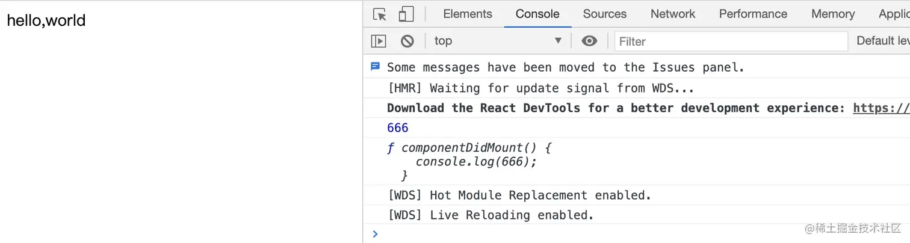

如上就解决了,`HOC`跨层级捕获`ref`的问题。

## 4 render中不要声明HOC

🙅错误写法：

```js
class Index extends React.Component{
  render(){
     const WrapHome = HOC(Home)
     return <WrapHome />
  }
}
```

如果这么写，会造成一个极大的问题，因为每一次`HOC`都会返回一个新的`WrapHome`,`react diff`会判定两次**不是同一个组件**，那么每次`Index` 组件 `render`触发，`WrapHome`，会重新挂载，状态会**全都丢失**。如果想要动态绑定`HOC`,请参考如下方式。

🙆正确写法：

```js
const WrapHome = HOC(Home)
class index extends React.Component{
  render(){
     return <WrapHome />
  }
}
```

## 常见考点

1.  **高阶组件的定义**：<br>
  - 请解释什么是高阶组件（HOC），并给出一个简单的例子。
  - 高阶组件与普通组件、函数组件以及类组件之间有何区别？
2.  **高阶组件的用途**：<br>
  - 高阶组件在React中主要用于什么目的？
  - 能否列举几个实际场景中高阶组件的应用？
3.  **HOC的实现方式**：<br>
  - 请描述如何编写一个简单的高阶组件。
  - 在实现HOC时，需要注意哪些事项？
4.  **属性代理与反向继承**：<br>
  - 什么是属性代理（Props Proxying）和反向继承（Render Props Technique）？
  - 能否分别给出一个使用属性代理和反向继承实现高阶组件的例子？
5.  **状态管理**：<br>
  - 如何使用高阶组件来管理React组件的状态？
  - 能否给出一个使用HOC实现状态管理的示例？
6.  **权限控制**：<br>
  - 在React应用中，如何使用高阶组件实现权限控制？
  - 能否展示一个包含权限验证逻辑的高阶组件示例？
