+++
title = "性能优化"
date = '2024-12-17T00:00:00+08:00'
lastmod = '2025-03-20T00:00:00+08:00'
draft = true
weight = 13
tags = ["面试", "前端", "React", "性能优化", "ecool"]
categories = ["前端开发", "面试"]
source = "https://fe.ecool.fun/knowledge-learn"
+++
本文篇幅较长，将从 **编译阶段** -> **路由阶段** -> **渲染阶段** -> **细节优化** -> **状态管理** -> **海量数据源，长列表渲染** 方向分别加以探讨。

## 一 不能输在起跑线上，优化babel配置,webpack配置为项

### 1 真实项目中痛点

当我们用`create-react-app`或者`webpack`构建`react`工程的时候，有没有想过一个问题，我们的配置能否让我们的项目更快的构建速度，更小的项目体积，更简洁清晰的项目结构。 随着我们的项目越做越大，项目依赖越来越多，项目结构越来越来复杂，项目体积就会越来越大，构建时间越来越长，久而久之就会成了一个又大又重的项目，所以说我们要学会适当的为项目‘减负’，让项目不能输在起跑线上。

### 2 一个老项目

拿我们之前接触过的一个`react`老项目为例。我们没有用`dva`,`umi`快速搭建react，而是用`react`老版本脚手架构建的，这对这种老的`react`项目，上述的问题都会存在，下面让我们一起来看看。

我们首先看一下项目结构。 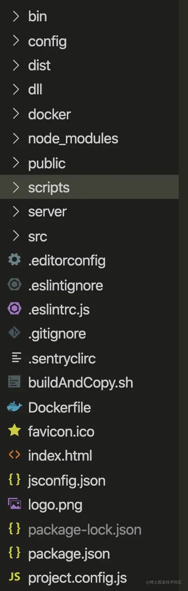

再看看构建时间。

为了方便大家看构建时间，我简单写了一个`webpack，plugin` `ConsolePlugin` ,记录了`webpack`在一次`compilation`所用的时间。

```js
const chalk = require('chalk') /* console 颜色 */
var slog = require('single-line-log'); /* 单行打印 console */

class ConsolePlugin {
    constructor(options){
       this.options = options
    }
    apply(compiler){
        /**
         * Monitor file change 记录当前改动文件
         */
        compiler.hooks.watchRun.tap('ConsolePlugin', (watching) => {
            const changeFiles = watching.watchFileSystem.watcher.mtimes
            for(let file in changeFiles){
                console.log(chalk.green('当前改动文件：'+ file))
            }
        })
        /**
         *  before a new compilation is created. 开始 compilation 编译 。
         */
        compiler.hooks.compile.tap('ConsolePlugin',()=>{
            this.beginCompile()
        })
        /**
         * Executed when the compilation has completed. 一次 compilation 完成。
         */
        compiler.hooks.done.tap('ConsolePlugin',()=>{
            this.timer && clearInterval( this.timer )
            const endTime =  new Date().getTime()
            const time = (endTime - this.starTime) / 1000
            console.log( chalk.yellow(' 编译完成') )
            console.log( chalk.yellow('编译用时：' + time + '秒' ) )
        })
    }
    beginCompile(){
       const lineSlog = slog.stdout
       let text  = '开始编译：'
       /* 记录开始时间 */
       this.starTime =  new Date().getTime()
       this.timer = setInterval(()=>{
          text +=  '█'
          lineSlog( chalk.green(text))
       },50)
    }
}
```

**构建时间如下：**


**打包后的体积：**


### 3 翻新老项目

针对上面这个`react`老项目，我们开始针对性的优化。由于本文主要讲的是`react`，所以我们不把太多篇幅给`webpack优化`上。

#### ① include 或 exclude 限制 loader 范围。

```js
{
    test: /\.jsx?$/,
    exclude: /node_modules/,
    include: path.resolve(__dirname, '../src'),
    use:['happypack/loader?id=babel']
    // loader: 'babel-loader'
}
```

#### ② happypack多进程编译

除了上述改动之外，在plugin中

```js
/* 多线程编译 */
new HappyPack({
    id:'babel',
    loaders:['babel-loader?cacheDirectory=true']
})
```

#### ③缓存babel编译过的文件

```js
loaders:['babel-loader?cacheDirectory=true']
```

#### ④tree Shaking 删除冗余代码

#### ⑤按需加载，按需引入。

**优化后项目结构**

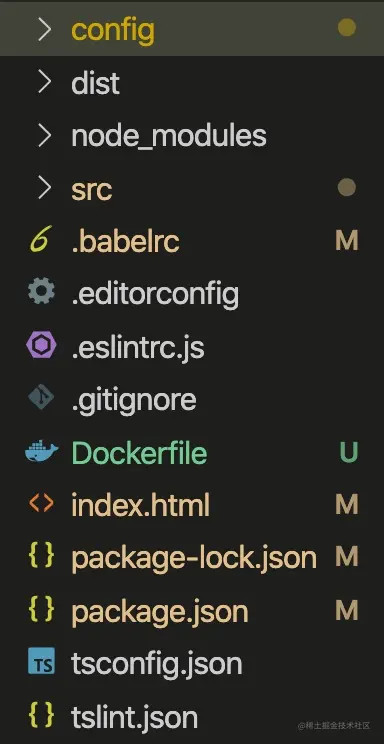

**优化构建时间如下：**


**一次 `compilation` 时间 从23秒优化到了4.89秒**

**优化打包后的体积：**


由此可见，如果我们的`react`是自己徒手搭建的，一些优化技巧显得格外重要。

### 关于类似antd UI库的瘦身思考

我们在做`react`项目的时候，会用到`antd`之类的ui库，值得思考的一件事是，如果我们只是用到了`antd`中的个别组件，比如`<Button />` ,就要把整个样式库引进来，打包就会发现，体积因为引入了整个样式大了很多。我们可以通过`.babelrc`实现**按需引入**。

**瘦身前**


`.babelrc` 增加对 `antd` 样式按需引入。

```js
["import", {
    "libraryName":
    "antd",
    "libraryDirectory": "es",
    "style": true
}]
```

**瘦身后**


### 总结

如果想要优化`react`项目，从构建开始是必不可少的。我们要重视从构建到打包上线的每一个环节。

## 二 路由懒加载，路由监听器

`react`路由懒加载，是笔者看完`dva`源码中的 `dynamic`异步加载组件总结出来的，针对大型项目有很多页面，在配置路由的时候，如果没有对路由进行处理，一次性会加载大量路由，这对页面初始化很不友好，会延长页面初始化时间，所以我们想这用`asyncRouter`来按需加载页面路由。

### 传统路由

如果我们没有用`umi`等框架，需要手动配置路由的时候，也许路由会这样配置。

```js
<Switch>
    <Route path={'/index'} component={Index} ></Route>
    <Route path={'/list'} component={List} ></Route>
    <Route path={'/detail'} component={ Detail } ></Route>
    <Redirect from='/*' to='/index' />
</Switch>
```

或者用list保存路由信息，方便在进行路由拦截，或者配置路由菜单等。

```js
const router = [
    {
        'path': '/index',
        'component': Index
    },
    {
        'path': '/list'',
        'component': List
    },
    {
        'path': '/detail',
        'component': Detail
    },
]
```

### asyncRouter懒加载路由,并实现路由监听

我们今天讲的这种`react`路由懒加载是基于`import` 函数路由懒加载， 众所周知 ，`import` 执行会返回一个`Promise`作为异步加载的手段。我们可以利用这点来实现`react`异步加载路由

好的一言不合上代码。。。

**代码**

```js
const routerObserveQueue = [] /* 存放路由卫视钩子 */
/* 懒加载路由卫士钩子 */
export const RouterHooks = {
  /* 路由组件加载之前 */
  beforeRouterComponentLoad: function(callback) {
    routerObserveQueue.push({
      type: 'before',
      callback
    })
  },
  /* 路由组件加载之后 */
  afterRouterComponentDidLoaded(callback) {
    routerObserveQueue.push({
      type: 'after',
      callback
    })
  }
}
/* 路由懒加载HOC */
export default function AsyncRouter(loadRouter) {
  return class Content extends React.Component {
    constructor(props) {
      super(props)
      /* 触发每个路由加载之前钩子函数 */
      this.dispatchRouterQueue('before')
    }
    state = {Component: null}
    dispatchRouterQueue(type) {
      const {history} = this.props
      routerObserveQueue.forEach(item => {
        if (item.type === type) item.callback(history)
      })
    }
    componentDidMount() {
      if (this.state.Component) return
      loadRouter()
        .then(module => module.default)
        .then(Component => this.setState({Component},
          () => {
            /* 触发每个路由加载之后钩子函数 */
            this.dispatchRouterQueue('after')
          }))
    }
    render() {
      const {Component} = this.state
      return Component ? <Component {
      ...this.props
      }
      /> : null
    }
  }
}
```

`asyncRouter`实际就是一个高级组件,将`()=>import()`作为加载函数传进来，然后当外部`Route`加载当前组件的时候，在`componentDidMount`生命周期函数，加载真实的组件，并渲染组件，我们还可以写针对路由懒加载状态定制属于自己的路由监听器`beforeRouterComponentLoad`和`afterRouterComponentDidLoaded`，类似`vue`中 `watch $route` 功能。接下来我们看看如何使用。

**使用**

```js
import AsyncRouter ,{ RouterHooks }  from './asyncRouter.js'
const { beforeRouterComponentLoad} = RouterHooks
const Index = AsyncRouter(()=>import('../src/page/home/index'))
const List = AsyncRouter(()=>import('../src/page/list'))
const Detail = AsyncRouter(()=>import('../src/page/detail'))
const index = () => {
  useEffect(()=>{
    /* 增加监听函数 */
    beforeRouterComponentLoad((history)=>{
      console.log('当前激活的路由是',history.location.pathname)
    })
  },[])
  return <div >
    <div >
      <Router  >
      <Meuns/>
      <Switch>
          <Route path={'/index'} component={Index} ></Route>
          <Route path={'/list'} component={List} ></Route>
          <Route path={'/detail'} component={ Detail } ></Route>
          <Redirect from='/*' to='/index' />
       </Switch>
      </Router>
    </div>
  </div>
}
```

**效果**

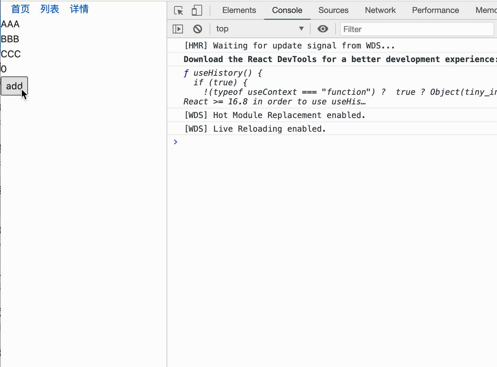

这样一来，我们既做到了路由的懒加载，又弥补了`react-router`没有监听当前路由变化的监听函数的缺陷。

## 三 受控性组件颗粒化 ，独立请求服务渲染单元

可控性组件颗粒化，独立请求服务渲染单元是笔者在实际工作总结出来的经验。目的就是避免因自身的渲染更新或是副作用带来的全局重新渲染。

### 1 颗粒化控制可控性组件

可控性组件和非可控性的区别就是`dom`元素值是否与受到`react`数据状态`state`控制。一旦由`react的state`控制数据状态，比如`input`输入框的值，就会造成这样一个场景，为了使`input`值实时变化，会不断`setState`，就会不断触发`render`函数，如果父组件内容简单还好，如果父组件比较复杂，会造成牵一发动全身，如果其他的子组件中`componentWillReceiveProps`这种带有副作用的钩子，那么引发的蝴蝶效应不敢想象。比如如下`demo`。

```js
class index extends React.Component<any,any>{
    constructor(props){
        super(props)
        this.state={
            inputValue:''
        }
    }
    handerChange=(e)=> this.setState({ inputValue:e.target.value  })
    render(){
        const { inputValue } = this.state
        return <div>
            { /*  我们增加三个子组件 */ }
            <ComA />
            <ComB />
            <ComC />
            <div className="box" >
                <Input  value={inputValue}  onChange={ (e)=> this.handerChange(e) } />
            </div>
            {/* 我们首先来一个列表循环 */}
            {
                new Array(10).fill(0).map((item,index)=>{
                    console.log('列表循环了' )
                    return <div key={index} >{item}</div>
                })
            }
            {
              /* 这里可能是更复杂的结构 */
              /* ------------------ */
            }
        </div>
    }
}
```

**组件A**

```js
function index(){
    console.log('组件A渲染')
   return <div>我是组件A</div>
}
```

**组件B，有一个componentWillReceiveProps钩子**

```js
class Index extends React.Component{
    constructor(props){
        super(props)
    }
    componentWillReceiveProps(){
        console.log('componentWillReceiveProps执行')
        /* 可能做一些骚操作 wu lian */
    }
    render(){
        console.log('组件B渲染')
        return <div>
            我是组件B
        </div>
    }
}
```

**组件C有一个列表循环**

```js
class Index extends React.Component{
    constructor(props){
        super(props)
    }

    render(){
        console.log('组件c渲染')
        return <div>
              我是组件c
             {
                new Array(10).fill(0).map((item,index)=>{
                    console.log('组件C列表循环了' )
                    return <div key={index} >{item}</div>
                })
            }
        </div>
    }
}
```

**效果**

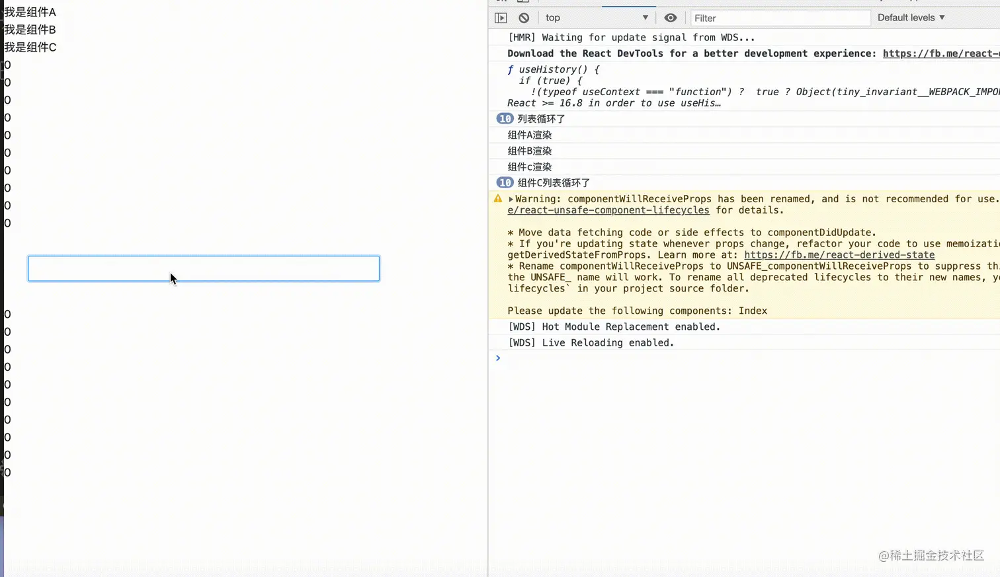

当我们在input输入内容的时候。就会造成如上的现象，所有的不该重新更新的地方，全部重新执行了一遍，这无疑是巨大的性能损耗。这个一个`setState`触发带来的一股巨大的由此组件到子组件可能更深的更新流，带来的副作用是不可估量的。所以我们可以思考一下，是否将这种受控性组件颗粒化，让自己更新 -> 渲染过程由自身调度。

说干就干，我们对上面的input表单单独**颗粒化**处理。

```js
const ComponentInput = memo(function({ notifyFatherChange }:any){
    const [ inputValue , setInputValue ] = useState('')
    const handerChange = useMemo(() => (e) => {
        setInputValue(e.target.value)
        notifyFatherChange && notifyFatherChange(e.target.value)
    },[])
    return <Input   value={inputValue} onChange={ handerChange  }  />
})
```

此时的组件更新由组件单元自行控制，不需要父组件的更新，所以不需要父组件设置独立`state`保留状态。只需要绑定到`this`上即可。不是所有状态都应该放在组件的 state 中. 例如缓存数据。如果需要组件响应它的变动, 或者需要渲染到视图中的数据才应该放到 state 中。这样可以避免不必要的数据变动导致组件重新渲染.

```js
class index extends React.Component<any,any>{
    formData :any = {}
    render(){
        return <div>
            { /*  我们增加三个子组件 */ }
            <ComA />
            <ComB />
            <ComC />
            <div className="box" >
               <ComponentInput notifyFatherChange={ (value)=>{ this.formData.inputValue = value } }  />
               <Button onClick={()=> console.log(this.formData)} >打印数据</Button>
            </div>
            {/* 我们首先来一个列表循环 */}
            {
                new Array(10).fill(0).map((item,index)=>{
                    console.log('列表循环了' )
                    return <div key={index} >{item}</div>
                })
            }
            {
              /* 这里可能是更复杂的结构 */
              /* ------------------ */
            }
        </div>
    }
}
```

**效果**

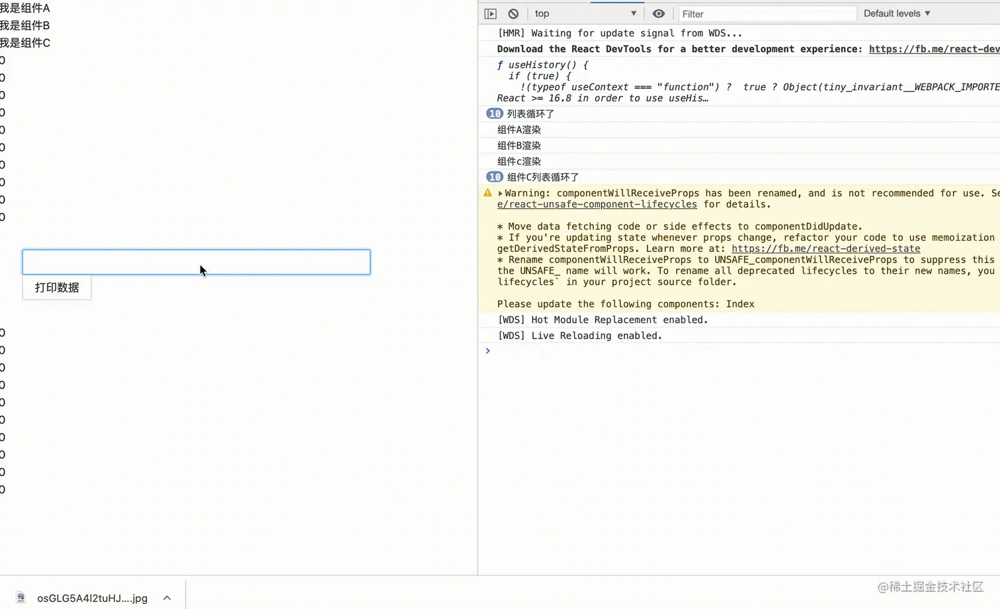

这样除了当前组件外，其他地方没有收到任何渲染波动，达到了我们想要的目的。

### 2 建立独立的请求渲染单元

建立独立的请求渲染单元，直接理解就是，如果我们把页面，分为请求数据展示部分(通过调用后端接口，获取数据)，和基础部分(不需要请求数据，已经直接写好的)，对于一些逻辑交互不是很复杂的数据展示部分，我推荐用一种独立组件，独立请求数据，独立控制渲染的模式。至于为什么我们可以慢慢分析。

首先我们看一下传统的页面模式。

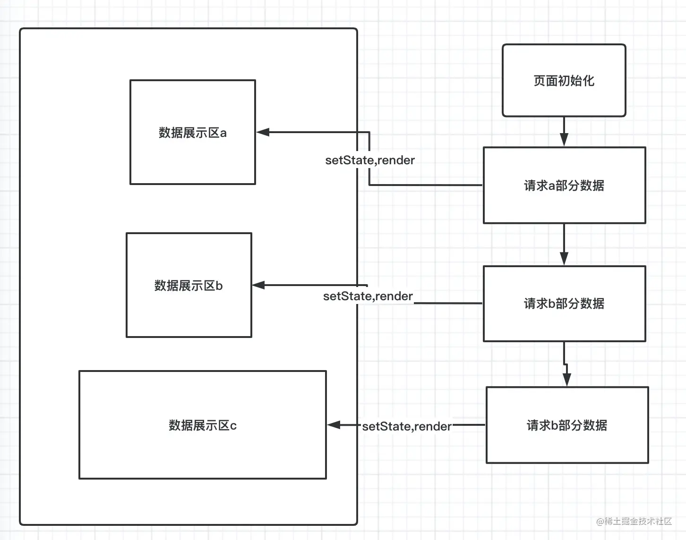

页面有三个展示区域分别，做了三次请求，触发了三次`setState`,渲染三次页面，即使用`Promise.all`等方法，但是也不保证接下来交互中，会有部分展示区重新拉取数据的可能。一旦有一个区域重新拉取数据，另外两个区域也会说、受到牵连，这种效应是不可避免的，即便react有很好的d`diff`算法去调协相同的节点，但是比如长列表等情况，循环在所难免。

```js
class Index extends React.Component{
    state :any={
        dataA:null,
        dataB:null,
        dataC:null
    }
    async componentDidMount(){
        /* 获取A区域数据 */
        const dataA = await getDataA()
        this.setState({ dataA })
        /* 获取B区域数据 */
        const dataB = await getDataB()
        this.setState({ dataB })
        /* 获取C区域数据 */
        const dataC = await getDataC()
        this.setState({ dataC })
    }
    render(){
        const { dataA , dataB , dataC } = this.state
        console.log(dataA,dataB,dataC)
        return <div>
            <div> { /* 用 dataA 数据做展示渲染 */ } </div>
            <div> { /* 用 dataB 数据做展示渲染 */ } </div>
            <div> { /* 用 dataC 数据做展示渲染 */ } </div>
        </div>
    }
}
```

接下来我们，把每一部分抽取出来，形成独立的渲染单元，每个组件都独立数据请求到独立渲染。

```js
function ComponentA(){
    const [ dataA, setDataA ] = useState(null)
    useEffect(()=>{
       getDataA().then(res=> setDataA(res.data)  )
    },[])
    return  <div> { /* 用 dataA 数据做展示渲染 */ } </div>
}

function ComponentB(){
    const [ dataB, setDataB ] = useState(null)
    useEffect(()=>{
       getDataB().then(res=> setDataB(res.data)  )
    },[])
    return  <div> { /* 用 dataB 数据做展示渲染 */ } </div>
}

function ComponentC(){
    const [ dataC, setDataC ] = useState(null)
    useEffect(()=>{
       getDataC().then(res=> setDataC(res.data)  )
    },[])
    return  <div> { /* 用 dataC 数据做展示渲染 */ } </div>
}

function Index (){
    return <div>
        <ComponentA />
        <ComponentB />
        <ComponentC />
    </div>
}
```

这样一来，彼此的数据更新都不会相互影响。

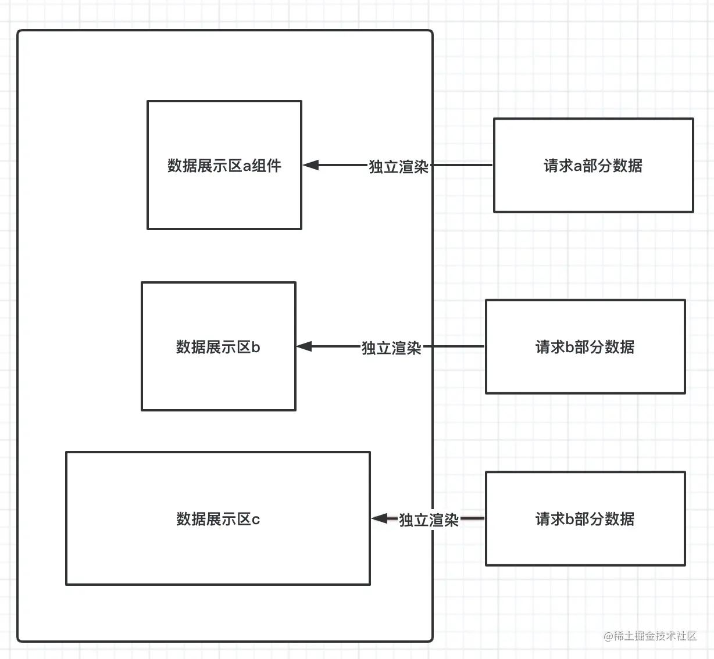

#### 总结

拆分需要单独调用后端接口的细小组件，建立独立的数据请求和渲染，这种依赖数据更新 -> 视图渲染的组件，能从整个体系中抽离出来 ，好处我总结有以下几个方面。

1 可以避免父组件的冗余渲染 ，`react`的数据驱动，依赖于 `state` 和 `props` 的改变，改变`state` 必然会对组件 `render` 函数调用，如果父组件中的子组件过于复杂，一个自组件的 `state` 改变，就会牵一发动全身，必然影响性能，所以如果把很多依赖请求的组件抽离出来，可以直接减少渲染次数。

2 可以优化组件自身性能，无论从`class`声明的有状态组件还是`fun`声明的无状态，都有一套自身优化机制，无论是用`shouldupdate` 还是用 `hooks`中 `useMemo` `useCallback` ，都可以根据自身情况，定制符合场景的渲条 件，使得依赖数据请求组件形成自己一个小的，适合自身的渲染环境。

3 能够和`redux` ,以及`redux`衍生出来 `redux-action` , `dva`,更加契合的工作，用 `connect` 包裹的组件，就能通过制定好的契约，根据所需求的数据更新，而更新自身，而把这种模式用在这种小的，需要数据驱动的组件上，就会起到物尽其用的效果。

## 四 shouldComponentUpdate ,PureComponent 和 React.memo ,immetable.js 助力性能调优

在这里我们拿`immetable.js`为例，讲最传统的限制更新方法，第六部分将要将一些避免重新渲染的细节。

### 1 PureComponent 和 React.memo

`React.PureComponent` 与 `React.Component` 用法差不多 ,但 `React.PureComponent` 通过props和state的浅对比来实现 `shouldComponentUpate()`。如果对象包含复杂的数据结构(比如对象和数组)，他会浅比较，如果深层次的改变，是无法作出判断的，`React.PureComponent` 认为没有变化，而没有渲染试图。

如这个例子

```js
class Text extends React.PureComponent<any,any>{
    render(){
        console.log(this.props)
        return <div>hello,wrold</div>
    }
}
class Index extends React.Component<any,any>{
    state={
        data:{ a : 1 , b : 2 }
    }
    handerClick=()=>{
        const { data } = this.state
        data.a++
        this.setState({ data })
    }
    render(){
        const { data } = this.state
        return <div>
            <button onClick={ this.handerClick } >点击</button>
            <Text data={data} />
        </div>
    }
}
```

**效果**


我们点击按钮，发现 `<Text />` 根本没有重新更新。这里虽然改了`data`但是只是改变了`data`下的属性，所以 `PureComponent` 进行浅比较不会`update`。

想要解决这个问题实际也很容易。

```js
 <Text data={{ ...data }} />
```

无论组件是否是 `PureComponent`，如果定义了 `shouldComponentUpdate()`，那么会调用它并以它的执行结果来判断是否 `update`。在组件未定义 `shouldComponentUpdate()` 的情况下，会判断该组件是否是 `PureComponent`，如果是的话，会对新旧 `props、state` 进行 `shallowEqual` 比较，一旦新旧不一致，会触发渲染更新。

`react.memo` 和 `PureComponent` 功能类似 ，`react.memo` 作为第一个高阶组件，第二个参数 可以对`props` 进行比较 ，和`shouldComponentUpdate`不同的, 当第二个参数返回 `true` 的时候，证明`props`没有改变，不渲染组件，反之渲染组件。

### 2 shouldComponentUpdate

使用 `shouldComponentUpdate()` 以让`React`知道当`state或props`的改变是否影响组件的重新`render`，默认返回`ture`，返回`false`时不会重新渲染更新，而且该方法并不会在初始化渲染或当使用 `forceUpdate()` 时被调用，通常一个`shouldComponentUpdate` 应用是这么写的。

**控制状态**

```js
shouldComponentUpdate(nextProps, nextState) {
  /* 当 state 中 data1 发生改变的时候，重新更新组件 */
  return nextState.data1 !== this.state.data1
}
```

这个的意思就是 仅当`state` 中 `data1` 发生改变的时候，重新更新组件。 **控制prop属性**

```js
shouldComponentUpdate(nextProps, nextState) {
  /* 当 props 中 data2发生改变的时候，重新更新组件 */
  return nextProps.data2 !== this.props.data2
}
```

这个的意思就是 仅当`props` 中 `data2` 发生改变的时候，重新更新组件。

### 3 immetable.js

`immetable.js` 是Facebook 开发的一个`js`库，可以提高对象的比较性能，像之前所说的`pureComponent` 只能对对象进行浅比较，,对于对象的数据类型,却束手无策,所以我们可以用 `immetable.js` 配合 `shouldComponentUpdate` 或者 `react.memo`来使用。`immutable` 中

我们用`react-redux`来简单举一个例子，如下所示 数据都已经被 `immetable.js`处理。

```js
import { is  } from 'immutable'
const GoodItems = connect(state =>
    ({ GoodItems: filter(state.getIn(['Items', 'payload', 'list']), state.getIn(['customItems', 'payload', 'list'])) || Immutable.List(), })
    /* 此处省略很多代码～～～～～～ */
)(memo(({ Items, dispatch, setSeivceId }) => {
   /*  */
}, (pre, next) => is(pre.Items, next.Items)))
```

通过 `is` 方法来判断，前后`Items`(对象数据类型)是否发生变化。

## 五 规范写法，合理处理细节问题

有的时候，我们在敲代码的时候，稍微注意以下，就能避免性能的开销。也许只是稍加改动，就能其他优化性能的效果。

### ①绑定事件尽量不要使用箭头函数

#### 面临问题

众所周知，`react`更新来大部分情况自于`props`的改变(被动渲染)，和`state`改变(主动渲染)。当我们给未加任何更新限定条件子组件绑定事件的时候，或者是`PureComponent` 纯组件， 如果我们箭头函数使用的话。

```js
<ChildComponent handerClick={()=>{ console.log(666) }}  />
```

每次渲染时都会创建一个新的事件处理器，这会导致 `ChildComponent` 每次都会被渲染。

即便我们用箭头函数绑定给`dom`元素。

```jsx
<div onClick={ ()=>{ console.log(777) } } >hello,world</div>
```

每次`react`合成事件事件的时候，也都会重新声明一个新事件。

#### 解决问题

解决这个问题事件很简单，分为无状态组件和有状态组件。

**有状态组件**

```js
class index extends React.Component{
    handerClick=()=>{
        console.log(666)
    }
    handerClick1=()=>{
        console.log(777)
    }
    render(){
        return <div>
            <ChildComponent handerClick={ this.handerClick }  />
            <div onClick={ this.handerClick1 }  >hello,world</div>
        </div>
    }
}
```

**无状态组件**

```js
function index(){

    const handerClick1 = useMemo(()=>()=>{
       console.log(777)
    },[])  /* [] 存在当前 handerClick1 的依赖项*/
    const handerClick = useCallback(()=>{ console.log(666) },[])  /* [] 存在当前 handerClick 的依赖项*/
    return <div>
        <ChildComponent handerClick={ handerClick }  />
        <div onClick={ handerClick1 }  >hello,world</div>
    </div>
}
```

对于`dom`，如果我们需要传递参数。我们可以这么写。

```js
function index(){
    const handerClick1 = useMemo(()=>(event)=>{
        const mes = event.currentTarget.dataset.mes
        console.log(mes) /* hello,world */
    },[])
    return <div>
        <div  data-mes={ 'hello,world' } onClick={ handerClick1 }  >hello,world</div>
    </div>
}
```

### ②循环正确使用key

无论是`react` 和 `vue`,正确使用`key`,目的就是在一次循环中，找到与新节点对应的老节点，复用节点，节省开销。想深入理解的同学可以看一下笔者的另外一篇文章 [全面解析 vue3.0 diff算法](https://juejin.cn/post/6861960532048642061) 里面有对`key`详细说明。我们今天来看以下`key`正确用法,和错误用法。

#### 1 错误用法

**错误用法一：用index做key**

```js
function index(){
    const list = [ { id:1 , name:'哈哈' } , { id:2, name:'嘿嘿' } ,{ id:3 , name:'嘻嘻' } ]
    return <div>
       <ul>
         {  list.map((item,index)=><li key={index} >{ item.name }</li>)  }
       </ul>
    </div>
}
```

这种加`key`的性能,实际和不加`key`效果差不多，每次还是从头到尾diff。

**错误用法二:用index拼接其他的字段**

```js
function index(){
    const list = [ { id:1 , name:'哈哈' } , { id:2, name:'嘿嘿' } ,{ id:3 , name:'嘻嘻' } ]
    return <div>
       <ul>
         {  list.map((item,index)=><li key={index + item.name } >{ item.name }</li>)  }
       </ul>
    </div>
}
```

如果有元素移动或者删除，那么就失去了一一对应关系，剩下的节点都不能有效复用。

#### 2 正确用法

**正确用法：用唯一id作为key**

```js
function index(){
    const list = [ { id:1 , name:'哈哈' } , { id:2, name:'嘿嘿' } ,{ id:3 , name:'嘻嘻' } ]
    return <div>
       <ul>
         {  list.map((item,index)=><li key={ item.id } >{ item.name }</li>)  }
       </ul>
    </div>
}
```

用唯一的健`id`作为`key`,能够做到有效复用元素节点。

### ③无状态组件`hooks-useMemo` 避免重复声明。

对于无状态组件，数据更新就等于函数上下文的重复执行。那么函数里面的变量，方法就会重新声明。比如如下情况。

```js
function Index(){
    const [ number , setNumber  ] = useState(0)
    const handerClick1 = ()=>{
        /* 一些操作 */
    }
    const handerClick2 = ()=>{
        /* 一些操作 */
    }
    const handerClick3 = ()=>{
        /* 一些操作 */
    }
    return <div>
        <a onClick={ handerClick1 } >点我有惊喜1</a>
        <a onClick={ handerClick2 } >点我有惊喜2</a>
        <a onClick={ handerClick3 } >点我有惊喜3</a>
        <button onClick={ ()=> setNumber(number+1) } > 点击 { number } </button>
    </div>
}
```

每次点击`button`的时候,都会执行`Index`函数。`handerClick1` , `handerClick2`,`handerClick3`都会重新声明。为了避免这个情况的发生，我们可以用 `useMemo` 做缓存，我们可以改成如下。

```js
function Index(){
    const [ number , setNumber  ] = useState(0)
    const [ handerClick1 , handerClick2  ,handerClick3] = useMemo(()=>{
        const fn1 = ()=>{
            /* 一些操作 */
        }
        const fn2 = ()=>{
            /* 一些操作 */
        }
        const  fn3= ()=>{
            /* 一些操作 */
        }
        return [fn1 , fn2 ,fn3]
    },[]) /* 只有当数据里面的依赖项，发生改变的时候，才会重新声明函数。 */
    return <div>
        <a onClick={ handerClick1 } >点我有惊喜1</a>
        <a onClick={ handerClick2 } >点我有惊喜2</a>
        <a onClick={ handerClick3 } >点我有惊喜3</a>
        <button onClick={ ()=> setNumber(number+1) } > 点击 { number } </button>
    </div>
}
```

如下改变之后，`handerClick1` , `handerClick2`,`handerClick3` 会被缓存下来。

### ④懒加载 Suspense 和 lazy

`Suspense` 和 `lazy` 可以实现 `dynamic import` 懒加载效果，原理和上述的路由懒加载差不多。在 `React` 中的使用方法是在 `Suspense` 组件中使用 `<LazyComponent>` 组件。

```js
const LazyComponent = React.lazy(() => import('./LazyComponent'));

function demo () {
  return (
    <div>
      <Suspense fallback={<div>Loading...</div>}>
        <LazyComponent />
      </Suspense>
    </div>
  )
}
```

`LazyComponent` 是通过懒加载加载进来的，所以渲染页面的时候可能会有延迟，但使用了 `Suspense` 之后，在加载状态下，可以用`<div>Loading...</div>`作为`loading`效果。

`Suspense` 可以包裹多个懒加载组件。

```js
<Suspense fallback={<div>Loading...</div>}>
    <LazyComponent />
    <LazyComponent1 />
</Suspense>
```

## 六 多种方式避免重复渲染

**避免重复渲染**,是`react`性能优化的重要方向。如果想尽心尽力处理好`react`项目每一个细节，那么就要从每一行代码开始，从每一组件开始。正所谓不积硅步无以至千里。

### ① 学会使用的批量更新

#### 批量更新

这次讲的批量更新的概念，实际主要是针对无状态组件和`hooks`中`useState`,和 `class`有状态组件中的`this.setState`，两种方法已经做了批量更新的处理。比如如下例子

**一次更新中**

```js
class index extends React.Component{
    constructor(prop){
        super(prop)
        this.state = {
            a:1,
            b:2,
            c:3,
        }
    }
    handerClick=()=>{
        const { a,b,c } :any = this.state
        this.setState({ a:a+1 })
        this.setState({ b:b+1 })
        this.setState({ c:c+1 })
    }
    render= () => <div onClick={this.handerClick} />
}
```

点击事件发生之后，会触发三次 `setState`,但是不会渲染三次，因为有一个批量更新`batchUpdate`批量更新的概念。三次`setState`最后被合成类似如下样子

```js
this.setState({
    a:a+1 ,
    b:b+1 ,
    c:c+1
})
```

**无状态组件中**

```js
    const  [ a , setA ] = useState(1)
    const  [ b , setB ] = useState({})
    const  [ c , setC ] = useState(1)
    const handerClick = () => {
        setB( { ...b } )
        setC( c+1 )
        setA( a+1 )
    }
```

#### 批量更新失效

当我们针对上述两种情况加以如下处理之后。

```js
handerClick=()=>{
    setTimeout(() => {
        this.setState({ a:a+1 })
        this.setState({ b:b+1 })
        this.setState({ c:c+1 })
    }, 0)
}
```

```js
 const handerClick = () => {
    Promise.resolve().then(()=>{
    setB( { ...b } )
    setC( c+1 )
    setA( a+1 )
    })
}
```

我们会发现，上述两种情况 ，组件都更新渲染了三次 ，此时的批量更新失效了。这种情况在`react-hooks`中也普遍存在，这种情况甚至在`hooks`中更加明显，因为我们都知道`hooks`中每个`useState`保存了一个状态，并不是让`class`声明组件中，可以通过`this.state`统一协调状态，再一次异步函数中，比如说一次`ajax`请求后，想通过多个`useState`改变状态，会造成多次渲染页面，为了解决这个问题，我们可以手动批量更新。

#### 手动批量更新

`react-dom` 中提供了`unstable_batchedUpdates`方法进行手动批量更新。这个`api`更契合`react-hooks`，我们可以这样做。

```js
 const handerClick = () => {
    Promise.resolve().then(()=>{
        unstable_batchedUpdates(()=>{
            setB( { ...b } )
            setC( c+1 )
            setA( a+1 )
        })
    })
}
```

这样三次更新，就会合并成一次。同样达到了批量更新的效果。

### ② 合并state

#### class类组件(有状态组件)

合并`state`这种，是一种我们在`react`项目开发中要养成的习惯。我看过有些同学的代码中可能会这么写(如下`demo`是模拟的情况，实际要比这复杂的多)。

```js
class Index extends React.Component<any , any>{
    state = {
          loading:false /* 用来模拟loading效果 */,
          list:[],
    }
    componentDidMount(){
        /* 模拟一个异步请求数据场景 */
        this.setState({ loading : true }) /* 开启loading效果 */
        Promise.resolve().then(()=>{
            const list = [ { id:1 , name: 'xixi' } ,{ id:2 , name: 'haha' },{ id:3 , name: 'heihei' } ]
            this.setState({ loading : false },()=>{
                this.setState({
                    list:list.map(item=>({
                        ...item,
                        name:item.name.toLocaleUpperCase()
                    }))
                })
            })
        })
    }
    render(){
    const { list } = this.state
    return <div>{
            list.map(item=><div key={item.id}  >{ item.name }</div>)
        }</div>
    }
}
```

分别用两次`this.state`第一次解除`loading`状态，第二次格式化数据列表。这另两次更新完全没有必要，可以用一次`setState`更新完美解决。不这样做的原因是，对于像`demo`这样的简单结构还好，对于复杂的结构，一次更新可能都是宝贵的，所以我们应该学会去合并state。将上述demo这样修改。

```js
this.setState({
    loading : false,
    list:list.map(item=>({
        ...item,
        name:item.name.toLocaleUpperCase()
    }))
})
```

#### 函数组件(无状态组件)

对于无状态组件，我们可以通过一个`useState`保存多个状态，没有必要每一个状态都用一个`useState`。

对于这样的情况。

```js
const [ a ,setA ] = useState(1)
const [ b ,setB ] = useState(2)
```

我们完全可以一个`state`搞定。

```js
const [ numberState , setNumberState ] = useState({ a:1 , b :2})
```

但是要注意，如果我们的state已经成为 `useEffect` , `useCallback` , `useMemo`依赖项，请慎用如上方法。

### ③ useMemo React.memo隔离单元

`react`正常的更新流，就像利剑一下，从父组件项子组件穿透，为了避免这些重复的更新渲染，`shouldComponentUpdate` , `React.memo`等`api`也应运而生。但是有的情况下，多余的更新在所难免，比如如下这种情况。这种更新会由父组件 -> 子组件 传递下去。

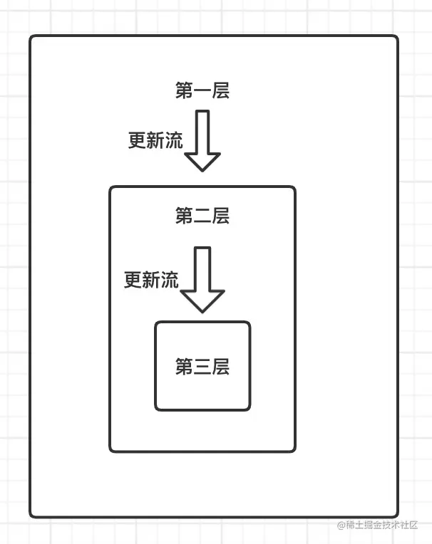

```js
function ChildrenComponent(){
    console.log(2222)
    return <div>hello,world</div>
}
function Index (){
    const [ list  ] = useState([ { id:1 , name: 'xixi' } ,{ id:2 , name: 'haha' },{ id:3 , name: 'heihei' } ])
    const [ number , setNumber ] = useState(0)
    return <div>
       <span>{ number }</span>
       <button onClick={ ()=> setNumber(number + 1) } >点击</button>
           <ul>
               {
                list.map(item=>{
                    console.log(1111)
                    return <li key={ item.id }  >{ item.name }</li>
                })
               }
           </ul>
           <ChildrenComponent />
    </div>
}
```

**效果**

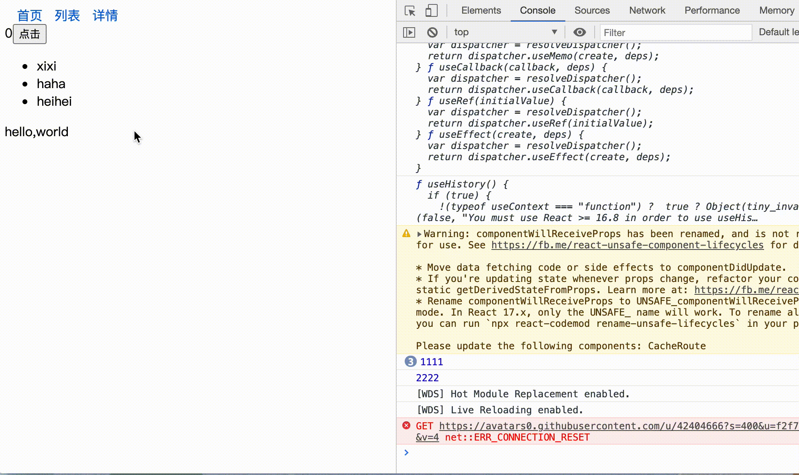

针对这一现象，我们可以通过使用`useMemo`进行隔离，形成独立的渲染单元，每次更新上一个状态会被缓存，循环不会再执行，子组件也不会再次被渲染,我们可以这么做。

```js
function Index (){
    const [ list  ] = useState([ { id:1 , name: 'xixi' } ,{ id:2 , name: 'haha' },{ id:3 , name: 'heihei' } ])
    const [ number , setNumber ] = useState(0)
    return <div>
       <span>{ number }</span>
       <button onClick={ ()=> setNumber(number + 1) } >点击</button>
           <ul>
               {
                useMemo(()=>(list.map(item=>{
                    console.log(1111)
                    return <li key={ item.id }  >{ item.name }</li>
                })),[ list ])
               }
           </ul>
        { useMemo(()=> <ChildrenComponent />,[]) }
    </div>
}
```

**有状态组件**

在`class`声明的组件中，没有像 `useMemo` 的`API` ，但是也并不等于束手无策，我们可以通过 `react.memo` 来阻拦来自组件本身的更新。我们可以写一个组件，来控制`react` 组件更新的方向。我们通过一个 `<NotUpdate>` 组件来阻断更新流。

```js
/* 控制更新 ,第二个参数可以作为组件更新的依赖 ， 这里设置为 ()=> true 只渲染一次 */
const NotUpdate = React.memo(({ children }:any)=> typeof children === 'function' ? children() : children ,()=>true)

class Index extends React.Component<any,any>{
    constructor(prop){
        super(prop)
        this.state = {
            list: [ { id:1 , name: 'xixi' } ,{ id:2 , name: 'haha' },{ id:3 , name: 'heihei' } ],
            number:0,
         }
    }
    handerClick = ()=>{
        this.setState({ number:this.state.number + 1 })
    }
    render(){
       const { list }:any = this.state
       return <div>
           <button onClick={ this.handerClick } >点击</button>
           <NotUpdate>
              {()=>(<ul>
                    {
                    list.map(item=>{
                        console.log(1111)
                        return <li key={ item.id }  >{ item.name }</li>
                    })
                    }
                </ul>)}
           </NotUpdate>
           <NotUpdate>
                <ChildrenComponent />
           </NotUpdate>

       </div>
    }
}
```

```js
const NotUpdate = React.memo(({ children }:any)=> typeof children === 'function' ? children() : children ,()=>true)
```

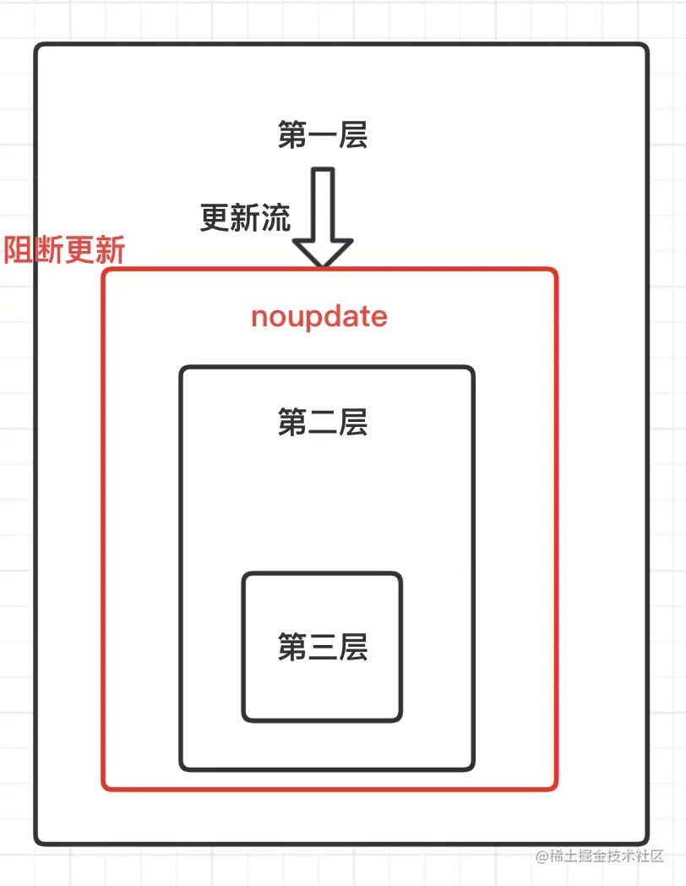

没错，用的就是 `React.memo`，生成了阻断更新的隔离单元，如果我们想要控制更新，可以对 `React.memo` 第二个参数入手， `demo`项目中完全阻断的更新。

### ④ ‘取缔’state，学会使用缓存。

这里的取缔`state`，并完全不使用`state`来管理数据，而是善于使用`state`,知道什么时候使用,怎么使用。`react` 并不像 `vue` 那样响应式数据流。 在 `vue`中 有专门的`dep`做依赖收集，可以自动收集字符串模版的依赖项，只要没有引用的`data`数据， 通过 `this.aaa = bbb` ,在`vue`中是不会更新渲染的。因为 `aaa` 的`dep`没有收集渲染`watcher`依赖项。在`react`中，我们触发`this.setState` 或者 `useState`，只会关心两次`state`值是否相同，来触发渲染，根本不会在乎`jsx`语法中是否真正的引入了正确的值。

#### 没有更新作用的state

**有状态组件中**

```js
class Demo extends React.Component{
    state={ text:111 }
    componentDidMount(){
        const { a } = this.props
         /* 我们只是希望在初始化,用text记录 props中 a 的值 */
        this.setState({
            text:a
        })
    }
    render(){
        /* 没有引入text */
       return <div>{'hello,world'}</div>
    }
}
```

如上例子中,`render`函数中并没有引入`text` ,我们只是希望在初始化的时候，用 `text` 记录 `props` 中 `a` 的值。我们却用 `setState` 触发了一次无用的更新。无状态组件中情况也一样存在，具体如下。

**无状态组件中**

```js
function Demo ({ a }){
    const [text , setText] = useState(111)
    useEffect(()=>{
        setText(a)
    },[])
    return <div>
         {'hello,world'}
    </div>
}
```

#### 改为缓存

**有状态组件中**

在`class`声明组件中，我们可以直接把数据绑定给`this`上，来作为数据缓存。

```js
class Demo extends React.Component{
    text = 111
    componentDidMount(){
        const { a } = this.props
        /* 数据直接保存在text上 */
        this.text = a
    }
    render(){
        /* 没有引入text */
       return <div>{'hello,world'}</div>
    }
}
```

**无状态组件中**

在无状态组件中, 我们不能往问`this`,但是我们可以用`useRef`来解决问题。

```js
function Demo ({ a }){
    const text = useRef(111)
    useEffect(()=>{
        text.current = a
    },[])
    return <div>
        {'hello,world'}
    </div>
}
```

### ⑤ useCallback回调

`useCallback` 的真正目的还是在于缓存了每次渲染时 `inline callback` 的实例，这样方便配合上子组件的 `shouldComponentUpdate` 或者 `React.memo` 起到减少不必要的渲染的作用。对子组件的渲染限定来源与，对子组件`props`比较，但是如果对父组件的`callback`做比较，无状态组件每次渲染执行，都会形成新的`callback` ,是无法比较，所以需要对`callback`做一个 `memoize` 记忆功能，我们可以理解为`useCallback`就是 `callback`加了一个`memoize`。我们接着往下看👇👇👇。

```js
function demo (){
    const [ number , setNumber ] = useState(0)
    return <div>
        <DemoComponent  handerChange={ ()=>{ setNumber(number+1)  } } />
    </div>
}
```

或着

```js
function demo (){
    const [ number , setNumber ] = useState(0)
    const handerChange = ()=>{
        setNumber(number+1)
    }
    return <div>
        <DemoComponent  handerChange={ handerChange } />
    </div>
}
```

无论是上述那种方式，`pureComponent` 和 `react.memo` 通过浅比较方式，只能判断每次更新都是新的`callback`，然后触发渲染更新。`useCallback`给加了一个记忆功能，告诉我们子组件，两次是相同的 `callback`无需重新更新页面。至于什么时候`callback`更改，就要取决于 `useCallback` 第二个参数。好的，将上述`demo`我们用 `useCallback` 重写。

```js
function demo (){
    const [ number , setNumber ] = useState(0)
    const handerChange = useCallback( ()=>{
        setNumber(number+1)
    },[])
    return <div>
        <DemoComponent  handerChange={ handerChange } />
    </div>
}
```

这样 `pureComponent` 和 `react.memo` 可以直接判断是`callback`没有改变，防止了不必要渲染。

## 七 中规中矩的使用状态管理

无论我们使用的是`redux`还是说 `redux` 衍生出来的 `dva` ,`redux-saga`等,或者是`mobx`，都要遵循一定'使用规则'，首先让我想到的是，**什么时候用状态管理**，**怎么合理的应用状态管理**，接下来我们来分析一下。

### 什么时候使用状态管理

要问我什么时候适合使用状态状态管理。我一定会这么分析，首先状态管理是为了解决什么问题，状态管理能够解决的问题主要分为两个方面，一 就是解决跨层级组件通信问题 。二 就是对一些全局公共状态的缓存。

我们那redux系列的状态管理为例子。

我见过又同学这么写的

#### 滥用状态管理

```tsx
/* 和 store下面text模块的list列表，建立起依赖关系，list更新，组件重新渲染 */
@connect((store)=>({ list:store.text.list }))
class Text extends React.Component{
    constructor(prop){
        super(prop)
    }
    componentDidMount(){
        /* 初始化请求数据 */
        this.getList()
    }
    getList=()=>{
        const { dispatch } = this.props
        /* 获取数据 */
        dispatch({ type:'text/getDataList' })
    }
    render(){
        const { list } = this.props
        return <div>
            {
                list.map(item=><div key={ item.id } >
                    { /*  做一些渲染页面的操作....  */ }
                </div>)
            }
            <button onClick={ ()=>this.getList() } >重新获取列表</button>
        </div>
    }
}
```

这样页面请求数据，到数据更新，全部在当前组件发生，这个写法我不推荐，此时的数据走了一遍状态管理,最终还是回到了组件本身，显得很鸡肋，并没有发挥什么作用。在性能优化上到不如直接在组件内部请求数据。

#### 不会合理使用状态管理

还有的同学可能这么写。

```js
class Text extends React.Component{
    constructor(prop){
        super(prop)
        this.state={
            list:[],
        }
    }
    async componentDidMount(){
        const { data , code } = await getList()
        if(code === 200){
            /*  获取的数据有可能是不常变的，多个页面需要的数据  */
            this.setState({
                list:data
            })
        }
    }
    render(){
        const { list } = this.state
        return <div>
            { /*  下拉框 */ }
            <select>
               {
                  list.map(item=><option key={ item.id } >{ item.name }</option>)
               }
            </select>
        </div>
    }
}
```

对于不变的数据，多个页面或组件需要的数据，为了避免重复请求,我们可以将数据放在状态管理里面。

### 如何使用状态管理

#### 分析结构

我们要学会分析页面，那些数据是不变的，那些是随时变动的，用以下`demo`页面为例子：


如上 红色区域，是基本不变的数据，多个页面可能需要的数据，我们可以统一放在状态管理中，蓝色区域是随时更新的数据，直接请求接口就好。

#### 总结

**不变的数据，多个页面可能需要的数据，放在状态管理中，对于时常变化的数据，我们可以直接请求接口**

## 八 海量数据优化-时间分片，虚拟列表

### 时间分片

时间分片的概念，就是一次性渲染大量数据，初始化的时候会出现卡顿等现象。我们必须要明白的一个道理，**js执行永远要比dom渲染快的多。** ，所以对于大量的数据，一次性渲染，容易造成卡顿，卡死的情况。我们先来看一下例子

```js
class Index extends React.Component<any,any>{
    state={
       list: []
    }
    handerClick=()=>{
       let starTime = new Date().getTime()
       this.setState({
           list: new Array(40000).fill(0)
       },()=>{
          const end =  new Date().getTime()
          console.log( (end - starTime ) / 1000 + '秒')
       })
    }
    render(){
        const { list } = this.state
        console.log(list)
        return <div>
            <button onClick={ this.handerClick } >点击</button>
            {
                list.map((item,index)=><li className="list"  key={index} >
                    { item  + '' + index } Item
                </li>)
            }
        </div>
    }
}
```

我们模拟一次性渲染 40000 个数据的列表，看一下需要多长时间。

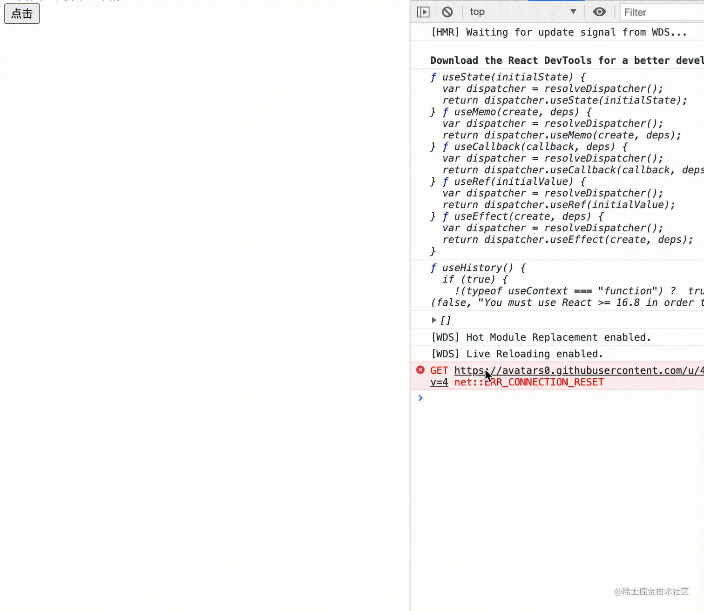

我们看到 40000 个 简单列表渲染了，将近5秒的时间。为了解决一次性加载大量数据的问题。我们引出了时间分片的概念，就是用`setTimeout`把任务分割，分成若干次来渲染。一共40000个数据，我们可以每次渲染100个， 分次400渲染。

```js
class Index extends React.Component<any,any>{
    state={
       list: []
    }
    handerClick=()=>{
       this.sliceTime(new Array(40000).fill(0), 0)
    }
    sliceTime=(list,times)=>{
        if(times === 400) return
        setTimeout(() => {
            const newList = list.slice( times , (times + 1) * 100 ) /* 每次截取 100 个 */
            this.setState({
                list: this.state.list.concat(newList)
            })
            this.sliceTime( list ,times + 1 )
        }, 0)
    }
    render(){
        const { list } = this.state
        return <div>
            <button onClick={ this.handerClick } >点击</button>
            {
                list.map((item,index)=><li className="list"  key={index} >
                    { item  + '' + index } Item
                </li>)
            }
        </div>
    }
}
```

**效果**


`setTimeout` 可以用 `window.requestAnimationFrame()` 代替，会有更好的渲染效果。 我们`demo`使用列表做的，实际对于列表来说，最佳方案是虚拟列表，而时间分片，更适合**热力图，地图点位比较多的情况**。

### 虚拟列表

笔者在最近在做小程序商城项目，有长列表的情况， 可是肯定说 **虚拟列表** 是解决长列表渲染的最佳方案。无论是小程序，或者是`h5` ，随着 `dom`元素越来越多，页面会越来越卡顿,这种情况在小程序更加明显 。稍后，笔者讲专门写一篇小程序长列表渲染缓存方案的文章，感兴趣的同学可以关注一下笔者。

虚拟列表是按需显示的一种技术，可以根据用户的滚动，不必渲染所有列表项，而只是渲染可视区域内的一部分列表元素的技术。正常的虚拟列表分为 渲染区，缓冲区 ，虚拟列表区。

如下图所示。

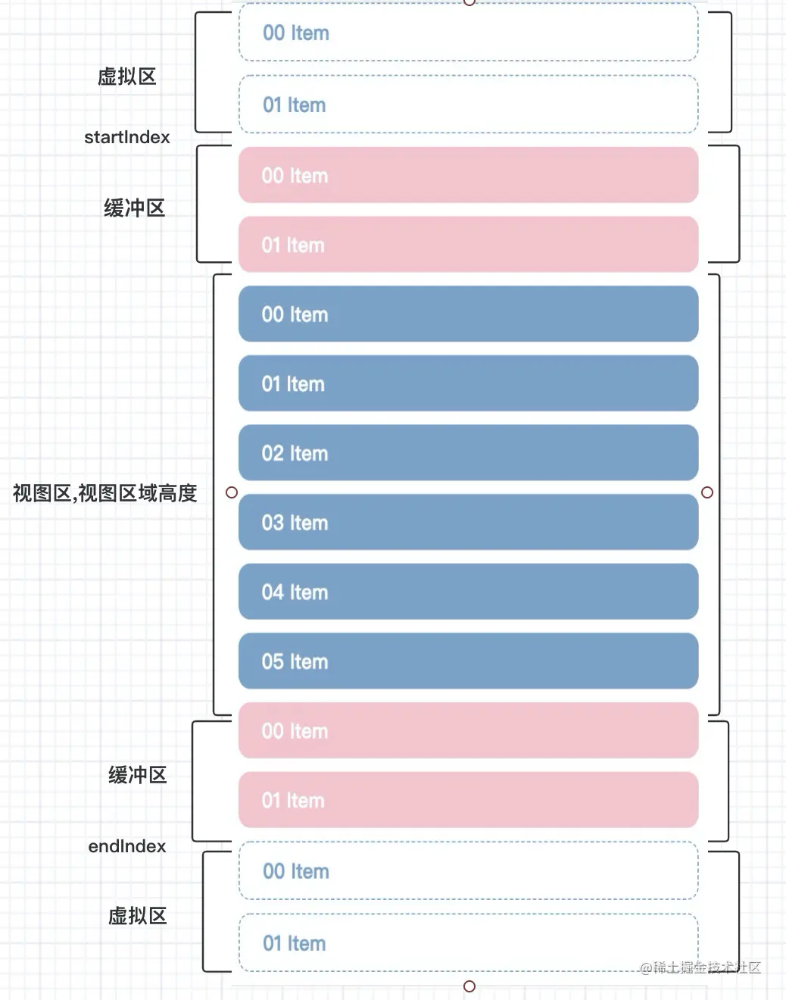

为了防止大量`dom`存在影响性能，我们只对，渲染区和缓冲区的数据做渲染，，虚拟列表区 没有真实的dom存在。 缓冲区的作用就是防止快速下滑或者上滑过程中，会有空白的现象。

#### react-tiny-virtual-list

react-tiny-virtual-list 是一个较为轻量的实现虚拟列表的组件。这是官方文档。

```js
import React from 'react';
import {render} from 'react-dom';
import VirtualList from 'react-tiny-virtual-list';

const data = ['A', 'B', 'C', 'D', 'E', 'F', ...];

render(
  <VirtualList
    width='100%'
    height={600}
    itemCount={data.length}
    itemSize={50} // Also supports variable heights (array or function getter)
    renderItem={({index, style}) =>
      <div key={index} style={style}> // The style property contains the item's absolute position
        Letter: {data[index]}, Row: #{index}
      </div>
    }
  />,
  document.getElementById('root')
);
```

#### 手写一个react虚拟列表

```js
let num  = 0
class Index extends React.Component<any, any>{
    state = {
        list: new Array(9999).fill(0).map(() =>{
            num++
            return num
        }),
        scorllBoxHeight: 500, /* 容器高度(初始化高度) */
        renderList: [],       /* 渲染列表 */
        itemHeight: 60,       /* 每一个列表高度 */
        bufferCount: 8,       /* 缓冲个数 上下四个 */
        renderCount: 0,       /* 渲染数量 */
        start: 0,             /* 起始索引 */
        end: 0                /* 终止索引 */
    }
    listBox: any = null
    scrollBox : any = null
    scrollContent:any = null
    componentDidMount() {
        const { itemHeight, bufferCount } = this.state
        /* 计算容器高度 */
        const scorllBoxHeight = this.listBox.offsetHeight
        const renderCount = Math.ceil(scorllBoxHeight / itemHeight) + bufferCount
        const end = renderCount + 1
        this.setState({
            scorllBoxHeight,
            end,
            renderCount,
        })
    }
    /* 处理滚动效果 */
    handerScroll=()=>{
        const { scrollTop } :any =  this.scrollBox
        const { itemHeight , renderCount } = this.state
        const currentOffset = scrollTop - (scrollTop % itemHeight)
        /* translate3d 开启css cpu 加速 */
        this.scrollContent.style.transform = `translate3d(0, ${currentOffset}px, 0)`
        const start = Math.floor(scrollTop / itemHeight)
        const end = Math.floor(scrollTop / itemHeight + renderCount + 1)
        this.setState({
            start,
            end,
       })
    }
     /* 性能优化：只有在列表start 和 end 改变的时候在渲染列表 */
    shouldComponentUpdate(_nextProps, _nextState){
        const { start , end } = _nextState
        return start !== this.state.start || end !==this.state.end
    }
    /* 处理滚动效果 */
    render() {
        console.log(1111)
        const { list, scorllBoxHeight, itemHeight ,start ,end } = this.state
        const renderList = list.slice(start,end)
        return <div className="list_box"
            ref={(node) => this.listBox = node}
        >
            <div
               style={{ height: scorllBoxHeight, overflow: 'scroll', position: 'relative' }}
               ref={ (node)=> this.scrollBox = node }
               onScroll={ this.handerScroll }
            >
                { /* 占位作用 */}
                <div style={{ height: `${list.length * itemHeight}px`, position: 'absolute', left: 0, top: 0, right: 0 }} />
                { /* 显然区 */ }
                <div ref={(node) => this.scrollContent = node} style={{ position: 'relative', left: 0, top: 0, right: 0 }} >
                    {
                        renderList.map((item, index) => (
                            <div className="list" key={index} >
                                {item + '' } Item
                            </div>
                        ))
                    }
                </div>
            </div>

        </div>
    }
}
```

**效果**


**具体思路**

① 初始化计算容器的高度。截取初始化列表长度。这里我们需要div占位,撑起滚动条。

② 通过监听滚动容器的 `onScroll`事件,根据 `scrollTop` 来计算渲染区域向上偏移量, 我们要注意的是，当我们向下滑动的时候，为了渲染区域，能在可视区域内，可视区域要向上的滚动; 我们向上滑动的时候，可视区域要向下的滚动。

③ 通过重新计算的 `end` 和 `start` 来重新渲染列表。

**性能优化点**

① 对于移动视图区域，我们可以用 `transform` 来代替改变 `top`值。

② 虚拟列表实际情况，是有 `start` 或者 `end` 改变的时候，在重新渲染列表，所以我们可以用之前 `shouldComponentUpdate` 来调优，避免重复渲染。

## 常见考点

### 1. **组件渲染优化**

- **考察点**：如何减少不必要的渲染，避免性能浪费。
- **问题示例**：<br>
  - 什么时候应该使用 `React.memo`？它的局限性是什么？
  - `useMemo` 和 `useCallback` 的作用是什么？它们有什么区别？
  - React 组件的 `key` 属性有什么作用？错误使用 `key` 会导致什么问题？
  - 在 React 中，如何减少组件的重新渲染？有哪些方式？

### 2. **状态管理优化**

- **考察点**：状态更新的合理性，如何避免不必要的 re-render。
- **问题示例**：<br>
  - 为什么频繁更新 `useState` 可能会影响性能？如何优化？
  - `useReducer` 在什么场景下比 `useState` 更优？
  - React 组件内部的状态应该如何设计，才能减少不必要的渲染？
  - 全局状态（Redux、Context API）对性能有哪些影响？如何优化 Redux 相关性能问题？

### 3. **Virtual DOM 及 Diff 算法**

- **考察点**：理解 React 的 Virtual DOM 及其工作原理，如何提升 DOM 更新效率。
- **问题示例**：<br>
  - React 是如何使用 Virtual DOM 进行渲染的？
  - 介绍一下 React 的 Diff 算法，如何减少不必要的 DOM 更新？
  - `shouldComponentUpdate` 在类组件中如何使用？它的替代方案是什么？

### 4. **异步渲染 & 并发模式**

- **考察点**：React 18 的并发特性，以及如何避免阻塞主线程。
- **问题示例**：<br>
  - 什么是 React 18 的 Concurrent Mode，并发渲染如何提升性能？
  - `useTransition` 的作用是什么？适用于哪些场景？
  - `React.lazy` 和 `Suspense` 如何优化 React 应用的性能？
  - 介绍一下 `useDeferredValue` 的作用，和 `useTransition` 的区别是什么？

### 5. **列表渲染优化**

- **考察点**：长列表的渲染性能问题及优化策略。
- **问题示例**：<br>
  - 当列表数据量较大时，直接使用 `map` 渲染会有什么问题？如何优化？
  - React 中如何实现虚拟列表（Virtual List）？常见的库有哪些？
  - `windowing` 技术是如何提高 React 渲染性能的？
  - `react-window` 和 `react-virtualized` 的核心原理是什么？

### 6. **代码拆分与懒加载**

- **考察点**：按需加载、动态导入，减少首屏加载时间。
- **问题示例**：<br>
  - 在 React 中如何实现代码拆分？有哪些常见的方法？
  - `React.lazy` 的工作原理是什么？和 `import()` 有什么关系？
  - 如何配合 `Suspense` 进行懒加载？它的局限性是什么？
  - 代码拆分后，如何处理多个异步加载组件的错误？

### 7. **事件处理优化**

- **考察点**：事件绑定、事件代理、避免性能开销。
- **问题示例**：<br>
  - React 事件系统是如何工作的？事件代理有什么作用？
  - 如何优化 React 事件绑定，避免事件过多导致的性能问题？
  - `useCallback` 在事件处理函数中应该如何使用？什么时候会导致性能问题？
  - 如何在 React 中实现全局事件监听，避免性能损耗？

### 8. **SSR（服务器端渲染）优化**

- **考察点**：SSR 的渲染方式、影响以及优化手段。
- **问题示例**：<br>
  - 什么时候应该使用 Server-Side Rendering（SSR）？SSR 如何提升 React 应用的性能？
  - 在 Next.js 中，`getServerSideProps` 和 `getStaticProps` 有什么区别？如何选择？
  - React SSR 如何避免“水合（Hydration）”问题？
  - React 18 中的 Streaming SSR 如何优化页面加载速度？

### 9. **生产环境优化**

- **考察点**：构建优化、减少打包体积、提升加载速度。
- **问题示例**：<br>
  - 如何减少 React 应用的打包体积？
  - `webpack` 如何优化 React 项目？Tree Shaking 和 Code Splitting 具体如何实现？
  - 如何使用 PWA（渐进式 Web 应用）提升 React 应用的体验？
  - 生产环境下如何分析 React 应用的性能瓶颈？
