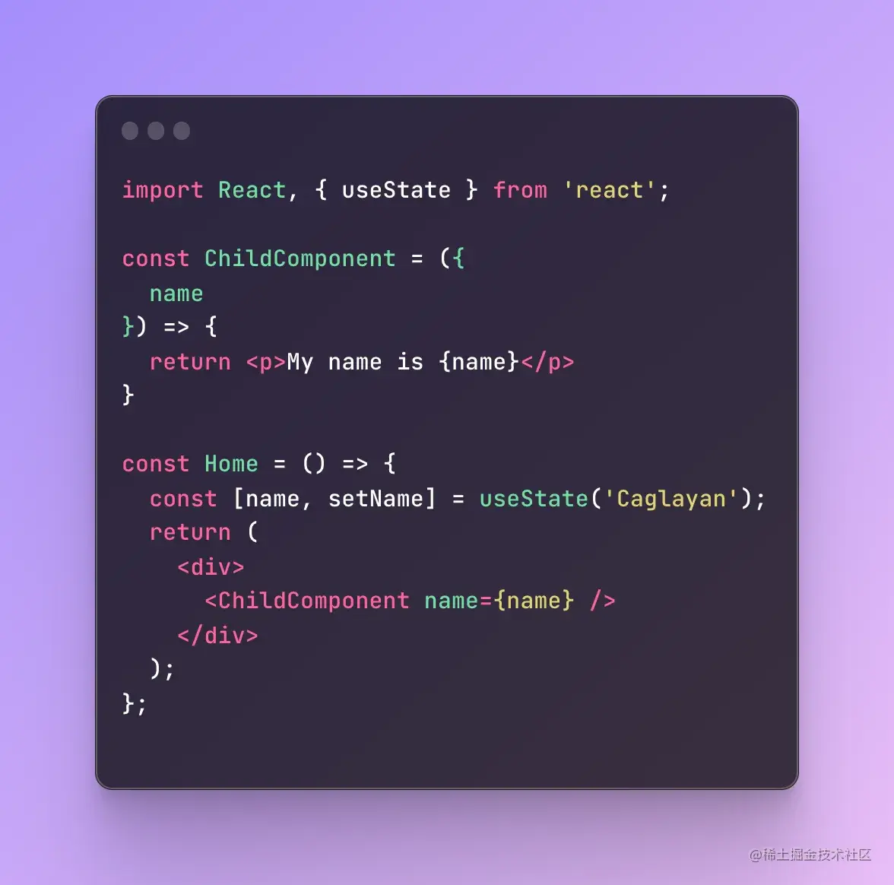
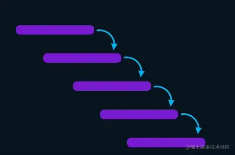
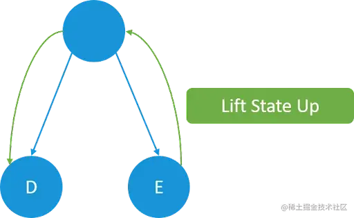
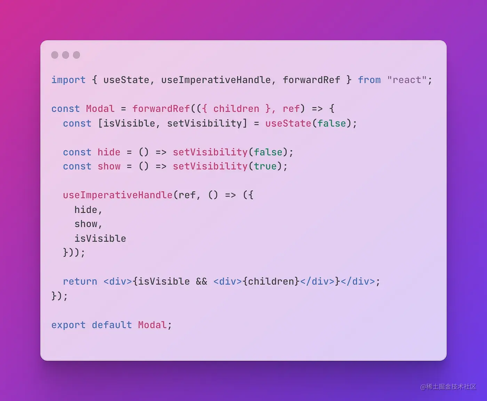
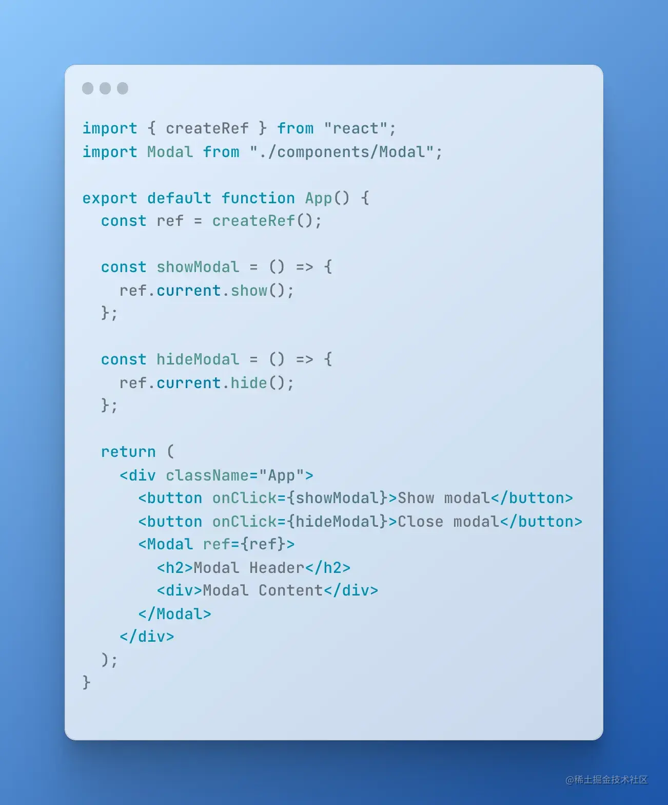

+++
title = "react 状态提升"
date = '2024-12-17T00:00:00+08:00'
lastmod = '2025-03-20T00:00:00+08:00'
draft = true
weight = 15
tags = ["面试", "前端", "React", "react 状态提升", "ecool"]
categories = ["前端开发", "面试"]
source = "https://fe.ecool.fun/knowledge-learn"
+++
在开始介绍状态提升之前，我想先介绍一下 Prop Drilling（属性钻取）的概念。

## 什么是Prop Drilling ？

那么，什么是状态提升呢？我们都知道 React 中的**prop drilling**（属性钻取）。**prop drilling**意味着从父组件向子组件传递一些 props。通过这种方式，我们可以在不同的组件之间共享数据或函数。可以使用 prop 传递任何类型的数据。

在上面的示例代码中，你可以看到，Home 组件具有一个名为 name 的状态，并且她与子组件共用 name 变量。在 React 中，只能将数据从父组件传递到子组件。

## 什么是 State Lifting

一般来说，状态提升允许你将数据从子组件移动到父组件，与Props Drilling不同，你可以在父组件使用子组件的状态值。这是不是很疯狂？

> 在 React 生态中，我们知道数据只能从父组件流向子组件，但现在将学习如何让数据反过来流动。

**但是，为什么要这么做？**

我们可以在父组件中定义状态并将其以 prop 的方式传递给子组件，但是这么做有可能会导致性能损失和代码复杂度提升。在我之前的博客中有提到：保持状态本地化很重要。因为当状态更新时，组件以及该组件的子组件都会重新渲染。

此外对于代码复杂性，对于如 Modal 这样的组件，选择在子组件中声明状态而不是在父组件中声明状态，将能够使代码更易于阅读。使用这种方法，你不必在每个父组件中声明状态。

通常对应用程序中的大多数组件来说，这是不必要的。但是，对于某些类型的组件，特别是可重用组件，会有这种需求。下面描述一下最通用的场景。

**多说无用，上代码：**

例如，我们有一个常见的 Modal 组件，我们想要在 Modal 中保留可见性状态。当一些组件想要使用这个 Modal 时，通常会定义自己的可见状态，但是通过 State Lifting，这个步骤将不再必要。

在 上面的 Modal 组件中，做了如下操作：

1. 首先，使用forwardRef执行 ref 转发，ref 转发是一种自动将 ref 通过组件传递给子组件的技术。
2. 使用 useState 声明状态以控制Modal组件的展示或隐藏。
3. 使用 React 内置的 `useImperativeHandle` hook 将属性或者方法暴露出去，这里我们添加了一些数据和函数供父组件使用。现在父组件可以直接调用子组件的`show`、`hide`、`isVisble`这些方法和属性。

那么现在我们想在父组件中使用 Modal 组件，要如何使用 Modal 中的状态呢？

1. 首先使用`createRef`方法创建一个 ref 对象，并将其传递给 Modal 子组件
2. 使用 `ref.current` 就可以拿到子组件的isVisble属性以及 show 、 hide 方法

使用起来的确很简单。

## 总结

状态提升对某些类型的组件会非常有用，特别是对于可重用组件。但是如果你是在所有组件中使用状态提升，将会提升代码的复杂度。

> 所以，谨慎使用！

## 常见考点

### React状态提升基础

1.  **状态提升的概念**： 
  - 请解释什么是React中的状态提升，以及它为何重要。
  - 在什么情况下，你会考虑使用状态提升？
2.  **状态提升的应用场景**： 
  - 能否给出一个实际项目中需要状态提升的示例？
  - 在这个示例中，为什么状态提升是合适的解决方案？

### React状态提升的实践

1.  **确定状态位置**： 
  - 如何确定应该将状态提升到哪个组件层级？
  - 在提升状态时，有哪些因素需要考虑？
2.  **状态提升的实现**： 
  - 请描述一个实现状态提升的具体步骤。
  - 在提升状态后，如何确保组件之间的状态传递和更新是正确的？
3.  **避免过度提升**： 
  - 什么是过度提升，它会导致什么问题？
  - 如何避免在React应用中过度提升状态？
