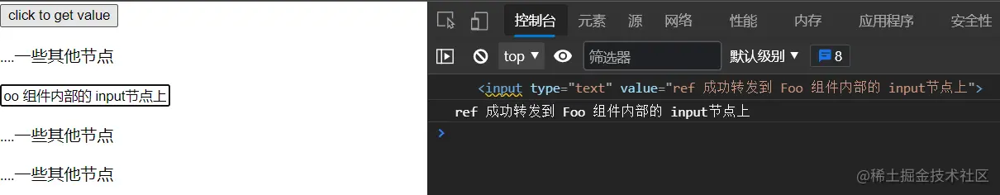
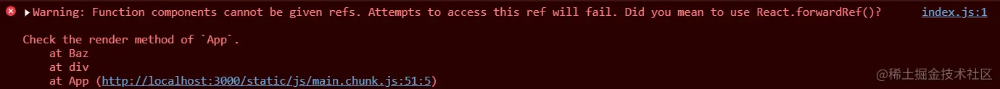
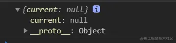
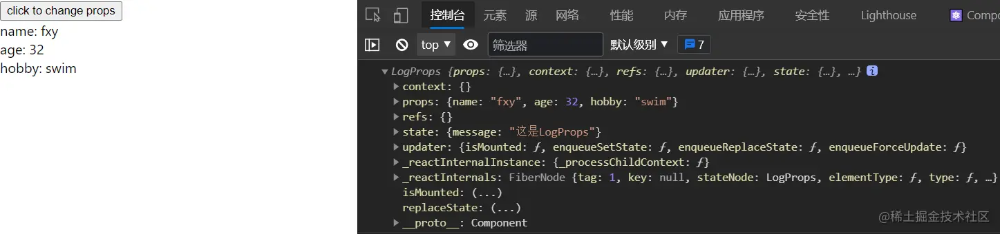
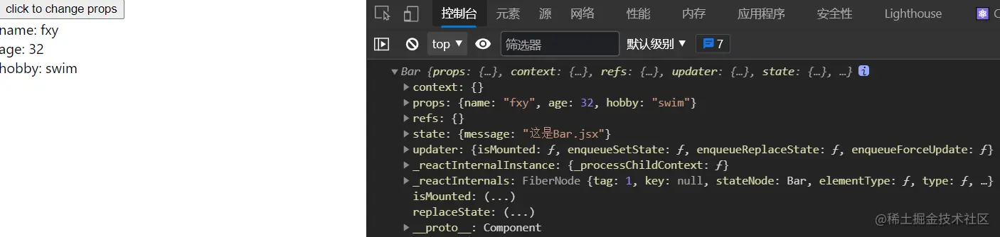

+++
title = "forwardRef 该怎么用？"
date = '2024-12-17T00:00:00+08:00'
lastmod = '2025-03-20T00:00:00+08:00'
draft = true
weight = 16
tags = ["面试", "前端", "React", "forwardRef 该怎么用？", "ecool"]
categories = ["前端开发", "面试"]
source = "https://fe.ecool.fun/knowledge-learn"
+++
## React.forwardRef

对于ref转发，官网是这样描述的

> Ref 转发是一项将 [ref](https://react.docschina.org/docs/refs-and-the-dom.html) 自动地通过组件传递到其一子组件的技巧。对于大多数应用中的组件来说，这通常不是必需的。但其对某些组件，尤其是可重用的组件库是很有用的。

想详细了解的可以去看官方文档 [Refs 转发 – React (docschina.org)](https://react.docschina.org/docs/forwarding-refs.html#forwarding-refs-in-higher-order-components)

现在让我们直奔主题吧！

`React.forwardRef(render)`的返回值是`react`组件，接收的参数是一个 `render`函数，函数签名为`render(props, ref)`，第二个参数将其接受的 [ref](https://react.docschina.org/docs/refs-and-the-dom.html) 属性**转发**到`render`返回的组件中。

这项技术并不常见，但在以下两种场景中特别有用:

- 转发 `ref` 到组件内部的`DOM` 节点上
- 在高阶组件中转发`ref`

## 转发 `ref`到组件内部的`DOM`节点

比如我们想要将一个组件内部的某个元素暴露出去, 就可以这么做

```jsx
// App.js
import React from 'react';
import Foo from './component/Foo';

export default class App extends React.Component {
  constructor(props) {
    super(props);
    this.state = {};
    this.input = React.createRef(); // 1
      // ↑5
  }

  handleClick = (e) => {
    const input = this.input.current;
      // 6
    console.log(input);
    console.log(input.value);
    input.focus();
  }

  render() {
    return (
      <>
        <button onClick={this.handleClick}>click to get value</button>
                  {/*2*/}
        <Foo ref={this.input}/>
      </>
    )
  }
}
```

```jsx
// Foo.jsx
import React from 'react';
                         // 3
const Foo = React.forwardRef((props, myRef) => {
  return (
    <div>
      <p>....一些其他节点</p>								{/*4*/}
      <input type="text" defaultValue='ref 成功转发到 Foo 组件内部的 input节点上' ref={myRef}/>
      <p>....一些其他节点</p>
      <p>....一些其他节点</p>
    </div>
  );
});

export default Foo;
```

仔细看代码中标记的数字，这是`ref`转发的流程:

1. 创建了一个`ref`
2. 将其挂载到 组件上这个组件是通过`React.forwardRef`创建出来的, 注意这里很关键，后面细说
3. 组件`Foo`接收到了一个`ref`，于是将它转发到`DOM`节点`input`上
4. `ref`如愿的挂载到内部节点`input`上
5. 现在`this.input.current`保存着对节点`input`的引用
6. 点击按钮, 现在可以很轻松的获取`Foo`内部节点的`value`以及获取其焦点



## 细节补充

之前说过，步骤2很关键，这是因为 `ref` 的值根据节点的类型而有所不同：

1.  当 `ref` 属性用于 HTML 元素时，接收底层 DOM 元素作为其 `current` 属性。
2.  当 `ref` 属性用于自定义 class 组件时，`ref` 接收组件实例作为其 `current` 属性。
3.  **不能在函数组件上使用 `ref` 属性**，因为他们没有实例。

第一个很好理解，我们上面的例子已经体现了这一点, `ref` 最终被挂载到了 `input` 节点上, `input`是一个`HTML`元素，所以`current`中保留的是`DOM`元素。

对于第二个，我们现在用另一个组件来演示

```jsx
// Bar.jsx
import React from 'react';

export default class Bar extends React.Component {
  constructor(props) {
    super(props);
    this.state = {
      message: '这是class组件, ref 只能挂载到实例上'
    };
  }

  componentDidMount() {
    console.log(this);
  }
  render() {
    return (
      <div>
        class 组件
      </div>
    );
  }
}
```

```jsx
// App.js
import React from 'react';
import Bar from './component/Bar'

export default class App extends React.Component {
  constructor(props) {
    super(props);
    this.state = {};
    this.myRef = React.createRef(); // 创建 ref
  }

  handleClick = (e) => {
    const instance = this.myRef.current;
    // 打印的是 Bar 实例
    console.log(instance);
  }
  render() {
    return (
      <div>
        <button onClick={this.handleClick}>click to get instance</button>
        {/*挂载到组件上，因为Bar是一个class组件，所以只能挂载到其实例上*/}
        <Bar ref={this.myRef} />
      </div>
    );
  }
}
```

第一条打印是 Bar 组件挂载后生命周期函数打印的

第二条打印是点击按钮后打印的，证明确实只是挂载到了组件实例上。后面的高阶组件中还会出现类似的问题。


对于第三个，不能在函数组件上使用 `ref` 属性，因为他们没有实例

```jsx
// Baz.jsx
import React from 'react';

const Baz = (props) => {
  return (
    <div>
      啊？
    </div>
  );
};

export default Baz;
```

```jsx
// App.js 中, 省略掉了其他代码

<Baz ref={this.myRef} />
```

这时就会报错了, 意思是不能在函数式组件上使用 `ref`, 尝试访问 `ref`会失败。



一般函数式组件都是用`React.forwardRef`包装一下然后返回出去的, 函数式组件本来就是一个`render`函数，不过在被`React.forwardRef`包装后就多了一个`ref`属性了。

```jsx
// 将我们的函数式组件改造成这个样子.
const Baz = React.forwardRef((props, ref) => {
  return (
    <div>
      啊？
    </div>
  );
})
```

此时的`ref`还没有被挂载，所以访问`ref.current`会得到`null`，不过总算不会报错了



函数式组件只是将`ref`传递下去，`ref`最终只能被挂载到内部的某个**class组件或者HTML元素**上

还有一点要说明一下，不能在函数组件上使用 `ref` 属性并不是不能在函数式组件内部使用 `ref`

如下所示：

```jsx
// 还是 Baz.jsx
import React from 'react';
const myRef = React.createRef();

const Baz = (props) => {
  function handleClick(e) {
    const input = myRef.current;
    console.log(input.value);
  }
  return (
    <div>
      <button onClick={handleClick}>click to get value</button>
      <input ref={myRef} type="text" defaultValue={'不能在函数组件上使用 ref 属性并不代表着不能在函数式组件内部使用 `ref`'}/>
    </div>
  );
}

export default Baz;
```


## 在高阶组件中转发`ref`

依然使用 之前的 Bar.jsx

```jsx
// Bar.jsx
import React from 'react';

export default class Bar extends React.Component {
  constructor(props) {
    super(props);
    this.state = {
      message: '这是Bar.jsx'
    };
  }

  componentDidMount() {
    console.log(this);
  }
  render() {
    return (
      <div>
        class 组件
      </div>
    );
  }
}
```

我们使用高阶组件，为`Bar`组件增加一个功能：每次`props`改变都打印其变化

```jsx
// logProps.js
function logProps(WrappedComponent) {

  class LogProps extends React.Component {
    componentDidUpdate(prevProps) {
      console.log('Previous props: ', prevProps);
      console.log('Current props: ', this.props);
    }
    render() {
        // 高阶组件透传所有的 props 到其包裹的组件，所以渲染结果将是相同的
      return <WrappedComponent {...this.props} />;
    }
  }
  return LogProps;
}
```

但是高阶组件 **不! 会! 传! 递!** `ref`, 这是因为 `ref` 不是 `prop`属性。就像 `key` 一样，其被 React 进行了特殊处理。

如果你对**被高阶组件包装后的组件**添加 `ref`，该 `ref` 将引用最外层的容器组件，而不是被包裹的组件。

对于上面的例子，如果用了`ref`, 那么最终会挂载到 `<LogProps/>`组件上，而不是传入的被包裹的 `<WrappedComponent/>`组件上。

> 其实这很好理解，自己在脑袋里模拟一下数据流就知道 ref 最后会被挂载到最外面的组件上，不过高阶组件中的这个透传的概念很容易将人带偏，误以为 ref 会跟着 props 一起透传下去， 其实是不会传递的。

为了更好的在控制台观察究竟是挂载到哪个组件上，我们为这两个组件添加 `state`

```jsx
// Bar.jsx 中
this.state = {
  message: '这是Bar.jsx'
}

// logProps.js 中返回的 LogProps组件
this.state = {
  message: '这是LogProps'
}
```

```jsx
// App.js
import React from 'react';
import logProps from './component/logProps';
import Bar from './component/Bar'

const BarWithLogProps = logProps(Bar);
export default class App extends React.Component {
  constructor(props) {
    super(props);
    this.state = {
      name: 'Roman',
      age: 23,
      hobby: 'video game'
    }
    this.myRef = React.createRef();
  }
  handleClick = (e) => {
    this.setState({
      name: 'fxy',
      age: 32,
      hobby: 'swim'
    });
    console.log(this.myRef.current);
  }
  render() {
    return (
      <div>
        <button onClick={this.handleClick} >click to change props</button>
        <BarWithLogProps {...this.state} ref={this.myRef} />
      </div>
    );
  }
}
```

我们点击按钮，在控制台可以清楚的看到， `ref`确实是被挂载到外部组件 `LogProps`上。



`React.forwardRef`再次登场，我们可以使用 `React.forwardRef` API 明确地将 `ref` 转发到内部的 `<WrappedComponent/>` 组件

最后我们将 `logProps.js`改造成这样

```jsx
// 最终形态
import React from 'react';

export default function logProps(WrappedComponent) {

  class LogProps extends React.Component {
    // 2
    constructor(props) {
      super(props);
      this.state = {
        message: '这是LogProps'
      }
    }
    componentDidUpdate(prevProps) {
      console.log('Previous props: ', prevProps);
      console.log('Current props: ', this.props);
    }
    render() {
      // 3
      const {customRef, ...props} = this.props;
      // 3.5 return <WrappedComponent {...this.props}/>;
      return <WrappedComponent {...props} ref={customRef} />;
    }
  }
  // return LogProps;
  return React.forwardRef((props, ref) => (
    // 1
    <LogProps {...props} customRef={ref} />
  ))

}
```

1. 我们将 `LogProps`组件作为`render`函数的返回值，这样渲染结果还是不变，然后将传入的`ref`转发到 `LogProps`组件的自定义属性 `customRef`上。注意这里**一定要转发到自定义属性**，如果转发到 `ref`属性上最终还是会被挂载到 `LogProps`上，等于转了一圈又回到了原地...
2. 所有的属性都被传递到`props`中
3. 将 `props`中的 `customRef`提取出来，最终传递到`WrappedComponent`的`ref`属性上。

最后`ref`被成功转发到被包裹的组件`WrappedComponent`上。

点击按钮，现在来控制台看看

 ref 被成功的挂载到目标组件上。

细心的读者可能已经发现`logProps.js`转发`ref`还有另一种写法, 就是 3.5 那样，不用抽离 `customRef`，仍然将 `customRef` 作为`props` 透传下去, 不过这样就会导致一个问题： `customRef`作为 `props`传递，进入了 `WrappedComponent`组件内部，此时 `customRef`还没有作为`ref`属性挂载到任何 `class组件`或者 `DOM节点`上。

如果这时访问`ref.current`会得到`null`


不过这也更方便的让我们**转发`ref`到组件内部的`DOM`节点**

```jsx
// Bar.jsx
render() {
  return (
    <div ref={this.props.customRef}>
      name: {this.props.name}
      <br/>
      age: {this.props.age}
      <br/>
      hobby: {this.props.hobby}
    </div>
  );
}
```


其实用最开始的写法让`customRef`作为`ref`属性挂载到组件上，在组件内部使用 `React.forwardRef`一样能将`ref`转发到组件内部的`DOM`节点上。

## 常见考点

## **1. `forwardRef` 的基本概念**

-  **考察点**：<br>
  - `forwardRef` 的作用及使用场景。
  - 为什么需要 `forwardRef`，它解决了什么问题？
-  **问题示例**：<br>
  - `forwardRef` 是什么？它的主要作用是什么？
  - 为什么 React 需要 `forwardRef`，在什么场景下会使用它？
  - `forwardRef` 和 `useRef` 有什么区别？
  - `forwardRef` 的第二个参数 `ref` 是如何工作的？

---

## **2. `forwardRef` 的基本用法**

-  **考察点**：<br>
  - 如何正确使用 `forwardRef`，将 `ref` 传递给子组件。
  - `forwardRef` 适用于函数组件，而类组件不需要它。
-  **问题示例**：<br>
  - 如何使用 `forwardRef` 将 `ref` 透传给子组件？
  - `forwardRef` 只能用于函数组件吗？如果要在类组件中使用 `ref`，该怎么办？
  - 请写一个使用 `forwardRef` 传递 `ref` 到 `input` 元素的示例。

---

## **3. `forwardRef` 与 DOM 交互**

-  **考察点**：<br>
  - 如何使用 `forwardRef` 操作原生 DOM？
  - 如何在 `forwardRef` 组件中访问子组件的 `ref`？
-  **问题示例**：<br>
  - 如何使用 `forwardRef` 让父组件能够获取子组件的 DOM 节点？
  - `forwardRef` 是否可以用于自定义的 React 组件，而不仅仅是 HTML 元素？
  - 在 `forwardRef` 组件中，`useImperativeHandle` 有什么作用？

---

## **4. `forwardRef` 与高阶组件（HOC）**

-  **考察点**：<br>
  - `forwardRef` 解决了高阶组件（HOC）不能正确传递 `ref` 的问题。
  - 如何在高阶组件中使用 `forwardRef`？
-  **问题示例**：<br>
  - 为什么 `forwardRef` 适用于高阶组件（HOC）？
  - `forwardRef` 如何解决高阶组件 `ref` 透传的问题？
  - 你如何在 HOC 内部正确使用 `forwardRef`？

---

## **5. `forwardRef` 与 `useImperativeHandle` 结合**

-  **考察点**：<br>
  - `useImperativeHandle` 用于自定义 `ref` 的暴露内容。
  - `forwardRef` 与 `useImperativeHandle` 组合的使用方式。
-  **问题示例**：<br>
  - `useImperativeHandle` 的作用是什么？为什么要与 `forwardRef` 结合使用？
  - 如何使用 `useImperativeHandle` 让 `ref` 只暴露部分方法，而不是整个 DOM？
  - 请写一个 `forwardRef` + `useImperativeHandle` 结合的示例，实现一个 `ref` 只暴露 `focus` 方法的 `input` 组件。

---

## **6. `forwardRef` 的局限性与注意事项**

-  **考察点**：<br>
  - `forwardRef` 不能用于 `props.children` 直接传递 `ref`。
  - `forwardRef` 不能直接用于 React 组件的默认 `ref` 绑定。
-  **问题示例**：<br>
  - `forwardRef` 是否可以用于 `props.children`？为什么不行？
  - `forwardRef` 是否可以用于 Fragment（`<>...</>`）？为什么？
  - `forwardRef` 传递 `ref` 给多个子组件时应该如何处理？

---

## **7. `forwardRef` 与 TypeScript**

-  **考察点**：<br>
  - `forwardRef` 如何在 TypeScript 中正确使用？
  - 如何为 `forwardRef` 组件定义正确的 `ref` 类型？
-  **问题示例**：<br>
  - 在 TypeScript 中，如何为 `forwardRef` 组件定义 `ref` 的类型？
  - `forwardRef` 组件的 `ref` 类型与 `props` 类型如何结合？
  - 如何在 TypeScript 中使用 `forwardRef` 让 `ref` 指向一个 `input` 元素？

---

## **8. `forwardRef` 在实际项目中的应用**

-  **考察点**：<br>
  - 真实业务场景中的 `forwardRef` 使用，如封装 UI 组件库。
  - `forwardRef` 适用于哪些 UI 组件（如 `Button`、`Input`、`Modal`）？
-  **问题示例**：<br>
  - 在设计一个 `Button` 组件时，为什么要使用 `forwardRef`？
  - `forwardRef` 在 `Modal` 组件中可以用于哪些场景？
  - `forwardRef` 在封装 Ant Design 或 Material-UI 组件时的作用是什么？
