+++
title = "react 渲染机制"
date = '2024-12-17T00:00:00+08:00'
lastmod = '2025-07-16T00:00:00+08:00'
draft = true
weight = 19
tags = ["面试", "前端", "React", "react 渲染机制", "ecool"]
categories = ["前端开发", "面试"]
source = "https://fe.ecool.fun/knowledge-learn"
+++
## 前言

文本分为两大部分讲解，一部分是`首次挂载渲染`原理，另一部分是`更新和卸载`原理，很多地方非常抽象，希望大家仔细阅读，不然容易脱节。废话不多话，开车！！

## 正文

在开始之前，需要一些前置知识才能帮助我们更好的理解整个渲染过程。首先就是`生命周期(16版本之后)`，为什么要讲一下生命周期？跟渲染原理有关系吗？当然有，如果你不理解渲染原理的话，更新一个嵌套很深的组件你甚至连`父与子`生命周期执行的先后顺序都不知道。本文直接对照`16`版本之后的`新生命周期`进行讲解，就不讲解老版本了。

## 初探-生命周期

顾名思义，跟人生一样，`生命周期`就是一个组件从`诞生`到`销毁`的过程。`React`在组件的`生命周期`中注册了一系列的`钩子函数`，支持开发者在其中注入代码，并在适当的时机运行。这里指的`生命周期`仅针对于`类组件`中的`钩子函数`。因为`生命周期`不是本文的重点，所以`Hooks`中的新增的`钩子函数`在本文中均不涉及，可以以后出个`Hooks`原理篇。

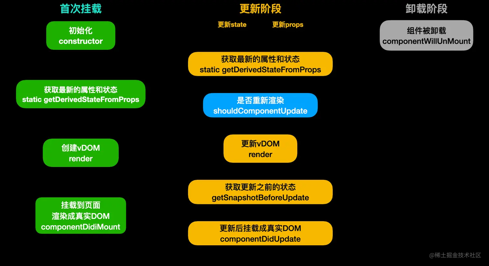

从图中可以看到，我把`生命周期`分为了`挂载阶段`、`更新阶段`、`卸载阶段`三个阶段。同时，在`挂载阶段`和`更新阶段`都会运行`getDerivedStateFromProps`和`render`，卸载阶段很好理解，只有一个`componentWillUnMount`，在卸载组件之前做一些事情，通常用来`清除定时器等副作用操作`。那么`挂载阶段`和`更新阶段`中的生命周期我们来逐一看下每个运行点及作用。

### 1. constructor

在同一个类组件对象只会运行一次。所以经常来做一些`初始化`的操作。同一个组件对象被多次创建，它们的`construcotr`互不干扰。

**注意：在`construcotr`中要尽量避免（最好禁止）使用`setState`。** 我们都知道使用`setState`会造成页面的重新渲染，但是在`初始化`阶段，页面都还没有将`真实DOM`挂载到页面上，那么重新渲染的又有什么意义呢。除`异步`的情况，比如`setInterval`中使用`setState`是没问题的，因为在执行的时候页面早已`渲染完成`。但也最好不要，容易一些引起奇怪的问题。

```js
    constructor(props) {
        super(props);

        this.state = {
            num: 1
        };

        //不可以，直接Warning
        this.setState({
            num: this.state.num + 1
        });

        //可以使用，但不建议
        setInterval(()=>{
            this.setState({
                num: this.state.num + 1
            });
        }, 1000);
    }
```

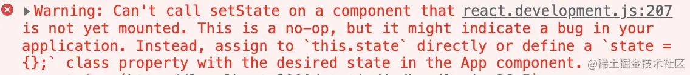

### 2. 静态属性 static getDerivedStateFromProps

该方法是一个`静态属性`，在`16`版本之前不存在，在新版`生命周期`中主要用来取代`componentWillMount`和`componentWillReceiveProps`，因为这两个`老生命周期`方法在一些开发者不规范的使用下极容易产生一些`反模式`的bug。因为是`静态方法`，所以你在其中根本拿不到`this`，更不可能调用`setState`。

该方法在`挂载阶段`和`更新阶段`都会运行。它有两个参数`props`和`state`当前的`属性值`和`状态`。它的返回值会合并掉当前的`状态（state）`。 如果返回了非`Object`的值，那么它啥都不会做，如果返回的是`Object`，那么它将会跟当前的状态合并，可以理解为[Object.assign](https://developer.mozilla.org/zh-CN/docs/Web/JavaScript/Reference/Global_Objects/Object/assign)。通常情况下，几乎不怎么使用该方法。

```js
    /**
     * 静态方法，首次挂载和更新渲染都会运行该方法
     * @param {*} props 当前属性
     * @param {*} state 当前状态
     */
    static getDerivedStateFromProps(props, state){
        // return 1; //没用
        return {
            num: 999,   //合并到当前state对象
        };
    }
```

### 3. `render`

最重要的`生命周期`，没有之一。用来生成`虚拟节点（vDom）`树。该方法只要遇到需要重新渲染都会运行。同样的，在`render`中也严禁使用`setState`，因为会导致无限`递归`重新渲染导致`爆栈`。

```js
    render() {
        //严禁使用！！！
        this.setState({
            num: 1
        })
        return (
            <>{this.state.num}</>
        )
    }
```

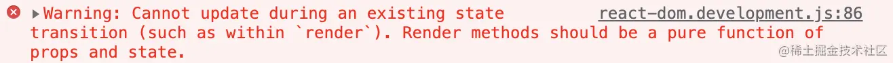

### 4. `componentDidMount`

该方法只会运行一次，在`首次渲染`时页面将`真实DOM`挂载完毕之后运行。通常在这里做一些`异步操作`，比如开启定时器、发起网络请求、获取`真实DOM`等。在该方法中，可以大胆使用`setState`，因为页面已经渲染完成。执行完该`钩子函数`后，组件正式进入到`活跃`状态。

```js
    componentDidMount(){
        // 初始化或异步代码...
        this.setState({});

        setInterval(()=>{});

        document.querySelectorAll("div");
    }
```

### 5. 性能优化 `shouldComponentUpdate`

在原理图`更新阶段`中可以看到，执行完`static getDerivedStateFromProps`后，会执行该`钩子函数`。该方法通常用来做`性能优化`。它的`返回值（boolean）`决定了是否要进行渲染`更新`。该方法有两个参数`nextProps`和`nextState`表示此次更新（下一次）的`属性`和`状态`。通常我们会将当前值与此次要更新的值做比较来决定是否要进行重新渲染。

在`React`中，官方给我们实现好了一个基础版的优化组件`PureComponent`，就是一个`HOC`高阶组件，内部实现就是帮我们用`shouldComponentUpdate`做了浅比较优化。如果安装了`React`代码提示的插件，我们可以直接使用`rpc` + `tab键`来生成模版。**注意：继承了`PureComponent`后不需要再使用`shouldComponentUpdate`进行优化。**

```js
    /**
     * 决定是否要进行重新渲染
     * @param {*} nextProps 此次更新的属性
     * @param {*} nextState 此次更新的状态
     * @returns {boolean}
     */
    shouldComponentUpdate(nextProps, nextState){
        // 伪代码，如果当前的值和下一次的值相等，那么就没有更新渲染的必要了
        if(this.props === nextProps && this.state === nextState){
            return false;
        }
        return true;
    }
```

### 6. getSnapshotBeforeUpdate

如果`shouldComponentUpdate`返回是`true`，那么就会运行`render`重新生成`虚拟DOM树`来进行对比更新，该方法运行在`render`后，表示`真实DOM`已经构建完成，但还没有`渲染`到页面中。可以理解为更新前的`快照`，通常用来做一些附加的DOM操作。

比如我突然想针对具有某个`class`的真实元素做一些事情。那么就可以在此方法中获取元素并修改。该函数有两个参数`prevProps`和`prevState`表示此次更新前的`属性`和`状态`，该函数的`返回值（snapshot）`会作为`componentDidUpdate`的第三个参数。

```js
    /**
     * 获取更新前的快照，通常用来做一些附加的DOM操作
     * @param {*} prevProps 更新前的属性
     * @param {*} prevState 更新前的状态
     */
    getSnapshotBeforeUpdate(prevProps, prevState){
        // 获取真实DOM在渲染到页面前做一些附加操作...
        document.querySelectorAll("div").forEach(it=>it.innerHTML = "123");
        
        return "componentDidUpdate的第三个参数";
    }
```

### 7. componentDidUpdate

该方法是`更新阶段`最后运行的`钩子函数`，跟`getSnapshotBeforeUpdate`不同的是，它的运行时间点是在`真实DOM`挂载到页面后。通常也会使用该方法来操作一些`真实DOM`。它有三个参数分别是`prevProps`、`prevState`、`snapshot`，跟Snapshot`钩子函数`一样，表示更新前的`属性`、`状态`、`Snapshot`钩子函数的返回值。

```js
    /**
     * 通常用来获取真实DOM做一些操作
     * @param {*} prevProps 更新前的属性
     * @param {*} prevState 更新前的状态
     * @param {*} snapshot  getSnapshotBeforeUpdate的返回值
     */
    componentDidUpdate(prevProps, prevState, snapshot){
        document.querySelectorAll("div").forEach(it=>it.innerHTML = snapshot);
    }
```

### 8. `componentWillUnmount`

如开头提到的，该`钩子函数`属于卸载阶段中唯一的方法。如果组件在`渲染`的过程中被卸载了，`React`会报出`Warning：Can't perform a React state update on an unmounted component`的警告，所以通常在组件被卸载时做`清除副作用的操作`。

```js
    componentWillUnmount(){
        // 组件被卸载前清理副作用...
        clearInterval(timer1);
        clearTimeout(timer2);
        this.setState = () => {};
    }
```

到这里，`React生命周期`中每一个`钩子函数`的作用以及运行时间点就已经全部了解了，斯国一！等在下文中提到的时候也有一个大致的印象。大家可以先喝口水休息一下～


## React element（初始元素）

先来认识下第一个概念，就是`React element`，what？当我伞兵？我还不知道什是`element`？别激动，这里的元素不是指`真实DOM`中的元素，而是通过`React.createElement`创建的`类似`真实DOM的元素。比如我们在开发中通过语法糖`jsx`写出来的`html`结构都是`React element`，为了跟`真实DOM`区分开来，本文就统称为`React初始元素`。

为什么要有一个`初始元素`的概念？我们都知道通过`jsx`编写的`html`不可能直接`渲染`到页面上，肯定是经历了一系列的`复杂`的处理最后生成`真实DOM`挂载到页面上。那么到底是怎么样的一个过程？在我们认识一些概念之后才能更深入的理解整个过程。先看看平时写的代码哪些是`初始元素`。

```js
import React, { PureComponent } from 'react'

//创建的是React初始元素
const A = React.createElement("div");
//创建的是React初始元素
const B = <div>123</div>

export default class App extends PureComponent {
    render() {
        return (
            //创建的是React初始元素
            <div>
                {A}
                {B}
            </div>
        )
    }
}
```

## React vDom（虚拟节点）

前面提到`React`在渲染过程中要做很多事情，所以不可能直接通过`初始元素`直接渲染。还需要一个东西就是`虚拟节点`。在本文中不涉及`React Fiber`的概念，将`vDom`树和`Fiber`树统称为`虚拟节点`。有了`初始元素`后，`React`就会根据`初始元素`和`其他可以生成虚拟节点的东西`生成`虚拟节点`。**请记住：`React`一定是通过`虚拟节点`来进行渲染的。** 接下来就是重点，除了`初始元素`能生成`虚拟节点`以外，还有哪些可能生成`虚拟节点`？总共有多少种`节点`类型？

### 1. DOM节点（ReactDomComponent）

> 此DOM非彼DOM，这里的DOM指的是`虚拟DOM节点`。当初始元素的`type`属性为`字符串`的时候`React`就会创建`虚拟DOM节点`。例如我们前面使用`jsx`直接书写的`const B = <div></div>`。它的属性就是`"div"`，可以打印出来看一下。

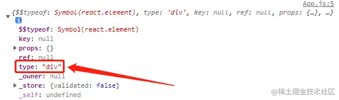

### 2. 组件节点（ReactComposite）

> 当`初始元素`的`type`属性为`函数`或是`类`的时候，`React`就会创建`虚拟组件节点`。

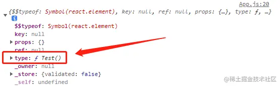

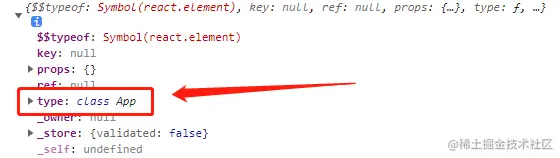

### 3. 文本节点（ReactTextNode）

> 顾名思义，直接书写`字符串`或者`数字`，`React`会创建为`文本节点`。比如我们可以直接用`ReactDOM.render`方法直接渲染`字符串`或`数字`。

```js
import ReactDOM from 'react-dom/client';

const root = ReactDOM.createRoot(document.getElementById('root'));
//root.render('一头猪');   //创建文本节点
root.render(123465);      //创建文本节点
```

### 4. 空节点（ReactEmpty）

> 我们平时写`React`代码的时候经常会写三目表达式`{this.state.xxx ? <App /> : false}`用来进行条件渲染，只知道为`false`就不会渲染，那么到底是怎么一回事？其实遇到字面量`null`、`false`、`true`、`undefined`在`React`中均会被创建为一个`空节点`。在渲染过程中，如果遇到`空节点`，那么它将什么都不会做。

```js
import ReactDOM from 'react-dom/client';

const root = ReactDOM.createRoot(document.getElementById('root'));
//root.render(false);      //创建空节点
//root.render(true);       //创建空节点
//root.render(null);       //创建空节点
root.render(undefined);    //创建空节点
```

### 5. 数组节点（ReactArrayNode）

> 什么？`数组`还能渲染？当然不是直接`渲染`数组本身啦。当`React`遇到`数组`时，会创建`数组节点`。但是不会直接进行`渲染`，而是将数组里的每一项拿出来，根据`不同的节点类型`去做相应的事情。**所以`数组`里的每一项只能是这里提到的`五个节点类型`**。不信？那放个对象试试。

```js
import React from 'react';
import ReactDOM from 'react-dom/client';

const root = ReactDOM.createRoot(document.getElementById('root'));

function FuncComp(){
    return (
        <div>组件节点-Function</div>
    )
}

class ClassComp extends React.Component{
    render(){
        return (
            <div>组件节点-Class</div>
        ) 
    }
}

root.render([
    <div>DOM节点</div>,  //创建虚拟DOM节点
    <ClassComp />,       //创建组件节点
    <FuncComp />,        //创建组件节点
    false,               //创建空节点
    "文本节点",           //创建文本节点
    123456,              //创建文本节点
    [1,2,3],             //创建数组节点
    // {name: 1}         //对象不能生成节点，所以会报错
]);
```

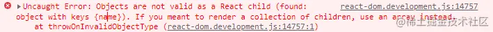

## 真实DOM（UI）

> 通过`document.createElement`创建的元素就是`真实DOM`。了解完`初始元素`、`虚拟节点`以及`真实DOM`这几个重要的概念后，就可以进入到`原理`的学习了。 **再次强调：`React`的工作是通过`初始元素或可以生成虚拟节点的东西`生成`虚拟节点`然后针对不同的`节点类型`去做不同的事情最终生成`真实DOM`挂载到页面上！所以为什么对象不能直接被`渲染`，因为它生成不了`虚拟节点`。**（实际上是`ReactDOM`库进行渲染，为了减少混淆本文中就直接说`React`）


## 首次渲染阶段

如上图所示，`React`首先根据`初始元素`先生成`虚拟节点`，然后做了一系列操作后最终渲染成真实的`UI`。生成`虚拟节点`的过程上面已经讲过了，所以这里说的是根据不同的`虚拟节点`它到底做了些什么处理。

### 1. 初始元素-DOM节点

对于`初始元素`的`type`属性为字符串时，React会通过`document.createElement`创建`真实DOM`。因为`初始元素`的`type`为字符串，所以直接会根据`type`属性创建不同的`真实DOM`。创建完`真实DOM`后会立即设置该`真实DOM`的所有`属性`，比如我们直接在`jsx`中可以直接书写的`className`、`style`等等都会作用到`真实DOM`上。

```js
//jsx语法：React初始元素
const B = <div className="wrapper" style={{ color: "red" }}>
    <p className="text">123</p>
</div>
```

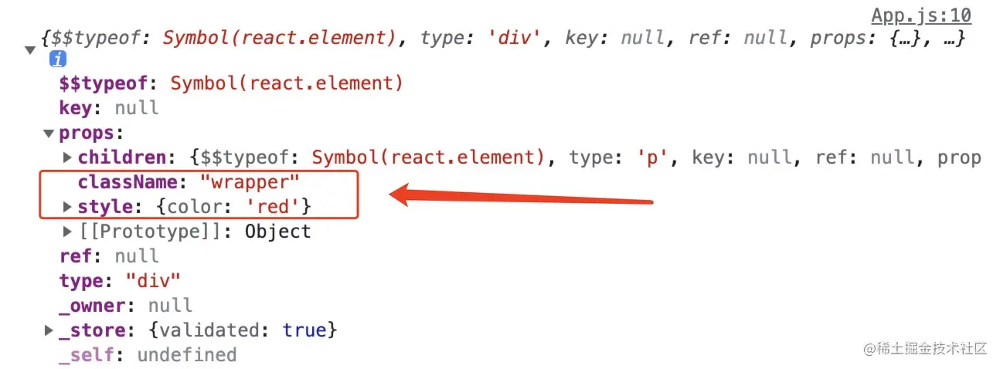

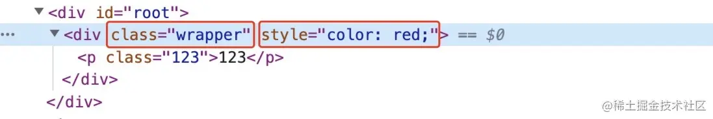

当然我们的`html结构`肯定不止一层，所以在设置完属性后`React`会根据`children`属性进行`递归遍历`。根据不同的`节点类型`去做不同的事情，同样的，如果`children`是`初始元素`，创建`真实DOM`、设置属性、然后检查是否有子元素。重复此步骤，一直到最后一个元素为止。遇到其他`节点类型`会做以下事情。⬇️

### 2. 初始元素-组件节点

前面提到的，如果`初始元素`的`type`属性是一个`class类`或者`function函数`时，那么会创建一个`组件节点`。所以针对`类`或`函数`组件，它的处理是不同的。

- **函数组件**

对于`函数组件`会直接调用函数，将函数的`返回值`进行递归处理（看看是什么`节点类型`，然后去做对应的事情，**所以一定要返回能生成`虚拟节点`的东西**），最终生成一颗`vDOM`树。

- **类组件**

对于`类组件`而言会相对麻烦一些。但前面有了`生命周期`的铺垫，结合图中`挂载阶段`来看这里理解起来就很方便了。

1. 首先创建类的`实例`（调用`constructor`）。
2. 调用`生命周期`方法`static getDerivedStateFromProps`。
3. 调用`生命周期`方法`render`，根据`返回值`递归处理。跟函数组件处理`返回值`一样，最终生成一颗`vDom`树。
4. 将该组件的`生命周期`方法`componentDidMount`加入到`执行队列`中等待真实DOM挂载到页面后执行（**注意：前面说了`render`是一个递归处理，所以如果一个组件存在`父子`关系的时候，那么肯定要等`子组件`渲染完`父组件`才能走出`render`，所以`子组件`的`componentDidMount`一定是比父组件`先入队列`的，肯定先运行！**）。

### 3. 文本节点

针对`文本节点`，会直接通过`document.createTextNode`创建`真实`的文本节点。

### 4. 空节点

如果生成的是`空节点`，那么它将什么`都不会做`！对，就是那么简单，啥都不做。

### 5. 数组节点

就像前面提到的一样，`React`不会直接渲染数组，而是将里面的`每一项`拿出来遍历，根据不同的`节点类型`去做不同的事，直到`递归`处理完数组里的每一项。（这里留个问题，为什么在`数组`里我们要写`key`？）

### 一图胜千言

当处理完了所有的`节点`后，我们的`vDom`树和`真实DOM`也创建好了，`React`会将`vDom`树保存起来，方便后续使用。然后将创建好的`真实DOM`都挂载到页面上。至此，`首次渲染`的阶段就全部结束了。有点懵？没事，正常，我们举个例子。

```js
import React from 'react';
import ReactDOM from 'react-dom/client';
const root = ReactDOM.createRoot(document.getElementById('root'));

/**
 * 组件节点-类组件
 */
class ClassSon extends React.Component {

    constructor(props){
        super(props);
        console.log("444 ClassSon constructor");
    }

    static getDerivedStateFromProps(props, state){
        console.log("555 ClassSon getDerivedStateFromProps");
        return {};
    }

    componentDidMount(){
        console.log("666 ClassSon componentDidMount");
    }

    render() {
        return (
            <div className="func-wrapper">
                <span>
                    textNode22
                    {undefined}
                </span>
                {[false, "textNode33", <div>textNode44</div>]}
            </div>
        )
    }
}

/**
 * 组件节点-类组件
 */
class ClassComp extends React.Component {

    constructor(props){
        super(props);
        console.log("111 ClassComp constructor");
    }

    static getDerivedStateFromProps(props, state){
        console.log("222 ClassComp getDerivedStateFromProps");
        return {};
    }

    componentDidMount(){
        console.log("333 ClassComp componentDidMount");
    }
    
    render() {
        return (
            <div className="class-wrapper">
                <ClassSon />
                <p>textNode11</p>
                {123456789}
            </div>
        )
    }
}

root.render(<ClassComp />);
```

从代码结构来看，渲染的是`ClassComp`类组件，类组件内包含了一个`函数组件`以及一些其他可以生成`虚拟节点`的东西，同样的，`函数组件`内也是一些可以生成`虚拟节点`的结构。因为用图表示比较复杂，时间可能会有点久（gif很大已压缩...，显示有点小的话麻烦`右键新标签打开`看好了）

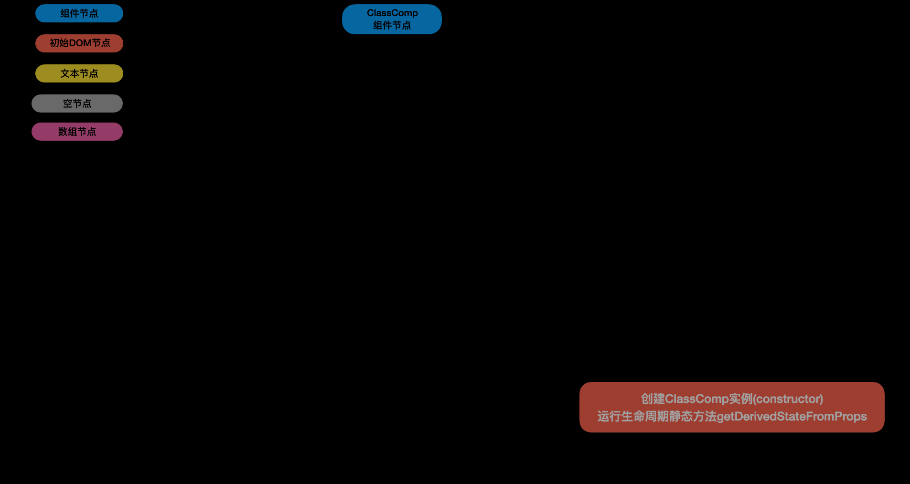

从图中可以看到，在`ClassComp`首次挂载运行`render`的过程中，发现了`ClassSon`组件，然后又开始了一个新的`类组件`节点的渲染过程。要等到`ClassSon`和其他兄弟节点渲染完后`ClassComp`的`render`才算完成。所以`ClassSon`的`componentDidMount`一定是先进队列的。所以控制台执行顺序一定是`111`、`222`、`444`、`555`、`666`、`333`。到这里，`首次挂载`的所有过程就结束了。再喝口水休息一下～


## 更新和卸载

挂载完成后组件进入`活跃`状态，等待数据的更新进行重新渲染。那么到底有几种场景会触发更新？整个过程又是怎么样的，有哪些需要注意的地方？

### 更新的场景

- **组件更新（`setState`）**

最常见的，我们经常用`setState`来重新设置组件的`状态`进行重新渲染（本文不涉及`Hooks`概念，不讲`useState`）。使用`setState`只会更新调用此方法的类。不会涉及到兄弟节点以及父级节点。影响范围仅仅是自己的`子节点`。结合文章最前面的`生命周期`图看，步骤如下：

1. 运行当前类组件的`生命周期`静态方法`static getDerivedStateFromProps`。根据返回值合并当前组件的状态。
2. 运行当前类组件的`生命周期`方法`shouldComponentUpdate`。如果该方法返回的`false`。直接终止更新流程！
3. 运行当前类组件的`生命周期`方法`render`，得到一个新的`vDom`树，进入新旧两棵树的`对比更新`。
4. 将当前类组件的`生命周期`方法`getSnapshotBeforeUpdate`加入执行队列，等待将来执行。
5. 将当前类组件的`生命周期`方法`componentDidUpdate`加入执行队列，等待将来执行。
6. 重新生成`vDom`树。
7. 根据`vDom`树更新`真实DOM`.
8. 执行队列，此队列存放的是更新过程中所有新建类组件的`生命周期`方法`componentDidMount`。
9. 执行队列，此队列存放的是更新过程涉及到原本存在的类组件的`生命周期`方法`getSnapshotBeforeUpdate`。
10. 执行队列，此队列存放的是更新过程涉及到原本存在的类组件的`生命周期`方法`componentDidUpdate`。
11. 执行队列，此队列存放的是更新过程中所有卸载的类组件的`生命周期`方法`componentWillUnMount`。

- **根节点更新（`ReactDOM.createRoot().render`）**

在`ReactDOM`的新版本中，已经不是直接使用`ReactDOM.render`进行更新了，而是通过`createRoot(要控制的DOM区域)`的返回值来调用`render`，无论我们在嵌套多少的组件里去调用`控制区域.render`，都会直接触发`根节点`的`对比更新`。一般不会这么操作。如果触发了根节点的更新，那么后续步骤是上面`组件更新`的`6-11`步。

### 对比更新过程（diff）

知道了两个更新的场景以及会运行哪些`生命周期`方法后，我们来看一下具体的过程到底是怎么样的。所谓`对比更新`就是将`新vDom`树跟之前首次渲染过程中保存的`老vDom`树对比发现差异然后去做一系列操作的过程。那么问题来了，如果我们在一个`类组件`中重新渲染了，`React`怎么知道在产生的新树中它的层级呢？难道是给`vDom`树全部挂上一个不同的标识来遍历寻找更新的哪个组件吗？当然不是，我们都知道`React`的`diff`算法将之前的复杂度`O(n^3)`降为了`O(n)`。它做了以下几个假设：

1. 假设此次更新的节点层级不会发生移动（直接找到旧树中的位置进行对比）。
2. 兄弟节点之间通过`key`进行唯一标识。
3. 如果新旧的`节点类型`不相同，那么它认为就是一个新的结构，比如之前是`初始元素div`现在变成了`初始元素span`那么它会认为整个结构全部变了，无论嵌套了多深也会全部`丢弃`重新创建。

### key的作用

如果前面copy了文中的代码例子就会发现在使用`数组节点`的时候，如果里面有`初始元素`，并且没有给`初始元素`添加`key`那么它会警告`Warning: Each child in a list should have a unique "key" prop.`。那么`key`值到底是干嘛用的呢？其实`key`的作用非常简单，仅仅是为了通过`旧节点`，寻找对应的`新节点`进行对比提高`节点`的复用率。我们来举个例子，假如现在有五个`兄弟节点`更新后变成了四个`节点`。

**未添加key**

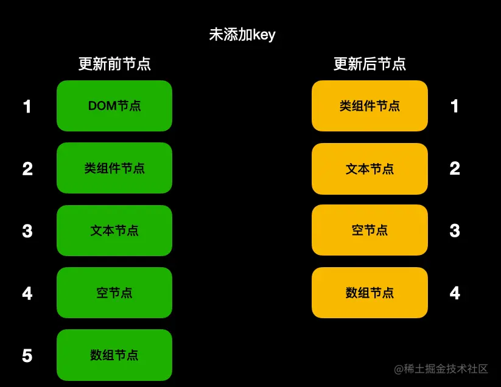

**添加了key**

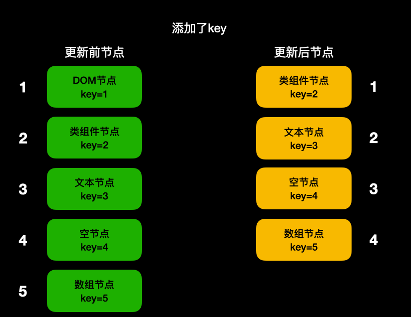

看完两张图会发现如果有`key`的话在`其他节点`未变动的情况下复用了之前的所有`节点`。所以请尽量保持同一层级内`key`的`唯一性`和`稳定性`。这就是为什么不要用`Math.random`作为`key`的原因，跟没写一样。

### 找到对比目标-节点类型一致

经过假设和一系列的操作找到了需要对比的目标，如果发现`节点类型`一致，那么它会根据不同的节点类型做不同的事情。

**1. 初始元素-DOM节点**

如果是`DOM节点`，`React`会直接重用之前的`真实DOM`。将这次变化的`属性`记录下来，等待将来完成更新。然后遍历其`子节点`进行递归`对比更新`。

```js
import React, { PureComponent } from 'react'

export default class App extends PureComponent {
    state = {
        flag: true
    }
    
    render() {
        console.log("render了");
        return (
            <div className={this.state.flag ? "wrapper" : "flagFlase"}>
                <button onClick={()=>{
                    this.setState({
                        flag: !this.state.flag
                    });
                    console.log("属性名变了吗现在？", document.querySelector(".wrapper").className);
                }}>更新</button>
            </div>
        )
    }
}
```

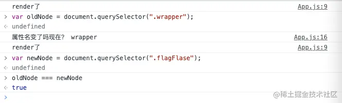

**2. 初始元素-组件节点**

- **函数组件**

如果是`函数组件`，`React`仅仅是重新调用`函数`拿到新的`vDom`树，然后递归进行`对比更新`。

- **类组件**

针对`类组件`，`React`也会重用之前的`实例对象`。后续步骤如下：

1. 运行`生命周期`静态方法`static getDerivedStateFromProps`。将返回值合并当前状态。
2. 运行`生命周期`方法`shouldComponentUpdate`，如果该方法返回`false`，终止当前流程。
3. 运行`生命周期`方法`render`，得到新的`vDom`树，进行新旧两棵树的递归`对比更新`。
4. 将`生命周期`方法`getSnapshotBeforeUpdate`加入到队列等待执行。
5. 将`生命周期`方法`componentDidUpdate`加入到队列等待执行。

```js
import React, {Component} from 'react'

export default class App extends Component {

    static getDerivedStateFromProps(props, state){
        console.log("111 getDerivedStateFromProps");
        return {};
    }

    shouldComponentUpdate(){
        console.log("222 shouldComponentUpdate");
        return true;
    }

    getSnapshotBeforeUpdate(){
        console.log("444 getSnapshotBeforeUpdate");
        return null;
    }

    componentDidUpdate(){
        console.log("555 getSnapshotBeforeUpdate")
    }

    render() {
        console.log("333 render");
        return (
            <div className={"wrapper"}>
                <button onClick={()=>{
                    this.setState({});
                }}>更新</button>
            </div>
        )
    }
}
```

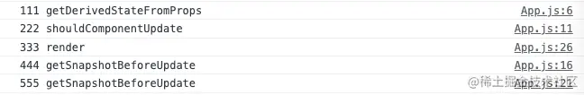

**3. 文本节点**

对于文本节点，同样的`React`也会重用之前的`真实文本节点`。将新的文本记录下来，等待将来统一更新（设置`nodeValue`）。

```js
import React, { PureComponent } from 'react'

export default class App extends PureComponent {

    state = {
        text: "文本节点"
    }

    render() {
        return (
            <div className="wrapper">
                {this.state.text}
                <button onClick={()=>{
                    this.setState({
                        text: "新文本节点"
                    })
                }}>更新</button>
            </div>
        )
    }
}
```

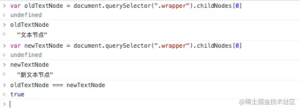

**4. 空节点**

如果节点的类型都是`空节点`，那么`React`啥都不会做。

**5. 数组节点**

首次挂载提到的，`数组节点`不会直接渲染。在更新阶段也一样，遍历每一项，进行`对比更新`，然后去做不同的事。

### 找到对比目标-节点类型不一致

如果找到了对比目标，但是发现`节点类型`不一致了，就如前面所说，`React`会认为你连类型都变了，那么你的`子节点`肯定也都不一样了，就算`一万个`子节点，并且他们都是没有变化的，只有最外层的`父节点`的`节点类型`变了，照样会全部进行`卸载`重新创建，与其去一个个递归查看`子节点`，不如直接全部`卸载`重新新建。

```js
import React, { PureComponent } from 'react'

export default class App extends PureComponent {

    state = {
        flag: true,
    }

    render() {
        console.log("重新渲染render");
        
        if (this.state.flag) {
            return <span className="wrapper">
                <button onClick={() => {
                    this.setState({
                        flag: !this.state.flag
                    })
                }}>更新</button>
            </span>
        }

        return (
            <div className="wrapper">
                <button onClick={() => {
                    this.setState({
                        flag: !this.state.flag
                    })
                }}>更新</button>
            </div>
        )
    }
}
```

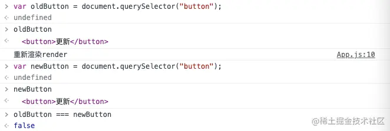

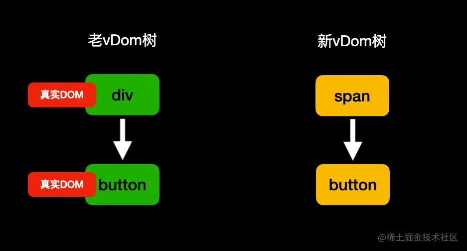

### 未找到对比目标

如果未找到对比的目标，跟`节点类型`不一致的做法类似，那么对于多出的节点进行`挂载流程`，对于旧节点进行卸载直接弃用。如果其包含子节点进行`递归卸载`。对于`初始类组件节点`会多一个步骤，那就是运行`生命周期`方法`componentWillUnmount`。**注意：尽量保持结构的稳定性，如果未添加`key`的情况下，兄弟节点更新位置前后错位一个那么后续全部的比较都会`错位`导致找不到对比目标从而进行`卸载`新建流程，对性能大打折扣。**

```js
import React, { PureComponent } from 'react'

export default class App extends PureComponent {

    state = {
        flag: true,
    }

    render() {
        console.log("重新渲染render");
        if (this.state.flag) {
            return <div className="wrapper">
                <span>123</span>
                <button onClick={() => {
                    this.setState({
                        flag: !this.state.flag
                    })
                }}>更新</button>
            </div>
        }

        return (
            <div className="wrapper">
                <button onClick={() => {
                    this.setState({
                        flag: !this.state.flag
                    })
                }}>更新</button>
            </div>
        )
    }
}
```

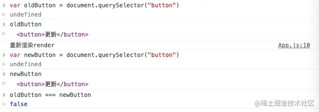

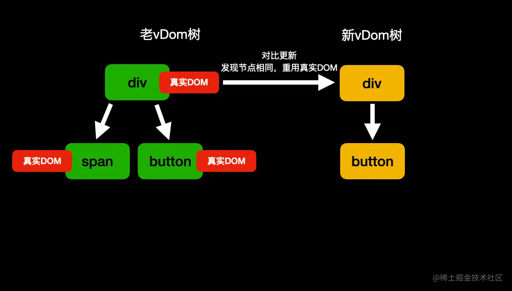

从图中可以看到，哪怕经过条件渲染前后`button`理论上没有任何变化的情况下，照样没有重用之前的`真实DOM`，如果在`button`之后还有`一万个`兄弟节点，那么也全部都找不到对比目标从而进行`卸载`重新创建流程。所以在进行`条件渲染`显示隐藏时，官方推荐以下做法：

1. 控制`style：visibility`来控制显示隐藏。
2. 在隐藏时给一个`空节点`来保证对比前后能找到同一位置。不影响后续`兄弟节点`的比较。

```js
this.state.flag ? <div></div> : false
```

## 来点栗子加深印象

**1. 是否重用了真实DOM**

```js
import React, { PureComponent } from 'react'

export default class App extends PureComponent {

    state = {
        flag: true,
    }

    render() {
        console.log("重新render！");

        if(this.state.flag){
            return <div className="flag-true">
                <button onClick={()=>{
                    this.setState({
                        flag: !this.state.flag
                    })
                }}>更新</button>
            </div>

        }
        return (
            <div className="flag-false">
                 <button onClick={()=>{
                    this.setState({
                        flag: !this.state.flag
                    })
                }}>更新</button>
            </div>
        )
    }
}
```

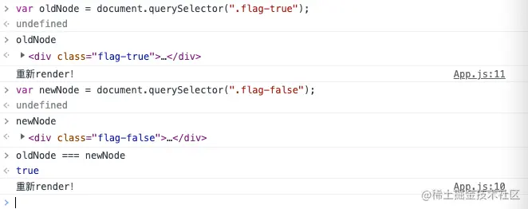

尽管从代码结构看起来像是返回了两个不同的`DOM`，但其实在更新的过程中，`React`发现他们的`节点类型`一致，所以会重用之前的`真实DOM`。**所以请注意：尽量保持`节点的类型`一致，如果更新前后`节点类型`不一致的话无论有多少子组件将全部`卸载`重新创建。**

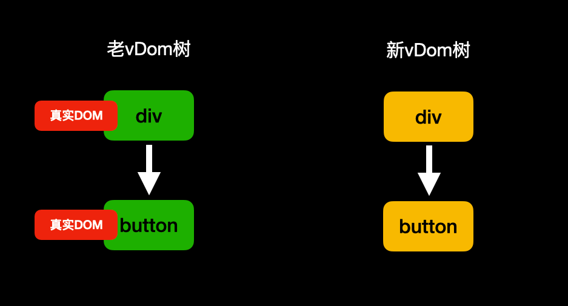

**2. 一个神奇的效果**

```js
import React, { PureComponent } from 'react'

export default class App extends PureComponent {
    state = { flag: false }

    render() {
        return (
            <>
                {
                    this.state.flag ?
                        <div>
                            <input type="password" />
                            <button onClick={() => {
                                this.setState({
                                    flag: !this.state.flag
                                })
                            }}>显示/隐藏</button>
                        </div>
                        :
                        <div>
                            <input type="password" />
                            <input type="text" />
                            <button onClick={() => {
                                this.setState({
                                    flag: !this.state.flag
                                })
                            }}>显示/隐藏</button>

                        </div>
                }
            </>
        )
    }
}
```


从图中可以看到，我们输入了密码后，`重新渲染`生成了新的DOM，但是里面的密码还存在。这就很好的证明了`React`是如何重用`真实DOM`的。

**一道面试题**

```js
import React, { PureComponent } from 'react'

class ClassCompA extends PureComponent {
    componentDidMount() {
        console.log("111 ClassCompA componentDidMount");
    }

    componentWillUnmount() {
        console.log("222 ClassCompA componentWillUnmount");
    }

    render() {
        return (<div className="ClassCompA"></div>)
    }
}

class ClassCompB extends PureComponent {
    componentDidMount() {
        console.log("333 ClassCompB componentDidMount");
    }

    render() {
        return (<div className="ClassCompB">
            <ClassCompC />
        </div>)
    }
}

class ClassCompC extends PureComponent {
    componentDidMount() {
        console.log("444 ClassCompC componentDidMount");
    }

    render() {
        return (<div className="ClassCompC"></div>)
    }
}

export default class App extends PureComponent {
    state = {
        flag: true,
    }

    componentDidMount(){
        console.log("666 App componentDidMount");
    }

    componentDidUpdate() {
        console.log("555 App componentDidUpdate");
    }

    render() {
        return (
            <div className="wrapper">
                {this.state.flag ? <ClassCompA/> : <ClassCompB/>}
                <button onClick={() => {
                    this.setState({
                        flag: !this.state.flag
                    })
                }}>更新</button>
            </div>
        )
    }
}
```

**问：首次渲染和按下button控制台输出的顺序是什么？**

看的仔细的同学，相信根本就难不倒你，我们一起来捋一捋。

1. 首先，最外层的组件是`App`，所以开始`App`的挂载流程，运行`render`的过程中发现`条件渲染`先渲染`ClassCompA`。
2. 进入`ClassCompA`的挂载流程，没啥好渲染的就一个div，执行完`render`后将`componentDidMount`加入到队列中等待执行。此时队列里是`[111]`。
3. `App`再针对初始元素`button`做处理后，`render`执行结束，将自己的`componentDidMount`加入到队列中等待执行，此时队列里是`[111、666]`。
4. `React`根据`虚拟节点`生成`真实DOM`后，保存`vDom`树，开始运行队列。此时控制台打印`111`、`666`。
5. 按下`button`后，调用`setState`进行重新渲染，此时`App`还会运行两个生命周期方法 `getDerivedStateFromProps`和`shouldComponentUpdate`，然后运行`render`，生成新的`vDom`树。
6. 进入新旧两棵树的`对比更新`，虽然都是`组件节点`，但生成出的实例不同，认为是不相同的`节点类型`。开始卸载旧节点`ClassCompA`，并将`ComponentWillUnMount`加入到执行队列，等待执行。此时队列`[222]`。
7. 进入新节点挂载流程，创建`ClassCompB`实例，调用`render`生成`虚拟节点`。发现存在`组件节点ClassCompC`。再次进入到新节点挂载流程，创建实例。
8. `ClassComC`运行完`render`生成`vDom`树，将自己的`componentDidMount`加入到队列，等待将来执行。此时队列`[222、444]`。
9. 挂载完`ClassComC`后，`ClassComB`的`render`才算结束，此时将自己的`componentDidMount`加入到队列，等待执行，此时队列`[222、444、333]`。
10. 此时`App`的`render`才算结束，将自己的`componentDidUpdate`加入到队列，等待执行。此时队列`[222、444、333、555]`。
11. 将根据`虚拟节点`生成的`真实DOM`挂载到页面上后，开始执行队列。控制台输出`222`、`444`、`333`、`555`。

## 总结

对于`生命周期`我们只需关注比较重要的几个生命周期的运行点即可，比如`render`的作用、使用`componentDidMount`在挂载完`真实DOM`后做一些副作用操作、以及性能优化点`shouldComponentUpdate`、还有卸载时利用`componentWillUnmount`清除副作用。

对于`首次挂载`阶段，我们需要了解`React`的渲染流程是：通过我们书写的`初始元素`和一些其他`可以生成虚拟节点的东西`来生成`虚拟节点`。然后针对不同的节点类型去做不同的事情，最终将`真实DOM`挂载到页面上。然后执行渲染期间加入到队列的一些`生命周期`。然后组件进入到活跃状态。

对于`更新卸载`阶段，需要注意的是有几个`更新的场景`。以及`key`的作用到底是什么。有或没有会产生多大的影响。还有一些小细节，比如`条件渲染`时，不要去破坏结构。尽量使用`空节点`来保持前后结构顺序的统一。重点是新旧两棵树的`对比更新流程`。找到目标，节点类型一致时针对不同的`节点类型`会做哪些事，类型不一致时会去`卸载`整个旧节点。无论有多少子节点，都会全部`递归`进行卸载。

到这里，文章所有的部分就全部结束了，本文没有涉及到一行源码，全部都是总结出能在不看源码的情况下能大致了解整个`渲染流程`。为了减少混淆，也没有涉及到`Hooks`以及`Fiber`的概念，有兴趣的同学可以留言，可以考虑下次出一篇。最后，再喝一口水休息一下。对本文内容有异议或交流欢迎评论～


我正在参与掘金技术社区创作者签约计划招募活动，[点击链接报名投稿](https://juejin.cn/post/7112770927082864653)。

## 常见考点

## 一、渲染机制的基本流程

从调用组件到页面展示，React 渲染经历以下阶段：

1.  **初始渲染阶段**  
  - JSX 被编译成 React 元素（虚拟 DOM）
  - 构建 Fiber 树，执行组件函数或类的 `render` 方法
  - 生成更新对象（Update）
  - 将变更应用到真实 DOM
2.  **更新阶段（Reconciliation 协调）**  
  - 触发更新（如 `setState`）
  - 比较前后两棵 Fiber 树（Diff 算法）
  - 标记需要变更的节点
  - 生成更新队列（Update Queue）
  - 提交（Commit）到真实 DOM

## 二、具体考察点

### 1. **React 的虚拟 DOM（VDOM）**

- React 为什么使用虚拟 DOM？
- 虚拟 DOM 和真实 DOM 有什么区别？
- 什么时候更新虚拟 DOM？性能如何？

### 2. **Fiber 架构**

- Fiber 是什么？和旧的 Stack Reconciler 有何区别？
- Fiber 架构如何实现可中断渲染？
- 每个 Fiber 节点包含哪些信息？
- 什么是 “work in progress” Fiber 树？

### 3. **协调（Reconciliation）过程**

-  React 是如何比较新旧节点的？ 
-  diff 算法的优化原则是什么？  
  - 同层比较
  - Key 的作用
-  什么情况下组件会被重用或销毁？ 

### 4. **调度机制**

-  React 18 引入了什么调度特性？  
  - 并发模式（Concurrent Mode）
  - 时间分片（Time Slicing）
  - `startTransition`、`useDeferredValue`
-  React 如何确定任务的优先级？ 
-  任务调度与浏览器帧调度的关系？ 

### 5. **commit 阶段**

- commit 阶段是否可中断？为什么？
- 生命周期函数在 commit 阶段的触发顺序？
- 为什么更新是分为 “render 阶段” 和 “commit 阶段”？

### 6. **渲染优化**

-  如何避免不必要的组件更新？  
  - `React.memo`
  - `shouldComponentUpdate`
  - `useMemo` / `useCallback`
-  如何使用 Key 减少 diff 损耗？ 
-  React.lazy 和 Suspense 如何实现异步加载？ 

## 三、与 Hooks 相关的渲染机制

### 1. useState / useReducer

- 状态更新是同步还是异步？
- 多次 setState 会合并吗？
- 更新是批量处理的吗？

### 2. useEffect / useLayoutEffect

- 两者在渲染机制中的执行时机是什么？
- 为什么说 useEffect 是异步执行的？

### 3. 渲染行为相关 Hooks

- `useInsertionEffect`、`useTransition`、`useDeferredValue` 的作用和时机？

## 四、React 的重新渲染触发机制

-  哪些行为会触发重新渲染？  
  - props 改变
  - state 改变
  - context 改变
-  父组件重新渲染是否一定导致子组件更新？ 
-  如何避免子组件因为 props 变化重新渲染？ 

## 五、调试与性能分析工具

- 如何使用 React DevTools 分析组件渲染？
- 如何使用 Profiler 定位性能瓶颈？
- 如何查看组件是否因为 props 或 state 改变而重新渲染？
