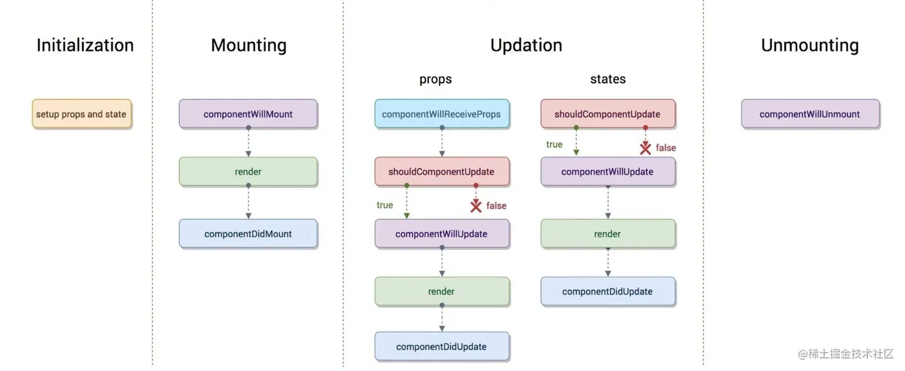
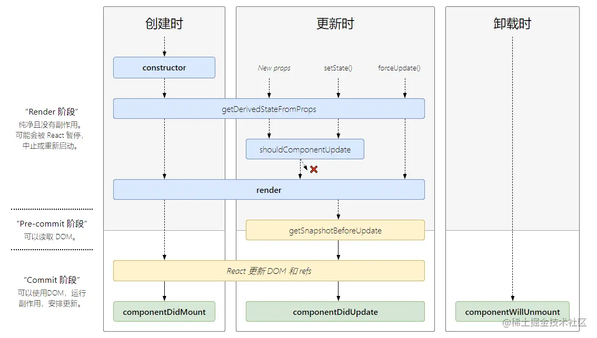

+++
title = "React 生命周期"
date = '2024-12-17T00:00:00+08:00'
lastmod = '2025-02-08T00:00:00+08:00'
draft = true
weight = 4
tags = ["面试", "前端", "React", "React 生命周期", "ecool"]
categories = ["前端开发", "面试"]
source = "https://fe.ecool.fun/knowledge-learn"
+++
## 简介

React从v16.3的版本开始， 对生命周期的钩子进行了渐进式的调整，分别废弃和新增了一些生命周期的钩子函数，本文会从以下四点开始讲解：

1. 新旧生命周期函数的对比
2. 分析为什么要废弃旧的钩子函数
3. 详解新的生命周期使用场景
4. 实例代码演示并进行总结

## 新旧生命周期对比

一个完整的React组件生命周期会依次调用如下钩子：

### old lifecycle



挂载

- constructor
- componentWillMount
- render
- componentDidMount

更新

- componentWillReceiveProps
- shouldComponentUpdate
- componentWillUpdate
- render
- componentDidUpdate

卸载

- componentWillUnmount

### new lifecycle



- 挂载  
  - constructor
  - getDerivedStateFromProps
  - render
  - componentDidMount
- 更新  
  - getDerivedStateFromProps
  - shouldComponentUpdate
  - render
  - getSnapshotBeforeUpdate
  - componentDidUpdate
- 卸载  
  - componentWillUnmount

从以上生命周期的对比，我们不难看出，React从v16.3开始废弃 `componentWillMount` `componentWillReceiveProps` `componentWillUpdate` 三个钩子函数

## 分析废弃原因

Facebook花了两年多的时间搞出了React Fiber, 因为在v15的版本，更新过程是同步的，往往一个主线程长时间被占用，会导致页面性能问题

而 **React Fiber的机制:** 利用浏览器 `requestIdleCallback` 将可中断的任务进行分片处理，每一个小片的运行时间很短，这样唯一的线程就不会被独占

需要详细了解可以点下面链接 [Morgan大佬 - 知乎](https://zhuanlan.zhihu.com/p/26027085)

> 那么React Fiber会对生命周期带来什么影响吗？

因为React Fiber `Reconciliation` 这个过程有可能暂停然后继续执行，所以挂载和更新之前的生命周期钩子就有可能不执行或者多次执行；

目前React为这几个生命周期钩子提供了别名，分别是：

- UNSAFE_componentWillMount
- UNSAFE_componentWillReceiveProps
- UNSAFE_componentWillUpdate

React17将只提供别名，取个别名的目的就是恶心你，不让你使用。

## 详解新的生命周期

### 各个阶段生命周期函数

#### constructor()

`constructor()` 在React组件挂载之前被调用，在为React.Component子类实现构造函数时，应在其他语句之前调用 `super()`

> super的作用：将父类的this对象继承给子类 ([MDN参考](https://developer.mozilla.org/zh-CN/docs/Web/JavaScript/Reference/Operators/super#%E6%8F%8F%E8%BF%B0))

通常，React构造函数仅用于以下两种情况：

- 来初始化函数内部 state
- 为 [事件处理函数](https://zh-hans.reactjs.org/docs/handling-events.html) 绑定实例

> 如果不初始化 `state` 或不进行方法绑定，则不需要写 `constructor()` , 只需要设置 `this.state` 即可

> 不能在 `constructor()`构造函数内部调用 `this.setState()`, 因为此时第一次 `render()`还未执行，也就意味DOM节点还未挂载

#### static getDerivedStateFromProps(nextProps, state)

`getDerivedStateFromProps()` 在调用 `render`方法之前调用，在初始化和后续更新都会被调用

> 返回值：返回一个对象来更新 `state`, 如果返回 `null` 则不更新任何内容

> 参数： 第一个参数为即将更新的 `props`, 第二个参数为上一个状态的 `state` , 可以比较`props` 和 `state`来加一些限制条件，防止无用的state更新

> 注意：`getDerivedStateFromProps` 是一个静态函数，不能使用this, 也就是只能作一些无副作用的操作

#### render()

`render()` 方法是class组件中唯一必须实现的方法，用于渲染dom, `render()`方法必须返回reactDOM

> 注意： 不要在 `render` 里面 `setState`, 否则会触发死循环导致内存崩溃

#### componentDidMount()

`componentDidMount()` 在组件挂载后 (插入DOM树后) 立即调用，`componentDidMount()` 是发送网络请求、启用事件监听方法的好时机，并且可以在 此钩子函数里直接调用 `setState()`

#### shouldComponentUpdate(nextProps, nextState)

`shouldComponentUpdate()` 在组件更新之前调用，可以控制组件是否进行更新， 返回true时组件更新， 返回false则不更新

> 包含两个参数，第一个是即将更新的 props 值，第二个是即将跟新后的 state 值，可以根据更新前后的 props 或 state 来比较加一些限制条件，决定是否更新，进行性能优化

> 不建议在 `shouldComponentUpdate()` 中进行深层比较或使用 `JSON.stringify()`。这样非常影响效率，且会损害性能

> 不要 `shouldComponentUpdate` 中调用 setState()，否则会导致无限循环调用更新、渲染，直至浏览器内存崩溃

> 可以使用内置 **[`PureComponent`](https://zh-hans.reactjs.org/docs/react-api.html#reactpurecomponent)** 组件替代

#### getSnapshotBeforeUpdate(prevProps, prevState)

`getSnapshotBeforeUpdate()` 在最近一次的渲染输出被提交之前调用。也就是说，在 render 之后，即将对组件进行挂载时调用。

> 它可以使组件在 DOM 真正更新之前捕获一些信息（例如滚动位置），此生命周期返回的任何值都会作为参数传递给 `componentDidUpdate()`。如不需要传递任何值，那么请返回 null

#### componentDidUpdate(prevProps, prevState, snapshot)

`componentDidUpdate()` 会在更新后会被立即调用。首次渲染不会执行

> 包含三个参数，第一个是上一次props值。 第二个是上一次state值。如果组件实现了 `getSnapshotBeforeUpdate()` 生命周期（不常用），第三个是“snapshot” 参数传递

> 可以进行前后props的比较进行条件语句的限制，来进行 `setState()` , 否则会导致死循环

#### componentWillUnmount()

`componentWillUnmount()` 在组件即将被卸载或销毁时进行调用。

> 此生命周期是**取消网络请求**、移除**监听事件**、**清理 DOM 元素**、**清理定时器**等操作的好时机

### 生命周期执行顺序

#### 创建时

- constructor()
- static getDerivedStateFromProps()
- render()
- componentDidMount()

#### 更新时

- static getDerivedStateFromProps()
- shouldComponentUpdate()
- render()
- getSnapshotBeforeUpdate()
- componentDidUpdate()

#### 卸载时

- componentWillUnmount()

## 实例展示

下面代码的react版本是16.4.0, 会根据父子组件props改变，父组件卸载、重新挂载子组件，子组件改变自身状态state这几个操作步骤，对其生命周期的执行顺序进行讲解

#### 组件代码展示

##### 父组件：Parent.js

```javascript
import React, { Component } from 'react';
import { Button } from 'antd';
import Child from './child';

const parentStyle = {
  padding: 40,
  margin: 20,
  backgroundColor: 'LightCyan',
};

const NAME = 'Parent 组件：';

export default class Parent extends Component {
  constructor() {
    super();
    console.log(NAME, 'constructor');
    this.state = {
      count: 0,
      mountChild: true,
    };
  }

  static getDerivedStateFromProps(nextProps, prevState) {
    console.log(NAME, 'getDerivedStateFromProps');
    return null;
  }

  componentDidMount() {
    console.log(NAME, 'componentDidMount');
  }

  shouldComponentUpdate(nextProps, nextState) {
    console.log(NAME, 'shouldComponentUpdate');
    return true;
  }

  getSnapshotBeforeUpdate(prevProps, prevState) {
    console.log(NAME, 'getSnapshotBeforeUpdate');
    return null;
  }

  componentDidUpdate(prevProps, prevState, snapshot) {
    console.log(NAME, 'componentDidUpdate');
  }

  componentWillUnmount() {
    console.log(NAME, 'componentWillUnmount');
  }

  /**
   * 修改传给子组件属性 count 的方法
   */
  changeNum = () => {
    let { count } = this.state;
    this.setState({
      count: ++count,
    });
  };

  /**
   * 切换子组件挂载和卸载的方法
   */
  toggleMountChild = () => {
    const { mountChild } = this.state;
    this.setState({
      mountChild: !mountChild,
    });
  };

  render() {
    console.log(NAME, 'render');
    const { count, mountChild } = this.state;
    return (
      <div style={parentStyle}>
        <div>
          <h3>父组件</h3>
          <Button onClick={this.changeNum}>改变传给子组件的属性 count</Button>
          <br />
          <br />
          <Button onClick={this.toggleMountChild}>卸载 / 挂载子组件</Button>
        </div>
        {mountChild ? <Child count={count} /> : null}
      </div>
    );
  }
}
```

##### 子组件： Child.js

```javascript
import React, { Component } from 'react';
import { Button } from 'antd';

const childStyle = {
  padding: 20,
  margin: 20,
  backgroundColor: 'LightSkyBlue',
};

const NAME = 'Child 组件：';

export default class Child extends Component {
  constructor() {
    super();
    console.log(NAME, 'constructor');
    this.state = {
      counter: 0,
    };
  }

  static getDerivedStateFromProps(nextProps, prevState) {
    console.log(NAME, 'getDerivedStateFromProps');
    return null;
  }

  componentDidMount() {
    console.log(NAME, 'componentDidMount');
  }

  shouldComponentUpdate(nextProps, nextState) {
    console.log(NAME, 'shouldComponentUpdate');
    return true;
  }

  getSnapshotBeforeUpdate(prevProps, prevState) {
    console.log(NAME, 'getSnapshotBeforeUpdate');
    return null;
  }

  componentDidUpdate(prevProps, prevState, snapshot) {
    console.log(NAME, 'componentDidUpdate');
  }

  componentWillUnmount() {
    console.log(NAME, 'componentWillUnmount');
  }

  changeCounter = () => {
    let { counter } = this.state;
    this.setState({
      counter: ++counter,
    });
  };

  render() {
    console.log(NAME, 'render');
    const { count } = this.props;
    const { counter } = this.state;
    return (
      <div style={childStyle}>
        <h3>子组件</h3>
        <p>父组件传过来的属性 count ： {count}</p>
        <p>子组件自身状态 counter ： {counter}</p>
        <Button onClick={this.changeCounter}>改变自身状态 counter</Button>
      </div>
    );
  }
}
```

#### 界面展示


#### 从五种组件状态改变的时机来探究生命周期的执行顺序

##### 一、父子组件初始化

父子组件第一次进行渲染加载时：

控制台的打印顺序为：

- Parent 组件： constructor()
- Parent 组件： getDerivedStateFromProps()
- Parent 组件： render()
- Child 组件： constructor()
- Child 组件： getDerivedStateFromProps()
- Child 组件： render()
- Child 组件： componentDidMount()
- Parent 组件： componentDidMount()

##### 二、子组件修改自身状态 state

点击子组件 [改变自身状态counter] 按钮，其 [自身状态counter] 值会 +1, 此时控制台的打印顺序为：

-  Child 组件： getDerivedStateFromProps() 
-  Child 组件： shouldComponentUpdate() 
-  Child 组件： render() 
-  Child 组件： getSnapshotBeforeUpdate() 
-  Child 组件： componentDidUpdate() 

##### 三、修改父组件中传入子组件的 props

点击父组件中的 [改变传给子组件的属性 count] 按钮，则界面上 [父组件传过来的属性 count] 的值会 + 1，控制台的打印顺序为：

-  Parent 组件： getDerivedStateFromProps() 
-  Parent 组件： shouldComponentUpdate() 
-  Parent 组件： render() 
-  Child 组件： getDerivedStateFromProps() 
-  Child 组件： shouldComponentUpdate() 
-  Child 组件： render() 
-  Child 组件： getSnapshotBeforeUpdate() 
-  Parent 组件： getSnapshotBeforeUpdate() 
-  Child 组件： componentDidUpdate() 
-  Parent 组件： componentDidUpdate() 

##### 四、卸载子组件

点击父组件中的 [卸载 / 挂载子组件] 按钮，则界面上子组件会消失，控制台的打印顺序为：

-  Parent 组件： getDerivedStateFromProps() 
-  Parent 组件： shouldComponentUpdate() 
-  Parent 组件： render() 
-  Parent 组件： getSnapshotBeforeUpdate() 
-  Child 组件： componentWillUnmount() 
-  Parent 组件： componentDidUpdate() 

##### 五、重新挂载子组件

再次点击父组件中的 [卸载 / 挂载子组件] 按钮，则界面上子组件会重新渲染出来，控制台的打印顺序为：

-  Parent 组件： getDerivedStateFromProps() 
-  Parent 组件： shouldComponentUpdate() 
-  Parent 组件： render() 
-  Child 组件： constructor() 
-  Child 组件： getDerivedStateFromProps() 
-  Child 组件： render() 
-  Parent 组件： getSnapshotBeforeUpdate() 
-  Child 组件： componentDidMount() 
-  Parent 组件： componentDidUpdate() 

#### 父子组件生命周期执行顺序总结：

-  当子组件自身状态改变时，不会对父组件产生副作用的情况下，父组件不会进行更新，即不会触发父组件的生命周期 
-  当父组件中状态发生变化（包括子组件的挂载以及卸载）时，会触发自身对应的生命周期以及子组件的更新  当子组件进行卸载时，只会执行自身的 `componentWillUnmount` 生命周期，不会再触发别的生命周期 
  - `render` 以及 `render` 之前的生命周期，则 父组件先执行
  - `render` 以及 `render`之后的声明周期，则子组件先执行，并且是与父组件交替执行

## 常见考点

## **1. React 生命周期的基本概念**

面试官通常会考察你是否理解 React 组件的生命周期，以及生命周期方法在不同阶段的作用。

**考察点：**

- React 组件的生命周期有哪些阶段？
- 每个生命周期方法的触发时机和作用？
- 类组件生命周期 vs. Hooks 组件生命周期的区别？

**示例问题：**

- 组件的生命周期可以分为哪几个阶段？
- React 16 之后有哪些生命周期方法被废弃或替换？

---

## **2. React 类组件的生命周期**

**考察点：**

- 挂载（Mount）、更新（Update）、卸载（Unmount）阶段的生命周期方法
- `componentDidMount()` vs. `componentDidUpdate()` 的区别
- `shouldComponentUpdate()` 如何优化性能
- `componentWillUnmount()` 在什么场景下使用

**示例问题：**

- `componentDidMount` 和 `componentWillUnmount` 分别在什么时候执行？
- `shouldComponentUpdate` 的作用是什么？可以返回 `false` 吗？
- `componentDidUpdate` 里面如果直接 `setState` 会有什么后果？

**类组件生命周期概览：**

```jsx
class Example extends React.Component {
  constructor(props) {
    super(props);
    this.state = { count: 0 };
    console.log('constructor');
  }

  static getDerivedStateFromProps(props, state) {
    console.log('getDerivedStateFromProps');
    return null;
  }

  componentDidMount() {
    console.log('componentDidMount');
  }

  shouldComponentUpdate(nextProps, nextState) {
    console.log('shouldComponentUpdate');
    return true;
  }

  getSnapshotBeforeUpdate(prevProps, prevState) {
    console.log('getSnapshotBeforeUpdate');
    return null;
  }

  componentDidUpdate(prevProps, prevState, snapshot) {
    console.log('componentDidUpdate');
  }

  componentWillUnmount() {
    console.log('componentWillUnmount');
  }

  render() {
    console.log('render');
    return (
      <div>
        <p>Count: {this.state.count}</p>
        <button onClick={() => this.setState({ count: this.state.count + 1 })}>
          Increase
        </button>
      </div>
    );
  }
}
```

**执行顺序（挂载、更新、卸载阶段）：**

1. **挂载阶段（Mount）**  
  - `constructor()`
  - `getDerivedStateFromProps()`
  - `render()`
  - `componentDidMount()`
2. **更新阶段（Update）**  
  - `getDerivedStateFromProps()`
  - `shouldComponentUpdate()`
  - `render()`
  - `getSnapshotBeforeUpdate()`
  - `componentDidUpdate()`
3. **卸载阶段（Unmount）**  
  - `componentWillUnmount()`

---

## **3. React 16 后废弃的生命周期**

**考察点：**

- `componentWillMount()`、`componentWillReceiveProps()`、`componentWillUpdate()` 为什么被废弃？
- `getDerivedStateFromProps()` 和 `getSnapshotBeforeUpdate()` 如何替代？

**示例问题：**

- 为什么 React 16+ 之后废弃了 `componentWillReceiveProps`？
- `getDerivedStateFromProps` 适合什么场景？
- `getSnapshotBeforeUpdate` 的返回值如何使用？

**React 16+ 之后的新生命周期替代方案**

| 废弃方法 | 替代方法 |
| --- | --- |
| `componentWillMount()` | 使用 `componentDidMount()` |
| `componentWillReceiveProps()` | 使用 `getDerivedStateFromProps()` |
| `componentWillUpdate()` | 使用 `getSnapshotBeforeUpdate()` |

---

## **4. React Hooks 组件的生命周期**

React Hooks 没有传统的生命周期方法，而是通过 `useEffect` 来替代类组件的生命周期逻辑。

**考察点：**

- `useEffect()` 如何模拟 `componentDidMount()`、`componentDidUpdate()` 和 `componentWillUnmount()`？
- `useEffect()` 的依赖数组 `[ ]`、`[deps]` 和无依赖时的区别？
- 如何使用 `useLayoutEffect()`？

**示例问题：**

- `useEffect(() => {}, [])` 和 `useEffect(() => {}, [deps])` 的区别？
- 如何用 `useEffect` 模拟 `componentWillUnmount()`？
- `useLayoutEffect` 和 `useEffect` 的区别？

**Hooks 组件示例：**

```jsx
import React, { useState, useEffect } from 'react';

function Example() {
  const [count, setCount] = useState(0);

  // 模拟 componentDidMount
  useEffect(() => {
    console.log('Component mounted');
    return () => {
      console.log('Component will unmount'); // 模拟 componentWillUnmount
    };
  }, []);

  // 模拟 componentDidUpdate
  useEffect(() => {
    console.log('Count updated:', count);
  }, [count]);

  return (
    <div>
      <p>Count: {count}</p>
      <button onClick={() => setCount(count + 1)}>Increase</button>
    </div>
  );
}
```

**Hooks 版本的生命周期模拟：**

| 类组件方法 | Hooks 替代方案 |
| --- | --- |
| `componentDidMount()` | `useEffect(() => {}, [])` |
| `componentDidUpdate()` | `useEffect(() => {}, [deps])` |
| `componentWillUnmount()` | `useEffect(() => { return () => {}; }, [])` |

---

## **5. React 生命周期的应用场景**

**考察点：**

- 在 `componentDidMount()` 中做 API 请求的原因？
- 在 `componentWillUnmount()` 中做清理工作（如清除定时器、取消订阅）？
- 为什么要在 `useEffect` 里返回一个 cleanup 函数？

**示例问题：**

- 你会在哪个生命周期方法里请求数据？为什么？
- `useEffect` 里返回一个 `return` 函数的作用是什么？

---

## **6. React 生命周期的性能优化**

**考察点：**

- `shouldComponentUpdate()` 如何优化性能？
- `React.memo` 和 `useMemo()` 如何减少不必要的渲染？
- `useCallback()` 如何避免子组件不必要的重新渲染？

**示例问题：**

- `shouldComponentUpdate()` 返回 `false` 会发生什么？
- `useMemo()` 什么时候使用，能解决什么问题？
- `React.memo` 是如何优化组件渲染的？

---

## **7. React 18 并发模式下的生命周期**

React 18 引入了 **并发模式（Concurrent Mode）**，生命周期可能会被 **多次执行**。

**考察点：**

- `useEffect()` 在 React 18 并发模式下的执行次数？
- `useLayoutEffect()` 什么时候使用？

**示例问题：**

- 为什么 React 18 在 `StrictMode` 下会多次执行 `useEffect`？
- `useLayoutEffect()` 和 `useEffect()` 在 React 18 中的执行顺序有什么区别？
