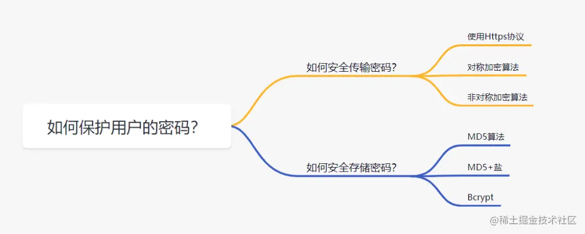
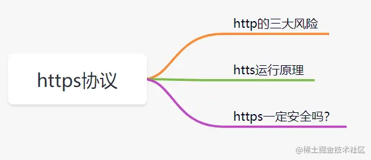
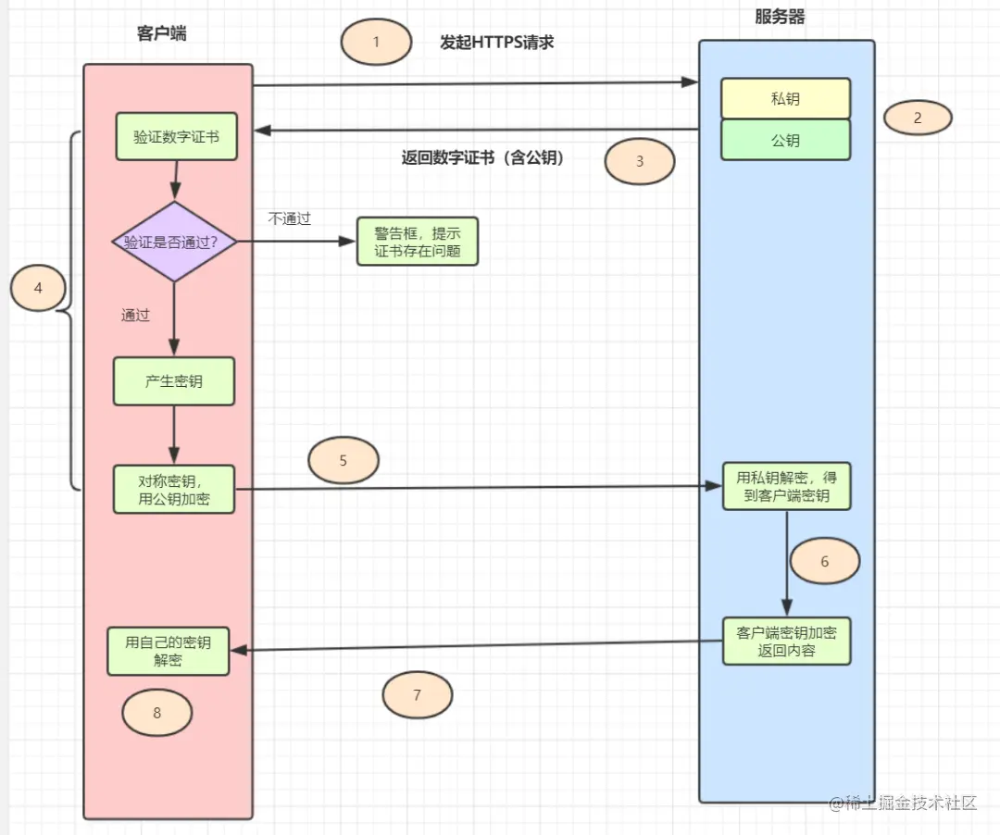
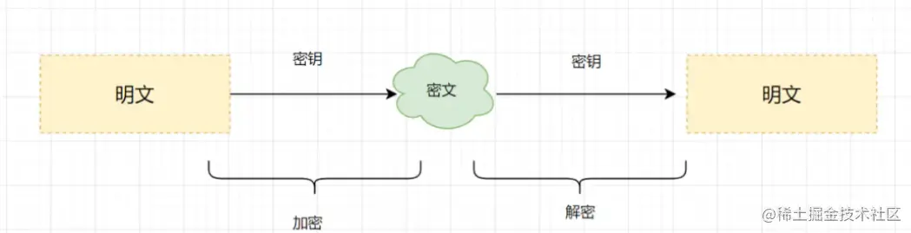
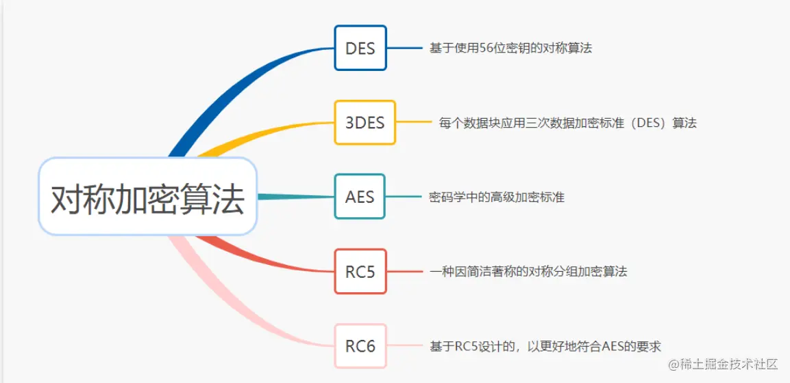
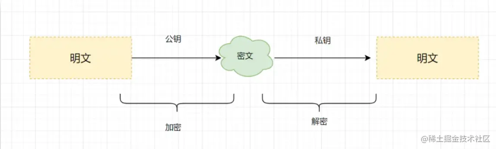
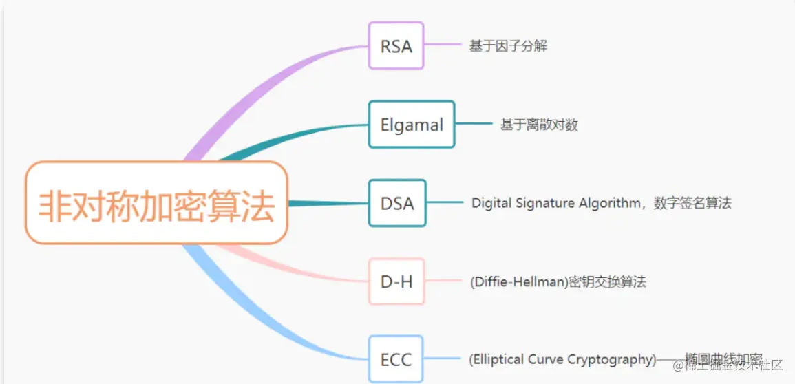
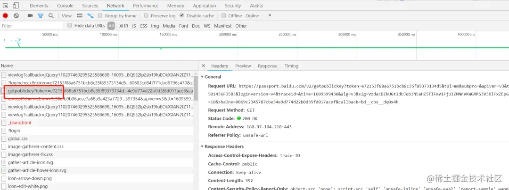
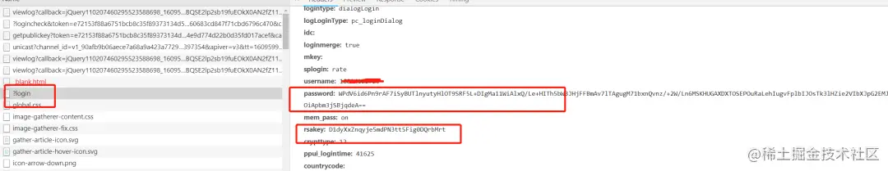
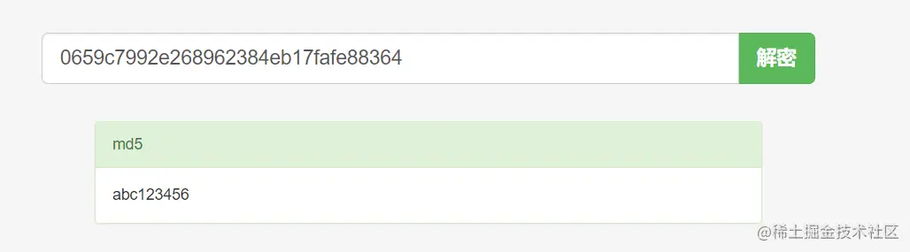

+++
title = "密码存储"
date = '2024-10-02T00:00:00+08:00'
lastmod = '2024-12-16T00:00:00+08:00'
draft = true
weight = 6
tags = ["面试", "前端", "前端安全", "密码存储", "ecool"]
categories = ["前端开发", "面试"]
source = "https://fe.ecool.fun/knowledge-learn"
+++
我们在开发网站或者APP时，首先要解决的问题，就是**如何安全地传输和存储用户的密码**。一些大公司的用户数据库泄露事件也时有发生，带来非常大的负面影响。因此，如何安全传输存储用户密码，是每位程序员必备的基础。本文将跟大家一起学习，如何安全传输存储用户的密码。



### 1. 如何安全地传输用户的密码

要拒绝用户密码在网络上裸奔，我们很容易就想到使用https协议，那先来回顾下https相关知识吧~

#### 1.1 https 协议



- **「http的三大风险」**

为什么要使用https协议呢？**http它不香**吗? 因为http是明文信息传输的。如果在茫茫的网络海洋，使用http协议，有以下三大风险：

> - 窃听/嗅探风险：第三方可以截获通信数据。
> - 数据篡改风险：第三方获取到通信数据后，会进行恶意修改。
> - 身份伪造风险：第三方可以冒充他人身份参与通信。

如果传输不重要的信息还好，但是传输用户密码这些敏感信息，那可不得了。所以一般都要使用**https协议**传输用户密码信息。

- **「https 原理」**

https原理是什么呢？为什么它能解决http的三大风险呢？

> https = http + SSL/TLS, SSL/TLS 是传输层加密协议，它提供内容加密、身份认证、数据完整性校验，以解决数据传输的安全性问题。

为了加深https原理的理解，我们一起复习一下 **一次完整https的请求流程**吧~



> 1. 客户端发起https请求
> 2. 服务器必须要有一套数字证书，可以自己制作，也可以向权威机构申请。这套证书其实就是一对公私钥。
> 3. 服务器将自己的数字证书（含有公钥、证书的颁发机构等）发送给客户端。
> 4. 客户端收到服务器端的数字证书之后，会对其进行验证，主要验证公钥是否有效，比如颁发机构，过期时间等等。如果不通过，则弹出警告框。如果证书没问题，则生成一个密钥（对称加密算法的密钥，其实是一个随机值），并且用证书的公钥对这个随机值加密。
> 5. 客户端会发起https中的第二个请求，将加密之后的客户端密钥(随机值)发送给服务器。
> 6. 服务器接收到客户端发来的密钥之后，会用自己的私钥对其进行非对称解密，解密之后得到客户端密钥，然后用客户端密钥对返回数据进行对称加密，这样数据就变成了密文。
> 7. 服务器将加密后的密文返回给客户端。
> 8. 客户端收到服务器发返回的密文，用自己的密钥（客户端密钥）对其进行对称解密，得到服务器返回的数据。

- **「https一定安全吗？」**

https的数据传输过程，数据都是密文的，那么，使用了https协议传输密码信息，一定是安全的吗？其实不然

> - 比如，https 完全就是建立在证书可信的基础上的呢。但是如果遇到中间人伪造证书，一旦客户端通过验证，安全性顿时就没了哦！平时各种钓鱼不可描述的网站，很可能就是黑客在诱导用户安装它们的伪造证书！
> - 通过伪造证书，https也是可能被抓包的哦。

#### 1.2 对称加密算法

既然使用了https协议传输用户密码，还是 **「不一定安全」**，那么，我们就给用户密码 **「加密再传输」** 呗~

加密算法有 **「对称加密」** 和 **「非对称加密」** 两大类。用哪种类型的加密算法 **「靠谱」** 呢？

> 对称加密：加密和解密使用 **「相同密钥」** 的加密算法。

 常用的对称加密算法主要有以下几种哈：

 如果使用对称加密算法，需要考虑 **「密钥如何给到对方」** ，如果密钥还是网络传输给对方，传输过程，被中间人拿到的话，也是有风险的哦。

#### 1.3 非对称加密算法

再考虑一下非对称加密算法呢？

> **「非对称加密：」** 非对称加密算法需要两个密钥（公开密钥和私有密钥）。公钥与私钥是成对存在的，如果用公钥对数据进行加密，只有对应的私钥才能解密。



常用的非对称加密算法主要有以下几种哈：



> 如果使用非对称加密算法，也需要考虑 **「密钥公钥如何给到对方」** ，如果公钥还是网络传输给对方，传输过程，被中间人拿到的话，会有什么问题呢？**「他们是不是可以伪造公钥，把伪造的公钥给客户端，然后，用自己的私钥等公钥加密的数据过来？」** 大家可以思考下这个问题哈~

我们直接 **「登录一下百度」** ，抓下接口请求，验证一发大厂是怎么加密的。可以发现有获取公钥接口，如下:

 再看下登录接口，发现就是RSA算法，RSA就是 **「非对称加密算法」** 。其实百度前端是用了JavaScript库 **「jsencrypt」** ，在github的star还挺多的。

 因此，我们可以用 **「https + 非对称加密算法（如RSA）」** 传输用户密码~

### 2. 如何安全地存储你的密码？

假设密码已经安全到达服务端啦，那么，如何存储用户的密码呢？一定不能明文存储密码到数据库哦！可以用 **「哈希摘要算法加密密码」** ，再保存到数据库。

> 哈希摘要算法：只能从明文生成一个对应的哈希值，不能反过来根据哈希值得到对应的明文。

#### 2.1 MD5摘要算法保护你的密码

MD5 是一种非常经典的哈希摘要算法，被广泛应用于数据完整性校验、数据（消息）摘要、数据加密等。但是仅仅使用 MD5 对密码进行摘要，并不安全。我们看个例子，如下：

```java
public class MD5Test {
    public static void main(String[] args) {
        String password = "abc123456";
        System.out.println(DigestUtils.md5Hex(password));
    }
}
```

运行结果： `0659c7992e268962384eb17fafe88364`

在MD5免费破解网站一输入，马上就可以看到原密码了。。。

 试想一下，如果黑客构建一个超大的数据库，把所有20位数字以内的数字和字母组合的密码全部计算MD5哈希值出来，并且把密码和它们对应的哈希值存到里面去（这就是 **「彩虹表」** ）。在破解密码的时候，只需要查一下这个彩虹表就完事了。所以 **「单单MD5对密码取哈希值存储」** ，已经不安全啦~

#### 2.2 MD5+盐摘要算法保护用户的密码

那么，为什么不试一下MD5+盐呢？什么是 **「加盐」**？

> 在密码学中，是指通过在密码任意固定位置插入特定的字符串，让散列后的结果和使用原始密码的散列结果不相符，这种过程称之为“加盐”。

用户密码+盐之后，进行哈希散列，再保存到数据库。这样可以有效应对彩虹表破解法。但是呢，使用加盐，需要注意一下几点：

> - 不能在代码中写死盐，且盐需要有一定的长度（盐写死太简单的话，黑客可能注册几个账号反推出来）
> - 每一个密码都有独立的盐，并且盐要长一点，比如超过 20 位。(盐太短，加上原始密码太短，容易破解)
> - 最好是随机的值，并且是全球唯一的，意味着全球不可能有现成的彩虹表给你用。

#### 2.3 提升密码存储安全的利器登场，Bcrypt

即使是加了盐，密码仍有可能被暴力破解。因此，我们可以采取更 **「慢一点」** 的算法，让黑客破解密码付出更大的代价，甚至迫使他们放弃。提升密码存储安全的利器~Bcrypt，可以闪亮登场啦。

> 实际上，Spring Security 已经废弃了 MessageDigestPasswordEncoder，推荐使用BCryptPasswordEncoder，也就是BCrypt来进行密码哈希。BCrypt 生而为保存密码设计的算法，相比 MD5 要慢很多。

看个例子对比一下吧：

```java
public class BCryptTest {

    public static void main(String[] args) {
        String password = "123456";
        long md5Begin = System.currentTimeMillis();
        DigestUtils.md5Hex(password);
        long md5End = System.currentTimeMillis();
        System.out.println("md5 time:"+(md5End - md5Begin));
        long bcrytBegin = System.currentTimeMillis();
        BCrypt.hashpw(password, BCrypt.gensalt(10));
        long bcrytEnd = System.currentTimeMillis();
        System.out.println("bcrypt Time:" + (bcrytEnd- bcrytBegin));
    }
}
```

运行结果：

`md5 time:47`

`bcrypt Time:1597`

粗略对比发现，BCrypt比MD5慢几十倍，黑客想暴力破解的话，就需要花费几十倍的代价。因此一般情况，建议使用Bcrypt来存储用户的密码

### 3. 总结

- 因此，一般使用https 协议 + 非对称加密算法（如RSA）来传输用户密码，为了更加安全，可以在前端构造一下随机因子哦。
- 使用BCrypt + 盐存储用户密码。
- 在感知到暴力破解危害的时候，**「开启短信验证、图形验证码、账号暂时锁定」** 等防御机制来抵御暴力破解。

## 常见考点

### **1. 基本概念与原理**

#### **问题：**

1. 为什么不能直接明文存储用户密码？
2. 什么是哈希（Hash）？哈希函数有什么特点？

#### **考察点：**

-  **明文存储的风险**：<br>
  - 明文存储一旦泄露，攻击者可以直接获取所有用户的密码，后果严重。
  - 用户往往在多个平台使用相同密码，因此泄露会带来连锁反应（撞库攻击）。
-  **哈希函数的特点**：<br>
  - 不可逆性：无法通过哈希值反推出原始输入。
  - 雪崩效应：输入的微小改变会导致输出的哈希值发生巨大变化。
  - 确定性：相同的输入总会得到相同的输出。

---

### **2. 密码加盐（Salt）的必要性**

#### **问题：**

1. 什么是加盐？为什么需要对密码进行加盐？
2. 如果不加盐，使用相同的密码会出现什么问题？

#### **考察点：**

-  **加盐的定义**： 加盐是指在密码前后附加一段随机字符串（Salt），再进行哈希处理，确保相同的密码生成不同的哈希值。
-  **作用**：<br>
  - 防止彩虹表攻击（Rainbow Table Attack）：彩虹表是一种预计算的哈希值表，通过加盐，可以使攻击者难以匹配表中的哈希值。
  - 增强唯一性：即使两个用户使用相同密码，加盐后也会生成不同的哈希值。
-  **示例**：<br>
```javascript
const crypto = require('crypto');
const salt = crypto.randomBytes(16).toString('hex'); // 随机盐
const hashedPassword = crypto.pbkdf2Sync(password, salt, 1000, 64, 'sha512').toString('hex');
```

---

### **3. 常见密码哈希算法**

#### **问题：**

1. 密码存储中常用的哈希算法有哪些？
2. 为什么 MD5 和 SHA-1 不适合密码存储？

#### **考察点：**

-  **常见哈希算法**：<br>
  - MD5（已不安全）
  - SHA-1（已不安全）
  - SHA-256、SHA-512（安全，但计算速度较快，易受暴力破解攻击）
  - bcrypt、PBKDF2、scrypt、Argon2（推荐的密码存储算法）
-  **推荐算法特点**：<br>
  - **bcrypt**：<br>
    - 内置加盐。
    - 可调整计算复杂度（通过 cost 参数控制）。
    - 使用 Blowfish 加密算法，抗 GPU 暴力破解。
  - **PBKDF2**：<br>
    - 基于 HMAC（哈希消息认证码）的加密算法。
    - 支持多次迭代，增加破解成本。
  - **scrypt**：<br>
    - 结合高计算成本和高内存消耗，特别适合抵抗大规模并行计算攻击。
  - **Argon2**：<br>
    - 密码哈希竞赛获胜算法，被认为是当前最安全的密码存储算法。
    - 支持灵活调整内存、时间和并行度，安全性极高。

---

### **4. 密码存储的具体实现**

#### **问题：**

1. 如何结合加盐和哈希存储用户密码？
2. 描述一个安全的密码校验过程。

#### **考察点：**

-  **存储过程**：<br>
  1. 用户注册时，生成随机盐。
  2. 使用盐和密码进行哈希计算。
  3. 将盐和哈希值一起存储到数据库。
-  **校验过程**：<br>
  1. 用户登录时，提取数据库中存储的盐。
  2. 用相同的哈希算法对用户输入的密码和盐进行计算。
  3. 将计算结果与存储的哈希值比对。
-  **示例**：<br>
```javascript
const verifyPassword = (password, salt, hash) => {
  const hashToVerify = crypto.pbkdf2Sync(password, salt, 1000, 64, 'sha512').toString('hex');
  return hashToVerify === hash;
};
```

---

### **5. 密码存储的安全风险与防御**

#### **问题：**

1. 什么是彩虹表攻击？如何防御？
2. 如果数据库被泄露，如何最大限度地保护用户密码？
3. 密码哈希算法的迭代次数为什么很重要？

#### **考察点：**

-  **彩虹表攻击**： 彩虹表是哈希值的预计算表，通过与目标哈希值比对，可以快速破解未加盐的密码。
-  **数据库泄露防御措施**：<br>
  - 使用强哈希算法（如 bcrypt、Argon2）。
  - 使用独立的随机盐。
  - 定期更新迭代次数，增加破解成本。
-  **迭代次数的作用**： 增加密码哈希的计算时间，使攻击者每次尝试都需要更多时间，从而降低暴力破解的可行性。

---

### **6. 密码强度检查**

#### **问题：**

1. 如何设计密码强度规则，确保用户密码的安全性？
2. 如何在密码存储的同时兼顾用户体验？

#### **考察点：**

-  **密码强度规则**：<br>
  - 最小长度（如 8 位以上）。
  - 包含大写字母、小写字母、数字和特殊字符。
  - 避免常用密码（如 "123456"）。
-  **用户体验优化**：<br>
  - 提供实时密码强度提示。
  - 避免设置过于复杂的规则，导致用户体验不佳。

---

### **7. 前后端协作**

#### **问题：**

1. 在前端和后端分别如何保障密码安全？
2. 如果攻击者窃取了前端传输的明文密码，有什么防御措施？

#### **考察点：**

-  **前端措施**：<br>
  - 使用 HTTPS 确保传输安全。
  - 可以在前端对密码进行预哈希处理，但后端仍需使用强哈希算法加盐存储。
-  **后端措施**：<br>
  - 永远不要直接存储明文密码。
  - 确保后端的密码校验过程使用安全的哈希算法和盐。

---

### **8. 密码存储的进阶考察**

#### **问题：**

1. 如果密码算法升级（如从 SHA-256 切换到 bcrypt），如何处理老用户的密码？
2. 密码存储中如何实现多租户支持（不同用户组使用不同的密码策略）？

#### **考察点：**

-  **算法升级**：<br>
  - 在用户下次登录时，将密码重新哈希并更新存储。
  - 或者为每个用户添加字段记录当前哈希算法版本，在用户主动更新密码时进行升级。
-  **多租户支持**：<br>
  - 不同租户存储独立的盐。
  - 使用动态配置的哈希算法或参数。
