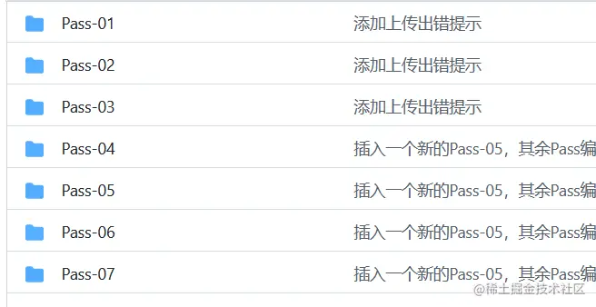
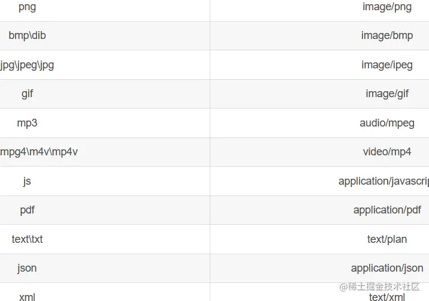

+++
title = "文件上传安全"
date = '2024-10-02T00:00:00+08:00'
lastmod = '2024-12-16T00:00:00+08:00'
draft = true
weight = 7
tags = ["面试", "前端", "前端安全", "文件上传安全", "ecool"]
categories = ["前端开发", "面试"]
source = "https://fe.ecool.fun/knowledge-learn"
+++
## 文件上传漏洞简介

### **原理**

> 攻击者可以上传一个与网站脚本语言相对应的恶意代码动态脚本到服务器上,然后访问这些恶意脚本中包含的恶意代码,从而获得了执行服务器端命令的能力,进一步影响服务器安全。

### 危害

> 文件上传漏洞最直接的威胁就是上传任意文件，包括恶意脚本、可执行程序等。

> 如果Web 服务器所保存上传文件的可写目录具有执行权限，那么就可以直接上传后门文件，导致网站沦陷。

> 如果攻击者通过其他漏洞进行提权操纵，拿到系统管理权限，那么直接导致服务器沦陷。

> 同服务器下的其他网站无一幸免，均会被攻击者控制。

### 利用

对于利用，我们只需要有个文件上传的点，以及我们知道我们所传的文件所在目录并且上传的恶意文件能够被web容器解析执行，便可能存在文件上传漏洞。

## 实战

说是实战但是因为不能随便入侵别人的机器(有概率获取银手镯一套)，这里给大家推荐一个专门用来练习文件上传漏洞的不同利用方法的靶场。

> [github.com/c0ny1/uploa…](https://github.com/c0ny1/upload-labs)

 可以看到里面有很多关卡，对于环境的搭建，这里我推荐用phpstudy去进行一键搭建，比较适合入门的萌新，具体搭建方法不是本文的重点，于是我们跳过，接下来给大家带来文件上传漏洞一些常见的绕过方法。

### 客户端检测绕过

有的客户端会存在客户端校验，校验上传文件的后缀名，当我们传入php木马时可能会因为类型不同被禁止，此时我们要怎么进行上传一句话木马呢，这里给大家提供两个思路，第一个我们可以禁用浏览器的JS脚本，第二种方法便是使用渗透中常用工具burpsuit进行抓包，然后修改文件后缀为php即可绕过，因为他只是做了一个前端的简单验证。

### 修改MIME 类型

有的服务器端将会对上传文件content-type类型进行检查以此来防范恶意文件的上传，这时我们打开burp suite将php文件上传，因为content-type的类型不是服务器认可的类型，那么我们就可以使用burpsuite进行修改该文件类型，并将该文件进行上传。

常见的content-type对应类型如下：



### **00截断绕过**

运用此漏洞需要满足两个条件：

> 1.php版本小于5.3.4 

> 2.php的magic_quotes_gpc为OFF状态

0x开头表示16进制，0在十六进制中是00, 0x00就是%00解码成的16进制，具体运用方法如下，假如我们上传一个一句话木马：

攻击者修改了path以后的拼接结果为：uploads/XINO.php%00/20190818.php，移动文件的时候会将文件保存为：uploads/XINO.php，以此我们便可以绕过检测来上传一句话木马。

### **.htaccess文件攻击**

**.htaccess**文件(或者"分布式配置文件"）,全称是**Hypertext Access**(超文本入口)。提供了针对目录改变配置的方法， 即，在一个特定的文档目录中放置一个包含一个或多个**指令**的文件， 以作用于此目录及其所有子目录。

简单来说该文件的作用就是根据里面的内容解析为我们想要的类型，这么说可能很难理解，比如我上传一个图片马（JPG文件里插入了一句话木马），因为网站对我们的上传类型做了限制，我们上传不了PHP文件，我们先上传一个JPG的图片马，然后上传 **.htaccess文件，** 将图片解析为php语言，来达到getshell的目的。具体的文件内的内容为：

```bash
<FilesMatch "evil.gif">
SetHandler application/x-httpd-php#在当前目录下，如果匹配到evil.gif文件，则被解析成PHP代码执行
AddHandler php5-script .gif       #在当前目录下，如果匹配到evil.gif文件，则被解析成PHP代码执行
</FilesMatch>
```

当然不止这一种，还能如下写法：

```bash
AddHandler php5-script .jpg

AddType application/x-httpd-php .jpg

Sethandler application/x-httpd-php
```

### 文件头检测

当我们上传一些文件时，有些拦截会检测我们文件里的具体内容，如果匹配了正确的文件头则会通过检测，反之则会拦截我们的文件，针对如此我们可以利用在文件前写入适当文件类型的文件头来绕过。常用的文件头如下：

> JPG：FF D8 FF E0 00 10 4A 46 49 46

> GIF ：47 49 46 38 39 61 (GIF89a)

> PNG：89 50 4E 47

## **图片马绕过**

图片马在上面提到过，当然该方法需要配合其他的利用方式来达到目的（文件包含）具体的制作方法如下：

```bash
 copy 1.jpg/b+2.php 3.jpg
```

这是最平常的插入图片马的方法，我们还可以利用一些软件例如010editor来直接插入到图片数据中。

### 黑白名单绕过

一些拦截会限制我们上传的类型，具体可以分为以下两种：

**黑名单**：明确不让上传的格式后缀(asp,php,jsp,aspx,cgi,war)，在黑名单中可能存在没有增加限制的漏网之鱼，此时可以通过这些没有禁止的后缀名来上传一句话木马,例如：php5,phtml

**白名单**：明确可以上传的格式后缀,该方法还是比较安全的，但也有许多绕过方法，例：MIME类型、%00截断、0x00截断、0x0a截断。

## 常见考点

### **1. 文件上传的常见安全风险**

#### **问题：**

1. 文件上传可能带来哪些安全问题？
2. 一个未做限制的文件上传功能会有哪些潜在漏洞？

#### **考察点：**

-  **常见风险**：  
  - **恶意文件上传**：攻击者上传带有恶意代码的文件，试图执行远程命令或注入恶意脚本。
  - **任意文件上传**：允许上传任何格式的文件，可能导致敏感数据泄露或服务器负载增加。
  - **文件名伪造**：通过伪装文件扩展名或文件类型绕过校验逻辑。
  - **路径穿越攻击**：利用文件路径中的 `../` 等方式覆盖服务器上的关键文件。
-  **案例**：  
  - 上传一个 `.php` 文件执行后门程序。
  - 上传超大文件导致服务器资源耗尽。

---

### **2. 文件类型校验**

#### **问题：**

1. 如何确保上传的文件是合法类型？
2. 仅在前端验证文件类型是否安全？为什么？

#### **考察点：**

-  **前端校验**：  
  - 使用 `accept` 属性限制文件类型：  
```html
<input type="file" accept=".jpg, .png, .pdf" />
```
  - 通过 JavaScript 检查 MIME 类型或扩展名。
-  **后端校验**：  
  - 解析文件头（Magic Number），验证文件的真实类型。  
```python
def is_valid_file(file):
    allowed_types = [b'\xff\xd8\xff', b'\x89PNG']  # JPEG, PNG
    file_header = file.read(3)
    return file_header in allowed_types
```
  - 不能仅依赖扩展名或 MIME 类型，这些可能被伪造。
-  **重点**：  
  - 前端校验只能作为用户体验的一部分，真正的安全保障必须在后端实现。

---

### **3. 文件大小限制**

#### **问题：**

1. 如何防止攻击者通过上传超大文件消耗服务器资源？
2. 上传文件大小限制的最佳实践是什么？

#### **考察点：**

- **设置大小限制**：  
  - **前端**：通过 `maxSize` 设置文件大小限制，并及时提示用户。
  - **后端**：在处理请求前检查文件大小。  
```javascript
if (file.size > MAX_SIZE) {
    return res.status(400).send('File too large');
}
```
- **服务器配置**：  
  - Nginx 或 Apache 等 Web 服务器可配置最大请求体大小。  
```
client_max_body_size 10M;
```
  - 数据库存储时也需限制单个文件字段的容量。

---

### **4. 文件路径安全**

#### **问题：**

1. 文件上传时，如何防止路径穿越攻击？
2. 为什么不能直接使用用户提供的文件名存储文件？

#### **考察点：**

-  **防路径穿越**：  
  - 禁止用户指定完整路径。
  - 使用 `basename()` 提取文件名后存储到安全目录。
  - 生成随机文件名或 UUID 避免路径冲突。  
```python
import uuid
safe_filename = f"{uuid.uuid4()}.jpg"
```
-  **防止文件覆盖**：  
  - 使用时间戳或唯一标识符作为文件名前缀。
  - 检查文件是否已存在，防止覆盖。

---

### **5. 存储安全**

#### **问题：**

1. 上传的文件应存储在哪些位置，为什么？
2. 上传文件存储到数据库和文件系统时，如何选择？

#### **考察点：**

-  **存储位置**：  
  - **隔离存储**：将文件存储在独立的非 Web 根目录，防止通过 URL 直接访问文件。  
```
/uploads/
/var/www/myapp/
```
  - **第三方存储服务**：如 AWS S3、阿里云 OSS，减少对本地服务器的依赖。
-  **文件系统 vs 数据库**：  
  - **文件系统**：  
    - 适合大文件，性能更高。
    - 需要妥善管理文件路径和命名。
  - **数据库**：  
    - 更适合存储小文件，便于事务性操作。
    - 可能导致数据库膨胀，降低性能。

---

### **6. 文件访问控制**

#### **问题：**

1. 如何限制文件的访问权限？
2. 如果需要用户验证后才能访问文件，该如何实现？

#### **考察点：**

-  **设置文件权限**：  
  - 通过服务器配置或代码控制文件的读取权限。
  - 例如，Nginx 的 `autoindex off;` 禁止目录索引。
-  **授权访问**：  
  - 文件访问 URL 应动态生成，并绑定用户信息或有效期。  
```javascript
const generateSecureURL = (filePath) => {
    const token = createToken(filePath, expiryTime);
    return `/download?file=${filePath}&token=${token}`;
};
```

---

### **7. 文件扫描与内容过滤**

#### **问题：**

1. 如何检查上传文件是否包含恶意内容？
2. 上传的图片可能被嵌入恶意脚本吗？如何防御？

#### **考察点：**

-  **病毒扫描**：  
  - 使用杀毒软件或工具（如 ClamAV）对上传的文件进行扫描。  
```bash
clamscan --infected --remove file.jpg
```
-  **内容过滤**：  
  - 对文件内容进行检查，如移除图片中的恶意代码（嵌入式 JS）。
  - 对用户上传的文档（如 `.docx`）使用沙箱或专用解析器进行安全解析。

---

### **8. 上传接口的安全保障**

#### **问题：**

1. 如何防止文件上传接口被滥用？
2. 文件上传接口是否容易被 DOS 攻击？如何防御？

#### **考察点：**

-  **接口安全**：  
  - 添加身份验证或权限检查，确保只有授权用户可以上传。
  - 限制每个用户的上传次数或流量。
-  **防止 DOS 攻击**：  
  - 配置 Web 服务器的速率限制（如 Nginx 的 `limit_req`）。
  - 设置防火墙规则限制请求频率。

---

### **9. 前端与后端的协作**

#### **问题：**

1. 如何设计一个前端友好、后端安全的文件上传流程？
2. 文件上传失败后如何处理？

#### **考察点：**

- **流程设计**：  
  1. 前端实时校验文件大小、类型等基本信息。
  2. 后端接收到文件后进行严格的安全检查。
  3. 使用分片上传和断点续传减少失败影响。
- **失败处理**：  
  - 提供详细的错误信息。
  - 可通过队列机制或后台任务重新上传。

---

### **10. 综合实践问题**

#### **问题：**

1. 如何设计一个支持大文件上传的安全系统？
2. 假如上传服务上线后出现文件伪造攻击，如何快速响应并修复？

#### **考察点**：

-  **大文件上传**：  
  - 使用分片上传技术（如 `chunk`）。
  - 对每个分片进行验证，上传完成后重新校验文件完整性（如 MD5 校验）。
-  **响应攻击**：  
  - 暂时关闭上传接口。
  - 增加文件头验证逻辑。
  - 检查历史文件存储的安全性，并修复潜在漏洞。
