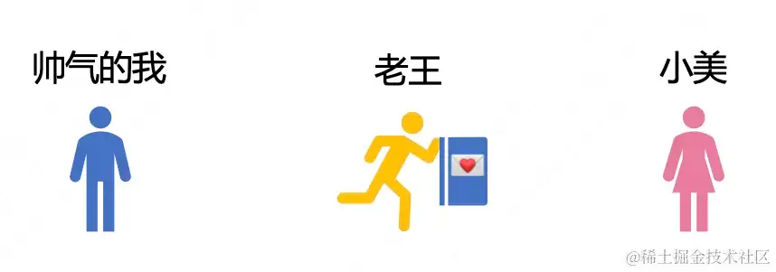
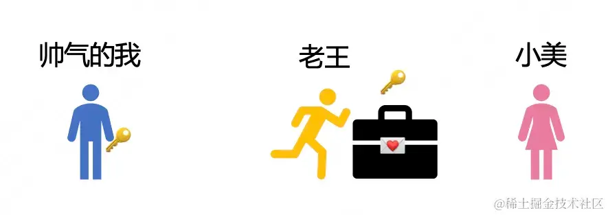
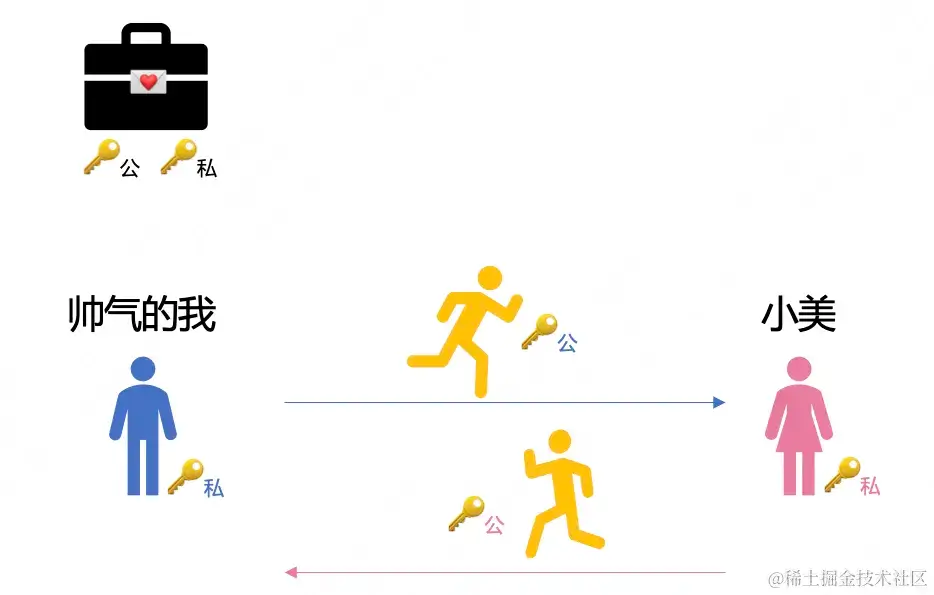
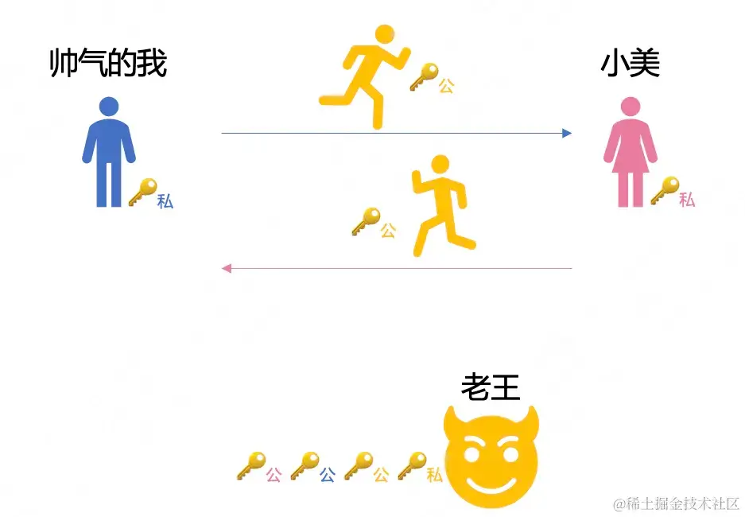

+++
title = "中间人攻击"
date = '2024-12-04T00:00:00+08:00'
lastmod = '2024-12-04T00:00:00+08:00'
draft = true
weight = 9
tags = ["面试", "前端", "前端安全", "中间人攻击", "ecool"]
categories = ["前端开发", "面试"]
source = "https://fe.ecool.fun/knowledge-learn"
+++
一句话总结：中间人攻击的关键在于**获取公钥**。

## 一、我和小美传纸条

我和隔壁班的小美互相喜欢，经常互相传纸条。但我懒得动，一般让老王帮我顺路带过去，我信任老王，所以就是简单把纸对折一下就交给老王了。

## 二、带锁的盒子

有一天我发现，老王居然偷看我的纸条！

我很生气，于是买了一个带锁的盒子，并配了两把钥匙🔑，我留一把，另一把让老王交给小美。我心想这下子老王没钥匙，看不了我们的纸条了。

## 三、一个需要两把钥匙的盒子

又过了几天，我发现老王还是会偷看，为什么呢？原来这老小子当初传递钥匙的时候，自己去复刻了一把！

于是我又想了一个办法，换了一个更高级的盒子，这个盒子必须用一对钥匙才能使用，使用公钥上锁，必须使用私钥才能打开。我委托老王把我的公钥交给小美，把小美的公钥拿给我。

以后我们都用对方的公钥来进行加密，对方用自己的私钥就能解密。而且就算老王把公钥拿去复刻一把也没关系，没有私钥他就打不开箱子，完美！

## 四、班主任

过了几天，我发现老王还是能偷看我们的纸条，为什么呢？？？？？？

我想了好几天终于想明白了！原来老王当初传递钥匙的时候，他把我俩的公钥自己留下了，这老小子把自己的公钥给了我们俩。他现在有手里有四把钥匙，想看什么看什么！

这次我们终于意识到问题的关键，不管什么方案，让老王传钥匙就得坏事！于是我和小美商量好，这次不通过老王，而是通过我的班主任传递公钥，终于可以愉快的聊天了！

## 五、网络中的加密知识

1. 对称加密

对称加密使用`同一个密钥`进行加密和解密。它的优点是速度快，它的问题是密钥传播过程中一旦泄露，就功亏一篑了。

2. 非对称加密

非对称加密使用一对密钥：公钥和私钥。`公钥用于加密，私钥用于解密`。它的优点是密钥分发问题得到解决，公钥可以公开传播。缺点是速度较慢，通常用于加密小数据量或密钥交换。常见做法是通过非对称加密建立链接，交换对称加密密钥，然后使用对称加密的方式进行消息传递。

3. 证书

数字证书是由认证机构（CA）签发的，包含公钥及其持有者身份信息的电子文档。它通过 CA 的数字签名验证其真实性，确保通信双方的身份和公钥的可信性。（证书就是上面例子中的班主任，是一个可信任的获取对方公钥的机构。）

## 六、中间人攻击

中间人攻击的关键在于攻击者成功获取并提供**可信公钥**，欺骗用户使其认为其公钥是合法服务器的公钥。这可以通过伪造证书或利用受损的 CA 来实现。（用上面例子来说，就是老王把自己的公钥伪装成小美的公钥给了我）

作为普通用户防御措施很简单，当访问一个网站时，如果浏览器弹出“证书不可信”告警的时候，不要点“我信任”。

## 常见考点

### **1. 中间人攻击的基本概念**

#### **问题**：

- 什么是中间人攻击？请用通俗的语言解释。
- 中间人攻击有哪些典型的攻击方式？  
  - 被动攻击（如窃听）。
  - 主动攻击（如数据篡改）。
- 中间人攻击的危害有哪些？

**关键点**：

- 中间人攻击是一种攻击者拦截并篡改通信内容的攻击。
- 危害包括：窃取敏感数据（如密码）、篡改通信内容、伪装身份等。

---

### **2. 中间人攻击的原理**

#### **问题**：

- 中间人攻击是如何实现的？请简要描述其工作流程。
- 在 HTTP 中，为什么容易发生中间人攻击？
- HTTPS 是否完全能防止中间人攻击？为什么？
- DNS 劫持和 ARP 欺骗是如何帮助实现中间人攻击的？

**关键点**：

- **工作流程**：  
  1. 攻击者充当通信双方之间的“中间人”。
  2. 拦截通信数据，可能进行监听或篡改。
- **常见技术**：  
  - ARP 欺骗：伪装网关。
  - DNS 劫持：将域名解析到攻击者控制的服务器。
  - Wi-Fi 劫持：在公共网络中拦截通信数据。

---

### **3. 防御中间人攻击的技术措施**

#### **问题**：

- HTTPS 如何防御中间人攻击？它的安全机制是什么？
- 什么是证书信任链？如何防止伪造的证书？
- 什么是 HSTS（HTTP Strict Transport Security）？它如何防御中间人攻击？
- 什么是双向 SSL/TLS？它如何进一步提高安全性？
- 如何防止公共 Wi-Fi 中的中间人攻击？

**关键点**：

- **HTTPS**：  
  - 使用非对称加密验证身份，防止伪装。
  - 数据传输使用对称加密，保证保密性。
- **HSTS**：  
  - 强制使用 HTTPS，防止降级攻击。
- **证书验证**：  
  - 客户端验证服务器证书的合法性，防止伪造。
  - 遵循信任链。

---

### **4. 中间人攻击的常见场景**

#### **问题**：

- 在以下场景中，中间人攻击可能如何发生？如何防御？  
  1. 用户登录公共 Wi-Fi 时访问银行账户。
  2. 一个应用程序使用第三方 API 时未启用 HTTPS。
  3. 企业内网中存在不安全的设备。
- 如何验证当前网络是否安全，是否存在中间人攻击？

**关键点**：

- 在公共 Wi-Fi 中，可以使用 VPN 来加密通信。
- API 通信必须启用 HTTPS 并验证证书。
- 使用安全工具检测不安全的代理或劫持。

---

### **5. HTTPS 与中间人攻击**

#### **问题**：

- HTTPS 如何阻止中间人攻击？
- 如果攻击者能拦截 HTTPS 握手，是否可以实施中间人攻击？为什么？
- 什么是降级攻击（Downgrade Attack）？如何通过 HTTPS 防止？

**关键点**：

- **HTTPS 机制**：  
  - 握手过程使用非对称加密防止伪装。
  - 会话中使用对称加密保证数据安全。
- **降级攻击**：  
  - 攻击者强迫客户端和服务器使用较弱的加密协议。
  - TLS 1.3 移除了对不安全算法的支持，可以有效防御。

---

### **6. 中间人攻击的检测与排查**

#### **问题**：

- 如何检测网络中是否存在中间人攻击？
- 如果某用户反映访问 HTTPS 页面时出现证书错误，可能是什么原因？如何排查？
- 如果发现网络通信被篡改，应采取哪些紧急措施？

**关键点**：

- 使用浏览器检查 HTTPS 证书的有效性。
- 使用工具（如 Wireshark）监控网络通信。
- 遇到证书错误，检查证书是否被伪造或篡改。

---

### **7. 中间人攻击的场景化问题**

#### **问题**：

- 在实际项目中，你如何确保用户访问你的站点时不会遭受中间人攻击？
- 如果第三方服务不支持 HTTPS，而你的系统必须与它通信，如何处理？
- 如果你的网站需要支持旧设备（如不支持现代加密协议的浏览器），如何权衡安全性与兼容性？

**关键点**：

- 配置 HTTPS 并强制启用 HSTS。
- 使用可信代理或中间服务为不支持 HTTPS 的第三方服务提供安全通信。
