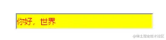

+++
title = "vue指令"
date = '2024-10-04T00:00:00+08:00'
lastmod = '2024-12-15T00:00:00+08:00'
draft = true
weight = 3
tags = ["面试", "前端", "Vue", "vue指令", "ecool"]
categories = ["前端开发", "面试"]
source = "https://fe.ecool.fun/knowledge-learn"
+++
#### 1.1 钩子函数

一个指令定义对象可以提供如下几个钩子函数 (均为可选)：

- bind 只调用一次，指令第一次绑定到元素时调用。在这里可以进行一次性的初始化设置。
- inserted 被绑定元素插入父节点时调用 (仅保证父节点存在，但不一定已被插入文档中)。
- update 所在组件的 VNode 更新时调用，但是可能发生在其子 VNode 更新之前。指令的值可能发生了改变，也可能没有。
- componentUpdated 指令所在组件的 VNode 及其子 VNode 全部更新后调用。
- unbind 只调用一次，指令与元素解绑时调用。

```javascript
Vue.directive('gqs',{
    bind() {
      // 当指令绑定到 HTML 元素上时触发.**只调用一次**
      console.log('bind triggerd')
    },
    inserted() {
      // 当绑定了指令的这个HTML元素插入到父元素上时触发(在这里父元素是 `div#app`)**.但不保证,父元素已经插入了 DOM 文档.**
      console.log('inserted triggerd')
    },
    updated() {
      // 所在组件的`VNode`更新时调用.
      console.log('updated triggerd')
    },
    componentUpdated() {
      // 指令所在组件的 VNode 及其子 VNode 全部更新后调用。
      console.log('componentUpdated triggerd')
      
    },
    unbind() {
      // 只调用一次，指令与元素解绑时调用.
      console.log('unbind triggerd')
    }
  })
```

#### 1.2 钩子函数参数

指令钩子函数会被传入以下参数：

-  el 指令所绑定的元素，可以用来直接操作 DOM 
-  binding 一个对象，包含以下属性：  
```
 name：指令名，不包括 v- 前缀。

 value：指令的绑定值，例如：v-my-directive="1 + 1" 中，绑定值为 2。

 oldValue：指令绑定的前一个值，仅在 update 和 componentUpdated 钩子中可用。无论值是否改变都可用。

 expression：字符串形式的指令表达式。例如 v-my-directive="1 + 1" 中，表达式为 "1 + 1"。

 arg：传给指令的参数，可选。例如 v-my-directive:foo 中，参数为 "foo"。

 modifiers：一个包含修饰符的对象。例如：v-my-directive.foo.bar 中，修饰符对象为 { foo: true, bar: true }。
```
-  vnode：Vue 编译生成的虚拟节点。 
-  oldVnode：上一个虚拟节点，仅在 update 和 componentUpdated 钩子中可用。 *除了 el 之外，其它参数都应该是只读的，切勿进行修改。如果需要在钩子之间共享数据，建议通过元素的 dataset 来进行。* 

#### 1.3 指令简写

当绑定指令的元素的状态发生改变时(这里主要是指元素绑定的vue数据发生改变时),仍然会触发指令中的 update 函数. 那么我们可以利用指令的简写形式,来做一些有意思的事情.

**核心思想就是:** **当一个HTML元素设置了指令,那么在这个元素的状态发生改变时(由vue数据变化带来的带来的监控),我们可以利用update()钩子函数监控到这个元素的变化,然后根据需要做一些其他的事情.**

**案例**：使用官方指定的指令简写模式:

```javascript
Vue.directive('color-swatch', function (el, binding) {
  el.style.backgroundColor = binding.value
})
```

当元素的状态发生改变时,就会触发 update

#### 1.4 小结几点

- 使用 Vue.directive() 来新建一个全局指令,(指令使用在HTML元素属性上的)
- Vue.directive('focus') 第一个参数focus是指令名,指令名在声明的时候,不需要加 v-
- 在使用指令的HTML元素上,我们需要加上 v-.

```html
<input type="text" v-focus placeholder="我有v-focus,所以,我获取了焦点"/> 
```

-  Vue.directive('focus',{}) 第二个参数是一个对象,对象内部有个 inserted() 的函数,函数有 el 这个参数.  
  - el 这个参数表示了绑定这个指令的 DOM元素,在这里就是后面那个有 placeholder 的 input
  - el 就等价于 document.getElementById('el.id')....
  - 可以利用 $(el) 无缝连接 jQuery

### 2. vue-cli中定义全局指令

#### 2.1 main.js

```javascript
import Vue from 'vue'
import App from './App.vue'
import router from './router'
import store from './store'

// 如果你只需要执行绑定的 bind 和 update 两个事件,vue指令定义也配置了简写方式.
Vue.directive('my-color',(el) => {
  el.style.color = 'red'
  el.style.backgroundColor = 'yellow'
})

new Vue({
  router,
  store,
  render: h => h(App)
}).$mount('#app')
```

#### 2.2 相应组件

```vue
<template>
  <input type="text" v-my-color>
</template>
```

#### 2.3 实现效果



### 3. vue-cli中定义局部指令

#### 3.1 相应组件

```javascript
<template>
	<input type="text" v-model="text" placeholder="仅可填入正整数数字"	
		v-my-text="{key:'text',maxval:'1000'}">
</template>
<script>
export default {
  data(){
    return {
      text:'',
    }
  },
directives:{
    myText:{
      bind(el,binding,vnode) {
        el.handler = function() {
          el.value = el.value.replace(/\D+/g, '')
          //根据设置的规则，进行判断处理
          if(binding.value.maxval && el.value > parseInt(binding.value.maxval)){
            el.value = parseInt(binding.value.maxval);
          }
          //根据指令调取位置设置的规则Key，进行全局上文赋值
          vnode['context'][binding.value.key] = el.value;
        }
        el.addEventListener('input', el.handler)
      },
    },
  }
}
</script>
```

#### 3.2 简写模式

```javascript
<template>
	<input type="text" v-model="text" placeholder="仅可填入正整数数字"	
		v-my-text="{key:'text',maxval:'1000'}">
</template>
<script>
export default {
  data(){
    return {
      text:'',
    }
  },
  directives:{
    myText:(el,binding,vnode) => {
      el.handler = function() {
      el.value = el.value.replace(/\D+/g, '')
      //根据设置的规则，进行判断处理
      if(binding.value.maxval && el.value > parseInt(binding.value.maxval)){
        el.value = parseInt(binding.value.maxval);
      }
      //根据指令调取位置设置的规则Key，进行全局上文赋值
      vnode['context'][binding.value.key] = el.value;
      }
      el.addEventListener('input', el.handler)
    },
  }, 
}
</script>
```

### 4. 应用场景

#### 4.1 自动获取焦点（官方示例）

```
// 注册一个全局自定义指令 `v-focus`
Vue.directive('focus', {
  // 当被绑定的元素插入到 DOM 中时……
  inserted: function (el) {
    // 聚焦元素
    el.focus()
  }
})
```

#### 4.2 一键 Copy的功能

1. 首先建一个 js 文件（v-copy.js）。定义一个对象。（ 指令实际就是一个对象 ）

```javascript
import { Message } from 'ant-design-vue';

const vCopy = { // 名字爱取啥取啥
  /*
    bind 钩子函数，第一次绑定时调用，可以在这里做初始化设置
    el: 作用的 dom 对象
    value: 传给指令的值，也就是我们要 copy 的值
  */
  bind(el, { value }) {
    el.$value = value; // 用一个全局属性来存传进来的值，因为这个值在别的钩子函数里还会用到
    el.handler = () => {
      if (!el.$value) {
      // 值为空的时候，给出提示，我这里的提示是用的 ant-design-vue 的提示，你们随意
        Message.warning('无复制内容');
        return;
      }
      // 动态创建 textarea 标签
      const textarea = document.createElement('textarea');
      // 将该 textarea 设为 readonly 防止 iOS 下自动唤起键盘，同时将 textarea 移出可视区域
      textarea.readOnly = 'readonly';
      textarea.style.position = 'absolute';
      textarea.style.left = '-9999px';
      // 将要 copy 的值赋给 textarea 标签的 value 属性
      textarea.value = el.$value;
      // 将 textarea 插入到 body 中
      document.body.appendChild(textarea);
      // 选中值并复制
      textarea.select();
      // textarea.setSelectionRange(0, textarea.value.length);
      const result = document.execCommand('Copy');
      if (result) {
        Message.success('复制成功');
      }
      document.body.removeChild(textarea);
    };
    // 绑定点击事件，就是所谓的一键 copy 啦
    el.addEventListener('click', el.handler);
  },
  // 当传进来的值更新的时候触发
  componentUpdated(el, { value }) {
    el.$value = value;
  },
  // 指令与元素解绑的时候，移除事件绑定
  unbind(el) {
    el.removeEventListener('click', el.handler);
  },
};

export default vCopy;
```

2. 到这里，一键 Copy 的功能就实现了，最后再说一嘴怎么将自定义指令注册到全局：再新建一个 js （ directives.js ）文件来注册所有的全局指令。

```javascript
import copy from './v-copy';
// 自定义指令
const directives = {
  copy,
};
// 这种写法可以批量注册指令
export default {
  install(Vue) {
    Object.keys(directives).forEach((key) => {
      Vue.directive(key, directives[key]);
    });
  },
};
```

3.最后，在 main.js 中这样引入

```javascript
import Vue from 'vue';
import Directives from './directives';

Vue.use(Directives);
```

#### 4.3 按钮级别权限控制

权限控制分为页面级别和按钮级别，这两种思路基本是一致的。

**页面级别**：用户登录后，获取用户role，将role和路由表每个页面的需要的权限作比较，生成最终用户可访问的路由表。最后通过router.addRoutes动态挂载。现在是通过获取到用户的role之后，在前端用v-if手动判断来区分不同权限对应的按钮的。

**按钮级别**：用户登录后，获取用户role，在前端用 v-if 或者封装一个自定义指令，手动判断来区分不同权限对应的按钮的。

**思路**：

**登录**：当用户填写完账号和密码后向服务端验证是否正确，验证通过之后，服务端会返回一个token，拿到token之后（将token存贮到sessionStorage中，保证刷新页面后能记住用户登录状态），前端会根据token再去拉取一个 user_info 的接口来获取用户的详细信息（如用户角色，用户权限，用户名等等信息）。

**权限验证**：通过token获取用户对应的role，自定义指令，获取路由meta属性里btnPermissions(注：meta.btnPermissions是存放按钮权限的数组，在路由表里配置)，然后判断role是否在btnPermissions数组里，若不在即删除该按钮DOM。

1. 路由配置：

```javascript
path: '/permission',
component: Layout,
name: '权限测试',
meta: { btnPermissions: ['admin','supper','normal'] }, //页面需要的权限
children: [
    {
        path: 'supper',
        component: _import('system/supper'),
        name: '权限测试页',
        meta: { btnPermissions: ['admin','supper'] }  //页面需要的权限
    },
    {
        path: 'normal',
        component: _import('system/normal'),
        name: '权限测试页',
        meta: { btnPermissions: ['admin'] }  //页面需要的权限
    }
]
```

2. 自定义指令：

```javascript
import Vue from 'vue'
    
/**权限指令**/
const has = Vue.directive('has', {
    bind: function (el, binding, vnode) {
        // 获取页面按钮权限
        let btnPermissionsArr = vnode.context.$route.meta.btnPermissions;
        if (!Vue.prototype.$_has(btnPermissionsArr)) {
            el.parentNode.removeChild(el);
        }
    }
});
// 权限检查方法
Vue.prototype.$_has = function (value) {
    let isExist = false;
    // 获取用户按钮权限
    let btnPermissionsStr = sessionStorage.getItem("btnPermissions");
    if (btnPermissionsStr == undefined || btnPermissionsStr == null) {
        return false;
    }
    if (value.indexOf(btnPermissionsStr) > -1) {
        isExist = true;
    }
    return isExist;
};
export {has}
```

3. 在main.js文件引入文件：

```javascript
import has from './public/js/btnPermissions.js';
```

4. 页面中按钮只需加v-has即可：

```html
<el-button @click='editClick' type="primary" v-has>编辑</el-button>
```

## 常见考点

### **1. 指令的分类与基础知识**

#### **问题**：

- Vue 提供了哪些内置指令？每种指令的用途是什么？
- 自定义指令和内置指令的区别是什么？

#### **考察点**：

- **常用内置指令**：  
  - `v-bind`：绑定属性或动态值。
  - `v-model`：双向绑定。
  - `v-if/v-else/v-else-if`：条件渲染。
  - `v-for`：列表渲染。
  - `v-show`：控制显示/隐藏。
  - `v-on`：事件绑定。
  - `v-html`：渲染 HTML 字符串（需注意安全问题）。
  - `v-slot`：插槽绑定。
- **高级指令**：  
  - `v-once`：渲染一次后不再更新，提高性能。
  - `v-pre`：跳过这个元素和子元素的编译。
  - `v-cloak`：控制未编译模板的占位样式。
- **自定义指令**：可以扩展功能，弥补内置指令的不足。

---

### **2. 条件渲染指令**

#### **问题**：

- `v-if` 和 `v-show` 的区别是什么？应该如何选择？
- 如何实现条件渲染多个条件？

#### **考察点**：

- **区别**：  
  - `v-if`：真正地创建和销毁 DOM 元素，性能开销较大。
  - `v-show`：仅通过 `display` 样式控制显示/隐藏，适合频繁切换的场景。
- **多条件渲染**：  
  - 使用 `v-else` 和 `v-else-if`。
  - 注意 `v-if` 的优先级，避免渲染逻辑混乱。

---

### **3. 列表渲染指令**

#### **问题**：

- `v-for` 的 key 属性有什么作用？为什么推荐使用？
- 在 `v-for` 和 `v-if` 一起使用时，有什么需要注意的地方？
- 如何在列表中监听特定项的变化？

#### **考察点**：

- **Key 的作用**：提供唯一标识，帮助 Vue 更高效地更新 DOM。
- **v-for 与 v-if**：避免同时使用，`v-for` 优先级更高，可能导致不必要的性能消耗。
- **监听特定项**：通过 `v-bind:key` 与自定义事件监听变化。

---

### **4. 事件绑定指令**

#### **问题**：

- `v-on` 指令有哪些修饰符？如何使用？
- 事件绑定中如何传递参数？
- 如何实现事件的节流与防抖？

#### **考察点**：

- **常用修饰符**：  
  - `.stop`：阻止事件冒泡。
  - `.prevent`：阻止默认事件。
  - `.capture`：使用事件捕获模式。
  - `.once`：事件只触发一次。
  - `.self`：只在事件由自身触发时才触发处理。
- **参数传递**：  
  - 在模板中使用 `@click="method(arg)"`。
  - 使用 `$event` 传递原生事件对象。
- **节流与防抖**：  
  - 使用第三方工具库（如 Lodash）。
  - 或通过自定义指令实现：  
```javascript
<button v-on:click="throttledClick">Click Me</button>
methods: {
  throttledClick: _.throttle(function() {
    console.log('Clicked');
  }, 1000)
}
```

---

### **5. 动态绑定与样式控制**

#### **问题**：

- 如何通过 `v-bind` 动态绑定属性？
- 使用 `v-bind` 设置动态类名时，有哪些写法？
- 如何实现动态样式绑定？

#### **考察点**：

- 动态属性绑定：  
```html

```
- 动态类名绑定：  
  - 对象语法：`<div :class="{ active: isActive, 'text-danger': hasError }"></div>`
  - 数组语法：`<div :class="[classA, classB]"></div>`
- 动态样式绑定：  
  - 对象语法：`<div :style="{ color: activeColor, fontSize: fontSize + 'px' }"></div>`
  - 数组语法：`<div :style="[styleObjectA, styleObjectB]"></div>`

---

### **6. 自定义指令**

#### **问题**：

- 自定义指令有哪些使用场景？
- 如何为一个元素实现拖拽功能的自定义指令？
- 自定义指令的生命周期有哪些钩子？

#### **考察点**：

- **使用场景**：  
  - 特殊的 DOM 操作（如聚焦、拖拽、权限控制）。
  - 在多个组件复用的复杂逻辑。
- **指令的钩子函数**：  
  - `bind`：指令绑定到元素时调用，初始化逻辑。
  - `inserted`：元素插入 DOM 时调用。
  - `update`：包含上下文更新时调用。
  - `componentUpdated`：包含子节点更新后调用。
  - `unbind`：指令解绑时调用。
- **拖拽功能示例**：  
```javascript
Vue.directive('drag', {
  bind(el) {
    el.onmousedown = function(e) {
      const disX = e.clientX - el.offsetLeft;
      const disY = e.clientY - el.offsetTop;
      document.onmousemove = function(e) {
        el.style.left = e.clientX - disX + 'px';
        el.style.top = e.clientY - disY + 'px';
      };
      document.onmouseup = function() {
        document.onmousemove = null;
        document.onmouseup = null;
      };
    };
  }
});
```

---

### **7. 条件与动态指令**

#### **问题**：

- `v-bind`、`v-if` 和 `v-show` 混合使用时会出现什么问题？
- 是否可以动态切换指令？

#### **考察点**：

- **动态切换指令**：  
  - 通过动态属性名实现动态绑定。
  - 示例：  
```html
<div v-bind:[dynamicPropName]="propValue"></div>
```

---

### **8. 实践与开放性问题**

#### **问题**：

- 你在项目中是否自定义过指令？请描述实现细节。
- Vue 的指令机制有哪些优缺点？如果让你设计，如何改进？

#### **考察点**：

- 项目经验：  
  - 聚焦指令：`v-focus`
  - 权限指令：`v-permission`
  - 其他复杂场景指令。
- 优缺点：  
  - 优点：便于实现 DOM 操作的复用。
  - 缺点：对指令的滥用可能导致代码难以维护。

---

### **总结**

通过 Vue 指令的考察，可以从基础语法、原理、实践和优化等多角度评估候选人对 Vue 的掌握程度。优秀的候选人不仅能流利回答问题，还能结合项目经验，展示其灵活运用指令解决复杂场景问题的能力。
