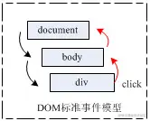
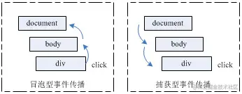
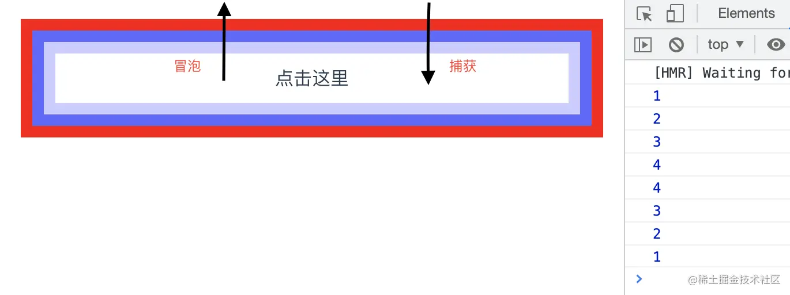

+++
title = "vue事件处理"
date = '2024-10-05T00:00:00+08:00'
lastmod = '2024-12-15T00:00:00+08:00'
draft = true
weight = 12
tags = ["面试", "前端", "Vue", "vue事件处理", "ecool"]
categories = ["前端开发", "面试"]
source = "https://fe.ecool.fun/knowledge-learn"
+++
## 一、DOM 事件流

想必看过《红宝书》的前端 er 对标题都不会特别陌生，我们来看看定义：当一个 HTML 元素产生一个事件时，该事件会在树形结构的 DOM 上面沿着元素节点路径进行传播，事件所经过的路径结点都会收到该事件，这个传播过程可称为 **DOM 事件流**。



## 二、DOM 事件流模型

DOM 事件流分为 **捕获型事件流** 和 **冒泡型事件流**。两种事件流分别对应三阶段 DOM 事件流模型中的捕获阶段和冒泡阶段：

1. **捕获**阶段：事件从最外面的祖先节点依次传递到最里面的后代节点
2. 目标阶段：真正的目标节点正在处理事件的阶段
3. **冒泡**阶段：事件又从最里面的后代节点逐层传出到最外面的祖先节点



## 三、Vue 之事件处理

Vue 中提供了事件绑定的语法糖，我们可以很简单地在标签中直接使用 `@click="handleClick($event)"` 就可以绑定点击事件。

而且在 Vue 里面，**Vue 的事件触发默认为冒泡过程监听**，意思就是上面 `@click="handleClick($event)"` 中点击事件的执行是冒泡过程触发的。

## 四、Vue 之事件修饰符

### 4.1 `.capture`

> 捕获监听器

```html
<div @click="log(1)" @click.capture="log(1)" style="background-color: #00f">
  <div @click="log(2)" @click.capture="log(2)" style="background-color: #66f">
    <div @click="log(3)" @click.capture="log(3)" style="background-color: #ccf">
      <div @click="log(4)" @click.capture="log(4)" style="background-color: #fff">
        点击这里
      </div>
    </div>
  </div>
</div>
```

控制台打印结果为：`1 2 3 4 4 3 2 1`



符合 DOM 事件流模型，先捕获后冒泡，`.capture` 的作用就是在捕获阶段触发事件。

### 4.2 `.stop`

> 阻止事件传递

```html
<div @click="log(1)" @click.capture="log(1)" style="background-color: #00f">
  <div @click="log(2)" @click.capture="log(2)" style="background-color: #66f">
    <div @click="log(3)" @click.capture.stop="log(3)" style="background-color: #ccf">
      <div @click="log(4)" @click.capture="log(4)" style="background-color: #fff">
        点击这里
      </div>
    </div>
  </div>
</div>
```

控制台打印结果为：`1 2 3`

说明 `.stop` 真正的作用是阻止事件的传递，不仅阻止捕获事件流，也会阻止冒泡事件流。

`.stop` 最常见的应用场景：比如移动端购物车的商品列表，点击商品列表跳转商品详情，商品列表右下角有个删除商品的按钮，点击按钮删除该商品。假设我们正常监听点击事件，当我们点击删除按钮时，触发删除事件，但是由于事件冒泡，稍后触发跳转商品详情的事件。结论就是：在删除按钮监听事件增加 `.stop` 事件修饰符，避免事件传递造成非预期的结果。

### 4.3 `.prevent`

> 阻止默认事件的触发：比如某些 HTML 标签拥有自身的默认事件，如 `a[href="#"]`、`button[type="submit"]` 标签**在冒泡结束后会开始执行默认事件**。**注意默认事件虽然是冒泡后开始，但不会因为 `.stop` 事件修饰符阻止事件传递而停止。**

```html
<div @click="log(1)" @click.capture="log(1)" style="background-color: #00f">
  <div @click="log(2)" @click.capture="log(2)" style="background-color: #66f">
    <div @click="log(3)" @click.capture.stop="log(3)" style="background-color: #ccf">
      <a @click="log(4)" @click.capture="log(4)" href="javascript: console.log('x')"
style="background-color: #fff">
        点击这里
      </a>
    </div>
  </div>
</div>
```

控制台打印结果为：`1 2 3 x`

上例中说明了 `.stop` 事件修饰符无法阻止 `a[href="#"]` 中默认事件的触发。

```html
<!-- 将 .prevent 绑在冒泡阶段 -->
<div @click="log(1)" @click.capture="log(1)" style="background-color: #00f">
  <div @click="log(2)" @click.capture="log(2)" style="background-color: #66f">
    <div @click="log(3)" @click.capture="log(3)" style="background-color: #ccf">
      <a @click.prevent="log(4)" @click.capture="log(4)" href="javascript: console.log('x')"
style="background-color: #fff">
        点击这里
      </a>
    </div>
  </div>
</div>

<!-- 将 .prevent 绑在捕获阶段 -->
<div @click="log(1)" @click.capture="log(1)" style="background-color: #00f">
  <div @click="log(2)" @click.capture="log(2)" style="background-color: #66f">
    <div @click="log(3)" @click.capture="log(3)" style="background-color: #ccf">
      <a @click="log(4)" @click.capture.prevent="log(4)" href="javascript: console.log('x')"
style="background-color: #fff">
        点击这里
      </a>
    </div>
  </div>
</div>
```

控制台打印结果为：`1 2 3 4 4 3 2 1`

上述两例证明，无论是在冒泡阶段阻止默认事件还是在捕获阶段阻止默认事件，结果都是一样的。

### 4.4 `.passive`

> 不阻止默认事件的触发：浏览器只有等内核线程执行到事件监听器对应的 JavaScript 代码时，才能知道内部是否会调用 preventDefault 函数来阻止事件的默认行为，所以浏览器本身是没有办法对这种场景进行优化的。这种场景下，用户的手势事件无法快速产生，会导致页面无法快速执行滑动逻辑，从而让用户感觉到页面卡顿。（**通俗点说就是每次事件产生，浏览器都会去查询一下是否有 preventDefault 阻止该次事件的默认动作。我们加上 passive 就是为了告诉浏览器，不用查询了，我们没用 preventDefault 阻止默认动作。**）

应用场景：一般用在滚动监听 `@scoll`、`@touchmove`，因为滚动监听过程中移动每个像素都会产生一次事件，每次都使用内核线程查询 prevent 会使滑动卡顿。我们通过 passive 将内核线程查询跳过，可以大大提升滑动的流畅度。

**注：passive 和 prevent 冲突，不能同时绑定在一个监听器上。**

### 4.5 `.self`

> 只有点击元素本身的时候才会触发这个元素的事件。

```html
<div @click="log(1)" @click.capture="log(1)" style="background-color: #00f">
  <div @click="log(2)" @click.capture.self="log(2)" style="background-color: #66f">
    <div @click.self="log(3)" @click.capture="log(3)" style="background-color: #ccf">
      <a @click="log(4)" @click.capture="log(4)" href="javascript: console.log('x')"
style="background-color: #fff">
        点击这里
      </a>
    </div>
  </div>
</div>
```

- 点击 a 标签控制台打印结果为：`1 3 4 4 2 1 x`
- 点击 3 图层控制台打印结果为：`1 3 3 2 1`

```html
<div @click="log(1)" @click.capture="log(1)" style="background-color: #00f">
  <div @click="log(2)" @click.capture="log(2)" style="background-color: #66f">
    <div @click="log(3)" @click.capture="log(3)" style="background-color: #ccf">
      <a @click.prevent.self="log(4)" @click.capturet="log(4)" href="javascript: console.log('x')"
style="background-color: #fff">
        点击这里
        <div style="background-color: #ccc">5</div>
      </a>
    </div>
  </div>
</div>
```

- 点击 a 标签控制台打印结果为：`1 2 3 4 4 3 2 1`
- 点击 5 图层控制台打印结果为：`1 3 4 3 2 1`

```html
<div @click="log(1)" @click.capture="log(1)" style="background-color: #00f">
  <div @click="log(2)" @click.capture="log(2)" style="background-color: #66f">
    <div @click="log(3)" @click.capture="log(3)" style="background-color: #ccf">
      <a @click.self.prevent="log(4)" @click.capture="log(4)" href="javascript: console.log('x')"
style="background-color: #fff">
        点击这里
        <div style="background-color: #ccc">5</div>
      </a>
    </div>
  </div>
</div>
```

- 点击 a 标签控制台打印结果为：`1 2 3 4 4 3 2 1`
- 点击 5 图层控制台打印结果为：`1 2 3 4 3 2 1 x`（x 在最后是由于默认事件在冒泡结束之后执行）

**注：self 写在 prevent 前时，prevent 会被 self 影响。直接点击这个目标时才会触发 prevent。因为 self 拦截住了监听，后面的 prevent 也一起失效了。**

### 4.6 `.native`

> 原型绑定：只有使用 vue 组件才会用到该修饰符。

`<el-input @click.native="">` 相当于把事件绑定在 `input[class="el-input__inner"]` 上。

### 4.7 `.once`

> 使得元素的事件只触发一次。

绑定 `.once` 的监听器只会触发一次，在第一次触发后该监听器会被移除。

## 常见考点

### **1. 事件绑定的基本用法**

#### **问题：**

1. 在 Vue 中如何绑定事件处理函数？语法是什么？
2. `v-on` 指令如何使用？简述其作用和语法。

#### **考察点：**

-  **事件绑定**：<br>
  - 使用 `v-on` 绑定事件：`v-on:event="method"`, 其中 `event` 是事件类型，`method` 是方法名称。
  - 简写方式：`@event="method"`，等同于 `v-on:event="method"`。<br>
```vue
<button v-on:click="handleClick">Click Me</button>
<button @click="handleClick">Click Me</button>
```
-  **事件处理方法**：<br>
  - 事件处理方法可以在 `methods` 中定义。<br>
```vue
methods: {
  handleClick() {
    console.log('Button clicked');
  }
}
```

---

### **2. 事件修饰符**

#### **问题：**

1. Vue 中有哪些常用的事件修饰符？它们分别有什么作用？
2. 如何阻止事件传播或防止默认事件？

#### **考察点：**

- **事件修饰符**：<br>
  - **`.stop`**：阻止事件冒泡（`event.stopPropagation()`）。<br>
```vue
<button @click.stop="handleClick">Click Me</button>
```
  - **`.prevent`**：调用 `event.preventDefault()` 来阻止默认事件（例如表单提交）。<br>
```vue
<form @submit.prevent="handleSubmit">Submit</form>
```
  - **`.capture`**：在捕获阶段触发事件，而不是冒泡阶段。<br>
```vue
<button @click.capture="handleClick">Click Me</button>
```
  - **`.once`**：只触发一次事件，然后移除事件监听器。<br>
```vue
<button @click.once="handleClick">Click Me</button>
```
  - **`.self`**：仅当事件源是当前元素时才触发事件。<br>
```vue
<button @click.self="handleClick">Click Me</button>
```
  - **`.passive`**：表示该事件处理函数不会调用 `event.preventDefault()`，提高性能。<br>
```vue
<button @scroll.passive="handleScroll">Scroll</button>
```

---

### **3. 方法参数**

#### **问题：**

1. 如何在事件处理函数中传递自定义参数？
2. `v-on` 中的 `$event` 是什么？如何使用？

#### **考察点：**

-  **传递参数**：<br>
  - 可以通过箭头函数或方法引用的方式传递自定义参数：<br>
```vue
<button @click="handleClick('Hello')">Click Me</button>
methods: {
  handleClick(message) {
    console.log(message);  // 输出 'Hello'
  }
}
```
-  **使用 `$event`**：<br>
  - `$event` 是 Vue 自动传递给事件处理函数的原生事件对象，可以用来访问事件的详细信息：<br>
```vue
<button @click="handleClick($event)">Click Me</button>
methods: {
  handleClick(event) {
    console.log(event);  // 输出原生的 JavaScript 事件对象
  }
}
```

---

### **4. 事件委托**

#### **问题：**

1. Vue 中如何进行事件委托？是否需要手动绑定事件监听？
2. 如何处理动态生成的元素上的事件绑定？

#### **考察点：**

-  **事件委托**：<br>
  - Vue 内部已经为你处理了事件委托，通常不需要手动绑定事件监听器。如果你通过 `v-for` 动态渲染元素，Vue 会自动为这些元素绑定事件。<br>
```vue
<ul>
  <li v-for="item in items" :key="item.id" @click="handleClick(item)">Click {{ item.name }}</li>
</ul>
```
-  **动态元素的事件处理**：<br>
  - 动态渲染的元素会自动响应事件，无需额外的事件委托。Vue 会将事件绑定到新创建的 DOM 元素上。

---

### **5. 自定义事件**

#### **问题：**

1. 如何在 Vue 中触发和监听自定义事件？
2. 在组件之间进行事件通信时，如何使用 `$emit` 和 `$on`？

#### **考察点：**

-  **触发自定义事件**：<br>
  - 子组件可以通过 `$emit` 触发自定义事件，父组件通过 `v-on` 监听。<br>
```vue
<!-- 子组件 -->
<button @click="notifyParent">Click</button>
methods: {
  notifyParent() {
    this.$emit('customEvent', 'Hello from child');
  }
}

<!-- 父组件 -->
<child-component @customEvent="handleCustomEvent" />
methods: {
  handleCustomEvent(message) {
    console.log(message);  // 输出 'Hello from child'
  }
}
```
-  **组件间通信**：<br>
  - 子组件触发的自定义事件会通过 `$emit` 向父组件传递，可以传递多个参数。
  - 在 Vue 3 中，`$on` 方法不再使用，取而代之的是使用 `v-on` 来绑定事件。

---

### **6. 防抖与节流**

#### **问题：**

1. Vue 如何实现事件的防抖和节流？
2. 如何优化频繁触发的事件处理，如滚动、resize 等？

#### **考察点：**

-  **防抖（Debouncing）**：<br>
  - 防抖是指在事件触发后的延迟一段时间才执行事件处理程序，避免频繁调用。
  - 可以使用第三方库如 `lodash.debounce` 或手动实现防抖逻辑。<br>
```vue
<input @input="debouncedInput" />
methods: {
  debouncedInput: _.debounce(function() {
    console.log('Input triggered');
  }, 300)
}
```
-  **节流（Throttling）**：<br>
  - 节流是指在固定时间间隔内只执行一次事件处理函数，避免频繁执行。
  - 同样可以使用 `lodash.throttle` 或自己实现节流功能。<br>
```vue
<div @scroll="throttledScroll">Scroll</div>
methods: {
  throttledScroll: _.throttle(function() {
    console.log('Scrolling');
  }, 200)
}
```

---

### **7. 异步事件处理**

#### **问题：**

1. Vue 中事件处理是同步还是异步的？如何处理异步操作？
2. 事件处理函数中的异步操作会有什么影响？

#### **考察点：**

-  **异步操作**：<br>
  - Vue 事件处理默认是同步的，意味着所有事件处理函数会按顺序执行。如果事件处理涉及异步操作（如 API 请求），则会导致界面延迟更新。
  - 异步操作通常通过 `setTimeout`、`Promise` 或 `async/await` 实现。<br>
```vue
<button @click="handleClick">Click Me</button>
methods: {
  async handleClick() {
    const result = await fetchData();
    console.log(result);
  }
}
```
-  **影响**：<br>
  - 异步操作可能会导致事件处理函数的执行顺序不确定，因此需要保证异步操作的顺序或依赖关系。

---

### **8. 事件总线**

#### **问题：**

1. Vue 中如何使用事件总线进行跨组件通信？
2. 在 Vue 3 中，事件总线是否有变化？

#### **考察点：**

-  **事件总线（Event Bus）**：<br>
  - 在 Vue 2 中，事件总线通常是一个空的 Vue 实例，可以用来实现跨组件的事件通信。<br>
```javascript
const bus = new Vue();
bus.$emit('event', data);
bus.$on('event', callback);
```
-  **Vue 3 的变化**：<br>
  - Vue 3 中没有事件总线的支持，推荐使用 **`provide`/`inject`** 或 **Vuex** 进行组件间的状态共享和事件通信。

---

### **总结**

Vue 的事件处理涉及事件绑定、事件修饰符、事件传递、性能优化等多个方面。面试时可以考察候选人对这些概念的理解以及在实际开发中如何处理事件相关的场景和问题，如防抖、节流、异步处理等。同时，考察候选人在组件间通信、事件总线等方面的应用和优化思路。
