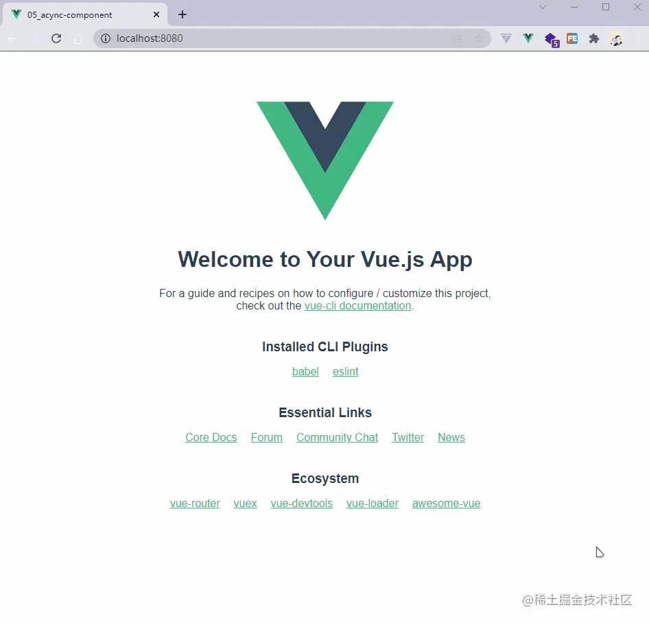

+++
title = "异步组件"
date = '2024-10-05T00:00:00+08:00'
lastmod = '2024-12-15T00:00:00+08:00'
draft = true
weight = 17
tags = ["面试", "前端", "Vue", "异步组件", "ecool"]
categories = ["前端开发", "面试"]
source = "https://fe.ecool.fun/knowledge-learn"
+++
当我们的项目达到一定的规模时，对于某些组件来说，我们并不希望一开始全部加载，而是需要的时候进行加载；这样的做得目的可以很好的提高用户体验。

为了实现这个功能，Vue3中为我们提供了一个方法，即`defineAsyncComponent`，这个方法可以传递两种类型的参数，分别是函数类型和对象类型，接下来我们分别学习。

## 传递工厂函数作为参数

`defineAsyncComponent`方法接收一个工厂函数是它的基本用法，这个工厂函数必须返回一个`Promise`，`Promise`的`resolve`应该返回一个组件。

我们这里以Vue Cli创建的项目为例，这里我稍微做了一下修改，将头部的图片拆分为一个组件，代码如下：

```javascript
<template>
  <logo-img />
  <hello-world msg="Welcome to Your Vue.js App" />
</template>

<script setup>
import LogoImg from './components/LogoImg.vue'
import HelloWorld from './components/HelloWorld.vue'
</script>
```

现在我们就将`<hello-world>`组件修改为异步组件，示例代码如下：

```javascript
<template>
  <logo-img />
  <hello-world msg="Welcome to Your Vue.js App" />
</template>

<script setup>
import { defineAsyncComponent } from 'vue'
import LogoImg from './components/LogoImg.vue'

// 简单用法
const HelloWorld = defineAsyncComponent(() =>
  import('./components/HelloWorld.vue'),
)
</script>
```

我们这里为了看到效果，将`import`延迟执行，示例代码如下：

```javascript
<script setup>
import { defineAsyncComponent } from 'vue'
import LogoImg from './components/LogoImg.vue'

// 定义一个耗时执行的函数，t 表示延迟的时间， callback 表示需要执行的函数，可选
const time = (t, callback = () => {}) => {
  return new Promise(resolve => {
    setTimeout(() => {
      callback()
      resolve()
    }, t)
  })
}
// 定义异步组件，这里这样写是为了查看效果
const HelloWorld = defineAsyncComponent(() => {
  return new Promise((resolve, reject) => {
    ;(async function () {
      try {
        await time(2000)
        const res = await import('./components/HelloWorld.vue')
        resolve(res)
      } catch (error) {
        reject(error)
      }
    })()
  })
})
</script>
```

代码运行结果如下所示：


当2s后才会加载`<hello-world>`组件。

## 传递对象类型作为参数

`defineAsyncComponent`方法也可以接收一个对象作为参数，该对象中有如下几个参数：

- `loader`：同工厂函数；
- `loadingComponent`：加载异步组件时展示的组件；
- `errorComponent`：加载组件失败时展示的组件；
- `delay`：显示`loadingComponent`之前的延迟时间，单位毫秒，默认200毫秒；
- `timeout`：如果提供了`timeout`，并且加载组件的时间超过了设定值，将显示错误组件，默认值为`Infinity`（单位毫秒）；
- `suspensible`：异步组件可以退出`<Suspense>`控制，并始终控制自己的加载状态。
- `onError`：一个函数，该函数包含4个参数，分别是`error`、`retry`、`fail`和`attempts`，这4个参数分别是错误对象、重新加载的函数、加载程序结束的函数、已经重试的次数。

如下代码展示`defineAsyncComponent`方法的对象类型参数的用法：

```javascript
<template>
  <logo-img />
  <hello-world msg="Welcome to Your Vue.js App" />
</template>

<script setup>
import { defineAsyncComponent } from 'vue'
import LogoImg from './components/LogoImg.vue'
import LoadingComponent from './components/loading.vue'
import ErrorComponent from './components/error.vue'

// 定义一个耗时执行的函数，t 表示延迟的时间， callback 表示需要执行的函数，可选
const time = (t, callback = () => {}) => {
  return new Promise(resolve => {
    setTimeout(() => {
      callback()
      resolve()
    }, t)
  })
}
// 记录加载次数
let count = 0
const HelloWorld = defineAsyncComponent({
  // 工厂函数
  loader: () => {
    return new Promise((resolve, reject) => {
      ;(async function () {
        await time(300)
        const res = await import('./components/HelloWorld.vue')
        if (++count < 3) {
          // 前两次加载手动设置加载失败
          reject(res)
        } else {
          // 大于3次成功
          resolve(res)
        }
      })()
    })
  },
  loadingComponent: LoadingComponent,
  errorComponent: ErrorComponent,
  delay: 0,
  timeout: 1000,
  suspensible: false,
  onError(error, retry, fail, attempts) {
    // 注意，retry/fail 就像 promise 的 resolve/reject 一样：
    // 必须调用其中一个才能继续错误处理。
    if (attempts < 3) {
      // 请求发生错误时重试，最多可尝试 3 次
      console.log(attempts)
      retry()
    } else {
      fail()
    }
  },
})
</script>
```

上面的代码中，我们加载组件时前两次会请求错误，只有第三次加载才会成功，代码运行结果如下：



如果加载失败则会展示`ErrorComponent`组件。

## 常见考点

### **1. 基本概念与使用方式**

#### **问题：**

1. 什么是 Vue 中的异步组件？你如何在 Vue 中定义异步组件？
2. 使用异步组件有什么好处？

#### **考察点：**

-  **基本概念**： 异步组件是一种按需加载的组件。在 Vue 中，异步组件通常是通过动态导入语法（`import()`）来实现的，只有在该组件被实际需要渲染时才会被加载。
-  **定义异步组件**： 使用 `Vue.component` 或在路由配置中通过 `component` 定义异步组件，通常是通过返回一个动态导入的 Promise 来实现：<br>
```javascript
const AsyncComponent = () => import('./AsyncComponent.vue');
```
-  **示例**：<br>
```javascript
const AsyncComponent = () => import('./AsyncComponent.vue');
export default {
  components: {
    AsyncComponent
  }
}
```
-  **好处**：<br>
  - **减少首屏加载时间**：将部分不必要的组件推迟加载，有助于提升首屏渲染速度。
  - **按需加载**：用户访问不同的页面时，只有在需要时才加载对应的组件，避免一次性加载过多内容。
  - **提升性能**：通过懒加载大组件，减少初始加载的资源大小，提升用户体验。

---

### **2. 异步组件的加载过程**

#### **问题：**

1. Vue 中的异步组件是如何工作的？它如何实现懒加载？
2. 在使用异步组件时，如果加载失败，Vue 会如何处理？

#### **考察点：**

-  **工作原理**： 当页面渲染到异步组件时，Vue 会触发该组件的动态导入。这个操作是通过 `import()` 实现的，它返回一个 `Promise`，当这个 `Promise` 被解析时，组件会被加载并渲染。  `import()` 返回的 `Promise` 会在加载完成后解析，解析结果就是加载的组件，Vue 会在该组件需要渲染时进行加载。
```javascript
const AsyncComponent = () => import('./AsyncComponent.vue');
```
-  **加载失败的处理**： 如果异步组件的加载失败，通常可以通过 `Promise` 的 `catch` 方法来处理错误。Vue 提供了 `error` 选项来捕获加载失败的情况，并可以展示一个备用组件或提示信息。  另外，Vue 提供了 `loading` 和 `error` 属性用于处理加载过程中和加载失败时的状态：<br>
```javascript
const AsyncComponent = () => import('./AsyncComponent.vue').catch(() => import('./ErrorComponent.vue'));
```
```javascript
const AsyncComponent = () => ({
  component: import('./AsyncComponent.vue'),
  loading: LoadingComponent,
  error: ErrorComponent,
  delay: 200,  // 延迟200ms后显示 loading 组件
  timeout: 3000  // 超过3秒还没加载完成显示 error 组件
});
```

---

### **3. 异步组件的性能优化**

#### **问题：**

1. 如何优化异步组件的加载性能？可以使用哪些策略？
2. 在多个异步组件的情况下，如何确保它们高效加载？

#### **考察点：**

-  **懒加载与拆分**： 通过按需加载和拆分大型组件，可以减少初始页面加载的资源量。例如，对于一个大页面，可以把页面拆分成多个异步组件，只有在需要渲染时才加载。
-  **缓存与预加载**： 如果你知道某个组件即将被使用，可以使用 Vue 的 `preload` 或 `prefetch` 来提前加载。`prefetch` 是一种告诉浏览器在空闲时加载资源的策略，这有助于提升组件加载的速度。<br>
```javascript
const AsyncComponent = () => ({
  component: import('./AsyncComponent.vue'),
  loading: LoadingComponent,
  error: ErrorComponent,
  delay: 200,
  timeout: 3000,
  prefetch: true  // 预加载
});
```
-  **使用 Webpack 的代码分割**： 使用 Webpack 时，动态导入会自动分割代码，使得组件在需要时才会被加载到浏览器中。通过设置合理的 chunk 配置，可以更好地管理资源加载。  这会将该组件单独分割为一个 `async-component.js` 文件。
```javascript
const AsyncComponent = () => import(/* webpackChunkName: "async-component" */ './AsyncComponent.vue');
```
-  **异步组件与路由懒加载结合**： Vue Router 支持懒加载路由组件，可以与异步组件结合，在路由切换时按需加载组件。<br>
```javascript
const routes = [
  {
    path: '/about',
    component: () => import('./About.vue')  // 异步加载 About 组件
  }
];
```

---

### **4. 与 Vue Router 的结合**

#### **问题：**

1. 在 Vue Router 中，如何使用异步组件？
2. 路由懒加载与异步组件的关系是什么？

#### **考察点：**

-  **路由懒加载**： 在 Vue Router 中，异步组件通常与路由懒加载一起使用。通过动态导入的方式，当用户访问某个路由时，只有相关的组件才会被加载。<br>
```javascript
const routes = [
  {
    path: '/home',
    component: () => import('./Home.vue')  // 路由懒加载
  }
];
```
-  **加载提示**： 可以在路由懒加载的过程中添加加载提示，常见的做法是在加载时展示一个 loading 组件，加载完成后展示目标组件。

---

### **5. 与其他异步机制的区别**

#### **问题：**

1. 异步组件和 `Promise`、`setTimeout` 等异步机制有什么区别？为什么 `import()` 会作为异步组件的实现方式？
2. 你如何选择使用异步组件、动态导入、`Promise` 或其他异步机制？

#### **考察点：**

-  **`import()` 与其他异步机制**：<br>
  - `import()` 是 ES6 的语法，返回一个 `Promise`，它支持模块化的按需加载，并且是静态导入的延伸。
  - 相较于 `setTimeout` 等传统异步机制，`import()` 具有更高的语义清晰度，表示按需加载模块，并且与 JavaScript 的模块系统兼容。
-  **选择异步机制**：<br>
  - 对于大部分组件，尤其是大型应用中的部分组件，使用异步组件的方式可以显著提升页面性能。
  - 对于一些小的、需要提前加载的组件，使用普通的同步加载即可。

---

### **总结**

异步组件在 Vue 中是非常有用的优化工具，允许按需加载组件，从而显著提高应用性能。通过结合动态导入、Vue Router 的懒加载和合适的预加载策略，可以实现高效的资源管理和加载过程。在面试中，关于异步组件的考察通常会涉及其工作原理、加载失败处理、性能优化策略，以及与 Vue Router 的结合使用等方面。
