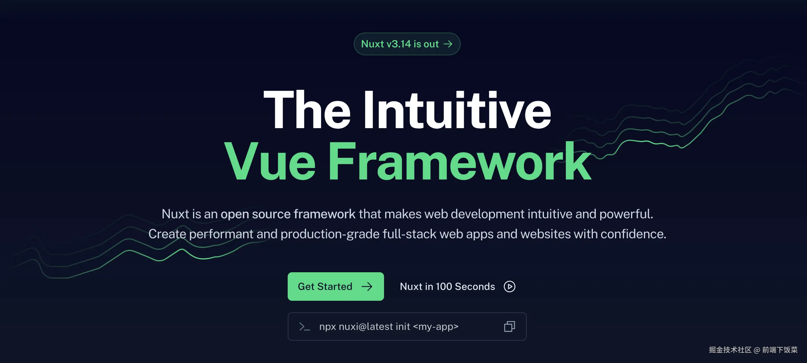
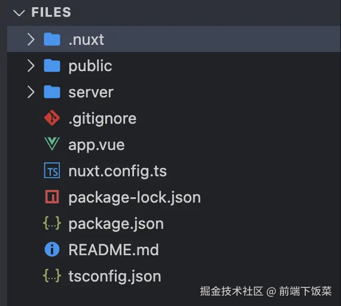
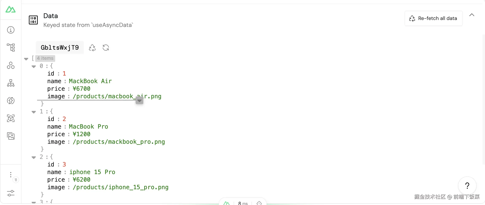
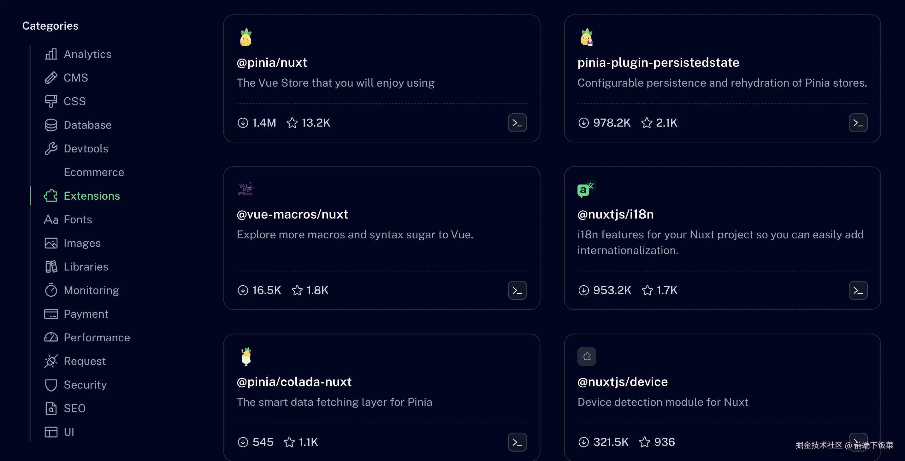
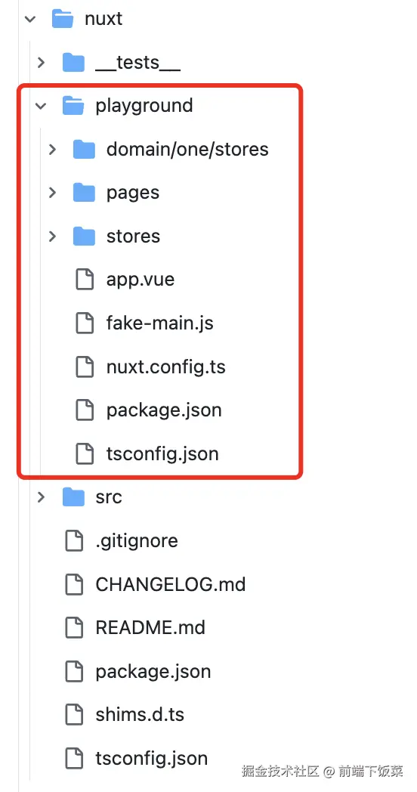
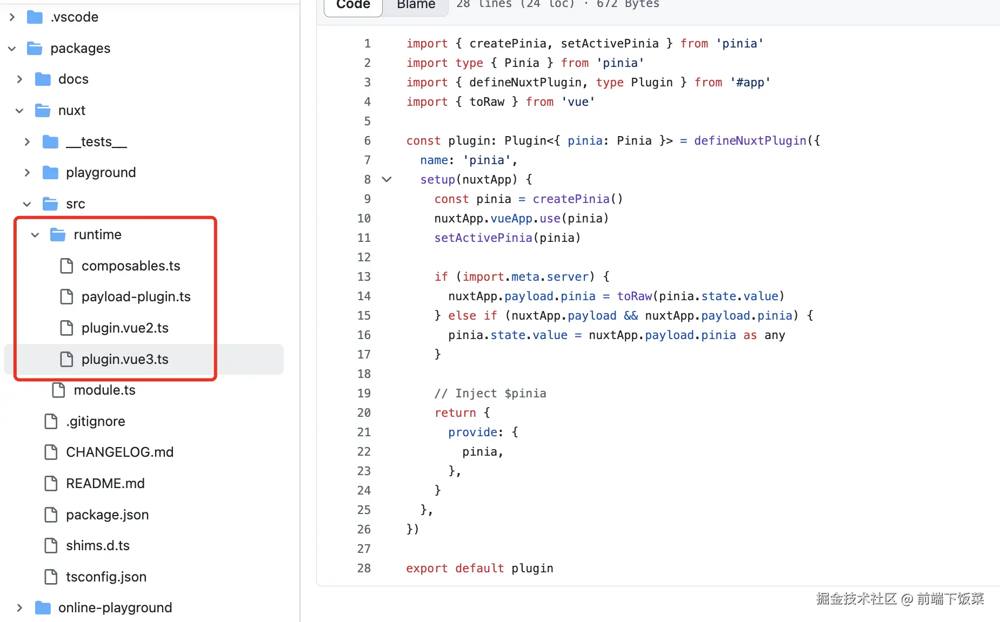

+++
title = "服务器渲染"
date = '2024-10-05T00:00:00+08:00'
lastmod = '2024-12-17T00:00:00+08:00'
draft = true
weight = 20
tags = ["面试", "前端", "Vue", "服务器渲染", "ecool"]
categories = ["前端开发", "面试"]
source = "https://fe.ecool.fun/knowledge-learn"
+++
## 前言

什么是SSR(Server-Side Rendering)？类似于用Java、ASP.NET、php开发前端页面，服务端准备数据并执行页面渲染，然后把完整的HTML发送给客户端。现代化的SSR通常和Vue、React等前端框架强关联，通过Node.js在服务端提前将page、component使用同构方式渲染为html代码，其目的是在实现SSR时尽量复用一套渲染机制。例如Vue框架就同时支持了CSR(Client-Side Rendering)和SSR。

SSR能解决什么问题？

-  SEO: `Google`、`百度`、`Yandex`、`Bing`或者`Yahoo`等搜索引擎会通过网络爬取你的页面并建立索引，如果的信息越完整，那么你的网站就更容易被检索到。使用SSR技术，让页面在服务端提前渲染好再返回给客户端，这样各类搜索引擎就能拿到比较完整的页面信息，提升检索质量。 
-  首屏渲染：SPA(Single Page Application)将页面渲染放到客户端执行，并且在渲染之前要加载大量的Javascript代码，所以首屏渲染需要花费较长时间。而SSR直接在服务端渲染完再返回客户端，使用户能够快速看到页面内容。 

**有哪些框架支持SSR？**

| 开源库 | 支持语言 | star数 | 描述 |
| --- | --- | --- | --- |
| [Nuxt](https://github.com/nuxt/nuxt) | Vue | 54.9k | 快速构架、类型安全、高性能、易扩展 |
| [Next](https://github.com/vercel/next.js) | React | 127k | 老牌框架、社区完善、Data Fetch、Styling |
| [quasar](https://quasar.dev/) | Vue | 26k | 丰富的UI、支持桌面端和移动端 |
| [Remix](https://remix.run/) | React | 29.9k | 极致的用户体验、开箱即用 |

本知识点将以 Nuxt 为例，介绍如何实现 SSR。

## 什么是Nuxt



基于Vue、React、Angular实现的`full-stack`框架数不胜数，但就Vue框架领域内，应该数Nuxt最为Top 1。Nuxt保持了`Vue`生态的`“开箱即用”`特性，类似于Vite，几条指令就可直接run起来。如果你熟悉Vue，那么基于Nuxt写应用，体验上和写Vue客户端应用极其相似。

Nuxt提前预制了一套目录结构，并自动处理路由、导入、数据获取，开发人员仅需按约定的规则实现页面、组件、数据API即可，极大降低开发人员学习成本。Nuxt的特性可总结为：

- 基于文件的路由: 页面统一添加到`pages/`目录下，例如添加index.vue、about.vue、contact.vue，就可以通过`/`访问首页，通过`/about`返回关于页面；
- 代码分割：得益于Vue的`Virtual Node`，Nuxt根据目录规则提前生成完整的依赖树，这样能够将所有code拆分为最小单元的`chunks`, 从而减少应用初始化加载时间；
- 开箱即用的SSR：Nuxt内部使用Vue的SSR，除了Vue实现SSR、CSR本身的差异，可以像开发CSR的Vue应用一样来开发SSR，降低研发心智负担；
- 自动导入：在实现页面或组件时，不需要像CSR手动导入(`import Card from './Card.Vue'`)依赖，当Nuxt识别到有使用外部组件，bundle过程会自动识别；
- 数据获取工具：提供一套组合式FetchAPI，实现client、server端的同构；
- 配置好的构建工具：**默认使用Vite构建，同时支持Webpack、Rspack**；

Nuxt的架构设计和`vue/core`很相似，将整体功能拆分为独立的package:

- 核心引擎：[nuxt](https://github.com/nuxt/nuxt/tree/main/packages/nuxt)；
- bundlers: 打包器包含`@nuxt/vite-builde`、`nuxt/webpack-builder`、`@nuxt/rspack-builder`；
- 命令行工具：[nuxi](https://github.com/nuxt/nuxt/tree/main/packages/nuxi)；
- 服务端引擎：[nitro](https://github.com/unjs/nitro)；
- 开发套件：[@nuxt/kit](https://github.com/nuxt/nuxt/tree/main/packages/kit)；

## 上手体验

### 初始化项目

使用`nuxi`提供的指令初始化项目：

```kotlin
npx nuxi@latest init nuxt-learn-examples
```

如果安装过程下载失败，可能需要配置hosts:

```auto
185.199.108.133 raw.githubusercontent.com
```

**最新nuxt版本3.14初始化的项目目录比较简单，少了pages、plugins等目录**，入口为`app.vue`：



nuxt默认在`app.vue`中添加了两个demo组件，需要手动删除，并安需添加路由组件:

```xml
<template>
  <NuxtPage />
</template>
```

**如果要使用三方的UI组件，例如`element-ui`，先创建`plugins`目录，并添加`element-ui.ts`**，nuxt框架在构建过程会自动加载plugins目录下的所有插件。

```javascript
import Vue from 'vue'
import Element from 'element-ui'
import locale from 'element-ui/lib/locale/lang/en'

Vue.use(Element, { locale })
```

### 路由

Nuxt基于`Vue-Router`实现路由，区别于CSR路由，使用Nuxt仅需要在pages目录下添加页面，并且支持动态路由。例如新增目录：

```markdown
- pages
    - index.vue
    - about.vue
    - products
        - [id].vue
```

Nuxt会自动将文件转换为`Vue-Router`的路由配置:

```json
{
  "routes": [
    {
      "path": "/index",
      "component": "pages/index.vue"
    },
    {
      "path": "/about",
      "component": "pages/about.vue"
    },
    {
      "path": "/products/:id",
      "component": "pages/products/[id].vue"
    }
  ]
}
```

**Nuxt提供`<NuxtLink>`创建导航连接，例如`<NuxtLink to="/about">关于</NuxtLink>`，当`<NuxtLink>`标签在视图范围内可见，则自动预取链接页面的组件，从而加快导航速度。**

在写SPA页面时，可通过`router.beforeEach((to, from, next) => {}`添加路由验证、拦截。而Nuxt通过路由中间件形式实现路由拦截，在`middleware`目录下添加`auth.ts`文件：

```javascript
export default defineNuxtRouteMiddleware((to, from) => {
  if (isAuthenticated() === false) {
    return navigateTo('/login')
  }
})
```

**`navigationTo`函数重定向到给定的路径，并在服务端发生重定向时设置response code为`302`。 文件名`auth`也会作为中间件的ID，路由对哪些页面生效，需要在页面添加中间件配置，指明需要使用哪些中间件。**

```xml
<script setup lang="ts">
definePageMeta({
  middleware: 'auth'
})
</script>
```

**如果中间件是全局性的，则可以通过添加`global`后缀标示**，例如`setup.global.ts`。

**当有多个中间件被执行时，按什么顺序执行**？nuxt根据文件名按字母进行排序，可通过如下形式排好执行顺序：

```csharp
middleware/
    01.setup.global.ts
    02.analytics.global.ts
    auth.ts
```

**除了通过在middleware目录下添加中间件外，`Nuxt`提供了动态添加中间件方式`addRouteMiddleware`**，例如在插件中添加。

```javascript
export default defineNuxtPlugin(() => {
  addRouteMiddleware('setup', () => {
  }, { global: true })
}
```

### SEO和Meta

`Nuxt`提供了多种设置SEO和head属性的方法，不管是配置或者函数都提供完整的TypeScript支持。

**`useSEOMeta`函数支持通过一个扁平化的Object对象设置SEO相关属性**。

```php
<script setup lang="ts">
useSeoMeta({
  title: '淘贝购物',
  ogTitle: '陶贝购物',
  description: '我是一个购物网站，比淘宝还厉害。',
  ogDescription: '我是一个购物网站，比淘宝还厉害。',
  ogImage: 'https://taobei.com/image.png',
  twitterCard: 'taobei_summary_large_image',
})
</script>
```

除了通过`useSEOMeta`函数设置SEO属性，**`Nuxt`还提供了`<Title>`、`<Base>`、`<NoScript>`、`<Style>`、`<Meta>`、`<Link>`、`<Body>`、`<Html>`和`<Head>`组件可直接在template使用。** 例如在Head组件下添加Title、Meta、Style。

```xml
<script setup lang="ts">
const title = ref('你好，世界')
</script>

<template>
  <div>
    <Head>
      <Title>{{ title }}</Title>
      <Meta name="description" :content="title" />
      <Style type="text/css" children="body { background-color: green; }" />
    </Head>

    <h1>{{ title }}</h1>
  </div>
</template>
```

除了使用组件形式为head添加Meta信息外，还可以使用`useHead`函数设置。例如在app.vue添加：

```ini
<script setup lang="ts">
const description = ref('我的神奇网站。')

useHead({
  meta: [
    { name: 'description', content: description }
  ],
})
</script>
```

如果想引入外部css、字体等资源，也可以通过`useHead`的Link属性设置。

```php
<script setup lang="ts">
useHead({
  link: [
    {
      rel: 'preconnect',
      href: 'https://fonts.googleapis.com'
    },
    {
      rel: 'stylesheet',
      href: 'https://fonts.googleapis.com/css2?family=Roboto&display=swap',
      crossorigin: ''
    }
  ]
})
</script>
```

### 样式使用

在样式化方面，Nuxt 非常灵活。你可以编写自己的样式，或者引用本地和外部样式表。 你可以使用 CSS 预处理器、CSS 框架、UI 库和 Nuxt 模块来为你的应用程序添加样式。

本地编写的样式表，可将其放到`assets`目录下，如果想在组件中引入这些css文件，可通过javascript的import，或者使用css的`@import`语句。

```xml
<script>
import '~/assets/css/first.css'
</script>

<style>
@import url("~/assets/css/second.css");
</style>
```

一些css文件需要全局导入，那么可以在`nuxt.config.ts`文件添加css文件导入。

```arduino
export default defineNuxtConfig({
  css: ['~/assets/css/main.css']
})
```

如果要使用字体文件，可将字体文件放到`public`目录下，例如放到`public/fonts/FarAwayGalaxy.woff`。这样就可以在css样式中使用这些字体了。

```css
// 字体定义
@font-face {
  font-family: 'FarAwayGalaxy';
  src: url('/fonts/FarAwayGalaxy.woff') format('woff');
  font-weight: normal;
  font-style: normal;
  font-display: swap;
}

// 字体使用:
h1 {
  font-family: 'FarAwayGalaxy', sans-serif;
}
```

通过`npm`安装的样式，例如`npm install animate.css`，可直接在组件中使用， 可使用javascript的import或者style的@import方式导入。

```xml
<script>
import 'animate.css'
</script>

<style>
@import url("animate.css");
</style>
```

如果想把`animate.css`添加到全局，上文中有介绍在nuxt.config.ts中导入。

```arduino
export default defineNuxtConfig({
  css: ['animate.css']
})
```

引入三方cdn的css资源，一般会添加到head的link中。添加方式包含静态、动态两种。静态方式为在`nuxt.cofig.ts`的head属性下附加`link`属性，如下述代码所示。

```php
export default defineNuxtConfig({
  app: {
    head: {
      link: [{ rel: 'stylesheet', href: 'https://cdnjs.cloudflare.com/ajax/libs/animate.css/4.1.1/animate.min.css' }]
    }
}})
```

动态方式可使用`useHead`函数添加三方css资源。

```php
useHead({
  link: [{ rel: 'stylesheet', href: 'https://cdnjs.cloudflare.com/ajax/libs/animate.css/4.1.1/animate.min.css' }]
})
```

`Nuxt`框架下，组件使用样式方式和客户端组件类似。

```xml
<script setup lang="ts">
const isActive = ref(true)
const hasError = ref(false)
const classObject = reactive({
  active: true,
  'text-danger': false
})
</script>

<template>
  <div class="static" :class="{ active: isActive, 'text-danger': hasError }"></div>
  <div :class="classObject"></div>
</template>
```

像客户端支持的.scss、.sass、.less、.styl 和 .stylus，`Nuxt`也支持在组件的style标签上设置lang，例如`<style lang="less"></style`。

### 数据获取

Nuxt 提供了两个组合函数和一个内置库，用于在浏览器或服务器环境中执行数据获取：`useFetch`、[`useAsyncData`](https://nuxt.com.cn/docs/api/composables/use-async-data) 和 `$fetch`。

**请求数据为什么需要特定的组合函数？一个组件在服务端、客户端都被执行，通过组合函数能解决服务端、客户端的同构问题，让数据请求在两个端都能正常运行，可避免数据重复请求以及异步加载等问题。**

**解决网络重复请求**

[`useFetch`](https://nuxt.com.cn/docs/api/composables/use-fetch) 和 [`useAsyncData`](https://nuxt.com.cn/docs/api/composables/use-async-data) 组合函数确保一旦在服务器上进行了 API 调用，数据将以有效的方式在负载中传递到客户端。只要服务端执行过`useFetch`、`useAsyncData`函数，则其结果将被序列化传送给客户端，而客户端通过`useNuxtApp().payload`访问这些数据。

使用 [Nuxt DevTools](https://devtools.nuxt.com/) 在 **Payload 选项卡** 中检查此数据。



**解决数据请求和界面交互同步**

组件支持`top level`方式请求数据，例如直接在script下使用useFetch获取数据，并且一个页面下可能有多个组件都会请求数据，那何时界面可交互？Nuxt 在底层使用 Vue 的 [`<Suspense>`](https://vuejs.org/guide/built-ins/suspense) 组件防止在数据请求完成前进行交互、导航。

```xml
<script setup lang="ts">
const { data: count } = await useFetch('/api/count')
</script>

<template>
  页面访问量：{{ count }}
</template>
```

**$ofetch**

Nuxt 包括了 `ofetch` 库，并且作为全局别名 `$fetch` 自动导入到应用程序中。它是 `useFetch` 在幕后使用的工具。

`ofetch` 库是基于 [Fetch API](https://developer.mozilla.org/en-US/docs/Web/API/Fetch_API/Using_Fetch) 构建的，并为其添加了便利功能：

- 在浏览器、Node 或 worker 环境中的使用方式相同
- 自动解析响应
- 错误处理
- 自动重试
- 拦截器

什么时候使用`$fetch`？当客户端异步提交数据时，不涉及到页面状态，因此可直接使用$fetch提交数据。

**仅在客户端获取数据**

默认情况下，`useFetch`组合函数在客户端、服务端都会执行，可通过给第二个参数`server:false`关闭服务端的请求。对于首次渲染不需要的数据(如非SEO敏感数据)，可通过设置`lazy: true`让首次渲染不用等待该请求。

```php
/* 此调用仅在客户端执行 */
const { pending, data: posts } = useFetch('/api/comments', {
  lazy: true,
  server: false
})
```

**缓存和重新获取数据**

`useFetch`使用提供的url作为缓存键，也可在最后一个options参数显式指定key作为缓存键。

[`useAsyncData`](https://nuxt.com.cn/docs/api/composables/use-async-data)如果第一个参数是字符串，则将其用作缓存键。如果第一个参数是执行查询的处理函数，则**会为`useAsyncData`的实例生成一个基于文件名和行号的唯一键**。

**`useFetch`将返回的数据转换为响应式，并且提供了手动请求或刷新的方法。**

```xml
<script setup lang="ts">
const { data, error, execute, refresh } = await useFetch('/api/users')
</script>

<template>
  <div>
    <p>{{ data }}</p>
    <button @click="refresh">刷新数据</button>
  </div>
</template>
```

**想要查询条件变化时自动重新请求数据？** 可在options的watch属性指定监听值。

```csharp
const id = ref(1)
const { data, error, refresh } = await useFetch('/api/users', {
  /* 更改id将触发重新获取 */
  watch: [id]
})
```

如果**query的参数变化也自动请求，只要传递的响应式**，则`useFetch`会帮你自动完成监听。

```php
const id = ref(null)
const { data, pending } = useLazyFetch('/api/user', {
  query: {
    user_id: id
  }
})
```

### 状态管理

Nuxt提供了强大的状态管理库和useState组合函数，用于创建响应式且适用于SSR的共享状态。`useState`用于在组件之间创建响应式且适用于SSR的共享状态。

**`useState`的值将在服务端渲染后保留，并在客户端渲染期间进行水合(hydration),其唯一键在多个组件间共享。由于`useState`在服务端渲染后要传递给客户端，需进行序列化，所以像类、函数等不支持共享。**

如何共享？例如在app.vue中使用useState定义了key为counter的state，其他组件可通过`useState('counter')`获取key为counter的state值。

```xml
<script setup lang="ts">
const counter = useState('counter', () => Math.round(Math.random() * 1000))
</script>

<template>
  <div>
    计数器：{{ counter }}
    <button @click="counter++">
      +
    </button>
    <button @click="counter--">
      -
    </button>
  </div>
</template>
```

**如何定义全局状态？**

通过使用**自动导入的组合函数**，我们可以定义全局类型安全的状态并在整个应用程序中导入它们。例如添加`composables/states.ts`文件并附加内容：

```typescript
export const useCounter = () => useState<number>('counter', () => 0)
export const useColor = () => useState<string>('color', () => 'pink')
```

那么服务端在渲染每一个页面时都会加载`states.ts`中的状态，因此可以在组件中直接读取。

```xml
<script setup lang="ts">
const color = useColor() // 与useState('color')相同
</script>

<template>
  <p>当前颜色：{{ color }}</p>
</template>
```

**使用第三方库**

Nuxt与流行的状态库有多种集成方式：

-  pinia    在`nuxt.config.ts`中配置pinia。  配置以后就可以正常使用pinia了，例如新增一个`stores/myStore.ts`文件，添加Store内容：  在组件中使用myStore：  
```css
npm i pinia @pinia/nuxt
```
> 如果你正在使用 npm，你可能会遇到 *ERESOLVE unable to resolve dependency tree* 错误。如果那样的话，将以下内容添加到 `package.json` 中：
```json
"overrides": { 
    "vue": "latest" 
}
```
```arduino
  // Nuxt 3
  export default defineNuxtConfig({
      modules: ['@pinia/nuxt'],
  })
```
```typescript
  import { defineStore } from "pinia";

  interface MyState {
      version: string;
  }

  export const useStore = defineStore<'myStore', MyState>('myStore', { 
      state: () => {
          return {
              version: "1.0"
          }
      }
  })
```
```xml
  <script setup lang="ts">
  import { useStore } from '~/stores/myStore'

  const store = useStore()
  </script>
```

除此之外，`Nuxt`还支持了：

- [Harlem](https://nuxt.com.cn/modules/harlem) - 不可变的全局状态管理库
- [XState](https://nuxt.com.cn/modules/xstate) - 基于状态机的方法，具有可视化和测试状态逻辑的工具

## [](https://nuxt.com.cn/modules/pinia#usage)

## Nuxt功能不够用？使用Module轻松扩展

### 250个Module

一个框架好不好用，功能丰不丰富当属核心考量方面。`Nuxt`通过`Module`机制能够轻松的扩展其功能。到目前`Nuxt`已提供**250个Module**，**800个贡献者**参与。



如果以上的模块还满足不了你的需求，那可以考虑上手写一个Module。**Nuxt的[配置](https://zh.nuxtjs.org/docs/2.x/configuration-glossary/configuration)和[钩子](https://zh.nuxtjs.org/docs/2.x/concepts/nuxt-lifecycle)系统使得可以定制Nuxt的每个方面，并添加任何可能需要的集成（Vue插件、服务器路由、组件、日志记录等）。**

### 扩展自己的Module

`nuxt`命令行工具也提供了`Module`项目快速创建指令。

```arduino
npx nuxi init -t module my-module
```

接着使用`npm run dev:prepare`为项目准备本地文件。

在编写Module时，常常需要一个可运行的程序来测试，而`Nuxt`在创建module项目时默认会为你创建一个`playground`目录，其下就包含了可运行的`Nuxt`程序， 你可以在此基础上添加Module的测试代码。



Module入口文件指定在`src/module.ts`，`Nuxt`提供了多种Module编写方式，但官方推荐使用对象编写方法，并使用`meta`属性来标识你的模块。

```javascript
import { defineNuxtModule } from '@nuxt/kit'

export default defineNuxtModule({
  meta: {
    // 通常是你的模块的npm包名称
    name: '@nuxtjs/example',
    // `nuxt.config`中保存你的模块选项的键
    configKey: 'sample',
    // 兼容性约束
    compatibility: {
      // 支持的Nuxt版本的Semver版本
      nuxt: '^3.0.0'
    }
  },
  // 模块的默认配置选项，也可以是返回这些选项的函数
  defaults: {},
  // 注册Nuxt钩子的简写形式
  hooks: {},
  // 包含模块逻辑的函数，可以是异步的
  setup(moduleOptions, nuxt) {
    // ...
  }
})
```

`meta`为Module的元数据配置信息，核心扩展逻辑包含在`setup`函数中。`Nuxt`的Module几乎可以覆盖`Nuxt`的方方面面功能，例如组件、Composables、插件、路由、中间件等。而Module中添加相关文件需要放到`src/runtime`目录下。

下图左侧为`pinia`实现的`@nuxt/pinia`模块，runtime目录下包含了`composables`和Vue相关的插件。图右侧为Vue3的水合插件 `plugin.vue3.ts`实现代码。



定义了插件和composables，但如何将其添加到`Nuxt`中？参考`@nuxt/pinia`实现的module.ts核心代码， 通过`addPlugin`函数将runtime下定义的插件动态注册到`Nuxt`，通过`addImports`将`dfineStore`、`usePinia`、`storeToRefs`函数自动导入，因此在组件中使用时不需要再手动`import`。

```javascript
const module: NuxtModule<ModuleOptions> = defineNuxtModule<ModuleOptions>({
  ...
  setup(options, nuxt) {
    // configure transpilation
    const { resolve } = createResolver(import.meta.url)
    const runtimeDir = fileURLToPath(new URL('./runtime', import.meta.url))

    // Transpile runtime
    nuxt.options.build.transpile.push(resolve(runtimeDir))

    nuxt.hook('prepare:types', ({ references }) => {
      references.push({ types: '@pinia/nuxt' })
    })

    nuxt.hook('modules:done', () => {
      if (isNuxtMajorVersion(2, nuxt)) {
        addPlugin(resolve(runtimeDir, 'plugin.vue2'))
      } else {
        addPlugin(resolve(runtimeDir, 'plugin.vue3'))
        addPlugin(resolve(runtimeDir, 'payload-plugin'))
      }
    })

    addImports([
      { from: composables, name: 'defineStore' },
      { from: composables, name: 'acceptHMRUpdate' },
      { from: composables, name: 'usePinia' },
      { from: composables, name: 'storeToRefs' },
    ])
  },
})

export default module
```

Module几乎可以覆盖`Nuxt`所有功能，你可以为`Nuxt`添加其支持的任何资源：

- Vue 组件
- Composables
- [Nuxt 插件](https://nuxt.com.cn/docs/guide/directory-structure/plugins)

对于 [服务器引擎](https://nuxt.com.cn/docs/guide/concepts/server-engine) Nitro 来说：

- API 路由
- 中间件
- Nitro 插件

或者任何其他你想要注入到用户的 Nuxt 应用程序中的资源：

- 样式表
- 3D 模型
- 图片
- 等等

## 总结

**`Nuxt`贯彻了`Vue`生态的一贯作风，开箱即用，学习成本低，丰富的生态社区。** 和实现客户端SPA应用类似，`Nuxt`完全复用Vue相关的常用框架，路由使用`Vue-Router`，状态管理使用`Pinia`，UI组件可直接使用`element-ui`等，因此对于习惯了Vue的开发者来说，编写`Nuxt`完全没有心智负担。

**`Nuxt`的核心难点是如何保持服务端和客户端的同构性**。使用pinia创建的store，如果服务端对其进行了设置，那客户端使用时如何能够获取到设置后的值，而不是再重新初始化一次？使用`useFetch`、`useAsyncFetch`获取接口数据后，如何避免客户端重复请求？**`Nuxt`使用的方案都是通过key来标识一次请求，并将请求结果序列化到`payload`中，客户端在读取store、调用`useFetch`时，会先判断`payload`中是否存储有对应的值，有则直接使用。**

一个优秀的框架少不了好的扩展生态，`Nuxt`通过`Module`机制扩展其生态，目前已支持了250个Module。`Module`支持了插件、组件、路由等各个方面的扩展，并且在工程化方面也提供了`nuxi`、[`@nuxt/module-builder`](https://nuxt.com.cn/docs/guide/going-further/modules#nuxtmodule-builder)、[`@nuxt/kit`](https://nuxt.com.cn/docs/guide/going-further/modules#nuxtkit)、[`@nuxt/test-utils`](https://nuxt.com.cn/docs/guide/going-further/modules#nuxttest-utils)等工具。

## 常见考点

### **1. SSR 的基础概念**

#### **问题：**

1. 什么是 SSR？与传统客户端渲染（CSR）有什么区别？
2. SSR 的优点和缺点是什么？

#### **考察点：**

-  **SSR 定义**：  
  - 服务器端渲染是指在服务器上生成 HTML 内容并将其直接发送到浏览器，浏览器解析后呈现页面。
  - 与 CSR 的区别是渲染过程的位置：CSR 在浏览器渲染，SSR 在服务器生成初始页面。
-  **优点**：  
  - 改善 SEO：搜索引擎爬虫可以抓取完整的 HTML 内容。
  - 更快的首屏加载速度：用户可以直接看到预渲染的内容。
  - 更好的分享体验：分享链接时能生成完整的页面快照。
-  **缺点**：  
  - 更高的服务器负载：每个请求都需要服务器生成页面。
  - 更复杂的开发：需要考虑服务器和客户端的协同工作。
  - 调试和部署复杂度增加。

---

### **2. Vue SSR 的核心原理**

#### **问题：**

1. Vue SSR 的工作流程是什么？
2. 为什么需要将 Vue 的组件和状态序列化到 HTML 中？
3. 客户端和服务器端的应用实例有何不同？

#### **考察点：**

-  **工作流程**：  
  1. 在服务器端运行 Vue 实例，根据路由生成 HTML。
  2. HTML 包含渲染好的内容和状态，并发送到客户端。
  3. 客户端接管页面，进行“激活”（hydration），绑定交互逻辑。
-  **序列化状态**：  
  - 在 SSR 中，Vue 的状态（如 Vuex 的 `state`）需要通过 `<script>` 标签嵌入到 HTML 中，供客户端使用：  
```html
<script>window.__INITIAL_STATE__ = { /* state */ }</script>
```
-  **客户端和服务端实例的区别**：  
  - 服务端实例专注于生成 HTML，不能直接操作 DOM。
  - 客户端实例负责挂载到已有的 DOM 上，并补充交互逻辑。

---

### **3. Vue SSR 的实现**

#### **问题：**

1. 如何使用 Vue 提供的 `@vue/server-renderer` 或 `Nuxt.js` 实现 SSR？
2. 服务端渲染需要哪些基本配置？
3. 如何处理路由和数据预取？

#### **考察点：**

-  **基本实现方式**：  
  -  使用 `@vue/server-renderer` 手动搭建 SSR：  
```javascript
import { createSSRApp } from 'vue';
import { renderToString } from '@vue/server-renderer';

const app = createSSRApp({
  template: `<div>Hello, SSR!</div>`
});

renderToString(app).then(html => {
  console.log(html);
});
```
  -  使用 Nuxt.js 快速搭建 SSR 项目：  
```bash
npx create-nuxt-app my-app
```
-  **服务端渲染的配置**：  
  - 路由：基于 Vue Router，确保客户端和服务端的路由一致。
  - 数据预取：在服务端预取数据后，将其传递到客户端。

---

### **4. 数据预取与同步**

#### **问题：**

1. SSR 如何在服务端预取数据？
2. 服务端获取的数据如何传递给客户端？
3. 如何避免客户端与服务端状态不一致？

#### **考察点：**

-  **服务端预取数据**：  
  - 使用 `asyncData` 或在路由守卫中预取数据：  
```javascript
const fetchData = async () => {
  const data = await fetch('api/data');
  return data.json();
};
```
-  **传递状态**：  
  - 使用 `renderToString` 时，将数据注入到 HTML：  
```html
<script>window.__INITIAL_STATE__ = ${JSON.stringify(state)}</script>
```
-  **客户端同步**：  
  - 客户端在挂载时，通过 `window.__INITIAL_STATE__` 初始化状态。

---

### **5. SEO 和性能优化**

#### **问题：**

1. Vue SSR 如何提升 SEO？
2. 如何提高 Vue SSR 的性能？
3. SSR 中如何避免重复渲染和多次数据请求？

#### **考察点：**

-  **SEO 提升**：  
  - 服务端返回的 HTML 包含完整内容，便于爬虫抓取。
  - 配置动态 `meta` 标签（如 `title` 和 `description`）提升页面权重。
-  **性能优化**：  
  - 使用缓存（如 Redis）减少重复渲染。
  - 压缩 HTML 和资源文件。
  - 避免不必要的组件加载，使用按需加载。
-  **避免重复渲染**：  
  - 确保数据预取只在服务端执行，客户端通过传递的状态初始化。

---

### **6. 常见问题及解决方案**

#### **问题：**

1. SSR 项目如何处理第三方库的依赖？
2. 如何解决 SSR 与浏览器特性冲突（如 `window` 或 `document` 不存在）？
3. 什么是闪屏问题？如何解决？

#### **考察点：**

-  **第三方库问题**：  
  - 许多第三方库依赖 DOM，例如操作 `document` 或 `window`，在服务端渲染时可能会报错。
  - 解决方案：在 `mounted` 中引入这些库，确保只在客户端运行。
-  **浏览器特性冲突**：  
  - 在代码中检查环境：  
```javascript
if (typeof window !== 'undefined') {
  // 浏览器相关代码
}
```
-  **闪屏问题**：  
  - 问题：服务端生成的 HTML 和客户端激活过程中样式或内容不一致。
  - 解决方案：确保服务端和客户端使用相同的组件、路由和状态。

---

### **7. Nuxt.js 深入考察**

#### **问题：**

1. Nuxt.js 如何简化 Vue SSR 的实现？
2. Nuxt.js 的 `asyncData` 和 `fetch` 有什么区别？
3. 如何配置 Nuxt.js 的动态路由和 SEO？

#### **考察点：**

-  **简化实现**：  
  - Nuxt.js 提供开箱即用的 SSR 支持，集成了路由、数据预取和打包优化。
-  **`asyncData` 和 `fetch`**：  
  - `asyncData`：在组件渲染前获取数据，用于静态内容。
  - `fetch`：在客户端和服务端均可执行，用于动态内容。
-  **动态路由和 SEO**：  
  - 使用动态路由文件（`pages/_id.vue`）。
  - 在页面中定义 `head` 方法动态配置 meta 信息：  
```javascript
export default {
  head() {
    return {
      title: '动态标题',
      meta: [{ name: 'description', content: '页面描述' }]
    };
  }
};
```

---

### **8. SSR 和静态站点生成（SSG）**

#### **问题：**

1. SSR 与 SSG 有什么区别？
2. 在什么场景下应该选择 SSR 或 SSG？

#### **考察点：**

-  **SSR**：  
  - 每次请求动态生成页面。
  - 适用于需要实时数据的应用，如电商、动态内容。
-  **SSG**：  
  - 在构建时生成静态 HTML 文件，部署到 CDN。
  - 适用于静态内容较多的应用，如博客、文档。
