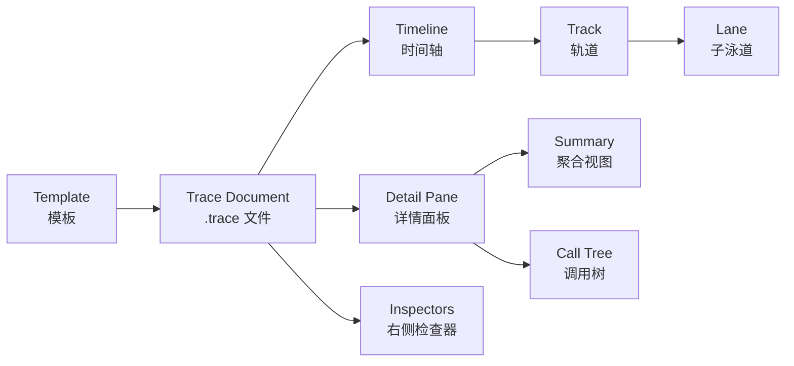
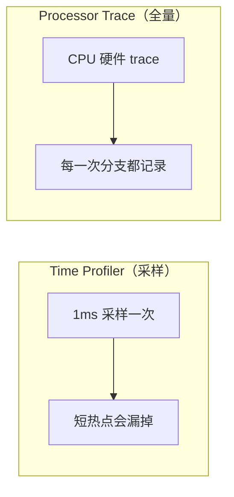
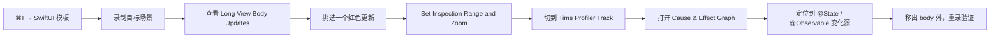

+++
title = "Instruments详解"
date = '2026-05-02T22:32:27+08:00'
draft = false
weight = 1
tags = ["iOS", "面试"]
categories = ["iOS开发", "面试"]
+++
Instruments 是 Xcode 内置的性能分析套件，基于 DTrace/Apple Trace 基础设施构建，可以对 iOS、iPadOS、macOS、watchOS、tvOS、visionOS 的应用与系统进行 CPU、内存、图形、能耗、网络、I/O 等各个维度的观测。

Xcode 26（WWDC25）对 Instruments 做了近年来最大规模的升级，重点包括：

- **Power Profiler**：全新的能耗分析工具，支持 Tethered 与 Passive 两种录制模式。
- **下一代 SwiftUI instrument**：基于 Cause & Effect Graph 可视化状态变更到视图更新的因果链。
- **Processor Trace**：基于 Apple Silicon 硬件特性的"全量指令级"采集（Xcode 16.3 引入，26 完善）。
- **CPU Counters 重做**：引入 Bottleneck Analysis 方法论与 CPU Bottlenecks 模板。
- **Foundation Models instrument**：为 FoundationModels 框架提供 Prompt / Asset Loading / Inference 分阶段观测。
- **Animation Hitches 重做**：修正多显示器场景下的统计，数据量显著减少，处理更快。
- **UI 重设计**：主菜单精简、Settings 页面重写、Track 次级菜单、Launch/Attach 环境变量配置。

---

## 一、Instruments 基础

### 1.1 启动 Instruments 的几种方式

| 方式                                       | 使用场景                                 |
| ---------------------------------------- | ------------------------------------ |
| Xcode `Product → Profile`（⌘I）            | 日常开发，自动以 Release 模式编译并附加符号           |
| Xcode `Debug Navigator` 中的图表             | 粗略观测 CPU / Memory / Disk / Network / Energy |
| 直接打开 `Instruments.app`                   | 对已安装的 App、系统进程或已录制的 `.trace` 文件进行分析 |
| 命令行 `xcrun xctrace record`               | CI / 自动化性能回归                        |
| 设备端 Developer Settings 的 Power Profiler | 离线、无 Mac 场景采集能耗数据                    |

> Xcode 26 中，`Product → Profile` 会按默认 scheme 的 Profile 构建配置（通常是 Release + `-O`），这与 Debug 模式的数据差异很大，做性能评估时必须用 Profile 构建。

### 1.2 Instruments 的 UI 概念



- **Template（模板）**：一组预先配置好的 instrument 集合，例如 Time Profiler、SwiftUI、Leaks 模板。Xcode 26 的模板选择器重绘，搜索与分组更清晰。
- **Instrument（工具）**：最小采集单元，可以自由拖入模板或 `Blank` 模板。
- **Track / Lane**：时间轴上的可视化通道，Lane 表示子通道（如 SwiftUI 的 Update Groups / Long View Body Updates）。
- **Detail Pane**：底部的聚合面板，支持 Summary、Call Tree、Allocations List 等切换。
- **Inspector**：右侧的扩展面板，用于查看 Extended Detail（调用栈）、样本信息、源码等。
- **Heaviest Stack Trace**：某个时间范围内样本最多的调用栈，定位热点的入口。

### 1.3 录制前的关键配置

1. **目标设备**：性能数据必须基于真机，模拟器的 CPU/GPU/功耗模型与真机完全不同。
2. **Release 构建**：Debug 构建会关闭 `-O` 优化并包含 ASan/TSan 代码，样本不可信。
3. **符号化**：保证 Build Settings 的 `DEBUG_INFORMATION_FORMAT` 为 `dwarf-with-dsym`，并在 Profile 时勾选 `Upload dSYMs`（或配置 `-dsym-path`）。
4. **Deferred Display Rendering**：对 UI 相关采集，开启 "Window → Deferred Rendering"，采集过程中 Timeline 不实时刷新，降低观测对运行的影响。
5. **Next Recording 配置**：Xcode 26 将"环境变量 / 启动参数 / 进程过滤"统一放到 "Next Recording" 面板，避免散落在多个位置。

---

## 二、工具全景

Instruments 提供了近 60 个 instrument，下表按功能域做了分类：

| 功能域    | 主要 Instrument                                                                                             | Xcode 26 新增 / 重做                   |
| ------ | --------------------------------------------------------------------------------------------------------- | ---------------------------------- |
| CPU/线程 | Time Profiler、CPU Counters、Processor Trace、System Trace、User Space Sampler                                | CPU Counters（Bottleneck Analysis）  |
| 内存     | Allocations、Leaks、VM Tracker、Zombies                                                                      | —                                  |
| UI/渲染  | SwiftUI、Animation Hitches、Core Animation、Hangs、Metal System Trace                                         | SwiftUI（新版）、Animation Hitches（重做）  |
| 能耗     | Power Profiler、Thermal State                                                                              | Power Profiler（全新）                 |
| 网络/IO  | Network、File Activity                                                                                     | —                                  |
| 并发     | Swift Concurrency、Thread State Trace、Dispatch Queues                                                      | Swift Concurrency 调试增强             |
| AI/ML  | Foundation Models、Core ML                                                                                 | Foundation Models（全新）              |
| 系统     | os_signpost / Points of Interest、App Launch、Logging、Core Data                                             | —                                  |

下面逐个展开。

---

## 三、CPU 与线程工具

### 3.1 Time Profiler（最常用）

- **原理**：周期性采样（默认 1ms / 次）所有运行中线程的调用栈，将样本聚合成"火焰图"与调用树。采样是统计学意义上的热点发现，不保证覆盖每一次调用。
- **适用场景**：
  - 找 CPU 占用最高的函数（大循环、反复解码、正则回溯）。
  - 定位主线程阻塞（通常配合 Hangs 一起看）。
  - 评估算法重构的效果。
- **核心视图**：
  - **Call Tree**：勾选 `Invert Call Tree` 把叶子节点（真正耗 CPU 的函数）顶到最上面。
  - **Hide System Libraries**：只保留自家代码，减少 libsystem 噪声。
  - **Separate by Thread**：按线程拆分，便于识别主线程与后台线程的占比。
- **操作步骤**：
  1. ⌘I 启动 Profile，选 `Time Profiler` 模板。
  2. 进入目标场景，录制 5~15 秒。
  3. 在 Call Tree 中勾选 Invert + Hide System Libraries。
  4. 对热点函数双击进入源码视图，关注 Self Weight（自身耗时）与 Total Weight（含子节点）。
- **局限**：基于采样，短、突发的热点会被漏掉；这也是 Xcode 26 强调 Processor Trace 的原因。

```swift
import os

let poi = OSSignposter(subsystem: "com.app.perf", category: "Feed")

func loadFeed() {
    let state = poi.beginInterval("loadFeed")
    defer { poi.endInterval("loadFeed", state) }

    let items = FeedRepo.fetch()
    DispatchQueue.main.async { self.render(items) }
}
```

在关键代码段埋 `os_signpost`，可以在 Time Profiler 的 Points of Interest 通道里标记"从哪里开始到哪里结束"，大幅降低"找时间范围"的工作量。

### 3.2 Processor Trace（Xcode 16.3+ / 完善于 26）

- **原理**：Apple Silicon 芯片提供硬件级 trace，CPU 直接把"每一次分支、每一次跳转、每一次函数调用"流式输出到文件系统。Instruments 读回这份数据并反汇编，得到指令级精度的执行轨迹。
- **与 Time Profiler 的本质差异**：



- **硬件要求**：M4 及以上 Mac / iPhone 16 及以上 / iPad Pro M4，系统 iOS 18.4+ 或 macOS 15.4+。
- **适用场景**：
  - 微秒级的突发热点（例如 ARC retain/release 风暴、大量 Swift Generic 特化）。
  - 想看到编译器生成的不可见代码（ARC、Embedded Swift 函数头）。
  - 分析 JIT / regex / 密集数学运算。
- **操作要点**：
  - 录制时长控制在几秒以内，否则 trace 文件会到数 GB。
  - 配合 `Average IPC`（Instructions per Clock）查看每条热路径的指令效率。
  - 展开线程的 Execution Flow 通道，可以直接看到每个函数调用的时间占比。
- **常见陷阱**：trace 数据不走网络，必须把设备通过 USB-C 连 Mac；如果 App 在录制停止前退出，可能导致 trace 丢失。

### 3.3 CPU Counters（Xcode 26 重做：Bottleneck Analysis）

- **原理**：读取 CPU 性能计数器（PMU），统计诸如 L1/L2 Cache Miss、分支预测失败、前端取指停顿等硬件事件。
- **Xcode 26 的关键改动**：新增 `CPU Bottlenecks` 模板，把 CPU 可持续带宽分成 4 个宏观类别：

| 类别                  | 含义                                     | 典型原因                         |
| ------------------- | -------------------------------------- | ---------------------------- |
| Useful              | CPU 真正在推进你的代码                          | 健康状态                         |
| Bad Speculation     | 分支预测失败 / 推测执行被抛弃                       | 条件分支过多、switch 大且不规律          |
| Front-End Bound     | 前端取指、译码不够快                             | 指令 Cache Miss、二进制体积过大、冷路径跳转  |
| Back-End Bound      | 后端执行单元 / 内存子系统瓶颈                       | L1/L2/LLC Miss、内存带宽不够、依赖链太长 |

- **适用场景**：
  - Time Profiler 显示函数很热，但找不到具体瓶颈。
  - 微优化（SIMD、Cache 友好布局、内联策略）。
  - 评估重构对硬件利用率的影响。
- **使用流程**：
  1. 选择 `CPU Bottlenecks` 模板，录制目标负载。
  2. 看顶层的 4 大类占比，找到占比最高的那类。
  3. 展开到推荐的子模式（例如 Back-End Bound 下的 L1D Cache Misses）。
  4. 对照代码优化（改数据布局、加预取、减少间接调用）。
  5. 复录对比。
- **提示**：手动配置模式仍然可用，在 Recording Options 中切换。

### 3.4 System Trace

- **采集内容**：线程状态切换（Running / Runnable / Blocked）、系统调用、VM 事件、Thread Events 等。
- **适用场景**：
  - 主线程"空转但不跑代码"：通常是在等锁、等 I/O、等 Mach port。
  - 排查线程饥饿、QoS 倒置（低优先级阻塞高优先级）。
  - 观察 `dispatch_async`、`NSLock`、`os_unfair_lock` 的真实等待时间。
- **关键通道**：
  - **Thread State**：红色 = Blocked，绿色 = Running，黄色 = Runnable but not running。
  - **System Calls**：哪一次 `read`/`write`/`psynch_mutexwait` 慢。
  - **Scheduling Events**：上下文切换次数。

### 3.5 User Space Sampler

- 纯用户态采样，不触发内核介入，开销比 Time Profiler 低。
- 适合长时间录制（数分钟）但仍需要用户空间热点。
- Xcode 26 修复了 `User Space Sampler` 的内存泄漏问题（Release Notes 146506463）。

---

## 四、内存工具

### 4.1 Allocations

- **作用**：记录每一次堆内存分配（`malloc`、`calloc`、Swift `alloc_object`、OC `alloc`），展示存活对象与历史对象。
- **适用场景**：
  - 找峰值内存（Persistent vs Transient）。
  - 定位"对象只增不减"的累积泄漏（非典型泄漏，但内存一路往上走）。
  - 观测某个操作的分配成本。
- **实战配方**：
  - 使用 `Mark Generation`（⌘G）在关键时间点插桩，对比两次 Mark 之间的新增对象。经典用法：进入某页面 → Mark → 返回 → Mark → 再进 → Mark，如果第二、三次 Mark 的"Persistent Count"持续增长，说明有东西没释放。
  - 勾选 `Record Reference Counts` 可以看到每个对象的 retain/release 历史，定位"多 retain 一次"的点。

### 4.2 Leaks

- **作用**：周期性（默认 10s）扫描堆，检测不再可达但仍未释放的对象（真正意义上的内存泄漏）。
- **适用场景**：
  - 闭包循环引用（`[weak self]` 遗漏）。
  - C/C++ 层面的 `malloc` 后忘 `free`。
  - Delegate 被 strong 引用。
- **注意**：Leaks 只能识别"完全不可达的环"，如果泄漏对象仍被单例或全局变量持有（逻辑泄漏），它就抓不到——这种情况需要配合 Allocations 的 Generation 法。

### 4.3 VM Tracker

- **作用**：追踪虚拟内存区域（VM regions），区分 Dirty / Swapped / Resident 等状态。
- **适用场景**：
  - 分析图像缓存、`mmap` 文件、MetalHeap 这类"非 heap 内存"。
  - 优化后台驻留内存（Dirty Memory 决定了 jetsam 概率）。
  - 查看大尺寸图片解码后的 IOSurface 占用。

### 4.4 Zombies

- **作用**：开启 NSZombie 机制，访问已释放的对象时抛出可追踪的异常（EXC_BAD_ACCESS），并保留对象的前世今生。
- **仅适用 OC 对象**：Swift 纯原生对象（非 `NSObject` 子类）不会进入 zombie。
- **必须关闭 ARC 的 `-fobjc-arc-optimizations`？** 不必，现代 ARC + Zombie 模式兼容。

---

## 五、UI 与渲染

### 5.1 SwiftUI Instrument（Xcode 26 全新）

Xcode 26 最重磅的 UI 工具。传统 Time Profiler 很难回答"为什么这个视图更新了 200 次"这种问题，新 SwiftUI instrument 通过 Cause & Effect Graph 直接给出因果链。

**时间轴 Lane 结构**：

| Lane                        | 含义                                           |
| --------------------------- | -------------------------------------------- |
| Update Groups               | SwiftUI 在主线程上做更新工作的区间（空闲期间的 CPU 波动就是非 SwiftUI 引起的）|
| Long View Body Updates      | `body` 属性运行时间过长                              |
| Long Representable Updates  | UIViewRepresentable / UIViewControllerRepresentable 更新过长 |
| Other Long Updates          | 属性动画、preferences、transaction 等其他长更新          |

颜色含义：灰色正常，橙色警告，红色高风险（可能导致 hitch 或 hang）。

**典型工作流**：



**View Body Updates 细节面板**：

- 按模块 / 视图名聚合，列出每个视图的更新次数与总耗时。
- 对某个视图右键 `Show Updates` 可以看到时间序列，定位具体哪一次。
- Xcode 26 新增 `Show View Hierarchy`，直接跳到 Xcode 视图层级中高亮出问题视图。

**Cause & Effect Graph**：Xcode 26 的杀手锏。给定一次更新，反向追溯是哪个 `@State` / `@Observable` 属性变更导致的。如果这次更新只涉及单个状态变化，还会展示该变化的 backtrace（栈），直接定位到 setter 调用处。

**常见优化方向**：

- 把 `body` 内的昂贵计算（排序、格式化、图片解码）移到 `@Observable` 模型的 computed property 或一次性初始化处。
- 用 `.equatable()` 或 `EquatableView` 减少无意义的 diff。
- 用更细粒度的 `@Observable` 拆分，避免大对象变更触发全量重算。
- 配合 `let _ = Self._printChanges()` 辅助验证。

```swift
struct LandmarkListItemView: View, Equatable {
    let landmark: Landmark
    let distance: Measurement<UnitLength>

    static func == (lhs: Self, rhs: Self) -> Bool {
        lhs.landmark.id == rhs.landmark.id && lhs.distance == rhs.distance
    }

    var body: some View {
        HStack {
            Text(landmark.name)
            Spacer()
            Text(distance.formatted())
        }
    }
}
```

> 注意 Xcode 26 的已知问题：如果 App 在录制手动停止前退出，SwiftUI trace 可能丢数据。操作时先停 Instruments 录制，再退出 App。

### 5.2 Animation Hitches（Xcode 26 重做）

- **Hitch 定义**：一帧没有在 VSync 截止前完成合成，表现为画面卡顿。
- **Xcode 26 改动**：
  - 修复了多显示器场景下 hitch 误报。
  - 新增应用更新间隔（application update intervals）可视化。
  - 大幅减少记录数据体积，trace 处理时间明显下降。
- **关键指标**：
  - **Hitch Time Ratio**：每秒 hitch 时间 / 采集时间，苹果建议 < 5ms / s。
  - **Frame Lifetime**：从 Commit → Render → Present 每一阶段的耗时。
- **工作流**：录制滑动/动画 → 看 Hitches 高峰 → 切到 Time Profiler / SwiftUI 对同一时间窗分析。

### 5.3 Core Animation

- 展示每一帧的 commit、render server（backboardd）、GPU 渲染耗时。
- 适合定位"离屏渲染"、"过多图层合成"、"异常的 `setNeedsLayout`"。
- 与 Animation Hitches 互补：Core Animation 关注"帧内做了什么"，Hitches 关注"帧有没有按时"。

### 5.4 Hangs

- **定义**：主线程阻塞导致用户看到 spinner 或无响应，iOS 把阻塞 ≥ 250ms 定义为 micro-hang，≥ 2s 为 major hang。
- **适用场景**：App 启动时 data migration、首屏同步读磁盘、主线程解码大图等。
- **典型搭档**：`Hangs + Time Profiler + System Trace`，前者标红区间，后二者解释"红在哪、等什么"。

### 5.5 Metal System Trace / Metal Debugger

- 独立于 Instruments 的 Metal Frame Capture 聚焦"一帧的渲染指令"；Metal System Trace 在 Instruments 中记录 GPU 时间线、drawable 等待、Memoryless Texture 的分配。
- 适用场景：3D/2D 游戏、AR、Metal 加速的视频渲染。关注 Encoder 并行度、GPU 空闲率、Shader 编译时机。

---

## 六、能耗工具

### 6.1 Power Profiler（Xcode 26 新增）

彻底替代了旧的 Energy Log（后者在 iOS 上早已废弃），Power Profiler 提供真正的 Watts / 温度 / 充电状态可视化。

**两种录制模式**：

| 模式              | 特点                                           | 适用场景                 |
| --------------- | -------------------------------------------- | -------------------- |
| Tethered（连接录制） | Mac 通过 USB 连真机，Instruments 直接拉取数据            | 开发阶段，边改边测            |
| Passive（被动录制）  | 设备端 `Settings → Developer → Power Profiler` 开启录制；生成 `.atrc`，后续用 Instruments 打开 | 无法携带 Mac 的测试场景，或想在真实使用环境下长时间录制 |

**关键 Track**：

- **System Power**：整机功耗（Watts），叠加 Thermal State（Nominal / Fair / Serious / Critical）和 Charging State。
- **Process Power**：当前 App 对 CPU / GPU / Display / Networking 等子系统的"分摊"功耗（只在 Launch/Attach 模式下可用）。
- **CPU Samples**：Power Profiler 会同时记录 CPU 采样，方便把一次功耗尖刺与代码栈关联。

**使用建议**：

1. 至少录制 5~10 分钟，短录制无法观察温度趋势。
2. 保持设备在相同环境（相同 WiFi、相同亮度、同样的温控起点）以便对比。
3. 关注：功耗平台期（算法是否可持续）、热节流前后的性能变化、后台是否真的降到预期基线。

### 6.2 Thermal State / Energy Impact

- Debug Navigator 的 Energy Impact 是 Xcode 的轻量指标，分 Very Low ~ Very High 五档；作为"预警"，命中 High 以上再用 Power Profiler 深挖。
- `ProcessInfo.thermalState` 可在代码中主动感知热状态，Instruments 中也有对应通道。

---

## 七、网络与 I/O

### 7.1 Network

- 记录所有 URLSession / CFNetwork 请求（需要满足 App Transport Security 策略）。
- 展示：请求时序、DNS / TLS / Wait / Receive 各阶段耗时、响应头、数据量。
- 适用场景：
  - 首屏首请求慢：看 TLS 握手、连接复用情况。
  - 下载/上传卡顿：看带宽利用率是否平稳。
  - QUIC / HTTP/3 验证：查看协议字段。

### 7.2 File Activity

- **核心 instrument**：File Activity、Filesystem Activity、VFS 等。
- 适用场景：
  - 启动慢：`dlopen` 之外的磁盘读取是什么（`NSUserDefaults` 同步、主线程读取数据库）。
  - 首屏卡顿：是不是主线程读大 JSON。
  - 磁盘空间泄漏：哪些临时文件从未清理。

---

## 八、并发工具

### 8.1 Swift Concurrency

- 记录 `async`/`await`、`Task`、`Actor`、`TaskGroup` 的时间线与转换（suspend / resume / enqueue）。
- Xcode 26 进一步增强：调试器可读的并发类型表示、Task 属性关系可视化。
- 适用场景：
  - 定位 `actor` 串行化导致的排队。
  - 分析 `TaskGroup` 的并行度是否如预期。
  - 识别 priority inversion（高优先级 Task 等低优先级 Task）。

### 8.2 Dispatch / Thread State Trace

- 传统 GCD 场景的老工具，展示每个队列、每个 block 的生命周期。
- Thread State Trace 同样能抓到线程阻塞原因（等锁、等条件变量、等 Mach port）。

---

## 九、AI / ML

### 9.1 Foundation Models Instrument（Xcode 26 新增）

专为 iOS 26 的 `FoundationModels` 框架设计，把一次 LLM 调用拆成若干阶段可视化：

| 阶段              | 关注点                             |
| --------------- | ------------------------------- |
| Asset Loading   | 模型资产加载耗时、是否首次加载                 |
| Prompt Processing | Prompt 构建、tokenization          |
| Inference       | 推理本体、流式输出首 token 延迟、总 token / 秒 |
| Post-processing | guided generation、结构化输出校验       |

适用场景：端侧 LLM 应用（摘要、对话、Writing Tools 集成）的性能调优、功耗评估（配合 Power Profiler）。

### 9.2 Core ML Instrument

- 记录 Core ML Request 的排队、预处理、推理、后处理耗时。
- 展示计算单元分配（ANE / GPU / CPU）。
- 适用场景：视觉/语音模型的端到端性能优化。

---

## 十、系统与辅助工具

### 10.1 os_signpost / Points of Interest

- 在代码里打点，让 Instruments Timeline 上出现命名区间或事件。
- 所有模板都可以附加 POI Lane，是跨 instrument 对齐"我的关键时刻"的通用锚点。

```swift
import os

let signposter = OSSignposter(subsystem: "com.app.perf", category: "Launch")

@main
struct MyApp: App {
    init() {
        let state = signposter.beginInterval("colder-launch")
        AppBootstrap.run()
        signposter.endInterval("colder-launch", state)
    }

    var body: some Scene { ... }
}
```

打点后，在 Instruments 的 `os_signpost` 通道可以直接看到区间，并可以"Set Inspection Range"把其他 track 对齐到同一时间段。

### 10.2 App Launch

- 专用模板，整合 Time Profiler、Virtual Memory、System Trace，覆盖 `main()` 之前（dyld、runtime）到首屏绘制的全过程。
- 与 `DYLD_PRINT_STATISTICS`、`os_signpost PointsOfInterest "FirstMeaningfulPaint"` 协同使用，量化启动优化效果。

### 10.3 Logging

- 追踪 `os_log` / `Logger` 输出，但更重要的价值是看"是谁一秒打了 5 万条日志"——日志风暴是启动、滑动卡顿的常见原因。

### 10.4 Core Data

- 录制 `NSManagedObjectContext` 的 fetch / save / fault 触发。
- 配合 `-com.apple.CoreData.SQLDebug 1` 可以看到真实 SQL。
- 适用场景：排查 N+1 查询、faulting 风暴、主线程 `save` 阻塞。

---

## 十一、命令行：xctrace

CI 与自动化里，Instruments GUI 不方便使用，`xctrace` 是官方的无头接口。

```bash
# 列出可用模板
xcrun xctrace list templates

# 对已安装的 App 启动录制
xcrun xctrace record \
  --template 'Time Profiler' \
  --device-name 'iPhone 15 Pro' \
  --launch -- com.example.app \
  --output out.trace \
  --time-limit 20s

# 附加已运行进程
xcrun xctrace record --template 'SwiftUI' --attach MyApp --time-limit 30s

# 导出为可分析的 XML
xcrun xctrace export --input out.trace --xpath '/trace-toc' --output out.xml
```

Xcode 26 新增 `--run-name` 参数给本次录制命名，打开 trace 时会显示，便于批量 diff。

---

## 十二、典型排查实战

### 12.1 滑动卡顿：SwiftUI + Time Profiler + Hitches

1. 打开 Animation Hitches 模板，录制滑动场景，定位到红色 hitch 聚集区。
2. 切到 SwiftUI 模板重跑同一场景，看 Long View Body Updates 是否集中在这一段。
3. 对某次长更新执行 `Set Inspection Range and Zoom` → 切到 Time Profiler 看 body 里到底在做什么（通常是日期格式化、距离计算、图片解码）。
4. 打开 Cause & Effect Graph 看状态变更源头——可能是一个定时器以 60Hz 刷新 `@State`。
5. 修复：把计算 memoize、节流状态更新、拆分 `@Observable`。
6. 复录对比，红色更新应该消失或下降到橙色。

### 12.2 后台耗电：Power Profiler + System Trace

1. 真机安装 App，`Settings → Developer → Power Profiler` 开始 Passive 录制，锁屏放置 30 分钟。
2. 录制结束后导出 `.atrc`，Mac 端 Instruments 打开。
3. System Power 曲线找出几个尖峰，Process Power 看是不是本 App 的 CPU/Networking 在动。
4. 展开 CPU Samples，回到样本栈看那一刻是谁被唤醒（Push、BGAppRefresh、Background Fetch 等）。
5. 修复策略：合并唤醒（Coalesce）、使用 `BGProcessingTaskRequest` 显式声明、关闭非必要的后台定位。

### 12.3 启动慢：App Launch + Time Profiler + File Activity

1. 选 App Launch 模板冷启动录制。
2. 关注 Pre-main（`dyld`、`objc`、`+initialize`、静态构造） vs Post-main。
3. Pre-main 时间过长 → 动态库裁剪、`+load` 迁移到 `+initialize`、二进制重排。
4. Post-main 时间过长 → Time Profiler 看 `application(_:didFinishLaunching...)` 热点；File Activity 看是否主线程读大文件。
5. 配合 `os_signpost` 对 `FirstMeaningfulPaint` 打点，有明确且可复盘的指标。

### 12.4 CPU 占用高但看不出问题：CPU Bottlenecks + Processor Trace

1. CPU Bottlenecks 发现 Back-End Bound 占比 60%。
2. 展开到 L1D Cache Miss 模式，发现热点在一个结构体数组的随机访问。
3. 用 Processor Trace 放大该函数的 IPC，发现 IPC 仅 0.3（健康值通常 > 1.5）。
4. 修复：把 Array of Struct 改成 Struct of Arrays，让访问模式线性化，或引入 `withUnsafeBufferPointer` 让编译器生成 SIMD。
5. 复录：Back-End Bound 占比下降、IPC 上升，Time Profiler 上该函数耗时下降。

---

## 十三、最佳实践

1. **始终用真机 + Release 构建**：模拟器与 Debug 构建会让你得出完全错误的结论。
2. **先定位，再深挖**：Debug Navigator 做初筛，Instruments 做深挖，工具越底层代价越高。
3. **采样与全量互补**：长负载用 Time Profiler/CPU Counters，微观突发用 Processor Trace。
4. **打点先行**：`os_signpost` 在关键路径埋点，所有 instrument 都能共享这些锚点。
5. **做 Baseline**：保存 `.trace` 文件作为历史基线，每次优化前后做直观对比。
6. **把测量写进 CI**：用 `xctrace` + `XCTestMetric`（XCTCPUMetric、XCTMemoryMetric、XCTStorageMetric、XCTClockMetric）防回归。
7. **不相信单次录制**：每个场景录 3~5 次，关注中位数与分布。
8. **善用 Xcode 26 的新工具**：
   - 能耗问题优先用 Power Profiler。
   - SwiftUI 相关问题优先用新 SwiftUI instrument（配合 Cause & Effect Graph）。
   - Apple Silicon 微优化优先用 Processor Trace + CPU Bottlenecks。
   - FoundationModels 调优优先用 Foundation Models instrument。

---

## 十四、能力速查表

| 问题类型               | 首选 Instrument                                       | 辅助 Instrument                             |
| ------------------ | --------------------------------------------------- | ----------------------------------------- |
| CPU 热点（长负载）        | Time Profiler                                       | CPU Counters                              |
| CPU 热点（短突发）        | Processor Trace                                     | Time Profiler                             |
| CPU 微观瓶颈（Cache/分支） | CPU Bottlenecks                                     | Processor Trace                           |
| 主线程卡顿              | Hangs                                               | Time Profiler / System Trace              |
| 滑动掉帧               | Animation Hitches                                   | SwiftUI / Core Animation                  |
| SwiftUI 视图重算       | SwiftUI（新）                                          | Time Profiler                             |
| 内存峰值               | Allocations                                         | VM Tracker                                |
| 内存泄漏               | Leaks                                               | Allocations (Generation)                  |
| 野指针                | Zombies                                             | Address Sanitizer                         |
| 功耗 / 热             | Power Profiler                                      | Thermal State / Energy Impact             |
| 网络耗时               | Network                                             | File Activity                             |
| 磁盘 IO              | File Activity                                       | System Trace                              |
| Swift 并发           | Swift Concurrency                                   | Thread State Trace                        |
| GCD 串行化            | Dispatch                                            | System Trace                              |
| FoundationModels    | Foundation Models                                   | Power Profiler / Time Profiler            |
| Core ML             | Core ML                                             | Metal System Trace                        |
| GPU / 渲染管线         | Metal System Trace / Metal Debugger                 | Core Animation                            |
| 启动慢                | App Launch                                          | Time Profiler / File Activity / dyld Log  |
| Core Data           | Core Data                                           | SQLDebug 日志                               |

合理组合这些工具，就能从"性能 UI 层的现象"一路追溯到"硬件指令级的原因"。Xcode 26 的 Instruments 已经不是"一个采样器"，而是一整套贯穿 SwiftUI → OS → 芯片的观测栈，值得把它当作性能工作的首要工具箱。
