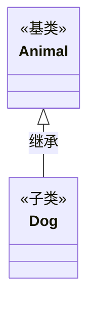
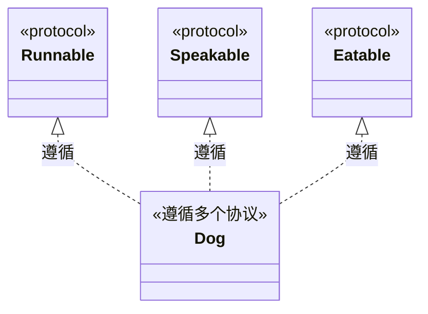
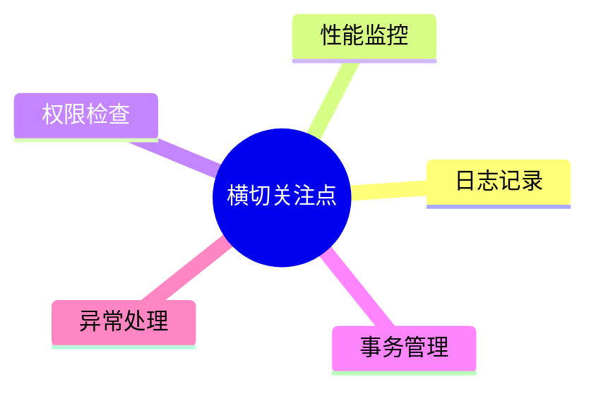
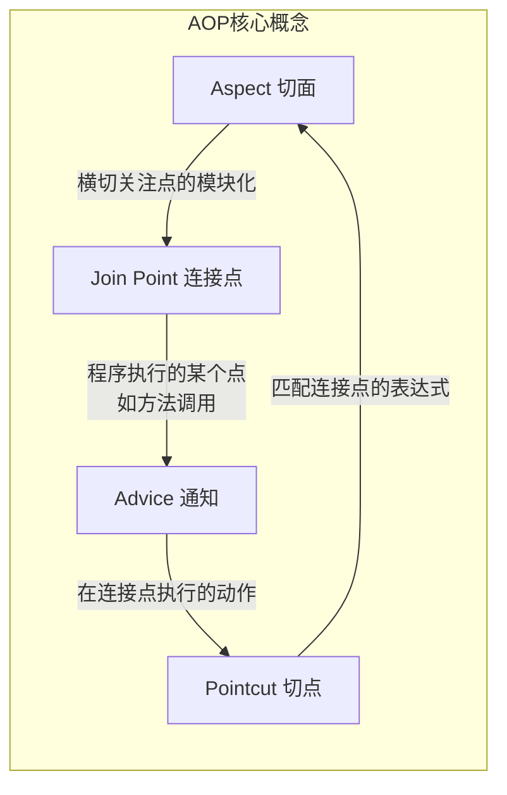
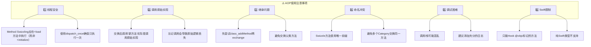
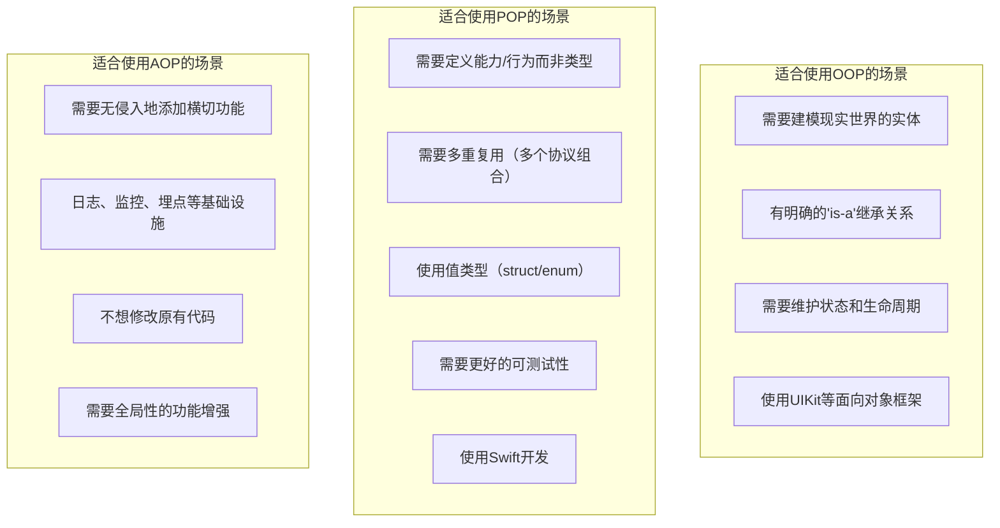

+++
title = "OOP、POP与AOP"
date = '2026-05-02T22:32:27+08:00'
draft = false
weight = 2
tags = ["iOS", "面试"]
categories = ["iOS开发", "面试"]
+++
在iOS开发中，经常会接触到三种重要的编程范式：面向对象编程（OOP）、面向协议编程（POP）和面向切面编程（AOP）。

---

## OOP - 面向对象编程

### 基本概念

面向对象编程（Object-Oriented Programming）是一种以对象为核心的编程范式。它将数据和操作数据的方法封装在一起，形成对象。

OOP的四大核心特性：

| 特性 | 说明 | iOS中的体现 |
|-----|------|------------|
| 封装 | 隐藏内部实现细节，只暴露必要的接口 | `@interface`/`@implementation`分离，`private`属性 |
| 继承 | 子类继承父类的属性和方法 | `UIViewController`继承自`UIResponder` |
| 多态 | 同一接口可以有不同的实现 | 子类重写父类方法 |
| 抽象 | 提取共同特征形成抽象类型 | 抽象基类、协议 |

### Objective-C中的OOP

Objective-C是一门典型的面向对象语言，它在C语言的基础上添加了面向对象的特性。

```objective-c
// 基类定义
@interface Animal : NSObject

@property (nonatomic, copy) NSString *name;

- (void)speak;
- (void)eat:(NSString *)food;

@end

@implementation Animal

- (void)speak {
    NSLog(@"Animal speaks");
}

- (void)eat:(NSString *)food {
    NSLog(@"%@ is eating %@", self.name, food);
}

@end

// 子类继承
@interface Dog : Animal

@property (nonatomic, copy) NSString *breed;

@end

@implementation Dog

// 重写父类方法 - 多态
- (void)speak {
    NSLog(@"%@ barks: Woof!", self.name);
}

// 子类特有方法
- (void)fetch {
    NSLog(@"%@ is fetching", self.name);
}

@end
```

### Swift中的OOP

Swift同样支持面向对象编程，但提供了更现代的语法和更强的类型安全。

```swift
// 基类
class Animal {
    var name: String
    
    init(name: String) {
        self.name = name
    }
    
    func speak() {
        print("Animal speaks")
    }
    
    func eat(_ food: String) {
        print("\(name) is eating \(food)")
    }
}

// 子类继承
class Dog: Animal {
    var breed: String
    
    init(name: String, breed: String) {
        self.breed = breed
        super.init(name: name)
    }
    
    // 重写需要显式声明
    override func speak() {
        print("\(name) barks: Woof!")
    }
    
    func fetch() {
        print("\(name) is fetching")
    }
}

// 使用多态
let animals: [Animal] = [
    Animal(name: "Generic"),
    Dog(name: "Buddy", breed: "Golden Retriever")
]

for animal in animals {
    animal.speak()  // 运行时决定调用哪个实现
}
```

### OOP的优缺点

**优点：**
- 代码组织清晰，易于理解
- 代码复用性高（通过继承）
- 易于维护和扩展
- 符合人类思维习惯

**缺点：**
- 继承层次过深会导致代码复杂
- 单继承限制了代码复用的灵活性
- 基类的修改会影响所有子类
- 容易产生紧耦合
- 深层继承链会放大变更影响范围

### 单继承的局限性

Objective-C 和 Swift 都只支持单继承，不会出现 C++ 等多继承语言中的菱形继承（Diamond Problem）。但单继承有自己的痛点：**一个类只能有一条继承链，想复用多种能力时，要么把能力全塞进基类（导致基类膨胀），要么搭出很深的继承层次（导致改动牵一发动全身）。**

```plaintext
单继承的困境：Duck 既要飞又要游，怎么办？

    ┌───────────┐
    │  Animal   │
    └─────┬─────┘
          │
    ┌─────┴─────┐
    │   Bird    │  ← 会飞
    └─────┬─────┘
          │
    ┌─────┴─────┐
    │   Duck    │  ← 也要游泳，但 Bird 没有游泳能力
    └───────────┘

方案A：把 swim() 加到 Animal → 所有 Animal 子类都被迫带上游泳
方案B：多搞一层 SwimmingBird → 继承层次越来越深
```

**协议组合如何解决：**

```swift
// 用协议描述能力，而非用继承层次堆叠
protocol Flying {
    func fly()
}

protocol Swimming {
    func swim()
}

extension Flying {
    func fly() { print("Flying") }
}

extension Swimming {
    func swim() { print("Swimming") }
}

// Duck 按需组合能力，不需要深继承链
struct Duck: Flying, Swimming {}

let duck = Duck()
duck.fly()   // Flying
duck.swim()  // Swimming
```

这就是 POP 相比 OOP 继承体系最直接的优势：**能力按需组合，不受单继承链的限制，也不会导致基类膨胀。**

协议通过**组合**而非继承来复用代码，每个协议扩展独立提供默认实现，避免了继承链中的二义性问题。

---

## POP - 面向协议编程

### 基本概念

面向协议编程（Protocol-Oriented Programming）是Apple在WWDC 2015上提出的编程范式。它强调通过协议来定义行为，而不是通过继承。

POP的核心思想：

**OOP思维方式**："这个对象是什么？" → 继承关系



**POP思维方式**："这个对象能做什么？" → 协议组合



### 协议与协议扩展

Swift中的协议可以通过扩展提供默认实现，这是POP的核心能力。

```swift
// 定义协议
protocol Speakable {
    var voice: String { get }
    func speak()
}

// 协议扩展提供默认实现
extension Speakable {
    func speak() {
        print("Default: \(voice)")
    }
    
    // 扩展中可以添加新方法
    func shout() {
        print("\(voice.uppercased())!")
    }
}

protocol Runnable {
    var speed: Double { get }
    func run()
}

extension Runnable {
    func run() {
        print("Running at \(speed) km/h")
    }
}

// 结构体遵循多个协议
struct Dog: Speakable, Runnable {
    var voice: String = "Woof"
    var speed: Double = 30.0
    
    // 可以使用默认实现，也可以自定义
    func speak() {
        print("\(voice)! \(voice)!")
    }
}

struct Cat: Speakable, Runnable {
    var voice: String = "Meow"
    var speed: Double = 48.0
    // 使用协议扩展的默认实现
}

let dog = Dog()
dog.speak()  // Woof! Woof! (自定义实现)
dog.shout()  // WOOF! (扩展方法)
dog.run()    // Running at 30.0 km/h (默认实现)

let cat = Cat()
cat.speak()  // Default: Meow (默认实现)
```

### 协议组合与泛型约束

POP配合泛型可以实现强大的代码复用能力。

```swift
// 协议组合
protocol Named {
    var name: String { get }
}

protocol Aged {
    var age: Int { get }
}

// 使用协议组合作为类型约束
func introduce<T: Named & Aged>(_ entity: T) {
    print("This is \(entity.name), \(entity.age) years old")
}

// 或者使用协议组合类型
func introduce2(_ entity: Named & Aged) {
    print("This is \(entity.name), \(entity.age) years old")
}

struct Person: Named, Aged {
    var name: String
    var age: Int
}

struct Pet: Named, Aged {
    var name: String
    var age: Int
    var species: String
}

let person = Person(name: "John", age: 30)
let pet = Pet(name: "Max", age: 5, species: "Dog")

introduce(person)  // This is John, 30 years old
introduce(pet)     // This is Max, 5 years old
```

### 关联类型（Associated Types）

协议可以使用关联类型来实现泛型协议。

```swift
protocol Container {
    associatedtype Item
    
    var count: Int { get }
    mutating func append(_ item: Item)
    subscript(i: Int) -> Item { get }
}

struct Stack<Element>: Container {
    // 编译器自动推断 Item = Element
    private var items: [Element] = []
    
    var count: Int {
        return items.count
    }
    
    mutating func append(_ item: Element) {
        items.append(item)
    }
    
    subscript(i: Int) -> Element {
        return items[i]
    }
    
    mutating func pop() -> Element? {
        return items.popLast()
    }
}

var intStack = Stack<Int>()
intStack.append(1)
intStack.append(2)
print(intStack.count)  // 2
```

### `some` 和 `any` 关键字

`some`（不透明类型）在 **Swift 5.1**（SE-0244）引入，`any`（显式存在类型）在 **Swift 5.6**（SE-0335）引入；Swift 6 起未标注 `any` 的存在类型将报错。两者进一步完善了 POP 的类型系统。

```swift
protocol Animal {
    func speak()
}

struct Dog: Animal {
    func speak() { print("Woof") }
}

struct Cat: Animal {
    func speak() { print("Meow") }
}

// ❌ 在较新 Swift 版本中会提示：使用 'any' 明确表示存在类型
func feedAnimal(_ animal: Animal) { }

// ✅ 存在类型（Existential Type）：可以持有任何遵循协议的类型
func feedAnimal(_ animal: any Animal) {
    animal.speak()
}

// ✅ 不透明类型（Opaque Type）：返回某个具体类型，但隐藏具体类型信息
func makeAnimal() -> some Animal {
    return Dog()  // 调用者不知道具体返回 Dog
}

// 两者的区别
var animals: [any Animal] = [Dog(), Cat()]  // ✅ 可以存储不同类型
// var animals: [some Animal] = [Dog(), Cat()]  // ❌ 编译错误

let animal: some Animal = Dog()  // ✅ 编译器知道底层类型
let animal2: any Animal = Dog()  // ✅ 运行时类型擦除
```

| 关键字 | 类型 | 特点 | 使用场景 |
|-------|-----|------|---------|
| `some` | 不透明类型 | 对调用方隐藏具体类型，但同一调用点的具体类型固定，走静态派发且无装箱开销 | 返回类型、属性类型 |
| `any` | 存在类型 | 运行时类型擦除，灵活性更高 | 集合、参数类型 |

### POP在iOS开发中的应用

```swift
// 网络请求协议
protocol APIRequest {
    associatedtype Response: Decodable
    
    var endpoint: String { get }
    var method: HTTPMethod { get }
    var parameters: [String: Any]? { get }
}

extension APIRequest {
    var method: HTTPMethod { .get }
    var parameters: [String: Any]? { nil }
}

// 具体请求
struct UserRequest: APIRequest {
    typealias Response = User
    
    let userId: Int
    var endpoint: String { "/users/\(userId)" }
}

struct PostsRequest: APIRequest {
    typealias Response = [Post]
    
    var endpoint: String { "/posts" }
}

// 网络服务协议
protocol NetworkService {
    func execute<R: APIRequest>(_ request: R) async throws -> R.Response
}

// 默认实现
extension NetworkService {
    func execute<R: APIRequest>(_ request: R) async throws -> R.Response {
        // 构建URL
        let url = URL(string: "https://api.example.com" + request.endpoint)!
        
        // 发送请求
        let (data, _) = try await URLSession.shared.data(from: url)
        
        // 解码响应
        return try JSONDecoder().decode(R.Response.self, from: data)
    }
}

// 使用
class APIClient: NetworkService {
    // 可以使用默认实现，也可以自定义
}
```

### OOP与POP的对比

| 特性 | OOP | POP |
|-----|-----|-----|
| 代码复用方式 | 继承 | 协议扩展 |
| 类型限制 | 仅限类（引用类型） | 类、结构体、枚举都可以 |
| 多重复用 | 单继承限制 | 可遵循多个协议 |
| 耦合度 | 子类与父类紧耦合 | 松耦合 |
| 继承复用 | 值类型（struct/enum）无法使用继承 | 值类型可通过协议组合复用能力 |
| 默认实现 | 在父类中 | 在协议扩展中 |

---

## AOP - 面向切面编程

### 基本概念

面向切面编程（Aspect-Oriented Programming）是一种将横切关注点从业务逻辑中分离的编程范式，常见实现方式包括编译期织入、运行时代理或编译器扩展。它的核心思想是将横切关注点（Cross-cutting Concerns）从业务逻辑中分离出来。

**横切关注点（Cross-cutting Concerns）**

这些功能散布在多个模块中，与核心业务逻辑交织：



**AOP术语**



### iOS中AOP的实现方式

iOS中实现AOP主要依赖Objective-C的Runtime特性。

#### 1. Method Swizzling

Method Swizzling是iOS中最常用的AOP实现方式，它利用Runtime动态交换方法的实现。

```objective-c
#import <objc/runtime.h>

@implementation UIViewController (Tracking)

+ (void)load {
    static dispatch_once_t onceToken;
    dispatch_once(&onceToken, ^{
        Class class = [self class];
        
        // 原始方法
        SEL originalSelector = @selector(viewWillAppear:);
        // 替换方法
        SEL swizzledSelector = @selector(tracking_viewWillAppear:);
        
        Method originalMethod = class_getInstanceMethod(class, originalSelector);
        Method swizzledMethod = class_getInstanceMethod(class, swizzledSelector);
        
        // 先尝试添加方法，防止父类方法被交换
        BOOL didAddMethod = class_addMethod(class,
                                            originalSelector,
                                            method_getImplementation(swizzledMethod),
                                            method_getTypeEncoding(swizzledMethod));
        
        if (didAddMethod) {
            class_replaceMethod(class,
                               swizzledSelector,
                               method_getImplementation(originalMethod),
                               method_getTypeEncoding(originalMethod));
        } else {
            method_exchangeImplementations(originalMethod, swizzledMethod);
        }
    });
}

- (void)tracking_viewWillAppear:(BOOL)animated {
    // 调用原始实现（方法已交换，所以调用tracking_viewWillAppear实际是原始实现）
    [self tracking_viewWillAppear:animated];
    
    // 添加切面逻辑：页面追踪
    NSLog(@"Page will appear: %@", NSStringFromClass([self class]));
    
    // 可以在这里添加埋点、性能监控等逻辑
    [AnalyticsService trackPageView:NSStringFromClass([self class])];
}

@end
```

Swift中使用Method Swizzling：

```swift
extension UIViewController {
    
    static let swizzleViewWillAppear: Void = {
        let originalSelector = #selector(viewWillAppear(_:))
        let swizzledSelector = #selector(tracking_viewWillAppear(_:))
        
        guard let originalMethod = class_getInstanceMethod(UIViewController.self, originalSelector),
              let swizzledMethod = class_getInstanceMethod(UIViewController.self, swizzledSelector) else {
            return
        }
        
        method_exchangeImplementations(originalMethod, swizzledMethod)
    }()
    
    @objc private func tracking_viewWillAppear(_ animated: Bool) {
        // 调用原始实现
        tracking_viewWillAppear(animated)
        
        // 切面逻辑
        print("Page will appear: \(type(of: self))")
    }
}

// 在AppDelegate中触发swizzling
@main
class AppDelegate: UIResponder, UIApplicationDelegate {
    func application(_ application: UIApplication, 
                     didFinishLaunchingWithOptions launchOptions: [UIApplication.LaunchOptionsKey: Any]?) -> Bool {
        _ = UIViewController.swizzleViewWillAppear
        return true
    }
}
```

#### 2. 消息转发机制

利用Objective-C的消息转发机制实现AOP。

```objective-c
@interface AOPProxy : NSProxy

@property (nonatomic, strong) id target;
@property (nonatomic, copy) void(^beforeBlock)(NSInvocation *);
@property (nonatomic, copy) void(^afterBlock)(NSInvocation *);

+ (instancetype)proxyWithTarget:(id)target;

@end

@implementation AOPProxy

+ (instancetype)proxyWithTarget:(id)target {
    AOPProxy *proxy = [AOPProxy alloc];
    proxy.target = target;
    return proxy;
}

- (NSMethodSignature *)methodSignatureForSelector:(SEL)sel {
    return [self.target methodSignatureForSelector:sel];
}

- (void)forwardInvocation:(NSInvocation *)invocation {
    // Before Advice
    if (self.beforeBlock) {
        self.beforeBlock(invocation);
    }
    
    // 执行原始方法
    [invocation invokeWithTarget:self.target];
    
    // After Advice
    if (self.afterBlock) {
        self.afterBlock(invocation);
    }
}

@end

// 使用示例
UserService *service = [[UserService alloc] init];
AOPProxy *proxy = [AOPProxy proxyWithTarget:service];

proxy.beforeBlock = ^(NSInvocation *invocation) {
    NSLog(@"Before method: %@", NSStringFromSelector(invocation.selector));
    // 记录开始时间
};

proxy.afterBlock = ^(NSInvocation *invocation) {
    NSLog(@"After method: %@", NSStringFromSelector(invocation.selector));
    // 记录结束时间，计算耗时
};

[(UserService *)proxy fetchUserInfo];
```

#### 3. 使用Aspects库

Aspects是一个轻量级的AOP库，提供了简洁的API。

```objective-c
#import <Aspects/Aspects.h>

// Hook 单个实例的方法
[viewController aspect_hookSelector:@selector(viewWillAppear:)
                        withOptions:AspectPositionAfter
                         usingBlock:^(id<AspectInfo> aspectInfo, BOOL animated) {
    NSLog(@"viewWillAppear: called on %@", aspectInfo.instance);
} error:NULL];

// Hook 类的所有实例方法（对类调用，影响所有实例）
[UIViewController aspect_hookSelector:@selector(viewDidLoad)
                          withOptions:AspectPositionAfter
                           usingBlock:^(id<AspectInfo> aspectInfo) {
    UIViewController *vc = aspectInfo.instance;
    NSLog(@"ViewController loaded: %@", NSStringFromClass([vc class]));
} error:NULL];
```

### AOP的实际应用场景

#### 1. 无侵入埋点

```objective-c
@implementation UIControl (Analytics)

+ (void)load {
    static dispatch_once_t onceToken;
    dispatch_once(&onceToken, ^{
        SEL originalSelector = @selector(sendAction:to:forEvent:);
        SEL swizzledSelector = @selector(analytics_sendAction:to:forEvent:);
        
        Method originalMethod = class_getInstanceMethod(self, originalSelector);
        Method swizzledMethod = class_getInstanceMethod(self, swizzledSelector);
        
        method_exchangeImplementations(originalMethod, swizzledMethod);
    });
}

- (void)analytics_sendAction:(SEL)action to:(id)target forEvent:(UIEvent *)event {
    // 调用原始实现
    [self analytics_sendAction:action to:target forEvent:event];
    
    // 埋点逻辑
    NSString *actionName = NSStringFromSelector(action);
    NSString *targetClass = NSStringFromClass([target class]);
    
    // 根据配置表决定是否上报
    NSDictionary *trackInfo = [AnalyticsConfig trackInfoForAction:actionName 
                                                         inClass:targetClass];
    if (trackInfo) {
        [AnalyticsService trackEvent:trackInfo];
    }
}

@end
```

#### 2. 性能监控

```swift
class PerformanceMonitor {
    
    static func hookViewControllerLifecycle() {
        let originalSelector = #selector(UIViewController.viewDidLoad)
        let swizzledSelector = #selector(UIViewController.monitored_viewDidLoad)
        
        guard let originalMethod = class_getInstanceMethod(UIViewController.self, originalSelector),
              let swizzledMethod = class_getInstanceMethod(UIViewController.self, swizzledSelector) else {
            return
        }
        
        method_exchangeImplementations(originalMethod, swizzledMethod)
    }
}

extension UIViewController {
    
    @objc func monitored_viewDidLoad() {
        let startTime = CFAbsoluteTimeGetCurrent()
        
        // 调用原始实现
        monitored_viewDidLoad()
        
        let endTime = CFAbsoluteTimeGetCurrent()
        let duration = (endTime - startTime) * 1000
        
        // 上报性能数据
        if duration > 100 {  // 超过100ms告警
            print("Warning: \(type(of: self)) viewDidLoad took \(duration)ms")
            PerformanceService.report(
                event: "slow_viewDidLoad",
                params: [
                    "class": String(describing: type(of: self)),
                    "duration": duration
                ]
            )
        }
    }
}
```

#### 3. 日志系统

```objective-c
@implementation NSObject (MethodLogger)

+ (void)logAllMethodCallsForClass:(Class)cls {
    unsigned int methodCount = 0;
    Method *methods = class_copyMethodList(cls, &methodCount);
    
    for (unsigned int i = 0; i < methodCount; i++) {
        Method method = methods[i];
        SEL selector = method_getName(method);
        
        // 跳过特殊方法
        NSString *selectorName = NSStringFromSelector(selector);
        if ([selectorName hasPrefix:@"_"] || 
            [selectorName hasPrefix:@"."]) {
            continue;
        }
        
        [self swizzleMethod:selector forClass:cls];
    }
    
    free(methods);
}

+ (void)swizzleMethod:(SEL)selector forClass:(Class)cls {
    Method originalMethod = class_getInstanceMethod(cls, selector);
    if (!originalMethod) return;
    
    IMP originalIMP = method_getImplementation(originalMethod);
    const char *typeEncoding = method_getTypeEncoding(originalMethod);
    
    IMP newIMP = imp_implementationWithBlock(^(id self, ...) {
        NSLog(@"[%@] Calling: %@", NSStringFromClass(cls), NSStringFromSelector(selector));
        
        // 这里简化处理，实际需要处理可变参数
        // 调用原始实现
        ((void (*)(id, SEL))originalIMP)(self, selector);
        
        NSLog(@"[%@] Finished: %@", NSStringFromClass(cls), NSStringFromSelector(selector));
    });
    
    method_setImplementation(originalMethod, newIMP);
}

@end
```

### AOP的注意事项



> 💡 关于为什么要在 `+load` 而非 `+initialize` 中执行 Swizzling，请参考 [+load与+initialize的区别]()。简单来说：`+load` 在类加载时立即调用，确保 Swizzling 在任何方法调用之前完成；而 `+initialize` 是懒加载的，可能导致 Swizzling 时机不确定。

---

## 三种范式的对比与选择

OOP的本质是**数据与行为的封装**。它将相关的数据和操作这些数据的方法组织在一起，形成一个自包含的单元。继承提供了代码复用的机制，多态提供了运行时的灵活性。

POP的本质是**行为的抽象与组合**。它关注的是"能做什么"而不是"是什么"。通过协议定义行为契约，通过协议扩展提供默认实现，通过协议组合实现功能复用。

AOP的本质是**关注点的分离**。它将横切关注点（如日志、监控、权限）从核心业务逻辑中分离出来，使得这些功能可以独立演化，且不会污染业务代码。

### 对比表

| 维度 | OOP | POP | AOP |
|-----|-----|-----|-----|
| 核心思想 | 封装、继承、多态 | 协议定义行为 | 横切关注点分离 |
| 代码组织 | 以类为中心 | 以协议为中心 | 以切面为中心 |
| 复用方式 | 继承 | 协议扩展 | 方法拦截 |
| 适用语言 | OC/Swift | Swift为主 | OC（依赖Runtime） |
| 耦合度 | 中等 | 低 | 低 |
| 侵入性 | 需要继承 | 需要遵循协议 | 无侵入 |
| 典型场景 | 业务模型 | 能力抽象 | 日志、监控、埋点 |

### 选择建议


