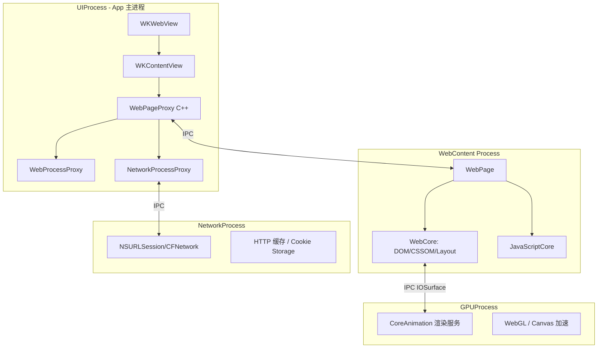
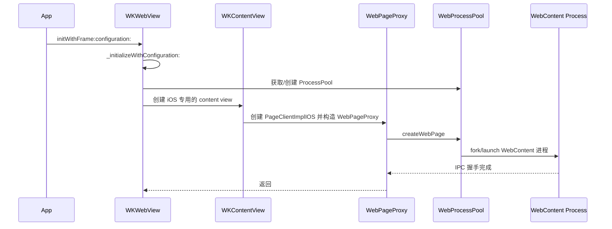
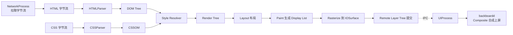
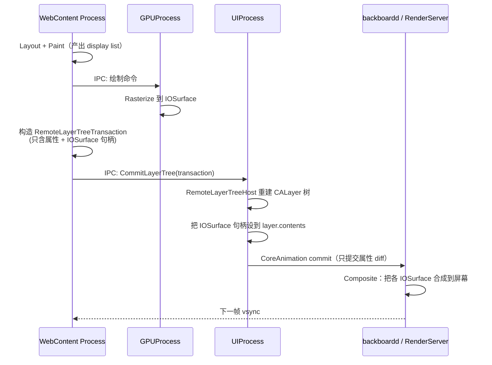
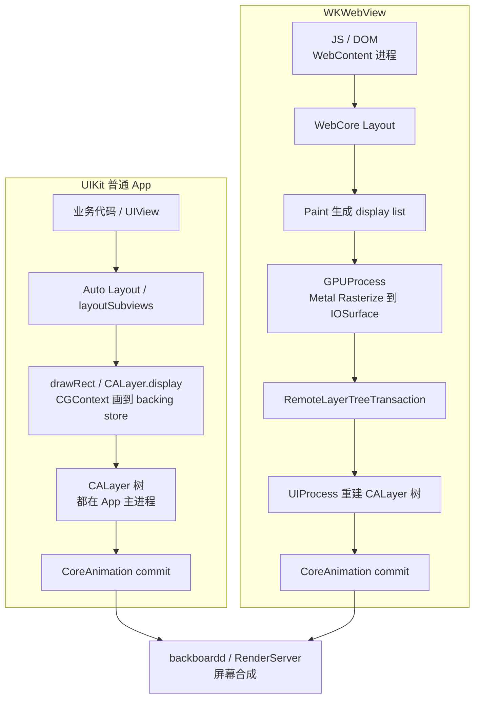
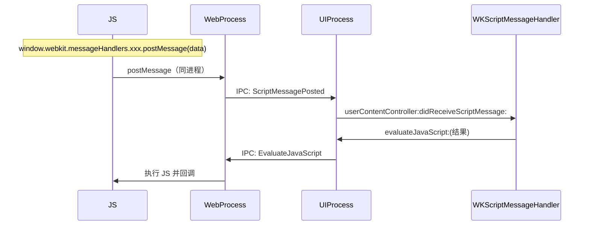
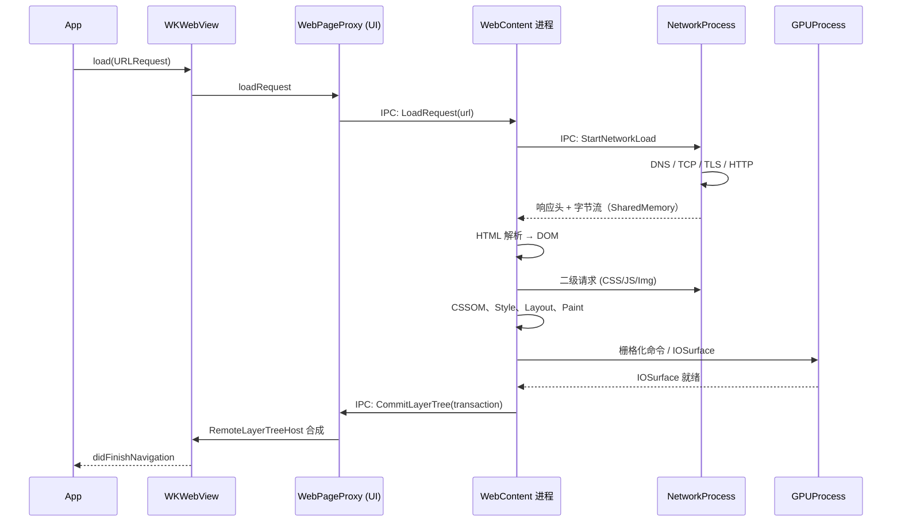

+++
title = "WebView底层原理"
date = '2026-05-02T22:32:27+08:00'
draft = false
weight = 3
tags = ["iOS", "面试"]
categories = ["iOS开发", "面试"]
+++
## 前言

iOS 上的 WebView 目前以 `WKWebView` 为事实标准。它对外表现得像一个 `UIView` 子类，但内部其实对接着整个 WebKit 引擎——一个由多个独立进程协作的庞大系统。日常开发中遇到的那些困扰：为什么 Web 页白屏不会把 App 带崩？为什么 Cookie 和 App 自身的 `NSHTTPCookieStorage` 总是对不上？为什么 JS 调用 Native 永远是异步？为什么 `NSURLProtocol` 拦不到 `WKWebView` 的请求？这些问题单看 API 都得不到答案，必须下潜到 WebKit 源码里才能看清楚。

好在 WebKit 是 Apple 官方开源的项目，仓库在 [github.com/WebKit/WebKit](https://github.com/WebKit/WebKit)。本文基于其 `Source/` 目录下的公开源码，按"源码地图 → 多进程架构 → 各进程职责 → 全链路串联 → 工程启示"的顺序，把 `WKWebView` 从创建到渲染一帧的底层机制梳理清楚。

## 一、先看源码地图

阅读源码前，先在脑子里建立目录结构。以 `WebKit/WebKit` 仓库的 `Source/` 目录为例：

```
Source/
├── JavaScriptCore/     # JS 引擎（解释器、JIT 编译器、GC）
├── WebCore/            # 渲染引擎核心（DOM、CSSOM、Layout、Paint）
├── WebKit/             # 多进程框架 + Cocoa 层 API
│   ├── UIProcess/      # 主进程侧（App 进程）
│   │   ├── API/Cocoa/  # WKWebView.mm、WKProcessPool.mm 等
│   │   ├── API/ios/    # WKWebViewIOS.mm
│   │   ├── ios/        # WKContentView.mm、WebPageProxyIOS.mm
│   │   └── ...
│   ├── WebProcess/     # 渲染进程侧（WebContent）
│   ├── NetworkProcess/ # 独立网络进程
│   ├── GPUProcess/     # 独立 GPU 进程
│   └── Shared/         # 跨进程共享的数据结构、IPC 消息定义
└── WTF/                # 基础容器、线程、字符串工具库
```

日常 iOS 开发能看到的 `WKWebView`，对应的实现就在 `Source/WebKit/UIProcess/API/Cocoa/WKWebView.mm`。它是一个 Objective-C++ 文件，内部只是持有一个 C++ 的 `WebPageProxy` 对象，几乎所有实际工作都转发给它。为什么要这样设计？原因就藏在下一节要讲的多进程架构里。

## 二、多进程架构：一切差异的源头

`WKWebView` 与老旧 `UIWebView` 最根本的分水岭，就是**多进程沙箱**。App 自己、Web 渲染、网络、GPU 分别跑在独立的系统进程里，通过 IPC 协作。



四个进程的分工：

| 进程 | Bundle ID 前缀 | 职责 |
|------|---------------|------|
| UIProcess | 就是 App 自身 | 承载 `WKWebView`、事件分发、UI 合成输出 |
| WebContent Process | `com.apple.WebKit.WebContent` | HTML 解析、DOM/CSSOM 构建、布局、绘制、JS 执行 |
| NetworkProcess | `com.apple.WebKit.Networking` | 所有网络请求、Cookie、HTTP Cache、WebSocket |
| GPUProcess | `com.apple.WebKit.GPU` | iOS 16 起，承担 2D/WebGL/Canvas/Media 的 GPU 渲染 |

这张架构图和这张表，几乎能解释 `WKWebView` 对外表现出的所有"怪象"：

1. **Web 进程崩溃只会白屏**——它是独立进程，崩的不是 App，UIProcess 只会收到 `webView:webContentProcessDidTerminate:` 回调。
2. **内存不计入 App 自身占用**——DOM、JS 堆、图片解码缓存都在 WebContent 里，这是 `WKWebView` 比 `UIWebView` 省内存的根本原因。
3. **JS 可以 JIT**——iOS 禁止第三方 App 进程申请可写可执行内存，而 WebContent 作为系统进程拥有 `dynamic-codesigning` entitlement，JavaScriptCore 的完整 JIT 栈（Nitro）因此可用。
4. **IPC 成为性能关键**——所有 WebView 优化最终都会触及"能否少跨一次进程"这个问题，所以 WebKit 大量使用共享内存（`IOSurface`、`SharedMemory`）来减少拷贝。

接下来，我们就按进程边界逐个看它们内部发生了什么，先从离我们最近的 UIProcess 开始。

## 三、UIProcess 侧：WKWebView 是怎样被创建的

### 3.1 初始化链路

打开 `Source/WebKit/UIProcess/API/Cocoa/WKWebView.mm`，`-initWithFrame:configuration:` 的调用链大致如下：



这条链路里出现了几个关键角色，它们的职责一定要分清，后文几乎都依赖这套概念：

- **`WKWebView`**：对外 API 入口，只是个 `UIView` 容器，不做渲染。
- **`WKContentView`**（iOS 专属，`UIProcess/ios/WKContentView.mm`）：作为 `WKWebView` 的 subview，真正承载 Web 内容图层，处理触摸、文本选择、键盘输入。
- **`WebPageProxy`**（C++，`UIProcess/WebPageProxy.cpp`）：每个 WebView 在 UIProcess 侧的"灵魂"，持有导航状态、preferences、history，负责向 WebContent 进程发送 IPC。
- **`WebProcessProxy`**：代表某个 WebContent 进程的句柄，一个进程可以被多个 `WebPageProxy` 复用。
- **`WKProcessPool`**：进程池，决定多个 `WKWebView` 是否共享同一个 WebContent 进程。

### 3.2 WKWebView 和 WKContentView 的分工

很多文章误以为 `WKWebView` 自己在渲染，其实不是。源码里 `WKWebView` 持有 `_contentView`（`WKContentView`），渲染结果最终贴在 `WKContentView.layer` 上。滚动、手势、键盘输入也都是由 `WKContentView` 处理，`WKWebView` 只是把它嵌进一个 `UIScrollView`：

```
WKWebView (UIView)
└── UIScrollView (_scrollView)
      └── WKContentView（承载 layer tree，处理事件）
            └── CAContext 接收来自 WebContent 进程的远程图层
```

这就是为什么你给 `WKWebView` 的 layer 改属性往往没有直接效果——真正的图层在它孙子视图上。

### 3.3 进程池与 WebView 复用

`WKProcessPool` 是 WebKit 对外暴露的进程管理钥匙，但它不代表"一个 pool 就是一个进程"：

- 同一个 `WKProcessPool` 内，多个 `WKWebView` **可能**共享同一个 WebContent 进程；
- 当进程内存到阈值、或开启了 Site Isolation 时，WebKit 会自动拆分进程；
- 而 Cookie / LocalStorage / IndexedDB 的隔离是**另一件事**，由 `WKWebsiteDataStore` 决定：`WKWebsiteDataStore.default()` 全 App 共享，`nonPersistent()` 是隐身态，每次新建都是空的。

所以工程上常见的两条经验——**整个 App 共用一个 `WKProcessPool` + 一个 `WKWebsiteDataStore`**，以及**提前创建一个空 WebView 预热**——分别对应"进程复用"和"避免 IPC 冷启动"两个优化点，目标都在这一进程层面。

UIProcess 侧的故事到这里告一段落：它本身不做渲染，只是创建一个容器，把请求打包成 IPC 扔给下一个进程。真正的绘制发生在 WebContent 里。

## 四、WebContent 进程：渲染流水线

当 `WKWebView.loadRequest(_:)` 被调用，`WebPageProxy` 把 URL 通过 IPC 发给 WebContent。但 WebContent 自己并不联网——它会**再通过一次 IPC**把请求转给 NetworkProcess，由后者完成 DNS、TCP、TLS、HTTP 的全过程，再把响应头和字节流以 `SharedMemory` 的形式回传（详见 §五）。也就是说，下图最左边的"HTML 字节流"其实是经过 `WebContent → NetworkProcess → 网络 → NetworkProcess → WebContent` 这一圈之后才出现的，真正的白屏等待几乎都消耗在这一段。字节流回到 WebContent 后，才接力跑完整套渲染流水线：



这一串阶段每一步都对应源码里非常具体的位置：

1. **HTML 解析**（`WebCore/html/parser/HTMLDocumentParser.cpp`）：tokenizer → tree builder 的经典两段式。遇到 `<script>` 会同步阻塞等待脚本执行——"CSS 阻塞渲染、JS 阻塞解析"就源于此。
2. **样式计算**（`WebCore/style/StyleResolver.cpp`）：把 CSSOM 规则与 DOM 节点匹配，产出 `RenderStyle`。
3. **Render Tree 构造**：只有参与显示的节点才会出现，`display:none` 被剔除，`visibility:hidden` 保留并占位，`::before/::after` 伪元素在这里被植入。
4. **Layout**：按盒模型计算几何，是主线程最昂贵的阶段。**任何同步读取 `offsetWidth`、`scrollTop` 都会强制触发同步 Layout**（layout thrashing），这是 H5 首屏的老大难。
5. **Paint**：**不直接画像素**，只是把"如何画"记录成一份 display list（绘制指令清单）。
6. **Rasterize（光栅化）**：把 display list 真正变成位图，写进每个合成层对应的 `IOSurface`。这一步才是 GPU 真正动笔的地方。iOS 16 起，WebContent 会把这一步通过 IPC 交给 GPUProcess 用 Metal 执行，以获得更严格的沙箱。
7. **Composite（合成）**：RenderServer 把一堆已经光栅化好的 `IOSurface` 当作纹理，按 `frame / transform / opacity / mask` 贴到屏幕上再混合。这一步**不会重新执行任何 paint 指令**。`transform`、`opacity` 之所以能"免费"做动画，就是因为它们只影响这一步。

很多文章把 Paint / Rasterize / Composite 当一回事讲，其实它们是接力的三个阶段——Paint 产出指令，Rasterize 产出纹理，Composite 产出屏幕像素。分清这三者，下一节的跨进程设计才看得懂。

### 4.1 像素是怎样跨进程交付的：Remote Layer Tree + IOSurface

WebContent 不会把渲染好的位图回传给 App——那样每帧都要拷贝整屏像素，性能根本不可能。它的做法是**只传图层树的描述**，像素本身通过 `IOSurface` 共享：



相关源码：

- `Source/WebKit/WebProcess/WebPage/RemoteLayerTreeDrawingArea.cpp`（WebContent 侧生产者）
- `Source/WebKit/Shared/RemoteLayerTree/RemoteLayerTreeTransaction.cpp`（传输的数据结构）
- `Source/WebKit/UIProcess/RemoteLayerTree/RemoteLayerTreeDrawingAreaProxy.mm`（UIProcess 侧代理）
- `Source/WebKit/UIProcess/RemoteLayerTree/RemoteLayerTreeHost.mm`（重建 CALayer 树）

`IOSurface` 是 iOS/macOS 的跨进程 GPU 缓冲区对象，UIProcess 拿到的 `CALayer.contents` 实际上指向 WebContent 渲染的同一块显存——零拷贝。正因如此，App 进程只做一件轻量的事：把重建后的 CALayer 树交给 `backboardd`（系统合成服务）去合成。CPU 压力都在另一个进程，这就是 WebView 滚动能稳在 60FPS 的根本原因。

### 4.2 CoreAnimation commit 会不会把 GPU 再跑一遍？

读到这里很容易产生一个疑问：WebContent/GPUProcess 那边已经把像素画到 `IOSurface` 了，UIProcess 又做了一次 `CoreAnimation commit`，**这不是重复 GPU 渲染吗**？

答案是**不会**，关键在于 Rasterize 和 Composite 输入输出完全不同：

| 阶段 | 执行方 | 输入 | 输出 | GPU 在做什么 |
|------|--------|------|------|-------------|
| Rasterize | WebContent / GPUProcess | display list | 每个 layer 的 `IOSurface`（纹理） | 执行 paint 指令、光栅化路径、光栅化文字 |
| Composite | RenderServer (`backboardd`) | 一堆 `IOSurface` + 属性 | 屏幕 framebuffer | 纹理采样 + blend |

`CoreAnimation commit` 只是把 CALayer 树的**属性变更**提交给 `backboardd`，`backboardd` 拿着这些属性和别家 App 的 layer 树一起做最终合成。它不会重新执行 paint 指令，也不会重写 `IOSurface`。这套模型和 Native App 的 `UIView` 完全一致——WKWebView 的特殊之处只是把 backing store 放到了另一个进程里。

更关键的是，**大部分帧根本不触发 Rasterize**：

- 滚动：只改 `scrollLayer.position`，`IOSurface` 不变，RenderServer 拿同一块纹理贴到新位置。
- `transform`、`opacity` 动画：只改 layer 属性，纹理不变。
- 只有内容真正变化（文字改动、canvas 重绘、样式触发 repaint）时，WebContent 才会把脏区域重新 rasterize 写回对应 `IOSurface`。

也就是说，滚动帧里 GPU 只做了一次"合成"，Rasterize 步骤完全被跳过。这正是"`transform` 动画便宜"、"WKWebView 能稳 60FPS"的底层原因。

在源码里也能印证这点：`RemoteLayerTreeTransaction` 序列化的从来不是像素，而是"哪些 layer 的属性变了 / 哪些 layer 的 `backingStore` 换了新 `IOSurface`"。换句话说，Remote Layer Tree 传的是**diff**，不是帧。

### 4.3 对比 UIKit：同一个 CoreAnimation 的两种形态

读到这里你应该已经注意到：`backboardd` 是整个 iOS 系统共用的合成器，UIKit 原生 App 也走它。**Remote Layer Tree 并没有替换 CoreAnimation，只是把 CoreAnimation 模型里的"Layout / Paint / Rasterize"整段搬到了另一个进程里**。两者终点相同，起点和中间链路差别很大：



按阶段把差异对齐一下：

| 阶段 | UIKit App | WKWebView |
|------|-----------|-----------|
| 业务代码执行 | App 主线程 | WebContent 进程主线程 |
| Layout | Auto Layout，在 App 主线程 | WebCore Layout，在 WebContent 主线程 |
| Paint | `drawRect:` / `CALayer.display`，直接执行 CGContext 绘制 | 产出 display list，延后执行 |
| Rasterize | App 进程里，默认 **CPU**（CGContext） | GPUProcess 里，**Metal** 直接 GPU 写 IOSurface |
| CALayer 树归属 | App 主进程 | UIProcess，内容由 WebContent 通过 IPC 描述 |
| commit 触发源 | 主 RunLoop 的 `CATransaction` observer | `RemoteLayerTreeDrawingArea` 自己的 flush 调度 |
| 最终屏幕合成 | `backboardd` | `backboardd`（完全相同） |
| JS 引擎权限 | 同进程 JSContext，**无 JIT** | WebContent **完整分层 JIT** |

三个最关键的差异值得单独展开：

**1. 主线程是否隔离。** UIKit 的业务代码、Layout、Paint、CATransaction commit 全在 App 主线程串行跑，任何一处卡住整个 UI 都会卡。`WKWebView` 里 JS、DOM、Layout、Paint 都在 WebContent 的主线程；App 主线程只做"收 IPC → 把 `IOSurface` 挂到 CALayer → commit"。所以**网页里 `while(true){}` 卡死的是 WebContent，App 的 UI 仍在跑**。反过来，App 主线程卡了 5 秒，WebView 里正在进行的 CSS 动画照样平滑——因为合成由 `backboardd` 驱动，不关心 App 主线程。这是 `WKWebView` 最容易被低估的体验优势。

**2. Rasterize 在 CPU 还是 GPU。** UIKit 经典的 `drawRect:` 走 `CGContextRef`，底层大多是 CPU 绘制到位图，这也是为什么复杂自绘控件一多就容易掉帧。`WKWebView` 从 iOS 16 起由 GPUProcess + Metal 完成每个合成层的光栅化，**像素都是 GPU 画的**，对 App 进程几乎零 CPU 压力。这也是为什么一个纯 Native 的复杂列表有时候反而比等价的 H5 列表更卡——GPU 利用率不如 Web。

**3. CALayer 树的读写权。** UIKit 里你拿到的 `UIView.layer` 是本进程对象，属性改动立即生效。`WKWebView._contentView.layer` 确实是 UIProcess 的原生 CALayer，但它的 `sublayers` 是 **WebContent 通过 `RemoteLayerTreeHost` 同步出来的镜像**——你去挂 mask、强改 contents 会被下一次 transaction 覆盖。Web 内容的视觉修改**只能通过 CSS / JS 走 WebContent 侧**，不能绕过 Remote Layer Tree 直接改 CALayer。

知道这个对比之后，几条"感觉经验"也就有了统一的解释：

- 为什么 H5 滚动有时候比 Native `UIScrollView` 更顺？——Web 内容 GPU 光栅化，Native 复杂 cell 往往 CPU 绘制。
- 为什么 App 卡住时 Web 里的 CSS 动画还能转？——`backboardd` 直接驱动，跟 App 主线程没关系。
- 为什么 H5 的 JS 不会阻塞 Native 滚动？——两个进程、两条主线程。
- 为什么 `WKWebView` 能和 Native UIView 自由叠加？——两边产出的 CALayer 都汇到同一个 `backboardd` 合成，是"同级公民"。

渲染的故事讲完，接下来看另一条支线：网络。

## 五、NetworkProcess：网络与 Cookie 的真正归属

前面渲染流水线里的 HTML、CSS、JS、图片字节从哪来？答案是 WebContent 自己不发起真正的网络请求，而是通过 IPC 交给 NetworkProcess 来执行：

```
WebContent  ──IPC──►  NetworkProcess  ──NSURLSession──►  网络
             ◄──IPC──                    ◄── HTTP ──
```

为什么要这样多绕一层？有三个直接好处：

1. 多个 WebContent 进程共享一份 HTTP 缓存和一份 Cookie Jar；
2. 即使 WebContent 崩溃，正在进行的下载不受影响；
3. `WKWebsiteDataStore`（`UIProcess/API/Cocoa/WKWebsiteDataStore.mm`）作为数据存储"账户"，可以 `default()`、`nonPersistent()`、或自定义路径。

这一层架构直接解释了**为什么 `WKWebView` 的 Cookie 不和 `NSHTTPCookieStorage` 同步**：前者在 NetworkProcess 的 `WKWebsiteDataStore` 里，后者在 App 进程。它们物理上是两份数据。iOS 11 以后提供的 `WKHTTPCookieStore`（`dataStore.httpCookieStore`），内部就是通过 IPC 往 NetworkProcess 里增删 Cookie，应用层才能双向同步。

同理，**`NSURLProtocol` 为什么拦不到 `WKWebView` 的请求**也有了答案：请求根本不经过 App 进程的 URL Loading System。要拦截得用 iOS 11 引入的 `WKURLSchemeHandler`，它通过 IPC 把请求回送到 UIProcess，由 App 代码处理后再把数据回传。离线包方案大多基于这一机制。

网络路径讲完，再看 WebContent 内部的另一件核心事：JS 执行。

## 六、JavaScriptCore：为什么 WKWebView 的 JS 快那么多

WebContent 内嵌 JavaScriptCore，它是分层 JIT 架构：

- **LLInt**（Low Level Interpreter）：字节码解释执行，冷启动快。
- **Baseline JIT**：热点代码第一次 JIT。
- **DFG JIT**（Data Flow Graph）：进一步类型推断与优化。
- **FTL JIT**（Faster Than Light）：基于 B3 后端，生成接近 C++ 水准的原生码。

整个分层编译链要工作的前提是**能写可执行内存**。这是理解两代 WebView JS 性能差距的关键：

- `UIWebView` 在 App 进程里，iOS 禁止第三方 App 申请 RWX 内存，JavaScriptCore 退化成只剩 LLInt，JS 性能直接砍 3~5 倍。
- `WKWebView` 的 WebContent 是系统进程，拥有 JIT entitlement，完整分层全开。

所以同一段 JS 脚本放进两种 WebView 里，数值计算和重循环能拉开明显差距。这并不是 Apple 在 API 层做了什么优化，而是进程权限的物理结果。

## 七、JS 与 Native 的通信：一次必然的跨进程 IPC

理解了 WebContent 独立进程这件事，再看 JS↔Native 通信就非常自然了。`WKWebView` 官方只提供一条通信管道：`WKUserContentController`。



源码层的实现：

- JS 端 `window.webkit.messageHandlers.xxx` 的注入，由 `WebProcess/UserContent/WebUserContentController.cpp` 在创建 frame 时完成；
- `postMessage` 经 `WebPage::postMessage` 打包成 IPC 消息 `WebPageProxy::HandleScriptMessage`，送回 UIProcess；
- UIProcess 的 `WebUserContentControllerProxy` 分发到开发者注册的 `WKScriptMessageHandler`。

这条路径上有两次跨进程跳跃，所以**JS 调用 Native 一定是异步的**——Native 层不要期望 `postMessage` 能像 `UIWebView` 的 `JSContext` 那样同步拿到返回值。这不是 API 设计偏好，是进程边界的物理限制。

顺带澄清两个周边问题：

- **`WKUserScript` 的注入时机**：`AtDocumentStart` 对应 WebCore 的 `Document::DidCreateParser`，`AtDocumentEnd` 对应 `Document::FinishedParsing`。想在 `<body>` 之前注入 polyfill，必须用前者。
- **`iframe.src = "xxx://foo"` 这种旧拦截方案**在 `WKWebView` 下依然可用（通过 `decidePolicyForNavigationAction:`），但链路更长、URL 长度有上限，新代码推荐优先 `WKScriptMessageHandler`。

## 八、把四个进程串起来：一次完整的 loadRequest

前面分进程讲了一圈，现在把整条链路拼起来。一次 `webView.load(URLRequest(url:))` 在四个进程之间流动的全貌：



这张图有两个值得注意的观察。**第一，头三次 IPC 其实都很便宜**（App → WebContent → NetworkProcess），真正慢的是 NetworkProcess 里的 DNS + TLS + 首包等待。这就是为什么"预连接 / DNS 预解析 / 离线包"都能显著改善白屏——它们缩短的恰好是这段。**第二，只要 HTML 还没回到 WebContent，后面的整条流水线都处于空转**，这也是为什么服务端 SSR、预渲染、首屏关键资源内联这些手段比单纯前端优化见效更快。

## 九、从底层差异看 WKWebView vs UIWebView

把前面提到的各种底层差异集中对照一下，对面试和选型都是最直接的答卷：

| 维度 | UIWebView | WKWebView | 源码级根因 |
|------|-----------|-----------|----------|
| 进程模型 | 单进程（App 内） | 多进程（WebContent + Network + GPU） | `WKProcessPool` + `WebProcessProxy` |
| JS 引擎性能 | 仅解释器 | 完整 JIT（Baseline/DFG/FTL） | App 进程无 RWX 权限 |
| 内存归属 | 计入 App | Web 进程独立 | 进程隔离 |
| 崩溃影响 | 整个 App 被系统 kill | 只回调 `webContentProcessDidTerminate` | UIProcess 捕获 IPC 断开 |
| Cookie | 和 App 共享 `NSHTTPCookieStorage` | 存在 NetworkProcess，需通过 `WKHTTPCookieStore` 同步 | Cookie Jar 在独立进程 |
| JS-Native | `JSContext` 同进程直调 | IPC 异步消息 | WebContent 跨进程 |
| 本地资源拦截 | `NSURLProtocol` 可拦截 | 需要 `WKURLSchemeHandler` | 请求发生在 NetworkProcess |
| 硬件加速 | 较弱 | GPUProcess 专用 | 独立 GPU 进程 |

每一行的"源码级根因"都能在前面的章节里找到出处。理解了这张表，再看后面的性能优化建议会顺理成章。

## 十、工程优化的源码级依据

底层原理的价值，是让那些零散的优化经验有了统一的解释。下面这些常见手段都能在前文里找到根因：

| 优化手段 | 源码级原理 |
|---------|-----------|
| 使用 `transform` 做动画 | 只走 Composite，不触发 Layout/Paint（§四） |
| `will-change: transform` | 提前把元素提升为独立合成层（§四） |
| 合并 DOM 读写 | 避免强制同步 Layout（§四） |
| 图片懒加载 | 降低 NetworkProcess 并发，给主文档解析让路（§五） |
| 预热 WKWebView | 让 WebContent 进程提前 fork 并完成 IPC 握手（§三） |
| 统一 WKProcessPool + WKWebsiteDataStore | 复用进程 + 共享 Cookie（§三、§五） |
| 离线包 + `WKURLSchemeHandler` | 请求在 UIProcess 直接命中本地，跳过 NetworkProcess（§五） |
| 首屏资源内联 / SSR | 缩短 §八 中"HTML 回来之前"的空转区间 |

## 十一、面试高频问题速答

**Q: WKWebView 是几个进程？** A: UIProcess（App 自身）、WebContent Process、NetworkProcess；iOS 16 起还有 GPUProcess。`WKWebView` 本身在 UIProcess。

**Q: WKWebView 为什么比 UIWebView 省内存？** A: WebContent 独立进程，DOM/JS 堆/图片解码缓存都在那里，不占 App 的 footprint。

**Q: WKWebView 为什么 JS 更快？** A: WebContent 是系统进程，允许 RWX，JavaScriptCore 的 LLInt→Baseline→DFG→FTL 分层 JIT 全开。

**Q: 为什么 Cookie 和 NSHTTPCookieStorage 对不上？** A: WebView Cookie 在 NetworkProcess 的 `WKWebsiteDataStore` 里，两者物理分离。iOS 11+ 用 `WKHTTPCookieStore` 双向同步。

**Q: 多个 WebView 如何共享登录态？** A: 共用同一 `WKWebsiteDataStore`（Cookie/Storage 归属）；再配合同一 `WKProcessPool` 复用进程。

**Q: 白屏了怎么恢复？** A: 实现 `webViewWebContentProcessDidTerminate:`，在回调里 `webView.reload()`，WebKit 会自动重启 WebContent。

**Q: postMessage 同步还是异步？** A: 异步。要跨 WebContent → UIProcess 一次 IPC。

**Q: Remote Layer Tree 是什么？** A: WebContent 把 CALayer 树描述 + `IOSurface` 像素句柄通过 IPC 交给 UIProcess，UIProcess 零拷贝地让 CoreAnimation 合成。这是 60FPS 的基础。

**Q: WKWebView 的渲染流程和 UIKit App 有什么区别？** A: 终点相同——都由系统的 `backboardd` 做最终合成。差别在前半段：UIKit 的 Layout/Paint/Rasterize 全在 App 主线程、默认 CPU；WKWebView 把这整段拆到 WebContent（Layout/Paint）+ GPUProcess（Metal 光栅化），CALayer 树再通过 Remote Layer Tree 同步回 UIProcess。两条主线程彼此隔离，这是 JS 卡不死 App UI、App 卡了 CSS 动画还能转的根因。详见 §4.3。

**Q: 为什么推荐 `WKURLSchemeHandler` 而不是 `NSURLProtocol`？** A: `WKWebView` 的请求发生在 NetworkProcess，不走 App 进程的 URL Loading System，`NSURLProtocol` 拦不到。
