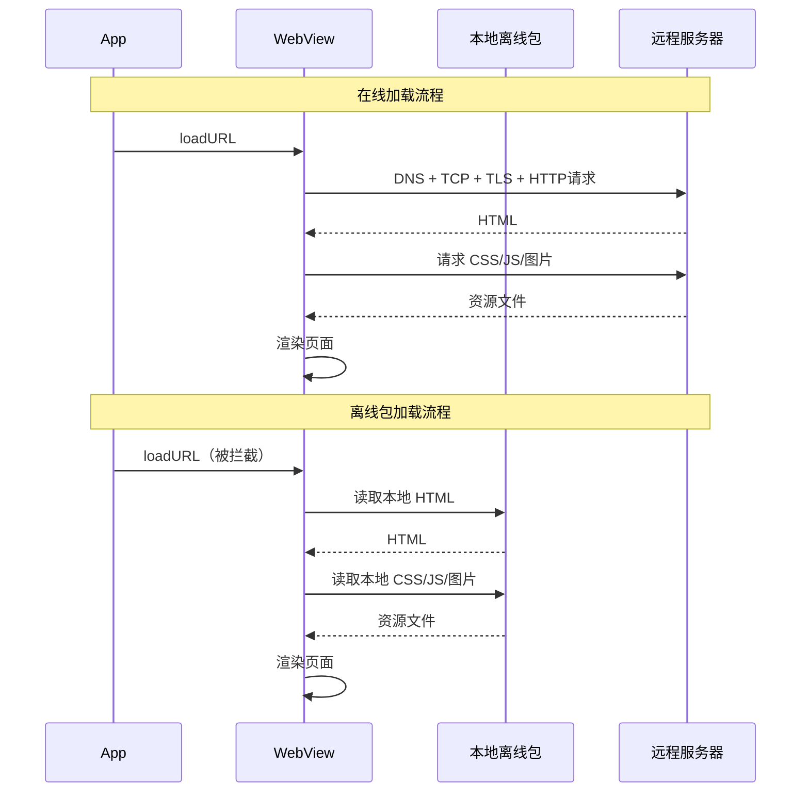
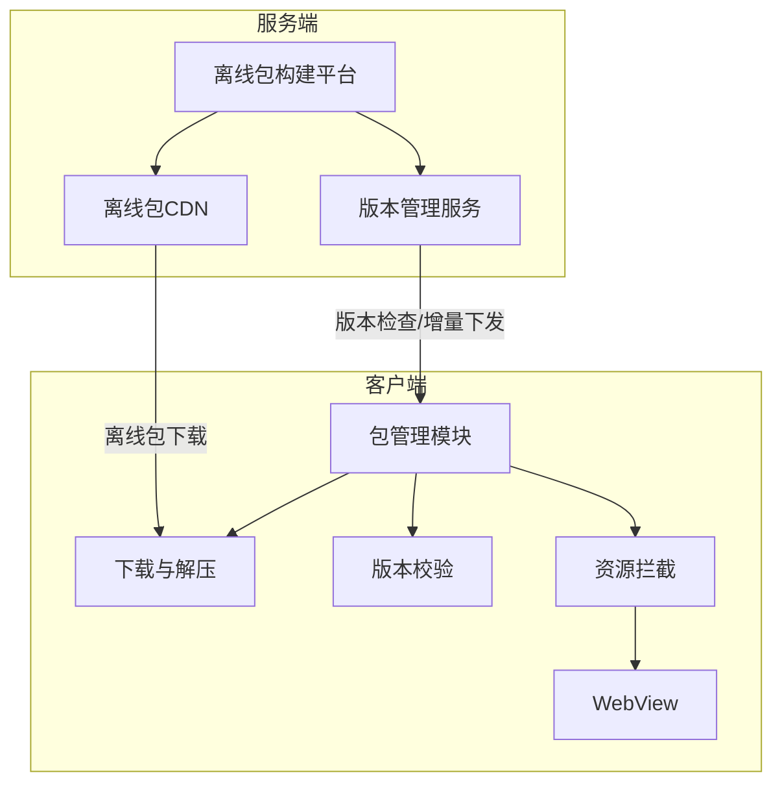
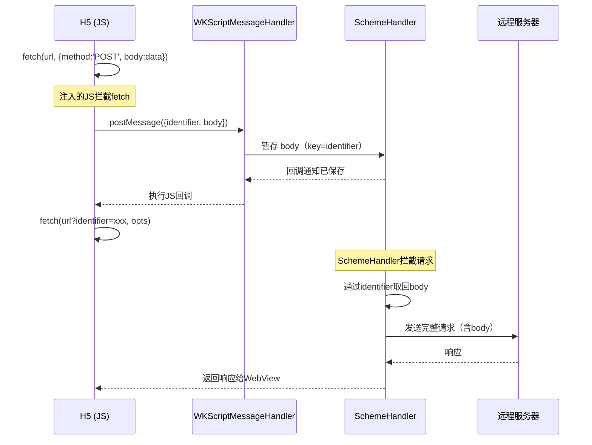
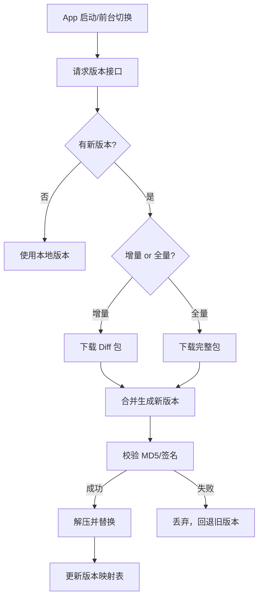
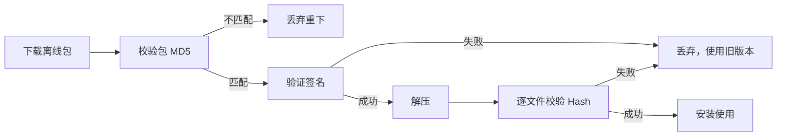
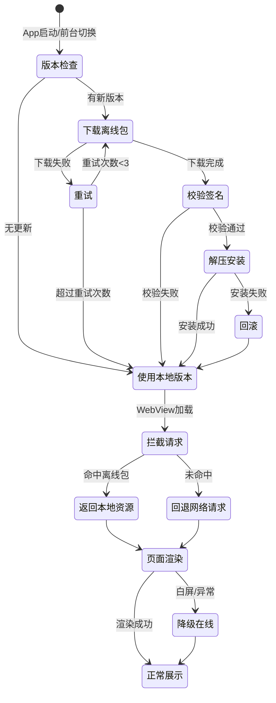

+++
title = "WebView离线包"
date = '2026-05-02T22:32:27+08:00'
draft = false
weight = 4
tags = ["iOS", "面试"]
categories = ["iOS开发", "面试"]
+++
## 背景

Hybrid 开发模式下，WebView 加载 H5 页面的体验一直是痛点。一个典型的 H5 页面加载流程涉及：初始化 WebView -> DNS 解析 -> 建立连接 -> 下载 HTML -> 解析 HTML -> 下载 CSS/JS/图片 -> 渲染页面。在弱网或首次加载场景下，白屏时间常常达到 2~5 秒，远不如 Native 体验。

**离线包**的核心思路是：将 H5 的静态资源（HTML、CSS、JS、图片、字体等）预先打包下发到客户端本地，WebView 加载时直接从本地读取资源，跳过网络请求环节，从而大幅缩短页面加载时间。

## 离线包加载 vs 在线加载



| 对比项 | 在线加载 | 离线包加载 |
|-------|---------|-----------|
| 首屏时间 | 2~5秒（弱网更久） | 0.5~1秒 |
| 网络依赖 | 强依赖 | 仅更新时需要网络 |
| 白屏问题 | 严重 | 基本消除 |
| 资源新鲜度 | 实时最新 | 有一定延迟 |
| 流量消耗 | 每次访问都消耗 | 仅增量更新消耗 |

## 整体架构

一个完整的离线包系统包含三大部分：



- **服务端**：离线包的构建、版本管理、增量 Diff 生成、CDN 分发
- **客户端**：离线包的下载、校验、存储、版本管理、资源拦截

## 资源拦截方案

资源拦截是离线包技术的核心——当 WebView 发起资源请求时，客户端拦截请求并返回本地离线资源。iOS 上有三种主要方案。

### 方案一：NSURLProtocol

NSURLProtocol 是 Apple 提供的 URL 加载系统的扩展点，可以拦截 App 内几乎所有的网络请求。

```swift
class OfflineResourceProtocol: URLProtocol {

    override class func canInit(with request: URLRequest) -> Bool {
        guard let url = request.url else { return false }
        return OfflinePackManager.shared.hasLocalResource(for: url)
    }

    override class func canonicalRequest(for request: URLRequest) -> URLRequest {
        return request
    }

    override func startLoading() {
        guard let url = request.url,
              let data = OfflinePackManager.shared.loadLocalResource(for: url) else {
            let error = NSError(domain: "OfflinePack", code: 404)
            client?.urlProtocol(self, didFailWithError: error)
            return
        }

        let mimeType = MIMETypeUtil.mimeType(for: url.pathExtension)
        let response = URLResponse(
            url: url,
            mimeType: mimeType,
            expectedContentLength: data.count,
            textEncodingName: "utf-8"
        )
        client?.urlProtocol(self, didReceive: response, cacheStoragePolicy: .notAllowed)
        client?.urlProtocol(self, didLoad: data)
        client?.urlProtocolDidFinishLoading(self)
    }

    override func stopLoading() {}
}
```

**注册方式：**

WKWebView 不能直接使用 NSURLProtocol，需要借助私有 API 注册：

```swift
let cls: AnyClass = NSClassFromString("WKBrowsingContextController")!
let sel = NSSelectorFromString("registerSchemeForCustomProtocol:")
if cls.responds(to: sel) {
    _ = (cls as AnyObject).perform(sel, with: "https")
    _ = (cls as AnyObject).perform(sel, with: "http")
}
URLProtocol.registerClass(OfflineResourceProtocol.self)
```

**优缺点：**

| 优点 | 缺点 |
|------|------|
| 拦截范围广，支持所有请求 | WKWebView 需使用私有 API，有审核风险 |
| 实现简单，代码量少 | 拦截后丢失 HTTP Body（POST 请求问题） |
| 对前端透明 | 性能有一定损耗（跨进程通信） |

### 方案二：WKURLSchemeHandler（iOS 11+）

WKURLSchemeHandler 是 Apple 为 WKWebView 提供的官方拦截 API。默认情况下，调用 `setURLSchemeHandler(_:forURLScheme:)` 注册 `http`/`https` 会触发 `NSInvalidArgumentException`，因为内部调用 `WKWebView.handlesURLScheme(_:)` 检查时，http/https 返回 `true` 表示"系统已处理"从而拒绝注册。

如果不绕过这个限制，就只能使用自定义 Scheme（如 `exampleApp://`），需要前端配合改造 URL，并且会带来 CORS 跨域、Cookie/LocalStorage 域不一致等一系列问题。因此实际项目中更推荐通过 Hook 直接拦截 http/https。

#### Hook handlesURLScheme 拦截 http/https

通过 Method Swizzling Hook `WKWebView.handlesURLScheme(_:)` 类方法，当 scheme 为 `http` 或 `https` 时返回 `false`，绕过系统校验，使 `setURLSchemeHandler` 能成功注册 http/https：

```swift
extension WKWebView {
    static let httpSchemes = ["http", "https"]

    static func hookHandlesURLScheme() -> Bool {
        guard
            let originalMethod = class_getClassMethod(self, #selector(handlesURLScheme(_:))),
            let swizzledMethod = class_getClassMethod(self, #selector(swizzled_handlesURLScheme(_:))),
            let metaClass: AnyClass = object_getClass(self)
        else { return false }

        let originalIMP = method_getImplementation(originalMethod)
        let swizzledIMP = method_getImplementation(swizzledMethod)

        class_addMethod(metaClass, #selector(handlesURLScheme(_:)), originalIMP, method_getTypeEncoding(originalMethod))
        class_addMethod(metaClass, #selector(swizzled_handlesURLScheme(_:)), swizzledIMP, method_getTypeEncoding(swizzledMethod))

        guard
            let m1 = class_getClassMethod(self, #selector(handlesURLScheme(_:))),
            let m2 = class_getClassMethod(self, #selector(swizzled_handlesURLScheme(_:)))
        else { return false }
        method_exchangeImplementations(m1, m2)
        return true
    }

    @objc class func swizzled_handlesURLScheme(_ urlScheme: String) -> Bool {
        if httpSchemes.contains(urlScheme) {
            return false  // 骗过系统校验，允许注册 http/https 的 SchemeHandler
        }
        return swizzled_handlesURLScheme(urlScheme)  // 交换后实际调用原方法
    }
}
```

Hook 成功后就可以直接对 http/https 注册 SchemeHandler。拦截到的 URL 就是原始的 http/https URL，SchemeHandler 内部直接用这个 URL 查找本地离线资源，未命中则用 URLSession/Alamofire 转发网络请求，无需做任何 Scheme 映射：

```swift
// App 启动时调用一次
WKWebView.hookHandlesURLScheme()

// SchemeHandler 实现——直接处理原始 http/https 请求
class OfflineHTTPSchemeHandler: NSObject, WKURLSchemeHandler {

    func webView(_ webView: WKWebView, start urlSchemeTask: WKURLSchemeTask) {
        guard let url = urlSchemeTask.request.url else {
            urlSchemeTask.didFailWithError(NSError(domain: "OfflinePack", code: 400))
            return
        }

        // URL 就是原始 https://，直接查找本地离线资源
        if let localData = OfflinePackManager.shared.loadLocalResource(for: url) {
            let mimeType = MIMETypeUtil.mimeType(for: url.pathExtension)
            let response = HTTPURLResponse(
                url: url, statusCode: 200, httpVersion: "HTTP/1.1",
                headerFields: [
                    "Content-Type": mimeType,
                    "Access-Control-Allow-Origin": "*"
                ]
            )!
            urlSchemeTask.didReceive(response)
            urlSchemeTask.didReceive(localData)
            urlSchemeTask.didFinish()
        } else {
            // 未命中离线包，转发网络请求
            forwardToNetwork(urlSchemeTask: urlSchemeTask)
        }
    }

    func webView(_ webView: WKWebView, stop urlSchemeTask: WKURLSchemeTask) {
        // 取消进行中的网络请求...
    }

    private func forwardToNetwork(urlSchemeTask: WKURLSchemeTask) {
        let request = urlSchemeTask.request
        URLSession.shared.dataTask(with: request) { data, response, error in
            if let error = error {
                urlSchemeTask.didFailWithError(error)
                return
            }
            if let response = response { urlSchemeTask.didReceive(response) }
            if let data = data { urlSchemeTask.didReceive(data) }
            urlSchemeTask.didFinish()
        }.resume()
    }
}

// 创建 WebView 时注册
let config = WKWebViewConfiguration()
let handler = OfflineHTTPSchemeHandler()
config.setURLSchemeHandler(handler, forURLScheme: "http")
config.setURLSchemeHandler(handler, forURLScheme: "https")
let webView = WKWebView(frame: .zero, configuration: config)
// 直接加载原始 URL，前端零改造
webView.load(URLRequest(url: URL(string: "https://www.example.com/page.html")!))
```

这种方案对前端完全透明，没有自定义 Scheme 带来的 CORS、Cookie、LocalStorage 等问题。但本质上使用了 Swizzling 修改系统行为，属于"灰色地带"（非私有 API，但改变了系统方法的行为）。

#### POST Body 丢失的解决

拦截 http/https 后同样存在 POST Body 丢失问题（WKWebView 网络进程与 App 进程隔离，Body 流无法跨进程传递）。解决方案是在前端注入 JS 脚本，Hook `fetch` 和 `XMLHttpRequest`，在发送 POST 请求前先通过 `WKScriptMessageHandler` 将 Body 传递给 Native 暂存，然后在 SchemeHandler 拦截到请求时从暂存中取回 Body：



前端注入脚本的核心逻辑：

```javascript
var nativeFetch = window.fetch;

window.fetch = function(url, opts) {
    var hasBody = opts && opts.method &&
        ['POST', 'PUT', 'PATCH', 'DELETE'].indexOf(opts.method.toUpperCase()) !== -1;
    if (hasBody && opts.body) {
        // 生成唯一标识
        var identifier = generateUUID();
        // 先将 body 通过 Bridge 发给 Native 暂存
        return saveBodyToNative(url, opts.body, identifier).then(function(newUrl) {
            // newUrl 已追加 identifier 参数
            return nativeFetch(newUrl, opts);
        });
    }
    return nativeFetch(url, opts);
};

function saveBodyToNative(url, body, identifier) {
    return new Promise(function(resolve) {
        var newUrl = url + (url.indexOf('?') !== -1 ? '&' : '?')
            + 'identifier=' + encodeURIComponent(identifier);
        // 序列化 body（支持 string/Blob/FormData/ArrayBuffer）
        getBodyString(body, function(serializedBody, type) {
            var callbackName = generateUUID();
            window[callbackName] = function() {
                delete window[callbackName];
                resolve(newUrl);
            };
            window.webkit.messageHandlers.passPostBody.postMessage(
                JSON.stringify({ identifier: identifier, cb: callbackName, body: serializedBody, type: type })
            );
        });
    });
}
```

Native 端通过 `WKUserScript` 在页面加载前注入此脚本，并注册 `WKScriptMessageHandler` 接收 body 数据：

```swift
// 注入 JS 拦截脚本
configuration.userContentController.addUserScript(WKUserScript(
    source: injectionScript,
    injectionTime: .atDocumentStart,
    forMainFrameOnly: true
))

// 注册 Bridge 接收 POST body
configuration.userContentController.add(
    PostBodyMessageHandler(schemeHandler: schemeHandler),
    name: "passPostBody"
)
```

SchemeHandler 在处理请求时，通过 URL 中的 `identifier` 参数取回之前暂存的 body：

```swift
func processRequestIfNeeded(_ request: URLRequest) -> URLRequest {
    var request = request
    guard
        let url = request.url,
        let components = URLComponents(url: url, resolvingAgainstBaseURL: false),
        let identifier = components.queryItems?.first(where: { $0.name == "identifier" })?.value,
        let body = bodyDictionary.removeValue(forKey: identifier)
    else { return request }

    switch body {
    case .string(let str):
        request.httpBody = str.data(using: .utf8)
    case .base64(let base64):
        request.httpBody = Data(base64Encoded: base64)
    case .multipart(let items):
        let formData = MultipartFormData()
        for item in items {
            if item.type == "Blob", let data = Data(base64Encoded: item.value) {
                formData.append(data, withName: item.key, fileName: item.fileName, mimeType: item.mime)
            } else if let data = item.value.data(using: .utf8) {
                formData.append(data, withName: item.key)
            }
        }
        request.httpBody = try? formData.encode()
        request.setValue(formData.contentType, forHTTPHeaderField: "Content-Type")
    }
    return request
}
```

#### 优缺点

| 优点 | 缺点 |
|------|------|
| Apple 官方 API，WKWebView 原生支持 | 默认只能拦截自定义 Scheme |
| 无跨进程通信开销 | 自定义 Scheme 有 CORS/Cookie 问题 |
| Hook 后可拦截 http/https，前端零改造 | Hook handlesURLScheme 属于灰色地带 |
| POST Body 可通过 JS Bridge 方案解决 | POST Body 方案需注入 JS，增加复杂度 |
| iOS 11+ 可用 | - |

### 方案三：本地 HTTP Server

在 App 内启动一个轻量级 HTTP Server（如 GCDWebServer、Swifter），将离线资源通过本地 HTTP 服务对外提供。

```swift
import GCDWebServer

class LocalServer {

    private let server = GCDWebServer()

    func start() {
        server.addDefaultHandler(forMethod: "GET", request: GCDWebServerRequest.self) {
            [weak self] request in
            return self?.handleRequest(request)
        }
        try? server.start(withPort: 8080, bonjourName: nil)
    }

    private func handleRequest(_ request: GCDWebServerRequest) -> GCDWebServerResponse? {
        let path = request.path
        guard let data = OfflinePackManager.shared.loadLocalResource(forPath: path) else {
            return GCDWebServerResponse(statusCode: 404)
        }
        let mimeType = MIMETypeUtil.mimeType(for: (path as NSString).pathExtension)
        return GCDWebServerDataResponse(data: data, contentType: mimeType)
    }
}

// 使用时 WebView 加载 localhost 地址
webView.load(URLRequest(url: URL(string: "http://localhost:8080/page.html")!))
```

**优缺点：**

| 优点 | 缺点 |
|------|------|
| 不依赖任何私有 API | 需要维护本地 Server 的生命周期 |
| 对前端完全透明（标准 HTTP） | 端口冲突风险 |
| 无跨域问题 | 安全性需要额外考虑（防止外部访问） |
| 支持完整的 HTTP 语义 | 引入第三方依赖（GCDWebServer 等） |

### 方案对比

| 维度 | NSURLProtocol | SchemeHandler（自定义 Scheme） | SchemeHandler（Hook http/https） | 本地 HTTP Server |
|------|--------------|---------------------------|-------------------------------|-----------------|
| 审核风险 | 高（私有 API） | 无 | 低（Swizzling，非私有 API） | 无 |
| 拦截能力 | http/https 均可 | 仅自定义 Scheme | http/https 均可 | http（本地） |
| 前端改造 | 无需 | 需改 Scheme | 无需 | 需改 Host |
| POST Body | 丢失 | 完整 | 需 JS Bridge 方案 | 完整 |
| CORS/Cookie | 无问题 | 需额外处理 | 无问题 | 无问题 |
| 性能 | 有跨进程开销 | 好 | 好 | 好 |
| 兼容性 | 全版本 | iOS 11+ | iOS 11+ | 全版本 |
| 推荐场景 | 兼容老项目 | 无法 Hook 的场景 | **新项目首选** | 需要完整 HTTP 语义 |

## 版本管理与增量更新

### 版本号设计

每个离线包有独立的版本号，推荐使用递增整数或语义化版本：

```
bizA_v1 -> bizA_v2 -> bizA_v3
```

客户端维护一份本地版本映射表：

```json
{
    "packages": {
        "bizA": {
            "version": 3,
            "md5": "a1b2c3d4e5f6",
            "path": "/offline/bizA/v3/",
            "updateTime": "2025-03-20T10:00:00Z"
        },
        "bizB": {
            "version": 5,
            "md5": "f6e5d4c3b2a1",
            "path": "/offline/bizB/v5/",
            "updateTime": "2025-03-19T08:30:00Z"
        }
    }
}
```

### 更新策略



### 增量更新（Diff 方案）

全量更新在离线包较大时浪费带宽。增量更新只下发变更的部分：

| 增量方式 | 原理 | 适用场景 |
|---------|------|---------|
| BSDiff | 二进制 Diff，生成旧版本到新版本的差异补丁 | 单个大文件变更 |
| 文件级 Diff | 只下发新增和修改的文件列表 | 多文件、小改动场景 |
| 自定义格式 | 按文件 Hash 比对，打包变更文件 | 通用场景 |

**文件级 Diff 实现示例：**

服务端生成 Diff 包时，对比新旧版本的文件清单：

```json
{
    "fromVersion": 2,
    "toVersion": 3,
    "added": ["new_page.html", "new_style.css"],
    "modified": ["index.js"],
    "deleted": ["old_page.html"],
    "files": {
        "new_page.html": { "md5": "abc123", "size": 2048 },
        "new_style.css": { "md5": "def456", "size": 512 },
        "index.js": { "md5": "ghi789", "size": 4096 }
    }
}
```

客户端收到 Diff 包后：

```swift
class DiffMerger {

    func applyDiff(basePath: String, diffManifest: DiffManifest, diffArchivePath: String) throws {
        for file in diffManifest.deleted {
            try FileManager.default.removeItem(atPath: basePath + "/" + file)
        }

        let tempDir = NSTemporaryDirectory() + UUID().uuidString
        try ZipArchive.unzip(diffArchivePath, to: tempDir)

        for file in diffManifest.added + diffManifest.modified {
            let source = tempDir + "/" + file
            let dest = basePath + "/" + file

            let destDir = (dest as NSString).deletingLastPathComponent
            try FileManager.default.createDirectory(
                atPath: destDir,
                withIntermediateDirectories: true
            )

            if FileManager.default.fileExists(atPath: dest) {
                try FileManager.default.removeItem(atPath: dest)
            }
            try FileManager.default.moveItem(atPath: source, toPath: dest)
        }

        try? FileManager.default.removeItem(atPath: tempDir)
    }
}
```

## 安全校验

离线包从服务端下发到客户端，涉及传输安全和内容完整性校验。

### 校验流程



### 签名验证

服务端使用私钥对离线包进行签名，客户端使用公钥验证：

```swift
class PackageVerifier {

    static func verify(packageData: Data, signature: Data, publicKey: SecKey) -> Bool {
        var error: Unmanaged<CFError>?
        let result = SecKeyVerifySignature(
            publicKey,
            .rsaSignatureMessagePKCS1v15SHA256,
            packageData as CFData,
            signature as CFData,
            &error
        )
        return result
    }

    static func verifyFileIntegrity(directory: String, manifest: [String: String]) -> Bool {
        for (file, expectedMD5) in manifest {
            let filePath = directory + "/" + file
            guard let data = FileManager.default.contents(atPath: filePath) else {
                return false
            }
            let actualMD5 = data.md5String()
            if actualMD5 != expectedMD5 {
                return false
            }
        }
        return true
    }
}
```

## 预加载与预热

### WebView 预热

WebView 首次初始化耗时较长（200~500ms），可以提前创建并复用：

```swift
class WebViewPool {

    static let shared = WebViewPool()
    private var pool: [WKWebView] = []
    private let lock = NSLock()

    func preload(count: Int = 2) {
        // WKWebView 必须在主线程创建
        DispatchQueue.main.async { [weak self] in
            guard let self = self else { return }
            for _ in 0..<count {
                let config = WKWebViewConfiguration()
                config.setURLSchemeHandler(OfflineSchemeHandler(), forURLScheme: "exampleApp")
                let webView = WKWebView(frame: .zero, configuration: config)
                webView.loadHTMLString("<html></html>", baseURL: nil)
                self.lock.lock()
                self.pool.append(webView)
                self.lock.unlock()
            }
        }
    }

    func dequeue() -> WKWebView? {
        lock.lock()
        defer { lock.unlock() }
        guard !pool.isEmpty else { return nil }
        return pool.removeFirst()
    }

    func recycle(_ webView: WKWebView) {
        webView.loadHTMLString("<html></html>", baseURL: nil)
        lock.lock()
        pool.append(webView)
        lock.unlock()
    }
}
```

### 离线包预加载时机

| 时机 | 说明 | 优先级 |
|------|------|-------|
| App 冷启动 | 检查核心业务离线包版本，静默更新 | 高 |
| 前后台切换 | 回到前台时检查更新 | 中 |
| Push 触发 | 服务端推送更新通知，触发下载 | 高 |
| Wi-Fi 环境 | Wi-Fi 下预下载非核心离线包 | 低 |
| 页面访问前 | 用户进入某入口前预加载对应包 | 中 |

## 离线包存储设计

### 目录结构

```
Documents/OfflinePacks/
├── manifest.json          // 全局版本映射表
├── bizA/
│   ├── v3/
│   │   ├── index.html
│   │   ├── css/
│   │   ├── js/
│   │   └── images/
│   └── meta.json          // 包元数据
├── bizB/
│   ├── v5/
│   │   └── ...
│   └── meta.json
└── temp/                  // 下载临时目录
```

### 存储管理

```swift
class StorageManager {

    private let maxStorageSize: UInt64 = 200 * 1024 * 1024 // 200MB
    private let basePath: String

    init() {
        let docs = NSSearchPathForDirectoriesInDomains(.documentDirectory, .userDomainMask, true)[0]
        basePath = docs + "/OfflinePacks"
    }

    func cleanup() {
        let currentSize = calculateDirectorySize(basePath)
        guard currentSize > maxStorageSize else { return }

        let packages = loadAllPackageMeta().sorted { $0.lastAccessTime < $1.lastAccessTime }
        var freedSize: UInt64 = 0
        let targetFree = currentSize - maxStorageSize / 2

        for package in packages {
            guard !package.isCore else { continue }
            try? FileManager.default.removeItem(atPath: package.path)
            freedSize += package.size
            if freedSize >= targetFree { break }
        }
    }

    private func calculateDirectorySize(_ path: String) -> UInt64 {
        let enumerator = FileManager.default.enumerator(atPath: path)
        var size: UInt64 = 0
        while let file = enumerator?.nextObject() as? String {
            let fullPath = path + "/" + file
            if let attrs = try? FileManager.default.attributesOfItem(atPath: fullPath) {
                size += attrs[.size] as? UInt64 ?? 0
            }
        }
        return size
    }

    private func loadAllPackageMeta() -> [PackageMeta] {
        // 从各 bizX/meta.json 加载元数据
        return []
    }
}
```

## 避坑指南

### 1. WKURLSchemeHandler 的 CORS 问题（自定义 Scheme 场景）

**问题**：使用自定义 Scheme（如 `exampleApp://`）时，H5 页面中的 AJAX 请求（fetch/XMLHttpRequest）会因为跨域策略被浏览器拦截。自定义 Scheme 发出的请求被视为跨域请求，即使目标是同一个业务域名。如果通过 Hook `handlesURLScheme` 直接拦截 http/https，则不存在此问题。

**解决**：在 WKURLSchemeHandler 返回的 Response Header 中添加 CORS 头：

```swift
let headers: [String: String] = [
    "Access-Control-Allow-Origin": "*",
    "Access-Control-Allow-Methods": "GET, POST, PUT, DELETE, OPTIONS",
    "Access-Control-Allow-Headers": "Content-Type, Authorization",
    "Content-Type": mimeType
]
let response = HTTPURLResponse(
    url: url,
    statusCode: 200,
    httpVersion: "HTTP/1.1",
    headerFields: headers
)!
```

同时需要处理 OPTIONS 预检请求：

```swift
if request.httpMethod == "OPTIONS" {
    let response = HTTPURLResponse(
        url: url, statusCode: 204, httpVersion: "HTTP/1.1",
        headerFields: corsHeaders
    )!
    urlSchemeTask.didReceive(response)
    urlSchemeTask.didReceive(Data())
    urlSchemeTask.didFinish()
    return
}
```

### 2. NSURLProtocol 丢失 POST Body

**问题**：通过 NSURLProtocol 拦截 WKWebView 的请求时，POST 请求的 HTTP Body 会丢失。这是因为 WKWebView 的网络请求运行在独立进程（Network Process）中，HTTP Body 以流的形式传输，跨进程后无法通过 NSURLProtocol 获取。

**解决**：在前端将 POST Body 注入到 URL 参数或自定义 Header 中，通过 JS Bridge 将请求转发给 Native 处理：

```javascript
// 前端 Hook fetch，将 POST 请求通过 Bridge 发送
const originalFetch = window.fetch;
window.fetch = function(url, options) {
    if (options && options.method === 'POST') {
        return window.webkit.messageHandlers.networkBridge.postMessage({
            url: url,
            method: 'POST',
            headers: options.headers,
            body: options.body
        });
    }
    return originalFetch.apply(this, arguments);
};
```

### 3. MIME Type 不正确导致资源加载失败

**问题**：返回本地资源时如果 MIME Type 不正确，WebView 可能拒绝加载。常见表现为 CSS 不生效、JS 不执行、图片不显示。

**解决**：维护完整的文件后缀到 MIME Type 的映射表：

```swift
struct MIMETypeUtil {
    private static let mimeTypes: [String: String] = [
        "html": "text/html",
        "htm": "text/html",
        "css": "text/css",
        "js": "application/javascript",
        "mjs": "application/javascript",
        "json": "application/json",
        "png": "image/png",
        "jpg": "image/jpeg",
        "jpeg": "image/jpeg",
        "gif": "image/gif",
        "svg": "image/svg+xml",
        "webp": "image/webp",
        "woff": "font/woff",
        "woff2": "font/woff2",
        "ttf": "font/ttf",
        "mp4": "video/mp4",
        "webm": "video/webm",
    ]

    static func mimeType(for ext: String) -> String {
        return mimeTypes[ext.lowercased()] ?? "application/octet-stream"
    }
}
```

### 4. 离线包更新的原子性

**问题**：解压/替换过程中如果 App 被杀或崩溃，可能导致离线包文件不完整，页面加载异常（部分旧文件 + 部分新文件）。

**解决**：采用"先解压到临时目录，校验通过后原子切换"的策略：

```swift
func installPackage(zipPath: String, targetBizID: String) throws {
    let tempDir = basePath + "/temp/" + UUID().uuidString
    try ZipArchive.unzip(zipPath, to: tempDir)

    // 校验完整性
    guard verifyIntegrity(directory: tempDir) else {
        try? FileManager.default.removeItem(atPath: tempDir)
        throw OfflinePackError.integrityCheckFailed
    }

    let currentDir = basePath + "/" + targetBizID + "/current"
    let backupDir = basePath + "/" + targetBizID + "/backup"

    // 备份旧版本
    if FileManager.default.fileExists(atPath: currentDir) {
        try? FileManager.default.removeItem(atPath: backupDir)
        try FileManager.default.moveItem(atPath: currentDir, toPath: backupDir)
    }

    // 原子切换：rename 是文件系统级别的原子操作
    try FileManager.default.moveItem(atPath: tempDir, toPath: currentDir)

    // 切换成功后删除备份
    try? FileManager.default.removeItem(atPath: backupDir)
}
```

### 5. Cookie 和 Storage 在自定义 Scheme 下失效（自定义 Scheme 场景）

**问题**：使用自定义 Scheme（如 `exampleApp://`）时，WebView 的 Cookie、LocalStorage、SessionStorage 的域与原始 HTTPS 域不同，导致登录态丢失、缓存数据读取不到。如果通过 Hook `handlesURLScheme` 直接拦截 http/https，URL 不变，不存在此问题。

**解决方案**：

- **方案一**：通过 JS Bridge 将 Cookie 从 Native 注入到 WebView：

```swift
func syncCookies(to webView: WKWebView) {
    let cookies = HTTPCookieStorage.shared.cookies ?? []
    let script = cookies.map { "document.cookie='\($0.name)=\($0.value); path=/';" }
        .joined(separator: "\n")
    webView.evaluateJavaScript(script)
}
```

- **方案二**：用 Native KV 存储替代 LocalStorage，前端通过 Bridge 读写：

```javascript
// 前端替换 localStorage
window.localStorage = {
    getItem: (key) => bridge.call('storage.get', { key }),
    setItem: (key, value) => bridge.call('storage.set', { key, value }),
    removeItem: (key) => bridge.call('storage.remove', { key })
};
```

### 6. 资源路径问题

**问题**：H5 代码中的资源引用使用绝对路径（如 `/static/js/app.js`）或相对路径（如 `./images/logo.png`），在离线包环境下路径映射可能失败。

**解决**：

- 前端构建时统一使用相对路径或 CDN 完整路径
- 拦截层做路径标准化处理：

```swift
func normalizeURL(_ url: URL) -> URL? {
    var path = url.path
    // 移除多余的斜杠
    while path.contains("//") {
        path = path.replacingOccurrences(of: "//", with: "/")
    }
    // 处理 query 参数中的 hash（前端框架常见）
    if let fragment = url.fragment, path.isEmpty || path == "/" {
        path = "/" + fragment
    }
    var components = URLComponents(url: url, resolvingAgainstBaseURL: false)
    components?.path = path
    return components?.url
}
```

### 7. WKURLSchemeHandler 提前被释放导致崩溃

**问题**：`WKURLSchemeTask` 的回调方法（`didReceive`/`didFinish`/`didFailWithError`）在异步场景下，如果 task 已经被 WebView 取消（用户快速返回、页面跳转），继续调用会触发 Crash：`NSInternalInconsistencyException`。

**解决**：维护一个活跃 task 集合，在回调前检查 task 是否仍然有效：

```swift
class SafeSchemeHandler: NSObject, WKURLSchemeHandler {

    private var activeTasks = Set<ObjectIdentifier>()
    private let lock = NSLock()

    func webView(_ webView: WKWebView, start urlSchemeTask: WKURLSchemeTask) {
        let taskID = ObjectIdentifier(urlSchemeTask as AnyObject)
        lock.lock()
        activeTasks.insert(taskID)
        lock.unlock()

        loadResourceAsync(for: urlSchemeTask) { [weak self] data, response, error in
            guard let self = self else { return }

            self.lock.lock()
            let isActive = self.activeTasks.contains(taskID)
            self.lock.unlock()

            guard isActive else { return }

            if let error = error {
                urlSchemeTask.didFailWithError(error)
            } else {
                if let response = response { urlSchemeTask.didReceive(response) }
                if let data = data { urlSchemeTask.didReceive(data) }
                urlSchemeTask.didFinish()
            }
        }
    }

    func webView(_ webView: WKWebView, stop urlSchemeTask: WKURLSchemeTask) {
        let taskID = ObjectIdentifier(urlSchemeTask as AnyObject)
        lock.lock()
        activeTasks.remove(taskID)
        lock.unlock()
    }

    private func loadResourceAsync(
        for task: WKURLSchemeTask,
        completion: @escaping (Data?, URLResponse?, Error?) -> Void
    ) {
        guard let url = task.request.url else {
            completion(nil, nil, NSError(domain: "OfflinePack", code: -1))
            return
        }
        DispatchQueue.global().async {
            let data = OfflinePackManager.shared.loadLocalResource(for: url)
            let mimeType = MIMETypeUtil.mimeType(for: url.pathExtension)
            let response = HTTPURLResponse(
                url: url, statusCode: 200, httpVersion: "HTTP/1.1",
                headerFields: ["Content-Type": mimeType]
            )
            completion(data, response, nil)
        }
    }
}
```

### 8. 离线包降级策略

**问题**：离线包本身有 Bug（前端代码错误、资源缺失）时，用户会看到白屏或异常页面，而且无法像在线页面一样通过服务端回滚快速修复。

**解决**：建立完善的降级机制：

```swift
class FallbackManager {

    private let maxRetryCount = 2

    func loadPage(bizID: String, webView: WKWebView) {
        let retryCount = getRetryCount(bizID: bizID)
        if retryCount >= maxRetryCount {
            // 超过重试次数，降级到在线模式
            loadOnline(bizID: bizID, webView: webView)
            reportOfflineFailure(bizID: bizID)
            return
        }

        loadOffline(bizID: bizID, webView: webView)
    }

    func onPageLoadFailed(bizID: String) {
        incrementRetryCount(bizID: bizID)
    }

    func onPageLoadSuccess(bizID: String) {
        resetRetryCount(bizID: bizID)
    }

    private func loadOnline(bizID: String, webView: WKWebView) {
        guard let url = URL(string: "https://h5.example.com/\(bizID)/") else { return }
        webView.load(URLRequest(url: url))
    }

    private func loadOffline(bizID: String, webView: WKWebView) {
        // 加载离线包资源
    }

    private func getRetryCount(bizID: String) -> Int { return 0 }
    private func incrementRetryCount(bizID: String) {}
    private func resetRetryCount(bizID: String) {}
    private func reportOfflineFailure(bizID: String) {}
}
```

降级策略要点：

- 页面加载失败（白屏检测、JS Error 监控）时记录失败次数
- 连续失败超过阈值自动切换到在线模式
- 服务端可通过配置下发强制降级指令
- 新版本离线包发布后自动重置降级状态


## 白屏检测

离线包场景下白屏检测尤为重要，用于触发降级：

```swift
extension WKWebView {

    func checkBlankScreen(completion: @escaping (Bool) -> Void) {
        let js = """
        (function() {
            var root = document.body || document.documentElement;
            if (!root) return true;
            var text = root.innerText || '';
            if (text.trim().length > 0) return false;
            var visibleElements = document.querySelectorAll(
                'img, canvas, video, svg, input, textarea, [style*="background"]'
            );
            for (var i = 0; i < visibleElements.length; i++) {
                var rect = visibleElements[i].getBoundingClientRect();
                if (rect.width > 0 && rect.height > 0) return false;
            }
            return true;
        })()
        """
        evaluateJavaScript(js) { result, _ in
            completion(result as? Bool ?? true)
        }
    }
}
```

## 性能数据采集

离线包的效果需要数据验证：

| 指标 | 说明 | 采集方式 |
|------|------|---------|
| 离线命中率 | 命中本地资源的请求占比 | 拦截层统计 |
| 首屏时间 | 页面可见所需时间 | JS Performance API |
| 包下载成功率 | 离线包下载成功率 | 下载模块埋点 |
| 包安装成功率 | 解压 + 校验通过率 | 安装模块埋点 |
| 降级率 | 回退到在线加载的比例 | 降级模块埋点 |
| 白屏率 | 页面白屏占比 | 白屏检测模块 |

首屏时间采集示例（前端）：

```javascript
// H5 页面中上报首屏时间
window.addEventListener('load', function() {
    var timing = performance.timing;
    var metrics = {
        dnsTime: timing.domainLookupEnd - timing.domainLookupStart,
        tcpTime: timing.connectEnd - timing.connectStart,
        firstByte: timing.responseStart - timing.requestStart,
        domReady: timing.domContentLoadedEventEnd - timing.navigationStart,
        loadComplete: timing.loadEventEnd - timing.navigationStart,
        isOffline: window.__OFFLINE_MODE__ || false
    };
    // 通过 Bridge 上报 Native
    window.webkit.messageHandlers.performance.postMessage(metrics);
});
```

## 完整生命周期



## 总结

### 资源拦截方案选型

**方案一：NSURLProtocol（不推荐）**

通过注册 URLProtocol 子类拦截请求，重写 `canInit(with:)` 判断拦截、`startLoading()` 返回本地资源。但 WKWebView 的请求运行在独立 Network Process 中，默认不走 App 的 URL Loading System，需要调用私有 API `WKBrowsingContextController.registerSchemeForCustomProtocol:` 才能生效，有审核风险。且跨进程隔离导致 POST Body 丢失，性能也有跨进程通信开销。仅适合 UIWebView 时代老项目兼容。

**方案二：WKURLSchemeHandler + 自定义 Scheme（不推荐）**

`WKURLSchemeHandler`（iOS 11+）是 Apple 官方拦截协议，核心是两个方法：`webView(_:start:)` 收到请求时通过 `WKURLSchemeTask` 三步回调（`didReceive(response)` → `didReceive(data)` → `didFinish()`）返回数据；`webView(_:stop:)` 处理取消。通过 `WKWebViewConfiguration.setURLSchemeHandler(_:forURLScheme:)` 注册。

但默认只能注册自定义 Scheme（如 `exampleApp://`），注册 http/https 会抛异常。使用自定义 Scheme 需要前端改造 URL，且 scheme 变了导致 Cookie/LocalStorage 域不一致、AJAX 跨域，副作用多。

**方案三：WKURLSchemeHandler + Hook handlesURLScheme（推荐）**

注册 http/https 失败的原因：`setURLSchemeHandler` 内部调用 `WKWebView.handlesURLScheme(_:)` 类方法，http/https 返回 `true` 表示"系统已处理"而拒绝注册。解决方案是 Method Swizzling 这个类方法——通过 `object_getClass` 拿到 metaclass，`class_addMethod` + `method_exchangeImplementations` 完成交换，对 http/https 返回 `false` 绕过校验。App 启动时调用一次即可。

Hook 后所有 http/https 请求都走 SchemeHandler 的 `webView(_:start:)`。Handler 用原始 URL 查找本地离线资源，命中则三步回调返回（需设置正确 Content-Type），未命中则用 URLSession/Alamofire 转发网络请求。

POST Body 丢失问题通过 JS Bridge 解决：注入脚本 Hook `fetch`/`XMLHttpRequest`，POST 请求发送前先通过 `WKScriptMessageHandler` 将 body 和唯一 identifier 传给 Native 暂存，请求 URL 追加 `?identifier=xxx`，SchemeHandler 拦截时根据 identifier 取回 body 重新组装后转发。

核心优势：前端零改造、无 CORS/Cookie 问题、无跨进程开销。灰色地带：Swizzling 公开类方法（非私有 API），主流 App 广泛使用，未因此被拒审。

**方案四：本地 HTTP Server（备选）**

App 内启动 GCDWebServer 等轻量 Server，WebView 加载 `http://localhost:port/` 地址。完整支持 HTTP 语义，无需私有 API 或 Swizzling。但需维护 Server 生命周期（前后台切换重启）、处理端口冲突（重试策略）、防止局域网访问（绑定 `127.0.0.1`），且前端需改 URL。

### 常见的坑与解决方案

**坑 1：自定义 Scheme 的 CORS 问题**。自定义 Scheme 下 AJAX 请求被视为跨域，需在 Response Header 添加 CORS 头并处理 OPTIONS 预检。Hook http/https 方案无此问题。

**坑 2：POST Body 丢失**。WKWebView Network Process 隔离导致 `httpBody` 为 nil。通过 JS Bridge 暂存 body（identifier 做 key），SchemeHandler 拦截时取回。注意处理 string/Blob/FormData/ArrayBuffer 的序列化。

**坑 3：MIME Type 错误**。Content-Type 不正确会导致 CSS 不生效、JS 不执行、图片不显示。需维护完整的后缀→MIME 映射表，兜底 `application/octet-stream`。

**坑 4：更新原子性**。解压中途 App 被杀会导致文件不完整。策略：解压到临时目录 → 逐文件校验 Hash → `rename` 原子切换 → 失败回滚备份。

**坑 5：自定义 Scheme 下 Cookie/Storage 失效**。Scheme 变了导致域不一致，登录态丢失。根本解决：用 Hook http/https 方案保持 URL 不变。

**坑 6：WKURLSchemeTask 异步回调崩溃**。task 被取消后继续回调触发 `NSInternalInconsistencyException`。维护活跃 task 集合（`Set<ObjectIdentifier>`），`start` 加入、`stop` 移除，回调前检查是否仍活跃，加锁保证线程安全。

**坑 7：资源路径映射失败**。绝对/相对路径在离线环境下映射异常。拦截层做路径标准化（去重复斜杠、处理 URL 编码、Hash 路由），前端建议用 CDN 完整路径。

**坑 8：增量包版本不匹配**。Diff 包必须基于正确的 `fromVersion`，否则合并损坏。服务端保留多版本增量包，客户端合并后校验完整性，失败则回退全量下载。

**坑 9：预加载阻塞主线程**。下载、解压、校验放后台队列。WebView 预热必须在主线程但应延迟创建，避免与启动任务竞争。

**坑 10：离线包 Bug 无法降级**。白屏检测 + JS Error 监控，连续失败超阈值自动切在线模式。服务端可远程下发强制降级指令。

**坑 11：本地 Server 端口冲突与安全**。端口重试机制 + 绑定 `127.0.0.1` 防外部访问 + 前后台切换时检测重启。
