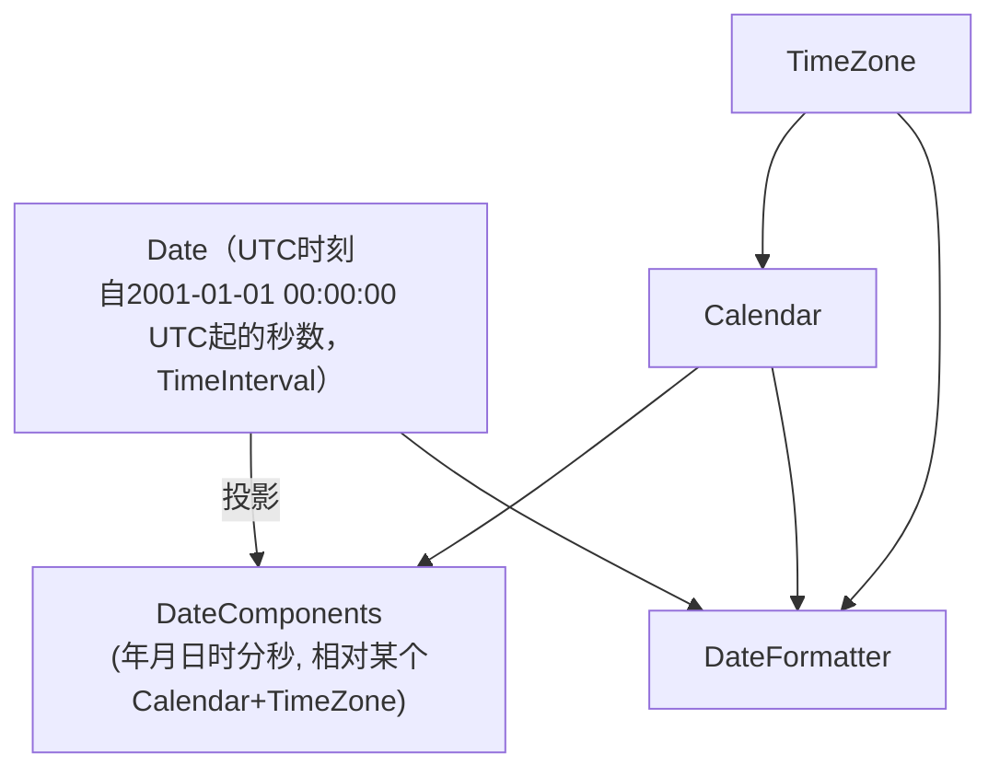
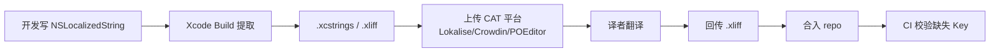

+++
title = "iOS国际化"
date = '2026-05-02T22:32:27+08:00'
draft = false
weight = 5
tags = ["iOS", "面试"]
categories = ["iOS开发", "面试"]
+++
## 前言

很多团队对"国际化"的理解停留在"把中文文案翻译成英文"，等真正把 App 推向多区域时就会发现远远不够：阿拉伯语用户看到的界面左右颠倒了，用户在纽约和东京看到的"今天"不是同一天，欧洲的小数点变成了逗号，日本用户抱怨价格里的¥符号指向人民币而不是日元，印度用户发现自己的 ₹1,23,456.78 被错误地按千分位显示成 ₹123,456.78，复数规则在俄语里比英语复杂得多，而这些问题单靠"翻译"都解决不了。

国际化（Internationalization，简称 i18n，取首末字母与中间 18 个字符）是**架构层面的能力建设**，让 App 能够适配不同语言、地区、文字方向、日历、时区、货币、单位制与文化习俗；而本地化（Localization，l10n）是针对某个具体地区的"适配落地"。两者的关系是："国际化一次，本地化 N 次"。

本文从 `NSLocale`/`Locale` 的基础模型开始，把 iOS 国际化的完整工程面梳理清楚——文案本地化、复数/性别规则、RTL 布局、多时区、多币种、单位与数字格式、图片资源、字体、App 内切换语言、测试方法，最后给出研发规范与排查清单。

## 一、基础概念：Locale、Language 与 Region

### 1.1 Locale 不等于 Language

大多数工程师第一次接触国际化时会把"语言"和"地区"混为一谈，这在 iOS 下会直接导致格式错误。

- **Language（语言）**：`zh`、`en`、`ar`、`ja`…决定 UI 文字内容。
- **Region（地区）**：`CN`、`US`、`SA`、`JP`…决定格式（日期、数字、货币、时间制 12/24h、起始星期、度量单位）。
- **Locale（语言+地区）**：两者合成一个完整的标识，如 `zh_CN`、`en_US`、`ar_SA`、`en_IN`。

一个美国人移居日本后，完全可能把 iPhone 语言设为英文，但地区设为日本。此时：

| 场景 | 期望 |
|------|------|
| UI 文案 | 英文 |
| 日期格式 | `1月23日(月)` 风格？No，应显示 `January 23 (Mon)`，因为语言决定月/星期的**名字** |
| 数字分隔符 | `,` 作千分位（与日本/美国一致） |
| 货币符号 | `¥`（JPY） |
| 温度单位 | `℃`（日本） |
| 首日周 | 周日（日本区域） |

对应的 `Locale` 是 `en_JP`——看似奇怪，但在现实中非常普遍。代码里要区分"用哪个语言去查字符串"和"用哪个 Locale 去格式化数据"：

```swift
let preferredLanguage = Locale.preferredLanguages.first ?? "en"
let currentLocale = Locale.current

let formatter = DateFormatter()
formatter.locale = currentLocale
formatter.dateStyle = .long
print(formatter.string(from: Date()))
```

不要传 `Locale(identifier: "en")` 去格式化数字，那会丢掉用户的区域偏好。

### 1.2 BCP 47 语言标签

iOS 使用 IETF BCP 47 规范标识语言，格式为 `language[-script][-region][-variant]`：

| 标识 | 含义 |
|------|------|
| `zh` | 中文（不带脚本，iOS 会根据 Region 推断简繁） |
| `zh-Hans` | 简体中文 |
| `zh-Hant` | 繁体中文 |
| `zh-Hans-CN` | 简体中文（中国大陆） |
| `zh-Hant-HK` | 繁体中文（香港） |
| `en-GB` | 英语（英国） |
| `ar-SA` | 阿拉伯语（沙特） |
| `sr-Latn` | 塞尔维亚语（拉丁字母） |
| `sr-Cyrl` | 塞尔维亚语（西里尔字母） |

**为中文添加本地化时一定要带脚本**——用 `zh-Hans` 和 `zh-Hant` 而不是 `zh-CN` 和 `zh-TW`，因为马来西亚、新加坡的中文用户使用简体，香港、澳门的部分用户使用繁体，按脚本而非国家匹配才能正确覆盖。

### 1.3 App 获取语言与地区的正确姿势

```swift
// 用户系统语言偏好列表（有序）
let preferred = Locale.preferredLanguages
// 例如：["zh-Hans-CN", "en-CN", "ja-CN"]

// App 实际可用的本地化（与 Bundle 中的 lproj 取交集）
let appLocalizations = Bundle.main.preferredLocalizations
// 例如：["zh-Hans"]，App 没有日语包时日语会被过滤掉

// 当前区域
let region = Locale.current.region?.identifier    // iOS 16+
let regionLegacy = Locale.current.regionCode      // 旧 API

// 当前语言
let lang = Locale.current.language.languageCode?.identifier // iOS 16+
let langLegacy = Locale.current.languageCode                 // 旧 API
```

注意 `Bundle.main.preferredLocalizations` 返回的是 **App 能支持的最佳匹配**。如果 App 没有提供日语本地化，即使用户系统是日语，这个数组里也不会有 `ja`，Apple 会按 Info.plist 里的 `CFBundleDevelopmentRegion` 走 fallback。这正是读取本地化文案时应当使用的语言，而不是 `Locale.preferredLanguages.first`。

## 二、文案本地化

### 2.1 两种文件：`.strings` 与 `.xcstrings`

iOS 历史上有过三代本地化文件格式：

| 格式 | 引入 | 特点 |
|------|------|------|
| `.strings` | 早期 | 键值对文本，每种语言一个文件，需要手动同步 |
| `.stringsdict` | iOS 7 | 配合 `.strings` 处理复数规则，plist 格式 |
| `.xcstrings` | Xcode 15 | String Catalog，单文件多语言，JSON 存储，Xcode 提供可视化编辑 |

新项目建议直接使用 `.xcstrings`。它的优势：

1. **单文件多语言**——所有翻译集中在一个 JSON 里，diff 友好，冲突更好解决。
2. **自动提取**——Build 阶段自动从代码 `NSLocalizedString` / SwiftUI `Text` 中抽取 Key，不需要手动维护。
3. **原生支持复数与变体**——无需再配一个 `.stringsdict`。
4. **翻译状态追踪**——可视化标识哪些翻译缺失、过期或需要审校。
5. **支持设备/语言变体**——例如同一个 Key 在手机和 iPad 上展示不同文案。

### 2.2 代码侧调用约定

iOS 里"把一段文字本地化"最终都要走到 `NSLocalizedString`（UIKit）或 `LocalizedStringKey`（SwiftUI）这两套 API，不同写法只是语法糖。

#### UIKit / Foundation：`NSLocalizedString` 的三个参数

```swift
let title = NSLocalizedString(
    "home.welcome.title",               // 1. key：查表用的唯一标识
    value: "Welcome",                   // 2. value：开发语言兜底文案
    comment: "Title on home page"       // 3. comment：给译者看的注释
)
label.text = title
```

三个参数各自的作用：

1. **key**：运行时 iOS 拿它去 `.strings` / `.xcstrings` 里查对应语言的翻译。很多老项目偷懒把中文原文当 key 用（`NSLocalizedString("欢迎", comment: "")`），能跑但不推荐——一旦设计要改"欢迎"成"你好"，所有调用点和所有语言的翻译文件都得同步改。
2. **value**：当某个语言的翻译文件里**查不到这个 key** 时用作兜底。适合在开发期先显示一个占位文案，等翻译补完再替换。不传 `value` 时 fallback 是 key 本身。
3. **comment**：只在**导出翻译文件**时出现，译者能在 CAT 平台（Lokalise/Crowdin 等）看到这段话了解语境。运行时不读它，编译后也不进入 IPA。

查表过程：

```
App 当前语言 = zh-Hans
    ↓
去 Bundle.main/zh-Hans.lproj/Localizable.strings 查 key "home.welcome.title"
    ↓
查到    → 返回 "欢迎"
查不到  → 用 value "Welcome" 兜底
value 也没有 → 返回 key 本身 "home.welcome.title"
```

对应的 `.strings` 翻译文件长这样：

```swift
// zh-Hans.lproj/Localizable.strings
"home.welcome.title" = "欢迎";

// en.lproj/Localizable.strings
"home.welcome.title" = "Welcome";

// ar.lproj/Localizable.strings
"home.welcome.title" = "أهلاً بك";
```

#### SwiftUI：`Text("...")` 为什么能直接翻译

```swift
Text("home.welcome.title")
```

看起来只是传了个字符串，其实 `Text` 的这个 init 接收的类型是 `LocalizedStringKey`——一个特殊的结构体，会把字符串字面量**自动当成本地化 key** 去查表。这行等价于：

```swift
Text(NSLocalizedString("home.welcome.title", comment: ""))
```

注意 `LocalizedStringKey` 只对**字符串字面量**生效。如果你把一个 `String` 变量塞进去：

```swift
let rawText: String = someServerResponse
Text(rawText)   // 不会被本地化，直接当普通文字显示
```

这是刻意设计——从服务端来的字符串通常已经是最终文案，不该再走翻译表。如果想强制本地化 `String` 变量，要用 `Text(LocalizedStringKey(rawText))`。

#### SwiftUI 带插值的写法

```swift
let count = 5
Text("You have \(count) messages")
```

这里的字符串字面量也会被编译器自动转成 `LocalizedStringKey`，插值 `\(count)` 会被转成格式化占位符：

- 查表用的 key 是 `"You have %lld messages"`（`\(count)` 替换成 `%lld`）
- 查到翻译后再把 `count` 的值填回占位符

这就是为什么可以直接在字面量里插值，而不用手动 `String(format:)`。在 `.xcstrings` 里这个 key 是：

```
Key: "You have %lld messages"
├─ zh-Hans: "你有 %lld 条消息"
├─ ar:      "لديك %lld رسائل"
└─ ja:      "%lld 件のメッセージがあります"
```

#### 三种场景的写法对照

| 场景 | UIKit | SwiftUI |
|------|-------|---------|
| 纯文本 | `NSLocalizedString("key", comment: "")` | `Text("key")` |
| 带插值 | `String(format: NSLocalizedString("fmt %@", comment: ""), name)` | `Text("fmt \(name)")` |
| 指定表名（分文件） | `NSLocalizedString("key", tableName: "Home", comment: "")` | `Text("key", tableName: "Home")` |
| 指定 Bundle | `NSLocalizedString("key", bundle: b, comment: "")` | `Text("key", bundle: b)` |

#### 几个实践要点

- **Key 用语义而非内容**：推荐 `模块.场景.用途` 三段式，如 `payment.button.confirm`。设计师改文案时只改翻译文件，不必动代码。
- **永远带 comment**：`"Confirm"` 单独给译者看，他分不清是删除确认、支付确认还是退出确认，翻译质量会明显下降。
- **不要拼接字符串**：`NSLocalizedString("hello") + " " + name` 在 RTL 语言下会错位（`name` 可能跑到最右），也无法覆盖不同语言的语序。正确做法是**整句作为 key + 占位符**：

  ```swift
  // Localizable.strings
  "greeting.hello" = "Hello %@";           // en
  "greeting.hello" = "你好，%@";            // zh
  "greeting.hello" = "مرحبًا يا %@";        // ar
  ```

- **多个占位符用位置符号**：`"I have %1$d apples and %2$d oranges"`。`%1$d` 表示"第 1 个参数，按十进制整数格式化"。日语翻译可能写成 `"オレンジ %2$d 個とリンゴ %1$d 個"` 把顺序反过来——位置占位符让译者能调换顺序而不用改 Swift 代码。没有 `$n` 的话 `%d %d` 只能按出现顺序取参数，一旦调换就会把苹果数量当橙子数量显示。

### 2.3 复数规则（Plural Rules）

英语只有 1 和非 1 两种复数形式（"1 apple"/"2 apples"），但其他语言复杂得多：

| 语言 | 复数类别 | 例子 |
|------|----------|------|
| 英语、中文、日语 | one、other | 1 / 其他 |
| 俄语、乌克兰语 | one、few、many、other | 1、21、31；2-4、22-24；5-20、25-30、0 |
| 阿拉伯语 | zero、one、two、few、many、other | 6 种形式 |
| 法语 | one、other | 0 和 1 都用 one |

iOS 通过 Unicode CLDR 自动处理，开发者只要在 `.stringsdict` / `.xcstrings` 里把所有复数变体写好即可：

```xml
<!-- Localizable.stringsdict -->
<key>message.count</key>
<dict>
    <key>NSStringLocalizedFormatKey</key>
    <string>%#@MSG@</string>
    <key>MSG</key>
    <dict>
        <key>NSStringFormatSpecTypeKey</key>
        <string>NSStringPluralRuleType</string>
        <key>NSStringFormatValueTypeKey</key>
        <string>d</string>
        <key>zero</key>
        <string>You have no messages</string>
        <key>one</key>
        <string>You have %d message</string>
        <key>other</key>
        <string>You have %d messages</string>
    </dict>
</dict>
```

Swift 5.9 起，SwiftUI 的 `LocalizedStringResource` + String Catalog 更简洁：

```swift
Text("\(count) message(s)", comment: "count of unread messages")
```

在 Xcode 的 String Catalog 编辑器里直接勾选"Vary by Plural"即可为每种语言配置对应的复数形式，iOS 会按运行时 Locale 自动选择。

### 2.4 Inflection：性别、主格宾格

2022 年起，iOS 16 引入 **Automatic Grammar Agreement**（`^[...]`），帮助德语、西班牙语、法语、俄语等高度屈折的语言处理语法一致性：

```swift
Text("^[\(fruit) is delicious](inflect: true)")
// 英文：The apple is delicious.
// 西班牙语：La manzana es deliciosa.（la/es 会根据 apple 的阴阳性自动变形）
```

这个能力背后是 `Morphology` API 和 CLDR 数据。不使用它的话，西班牙语用户会看到类似 "El manzana" 这种语法错误的拼接，体验大打折扣。

### 2.5 动态字符串的风险

```swift
// 错误：硬拼
label.text = "共" + count + "条"

// 正确：整句作为 Key
label.text = String(
    format: NSLocalizedString("msg.count.format", comment: ""),
    count
)
```

对阿拉伯语来说，数字前后的词序是反的；对日语是 `メッセージ5件`；对法语是 `5 messages`。硬拼代码只能覆盖中文语序，其他语言都会错。

## 三、RTL：从左向右到从右向左

### 3.1 RTL 语言与范围

世界上主要的从右向左（Right-to-Left，RTL）文字包括：

| 语言 | 使用人数（估算） | 地区 |
|------|------------------|------|
| 阿拉伯语（العربية） | 4亿+ | 沙特、埃及、阿联酋、摩洛哥等22国 |
| 希伯来语（עברית） | 900万+ | 以色列 |
| 波斯语（فارسی） | 1.1亿+ | 伊朗、阿富汗、塔吉克斯坦 |
| 乌尔都语（اردو） | 2.3亿+ | 巴基斯坦、印度 |

如果业务涉及中东、北非、南亚市场，RTL 就是必须的。

### 3.2 RTL 不只是"镜像翻转"

新手常见的误区是"RTL = 整个界面左右翻转"。但真实情况更复杂：

- **文字方向**：阿拉伯字符从右向左书写。
- **布局方向**：整体从右向左流动，导航栏的"返回按钮"出现在右侧。
- **图标方向**：**大多数图标需要翻转**（返回箭头、滑动开关等），但**某些图标不能翻转**（时钟、地图指针、播放按钮 ▶）。
- **数字**：阿拉伯语中，数字内部仍然是 **LTR**（从左到右），即便前后文本是 RTL。所以 `"订单号 123"` 在 RTL 下显示为 `"123 订单号"`——注意 123 本身顺序不变。
- **双向文本（BiDi）**：混排时由 Unicode BiDi 算法决定顺序。

### 3.3 用好 Natural 与 Leading/Trailing

苹果的整套布局体系从 iOS 9 开始就为 RTL 做好了铺垫，核心是**引入方向相对的布局概念**：

- `NSTextAlignment.natural`（不要用 `.left`）
- Auto Layout 的 `leading` / `trailing`（不要用 `left` / `right`）
- `UISemanticContentAttribute`（控制某个 View 的语义方向）
- UIKit / SwiftUI 的 `Image(systemName:).flipsForRightToLeftLayoutDirection`（某些 SF Symbols 自带镜像变体）

```swift
// 正确
label.textAlignment = .natural
constraint = view.leadingAnchor.constraint(equalTo: parent.leadingAnchor, constant: 16)

// SwiftUI
Text("Hello")
    .frame(maxWidth: .infinity, alignment: .leading) // leading 在 LTR 时是左，RTL 时是右

// 系统 Image 自动翻转
Image(systemName: "chevron.left")   // 返回箭头，在 RTL 下自动变成指向右
```

`NSTextAlignment.natural` 让文本按书写方向对齐：LTR 语言左对齐、RTL 语言右对齐。历史代码里到处写 `.left` 是 RTL 最大的技术债来源。

### 3.4 强制覆盖方向

某些情况下需要强制某个 View 保持 LTR：

```swift
// 典型场景：代码编辑器、车牌号、信用卡号、电话号码输入框
view.semanticContentAttribute = .forceLeftToRight
textField.semanticContentAttribute = .forceLeftToRight

// SwiftUI
Text("+86 138 0013 8000")
    .environment(\.layoutDirection, .leftToRight)
```

何时强制 LTR：

- 电话号码、信用卡号、车牌号
- 货币数额（"$100" 在阿拉伯语里也保持英文侧显示）
- 代码、URL、Email
- 时间戳 `2024-03-15 10:20:30`
- 包含拉丁字符为主体的混合内容

不需要翻转的图标清单：

- 时钟、手表（时针本身有方向）
- 地图上的指南针（朝北永远是上）
- 相机、快门
- 播放/暂停（▶/❚❚，这两个 Apple HIG 明确不翻转）
- 需要表达"时间流动方向"的动画（前进永远向前）

需要翻转的图标：

- 返回箭头 `chevron.left`
- 表示"进入/退出"的箭头
- 撤销/重做 `arrow.uturn.backward`
- 滑块、进度条
- Speedometer、Rating 等由左到右累进的控件

### 3.5 判断当前布局方向

```swift
// UIKit
let isRTL = UIView.userInterfaceLayoutDirection(
    for: view.semanticContentAttribute
) == .rightToLeft

let appIsRTL = UIApplication.shared.userInterfaceLayoutDirection == .rightToLeft

// 更精确地判断"当前生效的语言方向"
let isLangRTL = Locale.Language(identifier: lang).characterDirection == .rightToLeft

// SwiftUI
@Environment(\.layoutDirection) private var layoutDirection
```

### 3.6 RTL 下手势的反向

横向滑动手势也要跟着翻转：

```swift
// 错误：RTL 下用户右滑触发"下一页"可能是反的
swipeGesture.direction = .left

// 正确：根据方向动态决定
swipeGesture.direction = isRTL ? .right : .left

// 或者用 UIPanGestureRecognizer，根据 translation.x 符号和 isRTL 综合判断
```

iOS 13 起原生 `UIPageViewController` 会自动在 RTL 下反转。

### 3.7 Debug 技巧

- Scheme → Run → Options → **Application Language** 选择 "Right-to-Left Pseudolanguage"，UI 会被伪翻译成类似 `[!!!! TeXt !!!!]` 的样子并按 RTL 方向排列。不需要装阿拉伯字体包就能发现 90% 的 RTL 布局问题。
- `Application Language` 还有 "Double-Length Pseudolanguage" 用于检查长文本截断。
- Xcode 15 可以在 Preview 里指定 `locale`：`.environment(\.locale, Locale(identifier: "ar"))`。

## 四、多时区

### 4.1 时区模型

iOS 下与时间相关的类型及其关系：



关键认识：**`Date` 本身不带时区**，它只是一个绝对时间点（UTC 时间轴上的某一刻）。时区只在"把 Date 转成人类可读的年月日时分秒"或相反过程中才起作用。把 Date 理解为 `long timestamp`，时区是解释器。

```swift
let date = Date() // 当前时刻，对全世界所有人都是同一个 Date 值

var cal = Calendar(identifier: .gregorian)
cal.timeZone = TimeZone(identifier: "Asia/Shanghai")!
let shComponents = cal.dateComponents([.year, .month, .day, .hour], from: date)

cal.timeZone = TimeZone(identifier: "America/New_York")!
let nyComponents = cal.dateComponents([.year, .month, .day, .hour], from: date)

// shComponents 与 nyComponents 的 hour 差 12 或 13（夏令时差异）
```

### 4.2 Date 的存储与传输

黄金准则：**服务端永远传 UTC（或带时区偏移的 ISO 8601），客户端永远把 Date 当时刻**。

```swift
// 好：ISO 8601 with time zone offset
"2024-03-15T10:20:30+08:00"
"2024-03-15T02:20:30Z"

// 不好：没有时区信息
"2024-03-15 10:20:30"
```

解析/生成 ISO 8601 使用 `ISO8601DateFormatter`（线程安全，iOS 10+）：

```swift
let formatter = ISO8601DateFormatter()
formatter.formatOptions = [.withInternetDateTime, .withFractionalSeconds]
let date = formatter.date(from: "2024-03-15T10:20:30.123Z")

let iso = formatter.string(from: Date())
```

本地持久化（CoreData、SQLite、Realm）存 `Date` 或 UTC 时间戳（`timeIntervalSince1970`），**绝对不要存"本地日期字符串"**。否则用户飞一趟巴黎回来，本地历史数据全部"偏移"了 8 小时。

### 4.3 展示：用用户当前时区格式化

```swift
extension Date {
    func localized(style: DateFormatter.Style = .medium) -> String {
        let formatter = DateFormatter()
        formatter.locale = Locale.current
        formatter.timeZone = TimeZone.current
        formatter.dateStyle = style
        formatter.timeStyle = style
        return formatter.string(from: self)
    }
}
```

`DateFormatter.Style` 会根据 Locale 选不同的默认格式：

| Style | en_US | zh_CN | ja_JP |
|-------|-------|-------|-------|
| `.short` | 3/15/24, 10:20 AM | 2024/3/15 10:20 | 2024/03/15 10:20 |
| `.medium` | Mar 15, 2024 at 10:20:30 AM | 2024年3月15日 10:20:30 | 2024/03/15 10:20:30 |
| `.long` | March 15, 2024 at 10:20:30 AM GMT+8 | 2024年3月15日 GMT+8 10:20:30 | 2024年3月15日 10時20分30秒 GMT+9 |
| `.full` | Friday, March 15, 2024 at 10:20:30 AM China Standard Time | 2024年3月15日星期五 中国标准时间 10:20:30 | 2024年3月15日金曜日 10時20分30秒 日本標準時 |

### 4.4 自定义格式用 Template 而非字面量

```swift
// 错误：所有 Locale 下都是 "MM/dd/yyyy" 美式顺序
formatter.dateFormat = "MM/dd/yyyy"

// 正确：按 Locale 挑选最合适的顺序
formatter.setLocalizedDateFormatFromTemplate("yMMMd")
// en_US: "Mar 15, 2024"
// zh_CN: "2024年3月15日"
// fr_FR: "15 mars 2024"
// ja_JP: "2024年3月15日"
```

`setLocalizedDateFormatFromTemplate` 接受一个 "skeleton"（骨架）字符串——你只告诉系统"我想显示年、月、日"，具体顺序、分隔符由系统按 Locale 决定。这是苹果官方推荐的做法。

常见 skeleton：

| 需求 | Skeleton |
|------|----------|
| 年月日 | `yMMMd` |
| 年月日星期 | `yMMMdEEEE` |
| 月日 | `MMMd` |
| 时分 | `jmm`（`j` 根据 Locale 自动选 12/24 小时制） |
| 时分秒 | `jmmss` |
| 年月日时分 | `yMMMdjmm` |

### 4.5 相对时间

"3 分钟前"、"昨天"、"2 周前" 这种语义应当用 `RelativeDateTimeFormatter`（iOS 13+），不要自己算：

```swift
let formatter = RelativeDateTimeFormatter()
formatter.locale = Locale.current
formatter.unitsStyle = .full // "3 minutes ago"
formatter.string(for: Date(timeIntervalSinceNow: -180))
// en: "3 minutes ago"
// zh: "3分钟前"
// ar: "قبل ٣ دقائق"
```

SwiftUI 有更简洁的 `.relative` 风格：

```swift
Text(someDate, style: .relative) // "3 分钟前"
Text(someDate, style: .offset)   // "-3分钟"
Text(someDate, style: .timer)    // 自动倒计时
```

### 4.6 日历差异与 Calendar

世界上不止公历：

| Calendar Identifier | 主要使用地区 |
|---------------------|--------------|
| `.gregorian` | 全球通用 |
| `.islamicUmmAlQura` | 沙特阿拉伯 |
| `.buddhist` | 泰国（年份 = 公历 + 543） |
| `.japanese` | 日本（年号，令和/平成/昭和） |
| `.chinese` | 中国传统农历 |
| `.hebrew` | 以色列 |
| `.persian` | 伊朗 |
| `.republicOfChina` | 中国台湾（民国纪年，年份 = 公历 - 1911） |

`Calendar.current` 会根据用户 Locale 自动选择。但**内部计算一定要指定**一个已知的日历，不要依赖 `.current`：

```swift
// 错误：泰国用户算出的 "下周" 会带 +543 年偏移写进服务器
var cal = Calendar.current
let nextWeek = cal.date(byAdding: .day, value: 7, to: Date())

// 正确：业务逻辑用 gregorian
var cal = Calendar(identifier: .gregorian)
cal.timeZone = TimeZone(identifier: "UTC")!
let nextWeek = cal.date(byAdding: .day, value: 7, to: Date())
```

### 4.7 夏令时（DST）陷阱

世界上大约 70 个国家实行夏令时。每年有两天 "不一样"：春季某天变 23 小时，秋季某天变 25 小时。写时间算法时最容易踩坑：

```swift
// 错：在 DST 切换日，"加一天" 的结果时分可能错 1 小时
let tomorrow = Date(timeIntervalSinceNow: 24 * 60 * 60)

// 对：用 Calendar
let tomorrow = Calendar.current.date(byAdding: .day, value: 1, to: Date())
```

- "明天同一时刻" 要用 `Calendar.date(byAdding: .day, ...)`。
- 判断是否同一天要用 `Calendar.isDate(_:inSameDayAs:)`。
- 显示日历格子要逐日 `nextDate(after:matching:)`，而不是 `+86400` 秒。
- 需要判断某个时刻是否 DST：`TimeZone.current.isDaylightSavingTime(for: date)`。

### 4.8 服务器时间 vs 客户端时间

绝大多数业务都不能信任客户端系统时间（用户随意调）。对"生效时间"、"过期时间"、"秒杀"这种场景：

```swift
class ServerTimeService {
    private var offset: TimeInterval = 0

    /// 在网络请求 Response Header 里带 Date，和本地时间 diff 后记录 offset
    func sync(serverDate: Date) {
        offset = serverDate.timeIntervalSinceNow
    }

    var now: Date {
        Date(timeIntervalSinceNow: offset)
    }
}
```

- 优先用 HTTP Response 的 `Date` 头（RFC 7231），但精度只有秒。
- 对高精度场景可以自建 NTP-like 协议，客户端发送 `t1`，服务端回 `t2`/`t3`，客户端收到记 `t4`，算网络往返和偏移。
- 永远同时保留"客户端本地时刻"与"服务端时刻"，前者用于 UI 节奏（动画、倒计时），后者用于业务判定（订单过期）。

### 4.9 时区选择 UI

需要让用户选时区（如会议应用）时，用 `TimeZone.knownTimeZoneIdentifiers` 获取，再按 Locale 显示友好名称：

```swift
let ids = TimeZone.knownTimeZoneIdentifiers // ["Asia/Shanghai", "America/New_York", ...]

let tz = TimeZone(identifier: "Asia/Shanghai")!
tz.localizedName(for: .generic, locale: .current) // "中国标准时间" / "China Standard Time"
tz.localizedName(for: .shortGeneric, locale: .current) // "GMT+8"
```

## 五、数字与货币

### 5.1 数字格式的地区差异

同一个 1234567.89 在不同地区的显示：

| Locale | 显示 |
|--------|------|
| `en_US` / `zh_CN` / `ja_JP` | 1,234,567.89 |
| `fr_FR` / `de_DE` | 1.234.567,89 或 1 234 567,89 |
| `ar_SA` | ١٬٢٣٤٬٥٦٧٫٨٩（也可能是阿拉伯-印度数字） |
| `hi_IN` | 12,34,567.89（拉克/克罗尔分隔法，每 2 位分） |

**永远不要自己 `String(format: "%,d")` 来做千分位**，用 `NumberFormatter`：

```swift
let f = NumberFormatter()
f.locale = Locale.current
f.numberStyle = .decimal
f.string(from: 1234567.89) // 按 Locale 自动处理
```

### 5.2 货币格式

货币涉及：

- **货币符号**：`$`、`¥`、`€`、`₹`、`₽`、`₩`、`฿` 等
- **符号位置**：`$100` / `100 €` / `100€` / `￥100` / `100₽`
- **小数位数**：JPY / KRW / IDR 默认 0 位小数，BHD 3 位，多数 2 位
- **千分位**：见上
- **货币代码与符号的歧义**：`¥` 在中国=人民币，在日本=日元；`$` 可以是 USD/CAD/AUD/HKD/SGD

```swift
let f = NumberFormatter()
f.numberStyle = .currency
f.locale = Locale(identifier: "zh_CN")
f.currencyCode = "JPY"          // 强制货币代码
f.string(from: 1234.56)          // "JP¥1,235"（日元不带小数）

f.locale = Locale(identifier: "ja_JP")
f.currencyCode = "JPY"
f.string(from: 1234.56)          // "￥1,235"

f.locale = Locale(identifier: "ar_SA")
f.currencyCode = "SAR"
f.string(from: 1234.56)          // "١٬٢٣٤٫٥٦ ر.س."
```

工程上推荐：**服务端返回 `amount + currencyCode`，客户端按用户 Locale 格式化**。这样既能正确显示每种货币的符号/小数位，又能在多币种场景下消歧：

```swift
struct Money: Codable {
    /// 金额最小单位（如 JPY 是 日元，USD 是 美分，KWD 是 千分之一第纳尔）
    let minorUnits: Int64
    let currencyCode: String // ISO 4217: "USD" "JPY" "CNY" ...
}

extension Money {
    func formatted(locale: Locale = .current) -> String {
        let f = NumberFormatter()
        f.locale = locale
        f.numberStyle = .currency
        f.currencyCode = currencyCode
        let divisor = pow(10.0, Double(f.maximumFractionDigits))
        let amount = NSDecimalNumber(value: Double(minorUnits) / divisor)
        return f.string(from: amount) ?? "\(currencyCode) \(amount)"
    }
}
```

**用最小单位整数存钱**，不要用 `Double`。浮点精度在金融场景下会出致命问题。Apple 推荐 `Decimal` 或 `NSDecimalNumber`。

### 5.3 iOS 15+ 的新 FormatStyle

`FormatStyle` 是 Swift 5.5 引入的泛型格式化 API，类型安全、组合性强：

```swift
let price = Decimal(string: "1234.56")!

// 货币
price.formatted(.currency(code: "USD"))          // "$1,234.56"
price.formatted(.currency(code: "USD").locale(Locale(identifier: "de_DE"))) // "1.234,56 $"

// 百分比
0.1234.formatted(.percent)                        // "12%"
0.1234.formatted(.percent.precision(.fractionLength(1))) // "12.3%"

// 日期
Date().formatted(.dateTime.year().month().day())
Date().formatted(date: .abbreviated, time: .shortened)

// 相对时间
Date().formatted(.relative(presentation: .named))
```

新 API 性能更好（内部缓存了 formatter），API 也更 Swift-ic，**新代码首选 FormatStyle**，保留 `NumberFormatter`/`DateFormatter` 兼容老 iOS 版本。

### 5.4 阿拉伯数字 vs 阿拉伯-印度数字

阿拉伯世界有两种数字：

- 西方数字（Western Arabic）：`0 1 2 3 4 5 6 7 8 9`——全世界最常用
- 东方数字（Eastern Arabic-Indic）：`٠ ١ ٢ ٣ ٤ ٥ ٦ ٧ ٨ ٩`——埃及、沙特部分人仍习惯

用户的选择可以通过 Locale 的 `@numbers=` 扩展指定：`ar_SA@numbers=arab` 表示东方数字，`ar_SA@numbers=latn` 表示西方数字。iOS 的 `NumberFormatter` 会自动按系统设置切换。

如果你的业务场景（如输入框）**必须接收西方数字**（0-9 ASCII），要显式指定：

```swift
let f = NumberFormatter()
f.numberStyle = .decimal
f.locale = Locale(identifier: "en_US_POSIX") // 强制中性 Locale
```

`en_US_POSIX` 是一个"永远不变"的 Locale，适合存储、序列化、服务器交互等场合。Apple 文档专门强调：对任何机器可读格式（API、文件、日志），都应该用 `en_US_POSIX`。

## 六、度量单位与其他格式

### 6.1 温度、距离、重量

```swift
let distance = Measurement(value: 5.2, unit: UnitLength.kilometers)
distance.formatted() // 按 Locale：en_US "3.231 mi" / en_GB "3.231 mi" / zh_CN "5.2公里"

let temp = Measurement(value: 28, unit: UnitTemperature.celsius)
temp.formatted() // en_US "82°F" / zh_CN "28°C"

let weight = Measurement(value: 70, unit: UnitMass.kilograms)
weight.formatted() // en_US "154 lb" / zh_CN "70千克"
```

`Measurement` + `UnitLength/UnitMass/...` + `MeasurementFormatter` 是全套 API。iOS 会**自动按 Locale 做单位制转换**（美国/缅甸/利比里亚是英制，其他都是公制；英国有些保留英制如 mile/pint）。

强制某个单位（比如健身类 App 让用户二选一），用 `.formatted(.measurement(width: .abbreviated, usage: .general))` 或手动转：

```swift
distance.converted(to: .miles)
```

### 6.2 人名

不同文化对姓名顺序的处理：

- 英文：First Last（John Smith）
- 中文/日语/韩语：姓+名（王小明 / 山田太郎）
- 西班牙语：名 + 父姓 + 母姓
- 阿拉伯语：名 + بن + 父名 + بن + 祖父名 + 家族名

用 `PersonNameComponents` + `PersonNameComponentsFormatter` 让系统按 Locale 组装：

```swift
var components = PersonNameComponents()
components.givenName = "小明"
components.familyName = "王"

let f = PersonNameComponentsFormatter()
f.style = .default
f.locale = Locale(identifier: "zh_CN")
f.string(from: components) // "王小明"

f.locale = Locale(identifier: "en_US")
f.string(from: components) // "小明 王"
```

### 6.3 电话号码

`NSDataDetector` 可以识别电话号码，`NBPhoneNumberUtil`（libphonenumber）可以按国家格式化/校验。国内业务最少要存 `E.164` 格式（`+8613800138000`），UI 展示时按区域格式化。

### 6.4 地址

不同国家地址顺序不同：

- 中/日/韩：大到小——`国家 省 市 区 街道 门牌`
- 美/英：小到大——`门牌 街道 市 州 邮编 国家`

用 `CNPostalAddressFormatter`（Contacts 框架）：

```swift
let postal = CNMutablePostalAddress()
postal.street = "1 Infinite Loop"
postal.city = "Cupertino"
postal.state = "CA"
postal.postalCode = "95014"
postal.country = "USA"

let f = CNPostalAddressFormatter()
f.string(from: postal) // 自动按 Locale 排版
```

### 6.5 列表连接符

把字符串数组连接成 "Apple, Orange, and Banana" 这样的自然语言列表：

```swift
// iOS 13+
let list = ListFormatter.localizedString(
    byJoining: ["Apple", "Orange", "Banana"]
)
// en: "Apple, Orange, and Banana"
// zh: "Apple、Orange和Banana"
// de: "Apple, Orange und Banana"

// iOS 15+ FormatStyle
["Apple", "Orange", "Banana"].formatted(.list(type: .and))
```

## 七、资源本地化

### 7.1 图片

文字嵌在图片里的产品海报、活动图需要本地化。Xcode Asset Catalog 支持 "Localize" 图片：选中 Image Set → Show File Inspector → Localize → 勾选语言。不同语言会匹配不同图片文件。

**图片 RTL 镜像**：

- Asset Catalog 的 Image Set 属性 `Direction` 可选 `Left-to-Right`, `Right-to-Left`, `Mirrors`。选 `Mirrors` 时系统自动翻转。
- 代码里：`image.withHorizontallyFlippedOrientation()` 手动翻转。
- SF Symbols：部分符号自带 `.flipsForRightToLeftLayoutDirection` 属性。

### 7.2 App 名称、图标与开屏

App 名称通过 `InfoPlist.strings` 本地化：

```
// zh-Hans/InfoPlist.strings
CFBundleDisplayName = "我的应用";

// ar/InfoPlist.strings
CFBundleDisplayName = "تطبيقي";
```

App 图标**不支持按语言切换**——Apple 规定 App 图标必须全球一致。但可以通过 `UIApplication.setAlternateIconName(_:)` 切换图标（需要在 Info.plist 声明），结合用户 Locale 做有限的切换。

Launch Screen（Storyboard）会自动按当前语言选择对应 lproj 下的资源。

### 7.3 音频/视频

和图片同理，Asset Catalog 或 lproj 分目录存放。注意本地化旁白和字幕。视频推荐走 HLS + 多语言字幕轨道（`#EXT-X-MEDIA:TYPE=SUBTITLES`）。

### 7.4 法律协议、PDF、HTML

合规场景（隐私政策、服务协议）常常是 HTML 或 PDF，按语言本地化即可。URL 可以带语言参数交给后端返回对应页面，或者本地放不同 `index.html` 按 `Bundle.path(forResource:type:inDirectory:)` 查找。

## 八、字体

### 8.1 不同脚本需要不同字体

苹果系统字体（San Francisco）并不覆盖所有语言。实际策略：

- 英文、西文：SF Pro / SF Compact
- 中文：PingFang SC / PingFang TC
- 日文：Hiragino Sans
- 韩文：Apple SD Gothic Neo
- 阿拉伯文：Geeza Pro / SF Arabic（iOS 16+）
- 希伯来文：Arial Hebrew / SF Hebrew（iOS 16+）
- 泰文：Thonburi / SF Thai（iOS 16+）

直接用 `UIFont.systemFont(ofSize:)` 时 iOS 会按当前语言自动选合适的字体——**不要 hardcode `Helvetica`、`Times New Roman` 这类英文字体**，否则阿拉伯用户要么看到豆腐块，要么看到丑陋的 fallback。

### 8.2 行高与 leading

非拉丁字符（阿拉伯、泰文、印地文）通常需要更大的行高才能显示全。Apple 提供 `UIFontMetrics` + `UIFont.preferredFont(forTextStyle:)` 的动态字体体系：

```swift
let font = UIFont.preferredFont(forTextStyle: .body)
label.font = UIFontMetrics(forTextStyle: .body).scaledFont(for: font)
label.adjustsFontForContentSizeCategory = true
```

这套 API 不仅响应**动态字体**（用户系统字号），也会根据当前语言选择合适的字体+行高。阿语界面的行高会自动比英文大一些。

### 8.3 字号边界

- 中文字符比英文"宽"，同样 12pt 的字号在中文下"视觉上更大"。
- 阿拉伯字母有很多上下伸出的撇、点，行距要更宽松，截断也更要留余量。
- 设计稿用英文排版时很容易"刚好塞下"，翻译成德语、俄语后超长 30% 是常态——一定要做**动态宽度测试**。

## 九、App 内切换语言

苹果的默认设计是"跟随系统"，但许多 App（尤其跨区 App 如 TikTok、支付宝国际版）需要**独立的 App 内语言切换**。官方并没有单一 API，工程上通常采用如下两种方案：

### 9.1 方案 A：重启 App

```swift
UserDefaults.standard.set(["ar"], forKey: "AppleLanguages")
UserDefaults.standard.synchronize()
// 弹提示要求用户重启
exit(0) // 不推荐，App Store 审核会拒
```

`AppleLanguages` 是 UserDefaults 里系统观察的 key，修改后下次启动会读取它。优点是简单，缺点是需要重启 App，体验差。`exit(0)` 可能被审核拒绝，建议只提示用户手动杀后台。

### 9.2 方案 B：运行时 swizzle Bundle 返回自定义语言

```swift
class LocalizedBundle: Bundle {
    override func localizedString(forKey key: String, value: String?, table tableName: String?) -> String {
        let lang = LocalizationManager.shared.currentLanguage
        if let path = Bundle.main.path(forResource: lang, ofType: "lproj"),
           let bundle = Bundle(path: path) {
            return bundle.localizedString(forKey: key, value: value, table: tableName)
        }
        return super.localizedString(forKey: key, value: value, table: tableName)
    }
}

final class LocalizationManager {
    static let shared = LocalizationManager()
    private(set) var currentLanguage: String = "en"

    func setup() {
        object_setClass(Bundle.main, LocalizedBundle.self)
    }

    func setLanguage(_ lang: String) {
        currentLanguage = lang
        UserDefaults.standard.set(lang, forKey: "AppLanguage")
        NotificationCenter.default.post(name: .languageDidChange, object: nil)
    }
}
```

配合 UI 层监听 `languageDidChange` 重新加载文字：

```swift
extension Notification.Name {
    static let languageDidChange = Notification.Name("LanguageDidChange")
}

class LocalizableLabel: UILabel {
    var localizationKey: String? {
        didSet { refresh() }
    }

    override init(frame: CGRect) {
        super.init(frame: frame)
        NotificationCenter.default.addObserver(
            self, selector: #selector(refresh),
            name: .languageDidChange, object: nil
        )
    }

    @objc private func refresh() {
        guard let key = localizationKey else { return }
        text = NSLocalizedString(key, comment: "")
    }
}
```

还需要考虑：

- **布局方向**：切语言后可能从 LTR 变 RTL。要重建 KeyWindow 或整个 `rootViewController` 才能让 Auto Layout 的 leading/trailing 翻转。
- **Date/Number Formatter 缓存**：切语言后需要重新创建 formatter。
- **缓存清理**：旧语言的静态资源（图片/字符串）缓存要失效。
- **网络请求**：需要在 `Accept-Language` header 带上新语言，让服务端返回对应文案。

### 9.3 方案 C：iOS 13+ 的 `UIApplication.openSettingsURLString`

iOS 13 允许 App 在"设置"里有自己的"语言与地区"子页面。只需在 Info.plist 添加 `CFBundleLocalizations` 并在 Xcode 勾选多语言，系统会自动在 `Settings → 你的 App → 首选语言` 里暴露切换入口。最简单的方案，代价是用户要跳出 App 一次。

## 十、工程化实践

### 10.1 目录组织

推荐在项目里按模块拆 `.xcstrings`：

```
Resources/
├── Common.xcstrings        # 通用按钮、错误等
├── Home.xcstrings          # 首页
├── Payment.xcstrings       # 支付
├── Profile.xcstrings       # 个人中心
└── InfoPlist.xcstrings     # App 名称与权限说明
```

优点：

- 翻译工作可以拆分到不同业务方，并行推进。
- 冲突少。
- 模块下线时可以整体删除，不会留垃圾 Key。

调用：

```swift
NSLocalizedString("home.title", tableName: "Home", comment: "")
```

### 10.2 Key 管理工具

- **SwiftGen**：从 `.strings`/`.xcstrings` 自动生成 Swift 枚举，杜绝手写字符串 Key 带来的拼写错误。
- **R.swift**：同理，同时涵盖图片、字体、Segue 等资源。
- **Apple 官方**：Xcode 15+ String Catalog 会生成 `LocalizedStringResource` 供 `Text` 使用，一定程度上也有类型安全。

生成后使用：

```swift
// SwiftGen 生成
enum L10n {
    enum Home {
        static let title = L10n.tr("Home", "home.title")
        static func messages(_ count: Int) -> String {
            L10n.tr("Home", "home.messages", count)
        }
    }
}

label.text = L10n.Home.title
```

### 10.3 翻译工作流



常用 CLI 命令：

```bash
# 导出翻译
xcodebuild -exportLocalizations -project MyApp.xcodeproj \
           -localizationPath ./Localizations \
           -exportLanguage ar -exportLanguage ja

# 导入翻译
xcodebuild -importLocalizations -project MyApp.xcodeproj \
           -localizationPath ./Localizations/ar.xliff
```

### 10.4 伪本地化（Pseudo-localization）

在没有真翻译之前，用"伪文案"测试 UI 是否适配：

- **Double-Length**：把每个字符串前后加字符凑到 2 倍长度，暴露截断/溢出问题。
- **Accented**：把 ASCII 替换成带音标的拉丁字母（如 `Hello` → `Ĥéĺĺó`），暴露硬编码英文。
- **Bounded**：包 `[!! Text !!]`，暴露字符串拼接。

Xcode Scheme → Run → Options → **Application Language** 里选择伪本地化，不需要代码侵入。

### 10.5 CI/CD 校验

在 CI 加上以下检查，防止线上翻译缺失：

1. **缺失 Key 检查**：对所有 `.xcstrings` 跑脚本，找出某些语言未翻译的 Key。
2. **占位符一致性**：中文 `"共%d条"` 译成英文若写成 `"%d in total"` 没问题，但写成 `"in total"`（丢占位符）会运行时崩溃。Lokalise/Crowdin 自带校验，手搓的话用正则匹配 `%[@diu]` 个数。
3. **长度预警**：某些关键按钮（CTA 文案）长度差异过大时报警。
4. **硬编码扫描**：用 Swiftlint 或自写规则扫 `"中文字符"` 的字面量，防止遗漏 `NSLocalizedString` 包装。

SwiftLint 规则示例：

```yaml
custom_rules:
  no_hardcoded_chinese:
    name: "Hardcoded Chinese String"
    regex: '"[^"]*[\u4e00-\u9fa5]+[^"]*"'
    excluded: ".*(Tests|Mocks)\\.swift"
    message: "请使用 NSLocalizedString 包装中文字符串"
    severity: warning
```

### 10.6 测试矩阵

常规测试矩阵应该覆盖：

| 维度 | 样本 |
|------|------|
| 语言 | 开发语言 + 每个目标语言 + RTL + Double-Length + Pseudo |
| 地区 | US、CN、JP、DE、SA、IN、BR 等目标地区 |
| 日历 | 公历 + 佛历（泰国） + 和历（日本） |
| 时区 | UTC-12 到 UTC+14 |
| 数字系统 | Latin + Arabic-Indic |
| 动态字体 | xSmall / Default / xxxLarge |
| 深色模式 | 浅色 / 深色 |

在 UI 测试里：

```swift
// XCUIApplication 启动参数
let app = XCUIApplication()
app.launchArguments += [
    "-AppleLanguages", "(ar)",
    "-AppleLocale", "ar_SA",
    "-AppleTextDirection", "YES",
    "-NSForceRightToLeftWritingDirection", "YES"
]
app.launch()
```

快照测试（iOS Snapshot Testing）可以给同一个 UI 跑不同 Locale，diff 截图自动发现排版问题。

## 十一、常见陷阱清单

一份经验总结，在写代码/Review 时逐条检查：

**文案**

- [ ] 没有字符串拼接（`"共" + count + "条"`）
- [ ] 所有文案用 `NSLocalizedString` / `Text` / `LocalizedStringResource` 包装
- [ ] 占位符用 `%1$@` 位置参数
- [ ] 复数用 `.stringsdict` / `.xcstrings`，没有 `if count > 1`
- [ ] Key 用语义命名，不用内容命名

**布局**

- [ ] 没有 `.left` / `.right`，全用 `.leading` / `.trailing` / `.natural`
- [ ] 箭头图标启用镜像（Asset Catalog 选 Mirrors 或使用 SF Symbols）
- [ ] 电话号、信用卡号等强制 LTR
- [ ] 手势方向随 `layoutDirection` 变化

**时间**

- [ ] `Date` 存 UTC 或 `timeIntervalSince1970`，不存本地字符串
- [ ] 服务端传 ISO 8601 带时区
- [ ] 展示用 `.setLocalizedDateFormatFromTemplate`，不用 `dateFormat = "MM/dd/yyyy"`
- [ ] 机器可读格式用 `en_US_POSIX`
- [ ] "加一天"用 `Calendar.date(byAdding:)`，不是 `+86400`
- [ ] 业务内部计算用 `gregorian` Calendar + UTC TimeZone

**数字货币**

- [ ] 金额用 `Decimal` / 最小单位整数，不用 `Double`
- [ ] 服务端传 `amount + currencyCode`
- [ ] 用 `NumberFormatter.currency` / `FormatStyle.currency` 格式化
- [ ] 不 hardcode 千分位符号
- [ ] 注意 JPY/KRW 没有小数位，BHD 有 3 位

**资源**

- [ ] 文字图片本地化
- [ ] App Name/权限描述本地化
- [ ] 不 hardcode 英文字体，用 `systemFont`

**架构**

- [ ] 网络请求带 `Accept-Language`
- [ ] Push 通知标题/内容服务端按 Locale 下发
- [ ] H5 页面 URL 带语言参数
- [ ] 有 QA 机器人/CI 校验占位符一致性

## 十二、业务层面的思考

国际化不只是技术问题，还有大量产品策略要权衡：

1. **开发语言应该是什么？** 建议 `en`——即使产品主要做中文，英文也是全球开发者都能读懂的"基线"，翻译成其他语言也比"中文→其他"容易。
2. **要不要让用户独立切语言？** 不需要的话跟随系统最省事。但如果用户可能在多国迁移（留学生、差旅、海外华人），独立切换很刚需。
3. **语言和地区解耦还是绑定？** 建议解耦，跟随 iOS 模型。捆绑（如 "选中文就给人民币"）会在海外华人、留学生这批核心用户上出问题。
4. **文案风格是否统一？** 同一个 App 里"您"和"你"混用、"OK"和"确定"混用都会让用户感到别扭，需要维护 Term/Glossary。
5. **译者的上下文**：`"Cart"` 到底是"购物车"还是"图表"（Chart）？给 comment，给截图。专业翻译平台（Crowdin 等）可以附截图。
6. **机器翻译的底线**：LLM 翻译在 2024 年已经比绝大多数人工便宜、快，**但绝不能用于法律协议、支付相关、品牌 Slogan**。这些必须人工审校。
7. **时区与夏令时测试**：选几个"极端用户"做 alpha——纽约华人（大时差）、冰岛（高纬度）、中东穆斯林（周五休、伊斯兰日历）、印度（+5:30 非整小时）——一轮测试下来能发现 80% 的坑。

## 结语

国际化是一项纪律性工程：不是"项目末期加一个翻译"，而是从第一行代码就必须遵守的约束。核心心法可以浓缩成几条：

- **存 UTC，展示本地**——时间永远这么分层。
- **格式让系统做**——别自己格式化日期、数字、货币、名字、地址。
- **布局用相对概念**——leading/trailing、natural，别写 left/right。
- **文案用语义 Key**——拼接是禁忌，占位符是朋友。
- **Locale 是格式的源，Language 是文字的源**——分开看。

把这些原则纳入 Code Review 和 CI，再加上伪本地化和快照测试兜底，iOS App 就具备了向任何地区扩张的能力——当产品经理在周会上说"下季度我们要进阿拉伯市场"的时候，你可以安心地说：布局早就适配了，复数也是，货币也是。
