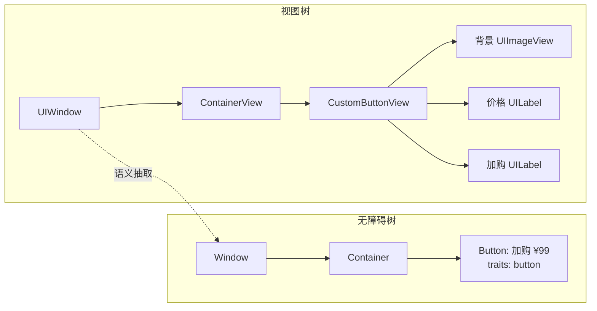
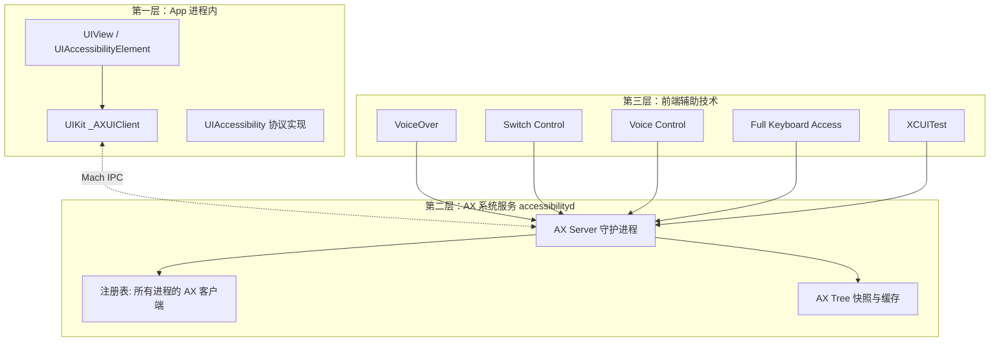
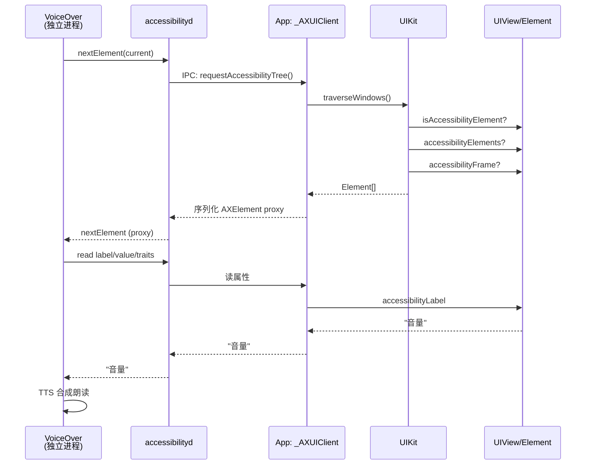

+++
title = "iOS无障碍树详解"
date = '2026-05-02T22:32:27+08:00'
draft = false
weight = 6
tags = ["iOS", "面试"]
categories = ["iOS开发", "面试"]
+++
## 前言

打开 iPhone 的"设置 → 辅助功能 → 旁白（VoiceOver）"，再用三指在屏幕上滑动，iPhone 就会逐个读出当前界面上的每个控件：`"登录按钮，双击以激活"`、`"用户名，文本框，已填写 ancheng"`、`"价格，¥99"`。这背后支撑 VoiceOver、开关控制（Switch Control）、语音控制（Voice Control）、全键盘访问（Full Keyboard Access）、Xcode UITest、AI Agent 识屏 等一系列能力的，是一棵并行于 `UIView` 视图树的 **无障碍树（Accessibility Tree，AX Tree）**。

对大多数 iOS 工程师来说，无障碍树是"黑盒"：设了 `isAccessibilityElement = true`、填了 `accessibilityLabel`，然后就不管了。但一旦遇到以下问题，就不得不深入理解它的工作机制：

- 为什么 UITest 里用 `XCUIElement` 定位不到某个按钮？
- 为什么打开 VoiceOver 后 App 明显变卡？
- 为什么一个自绘的 `CALayer` 按钮在 VoiceOver 下无法被朗读？
- 为什么 `UILabel` 嵌在 `UIStackView` 里焦点顺序是乱的？
- SwiftUI 的 `.accessibilityElement(children: .combine)` 到底合并了什么？
- Accessibility Inspector 里看到的树结构从哪儿来？
- AI Agent（如 iOS 上的 Claude、ChatGPT Mac 客户端）是如何"看到"屏幕的？

本文从**操作系统层的 AX 架构**讲起，逐层拆解：AX Server 守护进程、UIKit 中的 `UIAccessibility` 协议、`UIAccessibilityElement` 类、`UIAccessibilityContainer` 协议、焦点排序算法、SwiftUI 的 AX 实现、辅助技术的工作原理、性能优化、UITest 与 AI 识屏原理、调试工具与最佳实践。

## 一、基础概念：什么是无障碍树

### 1.1 视图树 vs 无障碍树

iOS 的 UI 渲染依赖一棵 `UIView` 组成的视图树：父视图包含子视图，每个 `UIView` 对应一个 `CALayer`，layer tree 再交给 Render Server 合成。然而视图树的目的是"画出来"，它对"我是什么"、"我在做什么"一无所知——一个 `UILabel` 里写着 `"¥99"`，对视图树而言只是字形和位置，对一个看不见屏幕的视障用户来说却毫无意义。

无障碍树（Accessibility Tree，下文简称 AX Tree）是 iOS 在视图树之上构建的**语义树**：每个节点代表一个可被辅助技术感知的"元素"（element），携带语义信息（标签、值、特征、动作），供 VoiceOver、Voice Control、UITest 等消费。



两棵树的核心区别：

| 维度 | 视图树 | 无障碍树 |
|------|--------|----------|
| 节点对应物 | `UIView` / `CALayer` | `UIAccessibilityElement` 或把自己"伪装成"元素的 `UIView` |
| 粒度 | 越细越好（便于复用、布局） | 越粗越好（便于朗读、操作） |
| 包含关系 | 父子视图 | 容器/元素，可以跨视图层级 |
| 交互模型 | 响应者链、手势识别器 | 焦点 + 动作（activate / increment / custom action） |
| 消费者 | 渲染管线 | 辅助技术（VoiceOver / Switch Control / UITest …） |

一个典型的"视图树密而 AX 树疏"的例子：一个自定义购物车按钮内部有 5 个子视图（背景图、图标、价格、文案、徽标），视图树是 5 个节点，但无障碍树应该是 1 个元素 `"加入购物车，价格 99 元，按钮"`。这个"合并"需要开发者主动告诉系统。

### 1.2 辅助技术（Assistive Technologies）

AX Tree 不是只服务于 VoiceOver 一家，iOS 上所有依赖它的技术统称为辅助技术（Assistive Technologies，AT）：

| 辅助技术 | 交互方式 | 使用人群 |
|----------|----------|----------|
| VoiceOver | 手势+语音合成读屏 | 视障用户 |
| Switch Control（开关控制） | 外接物理开关/摄像头/声音扫描聚焦 | 重度肢体障碍用户 |
| Voice Control（语音控制） | 说出控件标签/编号触发操作 | 肢体/暂时性障碍用户 |
| Full Keyboard Access | 外接键盘 Tab 导航 | 肢体障碍 / iPad Pro 键盘用户 |
| AssistiveTouch | 屏幕上的虚拟触控 | 触摸困难用户 |
| Guided Access（引导式访问） | 限制可交互元素 | 儿童 / 辅助场景 |
| 放大镜（Zoom） | 屏幕局部放大 | 低视力用户 |
| Dynamic Type / Bold Text | 动态字号 | 老花 / 低视力 |
| Reduce Motion / Transparency | 降低动画和透明 | 前庭障碍 / 注意力障碍 |
| UI Automation（XCUITest） | 代码驱动测试 | 开发者 |
| AI 识屏 Agent | 程序读取屏幕语义 | LLM 驱动的屏幕操作 |

这些技术共享同一个 AX Tree，但关注不同的属性：VoiceOver 关心 `label/value/traits`、Voice Control 关心 `label`、UITest 关心 `identifier`、Switch Control 关心"可聚焦"与"可激活"。所以**设置无障碍属性不等于只为视障用户服务**——它同时也让你的 App 可测试、可自动化、可被 AI 识别。

### 1.3 iOS 无障碍架构的三层

iOS 无障碍系统从底到上可以分为三层：



核心事实：

- App 进程里维护的是**源信息**——每个 `UIView`/`UIAccessibilityElement` 都通过 `UIAccessibility` 非正式协议提供自己的语义
- UIKit 内部有一个 `_AXUIClient`（私有类），负责与系统的 `accessibilityd` 守护进程通过 Mach Port 做跨进程通信
- `accessibilityd` 把所有前台 App 的 AX 信息汇总，暴露给 VoiceOver、Voice Control、XCTest 等**另一个进程**的客户端
- 辅助技术与目标 App **不在同一进程**，所有属性读取都是 IPC（这解释了后面为什么 VoiceOver 会让 App 变慢）

这和 macOS 上的 AXUIElement API（AppKit 时代留下的 C 接口，通过 Apple Events）是同源设计：**无障碍的本质是把 UI 语义开放为可编程的、跨进程可访问的对象图**。

## 二、`UIAccessibility` 非正式协议

UIKit 所有 `UIView` 和 `UIAccessibilityElement` 都遵循 **非正式协议** `UIAccessibility`（定义在 `UIAccessibilityIdentification.h` 和 `UIAccessibility.h`），约 20 多个 `@property`。所谓"非正式协议"在 Objective-C 里是一组 NSObject 类别方法——不强制实现，但系统会在需要时向任意对象发送这些消息。

### 2.1 核心属性概览

```objc
@interface NSObject (UIAccessibility)

@property (nonatomic) BOOL isAccessibilityElement;

@property (nullable, nonatomic, copy) NSString *accessibilityLabel;
@property (nullable, nonatomic, copy) NSString *accessibilityHint;
@property (nullable, nonatomic, copy) NSString *accessibilityValue;

@property (nonatomic) UIAccessibilityTraits accessibilityTraits;

@property (nonatomic) CGRect accessibilityFrame;
@property (nonatomic) CGPoint accessibilityActivationPoint;
@property (nullable, nonatomic, copy) UIBezierPath *accessibilityPath;

@property (nullable, nonatomic, copy) NSString *accessibilityLanguage;
@property (nonatomic) BOOL accessibilityElementsHidden;
@property (nonatomic) BOOL accessibilityViewIsModal;
@property (nonatomic) BOOL shouldGroupAccessibilityChildren;

@property (nullable, nonatomic, copy) NSArray<UIAccessibilityCustomAction *> *accessibilityCustomActions;
@property (nullable, nonatomic, copy) NSArray<UIAccessibilityCustomRotor *> *accessibilityCustomRotors;

@end
```

五类属性对应五个设计维度：

| 类别 | 属性 | 作用 |
|------|------|------|
| **是否是元素** | `isAccessibilityElement` | 决定自身是否出现在 AX 树中 |
| **语义描述** | `label` / `hint` / `value` / `traits` / `language` | 告诉 AT "这是什么、当前什么状态、怎么操作" |
| **几何位置** | `frame` / `path` / `activationPoint` | 告诉 AT "我在哪、点哪激活" |
| **可见性与范围** | `elementsHidden` / `viewIsModal` / `shouldGroupAccessibilityChildren` | 控制树的可见子集 |
| **自定义动作** | `customActions` / `customRotors` | 暴露额外操作入口 |

### 2.2 `isAccessibilityElement`：是否出现在树上

这是最重要的一个 bool：

- `true`：当前对象作为**叶子节点**出现在 AX 树上，VoiceOver 会聚焦它、朗读它，但它**自己的子元素会被忽略**（重点）
- `false`：当前对象**不作为元素出现**，但可以作为**容器**，把它的子视图或 `accessibilityElements` 暴露出去

UIKit 各系统控件的默认值：

| 控件 | 默认 `isAccessibilityElement` | 默认 label |
|------|-------------------------------|------------|
| `UILabel` | `true` | `text` 内容 |
| `UIButton` | `true` | `title` 或 `image accessibilityLabel` |
| `UIImageView` | `false` | 需显式设置；若设了 `image.accessibilityLabel` 会带上 |
| `UITextField` | `true` | `placeholder` 或用户输入值 |
| `UITextView` | `true` | 内容文本 |
| `UISwitch` | `true` | "开关"+当前状态 |
| `UISlider` | `true` | 值 + `.adjustable` trait |
| `UITableViewCell` | `false`（容器） | 子视图自动冒泡 |
| `UICollectionViewCell` | `false`（容器） | 同上 |
| `UIView`（纯容器） | `false` | 无 |
| `CAShapeLayer` 自绘按钮 | 无（layer 不是 responder） | 必须套一层 UIView 并手动设置 |

**坑**：`UIImageView` 默认不是 AX 元素——因为大多数图片只是装饰。如果图片本身承载信息（如一张二维码、一张警告图），需要 `imageView.isAccessibilityElement = true` + `imageView.accessibilityLabel = "二维码，扫描以添加好友"`。

**坑**：一旦把一个父 `UIView` 的 `isAccessibilityElement` 设为 `true`，它**所有子视图**都将从 AX 树中消失。这正是我们合并自定义按钮的用法，但用错了会让整片内容不可访问。

### 2.3 `accessibilityLabel`/`hint`/`value`：三段式语义

VoiceOver 朗读一个元素时按固定顺序组装一段话：

```
[label]，[value]，[traits 对应的角色词]。[hint]
```

比如一个音量滑块 VoiceOver 会朗读：`"音量，百分之 70，调节器。双指上下滑动以调整"`。对应字段：

| 字段 | 作用 | 例子 | 规则 |
|------|------|------|------|
| `label` | 元素名字（不变的） | `"音量"` | 必须有；不要包含控件类型（如"按钮"），traits 会自动加 |
| `value` | 当前值（可变的） | `"百分之 70"` | 不要把 value 塞进 label，否则 VoiceOver 朗读会重复 |
| `traits` | 控件类型 & 状态 | `.adjustable` | 见下一小节 |
| `hint` | 额外说明（操作方式） | `"双指上下滑动以调整"` | 用户可在设置中关闭 hint；非必需信息请放这里 |

常见反例：

```swift
// ❌ 错误：label 里塞了值和类型
label.accessibilityLabel = "音量按钮 70%"
// VoiceOver 朗读："音量按钮 70%，按钮"——"按钮"重复

// ✅ 正确：拆成 label/value/traits
slider.accessibilityLabel = "音量"
slider.accessibilityValue = "70%"
slider.accessibilityTraits = .adjustable
// VoiceOver 朗读："音量，70%，可调节"
```

关于 `language`：默认继承系统语言，但如果一段英文 label 嵌在中文界面里，应显式指定 `accessibilityLanguage = "en"`，否则 VoiceOver 会用中文 TTS 把 `"iPhone"` 念成 `"依佛恩"`。

### 2.4 `UIAccessibilityTraits`：特征位字段

`UIAccessibilityTraits` 是一个 `UInt64` 位字段，每一位表示一个特征，可以按位或组合：

```swift
public struct UIAccessibilityTraits: OptionSet {
    public static let none: UIAccessibilityTraits
    public static let button: UIAccessibilityTraits
    public static let link: UIAccessibilityTraits
    public static let header: UIAccessibilityTraits
    public static let searchField: UIAccessibilityTraits
    public static let image: UIAccessibilityTraits
    public static let selected: UIAccessibilityTraits
    public static let playsSound: UIAccessibilityTraits
    public static let keyboardKey: UIAccessibilityTraits
    public static let staticText: UIAccessibilityTraits
    public static let summaryElement: UIAccessibilityTraits
    public static let notEnabled: UIAccessibilityTraits
    public static let updatesFrequently: UIAccessibilityTraits
    public static let startsMediaSession: UIAccessibilityTraits
    public static let adjustable: UIAccessibilityTraits
    public static let allowsDirectInteraction: UIAccessibilityTraits
    public static let causesPageTurn: UIAccessibilityTraits
    public static let tabBar: UIAccessibilityTraits              // iOS 10+
    public static let toggleButton: UIAccessibilityTraits        // iOS 17+
    public static let switchButton: UIAccessibilityTraits
    // …
}
```

按语义分组：

| 分组 | 特征 | 含义 |
|------|------|------|
| **角色** | `.button`/`.link`/`.header`/`.image`/`.searchField`/`.tabBar`/`.staticText` | VoiceOver 会在 label 后追加朗读对应角色词 |
| **状态** | `.selected`/`.notEnabled`/`.summaryElement` | "已选中"/"不可用"等状态 |
| **行为** | `.adjustable`/`.allowsDirectInteraction`/`.playsSound`/`.startsMediaSession`/`.causesPageTurn` | 告诉 AT 该如何操作 |
| **性能** | `.updatesFrequently` | 提示 AT 内容高频变化（如秒表），避免每次打断朗读 |

`.adjustable` 比较特殊：它会让 VoiceOver 开启"调节手势"（单指上下滑动），同时你要实现 `accessibilityIncrement()` 和 `accessibilityDecrement()`：

```swift
class SwipeableRatingView: UIView {
    var rating: Int = 3 { didSet { setNeedsDisplay() } }

    override var isAccessibilityElement: Bool { get { true } set { } }
    override var accessibilityLabel: String? { get { "评分" } set { } }
    override var accessibilityValue: String? { get { "\(rating) 星" } set { } }
    override var accessibilityTraits: UIAccessibilityTraits {
        get { .adjustable } set { }
    }

    override func accessibilityIncrement() {
        guard rating < 5 else { return }
        rating += 1
        UIAccessibility.post(notification: .announcement, argument: accessibilityValue)
    }

    override func accessibilityDecrement() {
        guard rating > 0 else { return }
        rating -= 1
        UIAccessibility.post(notification: .announcement, argument: accessibilityValue)
    }
}
```

`.updatesFrequently` 能显著降低秒表、实时价格等场景的朗读打断。实测一个每秒变化的 `UILabel`，不加 `.updatesFrequently` 时 VoiceOver 会"磕巴"地读——因为每次文本变化 UIKit 都 post `.layoutChanged`，VoiceOver 打断重读；加了之后系统只在用户焦点停留时读一次当前值。

### 2.5 `accessibilityFrame`/`path`/`activationPoint`：几何信息

| 属性 | 类型 | 用途 |
|------|------|------|
| `accessibilityFrame` | `CGRect`（**屏幕坐标**！不是 view 坐标） | 描述元素的可点击区域，VoiceOver 绘制黑色焦点框、Switch Control 扫描 |
| `accessibilityPath` | `UIBezierPath` | 非矩形区域，如饼图扇区、地图上的不规则区域 |
| `accessibilityActivationPoint` | `CGPoint`（屏幕坐标） | VoiceOver 双击激活时，系统合成触摸事件的位置。默认为 frame 的中心 |

**所有几何属性都是屏幕坐标**——这意味着如果你用一个 `UIAccessibilityElement` 描述一个子视图区域，要这么转换：

```swift
let rectInView = CGRect(x: 10, y: 20, width: 80, height: 40)
let rectInWindow = self.convert(rectInView, to: nil)
let rectOnScreen = UIAccessibility.convertToScreenCoordinates(rectInWindow, in: self.window!)
element.accessibilityFrame = rectOnScreen

// 或者用更简单的：
element.accessibilityFrameInContainerSpace = rectInView  // iOS 10+
```

`accessibilityFrameInContainerSpace` 是**容器空间坐标**，系统会自动换算——推荐使用，避免在设备旋转、view 移动时反复更新 frame。

`activationPoint` 的典型用途：一个大按钮里其实只有中间一小块区域真的可点，默认 frame 中心正好命中；但如果你的 frame 是不规则的（如 Pie Chart 一个扇区），就应该手动指定 `activationPoint`，否则 VoiceOver 双击可能打不到正确位置。

### 2.6 可见性控制

```objc
@property BOOL accessibilityElementsHidden;   // 自身与子元素都从 AX 树中消失
@property BOOL accessibilityViewIsModal;      // 只有这个视图及其子视图可访问，兄弟节点被屏蔽
@property BOOL shouldGroupAccessibilityChildren;  // 强制作为一个"组"，子元素顺序被锁定
```

- `elementsHidden`：临时隐藏一整片，比如一个 tutorial overlay 显示时把底部主 UI 的 `accessibilityElementsHidden = true`
- `viewIsModal`：当你 present 一个自定义 modal view 时设为 `true`，否则 VoiceOver 可能把焦点移到背后的 UI
- `shouldGroupAccessibilityChildren`：一个 `UIStackView` 里并排三个 label，默认 AX 顺序可能按 frame 排序；设了这个会按子视图添加顺序朗读

**UIAlertController / UIModalPresentationFormSheet 之类系统级弹窗**会自动处理 `viewIsModal`，但你自己实现的半屏 modal / 抽屉需要手动处理：

```swift
class BottomSheetViewController: UIViewController {
    override func viewDidAppear(_ animated: Bool) {
        super.viewDidAppear(animated)
        view.accessibilityViewIsModal = true
        UIAccessibility.post(notification: .screenChanged, argument: titleLabel)
    }
}
```

## 三、`UIAccessibilityContainer`：把自己变成"容器"

到目前为止我们讨论的都是"一个 UIView 当作一个元素"的场景。但现实中经常需要：

- 一个 `UIView` 里自绘了 3 个虚拟按钮（如自定义日历），视图只有 1 个，AX 元素应该有 3 个
- 一个 `UIView` 虽然有子视图，但希望 AX 顺序和视图顺序不同
- 一个 `CALayer` 画的按钮无法响应 AX，需要手动描述

这就需要 `UIAccessibilityContainer` 非正式协议：

```objc
@interface NSObject (UIAccessibilityContainer)

- (NSInteger)accessibilityElementCount;
- (nullable id)accessibilityElementAtIndex:(NSInteger)index;
- (NSInteger)indexOfAccessibilityElement:(id)element;

// 或者用数组的现代写法：
@property (nullable, nonatomic, strong) NSArray *accessibilityElements;

@end
```

### 3.1 容器模式的三条规则

**规则 1**：容器自身必须 `isAccessibilityElement = false`。一个对象不能既是元素又是容器——它要么被朗读，要么把子元素暴露出去，二者互斥。

**规则 2**：优先使用 `accessibilityElements` 数组（iOS 5+ 的现代 API）。只有在元素数量动态变化或巨大、需要懒加载时才实现三方法协议。

**规则 3**：容器返回的元素**可以是 `UIAccessibilityElement` 实例（虚拟元素），也可以是真实的 `UIView`**。但一旦你设了 `accessibilityElements`，系统就**不再自动遍历子视图**，完全以你提供的数组为准。

### 3.2 `UIAccessibilityElement`：虚拟元素

`UIAccessibilityElement` 是一个**没有任何渲染**、专门用来占坑的 `NSObject`，只为了在 AX 树上放一个节点：

```swift
@MainActor
class UIAccessibilityElement: NSObject, UIAccessibilityIdentification {
    init(accessibilityContainer container: Any)
    weak var accessibilityContainer: Any? { get set }

    var isAccessibilityElement: Bool { get set }
    var accessibilityLabel: String? { get set }
    var accessibilityValue: String? { get set }
    var accessibilityFrame: CGRect { get set }
    var accessibilityFrameInContainerSpace: CGRect { get set }  // iOS 10+
    var accessibilityTraits: UIAccessibilityTraits { get set }
    // …
}
```

典型用法：一个自绘的日历格子视图，内部 6×7 = 42 个"日期按钮"都是 `Core Graphics` 绘制的：

```swift
class CalendarMonthView: UIView {
    var days: [DateCell] = []  // 42 个日期数据

    override var isAccessibilityElement: Bool { get { false } set { } }

    private lazy var axElements: [UIAccessibilityElement] = {
        days.map { day in
            let element = UIAccessibilityElement(accessibilityContainer: self)
            element.accessibilityLabel = day.formatted
            element.accessibilityTraits = day.isSelected ? [.button, .selected] : .button
            element.accessibilityFrameInContainerSpace = day.rect
            return element
        }
    }()

    override var accessibilityElements: [Any]? {
        get { axElements }
        set { }
    }
}
```

**关键细节**：

- `UIAccessibilityElement` 必须有一个非空的 `accessibilityContainer`（弱引用）。VoiceOver 根据 container 回溯整棵树
- 用 `accessibilityFrameInContainerSpace` 而不是 `accessibilityFrame`，iOS 会自动换算屏幕坐标
- 当 `days` 变化时需要重建数组并 post `.layoutChanged` 通知

### 3.3 容器嵌套与排序

`accessibilityElements` 可以任意嵌套。举个复杂例子：一个内容卡片里有一个轮播图（3 张图）和 2 个按钮，期望 AX 顺序是：`卡片标题 → 轮播图（作为 adjustable 控件）→ 按钮 1 → 按钮 2`。

```swift
class ContentCard: UIView {
    let titleLabel = UILabel()
    let carousel = CarouselView()
    let primaryButton = UIButton()
    let secondaryButton = UIButton()

    override var accessibilityElements: [Any]? {
        get {
            [titleLabel, carousel, primaryButton, secondaryButton]
        }
        set { }
    }
}
```

这种"手动排序"是非常常见的——因为**默认的几何排序算法在复杂布局下经常出错**。

### 3.4 默认的自动排序：Geometry Sort

如果你不设 `accessibilityElements`，UIKit 会自动把所有 `isAccessibilityElement = true` 的子视图（递归）收集起来，用**从左到右、从上到下**的几何排序（RTL 语言下是从右到左）：

```
1. 把所有元素按 frame 收集到数组
2. 对每两个元素 A 和 B：
   - 若 A.frame.maxY <= B.frame.minY：A 在 B 上方，A 在前
   - 若 B.frame.maxY <= A.frame.minY：B 在 A 上方，B 在前
   - 否则（在同一水平行）：按 frame.minX 比较（RTL 则按 maxX 反向）
3. 稳定排序
```

典型翻车场景：

- **UIStackView 混合布局**：水平栈里嵌套垂直栈，frame 重叠时顺序错乱
- **浮动 Badge**：一个红点浮在右上角，但几何上在"标题"的右侧高处，可能被排在标题前面
- **z 轴重叠**：两个半透明卡片叠在一起，frame 重叠，排序不稳定

**排查技巧**：Xcode Accessibility Inspector 的 `⌥ 键 + 空格`（或 Inspector 里的箭头）会按焦点顺序高亮元素，一眼能看出顺序是否合理。

### 3.5 `shouldGroupAccessibilityChildren`：组合不合并

这个属性容易混淆。它的作用是：**把当前视图子树的元素"按添加顺序"分组，相对于其他分组保持独立顺序**，但**不合并为单一元素**。

```
A  B  C
D  E  F
```

如果把 `[A,B,C]` 放在一个 `UIView1` 里、`[D,E,F]` 放在 `UIView2` 里，几何排序可能输出 `A B C D E F`（按行）——但如果某行元素 frame 有纵向重叠，结果可能是 `A D B E C F`。设置 `UIView1.shouldGroupAccessibilityChildren = true`、`UIView2.shouldGroupAccessibilityChildren = true`，保证一定是先 `A B C` 再 `D E F`（按组内再排序）。

### 3.6 `accessibilityElements` 的懒加载

对超大列表（UITableView 有上千个元素）不要在 `cellForRowAt` 里一次性构造所有 AX element，这会把整棵 AX 树撑爆（会明显感觉 VoiceOver 滑动卡顿）。UITableView 本身做了优化：它只为**可见区域**的 cell 创建 AX element，cell 出屏就销毁。

自定义容器如果有类似需求，应该：

```swift
override var accessibilityElements: [Any]? {
    get { nil }  // 返回 nil 让系统走三方法路径，逐个懒加载
    set { }
}

override func accessibilityElementCount() -> Int { items.count }

override func accessibilityElement(at index: Int) -> Any? {
    cache[index] ?? createElement(for: items[index], cache: &cache)
}

override func index(ofAccessibilityElement element: Any) -> Int {
    cache.firstIndex(where: { $0 === element as AnyObject }) ?? NSNotFound
}
```

## 四、VoiceOver 的工作机制：焦点、朗读与手势

### 4.1 焦点系统（VoiceOver Cursor）

VoiceOver 启动后会在屏幕上渲染一个**矩形焦点框**（iOS 默认黑色描边），任何时候有且仅有一个 AX 元素被聚焦。焦点框的位置 = 当前元素的 `accessibilityFrame`。

移动焦点的手势：

| 手势 | 行为 |
|------|------|
| 右滑（单指） | 焦点到下一个元素（按 AX 树顺序） |
| 左滑（单指） | 焦点到上一个元素 |
| 上滑/下滑 | 按 rotor（转子）选定的粒度跳转 |
| 双击（任意位置） | 在 `activationPoint` 合成触摸 |
| 单指触摸 | 焦点跳到触摸位置 |
| 三指左/右滑 | 翻页（触发 `.causesPageTurn`） |
| 两指捏合 | 退出（某些场景） |
| Z 手势 | 返回/取消 |

### 4.2 焦点切换时 UIKit 的内部流程

当 VoiceOver 请求"聚焦下一个元素"：



关键点：

- 每一次属性读取都是**跨进程调用**（至少两跳：VoiceOver → accessibilityd → App）
- `accessibilityLabel` 的 getter 如果写得慢（如里面做 I/O），会**在 IPC 线程上阻塞**，最终表现为 VoiceOver 滑动卡顿
- UIKit 会缓存部分树结构，但元素属性通常**每次读取都现取**

这就是"打开 VoiceOver 后 App 变慢"的根源：大量原本只在绘制时计算的东西（复杂 label 的格式化、value 的 KVC 取值）变成了高频 IPC。

### 4.3 元素顺序的确定

UIKit 遍历顺序：

```
1. 收集当前 App 所有 window（按 windowLevel 从高到低）
2. 忽略 accessibilityElementsHidden == true 的子树
3. 若存在 accessibilityViewIsModal == true 的视图，只遍历这个视图及其子树
4. 对每个 window 递归：
   - 若 view.accessibilityElements 非 nil：使用该数组（不再遍历 subviews）
   - 否则若 view.isAccessibilityElement == true：把它作为叶子
   - 否则递归它的 subviews（按 subviews 添加顺序）
5. 对收集到的元素做几何排序（除非所在容器开启了 shouldGroupAccessibilityChildren）
6. RTL 镜像（若当前语言方向是 RTL）
```

遵守这套流程意味着：**子视图的 `addSubview` 顺序、几何位置、容器的 `shouldGroupAccessibilityChildren` 三者共同决定焦点顺序**。

### 4.4 通知：让 AX 树"动起来"

`UIAccessibility.post(notification:, argument:)` 是 App → VoiceOver 的主动通知：

```swift
public struct UIAccessibility {
    public static let screenChangedNotification: UIAccessibility.Notification
    public static let layoutChangedNotification: UIAccessibility.Notification
    public static let announcementNotification: UIAccessibility.Notification
    public static let pauseAssistiveTechnologyNotification: UIAccessibility.Notification
    public static let resumeAssistiveTechnologyNotification: UIAccessibility.Notification
}
```

实战意义：

| 通知 | 什么时候 post | 效果 | argument |
|------|--------------|------|----------|
| `.screenChanged` | 进入新页面（push / present） | VoiceOver 播放"叮"音效；焦点跳到 argument 元素（或新屏第一个元素） | 可选：想要聚焦的元素 |
| `.layoutChanged` | 当前页面布局变化（比如点展开折叠） | VoiceOver 无音效；焦点跳到 argument 或保持 | 可选：新焦点元素 |
| `.announcement` | 纯消息播报 | VoiceOver 朗读 argument 字符串；不改变焦点 | 必须：`NSString` 或 `NSAttributedString`（后者支持 `UIAccessibilitySpeechAttributePunctuation` 等属性） |
| `.pauseAssistiveTechnology` | 自定义一段动画或游戏场景期间 | 暂停 AT 交互 | AT 名称 |

**坑**：系统自带的 `UIViewController push` 会自动 post `.screenChanged`，但**自定义弹窗（非 present）不会**——你需要手动发。

**`.announcement` 的可访问属性字符串**：iOS 11+ 支持富文本 announcement，能控制朗读节奏：

```swift
let text = NSMutableAttributedString(string: "请稍候，订单正在处理")
text.addAttribute(.accessibilitySpeechQueueAnnouncement,
                  value: true,  // 排队朗读，不打断当前
                  range: NSRange(location: 0, length: text.length))
text.addAttribute(.accessibilitySpeechPitch,
                  value: 1.2,   // 音调
                  range: NSRange(location: 0, length: 2))
UIAccessibility.post(notification: .announcement, argument: text)
```

### 4.5 自定义动作（Custom Actions）

默认 VoiceOver 对一个元素只能做"双击激活"一个操作。如果一个列表 cell 既要"点击进入详情"又要"左划删除"又要"标记已读"，用 VoiceOver 怎么做？答案是 **`UIAccessibilityCustomAction`**：

```swift
cell.accessibilityCustomActions = [
    UIAccessibilityCustomAction(name: "标记已读", target: self, selector: #selector(markRead(_:))),
    UIAccessibilityCustomAction(name: "删除", target: self, selector: #selector(delete(_:))),
    UIAccessibilityCustomAction(name: "举报", target: self, selector: #selector(report(_:)))
]

@objc func delete(_ action: UIAccessibilityCustomAction) -> Bool {
    // 执行删除
    return true
}
```

VoiceOver 下用户聚焦到 cell，两指单击或用转子选择 "actions"，就能听到"标记已读"、"删除"、"举报"，上下滑切换，双击执行。

**iOS 13+ 的 closure 版本**：

```swift
UIAccessibilityCustomAction(name: "删除") { _ in
    items.remove(at: indexPath.row)
    tableView.deleteRows(at: [indexPath], with: .automatic)
    return true
}
```

返回 `Bool` 表示动作是否成功，影响 VoiceOver 的反馈。

### 4.6 转子（Rotor）与自定义转子

转子是 VoiceOver 的"导航粒度"选择器——用户用两指旋转屏幕（像扭旋钮），可以切换当前上下滑的跳转单位：字符、单词、标题、链接、表单元素、容器等。

`UIAccessibilityCustomRotor` 允许 App 注册自定义转子，典型用法是一个长新闻列表想让用户"按文章上下跳"：

```swift
feedView.accessibilityCustomRotors = [
    UIAccessibilityCustomRotor(name: "文章") { [weak self] predicate in
        guard let self else { return nil }
        let current = predicate.currentItem.targetElement as? ArticleCell
        let next = self.nextArticle(from: current, direction: predicate.searchDirection)
        guard let target = next else { return nil }
        return UIAccessibilityCustomRotorItemResult(targetElement: target, targetRange: nil)
    }
]
```

用户开启此转子后，**不需要逐个元素朗读**即可在文章之间跳转，极大提升长列表体验。

## 五、SwiftUI 的无障碍

SwiftUI 并不直接暴露 `UIAccessibilityElement`——它用 **声明式修饰符** 描述语义，底层编译到 UIKit 的 AX 机制上（iOS）。核心修饰符：

```swift
struct CartRow: View {
    let product: Product

    var body: some View {
        HStack {
            AsyncImage(url: product.imageURL)
                .accessibilityHidden(true)       // 图是装饰，隐藏
            VStack(alignment: .leading) {
                Text(product.name)
                Text(product.price.formatted())
                    .foregroundColor(.secondary)
            }
            Spacer()
            Button("加购") { add() }
        }
        .accessibilityElement(children: .combine)    // 合并成一个元素
        .accessibilityLabel("\(product.name), \(product.price.formatted())")
        .accessibilityHint("双击加入购物车")
        .accessibilityAddTraits(.isButton)
        .accessibilityAction { add() }
    }
}
```

### 5.1 常用修饰符

| 修饰符 | 作用 |
|--------|------|
| `.accessibilityLabel(_:)` | 设置 label |
| `.accessibilityValue(_:)` | 设置 value |
| `.accessibilityHint(_:)` | 设置 hint |
| `.accessibilityIdentifier(_:)` | 设置测试 id |
| `.accessibilityAddTraits(_:)` / `.accessibilityRemoveTraits(_:)` | 加减 traits |
| `.accessibilityHidden(_:)` | 相当于 `accessibilityElementsHidden` |
| `.accessibilityElement(children:)` | 定义元素边界 |
| `.accessibilityAction(_:_:)` | 自定义 action |
| `.accessibilityAdjustableAction(_:)` | `.adjustable` 控件的 +/- 回调 |
| `.accessibilityFocused(_:)` | 绑定 `@AccessibilityFocusState`，程序控制焦点 |
| `.accessibilityRotor(_:entries:)` | 自定义转子 |
| `.accessibilityRepresentation(representation:)` | 完全替换子树的 AX 表示 |

### 5.2 `.accessibilityElement(children:)` 的三种模式

```swift
enum AccessibilityChildBehavior {
    static let ignore: AccessibilityChildBehavior      // 忽略子元素（自己作为叶子）
    static let contain: AccessibilityChildBehavior     // 作为容器，子元素保留（默认）
    static let combine: AccessibilityChildBehavior     // 合并子元素文本到自身 label
}
```

- `.ignore`：等价于 UIKit 的 `isAccessibilityElement = true`
- `.combine`：把所有子 `Text`/`Label`/`Image(label:)` 的文本拼起来作为自身 label（非常方便）
- `.contain`：明确声明这是一个容器（默认行为在很多场景下已经是容器，但显式声明更清晰）

### 5.3 `@AccessibilityFocusState` 程序控制焦点

iOS 15+ 引入的能力，等价于 UIKit 的 `UIAccessibility.post(.layoutChanged, argument: view)`：

```swift
struct LoginView: View {
    @AccessibilityFocusState private var focusedField: Field?
    @State private var email = ""
    @State private var errorMessage: String?

    enum Field { case email, password, errorBanner }

    var body: some View {
        VStack {
            if let error = errorMessage {
                Text(error)
                    .foregroundColor(.red)
                    .accessibilityFocused($focusedField, equals: .errorBanner)
            }
            TextField("邮箱", text: $email)
                .accessibilityFocused($focusedField, equals: .email)
            // …
            Button("登录") {
                if email.isEmpty {
                    errorMessage = "邮箱不能为空"
                    focusedField = .errorBanner   // 自动移焦并朗读
                }
            }
        }
    }
}
```

### 5.4 `.accessibilityRepresentation`

当你用 `Canvas` 或 `GeometryReader` 完全自绘一个复杂控件时，可以用这个修饰符把一个**简单的 SwiftUI view** 作为"AX 替身"：

```swift
CustomChartView(data: sales)
    .accessibilityRepresentation {
        // VoiceOver 看到的是一个标准的 Slider
        Slider(value: $selectedBarIndex, in: 0...Double(sales.count - 1), step: 1)
            .accessibilityLabel("销售额图表")
            .accessibilityValue("\(sales[selectedBarIndex].month) \(sales[selectedBarIndex].amount) 元")
    }
```

这比手写 `UIAccessibilityElement` 数组直观得多。

## 六、辅助技术如何消费 AX 树

### 6.1 VoiceOver 的完整朗读语句

一段典型的 VoiceOver 朗读：

```
"登录，按钮，已选中。双击以激活"
  ^label  ^traits ^trait   ^hint
```

系统自动按顺序组装：`label`（或 value 如果 label 缺省）→ `value`（若与 label 不重复）→ traits 转换的词 → hint（用户可关闭）。常见 traits 朗读词：

| Trait | 中文 | 英文 |
|-------|------|------|
| `.button` | "按钮" | "button" |
| `.link` | "链接" | "link" |
| `.header` | "标题" | "heading" |
| `.selected` | "已选中" | "selected" |
| `.notEnabled` | "变灰" | "dimmed" |
| `.adjustable` | "可调节" | "adjustable" |
| `.image` | "图像" | "image" |

### 6.2 Voice Control

Voice Control 完全依赖 `accessibilityLabel` 来匹配用户说的话。`accessibilityUserInputLabels`（iOS 13+）允许为同一个控件提供多个别名，应对本地化差异：

```swift
closeButton.accessibilityLabel = "关闭"
closeButton.accessibilityUserInputLabels = ["关闭", "叉", "取消", "退出"]
```

用户说这四个词任何一个都能点击关闭按钮。

**特殊值**："显示编号"模式下 Voice Control 会在每个可聚焦元素上叠加一个数字标签，用户说 `"点击 7"` 即可激活——这完全基于 AX 树枚举。

### 6.3 Full Keyboard Access

外接键盘上 Tab 键的导航顺序 = AX 焦点顺序。方向键通常用于容器内移动，Enter 相当于双击。

特殊 API：

- `accessibilityRespondsToUserInteraction`（iOS 14+）：返回 false 时键盘导航会跳过
- `accessibilityUserInputLabels`：同 Voice Control
- `UIFocusSystem`（tvOS/iPadOS 15+）：焦点引擎是 AX 的亲戚，但是独立系统

### 6.4 XCUITest

XCTest 的 `XCUIElement` **就是 AX 元素的代理**：

```swift
let app = XCUIApplication()
app.launch()
let button = app.buttons["加购"]     // 按 accessibilityLabel 匹配
let loginField = app.textFields["email-field"]  // 按 accessibilityIdentifier 匹配
button.tap()
```

`app.buttons` 等属性底层调用 `XCUIElementQuery`，它通过 AX server 拉取整棵树并按 trait / label / identifier 过滤。这意味着：

- **不设置 AX 属性的自绘控件在 UITest 里点不到**
- `accessibilityIdentifier` 是测试专用 id，**不朗读**，适合机器识别（label 会变更语言，identifier 稳定）
- UITest 启动时 Xcode 会把 App 注册到 `accessibilityd`（临时 AT 客户端），这也是为什么 UITest 进程与 App 进程是分开的

### 6.5 AI 识屏 Agent

越来越多的桌面/移动 AI Agent（如 Anthropic 的 Claude for Desktop、ChatGPT 的 screen reading 能力、Android 的 TalkBack Gemini 模式）本质上也是"特殊的 AT 客户端"——它们不做语音朗读，而是把整棵 AX 树作为**结构化的屏幕快照**喂给 LLM，让模型决定"下一步点击哪里"。

在 iOS 上，App Intents + AppShortcuts + AX 树三件套构成了 Siri / 未来 AI Agent 的识屏基础：

- AX 树提供 UI 结构（每个元素的 label、frame、traits）
- App Intents 提供可调用的语义动作
- LLM 在两者之间建立映射

**实践启示**：提升 App 的无障碍质量，**直接等于** 提升它对 AI Agent 的友好度。2024 年之后这已经是增长型考量而不是合规型考量。

## 七、排版适配：Dynamic Type、对比度、动效

无障碍树只是"语义层"，但大多数"辅助功能合规"问题其实出在**排版**上。iOS 从设置 App 提供了一系列开关，让系统环境自身成为 AX 信号源。

### 7.1 Dynamic Type：动态字号

用户在"设置 → 辅助功能 → 显示与文字大小 → 更大字体"里可以把系统字号放大到最大 **310%**（标准尺寸的 3 倍多）。支持 Dynamic Type 的字体会自动缩放：

```swift
// UIKit
label.font = UIFont.preferredFont(forTextStyle: .body)
label.adjustsFontForContentSizeCategory = true

// SwiftUI
Text("价格 ¥99").font(.body)     // 默认支持 Dynamic Type
```

**坑**：

- 用 `UIFont.systemFont(ofSize: 17)` 写死字号会**不响应** Dynamic Type，必须用 `preferredFont`
- 自绘文字（Core Text / CAShapeLayer）需要监听 `UIContentSizeCategory.didChangeNotification` 手动 invalidate
- 大字号下 `UILabel` 必须设置 `numberOfLines = 0` 否则会被裁剪
- 固定高度的 button / row 在大字号下内容溢出——优先用 AutoLayout 的 `intrinsicContentSize`

```swift
override func traitCollectionDidChange(_ previousTraitCollection: UITraitCollection?) {
    super.traitCollectionDidChange(previousTraitCollection)
    if previousTraitCollection?.preferredContentSizeCategory
        != traitCollection.preferredContentSizeCategory {
        updateLayoutForAccessibility()
    }
}

// 或者基于 isAccessibilityCategory 做"两套布局"：
if traitCollection.preferredContentSizeCategory.isAccessibilityCategory {
    stackView.axis = .vertical       // 辅助尺寸下改为纵向
} else {
    stackView.axis = .horizontal
}
```

`.isAccessibilityCategory` 是一条**重要的分界线**：当字号 ≥ `.accessibilityMedium`（约等于系统最大普通字号的 1.5 倍）就返回 true，大多数横向布局都应在此时改为纵向。

### 7.2 对比度、透明度、动效

| 设置项 | 查询 API | 应对策略 |
|--------|----------|----------|
| 增加对比度 | `UIAccessibility.isDarkerSystemColorsEnabled` | 使用更深的前景色、更粗的边框 |
| 降低透明度 | `UIAccessibility.isReduceTransparencyEnabled` | 关闭毛玻璃/vibrancy，改为纯色 |
| 减弱动画 | `UIAccessibility.isReduceMotionEnabled` | 禁用视差、过大幅度的过渡动画 |
| 区分颜色 | `UIAccessibility.shouldDifferentiateWithoutColor` | 红/绿涨跌同时加 ▲▼ 符号 |
| 粗体文本 | `UIAccessibility.isBoldTextEnabled` | `UIFont.systemFont(weight:)` 自动处理；自绘需手动 |
| 反色显示 | `UIAccessibility.isInvertColorsEnabled` | 给照片/Logo 加 `accessibilityIgnoresInvertColors = true` 避免被反色 |

所有开关都有对应的 `.didChangeNotification` 通知：

```swift
NotificationCenter.default.addObserver(
    self, selector: #selector(motionPrefsDidChange),
    name: UIAccessibility.reduceMotionStatusDidChangeNotification,
    object: nil
)
```

SwiftUI 中更简单：

```swift
@Environment(\.accessibilityReduceMotion) var reduceMotion
@Environment(\.accessibilityDifferentiateWithoutColor) var differentiateWithoutColor
@Environment(\.sizeCategory) var sizeCategory
```

## 八、调试与自动化

### 8.1 Accessibility Inspector（Xcode 自带）

打开方式：Xcode → Open Developer Tool → Accessibility Inspector。它是一个独立 Mac 应用，能连接模拟器或真机（iPhone USB 连接），提供三大功能：

1. **Inspection Pointer**：像 Safari 检查器一样悬停屏幕，显示当前元素的 label/value/traits/frame
2. **Audit**：一键跑辅助功能审计，检测对比度不足、触控目标过小（< 44pt）、缺少 label、元素重叠等问题
3. **Settings Override**：模拟器里临时开启各种 AX 设置（减弱动画、字号、VoiceOver 快速切换等）

Accessibility Inspector 是**每个功能提测前必跑**的工具，Apple 应用审核也会用它做基础检查。

### 8.2 Xcode Accessibility Audit API（iOS 17+）

iOS 17 的 XCTest 提供了 **自动化审计**：

```swift
func testAccessibility() throws {
    let app = XCUIApplication()
    app.launch()

    try app.performAccessibilityAudit()   // 失败则测试失败并附带截图与问题列表
}

// 或指定要审计的类型：
try app.performAccessibilityAudit(for: [.contrast, .dynamicType, .elementDetection])
```

审计类型包括：`.contrast`、`.dynamicType`、`.elementDetection`、`.hitRegion`、`.sufficientElementDescription`、`.parentChild`、`.traitsMismatch`、`.textClipped`。

**最佳实践**：把这个测试加到 CI 的回归测试里，每个关键页面都跑一遍——比人工审核快 100 倍。

### 8.3 在代码中判断 AT 是否开启

```swift
UIAccessibility.isVoiceOverRunning
UIAccessibility.isSwitchControlRunning
UIAccessibility.isVoiceOverRunning
UIAccessibility.isAssistiveTouchRunning  // iOS 10+
UIAccessibility.isGuidedAccessEnabled
```

**注意**：一般**不应该**写 `if isVoiceOverRunning` 的条件分支——这意味着给视障用户看到了"不一样的 UI"，反而容易出 bug。合理用法是：

- 关闭不必要的视差动画（已有 `isReduceMotionEnabled`）
- 推迟自动轮播（`if isVoiceOverRunning` 时暂停轮播，因为用户需要时间朗读每一张）
- 缩短自动消失 toast 的停留时间（VoiceOver 可能读不完就消失）

### 8.4 真机测试 VoiceOver 的技巧

- **快捷键**：设置 → 辅助功能 → 辅助功能快捷键 → 选中 VoiceOver，之后三击侧边按钮即可快速开关
- **朗读速度**：设置 → VoiceOver → 朗读速度调到最慢，便于调试
- **屏幕幕帘**：打开"屏幕幕帘"（三指三击）模拟全盲环境——只能靠朗读找到功能
- **VoiceOver + Zoom 同开**：部分低视力用户会同时开启，复杂场景需要做额外测试
- **Xcode Simulator VoiceOver**：iOS 17+ 的模拟器支持真 VoiceOver（之前只有基本朗读），是开发阶段主力

### 8.5 `UIAccessibility.isAccessibilityElementFocused`

在某个元素被聚焦时做特殊处理：

```swift
override func accessibilityElementDidBecomeFocused() {
    super.accessibilityElementDidBecomeFocused()
    // 例如：焦点到一个视频卡片时暂停自动播放
    videoPlayer.pause()
}

override func accessibilityElementDidLoseFocus() {
    super.accessibilityElementDidLoseFocus()
    videoPlayer.play()
}
```

## 九、性能优化：让 VoiceOver 不拖慢 App

前面提到 AX 属性读取都是跨进程 IPC，所以**getter 的时间复杂度直接影响 VoiceOver 流畅度**。几条经验：

### 9.1 避免在 getter 里做重活

```swift
// ❌ 反例：每次 VoiceOver 读都触发一次网络/磁盘
override var accessibilityLabel: String? {
    get { loadDescriptionFromDisk() }  // 阻塞 IPC 线程
    set { }
}

// ✅ 正例：缓存计算结果
private var cachedAXLabel: String?
override var accessibilityLabel: String? {
    get { cachedAXLabel ?? fallbackLabel }
    set { cachedAXLabel = newValue }
}

// 数据变化时更新缓存并通知：
func dataDidUpdate() {
    cachedAXLabel = buildLabel()
    UIAccessibility.post(notification: .layoutChanged, argument: nil)
}
```

### 9.2 大型 AX Tree 的懒加载

前面 3.6 讲过懒加载。额外要点：

- 不要在 `viewDidLoad` 里一次性构造所有 `UIAccessibilityElement`
- `UITableView`/`UICollectionView` 交给系统——cell 出入屏自动处理
- 自定义滚动容器要自己实现 viewport 裁剪

### 9.3 `.updatesFrequently` 降低 VoiceOver 负载

秒表、实时比分、直播弹幕等高频更新内容必须加 `.updatesFrequently`，否则每次内容变化 UIKit 都 post `.layoutChanged`，VoiceOver 会一直打断朗读。

### 9.4 动画与 AX 的协作

- 做大幅界面切换时先 post `.screenChanged`，让 VoiceOver 感知
- 动画过程中（如抽屉展开 0.3 秒）临时 `accessibilityElementsHidden = true`，动画结束再恢复，避免元素飞动时 frame 错乱
- 极端情况 `UIAccessibility.post(notification: .pauseAssistiveTechnology, argument: UIAccessibility.AssistiveTechnologyIdentifier.notificationVoiceOver)` 彻底暂停

### 9.5 `accessibilityElements` 数组的内存管理

返回 `[Any]?` 的 getter 每次都构造新数组是巨大浪费。用懒加载 + 失效重建：

```swift
private var _cachedElements: [UIAccessibilityElement]?
override var accessibilityElements: [Any]? {
    get {
        if let cached = _cachedElements { return cached }
        let built = rebuildElements()
        _cachedElements = built
        return built
    }
    set { }
}

override func layoutSubviews() {
    super.layoutSubviews()
    if bounds.size != lastLayoutSize {
        _cachedElements = nil    // 布局变了再重建
        lastLayoutSize = bounds.size
    }
}
```

## 十、最佳实践与常见坑

### 10.1 设计阶段

- 每个可交互控件必须有 `label`（或 title）
- 每张非装饰图片必须有 `label` 或设为 `accessibilityElementsHidden = true`
- 每个触控目标 **≥ 44×44 pt**（Apple HIG 硬性要求）
- 颜色对比度：正文 ≥ 4.5:1，大文字 ≥ 3:1
- 不要只靠颜色传递信息（红涨绿跌需额外加符号）

### 10.2 开发阶段清单

| 控件 | 必做 |
|------|------|
| 自定义按钮 (UIView + CALayer) | `isAccessibilityElement=true`、设 label、加 `.button` trait |
| 图标按钮（纯 image） | 设 `accessibilityLabel` 描述功能而非图片内容（"删除"而非"垃圾桶"） |
| 图片承载信息（图表/二维码） | 设 label 描述信息；装饰性图 `elementsHidden = true` |
| 自定义容器（日历、图表） | 实现 `accessibilityElements` 返回虚拟元素 |
| 列表 cell | 合并为单元素或提供 `customActions` |
| 弹窗/抽屉 | `accessibilityViewIsModal = true`，弹出时 post `.screenChanged` |
| Toast/Snackbar | post `.announcement`，而非在屏幕外渲染 |
| 图表 | 用 `.adjustable` + increment/decrement 代替手势 |
| 动态内容 | 变化时 post `.layoutChanged`；高频变化加 `.updatesFrequently` |
| 表单 | 每个输入框有 label，错误信息 post `.announcement` 或用 `@AccessibilityFocusState` |
| 字体 | 用 `preferredFont(forTextStyle:)`，布局在 `.isAccessibilityCategory` 下切换 |

### 10.3 常见坑（高频 bug）

1. **`UIImageView.isAccessibilityElement` 默认 false**：承载信息的图必须显式开
2. **`UIImage.accessibilityLabel` 不会自动传播到 `UIImageView`**：需要手动赋值 `imageView.accessibilityLabel = image.accessibilityLabel`
3. **`UIButton` 同时有 image 和 title 时 label 只用 title**：图标按钮必须手动设 label
4. **`CATiledLayer` / 自绘内容完全没 AX**：必须套一层 UIView 或用 `UIAccessibilityElement`
5. **自定义 present 不 post `.screenChanged`**：VoiceOver 焦点停留在被盖住的背景元素上
6. **modal 不设 `viewIsModal`**：VoiceOver 右滑会跳到后面的 UI
7. **`accessibilityElements` 返回数组里放错类型**：必须是 `UIView` 或 `UIAccessibilityElement`，不能放 `String` / 数据模型
8. **手动 copy accessibility 属性**：在 subclass 里 override 时忘记调用 super
9. **焦点顺序错乱**：`UIStackView` 嵌套复杂布局时必须显式设 `accessibilityElements`
10. **大字号下布局崩溃**：`numberOfLines` 写死、固定高度约束
11. **label 里塞了 "按钮"**：与 `.button` trait 重复朗读
12. **朗读中文数字错误**：`"1K"` 会读成 "一 K"，应设 `accessibilityLabel = "一千"`
13. **`accessibilityIdentifier` 为了 UITest 设成中文**：建议用英文标识符，避免本地化切换影响
14. **自定义 cell 的 "左划删除" VoiceOver 下用不了**：必须加 `accessibilityCustomActions`
15. **重复的 label**：一个 cell 里 label 是"¥99"，下面又有一个价格说明 label 也是"¥99"——VoiceOver 用户听两遍。建议合并为一个元素

### 10.4 建立团队规范

- 把"无障碍 ≥ 80% 关键路径"写入迭代 DoD
- CI 流水线接入 `performAccessibilityAudit()`
- 设计稿评审时检查对比度、字号、触控目标
- 新控件纳入组件库时必须通过 Accessibility Inspector 审计
- 招聘一位真正的视障用户参与半年一次的可用性测试（最有价值的信号）

## 总结

iOS 无障碍树是**语义化的屏幕 API**：它把"长什么样"的视图树翻译为"能做什么"的元素树，服务于 VoiceOver、Switch Control、Voice Control、UITest、AI 识屏等所有需要理解屏幕内容的消费者。

理解它的关键脉络是：

- **数据模型**：`isAccessibilityElement` 决定是否上树；`label/value/traits/hint` 描述"是什么、状态、角色、怎么用"；`frame/path/activationPoint` 描述"在哪、怎么点"；`customActions/customRotors` 扩展额外操作
- **结构模型**：`accessibilityElements` 把任意视图变成容器，允许虚拟元素；容器不作为元素，元素不包含子元素——二者互斥
- **运行模型**：独立的 `accessibilityd` 守护进程汇总所有 App 的 AX 树，通过 Mach IPC 暴露给 AT；每次 VoiceOver 移动焦点都会反复读取属性，getter 必须轻量
- **适配维度**：Dynamic Type、对比度、减弱动画、粗体、区分颜色、反色——六大系统开关共同决定 App 对低视力/运动敏感用户的友好度
- **SwiftUI 抽象**：用 `.accessibilityElement`/`.accessibilityLabel`/`.accessibilityAction`/`@AccessibilityFocusState` 声明式表达同样的模型，底层仍落到 UIKit AX
- **工程闭环**：Accessibility Inspector 做人工审计、`performAccessibilityAudit()` 做自动化审计、真机 VoiceOver + 屏幕幕帘做真实用户模拟

把无障碍做好并不只是"为视障用户"——它等价于提升 UI 的**语义清晰度**，让代码更可测试、让产品更可自动化、让 App 在 AI Agent 时代更容易被理解和调用。这是少数"做对一次、多方受益"的工程投入。
