+++
title = "iOS音视频原理"
date = '2026-05-02T22:32:27+08:00'
draft = false
weight = 7
tags = ["iOS", "面试"]
categories = ["iOS开发", "面试"]
+++
音视频开发是iOS中一个庞大且核心的技术领域，涵盖采集、编码、传输、解码、渲染等完整链路。本文从基础概念出发，深入iOS平台提供的音视频框架和底层原理。

## 音视频处理全链路

一个完整的音视频系统（如直播、视频通话、短视频）包含以下环节：

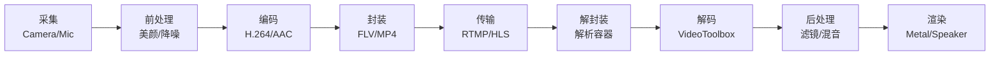

| 环节 | 做什么 | iOS中对应的技术 |
|------|--------|----------------|
| 采集 | 从摄像头/麦克风获取原始数据 | AVCaptureSession |
| 前处理 | 美颜、滤镜、降噪、回声消除 | CoreImage、vDSP |
| 编码 | 将原始数据压缩为体积更小的格式 | VideoToolbox、AudioToolbox |
| 封装 | 将编码后的音视频数据打包到容器中 | AVAssetWriter |
| 传输 | 通过网络发送到服务器或其他端 | URLSession、第三方推流SDK |
| 解封装 | 从容器中分离出音频流和视频流 | AVAssetReader |
| 解码 | 将压缩数据还原为原始像素/采样数据 | VideoToolbox、AudioToolbox |
| 后处理 | 滤镜、水印、混音等 | CoreImage、Metal |
| 渲染 | 将画面显示到屏幕、声音输出到扬声器 | AVSampleBufferDisplayLayer、Metal、AudioUnit |

## 核心术语

在深入细节之前，先了解几个贯穿全文的核心概念：

### 什么是编解码器（Codec）

**Codec** = Coder + Decoder，即编码器+解码器的合称。编码器负责将原始音视频数据压缩为更小的格式，解码器负责将压缩数据还原。

音视频中有两类完全不同的"格式"概念，初学者极易混淆：

```
编码格式（Codec）：定义数据怎么压缩
  视频：H.264、H.265、VP9、AV1
  音频：AAC、MP3、Opus、FLAC

封装格式（Container）：定义压缩后的数据怎么组织存储
  MP4、MOV、FLV、MKV、TS

两者是独立的，可以自由组合:
  MP4容器 + H.264视频 + AAC音频  （最常见的组合）
  MOV容器 + H.265视频 + AAC音频  （iPhone录制默认）
  FLV容器 + H.264视频 + AAC音频  （直播推流常用）
  MKV容器 + AV1视频  + Opus音频  （新一代免费组合）
```

### 什么是H.264和H.265

**H.264**（也叫AVC，Advanced Video Coding）是目前使用最广泛的视频编码标准，由ITU-T和ISO/IEC联合制定，2003年发布。它定义了一套将视频帧压缩为比特流的算法规范——包括如何划分图像块、如何预测、如何变换量化等。几乎所有设备和平台都支持H.264硬件解码。

**H.265**（也叫HEVC，High Efficiency Video Coding）是H.264的继任者，2013年发布。在相同画质下码率降低约50%，代价是编码复杂度大幅增加。iPhone 7及以上支持H.265硬件编码，iPhone 6s及以上支持硬件解码。iOS 11开始默认使用H.265录制视频。

```
同一段1080p 30fps视频:
H.264编码: 约 4~8 Mbps 可达到较好画质
H.265编码: 约 2~4 Mbps 即可达到相同画质（码率减半）
```

### 什么是YUV

**YUV**是一种色彩编码方式，将颜色分为**亮度（Y）**和**色度（U/V）**两部分。与我们熟悉的RGB不同，YUV的设计初衷是利用人眼对亮度变化远比色度变化敏感这一生理特性来减少数据量。

在视频编码领域，几乎所有编码器的输入都是YUV格式（而非RGB），因为YUV允许在不明显影响画质的前提下降低色度分量的分辨率（称为色度子采样），仅这一步就能将数据量减少33%~50%。

iOS中摄像头采集和VideoToolbox编解码使用的像素格式都是YUV（具体是NV12排列的YUV 4:2:0）。

### 什么是PCM

**PCM（Pulse Code Modulation，脉冲编码调制）**是最基础的未压缩数字音频格式。它是模拟声波经过采样和量化后得到的原始数字数据，保留了声音的全部信息，没有任何压缩损失。

iOS中麦克风采集到的音频数据就是PCM格式。所有音频编码器（AAC、MP3等）的输入都是PCM，所有音频解码器的输出也是PCM。WAV文件本质上就是一个带文件头的PCM数据容器。

### 什么是AAC

**AAC（Advanced Audio Coding）**是目前最主流的有损音频编码标准，被设计为MP3的继任者。它利用人耳的听觉特性（心理声学模型）去除人耳无法感知的音频信息，在同等码率下音质优于MP3。

AAC是iOS平台的"一等公民"，系统提供硬件编解码支持。iTunes商店、Apple Music、iPhone录制的视频都使用AAC作为音频编码。

### 什么是封装格式

**封装格式**（也叫容器格式，Container Format）定义了编码后的音视频数据如何组织在一起。一个视频文件通常包含至少一路视频流和一路音频流，封装格式负责将它们交织存储，并记录时间戳、索引等元信息，使播放器能够正确地同步播放。

打个比方：编码格式是"把衣服真空压缩"，封装格式是"把压缩好的衣服和其他物品装进行李箱，并贴上清单标签"。

### 什么是码率

**码率（Bitrate）**表示每秒传输或存储的数据量，通常以bps（bits per second）或kbps/Mbps为单位。

- **CBR（恒定码率）**：每秒数据量固定。适合网络传输（带宽稳定），但对简单画面浪费、复杂画面不足。
- **VBR（可变码率）**：根据内容复杂度动态调整。简单画面（如静止背景）分配低码率，复杂画面（如剧烈运动）分配高码率。画质更好但文件大小不可预测。
- **ABR（平均码率）**：VBR的变体，保证平均码率在目标值附近。兼顾画质和文件大小可控性。

```
码率与文件大小的关系:
文件大小(MB) = 码率(Mbps) x 时长(秒) / 8

例: 4Mbps码率的10分钟视频
4 x 600 / 8 = 300 MB
```

## 音视频基础概念

### 视频的本质

视频本质上是一系列连续的静态图像（帧）按照一定速率播放所形成的动态画面。人眼的视觉暂留效应（约1/24秒）使得帧率达到24fps以上时，画面看起来是连续的。

**关键参数**：

| 参数 | 含义 | 典型值 |
|------|------|--------|
| 分辨率 | 每帧图像的像素数量 | 1920x1080 (1080p)、3840x2160 (4K) |
| 帧率 (FPS) | 每秒播放的帧数 | 24fps (电影)、30fps、60fps |
| 码率 (Bitrate) | 每秒传输的数据量 | 1Mbps ~ 50Mbps |
| 色彩空间 | 颜色的数学表示方式 | RGB、YUV |

**分辨率与帧率的关系**：分辨率决定单帧画面的清晰度，帧率决定画面的流畅度。两者共同决定了未压缩视频的数据量。高分辨率+高帧率意味着更大的数据量和更高的编解码负载，这也是为什么4K 60fps视频对硬件要求远高于1080p 30fps。

**码率的意义**：码率是编码后视频每秒的数据量，是画质和文件大小之间的权衡。相同编码标准下，码率越高画质越好但文件越大。不同编码标准在相同画质下所需的码率不同——这正是编码标准不断演进的核心驱动力。

### 音频的本质

音频是声波的数字化表示。现实中的声音是连续的模拟信号（空气压力随时间的变化），要在计算机中处理，需要通过**模数转换（ADC）**将其转为离散的数字信号。


**采样 (Sampling)**：按固定时间间隔对模拟信号取值。采样率就是每秒取值的次数。

**量化 (Quantization)**：将采样得到的连续幅值映射到有限的离散级别。位深决定了量化精度——16bit提供65536个级别，24bit提供16777216个级别。位深越大，能表示的动态范围越宽，量化噪声越小。

**编码 (Encoding)**：将量化后的值用二进制表示，得到**PCM（脉冲编码调制）** 数据。PCM是最基础的未压缩音频格式，后续所有音频编码都以PCM为输入。

**关键参数**：

| 参数 | 含义 | 典型值 | 影响 |
|------|------|--------|------|
| 采样率 | 每秒采样次数 | 44100Hz (CD)、48000Hz (视频) | 决定可还原的最高频率 |
| 位深 | 每个采样点的bit数 | 16bit、24bit | 决定动态范围和信噪比 |
| 声道数 | 独立的音频通道 | 单声道(1)、立体声(2)、5.1(6) | 决定空间感 |

**奈奎斯特采样定理**：采样率必须大于原始信号最高频率的2倍，才能完整还原原始信号，否则会产生**混叠（Aliasing）** 失真。人耳可听范围为20Hz~20kHz，因此CD标准采样率为44.1kHz（略大于20kHz的2倍，留有余量）。视频行业常用48kHz，因为48000可以被更多帧率（24/25/30/60）整除，便于音视频同步。

**未压缩音频数据量计算**：

```
数据量(bits) = 采样率 x 位深 x 声道数 x 时长(秒)
例：44100 x 16 x 2 x 60 = 84,672,000 bits ≈ 10.1MB/min

对比不同规格:
CD质量 (44.1kHz/16bit/立体声):  ≈ 10.1 MB/min
高清音频 (96kHz/24bit/立体声):  ≈ 33.0 MB/min
电话语音 (8kHz/8bit/单声道):    ≈ 0.46 MB/min
```

### 色彩空间：RGB与YUV

**RGB** 是最直观的颜色模型，每个像素由红(R)、绿(G)、蓝(B)三个分量组成。屏幕上的每个像素都由RGB三色LED/LCD子像素混合而成，因此RGB是显示设备的原生色彩空间。但RGB三个通道之间相关性很高（一个通道变化时其他通道往往同方向变化），数据冗余度大，不利于压缩。

**YUV** 将亮度信息(Y)和色度信息(U/V，也记为Cb/Cr)分离。这种设计源于早期黑白电视向彩色电视的过渡——Y分量兼容黑白电视，UV分量额外携带颜色信息。

YUV在视频编码中的核心优势：人眼包含约1.2亿个感知亮度的视杆细胞，但只有约600万个感知色彩的视锥细胞。这意味着人眼对亮度变化的敏感度远高于色度变化，因此可以在几乎不影响主观画质的前提下，大幅降低色度分量的分辨率。

```
YUV与RGB的转换关系:

BT.601标准（标清SD, 分辨率 <= 720p）:
Y  =  0.299R + 0.587G + 0.114B
Cb = -0.169R - 0.331G + 0.500B + 128
Cr =  0.500R - 0.419G - 0.081B + 128

BT.709标准（高清HD, 720p ~ 1080p）:
Y  =  0.2126R + 0.7152G + 0.0722B
Cb = -0.1146R - 0.3854G + 0.5000B + 128
Cr =  0.5000R - 0.6142G - 0.0858B + 128

注意：使用错误的转换矩阵会导致偏色
```

**常见YUV采样格式**：

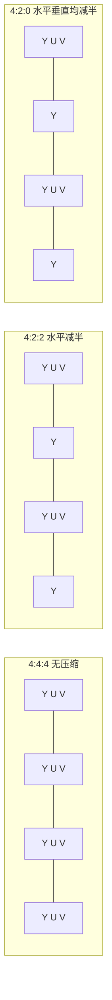

| 格式 | 采样比 | 每像素平均bit数(8bit) | 数据量比RGB | 典型应用 |
|------|--------|----------------------|------------|----------|
| YUV 4:4:4 | 全采样 | 24 | 100% | 专业后期 |
| YUV 4:2:2 | 色度水平减半 | 16 | 67% | 广播级采集 |
| YUV 4:2:0 | 色度水平垂直均减半 | 12 | 50% | 视频编码(H.264/H.265) |

### YUV内存排列格式

同样是YUV 4:2:0的数据，在内存中的排列方式也有多种。这对iOS开发非常重要，因为`CVPixelBuffer`的`pixelFormatType`直接决定了数据的内存布局。

**Planar（平面格式）**：Y、U、V分别存储在三个独立的平面中。

```
I420 (kCVPixelFormatType_420YpCbCr8Planar):
[YYYYYYYY...] [UUUU...] [VVVV...]
 Y平面(WxH)   U平面(W/2xH/2)  V平面(W/2xH/2)

YV12: 与I420类似，但U和V的顺序互换
[YYYYYYYY...] [VVVV...] [UUUU...]
```

**Semi-Planar（半平面格式）**：Y单独一个平面，UV交错存储在第二个平面。

```
NV12 (kCVPixelFormatType_420YpCbCr8BiPlanarVideoRange):
[YYYYYYYY...] [UVUVUV...]
 Y平面(WxH)   UV交错平面(W/2xH/2, 每个位置2字节)

NV21: 与NV12类似，但UV交错顺序为VU
[YYYYYYYY...] [VUVUVU...]
```

**iOS中最常用的是NV12**，即`kCVPixelFormatType_420YpCbCr8BiPlanarVideoRange`（limited range, Y:16~235）和`kCVPixelFormatType_420YpCbCr8BiPlanarFullRange`（full range, Y:0~255）。摄像头采集、VideoToolbox编解码默认都使用NV12格式，因为双平面结构（而非三平面）对GPU纹理映射更友好。

**Video Range vs Full Range**：

| 范围 | Y值域 | UV值域 | 用途 |
|------|-------|--------|------|
| Video Range (Limited) | 16~235 | 16~240 | 广播标准，预留head room和toe room |
| Full Range | 0~255 | 0~255 | 计算机/移动设备，利用全部动态范围 |

混用Range会导致画面偏灰（Full当Limited处理）或黑白区域细节丢失（Limited当Full处理），这是iOS音视频开发中常见的坑。

## 编解码原理

### 为什么需要编解码

未压缩的视频数据量极大：

```
1080p 30fps YUV420视频:
1920 x 1080 x 1.5(YUV420每像素字节) x 30 = 93,312,000 Bytes/s ≈ 711 Mbps

1080p 30fps RGB视频:
1920 x 1080 x 3(RGB每像素字节) x 30 = 186,624,000 Bytes/s ≈ 1.43 Gbps

一部90分钟的1080p电影(YUV420):
711 Mbps x 5400s ≈ 480 GB
```

如此庞大的数据量既无法存储也无法传输。而经过H.264编码后，同样的1080p 30fps视频码率通常只需2~8Mbps，压缩比达到100:1以上。这就是视频编码的价值。

### 视频编码的核心思想

视频编码的本质是**去除冗余**。原始视频中存在大量的冗余信息：

| 冗余类型 | 含义 | 举例 | 消除方式 |
|----------|------|------|----------|
| 空间冗余 | 同一帧内相邻像素相似 | 蓝天区域大片相同蓝色 | 帧内预测(Intra Prediction) |
| 时间冗余 | 相邻帧之间内容相似 | 背景不变，只有人物在动 | 帧间预测(Inter Prediction) |
| 视觉冗余 | 人眼对某些信息不敏感 | 高频纹理细节的微小变化 | 量化(Quantization) |
| 编码冗余 | 数据的统计分布不均匀 | 残差数据中0和小值出现概率更高 | 熵编码(CABAC/CAVLC) |

其中帧内预测和帧间预测是**无损**的预测过程（预测本身不丢信息，只是减少需要编码的数据量）；量化是**有损**环节，不可逆地丢弃了信息；熵编码是**无损**的压缩。

### 视频帧类型


- **I帧 (Intra Frame)**：关键帧，只使用帧内预测，不依赖其他帧，可独立解码。数据量最大，是随机访问（seek）的入口点。
- **P帧 (Predicted Frame)**：前向预测帧，参考之前的I帧或P帧。只编码与参考帧的差异（运动向量+残差），数据量远小于I帧。
- **B帧 (Bi-directional Frame)**：双向预测帧，同时参考前后的帧。压缩率最高（通常只有I帧的1/10~1/5），但增加了编码延迟（需要等待未来帧到达）和解码复杂度。

**GOP (Group of Pictures)**：从一个I帧到下一个I帧之前的所有帧组成一个GOP。

```
典型GOP结构 (GOP=12): I B B P B B P B B P B B I
                       |<--------  一个GOP  -------->|
```

| GOP大小 | 优势 | 劣势 |
|---------|------|------|
| 较小 (如2s) | seek快、容错好、直播适用 | 压缩率低（I帧占比大） |
| 较大 (如10s) | 压缩率高 | seek慢、一帧损坏影响范围大 |

**DTS与PTS**：由于B帧的存在，帧的解码顺序与显示顺序不同。

```
显示顺序(PTS): I0  B1  B2  P3  B4  B5  P6
解码顺序(DTS): I0  P3  B1  B2  P6  B4  B5
                ↑         ↑
         先解码P3，因为B1、B2要参考P3
```

- **PTS (Presentation Time Stamp)**：该帧应该在什么时间显示
- **DTS (Decode Time Stamp)**：该帧应该在什么时间送入解码器

没有B帧时DTS=PTS。直播场景中为了降低延迟，通常禁用B帧。

### 视频编码标准演进

视频编码标准由ITU-T（国际电信联盟）和ISO/IEC两大国际标准组织联合推动，每一代新标准都在前代基础上引入更先进的算法，以实现更高的压缩效率。与此同时，以Google为代表的互联网公司也推出了免费开放的编码标准（VP9、AV1），与H.26x系列形成竞争。

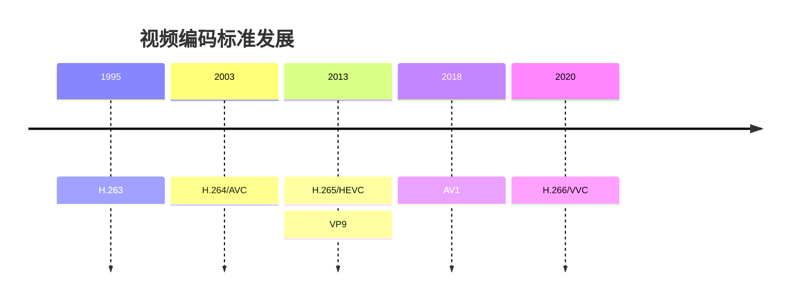

| 编码标准 | 发布年份 | 相比前代压缩提升 | iOS硬件支持 | 专利费 |
|----------|----------|-----------------|------------|--------|
| H.264/AVC | 2003 | 基准 | iPhone 3GS+ | 有（MPEG-LA） |
| H.265/HEVC | 2013 | ~50% | iPhone 7+ (编码)、iPhone 6s+ (解码，A9) | 有（费用更高且复杂） |
| VP9 | 2013 | 与HEVC相当 | 软解支持 | 免费（Google） |
| AV1 | 2018 | 比HEVC再提升~30% | iPhone 15 Pro+ | 免费（AOM联盟） |

**为什么H.264至今仍是最广泛使用的标准**：虽然H.265和AV1压缩效率更高，但H.264凭借近20年的积累，拥有最广泛的硬件支持、最成熟的生态、最低的专利费用，在兼容性要求高的场景（如WebRTC、跨平台直播）中仍是首选。

压缩效率提升的代价是编码复杂度的大幅增加。H.265的编码复杂度约为H.264的2~10倍，这也是硬件编码器如此重要的原因——纯CPU软编码在移动设备上很难实时处理高分辨率的H.265。

### H.264编码流程详解

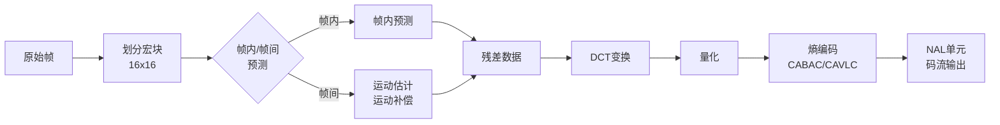

#### 1. 宏块划分

H.264将每帧图像划分为16x16像素的**宏块（Macroblock）** 作为基本编码单元。一个1080p的帧有 (1920/16) x (1080/16) = 120 x 68 = 8160个宏块。

宏块可以进一步划分为更小的子块以适应不同区域的特性：

```
16x16宏块的划分方式:
┌────────┐  ┌────┬────┐  ┌────┬────┐  ┌──┬──┬──┬──┐
│        │  │    │    │  │    │    │  │  │  │  │  │
│ 16x16  │  │16x8│16x8│  │ 8  │ 8  │  │  │  │  │  │
│        │  │    │    │  │ x  │ x  │  │8x8 8x8 8x8 8x8│
│        │  ├────┼────┤  │16  │16  │  │  │  │  │  │
│        │  │    │    │  │    │    │  ├──┼──┼──┼──┤
│        │  │    │    │  │    │    │  │  │  │  │  │
└────────┘  └────┴────┘  └────┴────┘  └──┴──┴──┴──┘
  1个分区      2个分区      2个分区      4个分区

平坦区域 → 大分区（16x16），一个预测就够
复杂区域 → 小分区（4x4），精细预测减少残差
```

H.265改进为**CTU（编码树单元）**，最大支持64x64，并通过四叉树递归划分到最小8x8。大CTU在平坦区域效率更高，这是H.265在高分辨率视频上显著优于H.264的原因之一。

#### 2. 帧内预测

帧内预测利用当前块的**相邻已编码像素**来预测当前块的内容，只编码预测残差。

```
H.264帧内预测模式（4x4亮度块，共9种模式）:

模式0: 垂直        模式1: 水平        模式2: DC(均值)
A B C D            A|               A B C D
↓ ↓ ↓ ↓            ─┼→ → → →        ↓ ↓ ↓ ↓
A B C D          E|E E E E       ← ← ← ←  (取周围像素均值填充)
A B C D          F|F F F F
A B C D          G|G G G G
A B C D          H|H H H H

模式3~8: 对角线方向预测（左下、右下、左上等）
```

编码器会尝试所有预测模式，选择使残差最小的模式。H.264的4x4块有9种模式，16x16块有4种模式。H.265扩展到35种角度预测模式（加DC和Planar共35种），预测方向更精细。

#### 3. 帧间预测（运动估计与运动补偿）

帧间预测是视频压缩最核心的技术。基本思想：当前帧的大部分内容可以用前一帧（或后一帧）的某个区域来近似表示。

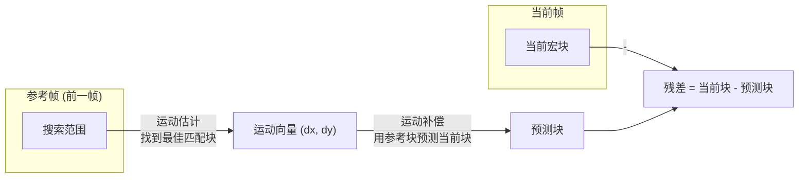

**运动估计 (Motion Estimation)**：在参考帧的搜索范围内，找到与当前宏块最匹配的区域。匹配度通常用SAD（绝对差之和）或SSD（平方差之和）衡量。搜索算法包括全搜索（精确但极慢）、菱形搜索、六边形搜索等快速算法。

**运动补偿 (Motion Compensation)**：用找到的运动向量(MV)从参考帧中取出对应区域作为预测块。MV支持**亚像素精度**——H.264支持1/4像素精度，通过插值生成半像素和1/4像素位置的值，使预测更精确。

**多参考帧**：H.264支持同时使用多个参考帧（最多16个），编码器可以从多个历史帧中选择最佳匹配，对于遮挡恢复等场景效果显著。

#### 4. DCT变换

残差数据虽然数值较小，但在空间域上仍然分散。**DCT（离散余弦变换）** 将空域数据转换到频域，使能量集中到少数低频系数上。

```
示例：一个4x4残差块经过DCT变换

空域残差:              频域DCT系数:
┌──────────────┐      ┌──────────────┐
│  2  3  1  0  │      │ 12  1  0  0  │  ← 低频（左上角）能量集中
│  1  2  1  0  │  DCT │  2  0  0  0  │
│  0  1  0  0  │ ───→ │  0  0  0  0  │  ← 高频（右下角）接近零
│  0  0  0  0  │      │  0  0  0  0  │
└──────────────┘      └──────────────┘

低频系数: 表示块的整体亮度和缓变趋势
高频系数: 表示块内的急剧变化（边缘、纹理细节）
```

H.264使用的是整数DCT（而非浮点DCT），避免了编解码端的精度不一致问题。

#### 5. 量化

量化是编码中**唯一的有损环节**。将DCT系数除以量化步长（QStep）并取整，小幅度的高频系数被量化为0，从而实现压缩。

```
量化过程: Q(x) = round(DCT(x) / QStep)

DCT系数:        量化步长QStep=4:     量化后:
┌────────────┐                     ┌────────────┐
│ 12  1  0  0│                     │  3  0  0  0│  ← 大部分高频系数变为0
│  2  0  0  0│  ÷4并取整  →        │  1  0  0  0│
│  0  0  0  0│                     │  0  0  0  0│
│  0  0  0  0│                     │  0  0  0  0│
└────────────┘                     └────────────┘
```

**QP (Quantization Parameter)** 控制量化强度，范围0~51。QP每增加6，QStep翻倍，码率约减半，画质也相应下降。

| QP范围 | 效果 | 典型场景 |
|--------|------|----------|
| 18~22 | 接近无损，高码率 | 影视后期 |
| 23~28 | 画质与码率平衡 | 流媒体、点播 |
| 29~35 | 明显压缩痕迹 | 低带宽直播 |
| 36~51 | 严重失真 | 极低码率 |

#### 6. 熵编码

量化后的系数经过**Zigzag扫描**将二维矩阵转为一维序列（从低频到高频），然后进行熵编码。

```
Zigzag扫描顺序（4x4块）:
┌─→─→──┐
│ 0  1  5  6
│ ↙ ↗ ↙ ↗
│ 2  4  7 12
│ ↗ ↙ ↗ ↙
│ 3  8 11 13
│ ↙ ↗ ↙
  9 10 14 15

这样排列使得连续的零值集中在序列尾部，便于游程编码
```

H.264支持两种熵编码：

- **CAVLC (Context-Adaptive Variable-Length Coding)**：基于上下文的自适应变长编码。编码复杂度低，Baseline Profile使用。
- **CABAC (Context-Adaptive Binary Arithmetic Coding)**：基于上下文的自适应二进制算术编码。压缩率比CAVLC高约10~15%，但编码复杂度显著更高。Main/High Profile使用。

#### 7. NAL单元与码流结构

编码后的数据被封装为**NAL (Network Abstraction Layer) 单元**，这是H.264码流的基本传输单位。

```
NAL单元结构:
┌─────────┬───────────────────────┐
│ NAL头(1B)│     RBSP数据           │
│ F|NRI|Type│                      │
└─────────┴───────────────────────┘

常见NAL Type:
  1  - 非IDR图像的Slice（P帧、B帧）
  5  - IDR图像的Slice（关键帧，清空参考帧队列）
  6  - SEI（补充增强信息）
  7  - SPS（序列参数集）
  8  - PPS（图像参数集）
```

码流有两种封装格式：

| 格式 | 分隔方式 | 用途 |
|------|----------|------|
| Annex-B | StartCode: `00 00 00 01` 或 `00 00 01` | 传输流（TS）、裸流 |
| AVCC | 4字节长度头 | MP4/MOV容器 |

iOS VideoToolbox编码输出的是AVCC格式，推流到RTMP服务器需要转为Annex-B格式。

### H.264 Profile与Level

Profile定义了编码工具集，Level定义了编码参数的上限：

| Profile | 特性 | 适用场景 |
|---------|------|----------|
| Baseline | 无B帧、无CABAC、无加权预测 | 视频通话、低延迟直播 |
| Main | 支持B帧、CABAC、加权预测 | 标清流媒体 |
| High | 在Main基础上支持8x8变换、自适应量化矩阵 | 高清流媒体、蓝光 |

Level规定了最大分辨率、帧率、码率等。例如Level 4.0支持最大1080p 30fps，Level 5.1支持4K 30fps。VideoToolbox编码时通过`kVTProfileLevel_H264_High_AutoLevel`让系统自动选择合适的Level。

### H.265相比H.264的主要改进

| 技术点 | H.264 | H.265 | 提升效果 |
|--------|-------|-------|----------|
| 基本编码单元 | 宏块 16x16 | CTU 最大64x64，四叉树划分 | 大面积平坦区域效率提升 |
| 帧内预测模式 | 9种(4x4) + 4种(16x16) | 35种角度模式 | 预测更精确 |
| 运动补偿精度 | 1/4像素 | 1/4像素 + 高级运动向量预测 | MV编码开销降低 |
| 变换 | 4x4/8x8 DCT | 4x4~32x32 DCT + DST | 适应不同块大小 |
| 环路滤波 | 去块滤波 | 去块滤波 + SAO（采样自适应偏移） | 减少振铃效应 |
| 并行化 | Slice级 | Tile + WPP（波前并行处理） | 编解码并行度提升 |

### 音频编码

| 编码标准 | 类型 | 码率范围 | iOS支持 | 特点 |
|----------|------|----------|---------|------|
| AAC | 有损 | 64~320 kbps | 硬件编解码 | 中高码率最佳 |
| MP3 | 有损 | 128~320 kbps | 软解 | 兼容性广 |
| FLAC | 无损 | ~800 kbps | iOS 11+ | 开放免费 |
| ALAC | 无损 | ~700 kbps | 原生支持 | Apple专有 |
| Opus | 有损/无损 | 6~510 kbps | iOS 17+ 原生 | 全码率表现优秀 |

#### AAC编码原理

AAC（Advanced Audio Coding）是iOS平台最核心的音频编码格式。它基于**心理声学模型**实现有损压缩：

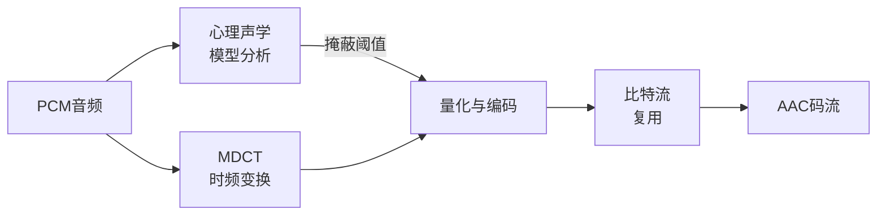

**心理声学模型**利用人耳的听觉特性来减少数据量：

- **频域掩蔽**：一个强信号会使其相邻频率的弱信号不可感知。例如1kHz的强音会掩蔽950Hz~1050Hz范围内的弱音。编码器可以对被掩蔽的频率分量使用更粗糙的量化甚至直接丢弃。
- **时域掩蔽**：一个突发强音之后的短时间内（约50~200ms），较弱的声音也无法被感知（后掩蔽）。强音到来之前约5~20ms也存在类似效应（前掩蔽）。
- **绝对听阈**：人耳在不同频率的灵敏度不同，对3~4kHz最敏感，对极低频和极高频不敏感。低于绝对听阈的信号可以直接丢弃。

**MDCT（修正离散余弦变换）**：AAC使用MDCT而非FFT作为时频变换工具，窗口大小可在长窗（2048点，频率分辨率高）和短窗（256点，时间分辨率高）之间切换。稳态信号用长窗以获得更好的频率分辨率，瞬态信号（如鼓点）用短窗以避免预回声（pre-echo）。

**AAC Profile**：

| Profile | 特点 | 典型码率 | 适用场景 |
|---------|------|----------|----------|
| AAC-LC (Low Complexity) | 标准复杂度，兼容性最好 | 128~256 kbps | 音乐流媒体 |
| HE-AAC v1 (SBR) | 低码率增强，频谱带复制 | 48~64 kbps | 网络广播 |
| HE-AAC v2 (SBR+PS) | 参数立体声，极低码率 | 24~48 kbps | 语音通话 |

SBR（频谱带复制）技术：只编码低频部分，高频通过分析低频的谐波关系推算出来，大幅降低码率。PS（参数立体声）技术：用单声道+少量参数信息来表示立体声，进一步降低码率。

## 封装格式

编码后的音视频数据需要通过**封装格式（容器）**组织在一起。封装格式本身不影响音视频质量，它只负责将编码后的音视频流、字幕、元数据按照特定规范打包存储或传输。一个形象的比喻：编码格式决定了货物怎么压缩包装，封装格式决定了用什么样的集装箱来装运。

| 封装格式 | 扩展名 | 特点 | iOS支持 |
|----------|--------|------|---------|
| MP4 | .mp4, .m4v | 最通用，基于ISO BMFF | 原生支持 |
| MOV | .mov | Apple专有，MP4的超集，功能最丰富 | 原生支持 |
| HLS | .m3u8 + .ts/.fmp4 | Apple推出的自适应流媒体协议 | 原生支持 |
| FLV | .flv | 直播推流常用，结构简单 | 需第三方库 |
| MKV | .mkv | 功能强大，支持几乎所有编码格式 | 需第三方库 |
| TS | .ts | MPEG传输流，适合广播和流媒体 | HLS内部使用 |

### MP4文件结构

MP4基于**Box**（也叫Atom）的树形结构组织数据。每个Box由Header（类型+长度）和Data（子Box或实际数据）组成：

```
Box结构:
┌──────────┬──────────┬─────────────────┐
│ Size (4B) │ Type (4B) │     Data        │
│ Box总长度  │ 如'moov' │  子Box或原始数据  │
└──────────┴──────────┴─────────────────┘
```

```
MP4文件
├── ftyp    -- 文件类型标识（如isom, mp42）
├── moov    -- 元数据容器（时间、轨道信息等）
│   ├── mvhd    -- 影片头信息（时长、时间刻度timescale）
│   ├── trak    -- 视频轨道
│   │   ├── tkhd    -- 轨道头（宽高、时长、transform矩阵）
│   │   └── mdia    -- 媒体信息
│   │       ├── mdhd    -- 媒体头（timescale、时长）
│   │       ├── hdlr    -- 处理器类型(vide/soun)
│   │       └── minf    -- 媒体具体信息
│   │           └── stbl    -- 采样表（Sample Table，最关键的部分）
│   │               ├── stsd    -- 采样描述（编码参数，如avc1/hvc1）
│   │               ├── stts    -- DTS时间到采样的映射
│   │               ├── ctts    -- CTS偏移（PTS = DTS + CTS）
│   │               ├── stss    -- 关键帧索引（哪些帧是I帧）
│   │               ├── stsc    -- 采样到chunk映射
│   │               ├── stsz    -- 每个采样的大小（字节数）
│   │               └── stco    -- chunk在文件中的偏移量
│   └── trak    -- 音频轨道
│       └── ...（结构类似视频轨道）
└── mdat    -- 实际音视频数据（编码后的裸数据）
```

**Sample Table是定位任意帧的关键**。播放器seek到某个时间点时的查找过程：

```
1. stts: 目标时间 → 第N个sample
2. stss: 从第N个sample向前找到最近的关键帧K
3. stsz: 计算第K个sample的大小
4. stsc: 第K个sample属于哪个chunk
5. stco: 该chunk在文件中的字节偏移
6. 定位到mdat中的具体位置，开始解码
```

### Timescale与时间表示

MP4中的时间不是用秒表示的，而是用**timescale（时间刻度）**来表示。一个时间值的实际秒数 = 值 / timescale。

```
timescale = 90000 (视频常用)
一帧的duration = 3000
实际时长 = 3000 / 90000 = 0.0333秒 = 33.3ms ≈ 30fps

timescale = 44100 (音频，等于采样率)
1024个采样的duration = 1024
实际时长 = 1024 / 44100 = 0.0232秒 ≈ 23.2ms
```

iOS的`CMTime`也使用类似的机制：`CMTimeMake(value: 1, timescale: 30)` 表示 1/30 秒。使用整数比而非浮点数可以避免精度累积误差。

### moov位置与Fast Start

```
普通MP4 (moov在尾部):
┌──────┬────────────────────────┬──────┐
│ ftyp │        mdat            │ moov │
└──────┴────────────────────────┴──────┘
  问题：播放器必须先下载到文件尾部获取moov才能开始播放

Fast Start MP4 (moov在头部):
┌──────┬──────┬────────────────────────┐
│ ftyp │ moov │        mdat            │
└──────┴──────┴────────────────────────┘
  优势：播放器下载少量头部数据即可开始播放
```

录制视频时moov通常在尾部（因为录制过程中元数据不断变化），录制完成后需要将moov移到头部。`AVAssetExportSession`的`shouldOptimizeForNetworkUse = true`就是做这件事。

### fMP4 (Fragmented MP4)

传统MP4的moov包含所有帧的索引，必须完整写入后文件才可用。**fMP4**将视频切成多个Fragment，每个Fragment独立包含自己的元数据(moof)和数据(mdat)：

```
fMP4结构:
┌──────┬──────┬──────┬──────┬──────┬──────┬──────┬──────┐
│ ftyp │ moov │ moof │ mdat │ moof │ mdat │ moof │ mdat │
│      │(初始)│  #1  │  #1  │  #2  │  #2  │  #3  │  #3  │
└──────┴──────┴──────┴──────┴──────┴──────┴──────┴──────┘
```

fMP4的优势：
- 每个Fragment独立可播放，天然支持流媒体
- 录制中断不会丢失已写入的Fragment
- 是DASH和现代HLS（CMAF）的底层格式

## iOS音视频框架全景

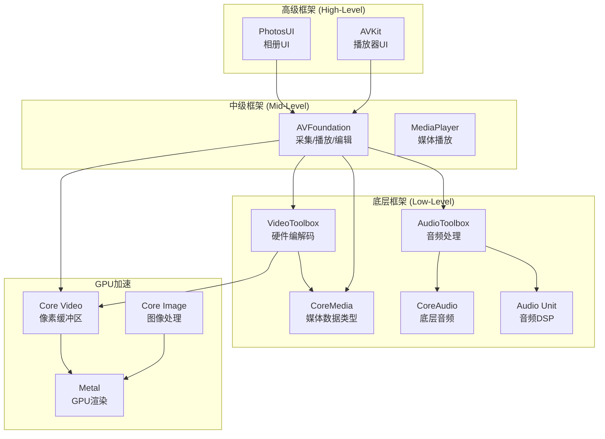

### 各框架职责

| 框架 | 职责 | 典型使用场景 |
|------|------|-------------|
| AVKit | 提供系统播放器UI（AVPlayerViewController） | 快速集成视频播放 |
| AVFoundation | 音视频采集、播放、编辑的核心框架 | 相机、播放器、视频编辑 |
| VideoToolbox | 硬件编解码（H.264/H.265） | 直播推流、自定义播放器 |
| AudioToolbox | 音频格式转换、音频队列 | 音频播放、录制 |
| CoreMedia | CMSampleBuffer、CMTime等基础数据类型 | 音视频数据处理 |
| CoreVideo | CVPixelBuffer管理 | 视频帧处理、Metal渲染 |
| CoreAudio | 底层音频I/O | 低延迟音频、实时处理 |
| Audio Unit | 音频DSP处理单元 | 混音、变声、效果器 |
| Metal | GPU计算与渲染 | 滤镜、视频渲染 |

## 视频采集

### AVCaptureSession

`AVCaptureSession`是iOS视频采集的核心类，管理从输入设备到输出目标的数据流。

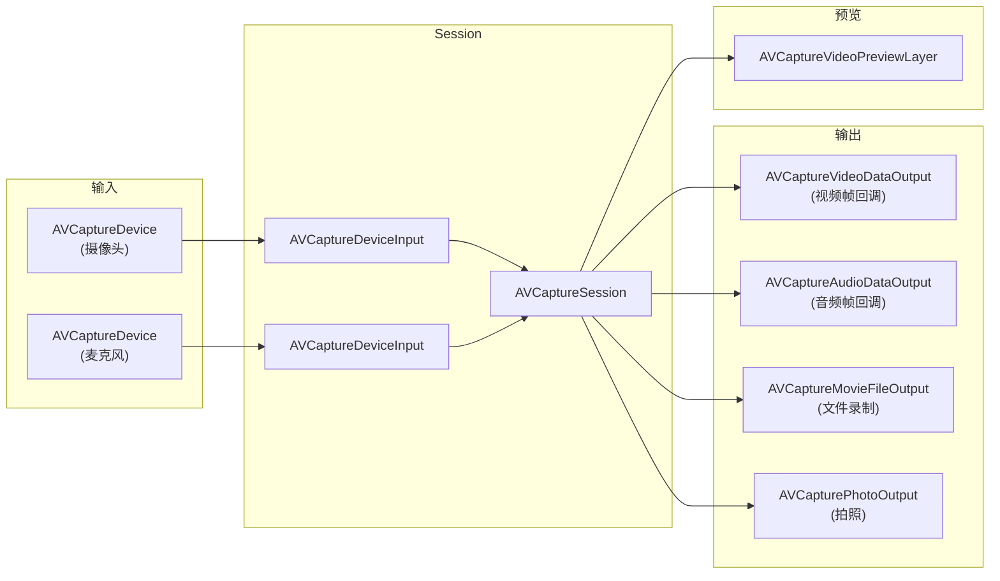

### 采集代码示例

```swift
class CameraCapture: NSObject {
    private let session = AVCaptureSession()
    private let videoOutput = AVCaptureVideoDataOutput()
    private let audioOutput = AVCaptureAudioDataOutput()
    private let processingQueue = DispatchQueue(label: "com.capture.processing")
    
    func setupSession() throws {
        session.beginConfiguration()
        defer { session.commitConfiguration() }
        
        session.sessionPreset = .hd1920x1080
        
        // 配置视频输入
        guard let videoDevice = AVCaptureDevice.default(
            .builtInWideAngleCamera, for: .video, position: .back
        ) else { throw CaptureError.deviceNotFound }
        
        let videoInput = try AVCaptureDeviceInput(device: videoDevice)
        guard session.canAddInput(videoInput) else { throw CaptureError.cannotAddInput }
        session.addInput(videoInput)
        
        // 配置音频输入
        guard let audioDevice = AVCaptureDevice.default(for: .audio) else {
            throw CaptureError.deviceNotFound
        }
        let audioInput = try AVCaptureDeviceInput(device: audioDevice)
        session.addInput(audioInput)
        
        // 配置视频输出
        videoOutput.videoSettings = [
            kCVPixelBufferPixelFormatTypeKey as String: kCVPixelFormatType_420YpCbCr8BiPlanarVideoRange
        ]
        videoOutput.setSampleBufferDelegate(self, queue: processingQueue)
        videoOutput.alwaysDiscardsLateVideoFrames = true
        session.addOutput(videoOutput)
        
        // 配置音频输出
        audioOutput.setSampleBufferDelegate(self, queue: processingQueue)
        session.addOutput(audioOutput)
    }
    
    func startCapture() {
        DispatchQueue.global(qos: .userInitiated).async {
            self.session.startRunning()
        }
    }
}

extension CameraCapture: AVCaptureVideoDataOutputSampleBufferDelegate,
                          AVCaptureAudioDataOutputSampleBufferDelegate {
    func captureOutput(_ output: AVCaptureOutput,
                       didOutput sampleBuffer: CMSampleBuffer,
                       from connection: AVCaptureConnection) {
        if output == videoOutput {
            // 处理视频帧 - sampleBuffer包含CVPixelBuffer
            guard let pixelBuffer = CMSampleBufferGetImageBuffer(sampleBuffer) else { return }
            let pts = CMSampleBufferGetPresentationTimeStamp(sampleBuffer)
            processVideoFrame(pixelBuffer, timestamp: pts)
        } else if output == audioOutput {
            // 处理音频帧 - sampleBuffer包含AudioBufferList
            processAudioSample(sampleBuffer)
        }
    }
    
    func captureOutput(_ output: AVCaptureOutput,
                       didDrop sampleBuffer: CMSampleBuffer,
                       from connection: AVCaptureConnection) {
        // 帧被丢弃时的回调，通常因为处理太慢
    }
}
```

### CMSampleBuffer

`CMSampleBuffer`是CoreMedia框架中最核心的数据结构，承载了一帧音频或视频数据及其元信息。

```
CMSampleBuffer
├── CMBlockBuffer / CVImageBuffer   -- 实际的媒体数据
│   ├── 视频: CVPixelBuffer (未压缩) 或 CMBlockBuffer (已压缩)
│   └── 音频: CMBlockBuffer (PCM数据)
├── CMFormatDescription              -- 格式信息
│   ├── 视频: 编码类型、分辨率、像素格式
│   └── 音频: 采样率、声道数、位深
├── CMTime (PTS)                     -- 显示时间戳
├── CMTime (DTS)                     -- 解码时间戳
└── Attachments                      -- 附加信息（是否关键帧等）
```

## 硬件编解码 - VideoToolbox

VideoToolbox提供直接访问硬件编解码器的能力，相比AVFoundation的封装，它提供了更底层的控制和更高的性能。

### 硬件编码 vs 软件编码

| 对比项 | 硬件编码 (VideoToolbox) | 软件编码 (FFmpeg/x264) |
|--------|------------------------|----------------------|
| 编码器 | Apple芯片内置编码器 | CPU指令集 |
| 速度 | 非常快，实时编码 | 较慢，高preset更慢 |
| 功耗 | 低 | 高，CPU占用大 |
| 画质 | 同码率下略低 | 同码率下略高 |
| 控制粒度 | 有限 | 非常细粒度 |
| 适用场景 | 直播、实时通信 | 离线转码、追求极致画质 |

### 硬件编码流程

```swift
class H264Encoder {
    private var compressionSession: VTCompressionSession?
    
    func setupEncoder(width: Int32, height: Int32) {
        let status = VTCompressionSessionCreate(
            allocator: kCFAllocatorDefault,
            width: width,
            height: height,
            codecType: kCMVideoCodecType_H264,
            encoderSpecification: nil,
            imageBufferAttributes: nil,
            compressedDataAllocator: nil,
            outputHandler: { [weak self] status, flags, sampleBuffer in
                guard status == noErr, let sampleBuffer = sampleBuffer else { return }
                self?.handleEncodedData(sampleBuffer)
            },
            refcon: nil,
            compressionSessionOut: &compressionSession
        )
        guard status == noErr, let session = compressionSession else { return }
        
        // 配置编码参数
        VTSessionSetProperty(session, key: kVTCompressionPropertyKey_RealTime, value: kCFBooleanTrue)
        VTSessionSetProperty(session, key: kVTCompressionPropertyKey_ProfileLevel,
                            value: kVTProfileLevel_H264_High_AutoLevel)
        VTSessionSetProperty(session, key: kVTCompressionPropertyKey_AverageBitRate,
                            value: (width * height * 3) as CFNumber)
        VTSessionSetProperty(session, key: kVTCompressionPropertyKey_MaxKeyFrameInterval,
                            value: 60 as CFNumber)
        VTSessionSetProperty(session, key: kVTCompressionPropertyKey_AllowFrameReordering,
                            value: kCFBooleanFalse) // 禁用B帧以降低延迟
        
        VTCompressionSessionPrepareToEncodeFrames(session)
    }
    
    func encode(pixelBuffer: CVPixelBuffer, presentationTimeStamp: CMTime) {
        guard let session = compressionSession else { return }
        
        VTCompressionSessionEncodeFrame(
            session,
            imageBuffer: pixelBuffer,
            presentationTimeStamp: presentationTimeStamp,
            duration: .invalid,
            frameProperties: nil,
            sourceFrameRefcon: nil,
            infoFlagsOut: nil
        )
    }
    
    private func handleEncodedData(_ sampleBuffer: CMSampleBuffer) {
        let isKeyFrame = !(sampleBuffer.sampleAttachments.first?[.notSync] as? Bool ?? false)
        
        if isKeyFrame {
            // 从关键帧中提取SPS/PPS
            extractParameterSets(from: sampleBuffer)
        }
        
        // 获取编码后的NAL单元数据
        guard let dataBuffer = sampleBuffer.dataBuffer else { return }
        var totalLength = 0
        var dataPointer: UnsafeMutablePointer<Int8>?
        CMBlockBufferGetDataPointer(dataBuffer, atOffset: 0, lengthAtOffsetOut: nil,
                                     totalLengthOut: &totalLength, dataPointerOut: &dataPointer)
        // 将AVCC格式转换为Annex-B格式用于网络传输
        // AVCC: [4字节长度][NAL数据]
        // Annex-B: [00 00 00 01][NAL数据]
    }
    
    private func extractParameterSets(from sampleBuffer: CMSampleBuffer) {
        guard let formatDescription = sampleBuffer.formatDescription else { return }
        
        // 提取SPS
        var spsSize = 0
        var spsCount = 0
        var spsPointer: UnsafePointer<UInt8>?
        CMVideoFormatDescriptionGetH264ParameterSetAtIndex(
            formatDescription, parameterSetIndex: 0,
            parameterSetPointerOut: &spsPointer, parameterSetSizeOut: &spsSize,
            parameterSetCountOut: &spsCount, nalUnitHeaderLengthOut: nil
        )
        
        // 提取PPS
        var ppsSize = 0
        var ppsPointer: UnsafePointer<UInt8>?
        CMVideoFormatDescriptionGetH264ParameterSetAtIndex(
            formatDescription, parameterSetIndex: 1,
            parameterSetPointerOut: &ppsPointer, parameterSetSizeOut: &ppsSize,
            parameterSetCountOut: nil, nalUnitHeaderLengthOut: nil
        )
    }
    
    deinit {
        if let session = compressionSession {
            VTCompressionSessionInvalidate(session)
        }
    }
}
```

### SPS与PPS

**SPS (Sequence Parameter Set)**：序列参数集，包含编码的全局参数，如profile、level、分辨率、帧率等。

**PPS (Picture Parameter Set)**：图像参数集，包含每帧编码的参数，如熵编码模式、slice分组等。

解码器在解码任何帧之前，必须先接收到SPS和PPS。在直播场景中，通常在每个关键帧前发送SPS/PPS。

### 硬件解码流程

```swift
class H264Decoder {
    private var decompressionSession: VTDecompressionSession?
    private var formatDescription: CMVideoFormatDescription?
    
    func setupDecoder(sps: Data, pps: Data) {
        let spsPointer = sps.withUnsafeBytes { $0.baseAddress!.assumingMemoryBound(to: UInt8.self) }
        let ppsPointer = pps.withUnsafeBytes { $0.baseAddress!.assumingMemoryBound(to: UInt8.self) }
        let parameterSets: [UnsafePointer<UInt8>] = [spsPointer, ppsPointer]
        let parameterSetSizes: [Int] = [sps.count, pps.count]
        
        // 从SPS/PPS创建格式描述
        CMVideoFormatDescriptionCreateFromH264ParameterSets(
            allocator: kCFAllocatorDefault,
            parameterSetCount: 2,
            parameterSetPointers: parameterSets,
            parameterSetSizes: parameterSetSizes,
            nalUnitHeaderLength: 4,
            formatDescriptionOut: &formatDescription
        )
        
        guard let formatDescription = formatDescription else { return }
        
        let outputAttributes: [String: Any] = [
            kCVPixelBufferPixelFormatTypeKey as String: kCVPixelFormatType_420YpCbCr8BiPlanarVideoRange,
            kCVPixelBufferMetalCompatibilityKey as String: true
        ]
        
        var callbackRecord = VTDecompressionOutputCallbackRecord(
            decompressionOutputCallback: decompressionCallback,
            decompressionOutputRefCon: Unmanaged.passUnretained(self).toOpaque()
        )
        
        VTDecompressionSessionCreate(
            allocator: kCFAllocatorDefault,
            formatDescription: formatDescription,
            decoderSpecification: nil,
            imageBufferAttributes: outputAttributes as CFDictionary,
            outputCallback: &callbackRecord,
            decompressionSessionOut: &decompressionSession
        )
    }
}

private func decompressionCallback(
    decompressionOutputRefCon: UnsafeMutableRawPointer?,
    sourceFrameRefCon: UnsafeMutableRawPointer?,
    status: OSStatus,
    infoFlags: VTDecodeInfoFlags,
    imageBuffer: CVImageBuffer?,
    presentationTimeStamp: CMTime,
    presentationDuration: CMTime
) {
    guard status == noErr, let pixelBuffer = imageBuffer else { return }
    // pixelBuffer即为解码后的YUV数据，可用于渲染显示
}
```

## 视频播放

### AVPlayer架构

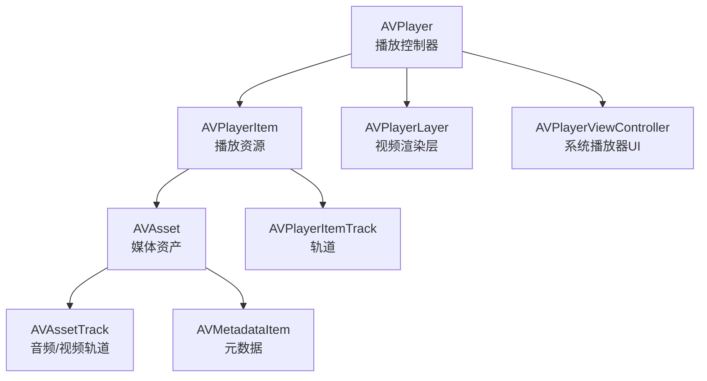

### AVPlayer播放流程

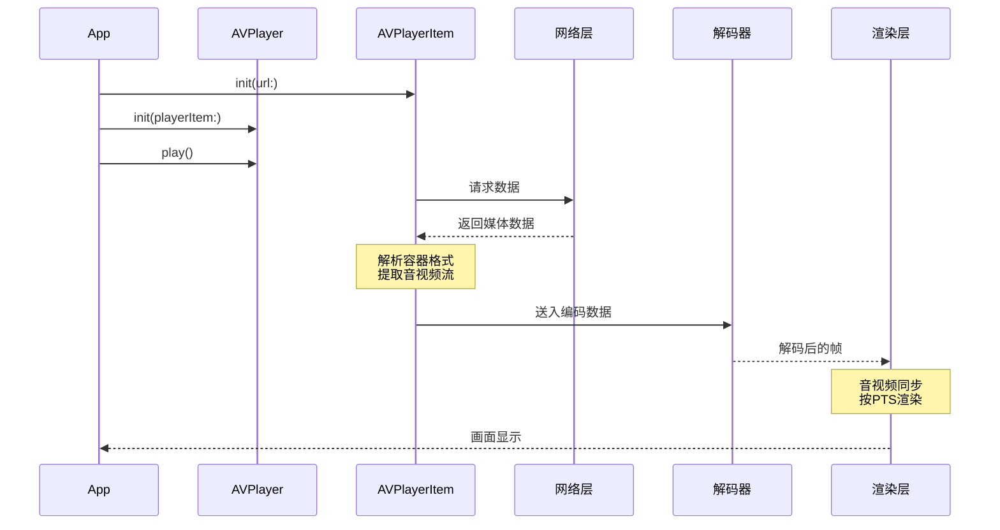

### 播放状态监听

AVPlayer使用KVO来监听播放状态，这是iOS音视频开发中的核心模式：

```swift
class VideoPlayerManager {
    private var player: AVPlayer?
    private var playerItem: AVPlayerItem?
    private var timeObserver: Any?
    private var observations: [NSKeyValueObservation] = []
    
    func setupPlayer(with url: URL) {
        let asset = AVURLAsset(url: url)
        playerItem = AVPlayerItem(asset: asset)
        player = AVPlayer(playerItem: playerItem)
        
        // 监听播放状态
        observations.append(
            playerItem!.observe(\.status) { [weak self] item, _ in
                switch item.status {
                case .readyToPlay:
                    self?.player?.play()
                case .failed:
                    print("播放失败: \(item.error?.localizedDescription ?? "")")
                case .unknown:
                    break
                @unknown default:
                    break
                }
            }
        )
        
        // 监听缓冲进度
        observations.append(
            playerItem!.observe(\.loadedTimeRanges) { item, _ in
                guard let timeRange = item.loadedTimeRanges.first?.timeRangeValue else { return }
                let bufferedDuration = CMTimeGetSeconds(timeRange.start) + CMTimeGetSeconds(timeRange.duration)
                // 更新缓冲进度UI
            }
        )
        
        // 监听缓冲是否足够播放
        observations.append(
            playerItem!.observe(\.isPlaybackLikelyToKeepUp) { item, _ in
                if item.isPlaybackLikelyToKeepUp {
                    // 缓冲足够，可以流畅播放
                }
            }
        )
        
        // 周期性时间观察（更新进度条）
        timeObserver = player?.addPeriodicTimeObserver(
            forInterval: CMTime(seconds: 0.5, preferredTimescale: 600),
            queue: .main
        ) { [weak self] time in
            let currentSeconds = CMTimeGetSeconds(time)
            // 更新播放进度UI
        }
        
        // 播放完成通知
        NotificationCenter.default.addObserver(
            self, selector: #selector(playerDidFinish),
            name: .AVPlayerItemDidPlayToEndTime, object: playerItem
        )
    }
    
    @objc private func playerDidFinish() {
        player?.seek(to: .zero)
    }
    
    deinit {
        if let observer = timeObserver {
            player?.removeTimeObserver(observer)
        }
    }
}
```

## 音视频同步

音视频同步是播放器的核心难题。由于音频和视频的解码速度不同、渲染时钟不同，必须有一个同步机制保证音画一致。

### 三种同步策略

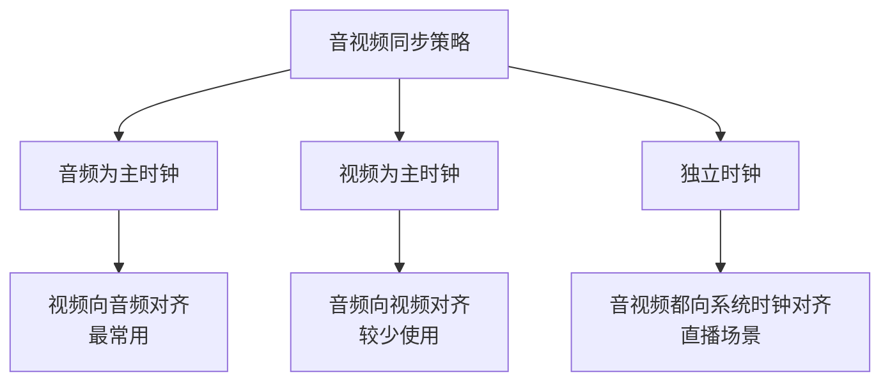

**音频为主时钟（Audio Master Clock）** 是最常用的方案，原因：
- 人耳对音频不连续（卡顿、加速）非常敏感
- 音频采样率固定，播放速度由声卡硬件驱动，天然是稳定的时钟源
- 视频丢帧或重复帧的感知度相对较低

### 同步原理

```
同步流程:
1. 音频按固定采样率持续播放，维护音频时钟 audio_clock
2. 取出待渲染的视频帧，读取其PTS
3. 计算差值: diff = video_pts - audio_clock
4. 根据diff决定:
   - diff > 阈值(如40ms): 视频超前，延迟渲染（等待）
   - diff < -阈值: 视频落后，丢弃当前帧（追赶）
   - |diff| <= 阈值: 在可接受范围内，正常渲染
```

## 流媒体协议

### HLS (HTTP Live Streaming)

HLS是Apple推出的流媒体协议，也是iOS原生支持最好的协议。

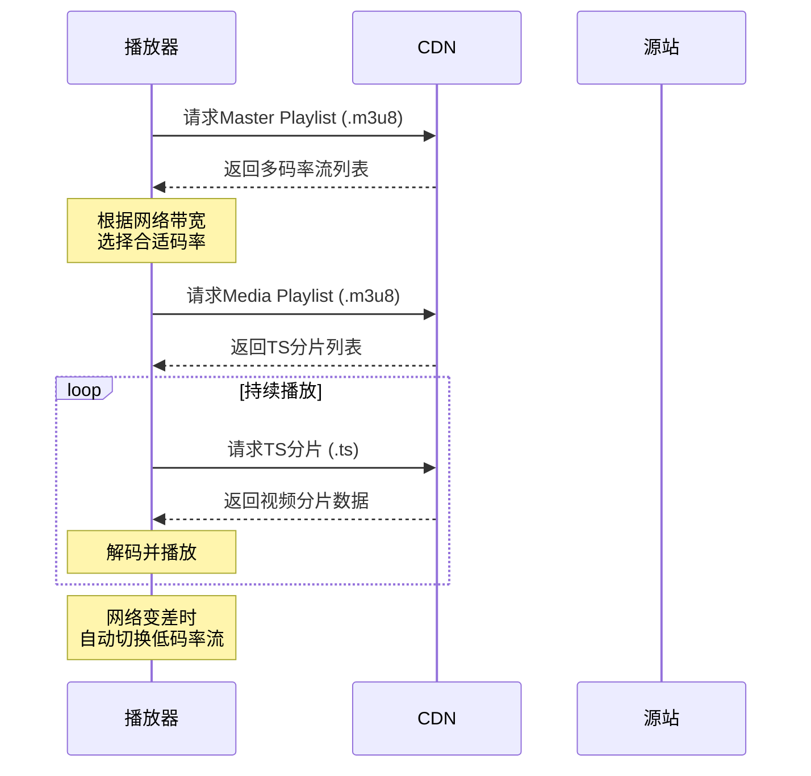

**Master Playlist示例**：

```
#EXTM3U
#EXT-X-STREAM-INF:BANDWIDTH=1280000,RESOLUTION=640x360
low/playlist.m3u8
#EXT-X-STREAM-INF:BANDWIDTH=2560000,RESOLUTION=960x540
mid/playlist.m3u8
#EXT-X-STREAM-INF:BANDWIDTH=7680000,RESOLUTION=1920x1080
high/playlist.m3u8
```

**Media Playlist示例**：

```
#EXTM3U
#EXT-X-VERSION:3
#EXT-X-TARGETDURATION:10
#EXT-X-MEDIA-SEQUENCE:0
#EXTINF:9.009,
segment0.ts
#EXTINF:9.009,
segment1.ts
#EXTINF:9.009,
segment2.ts
#EXT-X-ENDLIST
```

### HLS vs RTMP vs WebRTC

| 协议 | 延迟 | 传输层 | 适用场景 | iOS支持 |
|------|------|--------|----------|---------|
| HLS | 6~30s（普通）/ 2~6s（低延迟） | HTTP/TCP | 点播、大规模直播 | 原生支持 |
| RTMP | 1~3s | TCP | 推流、直播 | 需第三方库 |
| WebRTC | < 500ms | UDP/SRTP | 实时通信、连麦 | 原生WebKit支持 |
| SRT | 120ms~1s | UDP | 专业直播传输 | 需第三方库 |
| DASH | 2~10s | HTTP/TCP | 跨平台点播 | 需第三方库 |

### Low-Latency HLS

Apple在iOS 13引入低延迟HLS，通过以下技术将延迟从6~30秒降低到2秒左右：

- **Partial Segments**：将TS切片进一步细分为部分片段，减少单片延迟
- **Blocking Playlist Reload**：服务端长连接，新片段就绪时立即返回
- **Preload Hints**：提前告知客户端下一个片段地址，减少请求延迟
- **Delta Updates**：Playlist增量更新，减少传输数据量

## 音频处理

### Audio Unit

Audio Unit是iOS最底层的音频处理框架，提供低延迟的音频输入输出和DSP处理能力。

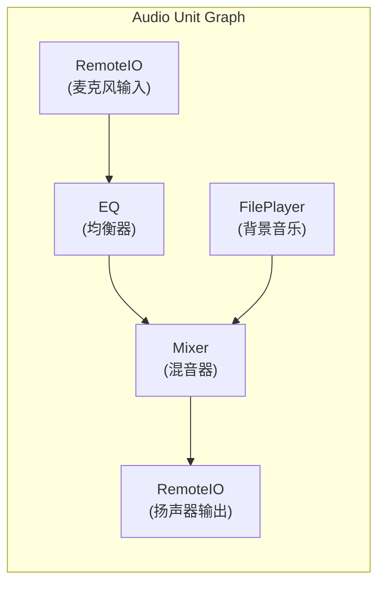

### AVAudioEngine

`AVAudioEngine`是Apple对Audio Unit的高级封装，提供更友好的API：

```swift
class AudioProcessor {
    private let engine = AVAudioEngine()
    private let playerNode = AVAudioPlayerNode()
    private let pitchEffect = AVAudioUnitTimePitch()
    private let reverbEffect = AVAudioUnitReverb()
    
    func setupAudioChain() {
        engine.attach(playerNode)
        engine.attach(pitchEffect)
        engine.attach(reverbEffect)
        
        // 构建音频处理链
        let format = engine.mainMixerNode.outputFormat(forBus: 0)
        engine.connect(playerNode, to: pitchEffect, format: format)
        engine.connect(pitchEffect, to: reverbEffect, format: format)
        engine.connect(reverbEffect, to: engine.mainMixerNode, format: format)
        
        // 变调（不变速）
        pitchEffect.pitch = 500 // 以音分为单位，100 = 半音
        
        // 混响效果
        reverbEffect.loadFactoryPreset(.largeHall)
        reverbEffect.wetDryMix = 30
        
        try? engine.start()
    }
    
    func installTap() {
        let inputNode = engine.inputNode
        let format = inputNode.inputFormat(forBus: 0)
        
        // 安装音频采集回调（实时获取麦克风数据）
        inputNode.installTap(onBus: 0, bufferSize: 1024, format: format) { buffer, time in
            // buffer: AVAudioPCMBuffer - 包含PCM音频数据
            // 可用于音频分析（频谱、音量）、录制或实时处理
            let channelData = buffer.floatChannelData?[0]
            let frameLength = Int(buffer.frameLength)
            
            // 计算音量（RMS）
            var rms: Float = 0
            vDSP_measqv(channelData!, 1, &rms, vDSP_Length(frameLength))
            rms = sqrtf(rms)
            let dbLevel = 20 * log10f(rms)
        }
    }
}
```

## Metal视频渲染

使用Metal直接渲染视频帧可以实现高性能的自定义视频渲染和滤镜效果。

### 渲染流程


### YUV转RGB的Metal Shader

```metal
#include <metal_stdlib>
using namespace metal;

struct VertexOut {
    float4 position [[position]];
    float2 texCoord;
};

fragment float4 yuvToRGBFragment(
    VertexOut in [[stage_in]],
    texture2d<float> yTexture [[texture(0)]],
    texture2d<float> uvTexture [[texture(1)]]
) {
    constexpr sampler textureSampler(mag_filter::linear, min_filter::linear);
    
    float y = yTexture.sample(textureSampler, in.texCoord).r;
    float2 uv = uvTexture.sample(textureSampler, in.texCoord).rg;
    
    // BT.601 YUV to RGB
    float u = uv.x - 0.5;
    float v = uv.y - 0.5;
    
    float r = y + 1.402 * v;
    float g = y - 0.344 * u - 0.714 * v;
    float b = y + 1.772 * u;
    
    return float4(r, g, b, 1.0);
}
```

NV12格式的CVPixelBuffer包含两个平面：Y平面（亮度）和UV交错平面（色度）。通过`CVMetalTextureCacheCreateTextureFromImage`将它们分别映射为Metal纹理，在Fragment Shader中完成YUV到RGB的转换。

## 视频编辑

### AVComposition

`AVComposition`是iOS视频编辑的核心，支持多轨道的音视频拼接、裁剪和混合。

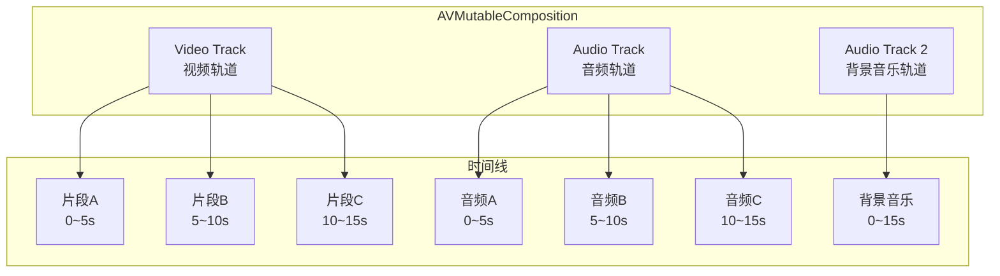

```swift
func composeVideos(clips: [AVAsset]) async throws -> AVMutableComposition {
    let composition = AVMutableComposition()
    
    guard let videoTrack = composition.addMutableTrack(
        withMediaType: .video, preferredTrackID: kCMPersistentTrackID_Invalid
    ) else { throw EditError.trackCreationFailed }
    
    guard let audioTrack = composition.addMutableTrack(
        withMediaType: .audio, preferredTrackID: kCMPersistentTrackID_Invalid
    ) else { throw EditError.trackCreationFailed }
    
    var currentTime = CMTime.zero
    
    for clip in clips {
        let duration = try await clip.load(.duration)
        
        if let clipVideoTrack = try await clip.loadTracks(withMediaType: .video).first {
            try videoTrack.insertTimeRange(
                CMTimeRange(start: .zero, duration: duration),
                of: clipVideoTrack,
                at: currentTime
            )
        }
        
        if let clipAudioTrack = try await clip.loadTracks(withMediaType: .audio).first {
            try audioTrack.insertTimeRange(
                CMTimeRange(start: .zero, duration: duration),
                of: clipAudioTrack,
                at: currentTime
            )
        }
        
        currentTime = CMTimeAdd(currentTime, duration)
    }
    
    return composition
}
```

### 视频导出

```swift
func exportVideo(composition: AVComposition, to outputURL: URL) async throws {
    guard let exportSession = AVAssetExportSession(
        asset: composition, presetName: AVAssetExportPresetHighestQuality
    ) else { throw EditError.exportFailed }
    
    exportSession.outputURL = outputURL
    exportSession.outputFileType = .mp4
    exportSession.shouldOptimizeForNetworkUse = true // moov前置，支持Fast Start
    
    await exportSession.export()
    
    if exportSession.status == .failed {
        throw exportSession.error ?? EditError.exportFailed
    }
}
```

## 性能优化

### 内存管理

音视频处理涉及大量内存操作，需要特别注意：

| 优化策略 | 说明 |
|----------|------|
| CVPixelBufferPool | 复用像素缓冲区，避免频繁alloc/dealloc |
| 及时释放CMSampleBuffer | 使用`CFRelease`或出作用域自动释放 |
| 避免不必要的数据拷贝 | 使用`CVPixelBufferGetBaseAddress`直接访问 |
| 控制解码缓冲区大小 | 限制预解码帧数，防止内存暴涨 |
| 降低分辨率处理 | 预览用低分辨率，导出用高分辨率 |

### 线程模型

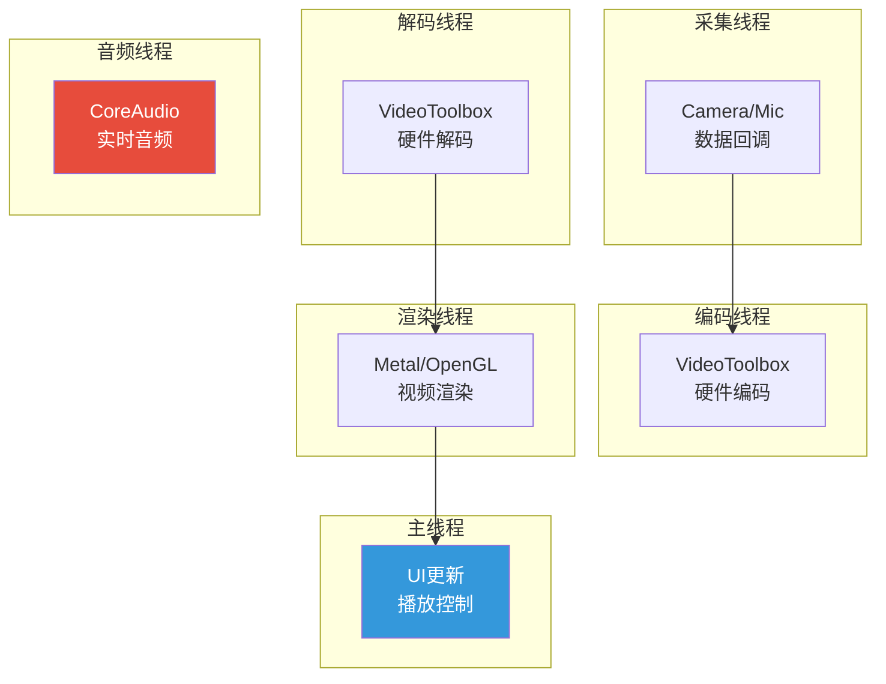

音频回调线程是**实时线程**，有严格的时间约束，在此线程中禁止：
- 内存分配（malloc）
- 加锁（可能阻塞）
- Objective-C消息发送（可能触发锁）
- 文件I/O
- 网络请求

### 常见性能指标

| 指标 | 目标值 | 监控方式 |
|------|--------|----------|
| 编码帧率 | >= 采集帧率 | 统计编码回调频率 |
| 首帧时间 | < 500ms | 从play()到第一帧渲染 |
| 卡顿率 | < 1% | 统计丢帧次数 / 总帧数 |
| 内存占用 | 稳定，无持续增长 | Instruments Memory |
| CPU占用 | < 30%（硬编码场景） | Instruments CPU |
| 音视频同步差 | < 40ms | |diff| = |video_pts - audio_clock| |

## 常见问题与排查

| 问题 | 可能原因 | 排查方向 |
|------|----------|----------|
| 绿屏/花屏 | 像素格式不匹配、缓冲区错误 | 检查PixelFormat设置、CVPixelBuffer尺寸 |
| 音画不同步 | PTS处理错误、时钟漂移 | 检查PTS传递链路、同步策略 |
| 播放卡顿 | 解码慢、渲染阻塞主线程 | Instruments检查CPU/GPU、检查线程模型 |
| 内存暴涨 | SampleBuffer未释放、解码缓冲区过大 | Instruments Memory Leaks |
| 编码后画质差 | 码率设置过低、QP过高 | 调高AverageBitRate、检查profile |
| 首帧慢 | moov在文件尾部、缓冲策略保守 | 启用Fast Start、调整preferredForwardBufferDuration |
| 后台音频中断 | 未配置Audio Session | 设置AVAudioSession.Category为playback |
